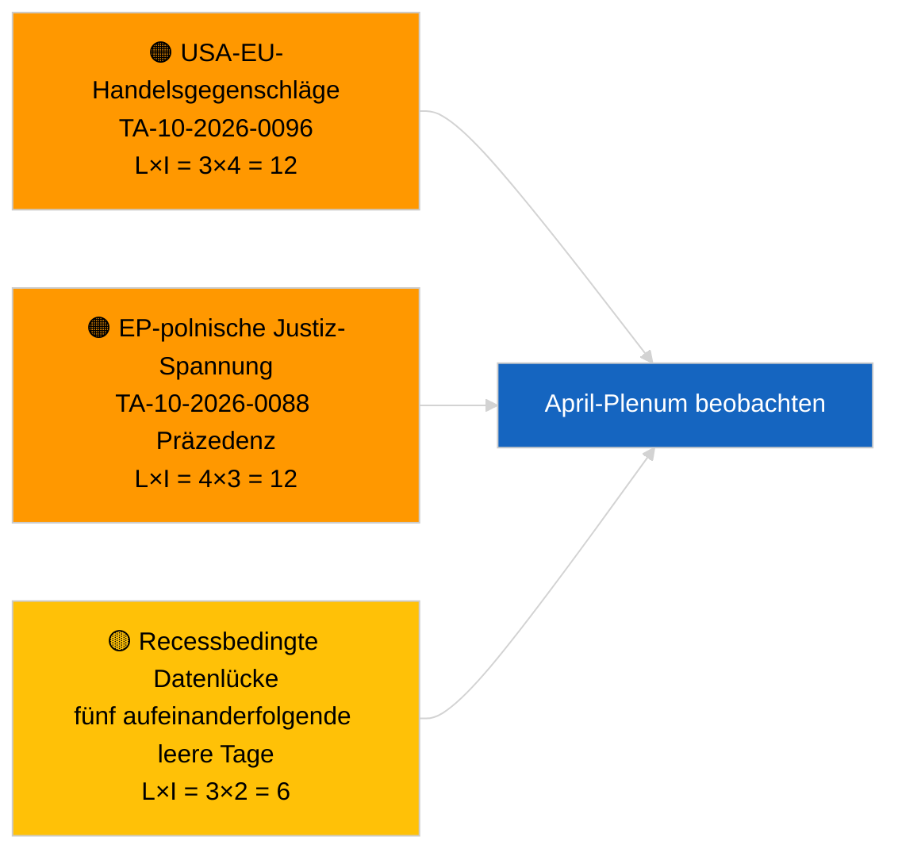

<!-- SPDX-FileCopyrightText: 2026 Hack23 AB -->
<!-- SPDX-License-Identifier: Apache-2.0 -->

# Führungskräfte-Briefing — Aktuelle Meldungen | 2026-03-31

**Einstufung:** OSINT | Öffentliche parlamentarische Aufzeichnung
**Vertrauen:** 🟢 Hoch (strukturelle Bewertung für Recessperiode)
**Erstellt:** 2026-03-31T00:00:00Z (retrospektives Briefing)
**Artikeltyp:** Aktuelle Meldungen
**Quelle:** Offenes Datenportal des Europäischen Parlaments

---

## 🎯 BLUF

**Kein Breaking-Signal am 31.3.2026; letzter Tag der ersten Recesswoche des EP nach März.** Das Parlament befindet sich in der interssionellen Pause zwischen der Brüsseler Mini-Plenarsitzung (25.–26. März) und der Straßburger Plenarsitzung (27.–30. April). Der Artikel bestätigt null neue angenommene Texte mit heutigem Datum und null neu eröffnete Verfahren. Das jüngste substantielle Carry-over-Signal verbleibt aus den Brüsseler Annahmen vom 26. März — die Braun-Immunitätsaufhebung (TA-10-2026-0088) und die US-Zollanpassungsverordnung (TA-10-2026-0096) — beide für die Q2-Beobachtungslisten relevant. Stabilitätswert und Koalitionsarithmetik unverändert. **🟢 HOHES Vertrauen**, dass die Inaktivität kalenderbedingt ist.

---

## 🧭 3 Entscheidungen, die dieses Briefing unterstützt

| # | Entscheidung | Entscheider | Frist | Belege |
|:-:|--------------|-------------|:-----:|--------|
| 1 | **Redaktionell:** TÄGLICHE Nachricht ÜBERSPRINGEN; Wochenzusammenfassung bei Bedarf erstellen | Redakteur | +12h | Fünf aufeinanderfolgende Recesstage ohne neue Aktivität |
| 2 | **Monitoring:** EP-API-Zustand nach dem 6/8-Feed-404-Muster vom 2026-04-01 überprüfen | Datenpipeline | 2026-04-02 | Anhaltende 404-Fehler verschieben sich zum Incident-Response |
| 3 | **Vorausschau:** Ausschuss-Arbeitswoche 13.–17. April löst vorplenaren Nachrichtenzyklus aus | Analyseleiterin | 2026-04-13 | Ausschussentwürfe bestimmen typischerweise 70–80 % der Plenar-Ergebnisse |

---

## 📰 60-Sekunden-Lektüre

- 🔴 **Keine Tier-1-Meldungen** — fünf aufeinanderfolgende Recesstage nun verzeichnet. (🟢 Hoch)
- 🟠 **Keine neuen Verfahren eröffnet oder am 2026-03-31 datierte angenommene Texte.** (🟢 Hoch)
- 🟢 **Koalitionsarithmetik stabil** — PPE 38 % / S&D 22 % Große Koalition 60 % bleibt der einzige Mehrheitspfad. (🟢 Hoch)
- 🟡 **Carry-over-Risiko:** Präzedenz der Braun-Immunitätsaufhebung (TA-10-2026-0088) schafft Vorlage für weitere EP-Fälle zum polnischen Justizwesen — retrospektiv durch Jaki-Aufhebung im April bestätigt. (🟡 Mittel zum damaligen Zeitpunkt)
- 🔵 **Wirtschaftliches Carry-over:** US-Zollanpassungsverordnung (TA-10-2026-0096) und HDV-Emissionsgutschriften (TA-10-2026-0084) bleiben dominierende externe/industrielle Signale. (🟢 Hoch)
- 🟣 **Querverweis:** siehe `2026-04-01/breaking` für den ersten vollständigen Bericht über Zuverlässigkeitsanomalien bei Post-März-Feed-Endpunkten. (🟢 Hoch)
- 🩷 **Störungsvektor:** kein akuter; strukturelle PPE-Dominanz und US-Handelsdruckrisiken übernommen. (🟡 Mittel)
- ⚪ **Übertrag:** Mercosur-EuGH-Vorlage TA-10-2026-0008 wartet noch auf Gutachten.

---

## 🗂️ Top-Dokumente / Verfahrenstabelle

| Rang | EP-Referenz | Titel (kurz) | Bedeutung | Vertrauen | Status |
|:----:|-------------|--------------|:---------:|:---------:|--------|
| 1 | — | Keine neuen Verfahren oder angenommene Texte am 2026-03-31 | 0,0 | 🟢 HOCH | Recess — keine Aktivität |
| 2 | TA-10-2026-0096 | US-Zollanpassungsverordnung (Carry-over) | 7,0 | 🟢 HOCH | Angenommen 26. März; Beobachtung |
| 3 | TA-10-2026-0088 | Braun-Immunitätsaufhebung (Carry-over) | 6,5 | 🟢 HOCH | Angenommen 26. März; Präzedenz |

---

## ⚠️ Risiko- und Bedrohungsübersicht

| Risiko | W | A | Score | Auslöser | Quelle | Admiralitätsbewertung |
|--------|:-:|:-:|:-----:|----------|--------|-----------------------|
| USA-EU-Handelsgegenschlag | 3 | 4 | 12 | US-Gegenankündigung | TA-10-2026-0096 | A1 |
| EP-polnische Justiz-Ausbreitung | 4 | 3 | 12 | Weitere Immunitätsaufhebungen | TA-10-2026-0088 | A1 |
| PPE strukturelle Dominanz (38 %) | 4 | 3 | 12 | Q2 Minderheitsdefensivblock | Koalitionsarithmetik | A2 |
| Recess-Datenlücke | 3 | 2 | 6 | Fünf leere Tage nacheinander | Tägliche Artikelserie | B2 |

---

## 🔮 Top-Zukunftsauslöser

**EP-Ausschuss-Arbeitswoche 13.–17. April 2026.** Ausschussentwürfe und Verhandlungen der Schattenberichterstatter in diesem Zeitfenster bestimmen den Großteil der Plenar-Ergebnisse vom 27.–30. April voraus. Das erste wirklich handlungsfähige Breaking-Signal wird aus den Ausschussdokument-Feeds in diesem Zeitfenster kommen.

---

## 🛡️ Bewertung der Quellenqualität

- **Primärquellen:** Offenes EP-Datenportal: angenommene Texte und Verfahrens-Feeds (Artikel bestätigt null Einträge mit Datum 2026-03-31).
- **Datenbeschränkungen:** Dieselbe Frage zur EP-API-Feed-Zuverlässigkeit, die sich am 2026-04-01 deutlich materialisiert; der heutige Artikel kennzeichnet das Muster noch nicht.
- **Vertrauen in „keine neue Aktivität":** 🟢 Hoch.
- **Vertrauen in Vorwärtsinferenz:** 🟡 Mittel (basierend auf dem historischen Recessmuster von EP10).

---

## 📎 Links

| Link | Pfad |
|------|------|
| Artikel | `./article.md` |
| Manifest | `./manifest.json` |
| Schwesterbriefe | `analysis/daily/2026-03-27/`, `2026-03-28/`, `2026-04-01/breaking/` |

---

## 🔄 Querverweis auf vorherigen Lauf

**Vorherige Läufe:** 2026-03-27, 2026-03-28 tägliche Artikel — beide verzeichneten Inaktivität der Recessperiode.

**Delta:** Die Abfolge von fünf aufeinanderfolgenden leeren Tagen stärkt das 🟢 HOHE Vertrauen, dass das Muster kalenderbedingt und kein Datenpipelinefehler ist. Die erste Feed-API-Anomalie wird am folgenden Tag verzeichnet (Artikel 2026-04-01).

---

**Dokumentenkontrolle**
- **Vorlage:** `/analysis/templates/executive-brief.md`
- **Artefaktpfad:** `analysis/daily/2026-03-31/breaking/executive-brief.md`
- **Einstufung:** Öffentlich
- **Retrospektive Erstellung:** Auffüllsitzung für Läufe vor der Stage-B-EB-Anforderung.
