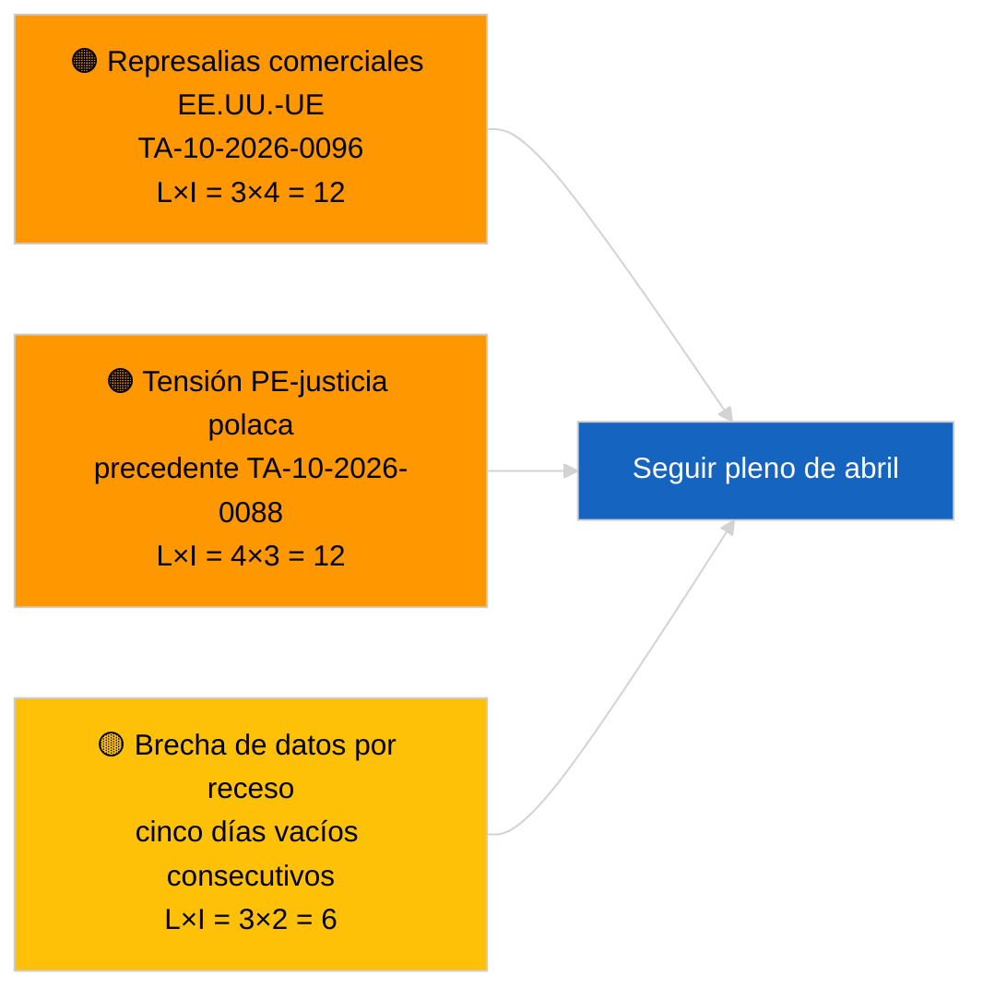

<!-- SPDX-FileCopyrightText: 2026 Hack23 AB -->
<!-- SPDX-License-Identifier: Apache-2.0 -->

# Informe ejecutivo — Noticias de última hora | 2026-03-31

**Clasificación:** OSINT | Registro parlamentario público
**Confianza:** 🟢 Alta (evaluación estructural para período de receso)
**Creado:** 2026-03-31T00:00:00Z (informe retrospectivo)
**Tipo de artículo:** Noticias de última hora
**Fuente:** Portal de datos abiertos del Parlamento Europeo

---

## 🎯 BLUF

**Sin señal de última hora el 31.3.2026; último día de la primera semana de receso del PE tras marzo.** El Parlamento está en pausa intersesional entre el mini-pleno de Bruselas (25–26 de marzo) y el pleno de Estrasburgo (27–30 de abril). El informe confirma cero nuevos textos adoptados con fecha de hoy y cero nuevos procedimientos abiertos. La señal de arrastre más reciente subsiste de las adopciones de Bruselas del 26 de marzo — el levantamiento de inmunidad de Braun (TA-10-2026-0088) y el reglamento de ajuste arancelario de EE. UU. (TA-10-2026-0096) — ambos relevantes para las listas de seguimiento del T2. El índice de estabilidad y la aritmética de coaliciones permanecen sin cambios. **🟢 ALTA CONFIANZA** en que la inactividad es de carácter calendárico.

---

## 🧭 3 Decisiones que respalda este informe

| # | Decisión | Responsable | Plazo | Evidencia |
|:-:|----------|-------------|:-----:|-----------|
| 1 | **Editorial:** OMITIR la noticia DIARIA; elaborar resumen semanal si es necesario | Editor | +12h | Cinco días consecutivos de receso sin nueva actividad |
| 2 | **Seguimiento:** Verificar el estado de la API del PE tras el patrón de 6/8 errores 404 del 2026-04-01 | Equipo de datos | 2026-04-02 | Los errores 404 persistentes escalan a respuesta de incidentes |
| 3 | **Anticipación:** La semana de trabajo en comisión del 13–17 de abril activa el ciclo informativo previo al pleno | Jefa de análisis | 2026-04-13 | Los borradores de comisión determinan típicamente el 70–80 % de los resultados plenarios |

---

## 📰 Lectura de 60 segundos

- 🔴 **Sin artículos de primer nivel** — cinco días consecutivos de receso ya registrados. (🟢 Alta)
- 🟠 **Ningún procedimiento nuevo abierto ni texto adoptado con fecha 2026-03-31.** (🟢 Alta)
- 🟢 **Aritmética de coalición estable** — gran coalición PPE 38 % / S&D 22 % con 60 % sigue siendo el único camino a la mayoría. (🟢 Alta)
- 🟡 **Riesgo de arrastre:** El precedente del levantamiento de inmunidad de Braun (TA-10-2026-0088) crea una plantilla para otros casos del PE sobre justicia polaca — confirmado retrospectivamente por el levantamiento de Jaki en abril. (🟡 Media en aquel momento)
- 🔵 **Arrastre económico:** El reglamento de ajuste arancelario de EE. UU. (TA-10-2026-0096) y los créditos de emisiones de vehículos pesados (TA-10-2026-0084) siguen siendo las principales señales externas/industriales. (🟢 Alta)
- 🟣 **Referencia cruzada:** ver `2026-04-01/breaking` para el primer informe completo sobre anomalías en la fiabilidad de los puntos finales de los feeds post-marzo. (🟢 Alta)
- 🩷 **Vector de disrupción:** sin urgencia; dominancia estructural del PPE y riesgos de presión comercial estadounidense trasladados. (🟡 Media)
- ⚪ **Traslado:** Remisión Mercosur-TJUE TA-10-2026-0008 pendiente aún de dictamen.

---

## 🗂️ Documentos destacados / Tabla de procedimientos

| Rango | Referencia PE | Título (abreviado) | Importancia | Confianza | Estado |
|:-----:|---------------|--------------------|:-----------:|:---------:|--------|
| 1 | — | Sin nuevos procedimientos ni textos adoptados el 2026-03-31 | 0,0 | 🟢 ALTA | Receso — sin actividad |
| 2 | TA-10-2026-0096 | Reglamento de ajuste arancelario de EE. UU. (arrastre) | 7,0 | 🟢 ALTA | Adoptado el 26 de marzo; en seguimiento |
| 3 | TA-10-2026-0088 | Levantamiento de inmunidad de Braun (arrastre) | 6,5 | 🟢 ALTA | Adoptado el 26 de marzo; precedente |

---

## ⚠️ Panorama de riesgos y amenazas

| Riesgo | P | I | Puntuación | Detonante | Fuente | Evaluación Almirantazgo |
|--------|:-:|:-:|:----------:|-----------|--------|------------------------|
| Represalias comerciales EE.UU.-UE | 3 | 4 | 12 | Anuncio de contra-medida de EE. UU. | TA-10-2026-0096 | A1 |
| Extensión PE-justicia polaca | 4 | 3 | 12 | Nuevos levantamientos de inmunidad | TA-10-2026-0088 | A1 |
| Dominancia estructural PPE (38 %) | 4 | 3 | 12 | Bloque defensivo minoritario T2 | Aritmética de coalición | A2 |
| Brecha de datos por receso | 3 | 2 | 6 | Cinco días vacíos consecutivos | Serie de artículos diarios | B2 |

---

## 🔮 Principal detonante prospectivo

**Semana de trabajo en comisión del PE del 13 al 17 de abril de 2026.** Los borradores de comisión y las negociaciones de ponentes alternativos durante este período determinan en gran parte los resultados plenarios del 27–30 de abril. La primera señal realmente accionable provendrá de los feeds de documentos de comisión durante esta ventana.

---

## 🛡️ Evaluación de la calidad de las fuentes

- **Fuentes primarias:** Portal de datos abiertos del PE: feeds de textos adoptados y procedimientos (el informe confirma cero entradas con fecha 2026-03-31).
- **Limitaciones de los datos:** La misma cuestión de fiabilidad del feed de la API del PE que se materializa claramente el 2026-04-01; el informe de hoy no señala aún el patrón.
- **Confianza en la ausencia de actividad:** 🟢 Alta.
- **Confianza en la inferencia prospectiva:** 🟡 Media (basada en el patrón histórico de receso del PE10).

---

## 📎 Enlaces

| Enlace | Ruta |
|--------|------|
| Artículo | `./article.md` |
| Manifiesto | `./manifest.json` |
| Informes hermanos | `analysis/daily/2026-03-27/`, `2026-03-28/`, `2026-04-01/breaking/` |

---

## 🔄 Referencia cruzada con ejecución anterior

**Ejecuciones anteriores:** artículos diarios del 2026-03-27 y 2026-03-28 — ambos registraban inactividad del período de receso.

**Delta:** La serie de cinco días vacíos consecutivos refuerza la 🟢 ALTA CONFIANZA en que el patrón es calendárico y no un fallo de la tubería de datos. La primera anomalía de la API de feeds se registra al día siguiente (artículo del 2026-04-01).

---

**Control documental**
- **Plantilla:** `/analysis/templates/executive-brief.md`
- **Ruta del artefacto:** `analysis/daily/2026-03-31/breaking/executive-brief.md`
- **Clasificación:** Pública
- **Creación retrospectiva:** Sesión de relleno para ejecuciones anteriores al requisito EB de la etapa B.
