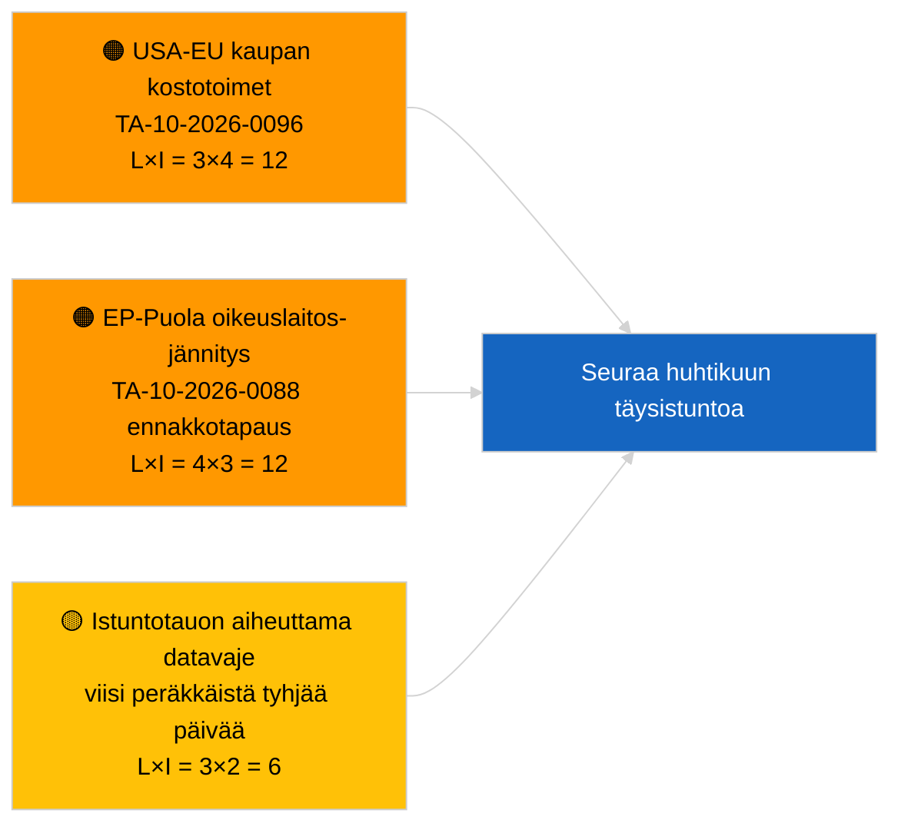

<!-- SPDX-FileCopyrightText: 2026 Hack23 AB -->
<!-- SPDX-License-Identifier: Apache-2.0 -->

# Johtoryhmän katsaus — Uutisia | 2026-03-31

**Luokittelu:** OSINT | Julkinen parlamentaarinen asiakirja
**Luottamus:** 🟢 Korkea (istuntotauon rakenteellinen arvio)
**Luotu:** 2026-03-31T00:00:00Z (takautuva katsaus)
**Artikkelityyppi:** Uutisia
**Lähde:** Euroopan parlamentin avoin dataporttaali

---

## 🎯 BLUF

**Ei uutissignaalia 31.3.2026; EP:n ensimmäisen maaliskuun jälkeisen istuntotaukoviikon viimeinen päivä.** Parlamentti on Brysselin minitäysistunnon (25.–26. maaliskuuta) ja Strasbourgin täysistunnon (27.–30. huhtikuuta) välisessä istuntovälissä. Artikkeli vahvistaa nolla uutta tänään päivättyä hyväksyttyä tekstiä ja nolla uutta avattua menettelyä. Viimeisimmät substantiaaliset carryover-signaalit ovat peräisin 26. maaliskuuta Brysselissä hyväksytyistä teksteistä — Braunin immuniteettia koskeva päätös (TA-10-2026-0088) ja Yhdysvaltain tullimuutossopimus (TA-10-2026-0096) — molemmat Q2-seurantalistoilla. Vakauspistemäärä ja koalitioaritmetiikka muuttumattomia. **🟢 KORKEA luottamus** siihen, että toimettomuus on kalenteripohjaista.

---

## 🧭 3 päätöstä, joita tämä katsaus tukee

| # | Päätös | Päätöksentekijä | Määräaika | Todisteet |
|:-:|--------|-----------------|:---------:|-----------|
| 1 | **Toimituksellinen:** JÄtÄ VÄLIIN päivittäinen uutinen; laadi viikkokooste tarvittaessa | Toimittaja | +12t | Viisi peräkkäistä istuntotaukopäivää ilman uutta toimintaa |
| 2 | **Seuranta:** varmista EP API -terveys 6/8 feed-404-kaavan jälkeen 2026-04-01 | Datapipeline | 2026-04-02 | Jatkuvat 404-virheet siirtyvät poikkeamaresponsiin |
| 3 | **Tulevaisuusseuranta:** valiokuntien työviikko 13.–17. huhtikuuta käynnistää täysistuntoa edeltävän tiedustelusyklin | Analyysivastaava | 2026-04-13 | Valiokuntien luonnokset määräävät tyypillisesti 70–80 % täysistuntotulosten sisällöstä |

---

## 📰 60 sekunnin lukeminen

- 🔴 **Ei tier-1-uutisia** — viisi peräkkäistä istuntotaukopäivää nyt kirjattu. (🟢 Korkea)
- 🟠 **Ei uusia avattuja menettelyjä eikä 31.3.2026 päivättyjä hyväksyttyjä tekstejä.** (🟢 Korkea)
- 🟢 **Koalitioaritmetiikka vakaa** — PPE 38 % / S&D 22 % Suuri koalitio 60 % pysyy ainoana enemmistöpolkuna. (🟢 Korkea)
- 🟡 **Carryover-riski:** Braunin immuniteettipäätöksen ennakkotapaus (TA-10-2026-0088) luo mallin tuleville EP-asioille Puolan oikeuslaitosta koskien — vahvistettu takautuvasti Jakin immuniteettiluovutuksella huhtikuussa. (🟡 Kohtalainen tuolloin)
- 🔵 **Taloudellinen carryover:** Yhdysvaltain tullimuutossopimus (TA-10-2026-0096) ja HDV-päästökreditit (TA-10-2026-0084) pysyvät hallitsevina ulkoisina/teollisuuden signaaleina. (🟢 Korkea)
- 🟣 **Ristiviite:** katso `2026-04-01/breaking` maaliskuun jälkeisten feed-päätepisteiden luotettavuuspoikkeamien ensimmäisestä täydellisestä kuvauksesta. (🟢 Korkea)
- 🩷 **Häirintävektori:** ei akuutteja; rakenteellinen PPE-dominanssi ja Yhdysvaltain kauppapaineriskit periytyneet. (🟡 Kohtalainen)
- ⚪ **Siirto eteenpäin:** Mercosur ECJ-lähete TA-10-2026-0008 odottaa edelleen tuomioistuimen lausuntoa.

---

## 🗂️ Huipputasoiset asiakirjat / menettelytaulukko

| Sija | EP-viite | Otsikko (lyhyt) | Merkitys | Luottamus | Tila |
|:----:|----------|-----------------|:--------:|:---------:|------|
| 1 | — | Ei uusia menettelyjä tai hyväksyttyjä tekstejä 31.3.2026 | 0,0 | 🟢 KORKEA | Istuntotauko — ei toimintaa |
| 2 | TA-10-2026-0096 | Yhdysvaltain tullimuutossopimus (carryover) | 7,0 | 🟢 KORKEA | Hyväksytty 26. maaliskuuta; seuranta |
| 3 | TA-10-2026-0088 | Braunin immuniteettiluovutus (carryover) | 6,5 | 🟢 KORKEA | Hyväksytty 26. maaliskuuta; ennakkotapaus |

---

## ⚠️ Riski- ja uhka-analyysi

| Riski | T | V | Pisteet | Laukaisin | Lähde | Admiraliteetti |
|-------|:-:|:-:|:-------:|-----------|-------|:--------------:|
| USA-EU kaupan kostotoimet | 3 | 4 | 12 | Yhdysvaltain vastatoimenpide | TA-10-2026-0096 | A1 |
| EP-Puola oikeuslaitos-leviäminen | 4 | 3 | 12 | Lisää immuniteettiluovutuksia | TA-10-2026-0088 | A1 |
| PPE rakenteellinen dominanssi (38 %) | 4 | 3 | 12 | Q2 vähemmistön puolustusblokki | Koalitioaritmetiikka | A2 |
| Istuntotauon datavaje | 3 | 2 | 6 | Viisi tyhjää päivää peräkkäin | Päivittäinen artikkelisarja | B2 |

---

## 🔮 Tärkein tulevaisuuden laukaisin

**EP:n valiokuntien työviikko 13.–17. huhtikuuta 2026.** Tässä ikkunassa tehdyt valiokuntaluonnokset ja varjoraporttineuvottelut ennalta määräävät suurimman osan 27.–30. huhtikuuta olevan täysistunnon tuloksista. Ensimmäinen aidosti toimintakelpoinen uutissignaali tulee valiokunta-asiakirjasyötteistä tässä ikkunassa.

---

## 🛡️ Lähteen laadun arviointi

- **Päälähteet:** EP:n avoin dataporttaali: hyväksytyt tekstit ja menettelysyötteet (artikkeli vahvistaa nolla kohdetta 31.3.2026 päivättyinä).
- **Datan rajoitukset:** Sama EP API -syötteen luotettavuuskysymys, joka ilmenee selvästi 1.4.2026; tämän päivän artikkeli ei vielä merkitse mallia.
- **Luottamus "ei uutta toimintaa" -arviolle:** 🟢 Korkea.
- **Luottamus ennakoivaan päättelyyn:** 🟡 Kohtalainen (perustuu EP10:n historialliseen istuntotaukomalliin).

---

## 📎 Linkit

| Linkki | Polku |
|--------|-------|
| Artikkeli | `./article.md` |
| Manifesti | `./manifest.json` |
| Sisarartikkelit | `analysis/daily/2026-03-27/`, `2026-03-28/`, `2026-04-01/breaking/` |

---

## 🔄 Ristiviite edelliseen ajoon

**Edelliset ajot:** 2026-03-27, 2026-03-28 päivittäiset artikkelit — molemmat kirjasivat istuntotaukokauden toimettomuuden.

**Muutos:** Viiden peräkkäisen tyhjän päivän sarja vahvistaa 🟢 KORKEA luottamuksen siihen, että malli on kalenteripohjainen eikä datapipelineen liittyvä ongelma. Ensimmäinen feed-API-poikkeama kirjataan seuraavana päivänä (artikkeli 2026-04-01).

---

**Asiakirjanhallinta**
- **Malli:** `/analysis/templates/executive-brief.md`
- **Artefaktipolku:** `analysis/daily/2026-03-31/breaking/executive-brief.md`
- **Luokittelu:** Julkinen
- **Takautuva luonti:** Täyttöistunto ennen Stage-B-EB-vaatimusta olleille ajoille.
