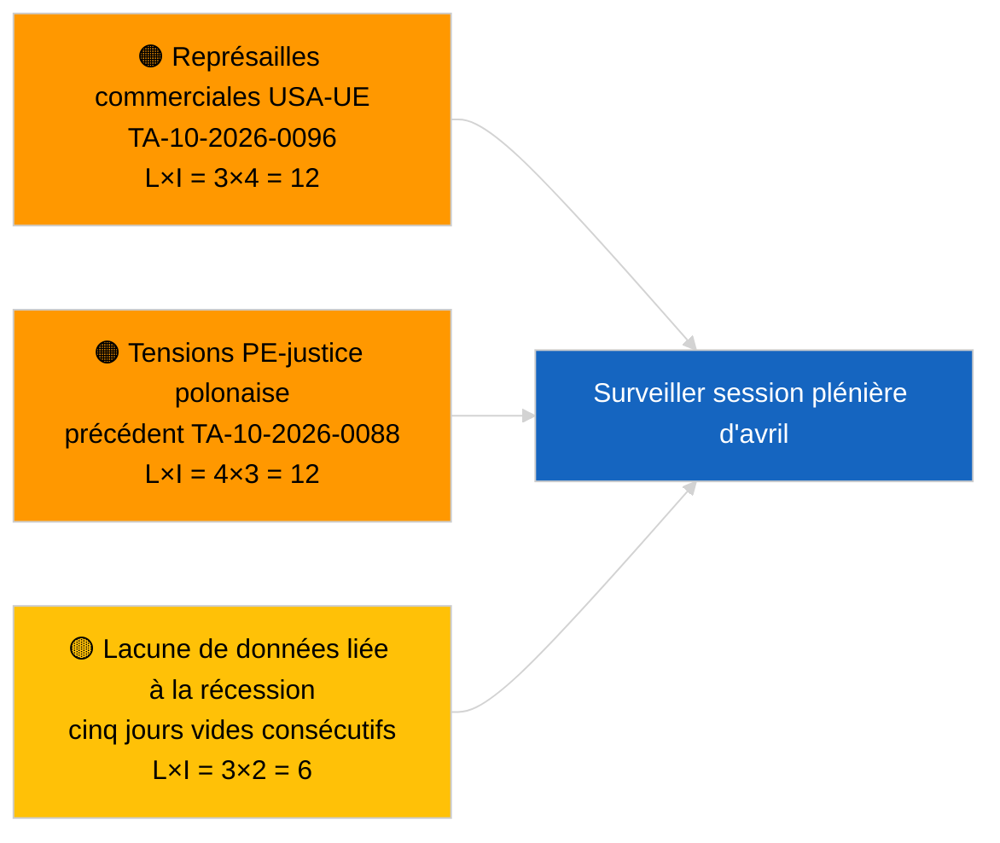

<!-- SPDX-FileCopyrightText: 2026 Hack23 AB -->
<!-- SPDX-License-Identifier: Apache-2.0 -->

# Note de synthèse — Actualités | 2026-03-31

**Classification :** OSINT | Archives parlementaires publiques
**Fiabilité :** 🟢 Élevée (évaluation structurelle pour période de récession)
**Créée :** 2026-03-31T00:00:00Z (note rétrospective)
**Type d'article :** Actualités
**Source :** Portail de données ouvertes du Parlement européen

---

## 🎯 BLUF

**Aucun signal de rupture le 31.3.2026 ; dernier jour de la première semaine de récession du PE après mars.** Le Parlement est en pause intersessionnelle entre la mini-session plénière de Bruxelles (25–26 mars) et la session plénière de Strasbourg (27–30 avril). La note confirme zéro nouveau texte adopté daté d'aujourd'hui et zéro nouvelle procédure ouverte. Le signal de report le plus récent subsiste depuis les adoptions bruxelloises du 26 mars — la levée d'immunité de Braun (TA-10-2026-0088) et le règlement d'ajustement tarifaire américain (TA-10-2026-0096) — tous deux pertinents pour les listes de surveillance du T2. L'indice de stabilité et l'arithmétique des coalitions restent inchangés. **🟢 CONFIANCE ÉLEVÉE** que l'inactivité est due au calendrier.

---

## 🧭 3 Décisions soutenues par cette note

| # | Décision | Décideur | Délai | Éléments probants |
|:-:|----------|----------|:-----:|-------------------|
| 1 | **Éditorial :** PASSER la dépêche QUOTIDIENNE ; produire la synthèse hebdomadaire si besoin | Rédacteur | +12h | Cinq jours consécutifs de récession sans nouvelle activité |
| 2 | **Surveillance :** Vérifier l'état de l'API EP après le schéma de 6/8 erreurs 404 du 2026-04-01 | Pipeline de données | 2026-04-02 | Des erreurs 404 persistantes escaladent en incident |
| 3 | **Anticipation :** La semaine de travail en commission du 13–17 avril déclenche le cycle d'actualité préplénier | Responsable analyse | 2026-04-13 | Les projets de commission déterminent typiquement 70–80 % des résultats pléniers |

---

## 📰 Lecture en 60 secondes

- 🔴 **Aucun article de premier plan** — cinq jours consécutifs de récession désormais enregistrés. (🟢 Élevée)
- 🟠 **Aucune nouvelle procédure ouverte ni texte adopté daté du 2026-03-31.** (🟢 Élevée)
- 🟢 **Arithmétique des coalitions stable** — PPE 38 % / S&D 22 % grande coalition 60 % reste le seul chemin vers la majorité. (🟢 Élevée)
- 🟡 **Risque de report :** Le précédent de la levée d'immunité de Braun (TA-10-2026-0088) crée un modèle pour d'autres affaires du PE liées à la justice polonaise — confirmé rétrospectivement par la levée Jaki en avril. (🟡 Moyen au moment des faits)
- 🔵 **Report économique :** Le règlement d'ajustement tarifaire américain (TA-10-2026-0096) et les crédits d'émissions poids lourds (TA-10-2026-0084) demeurent les principaux signaux externes/industriels. (🟢 Élevée)
- 🟣 **Référence croisée :** voir `2026-04-01/breaking` pour le premier rapport complet sur les anomalies de fiabilité des points de terminaison des flux post-mars. (🟢 Élevée)
- 🩷 **Vecteur de perturbation :** pas d'urgence ; dominance structurelle PPE et risques de pression commerciale américaine reconduits. (🟡 Moyen)
- ⚪ **Report :** Renvoi Mercosur-CJUE TA-10-2026-0008 toujours en attente d'avis.

---

## 🗂️ Documents phares / Tableau des procédures

| Rang | Référence PE | Titre (abrégé) | Importance | Fiabilité | Statut |
|:----:|--------------|----------------|:----------:|:---------:|--------|
| 1 | — | Aucune nouvelle procédure ni texte adopté le 2026-03-31 | 0,0 | 🟢 ÉLEVÉE | Récession — aucune activité |
| 2 | TA-10-2026-0096 | Règlement d'ajustement tarifaire américain (report) | 7,0 | 🟢 ÉLEVÉE | Adopté le 26 mars ; sous surveillance |
| 3 | TA-10-2026-0088 | Levée d'immunité de Braun (report) | 6,5 | 🟢 ÉLEVÉE | Adopté le 26 mars ; précédent |

---

## ⚠️ Tableau de bord des risques et menaces

| Risque | P | I | Score | Déclencheur | Source | Évaluation Admirauté |
|--------|:-:|:-:|:-----:|-------------|--------|---------------------|
| Représailles commerciales USA-UE | 3 | 4 | 12 | Annonce de contre-mesures américaines | TA-10-2026-0096 | A1 |
| Extension PE-justice polonaise | 4 | 3 | 12 | Nouvelles levées d'immunité | TA-10-2026-0088 | A1 |
| Dominance structurelle PPE (38 %) | 4 | 3 | 12 | Bloc défensif minoritaire T2 | Arithmétique des coalitions | A2 |
| Lacune de données récession | 3 | 2 | 6 | Cinq jours vides consécutifs | Série d'articles quotidiens | B2 |

---

## 🔮 Principal déclencheur prospectif

**Semaine de travail en commission du PE du 13 au 17 avril 2026.** Les projets de commission et les négociations de rapporteurs fictifs durant cette fenêtre détermineront en grande partie les résultats pléniers du 27–30 avril. Le premier signal réellement exploitable sera issu des flux de documents des commissions pendant cette période.

---

## 🛡️ Évaluation de la qualité des sources

- **Sources primaires :** Portail de données ouvertes du PE : flux de textes adoptés et de procédures (la note confirme zéro entrée datée du 2026-03-31).
- **Limites des données :** La même question de fiabilité des flux de l'API PE qui se matérialise nettement le 2026-04-01 ; la note d'aujourd'hui ne signale pas encore le schéma.
- **Fiabilité de l'absence d'activité :** 🟢 Élevée.
- **Fiabilité de l'inférence prospective :** 🟡 Moyenne (basée sur le schéma historique de récession du PE10).

---

## 📎 Liens

| Lien | Chemin |
|------|--------|
| Article | `./article.md` |
| Manifeste | `./manifest.json` |
| Notes sœurs | `analysis/daily/2026-03-27/`, `2026-03-28/`, `2026-04-01/breaking/` |

---

## 🔄 Référence croisée avec le précédent rapport

**Précédents rapports :** articles quotidiens du 2026-03-27 et du 2026-03-28 — les deux enregistraient l'inactivité de la période de récession.

**Delta :** La série de cinq jours vides consécutifs renforce la 🟢 CONFIANCE ÉLEVÉE que le schéma est dû au calendrier et non à une défaillance du pipeline de données. La première anomalie de l'API des flux est enregistrée le lendemain (article du 2026-04-01).

---

**Contrôle documentaire**
- **Modèle :** `/analysis/templates/executive-brief.md`
- **Chemin de l'artefact :** `analysis/daily/2026-03-31/breaking/executive-brief.md`
- **Classification :** Publique
- **Création rétrospective :** Session de remplissage pour les exécutions antérieures à l'exigence EB de la phase B.
