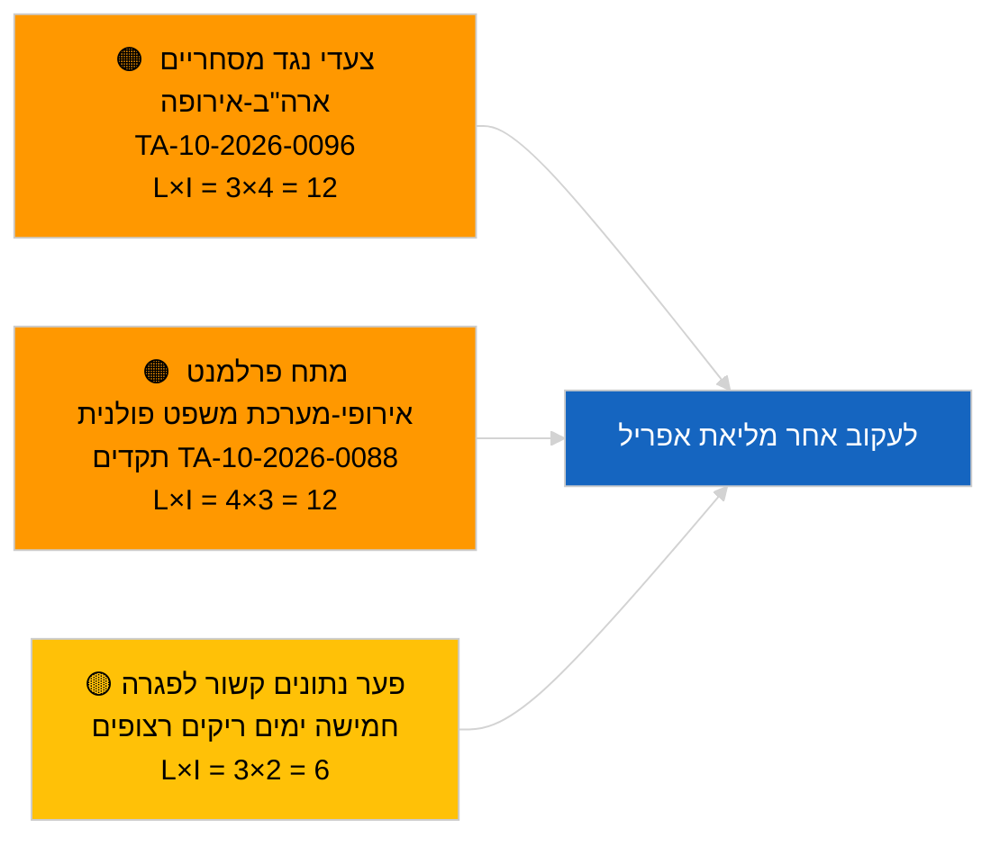

<!-- SPDX-FileCopyrightText: 2026 Hack23 AB -->
<!-- SPDX-License-Identifier: Apache-2.0 -->

# תדריך מנהלים — חדשות שוטפות | 2026-03-31

**סיווג:** OSINT | תיעוד פרלמנטרי ציבורי
**אמינות:** 🟢 גבוהה (הערכה מבנית לתקופת הפגרה)
**נוצר:** 2026-03-31T00:00:00Z (תדריך רטרוספקטיבי)
**סוג מאמר:** חדשות שוטפות
**מקור:** פורטל הנתונים הפתוח של הפרלמנט האירופי

---

## 🎯 תמצית

**אין אות חדשות שוטפות ב-31.3.2026; היום האחרון של שבוע הפגרה הראשון של הפרלמנט האירופי לאחר מרץ.** הפרלמנט נמצא בהפסקה בין-מושבית בין המליאה המוקטנת של בריסל (25–26 במרץ) למליאת שטרסבורג (27–30 באפריל). התדריך מאשר אפס טקסטים חדשים שאומצו בתאריך היום ואפס הליכים חדשים שנפתחו. אות ה"carry-over" האחרון נותר מאימוצי בריסל של 26 במרץ — הסרת החסינות של בראון (TA-10-2026-0088) ותקנת התאמת המכסים האמריקנית (TA-10-2026-0096) — שניהם רלוונטיים לרשימות המעקב של הרבעון השני. מדד היציבות וחשבון הקואליציה ללא שינוי. **🟢 אמינות גבוהה** שחוסר הפעילות הוא לוחי.

---

## 🧭 3 החלטות שתדריך זה תומך בהן

| # | החלטה | מקבל ההחלטה | מועד | ראיות |
|:-:|-------|-------------|:----:|-------|
| 1 | **עריכה:** לדלג על הידיעה היומית; להכין סיכום שבועי במידת הצורך | עורך | +12 שעות | חמישה ימי פגרה רצופים ללא פעילות חדשה |
| 2 | **ניטור:** לבדוק את מצב API של הפרלמנט האירופי לאחר תבנית שגיאות 404 (6 מתוך 8) מ-2026-04-01 | צינור נתונים | 2026-04-02 | שגיאות 404 מתמשכות מסלימות לתגובת אירוע |
| 3 | **תחזית:** שבוע עבודת ועדות 13–17 באפריל מפעיל מחזור ידיעות לפני המליאה | ראשת ניתוח | 2026-04-13 | טיוטות ועדות קובעות בדרך כלל 70–80 % מתוצאות המליאה |

---

## 📰 קריאה של 60 שניות

- 🔴 **אין מאמרי רמה ראשונה** — חמישה ימי פגרה רצופים נרשמו כעת. (🟢 גבוהה)
- 🟠 **לא נפתחו הליכים חדשים ולא אומצו טקסטים בתאריך 2026-03-31.** (🟢 גבוהה)
- 🟢 **חשבון הקואליציה יציב** — הקואליציה הגדולה EPP 38 % / S&D 22 %, סה"כ 60 %, נותרת המסלול היחיד לרוב. (🟢 גבוהה)
- 🟡 **סיכון carry-over:** תקדים הסרת החסינות של בראון (TA-10-2026-0088) יוצר תבנית למקרי בית משפט פולניים נוספים בפרלמנט האירופי — אושר רטרוספקטיבית על ידי הסרת ג'אקי באפריל. (🟡 בינונית באותה עת)
- 🔵 **carry-over כלכלי:** תקנת התאמת המכסים האמריקנית (TA-10-2026-0096) וזיכויי פליטות רכבים כבדים (TA-10-2026-0084) נותרים האותות החיצוניים/התעשייתיים הדומיננטיים. (🟢 גבוהה)
- 🟣 **הפניה מוצלבת:** ראה `2026-04-01/breaking` לדוח הראשון המלא על חריגות אמינות בנקודות הקצה של הזנות לאחר מרץ. (🟢 גבוהה)
- 🩷 **וקטור שיבוש:** ללא דחיפות; דומיננטיות מבנית של EPP וסיכוני לחץ מסחרי אמריקני מועברים. (🟡 בינונית)
- ⚪ **העברה:** הפניית מרקוסור-בית דין אירופאי TA-10-2026-0008 עדיין ממתינה לחוות דעת.

---

## 🗂️ מסמכים מובילים / טבלת הליכים

| דירוג | מרשם EP | כותרת (קצרה) | חשיבות | אמינות | מצב |
|:------:|---------|-------------|:------:|:------:|-----|
| 1 | — | אין הליכים חדשים או טקסטים שאומצו ב-2026-03-31 | 0.0 | 🟢 גבוהה | פגרה — ללא פעילות |
| 2 | TA-10-2026-0096 | תקנת התאמת המכסים האמריקנית (carry-over) | 7.0 | 🟢 גבוהה | אומצה 26 במרץ; במעקב |
| 3 | TA-10-2026-0088 | הסרת חסינות בראון (carry-over) | 6.5 | 🟢 גבוהה | אומצה 26 במרץ; תקדים |

---

## ⚠️ תמונת סיכונים ואיומים

| סיכון | ס | ה | ציון | מגרה | מקור | הערכת אדמירליות |
|-------|:-:|:-:|:----:|------|------|----------------|
| צעדי נגד מסחריים ארה"ב-אירופה | 3 | 4 | 12 | הכרזה אמריקנית נגדית | TA-10-2026-0096 | A1 |
| התפשטות פרלמנט אירופי-מערכת משפט פולנית | 4 | 3 | 12 | הסרות חסינות נוספות | TA-10-2026-0088 | A1 |
| דומיננטיות מבנית EPP (38 %) | 4 | 3 | 12 | גוש הגנה מיעוטי Q2 | חשבון קואליציה | A2 |
| פער נתוני פגרה | 3 | 2 | 6 | חמישה ימים ריקים רצופים | סדרת מאמרים יומיים | B2 |

---

## 🔮 מחולל עתידי מוביל

**שבוע עבודת ועדות הפרלמנט האירופי 13–17 באפריל 2026.** טיוטות ועדות ומשא ומתן של מדווחי צל בחלון זמן זה יקבעו במידה רבה את תוצאות המליאה של 27–30 באפריל. האות הראשון הניתן לפעולה יגיע מהזנות מסמכי הוועדות בחלון זה.

---

## 🛡️ הערכת איכות מקורות

- **מקורות ראשוניים:** פורטל הנתונים הפתוח של הפרלמנט האירופי: הזנות טקסטים שאומצו והליכים (התדריך מאשר אפס רשומות בתאריך 2026-03-31).
- **מגבלות נתונים:** אותה שאלת אמינות הזנת API של הפרלמנט האירופי שמתממשת בבירור ב-2026-04-01; תדריך היום עדיין אינו מסמן את הדפוס.
- **אמינות 'ללא פעילות חדשה':** 🟢 גבוהה.
- **אמינות ההיסק קדימה:** 🟡 בינונית (מבוסס על דפוס הפגרה ההיסטורי של EP10).

---

## 📎 קישורים

| קישור | נתיב |
|-------|------|
| מאמר | `./article.md` |
| מניפסט | `./manifest.json` |
| תדריכי אחים | `analysis/daily/2026-03-27/`, `2026-03-28/`, `2026-04-01/breaking/` |

---

## 🔄 הפניה מוצלבת לריצה קודמת

**ריצות קודמות:** מאמרים יומיים 2026-03-27 ו-2026-03-28 — שניהם רשמו חוסר פעילות של תקופת הפגרה.

**דלתא:** רצף חמשת הימים הריקים הרצופים מחזק את 🟢 האמינות הגבוהה שהדפוס הוא לוחי ולא תקלה בצינור הנתונים. חריגת ה-API הראשונה של הזנות נרשמת ביום הבא (מאמר 2026-04-01).

---

**בקרת מסמכים**
- **תבנית:** `/analysis/templates/executive-brief.md`
- **נתיב ארטיפקט:** `analysis/daily/2026-03-31/breaking/executive-brief.md`
- **סיווג:** ציבורי
- **יצירה רטרוספקטיבית:** מפגש מילוי לריצות שקדמו לדרישת EB של שלב ב'.
