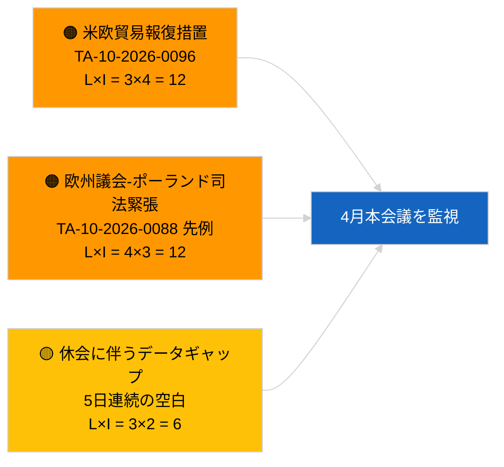

<!-- SPDX-FileCopyrightText: 2026 Hack23 AB -->
<!-- SPDX-License-Identifier: Apache-2.0 -->

# エグゼクティブ・ブリーフィング — 速報ニュース | 2026-03-31

**分類：** OSINT | 公開議会記録
**信頼性：** 🟢 高（休会期間の構造的評価）
**作成日：** 2026-03-31T00:00:00Z（遡及的ブリーフィング）
**記事種別：** 速報ニュース
**情報源：** 欧州議会オープンデータポータル

---

## 🎯 要点（BLUF）

**2026年3月31日に速報シグナルなし。3月後の欧州議会における初の休会週の最終日。** 議会はブリュッセル非公式本会議（3月25〜26日）とストラスブール本会議（4月27〜30日）の間の会期間休止中にある。本ブリーフィングは本日付で新たに採択されたテキストがゼロ、新たに開始された手続きもゼロであることを確認する。最も直近の持ち越しシグナルは3月26日のブリュッセルでの採択から継続している。ブラウン議員の免責特権解除（TA-10-2026-0088）および米国関税調整規則（TA-10-2026-0096）はいずれも第2四半期の監視リストに関連する。安定性指数および連立算術に変化なし。**🟢 高い信頼度**：非活動状態はカレンダー起因である。

---

## 🧭 本ブリーフィングが支援する3つの意思決定

| # | 意思決定 | 意思決定者 | 期限 | 根拠 |
|:-:|----------|-----------|:----:|------|
| 1 | **編集：** 日次速報をスキップし、必要であれば週次サマリーを作成 | 編集長 | +12時間 | 新規活動なしで5日連続の休会 |
| 2 | **監視：** 2026-04-01の6/8 404エラーパターンを受けてEP APIの状態を確認 | データパイプライン | 2026-04-02 | 継続的な404エラーはインシデント対応に升級 |
| 3 | **先読み：** 4月13〜17日の委員会作業週が本会議前ニュースサイクルを始動 | 分析責任者 | 2026-04-13 | 委員会草案が通常、本会議結果の70〜80 %を決定 |

---

## 📰 60秒ニュースダイジェスト

- 🔴 **第1層記事なし** — 5日連続の休会日が記録された。（🟢 高）
- 🟠 **2026-03-31付で新規手続き開始なし、採択テキストなし。**（🟢 高）
- 🟢 **連立算術は安定** — EPP 38 %／S&D 22 %の大連立60 %が唯一の過半数経路として維持。（🟢 高）
- 🟡 **持ち越しリスク：** ブラウン免責特権解除の前例（TA-10-2026-0088）がポーランド司法に関する欧州議会案件のテンプレートを形成 — 4月のJaki解除により遡及的に確認。（🟡 当時は中程度）
- 🔵 **経済的持ち越し：** 米国関税調整規則（TA-10-2026-0096）と重量車両排出クレジット（TA-10-2026-0084）が支配的な外部・産業シグナルとして継続。（🟢 高）
- 🟣 **相互参照：** 3月以降のフィードエンドポイント信頼性異常に関する最初の完全な報告は `2026-04-01/breaking` を参照。（🟢 高）
- 🩷 **混乱要因：** 緊急性なし；EPPの構造的優位と米国貿易圧力リスクを継続保持。（🟡 中程度）
- ⚪ **持越し：** メルコスール欧州司法裁判所付託 TA-10-2026-0008 は意見書を待機中。

---

## 🗂️ 主要文書・手続き一覧

| 順位 | EP参照番号 | タイトル（略称） | 重要度 | 信頼性 | 状態 |
|:----:|------------|----------------|:------:|:------:|------|
| 1 | — | 2026-03-31付の新規手続き・採択テキストなし | 0.0 | 🟢 高 | 休会 — 活動なし |
| 2 | TA-10-2026-0096 | 米国関税調整規則（持ち越し） | 7.0 | 🟢 高 | 3月26日採択；監視中 |
| 3 | TA-10-2026-0088 | ブラウン免責特権解除（持ち越し） | 6.5 | 🟢 高 | 3月26日採択；先例 |

---

## ⚠️ リスク・脅威スナップショット

| リスク | 可 | 影 | スコア | トリガー | 情報源 | アドミラルティ評価 |
|--------|:--:|:--:|:------:|----------|--------|------------------|
| 米欧貿易報復措置 | 3 | 4 | 12 | 米国対抗発表 | TA-10-2026-0096 | A1 |
| 欧州議会-ポーランド司法拡大 | 4 | 3 | 12 | 追加免責特権解除 | TA-10-2026-0088 | A1 |
| EPP構造的優位（38 %） | 4 | 3 | 12 | Q2少数派防衛ブロック | 連立算術 | A2 |
| 休会データギャップ | 3 | 2 | 6 | 5日連続空白 | 日次記事シリーズ | B2 |

---

## 🔮 主要な将来トリガー

**欧州議会委員会作業週：2026年4月13〜17日。** この期間における委員会草案と影の報告者の交渉が4月27〜30日の本会議結果の大部分を先取りして決定する。実際に行動可能な最初のシグナルはこの時間枠の委員会文書フィードから発出される。

---

## 🛡️ 情報源品質評価

- **一次情報源：** 欧州議会オープンデータポータル：採択テキスト・手続きフィード（2026-03-31付エントリーがゼロであることを確認）。
- **データ制限：** 2026-04-01に明確に顕在化するEP APIフィードの信頼性問題と同様の懸念；本日のブリーフィングはまだそのパターンを記録していない。
- **「新規活動なし」の信頼性：** 🟢 高。
- **前向き推論の信頼性：** 🟡 中程度（EP10の歴史的休会パターンに基づく）。

---

## 📎 リンク

| リンク | パス |
|--------|------|
| 記事 | `./article.md` |
| マニフェスト | `./manifest.json` |
| 関連ブリーフィング | `analysis/daily/2026-03-27/`, `2026-03-28/`, `2026-04-01/breaking/` |

---

## 🔄 前回実行との相互参照

**前回実行：** 2026-03-27、2026-03-28の日次記事 — いずれも休会期間の非活動を記録。

**差分：** 5日連続の空白シーケンスにより、そのパターンがデータパイプライン障害ではなくカレンダー起因であるという 🟢 高い信頼度がさらに強固になった。フィード API の最初の異常は翌日（2026-04-01記事）に記録される。

---

**文書管理**
- **テンプレート：** `/analysis/templates/executive-brief.md`
- **アーティファクトパス：** `analysis/daily/2026-03-31/breaking/executive-brief.md`
- **分類：** 公開
- **遡及的作成：** ステージB EB要件導入前の実行を補完するセッション。
