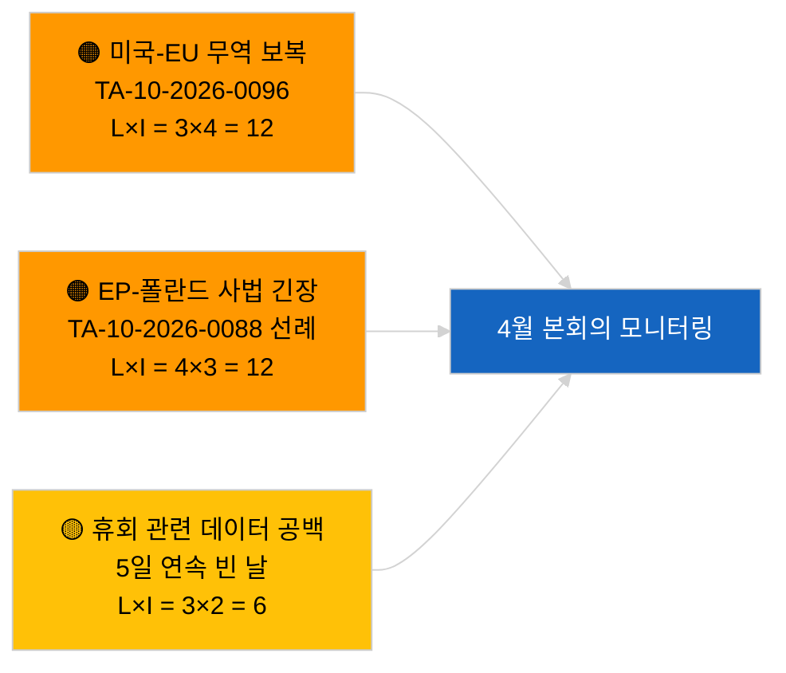

<!-- SPDX-FileCopyrightText: 2026 Hack23 AB -->
<!-- SPDX-License-Identifier: Apache-2.0 -->

# 집행부 브리핑 — 속보 뉴스 | 2026-03-31

**분류:** OSINT | 공개 의회 기록
**신뢰도:** 🟢 높음 (휴회 기간 구조적 평가)
**작성일:** 2026-03-31T00:00:00Z (소급 브리핑)
**기사 유형:** 속보 뉴스
**출처:** 유럽의회 오픈 데이터 포털

---

## 🎯 핵심 요약 (BLUF)

**2026년 3월 31일 속보 신호 없음; 3월 이후 유럽의회 첫 휴회 주의 마지막 날.** 의회는 브뤼셀 소규모 본회의(3월 25~26일)와 스트라스부르 본회의(4월 27~30일) 사이의 회기 간 휴지기에 있다. 이 브리핑은 오늘 날짜로 신규 채택 텍스트 제로, 신규 개시 절차 제로임을 확인한다. 가장 최근의 이월 신호는 3월 26일 브뤼셀 채택에서 지속된다 — 브라운 의원 면책특권 해제(TA-10-2026-0088) 및 미국 관세 조정 규정(TA-10-2026-0096) — 모두 2분기 감시 목록과 관련. 안정성 지수 및 연립 산술 변화 없음. **🟢 높은 신뢰도**: 비활동 상태는 일정상 이유에 의한 것.

---

## 🧭 본 브리핑이 지원하는 3가지 의사결정

| # | 결정 | 의사결정자 | 기한 | 근거 |
|:-:|------|-----------|:----:|------|
| 1 | **편집:** 일간 속보 스킵; 필요 시 주간 요약 작성 | 편집장 | +12시간 | 신규 활동 없이 5일 연속 휴회 |
| 2 | **모니터링:** 2026-04-01의 6/8 404 오류 패턴 이후 EP API 상태 확인 | 데이터 파이프라인 | 2026-04-02 | 지속적인 404 오류는 인시던트 대응으로 격상 |
| 3 | **선행 대응:** 4월 13~17일 위원회 작업 주가 본회의 전 뉴스 사이클 시작 | 분석 책임자 | 2026-04-13 | 위원회 초안이 통상 본회의 결과의 70~80 %를 결정 |

---

## 📰 60초 뉴스 요약

- 🔴 **1등급 기사 없음** — 5일 연속 휴회일 기록. (🟢 높음)
- 🟠 **2026-03-31 날짜의 신규 절차 개시 또는 채택 텍스트 없음.** (🟢 높음)
- 🟢 **연립 산술 안정** — EPP 38 %/S&D 22 % 대연정 60 %가 유일한 과반수 경로 유지. (🟢 높음)
- 🟡 **이월 위험:** 브라운 면책특권 해제 선례(TA-10-2026-0088)가 폴란드 사법 관련 추가 EP 사건의 템플릿 형성 — 4월 Jaki 해제로 소급 확인. (🟡 당시 중간)
- 🔵 **경제적 이월:** 미국 관세 조정 규정(TA-10-2026-0096) 및 중량 차량 배출 크레딧(TA-10-2026-0084)이 지배적인 외부/산업 신호로 지속. (🟢 높음)
- 🟣 **상호 참조:** 3월 이후 피드 엔드포인트 신뢰성 이상에 대한 첫 번째 완전한 보고서는 `2026-04-01/breaking` 참조. (🟢 높음)
- 🩷 **혼란 벡터:** 급박성 없음; EPP 구조적 우위 및 미국 무역 압력 위험 지속 보유. (🟡 중간)
- ⚪ **이월:** 메르코수르 유럽사법재판소 부탁 TA-10-2026-0008 의견서 대기 중.

---

## 🗂️ 주요 문서 / 절차 표

| 순위 | EP 참조 | 제목 (약칭) | 중요도 | 신뢰도 | 상태 |
|:----:|---------|-----------|:------:|:------:|------|
| 1 | — | 2026-03-31 날짜의 신규 절차 또는 채택 텍스트 없음 | 0.0 | 🟢 높음 | 휴회 — 활동 없음 |
| 2 | TA-10-2026-0096 | 미국 관세 조정 규정 (이월) | 7.0 | 🟢 높음 | 3월 26일 채택; 모니터링 |
| 3 | TA-10-2026-0088 | 브라운 면책특권 해제 (이월) | 6.5 | 🟢 높음 | 3월 26일 채택; 선례 |

---

## ⚠️ 위험 및 위협 스냅샷

| 위험 | 가능 | 영향 | 점수 | 트리거 | 출처 | 해군성 평가 |
|------|:----:|:----:|:----:|--------|------|------------|
| 미국-EU 무역 보복 | 3 | 4 | 12 | 미국 대응 발표 | TA-10-2026-0096 | A1 |
| EP-폴란드 사법 확산 | 4 | 3 | 12 | 추가 면책특권 해제 | TA-10-2026-0088 | A1 |
| EPP 구조적 우위 (38 %) | 4 | 3 | 12 | 2분기 소수 방어 블록 | 연립 산술 | A2 |
| 휴회 데이터 공백 | 3 | 2 | 6 | 5일 연속 빈 날 | 일간 기사 시리즈 | B2 |

---

## 🔮 주요 미래 트리거

**유럽의회 위원회 작업 주: 2026년 4월 13~17일.** 이 기간 위원회 초안과 그림자 보고자 협상이 4월 27~30일 본회의 결과의 대부분을 선제적으로 결정한다. 실질적으로 실행 가능한 첫 번째 신호는 이 시간대 위원회 문서 피드에서 나온다.

---

## 🛡️ 출처 품질 평가

- **1차 출처:** 유럽의회 오픈 데이터 포털: 채택 텍스트 및 절차 피드 (2026-03-31 날짜 항목 제로 확인).
- **데이터 제한:** 2026-04-01에 명확히 드러나는 EP API 피드 신뢰성 문제와 동일한 우려; 오늘 브리핑은 아직 그 패턴을 기록하지 않음.
- **'신규 활동 없음' 신뢰도:** 🟢 높음.
- **전향적 추론 신뢰도:** 🟡 중간 (EP10 역사적 휴회 패턴 기반).

---

## 📎 링크

| 링크 | 경로 |
|------|------|
| 기사 | `./article.md` |
| 매니페스트 | `./manifest.json` |
| 형제 브리핑 | `analysis/daily/2026-03-27/`, `2026-03-28/`, `2026-04-01/breaking/` |

---

## 🔄 이전 실행 상호 참조

**이전 실행:** 2026-03-27, 2026-03-28 일간 기사 — 모두 휴회 기간 비활동 기록.

**델타:** 5일 연속 빈 날 시퀀스로 인해 해당 패턴이 데이터 파이프라인 장애가 아닌 일정상 이유라는 🟢 높은 신뢰도가 더욱 강화됨. 피드 API 최초 이상은 다음 날(2026-04-01 기사)에 기록됨.

---

**문서 관리**
- **템플릿:** `/analysis/templates/executive-brief.md`
- **아티팩트 경로:** `analysis/daily/2026-03-31/breaking/executive-brief.md`
- **분류:** 공개
- **소급 작성:** 스테이지 B EB 요건 도입 이전 실행을 보충하는 세션.
