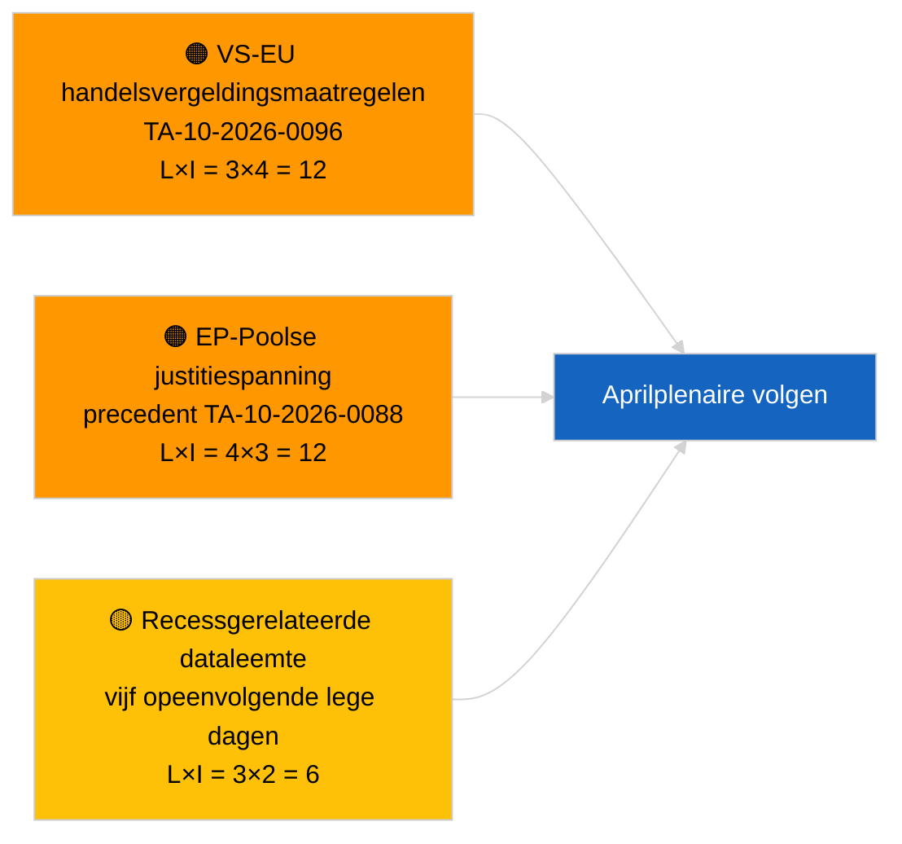

<!-- SPDX-FileCopyrightText: 2026 Hack23 AB -->
<!-- SPDX-License-Identifier: Apache-2.0 -->

# Uitvoerende briefing — Nieuws | 2026-03-31

**Classificatie:** OSINT | Openbaar parlementair register
**Betrouwbaarheid:** 🟢 Hoog (structurele beoordeling voor recessperiode)
**Aangemaakt:** 2026-03-31T00:00:00Z (retrospectieve briefing)
**Artikeltype:** Nieuws
**Bron:** Open dataportaal van het Europees Parlement

---

## 🎯 BLUF

**Geen doorbraaksignaal op 31.3.2026; laatste dag van de eerste recessweek van het EP na maart.** Het Parlement bevindt zich in de intersessionele pauze tussen de mini-plenaire vergadering in Brussel (25–26 maart) en de plenaire vergadering in Straatsburg (27–30 april). De briefing bevestigt nul nieuwe aangenomen teksten gedateerd op vandaag en nul nieuwe procedures geopend. Het meest recente carry-oversignaal blijft van de Brusselse aannames van 26 maart — de opheffing van immuniteit van Braun (TA-10-2026-0088) en de Amerikaanse tariefaanpassingsverordening (TA-10-2026-0096) — beide relevant voor de bewakingslijsten van K2. Stabiliteitsindex en coalitie-arithmetiek ongewijzigd. **🟢 HOOG VERTROUWEN** dat de inactiviteit kalendergebonden is.

---

## 🧭 3 Besluiten die deze briefing ondersteunt

| # | Besluit | Beslisser | Deadline | Bewijs |
|:-:|---------|-----------|:--------:|--------|
| 1 | **Redactioneel:** DAGELIJKS bericht OVERSLAAN; wekelijkse samenvatting opstellen indien nodig | Redacteur | +12u | Vijf opeenvolgende recessdagen zonder nieuwe activiteit |
| 2 | **Monitoring:** EP API-status controleren na het 6/8 404-foutpatroon van 2026-04-01 | Datapijplijn | 2026-04-02 | Aanhoudende 404-fouten escaleren naar incidentrespons |
| 3 | **Vooruitkijken:** Commissiewerweek 13–17 april activeert pre-plenaire nieuwscyclus | Analyse-coördinator | 2026-04-13 | Commissieconcepten bepalen doorgaans 70–80 % van de plenaire resultaten |

---

## 📰 60-secondenlezing

- 🔴 **Geen Tier-1-artikelen** — vijf opeenvolgende recessdagen nu geregistreerd. (🟢 Hoog)
- 🟠 **Geen nieuwe procedures geopend of aangenomen teksten gedateerd op 2026-03-31.** (🟢 Hoog)
- 🟢 **Coalitie-arithmetiek stabiel** — grote coalitie EPP 38 % / S&D 22 % met 60 % blijft het enige meerderheidspad. (🟢 Hoog)
- 🟡 **Carry-overrisico:** precedent van de opheffing van immuniteit van Braun (TA-10-2026-0088) schept template voor verdere EP-zaken rond Pools rechtsstelsel — retrospectief bevestigd door de opheffing van Jaki in april. (🟡 Gemiddeld toentertijd)
- 🔵 **Economisch carry-over:** Amerikaanse tariefaanpassingsverordening (TA-10-2026-0096) en HDV-emissiekredieten (TA-10-2026-0084) blijven dominante externe/industriële signalen. (🟢 Hoog)
- 🟣 **Kruisverwijzing:** zie `2026-04-01/breaking` voor het eerste volledige rapport over betrouwbaarheidsanomalieën in post-maart feed-eindpunten. (🟢 Hoog)
- 🩷 **Verstoringsvektor:** geen acuut; structurele EPP-dominantie en risico's van Amerikaanse handelsdruk overgenomen. (🟡 Gemiddeld)
- ⚪ **Doorschuiven:** Mercosur-HvJ-verwijzing TA-10-2026-0008 wacht nog op advies.

---

## 🗂️ Topdocumenten / Procedurabel

| Rang | EP-referentie | Titel (kort) | Belang | Betrouwbaarheid | Status |
|:----:|---------------|--------------|:------:|:---------------:|--------|
| 1 | — | Geen nieuwe procedures of aangenomen teksten op 2026-03-31 | 0,0 | 🟢 HOOG | Reces — geen activiteit |
| 2 | TA-10-2026-0096 | Amerikaanse tariefaanpassingsverordening (carry-over) | 7,0 | 🟢 HOOG | Aangenomen 26 maart; in observatie |
| 3 | TA-10-2026-0088 | Opheffing immuniteit Braun (carry-over) | 6,5 | 🟢 HOOG | Aangenomen 26 maart; precedent |

---

## ⚠️ Risico- en dreigingsoverzicht

| Risico | K | I | Score | Trigger | Bron | Admiraliteitsbeoordeling |
|--------|:-:|:-:|:-----:|---------|------|--------------------------|
| VS-EU handelsvergeldingsmaatregelen | 3 | 4 | 12 | VS-tegenaankondiging | TA-10-2026-0096 | A1 |
| EP-Poolse justitie-uitbreiding | 4 | 3 | 12 | Verdere immuniteitopheffingen | TA-10-2026-0088 | A1 |
| Structurele EPP-dominantie (38 %) | 4 | 3 | 12 | K2 minderheidsdefensieblok | Coalitie-arithmetiek | A2 |
| Recessgerelateerde dataleemte | 3 | 2 | 6 | Vijf opeenvolgende lege dagen | Dagelijkse artikelenreeks | B2 |

---

## 🔮 Top toekomstige trigger

**EP commissiewerweek 13–17 april 2026.** Commissieconcepten en onderhandelingen van schaduwrapporteurs in dit tijdvenster bepalen in grote lijnen de plenaire resultaten van 27–30 april. Het eerste echt bruikbare signaal zal afkomstig zijn van de commissiedocumentfeeds in dit tijdvenster.

---

## 🛡️ Beoordeling bronnenkwaliteit

- **Primaire bronnen:** Open EP-dataportaal: feeds voor aangenomen teksten en procedures (briefing bevestigt nul vermeldingen gedateerd 2026-03-31).
- **Databeperkingen:** Dezelfde vraag over de betrouwbaarheid van de EP API-feed die zich duidelijk manifesteert op 2026-04-01; de briefing van vandaag markeert het patroon nog niet.
- **Betrouwbaarheid van 'geen nieuwe activiteit':** 🟢 Hoog.
- **Betrouwbaarheid van voorwaartse gevolgtrekking:** 🟡 Gemiddeld (gebaseerd op het historische recesspatroon van EP10).

---

## 📎 Links

| Link | Pad |
|------|-----|
| Artikel | `./article.md` |
| Manifest | `./manifest.json` |
| Zusterbriefings | `analysis/daily/2026-03-27/`, `2026-03-28/`, `2026-04-01/breaking/` |

---

## 🔄 Kruisverwijzing naar vorige run

**Vorige runs:** dagelijkse artikelen van 2026-03-27 en 2026-03-28 — beide registreerden inactiviteit van de recessperiode.

**Delta:** De reeks van vijf opeenvolgende lege dagen versterkt het 🟢 HOOG VERTROUWEN dat het patroon kalendergebonden is en geen datapijplijnfout. De eerste feed-API-anomalie wordt geregistreerd op de volgende dag (artikel van 2026-04-01).

---

**Documentbeheer**
- **Sjabloon:** `/analysis/templates/executive-brief.md`
- **Artefactpad:** `analysis/daily/2026-03-31/breaking/executive-brief.md`
- **Classificatie:** Openbaar
- **Retrospectieve aanmaak:** Aanvulsessie voor runs vóór de Stage-B EB-vereiste.
