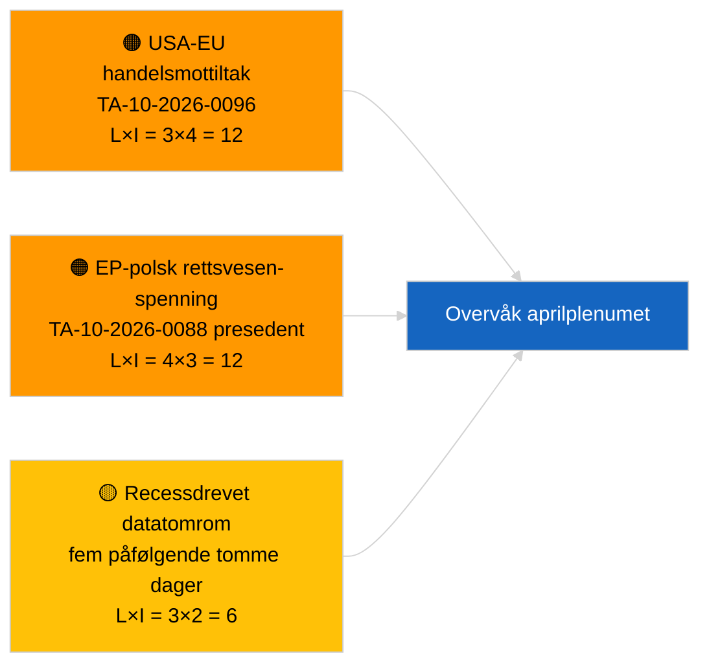

<!-- SPDX-FileCopyrightText: 2026 Hack23 AB -->
<!-- SPDX-License-Identifier: Apache-2.0 -->

# Ledelsesorientering — Siste nytt | 2026-03-31

**Klassifisering:** OSINT | Offentlig parlamentarisk registrering
**Konfidens:** 🟢 Høy (strukturell vurdering for recessperiode)
**Generert:** 2026-03-31T00:00:00Z (retrospektiv orientering)
**Artikkeltype:** Siste nytt
**Kilde:** Europaparlamentets åpne dataportal

---

## 🎯 BLUF

**Inget nyhetssignal den 2026-03-31; siste dag i EPs første recessuke etter mars.** Parlamentet befinner seg i den intersesjonelle pausen mellom Brussel-miniplenummet (25.–26. mars) og Strasbourg-plenumet (27.–30. april). Artikkelen bekrefter null nye vedtatte tekster datert i dag og null nye åpnede prosedyrer. Det seneste substansielle carryover-signalet kvarstår fra de Brussel-vedtatte tekstene 26. mars — Braun-immunitetsopphevelsen (TA-10-2026-0088) og justeringen av amerikanske tolltariffer (TA-10-2026-0096) — begge bidrar til overvåkingslister for Q2. Stabilitetspoeng og koalisjonsaritmetikk uendret. **🟢 HØY konfidens** for at inaktiviteten er kalenderbasert.

---

## 🧭 3 beslutninger denne orienteringen støtter

| # | Beslutning | Beslutningstaker | Frist | Bevis |
|:-:|------------|------------------|:-----:|-------|
| 1 | **Redaksjonelt:** HOPP OVER daglig nyhet; produser ukeoppsummering ved behov | Redaktør | +12t | Fem påfølgende recessdager uten ny aktivitet |
| 2 | **Overvåking:** verifiser EP API-helse etter 6/8 feed-404-mønsteret 2026-04-01 | Datapipeline | 2026-04-02 | Vedvarende 404-feil skifter til hendelsesrespons |
| 3 | **Fremtidsovervåking:** komiteens arbeidsuke 13.–17. april utløser pre-plenarsetterretningssyklusen | Analyseansvarlig | 2026-04-13 | Komitéutkast bestemmer typisk 70–80 % av plenarresultatene |

---

## 📰 60-sekunders lesning

- 🔴 **Ingen tier-1-nyheter** — fem påfølgende recessdager nå registrert. (🟢 Høy)
- 🟠 **Ingen nye prosedyrer åpnet eller vedtatte tekster datert 2026-03-31.** (🟢 Høy)
- 🟢 **Koalisjonsaritmetikk stabil** — PPE 38 % / S&D 22 % Storkoalisjon 60 % forblir den eneste majoritetsstien. (🟢 Høy)
- 🟡 **Carryover-risiko:** Braun-immunitetsopphevelsespresidens (TA-10-2026-0088) setter mal for ytterligere polsk-rettsvesen EP-saker — bekreftet retrospektivt av Jaki-opphevelsen i april. (🟡 Medium på daværende tidspunkt)
- 🔵 **Økonomisk carryover:** Justering av amerikanske tolltariffer (TA-10-2026-0096) og HDV-utslippskreditter (TA-10-2026-0084) forblir dominerende eksterne/industrielle signaler. (🟢 Høy)
- 🟣 **Kryssreferanse:** se `2026-04-01/breaking` for første fullstendige redegjørelse for reliabilitetsavvik i post-mars feed-endepunkter. (🟢 Høy)
- 🩷 **Forstyrrelsesvektorer:** ingen akutte; strukturell PPE-dominans og amerikanske handelspressrisikoer er arvede. (🟡 Medium)
- ⚪ **Fremoverføring:** Mercosur ECJ-forhåndsavgjørelse TA-10-2026-0008 avventer fremdeles domstolsuttalelse.

---

## 🗂️ Topdokumenter / prosedyretabell

| Rang | EP-referanse | Tittel (kort) | Betydning | Konfidens | Status |
|:----:|--------------|---------------|:---------:|:---------:|--------|
| 1 | — | Ingen nye prosedyrer eller vedtatte tekster 2026-03-31 | 0,0 | 🟢 HØY | Recess — ingen aktivitet |
| 2 | TA-10-2026-0096 | Justering av amerikanske tolltariffer (carryover) | 7,0 | 🟢 HØY | Vedtatt 26. mars; overvåking |
| 3 | TA-10-2026-0088 | Braun-immunitetsopphevelse (carryover) | 6,5 | 🟢 HØY | Vedtatt 26. mars; presedent |

---

## ⚠️ Risiko- og trusseloversikt

| Risiko | S | P | Poeng | Utløser | Kilde | Admiralitetsgrad |
|--------|:-:|:-:|:-----:|---------|-------|:----------------:|
| USA-EU handelsmottiltak | 3 | 4 | 12 | Amerikansk mottiltak | TA-10-2026-0096 | A1 |
| EP-polsk rettsvesen-spredning | 4 | 3 | 12 | Ytterligere immunitetsopphevelser | TA-10-2026-0088 | A1 |
| PPE strukturell dominans (38 %) | 4 | 3 | 12 | Q2 minoritetsdefensivt blokk | Koalisjonsaritmetikk | A2 |
| Recessdatatomrom | 3 | 2 | 6 | Fem tomme dager på rad | Daglig artikkelserie | B2 |

---

## 🔮 Topp fremtidsutløser

**EP-komiteenes arbeidsuke 13.–17. april 2026.** Komitéutkast og skyggeordførerforhandlinger i dette vinduet forhåndsbestemmer mesteparten av plenarresultatene for 27.–30. april. Det første genuint handlingsbare nyhetssignalet vil komme fra komitédokumentfeeder i det vinduet.

---

## 🛡️ Vurdering av kildekvalitet

- **Primærkilder:** EPs åpne dataportal: vedtatte tekster og prosedyrefeeder (artikkelen bekrefter null elementer datert 2026-03-31).
- **Databegrensninger:** Samme spørsmål om EP API-feed-pålitelighet som tydelig materialiseres 2026-04-01; dagens artikkel flagger ennå ikke mønsteret.
- **Konfidens for "ingen ny aktivitet":** 🟢 Høy.
- **Konfidens for fremoverinferens:** 🟡 Medium (basert på EP10s historiske recessmønster).

---

## 📎 Lenker

| Lenke | Sti |
|-------|-----|
| Artikkel | `./article.md` |
| Manifest | `./manifest.json` |
| Søsterartikler | `analysis/daily/2026-03-27/`, `2026-03-28/`, `2026-04-01/breaking/` |

---

## 🔄 Kryssreferanse til forrige kjøring

**Tidligere kjøringer:** 2026-03-27, 2026-03-28 daglige artikler — begge registrerte recessperiodens inaktivitet.

**Delta:** Sekvensen av fem påfølgende tomme dager styrker 🟢 HØY konfidens for at mønsteret er kalenderbasert og ikke en datapipelinefeil. Det første feed-API-avviket logges den påfølgende dagen (artikkel 2026-04-01).

---

**Dokumentkontroll**
- **Mal:** `/analysis/templates/executive-brief.md`
- **Artefaktsti:** `analysis/daily/2026-03-31/breaking/executive-brief.md`
- **Klassifisering:** Offentlig
- **Retrospektiv generering:** Tilbakefyllingssesjon for kjøringer før Stage-B-EB-kravet.
