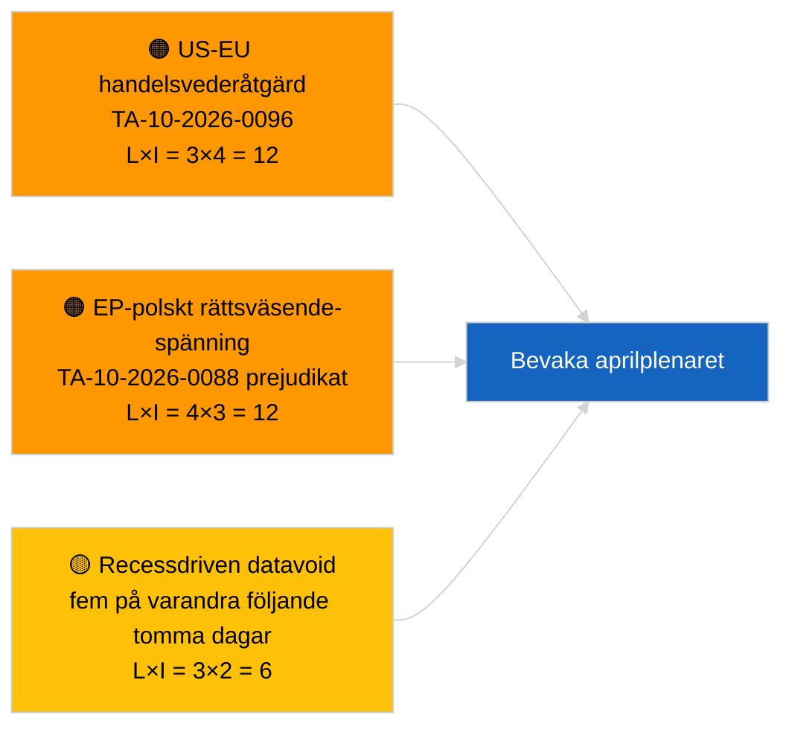

<!-- SPDX-FileCopyrightText: 2026 Hack23 AB -->
<!-- SPDX-License-Identifier: Apache-2.0 -->

# Exekutivt sammandrag — Brytnyheter | 2026-03-31

**Klassificering:** OSINT | Offentlig parlamentsregistrering
**Säkerhet:** 🟢 Hög (strukturell bedömning för recessperiod)
**Genererad:** 2026-03-31T00:00:00Z (retrospektivt sammandrag)
**Artikeltyp:** Brytnyheter
**Källa:** Europaparlamentets öppna dataportal

---

## 🎯 BLUF

**Inget brytningssignal den 2026-03-31; sista dagen i EP:s första recessvecka efter mars.** Parlamentet befinner sig i det intersessionella uppehållet mellan Bryssels mini-plenum (25–26 mars) och Strasbourgplenaret (27–30 april). Artikeln bekräftar noll nya antagna texter daterade i dag och noll nya öppnade förfaranden. Den senaste substantiella carryover-signalen kvarstår från 26 mars Brysselantagna texter — Brauns immunitetsupphävning (TA-10-2026-0088) och justeringen av amerikanska tulltariffer (TA-10-2026-0096) — båda bidrar till bevakningslistor för Q2. Stabilitetspoäng och koalitionsaritmetik oförändrade. **🟢 HÖG säkerhet** att inaktiviteten är kalenderdriven.

---

## 🧭 3 beslut som detta sammandrag stöder

| # | Beslut | Beslutsfattare | Tidsgräns | Bevis |
|:-:|--------|----------------|:---------:|-------|
| 1 | **Redaktionellt:** HOPPA ÖVER daglig brytnyhet; producera veckosammanfattning vid behov | Redaktör | +12h | Fem på varandra följande recessdagar utan ny aktivitet |
| 2 | **Övervakning:** verifiera EP API-hälsa efter 6/8 feed-404-mönstret den 2026-04-01 | Datapipeline | 2026-04-02 | Ihållande 404-fel förskjuts till incidentrespons |
| 3 | **Framtidsbevakning:** utskottets arbetsvecka 13–17 april utlöser pre-plenarunderrättelsecykeln | Analysansvarig | 2026-04-13 | Utskottsutkast avgör typiskt 70–80 % av plenarresultaten |

---

## 📰 60-sekunders läsning

- 🔴 **Inga tier-1-brytnyheter** — fem på varandra följande recessdagar nu registrerade. (🟢 Hög)
- 🟠 **Inga nya förfaranden öppnade eller antagna texter daterade 2026-03-31.** (🟢 Hög)
- 🟢 **Koalitionsaritmetik stabil** — PPE 38 % / S&D 22 % Storgkoalition 60 % kvarstår som den enda majoritetsbanan. (🟢 Hög)
- 🟡 **Carryover-risk:** Brauns immunitetsupphävningspreceens (TA-10-2026-0088) fastställer mall för ytterligare polska rättsväsendet EP-fall — bekräftat retrospektivt av Jakis upphävning i april. (🟡 Medel vid tillfället)
- 🔵 **Ekonomisk carryover:** Justering av amerikanska tulltariffer (TA-10-2026-0096) och HDV-utsläppskrediter (TA-10-2026-0084) kvarstår som dominerande externa/industriella signaler. (🟢 Hög)
- 🟣 **Korsreferens:** se `2026-04-01/breaking` för första fullständiga redogörelsen för tillförlitlighetsavvikelser i post-mars feed-endpoints. (🟢 Hög)
- 🩷 **Störningsvektor:** ingen akut; strukturell PPE-dominans och amerikanska handelspress-risker ärvda. (🟡 Medel)
- ⚪ **Framåtöverföring:** Mercosurs ECJ-hänskjutning TA-10-2026-0008 avvaktar fortfarande domstolsutlåtande.

---

## 🗂️ Toppdokument / förfarandetabell

| Rang | EP-referens | Titel (kort) | Betydelse | Säkerhet | Status |
|:----:|-------------|--------------|:---------:|:--------:|--------|
| 1 | — | Inga nya förfaranden eller antagna texter den 2026-03-31 | 0.0 | 🟢 HÖG | Recess — ingen aktivitet |
| 2 | TA-10-2026-0096 | Justering av amerikanska tulltariffer (carryover) | 7.0 | 🟢 HÖG | Antagen 26 mars; bevakning |
| 3 | TA-10-2026-0088 | Brauns immunitetsupphävning (carryover) | 6.5 | 🟢 HÖG | Antagen 26 mars; prejudikat |

---

## ⚠️ Risk- och hotöversikt

| Risk | S | P | Poäng | Utlösare | Källa | Admiralitetsgrad |
|------|:-:|:-:|:-----:|----------|-------|:----------------:|
| USA-EU handelsvederåtgärd | 3 | 4 | 12 | Amerikansk motåtgärd | TA-10-2026-0096 | A1 |
| EP-polskt rättsväsende-spridning | 4 | 3 | 12 | Ytterligare immunitetsupphävningar | TA-10-2026-0088 | A1 |
| PPE strukturell dominans (38 %) | 4 | 3 | 12 | Q2 minoritetsdefensivt block | Koalitionsaritmetik | A2 |
| Recessdatavoid | 3 | 2 | 6 | Fem tomma dagar i rad | Daglig artikelserie | B2 |

---

## 🔮 Topp framtidsutlösare

**EP-utskottets arbetsvecka 13–17 april 2026.** Utskottsutkast och skuggrapportörsförhandlingar i detta fönster förutbestämmer merparten av plenarresultaten för 27–30 april. Den första genuint handlingsbara brytnyheten kommer från utskottsdokumentfeeds i det fönstret.

---

## 🛡️ Bedömning av källkvalitet

- **Primärkällor:** EP:s öppna dataportal: antagna texter och förfarandefeeds (artikeln bekräftar noll objekt daterade 2026-03-31).
- **Databegränsningar:** Samma fråga om EP API-feedtillförlitlighet som tydligt materialiseras den 2026-04-01; dagens artikel flaggar ännu inte mönstret.
- **Säkerhet för "ingen ny aktivitet":** 🟢 Hög.
- **Säkerhet för framåtinferens:** 🟡 Medel (baserat på EP10:s historiska recessmönster).

---

## 📎 Länkar

| Länk | Sökväg |
|------|--------|
| Artikel | `./article.md` |
| Manifest | `./manifest.json` |
| Systerartiklar | `analysis/daily/2026-03-27/`, `2026-03-28/`, `2026-04-01/breaking/` |

---

## 🔄 Korsreferens till föregående körning

**Föregående körningar:** 2026-03-27, 2026-03-28 dagliga artiklar — båda registrerade recessperiodens inaktivitet.

**Delta:** Sekvensen av fem på varandra följande tomma dagar stärker 🟢 HÖG säkerhet att mönstret är kalenderdrivet, inte ett fel i datapipelinen. Den första feed-API-avvikelsen loggas följande dag (artikel 2026-04-01).

---

**Dokumentkontroll**
- **Mall:** `/analysis/templates/executive-brief.md`
- **Artefaktsökväg:** `analysis/daily/2026-03-31/breaking/executive-brief.md`
- **Klassificering:** Offentlig
- **Retrospektiv generering:** Bakfyllningssession för körningar som föregår krav på Stage-B-EB.
