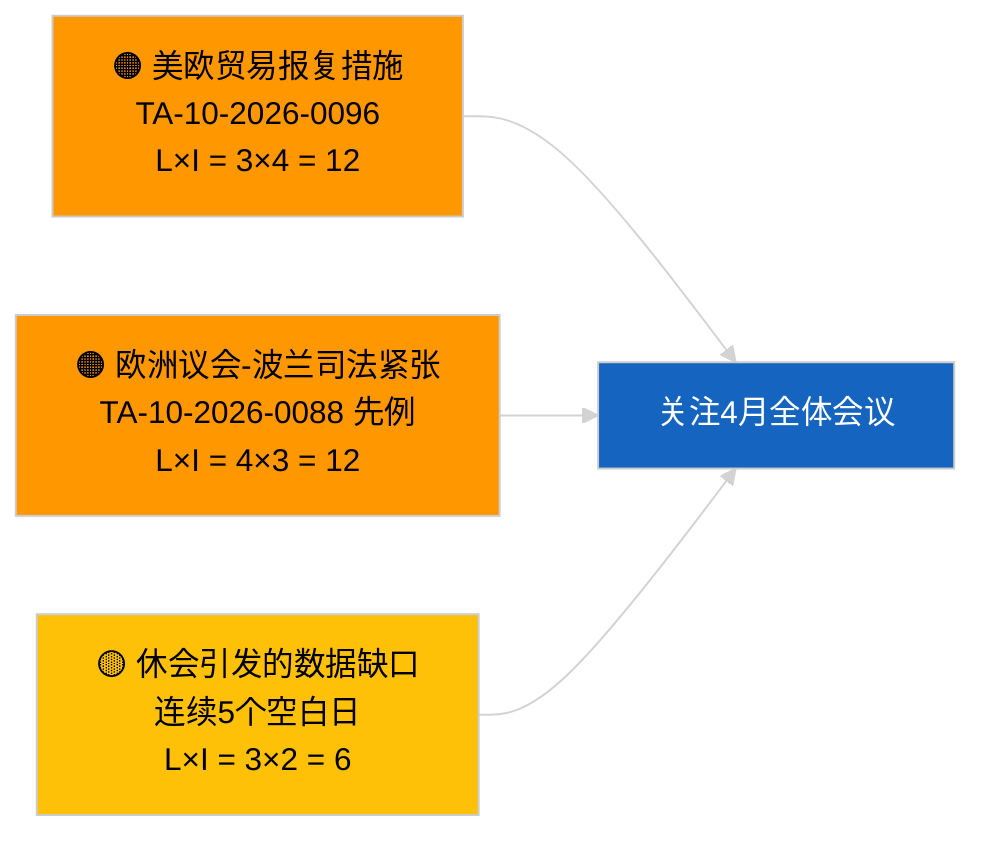

<!-- SPDX-FileCopyrightText: 2026 Hack23 AB -->
<!-- SPDX-License-Identifier: Apache-2.0 -->

# 执行简报 — 突发新闻 | 2026-03-31

**分类：** OSINT | 公开议会记录
**可信度：** 🟢 高（休会期间结构性评估）
**创建日期：** 2026-03-31T00:00:00Z（追溯性简报）
**文章类型：** 突发新闻
**来源：** 欧洲议会开放数据门户

---

## 🎯 核心要点（BLUF）

**2026年3月31日无突发信号；欧洲议会3月后首个休会周最后一天。** 议会处于布鲁塞尔小型全体会议（3月25~26日）与斯特拉斯堡全体会议（4月27~30日）之间的会期间休止期。本简报确认今日无新采纳文本、无新开启程序。最近的延续信号仍来自3月26日布鲁塞尔的采纳——布劳恩议员豁免权解除（TA-10-2026-0088）和美国关税调整法规（TA-10-2026-0096）——两者均与第二季度监察名单相关。稳定性指数和联盟算术保持不变。**🟢 高度可信**：非活跃状态为日历性原因所致。

---

## 🧭 本简报支持的3项决策

| # | 决策 | 决策者 | 期限 | 依据 |
|:-:|------|--------|:----:|------|
| 1 | **编辑：** 跳过每日速报；如有需要则编写周度摘要 | 编辑 | +12小时 | 连续5个休会日无新动态 |
| 2 | **监控：** 参照2026-04-01的6/8 404错误模式核查EP API状态 | 数据管道 | 2026-04-02 | 持续404错误需升级为事件响应 |
| 3 | **前瞻：** 4月13~17日委员会工作周启动全会前新闻周期 | 分析主管 | 2026-04-13 | 委员会草案通常决定全会结果的70~80% |

---

## 📰 60秒新闻摘要

- 🔴 **无一级文章** — 已连续记录5个休会日。（🟢 高）
- 🟠 **2026-03-31无新程序开启或新采纳文本。**（🟢 高）
- 🟢 **联盟算术稳定** — 欧洲人民党38%／社民党22%大联合60%仍是唯一过半数路径。（🟢 高）
- 🟡 **延续风险：** 布劳恩豁免权解除先例（TA-10-2026-0088）为欧洲议会波兰司法相关案件创设模板——4月Jaki案解除已追溯性证实。（🟡 当时为中等）
- 🔵 **经济延续：** 美国关税调整法规（TA-10-2026-0096）与重型车辆排放积分（TA-10-2026-0084）持续为主导性外部/工业信号。（🟢 高）
- 🟣 **交叉参考：** 3月后馈送端点可靠性异常首份完整报告见 `2026-04-01/breaking`。（🟢 高）
- 🩷 **扰乱向量：** 无紧迫性；欧洲人民党结构性优势与美国贸易压力风险延续保持。（🟡 中等）
- ⚪ **延续：** 南方共同市场-欧洲法院提交 TA-10-2026-0008 仍待意见书。

---

## 🗂️ 重点文件 / 程序表

| 排名 | EP参考 | 标题（简称） | 重要性 | 可信度 | 状态 |
|:----:|--------|------------|:------:|:------:|------|
| 1 | — | 2026-03-31无新程序或新采纳文本 | 0.0 | 🟢 高 | 休会——无活动 |
| 2 | TA-10-2026-0096 | 美国关税调整法规（延续） | 7.0 | 🟢 高 | 3月26日采纳；跟踪中 |
| 3 | TA-10-2026-0088 | 布劳恩豁免权解除（延续） | 6.5 | 🟢 高 | 3月26日采纳；先例 |

---

## ⚠️ 风险与威胁快照

| 风险 | 可能 | 影响 | 得分 | 触发因素 | 来源 | 海军部评级 |
|------|:----:|:----:|:----:|----------|------|-----------|
| 美欧贸易报复措施 | 3 | 4 | 12 | 美国反向公告 | TA-10-2026-0096 | A1 |
| 欧洲议会-波兰司法扩散 | 4 | 3 | 12 | 进一步豁免权解除 | TA-10-2026-0088 | A1 |
| 欧洲人民党结构性优势（38%） | 4 | 3 | 12 | Q2少数派防御阵营 | 联盟算术 | A2 |
| 休会数据缺口 | 3 | 2 | 6 | 连续5个空白日 | 每日文章系列 | B2 |

---

## 🔮 首要前瞻性触发因素

**欧洲议会委员会工作周：2026年4月13~17日。** 此期间的委员会草案和影子报告员谈判将在很大程度上预先决定4月27~30日全体会议的结果。第一个真正可操作的信号将来自该时间窗口内的委员会文件馈送。

---

## 🛡️ 信源质量评估

- **一手来源：** 欧洲议会开放数据门户：采纳文本与程序馈送（简报确认2026-03-31无任何条目）。
- **数据局限：** 与2026-04-01明确显现的EP API馈送可靠性问题相同的隐患；今日简报尚未标记该模式。
- **"无新活动"可信度：** 🟢 高。
- **前向推断可信度：** 🟡 中等（基于EP10历史休会规律）。

---

## 📎 链接

| 链接 | 路径 |
|------|------|
| 文章 | `./article.md` |
| 清单 | `./manifest.json` |
| 姊妹简报 | `analysis/daily/2026-03-27/`, `2026-03-28/`, `2026-04-01/breaking/` |

---

## 🔄 与上次运行的交叉参考

**上次运行：** 2026-03-27、2026-03-28每日文章——两者均记录了休会期非活跃状态。

**差异：** 连续5个空白日的序列进一步强化了对该模式为日历性（而非数据管道故障）的 🟢 高度可信度。馈送API首次异常记录于次日（2026-04-01文章）。

---

**文档控制**
- **模板：** `/analysis/templates/executive-brief.md`
- **产物路径：** `analysis/daily/2026-03-31/breaking/executive-brief.md`
- **分类：** 公开
- **追溯性创建：** 针对阶段B EB要求引入前运行的补充会话。
