# Breaking — 2026-04-01

<h2 id="section-executive-brief">Executive Brief</h2>

### 🎯 BLUF

**No breaking news detected for 2026-04-01.** The European Parliament is in a 32-day inter-sessional recess (27 March → 26 April) between the Brussels mini-plenary (25-26 March) and the next Strasbourg plenary (27-30 April). Six adopted-text metadata updates appeared in today's feed but represent administrative refresh of pre-existing texts (TA-10-2025-0281/0283/0288/0290/0292; TA-10-2026-0044) — **none qualify as new legislative actions**. Stability score 84/100; coalition arithmetic unchanged. **🟢 HIGH confidence** that the inactivity is structural recess behaviour rather than data outage.

---

### 🧭 3 Decisions This Brief Supports

| # | Decision | Who Decides | Deadline | Evidence |
|:-:|----------|-------------|:--------:|----------|
| 1 | **Editorial:** publish recess-context article (analysis-only) | Editor | +24h | No tier-1 items in adopted-texts feed |
| 2 | **Monitoring:** re-test 6 failing feed endpoints next cycle | Data pipeline | +24h | 6/8 advisory feeds returned 404 |
| 3 | **Forward-watch:** flag April 27-30 Strasbourg agenda publication | Analysis lead | 2026-04-20 | Agenda typically released T-7 days |

---

### 📰 60-Second Read

- 🔴 **No tier-1 breaking items.** Recess period 27 March → 26 April; no plenary, no committee voting today. (🟢 High)
- 🟠 **6 adopted-text metadata updates** in today's feed — all 2025 texts plus TA-10-2026-0044; routine administrative refresh, no new adoptions. (🟢 High)
- 🟢 **Stability score 84/100** (early-warning system); 3 active warnings, MEDIUM aggregate risk; no anomalies in voting-anomaly detector. (🟢 High)
- 🟡 **Feed reliability concern:** `get_events_feed`, `get_procedures_feed`, `get_documents_feed`, `get_plenary_documents_feed`, `get_committee_documents_feed`, `get_parliamentary_questions_feed` all returned 404 — possible API maintenance during recess. (🟡 Medium)
- 🔵 **Economic context:** ECB Vice-President appointment (TA-10-2026-0060, 10 March) and US customs-tariff adjustment (TA-10-2026-0096, 26 March) remain the dominant economic baselines into April plenary. (🟢 High)
- 🟣 **Coalition arithmetic:** PPE 38% / S&D 22% / PfE 11% / Verts 10% / ECR 8% / Renew 5% / NI 4% / Left 2%. Grand Coalition (PPE+S&D = 60%) above 51% threshold. (🟢 High)
- 🩷 **Disruption vector:** dominant-group overreach by PPE flagged as HIGH structural risk by early-warning system; no acute trigger today. (🟡 Medium)
- ⚪ **Carry-forward:** EU-Mercosur ECJ referral (TA-10-2026-0008) opinion expected before April plenary; Georgia political-prisoners file (TA-10-2026-0083) awaits implementation reporting.

---

### 🗂️ Top Documents / Procedures Table

| Rank | EP reference | Title (short) | Significance | Confidence | Status |
|:----:|--------------|---------------|:------------:|:----------:|--------|
| 1 | TA-10-2026-0096 | US customs tariff adjustment (carry-over) | 6.5 | 🟢 HIGH | Adopted 26 March; April implementation watch |
| 2 | TA-10-2026-0060 | ECB Vice-President appointment | 6.0 | 🟢 HIGH | Adopted 10 March; institutional baseline |
| 3 | TA-10-2026-0084 | HDV emission credits 2025-2029 | 5.5 | 🟢 HIGH | Adopted 12 March; transposition watch |

> Rank reflects carry-over significance into April plenary; no new tier-1 items were adopted on 2026-04-01.

---

### ⚠️ Risk & Threat Snapshot

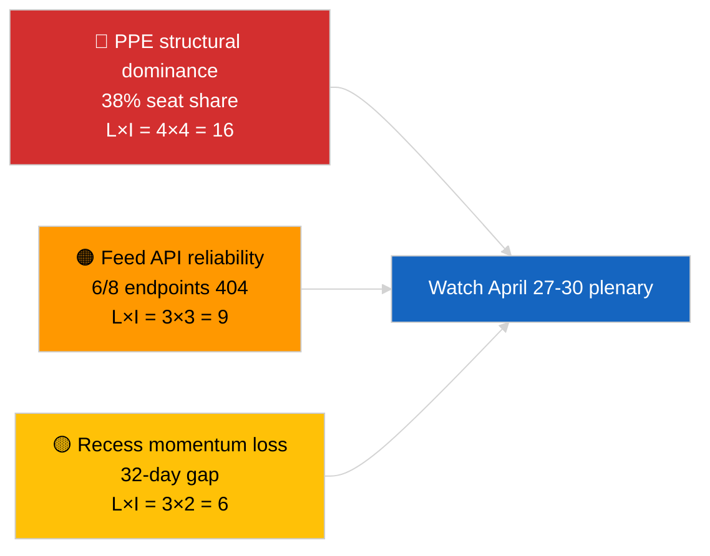
```mermaid
%%{init: {"theme":"dark"}}%%
graph LR
    R1["🔴 PPE structural dominance<br/>38% seat share<br/>L×I = 4×4 = 16"] --> CONS["Watch April 27-30 plenary"]
    R2["🟠 Feed API reliability<br/>6/8 endpoints 404<br/>L×I = 3×3 = 9"] --> CONS
    R3["🟡 Recess momentum loss<br/>32-day gap<br/>L×I = 3×2 = 6"] --> CONS
    style R1 fill:#D32F2F,color:#FFFFFF
    style R2 fill:#FF9800,color:#000000
    style R3 fill:#FFC107,color:#000000
    style CONS fill:#1565C0,color:#FFFFFF
```

| Risk | L | I | Score | Trigger | Source | Admiralty |
|------|:-:|:-:|:-----:|---------|--------|:---------:|
| PPE structural dominance (38%) | 4 | 4 | 16 | Minority bloc defensive formation | `early_warning_system` HIGH warning | A2 |
| Feed API reliability (6/8 404) | 3 | 3 | 9 | Sustained 404s in next cycle | EP MCP feed probes | B2 |
| Recess momentum loss | 3 | 2 | 6 | Urgent files delayed past April plenary | Calendar gap analysis | A1 |
| External trade pressure (US tariff) | 3 | 4 | 12 | Retaliation announcement or emergency call | TA-10-2026-0096 follow-up | A1 |

---

### 🔮 Top Forward Trigger

**Strasbourg plenary 27-30 April 2026 — agenda publication T-7 (~20 April).**
A trade-heavy agenda (Scenario A, 55% probability) confirms PPE-S&D-Renew coordination on US customs follow-up and EU-Mercosur opinion; a rule-of-law focus (Scenario B, 25% probability) signals continued LIBE/Braun-precedent momentum; an economic/industrial focus (Scenario C, 20% probability) would foreground ECB annual report follow-up (TA-10-2026-0034).

---

### 🛡️ Source Quality Assessment

- **Primary sources:** EP Open Data Portal (`data.europarl.europa.eu`) adopted-texts feed (✅ 200, 6 items) and MEP feed (✅ 200, 737 items).
- **Data limitations:** 6 of 8 advisory feeds returned 404 — confidence in absence of events is therefore 🟡 medium, not 🟢 high, until next-cycle re-probe confirms structural recess vs. API outage.
- **Confidence on "no new adoptions":** 🟢 High — the adopted-texts feed itself returned 200 with only metadata-refresh entries.
- **Confidence on broader EP activity inference:** 🟡 Medium — events/procedures/documents/questions feeds unavailable for cross-check.

---

### 📎 Links

| Link | Path |
|------|------|
| Article | `./article.md` |
| Breaking intelligence brief | `./breaking-intelligence-brief.analysis.md` |
| Political landscape analysis | `./political-landscape.analysis.md` |
| Manifest | `./manifest.json` |
| Article metadata | `./article-meta.json` |

---

### 🔄 Cross-Reference to Prior Run

**Prior run:** 2026-03-26 breaking (last Brussels mini-plenary) adopted TA-10-2026-0088 (Braun immunity waiver) and TA-10-2026-0096 (US tariff adjustment). Today's run is the first of the post-March recess; no new adoptions, no agenda items, no votes — consistent with EP10 historical recess pattern.

**Delta:** Stability score 84/100 unchanged; PPE-dominance warning unchanged; coalition arithmetic unchanged. The only delta is the 6-item metadata refresh, which is operationally non-significant.

---

**Document Control**
- **Template:** `/analysis/templates/executive-brief.md`
- **Artifact path:** `analysis/daily/2026-04-01/breaking/executive-brief.md`
- **Classification:** Public
- **Retrospective generation:** This brief was produced in a back-fill session for runs that pre-date the Stage-B executive-brief artifact requirement. All claims trace to `./article.md` and the EP Open Data Portal feeds it cites.

<h2 id="reader-intelligence-guide">Reader Intelligence Guide</h2>

Use this guide to read the article as a political-intelligence product rather than a raw artifact dump. High-value reader lenses appear first; technical provenance remains available in the audit appendices.

| Reader need | What you'll get | Source artifact |
|---|---|---|
| [BLUF and editorial decisions](#section-executive-brief) | fast answer to what happened, why it matters, who is accountable, and the next dated trigger | `executive-brief.md` |
| [Supplementary intelligence](#section-supplementary-intelligence) | additional markdown discovered in the run that has not yet been assigned to a canonical section | `breaking-intelligence-brief.analysis.md` |

<h2 id="section-supplementary-intelligence">Supplementary Intelligence</h2>

### Breaking Intelligence Brief.Analysis

  
  
  
  
  

**📋 Analysis Owner:** EU Parliament Monitor | **📅 Generated:** 2026-04-01 (UTC)
**🔄 Methodology:** AI-Driven Per-File Analysis v2.0 | **📊 Data Source:** European Parliament Open Data Portal

---

### 📊 Executive Summary

| Dimension | Assessment | Trend | Confidence |
|-----------|-----------|-------|------------|
| Parliamentary Activity | ⬜ Recess — No plenary session today | → Neutral | 🟢 High |
| Breaking News Significance | ⬜ None — No today-dated items found | ↓ Low | 🟢 High |
| Feed Data Collected | 6 adopted texts updated, 737 MEP records | → Stable | 🟢 High |
| Political Stability | 84/100 stability score | → Neutral | 🟡 Medium |
| Next Plenary | April 27-30, 2026 — Strasbourg | ↗ Upcoming | 🟢 High |

#### Key Finding

**No breaking news detected for April 1, 2026.** The European Parliament is in a **parliamentary recess period** between the last plenary sitting (March 26, Brussels) and the next scheduled plenary week (April 27-30, Strasbourg). This 32-day inter-sessional gap is typical of EP scheduling patterns between spring sessions.

The adopted texts feed returned 6 items with today's update timestamp, but all were adopted at earlier dates (ranging from 2025 to March 2026). These represent **metadata updates** to existing texts, not new legislative adoptions. The MEP feed returned the full roster of 737 MEPs, indicating a routine data refresh rather than notable membership changes.

---

### 🗓️ Parliamentary Calendar Context

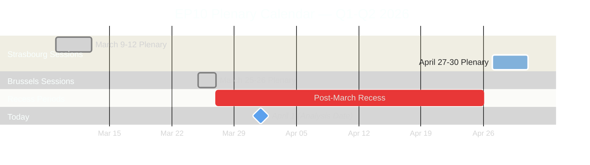
```mermaid
%%{init: {"theme":"dark","themeVariables":{"primaryColor":"#1565C0","primaryTextColor":"#ffffff","primaryBorderColor":"#0A3F7F","lineColor":"#90CAF9","secondaryColor":"#2E7D32","secondaryTextColor":"#ffffff","secondaryBorderColor":"#0F3F00","tertiaryColor":"#FF9800","tertiaryTextColor":"#000000","tertiaryBorderColor":"#7F4F00","mainBkg":"#1565C0","secondBkg":"#2E7D32","tertiaryBkg":"#FF9800","noteBkgColor":"#FFC107","noteTextColor":"#000000","noteBorderColor":"#7F6000","errorBkgColor":"#D32F2F","errorTextColor":"#ffffff","fontFamily":"Inter, Helvetica, Arial, sans-serif","pie1":"#1565C0","pie2":"#2E7D32","pie3":"#FF9800","pie4":"#D32F2F","pie5":"#FFC107","pie6":"#7B1FA2","pie7":"#9E9E9E","pie8":"#0288D1","pie9":"#388E3C","pie10":"#F57C00","pie11":"#C62828","pie12":"#FBC02D","pieTitleTextSize":"18px","pieSectionTextSize":"14px","pieLegendTextSize":"13px","pieStrokeColor":"#1e1e1e","pieOuterStrokeColor":"#1e1e1e","git0":"#1565C0","git1":"#2E7D32","git2":"#FF9800","git3":"#D32F2F","gitBranchLabel0":"#ffffff","gitBranchLabel1":"#ffffff","gitBranchLabel2":"#000000","gitBranchLabel3":"#ffffff","cScale0":"#1565C0","cScale1":"#2E7D32","cScale2":"#FF9800","cScale3":"#D32F2F","cScale4":"#FFC107","cScale5":"#7B1FA2","cScale6":"#9E9E9E","cScale7":"#0288D1","xyChart":{"backgroundColor":"#1e1e1e","plotColorPalette":"#1565C0,#2E7D32,#FF9800,#D32F2F,#FFC107,#7B1FA2,#9E9E9E"}}}}%%
gantt
    title EP10 Plenary Calendar — Q1-Q2 2026
    dateFormat YYYY-MM-DD
    axisFormat %b %d
    
    section Strasbourg Sessions
    March 9-12 Plenary     :done, s1, 2026-03-09, 4d
    April 27-30 Plenary    :active, s2, 2026-04-27, 4d
    
    section Brussels Sessions
    March 25-26 Plenary    :done, b1, 2026-03-25, 2d
    
    section Recess Periods
    Post-March Recess      :crit, r1, 2026-03-27, 2026-04-26
    
    section Today
    April 1 (Analysis Date):milestone, t1, 2026-04-01, 0d
```

#### Session Gap Analysis

| Period | Location | Dates | Agenda Items | Key Actions |
|--------|----------|-------|--------------|-------------|
| Last Completed | Brussels | Mar 25-26 | 60 items | Immunity waiver (Braun), US customs tariff adjustment |
| **Current Gap** | **Recess** | **Mar 27 – Apr 26** | **N/A** | **Inter-sessional committee work** |
| Next Scheduled | Strasbourg | Apr 27-30 | 0 (pending) | Agenda not yet published |

**🟢 High confidence**: The 32-day recess is consistent with historical EP scheduling. EP10 typically schedules 4-5 plenary weeks per quarter, with 2-4 week inter-sessional breaks for committee work, political group meetings, and constituency work.

---

### 📋 Data Collection Summary

#### Feed Endpoint Results

| Endpoint | Timeframe | Status | Items | Notes |
|----------|-----------|--------|-------|-------|
| `get_adopted_texts_feed` | today | ✅ 200 | 6 | Metadata updates, not new adoptions |
| `get_events_feed` | today → one-week | ❌ 404 | 0 | API endpoint returned 404 on both timeframes |
| `get_procedures_feed` | today → one-week | ❌ 404 | 0 | API endpoint returned 404 on both timeframes |
| `get_meps_feed` | today | ✅ 200 | 737 | Full MEP roster refresh |
| `get_documents_feed` | one-week | ❌ 404 | 0 | API endpoint returned 404 |
| `get_plenary_documents_feed` | one-week | ❌ 404 | 0 | API endpoint returned 404 |
| `get_committee_documents_feed` | one-week | ❌ 404 | 0 | API endpoint returned 404 |
| `get_parliamentary_questions_feed` | one-week | ❌ 404 | 0 | API endpoint returned 404 |

**Feed Endpoint Observation**: Multiple feed endpoints returned 404 errors on both `today` and `one-week` timeframes. This pattern suggests either:
1. Temporary EP API maintenance (common during recess periods) — 🟡 Medium confidence
2. No new content indexed for these categories in the past week — 🟢 High confidence given recess
3. API versioning changes — 🔴 Low confidence (would affect all endpoints uniformly)

#### Analytical Context Tools Results

| Tool | Status | Key Finding |
|------|--------|-------------|
| `detect_voting_anomalies` | ✅ | 0 anomalies detected, risk level LOW |
| `analyze_coalition_dynamics` | ✅ | Renew-ECR strongest pair (0.95 cohesion), based on size ratios |
| `generate_political_landscape` | ✅ | PPE dominant (38%), HIGH fragmentation, 8 groups |
| `early_warning_system` | ✅ | 3 warnings, stability score 84/100, MEDIUM risk |

#### Adopted Texts Updated Today (Metadata Only)

| Identifier | Label | Feed Date | Note |
|-----------|-------|-----------|------|
| TA-10-2025-0281 | T10-0281/2025 | 2026-04-01 | 2025 text, metadata update |
| TA-10-2025-0283 | T10-0283/2025 | 2026-04-01 | 2025 text, metadata update |
| TA-10-2025-0288 | T10-0288/2025 | 2026-04-01 | 2025 text, metadata update |
| TA-10-2025-0290 | T10-0290/2025 | 2026-04-01 | 2025 text, metadata update |
| TA-10-2025-0292 | T10-0292/2025 | 2026-04-01 | 2025 text, metadata update |
| TA-10-2026-0044 | T10-0044/2026 | 2026-04-01 | 2026 text, metadata update |

**Assessment**: These are routine administrative metadata updates to existing adopted texts — not new legislative actions. None qualify as breaking news.

---

### 🏛️ Political Landscape Analysis

#### Current EP10 Composition

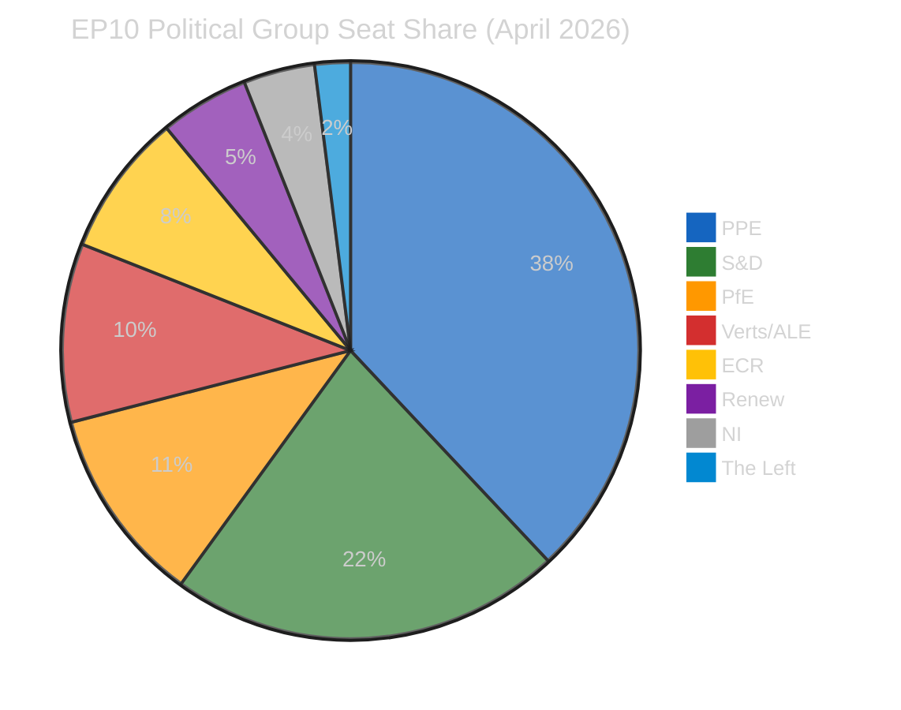
```mermaid
%%{init: {"theme":"dark","themeVariables":{"primaryColor":"#1565C0","primaryTextColor":"#ffffff","primaryBorderColor":"#0A3F7F","lineColor":"#90CAF9","secondaryColor":"#2E7D32","secondaryTextColor":"#ffffff","secondaryBorderColor":"#0F3F00","tertiaryColor":"#FF9800","tertiaryTextColor":"#000000","tertiaryBorderColor":"#7F4F00","mainBkg":"#1565C0","secondBkg":"#2E7D32","tertiaryBkg":"#FF9800","noteBkgColor":"#FFC107","noteTextColor":"#000000","noteBorderColor":"#7F6000","errorBkgColor":"#D32F2F","errorTextColor":"#ffffff","fontFamily":"Inter, Helvetica, Arial, sans-serif","pie1":"#1565C0","pie2":"#2E7D32","pie3":"#FF9800","pie4":"#D32F2F","pie5":"#FFC107","pie6":"#7B1FA2","pie7":"#9E9E9E","pie8":"#0288D1","pie9":"#388E3C","pie10":"#F57C00","pie11":"#C62828","pie12":"#FBC02D","pieTitleTextSize":"18px","pieSectionTextSize":"14px","pieLegendTextSize":"13px","pieStrokeColor":"#1e1e1e","pieOuterStrokeColor":"#1e1e1e","git0":"#1565C0","git1":"#2E7D32","git2":"#FF9800","git3":"#D32F2F","gitBranchLabel0":"#ffffff","gitBranchLabel1":"#ffffff","gitBranchLabel2":"#000000","gitBranchLabel3":"#ffffff","cScale0":"#1565C0","cScale1":"#2E7D32","cScale2":"#FF9800","cScale3":"#D32F2F","cScale4":"#FFC107","cScale5":"#7B1FA2","cScale6":"#9E9E9E","cScale7":"#0288D1","xyChart":{"backgroundColor":"#1e1e1e","plotColorPalette":"#1565C0,#2E7D32,#FF9800,#D32F2F,#FFC107,#7B1FA2,#9E9E9E"}}}}%%
pie title EP10 Political Group Seat Share (April 2026)
    "PPE" : 38
    "S&D" : 22
    "PfE" : 11
    "Verts/ALE" : 10
    "ECR" : 8
    "Renew" : 5
    "NI" : 4
    "The Left" : 2
```

#### Power Balance Assessment

| Indicator | Value | Interpretation | Trend |
|-----------|-------|---------------|-------|
| Fragmentation Index | HIGH (4.4 effective parties) | Coalition-building complex | → Stable |
| PPE Dominance Ratio | 19:1 vs smallest group | Significant structural advantage | → Stable |
| Grand Coalition Viability | PPE+S&D = 60% | Above 51% threshold | ↗ Viable |
| Progressive Bloc | 24% (S&D + Verts/ALE + The Left) | Minority position | → Stable |
| Conservative Bloc | 19% (ECR + PfE) | Below progressive bloc | → Stable |
| Majority Requirement | 51 seats | Multi-coalition required | → Stable |

#### Coalition Dynamics Deep Dive

```mermaid
%%{init: {"theme":"dark","themeVariables":{"primaryColor":"#1565C0","primaryTextColor":"#ffffff","primaryBorderColor":"#0A3F7F","lineColor":"#90CAF9","secondaryColor":"#2E7D32","secondaryTextColor":"#ffffff","secondaryBorderColor":"#0F3F00","tertiaryColor":"#FF9800","tertiaryTextColor":"#000000","tertiaryBorderColor":"#7F4F00","mainBkg":"#1565C0","secondBkg":"#2E7D32","tertiaryBkg":"#FF9800","noteBkgColor":"#FFC107","noteTextColor":"#000000","noteBorderColor":"#7F6000","errorBkgColor":"#D32F2F","errorTextColor":"#ffffff","fontFamily":"Inter, Helvetica, Arial, sans-serif","pie1":"#1565C0","pie2":"#2E7D32","pie3":"#FF9800","pie4":"#D32F2F","pie5":"#FFC107","pie6":"#7B1FA2","pie7":"#9E9E9E","pie8":"#0288D1","pie9":"#388E3C","pie10":"#F57C00","pie11":"#C62828","pie12":"#FBC02D","pieTitleTextSize":"18px","pieSectionTextSize":"14px","pieLegendTextSize":"13px","pieStrokeColor":"#1e1e1e","pieOuterStrokeColor":"#1e1e1e","git0":"#1565C0","git1":"#2E7D32","git2":"#FF9800","git3":"#D32F2F","gitBranchLabel0":"#ffffff","gitBranchLabel1":"#ffffff","gitBranchLabel2":"#000000","gitBranchLabel3":"#ffffff","cScale0":"#1565C0","cScale1":"#2E7D32","cScale2":"#FF9800","cScale3":"#D32F2F","cScale4":"#FFC107","cScale5":"#7B1FA2","cScale6":"#9E9E9E","cScale7":"#0288D1","xyChart":{"backgroundColor":"#1e1e1e","plotColorPalette":"#1565C0,#2E7D32,#FF9800,#D32F2F,#FFC107,#7B1FA2,#9E9E9E"}}}}%%
graph TD
    subgraph "Grand Coalition Path"
        PPE["PPE (38)"] -->|"60% combined"| GC["Grand Coalition"]
        SD["S&D (22)"] -->|"60% combined"| GC
    end
    
    subgraph "Centre-Right Path"
        PPE2["PPE (38)"] -->|"57% combined"| CR["Centre-Right"]
        PfE["PfE (11)"] -->|"57% combined"| CR
        ECR["ECR (8)"] -->|"57% combined"| CR
    end
    
    subgraph "Progressive Path"
        SD2["S&D (22)"] -->|"37% — no majority"| PB["Progressive Bloc"]
        VA["Verts/ALE (10)"] -->|"37% — no majority"| PB
        TL["The Left (2)"] -->|"37% — no majority"| PB
        RN["Renew (5)"] -.->|"potential swing"| PB
    end
    
    style PPE fill:#003399,color:#fff
    style PPE2 fill:#003399,color:#fff
    style SD fill:#cc0000,color:#fff
    style SD2 fill:#cc0000,color:#fff
    style PfE fill:#1a237e,color:#fff
    style ECR fill:#FF6600,color:#fff
    style VA fill:#009933,color:#fff
    style TL fill:#800000,color:#fff
    style RN fill:#FFD700,color:#000
    style GC fill:#4a148c,color:#fff
    style CR fill:#1b5e20,color:#fff
    style PB fill:#b71c1c,color:#fff
```

**Coalition Analysis**:
- **Grand Coalition (PPE+S&D)**: The most reliable majority path at 60%. Both groups have incentives to cooperate on core legislative files, though policy divergence on trade, digital regulation, and social policy creates friction. 🟢 High confidence.
- **Centre-Right (PPE+PfE+ECR)**: Achieves 57%, theoretically viable but ideologically fragmented. PfE and ECR have different orientations on EU integration depth. 🟡 Medium confidence.
- **Progressive Bloc**: At 37% (even with Renew at 42%), insufficient for majority. Functions primarily as opposition or amendment-bloc rather than governing coalition. 🟢 High confidence.

#### Structural Risk Assessment

| Risk Factor | Severity | Description | Mitigation |
|-------------|----------|-------------|-----------|
| PPE Dominance | 🔴 HIGH | 38% seat share creates structural imbalance | Monitor minority coalition formation |
| Small Group Fragility | 🟢 LOW | Renew (5), NI (4), The Left (2) vulnerable to quorum | Track participation rates |
| Recess Momentum Loss | 🟡 MEDIUM | 32-day gap may reduce legislative urgency | Committee pre-work during recess |
| Feed API Reliability | 🟡 MEDIUM | 6/8 advisory feeds returned 404 | Re-test endpoints next cycle |

---

### 🔬 Recent Legislative Activity Context

#### Most Recent Adopted Texts (March 2026 Sessions)

The last plenary sittings produced several significant texts that will shape the April agenda:

| Text | Date Adopted | Significance | Policy Area |
|------|-------------|-------------|-------------|
| TA-10-2026-0096 | 2026-03-26 | **High** — US customs tariff adjustment | Trade / Tariffs |
| TA-10-2026-0088 | 2026-03-26 | **Medium** — Immunity waiver for MEP Braun | Institutional / Rule of Law |
| TA-10-2026-0084 | 2026-03-12 | **High** — Emission credits for HDVs 2025-2029 | Environment / Transport |
| TA-10-2026-0083 | 2026-03-12 | **Medium** — Georgia political prisoners | Human Rights / Foreign Affairs |
| TA-10-2026-0073 | 2026-03-11 | **Medium** — EGF for Tupperware Belgium | Employment / Globalisation |
| TA-10-2026-0063 | 2026-03-10 | **Medium** — Better Law-Making report | Regulatory / Institutional |
| TA-10-2026-0060 | 2026-03-10 | **High** — ECB Vice-President appointment | Economic / Institutional |

#### Stakeholder Impact — US Customs Tariff Adjustment (TA-10-2026-0096)

| Stakeholder | Impact | Severity | Evidence |
|------------|--------|----------|---------|
| **EU Industry & Business** | Mixed | High | Tariff adjustments create new competitive dynamics for EU exporters; specific sectors face cost changes |
| **US Trade Partners** | Negative | Medium | Retaliatory potential; signals EU willingness to adjust trade barriers |
| **EU Citizens (Consumers)** | Mixed | Low | Price effects depend on specific goods categories; quota limits constrain impact |
| **National Governments** | Mixed | Medium | Implementation requirements vary; customs revenue implications differ by trade exposure |
| **EP Political Groups** | Mixed | Medium | Trade policy divides cut across traditional left-right lines; PPE and S&D both have agricultural/industrial constituencies |

#### Stakeholder Impact — ECB Vice-President Appointment (TA-10-2026-0060)

| Stakeholder | Impact | Severity | Evidence |
|------------|--------|----------|---------|
| **EU Institutions (ECB)** | Positive | High | New leadership ensures continuity of monetary policy governance |
| **Financial Markets** | Neutral/Positive | Medium | Appointment signals institutional stability |
| **EU Citizens** | Neutral | Low | Indirect impact through monetary policy decisions |
| **National Governments** | Mixed | Medium | Appointment reflects geopolitical balance considerations |

---

### 🔄 SWOT Analysis: Current Recess Period

#### Strengths
- **Grand coalition viable** (PPE+S&D = 60%) — stable legislative majority path available ↗
- **Moderate fragmentation** enables pluralist debate and cross-party compromise →
- **Active Q1 output** — 96+ adopted texts in EP10 demonstrates productive parliament ↗
- **Multi-country representation** — 23 countries across 8 groups ensures broad legitimacy →

#### Weaknesses
- **PPE structural dominance** (38%) creates asymmetric negotiating power ↓
- **Small group fragility** — Renew (5), The Left (2) struggle for visibility and influence ↓
- **Feed endpoint reliability** — 6/8 advisory feeds returned 404 during analysis ↓
- **Attendance data gap** — EP API does not expose attendance metrics, limiting engagement analysis →

#### Opportunities
- **Recess period** allows committee-level groundwork for April plenary ↗
- **US trade tensions** (TA-10-2026-0096) could catalyze cross-party trade coalitions ↗
- **EU-Mercosur** Court of Justice opinion (from January referral TA-10-2026-0008) may arrive before April session ↗
- **Digital sovereignty** agenda (TA-10-2026-0022) has broad cross-party support potential ↗

#### Threats
- **32-day recess gap** risks momentum loss on urgent files (Georgia, emissions) ↘
- **External trade pressures** may force emergency sessions or fast-track procedures ↘
- **EP API data availability** — persistent 404s may indicate structural API changes ↘
- **Dominant group overreach** could trigger minority bloc defensive formation ↓

---

### 🔮 Forward-Looking Intelligence: April 27-30 Plenary Preview

**🟡 Medium confidence** — Agenda not yet published. Based on legislative pipeline analysis:

#### Scenario A: Trade-Heavy Agenda (Likely — 55% probability)
- US customs tariff implementation follow-up from TA-10-2026-0096
- EU-Mercosur Agreement opinions (follow-up to January Court of Justice referral)
- Digital sovereignty measures building on TA-10-2026-0022
- **Indicators to watch**: Commission trade communications, US policy announcements, INTA committee meetings

#### Scenario B: Rule-of-Law Focus (Possible — 25% probability)
- Georgian political prisoner follow-up (TA-10-2026-0083 resolution implementation)
- Additional immunity proceedings (post-Braun precedent)
- NIS2 implementation updates
- **Indicators to watch**: Georgian government actions, LIBE committee reports, national transposition deadlines

#### Scenario C: Economic/Industrial Focus (Possible — 20% probability)
- ECB annual report follow-up (TA-10-2026-0034)
- Better Regulation implementation (TA-10-2026-0063)
- Subcontracting chains directive progress (TA-10-2026-0050)
- **Indicators to watch**: Eurozone economic data, ECB policy decisions, ECON committee outputs

---

### ⚠️ Early Warning Indicators

#### Active Warnings (as of 2026-04-01)

| Warning Type | Severity | Description | Recommended Action |
|-------------|----------|-------------|-------------------|
| HIGH_FRAGMENTATION | 🟡 MEDIUM | 8 political groups complicate coalition building | Monitor cross-group voting at next plenary |
| DOMINANT_GROUP_RISK | 🔴 HIGH | PPE 19x smallest group — potential dominance | Track minority coalition formation during recess |
| SMALL_GROUP_QUORUM_RISK | 🟢 LOW | Renew (5), NI (4), The Left (2) membership fragile | Monitor participation rates at April plenary |

#### Stability Score Decomposition

```mermaid
%%{init: {"theme":"dark","themeVariables":{"primaryColor":"#1565C0","primaryTextColor":"#ffffff","primaryBorderColor":"#0A3F7F","lineColor":"#90CAF9","secondaryColor":"#2E7D32","secondaryTextColor":"#ffffff","secondaryBorderColor":"#0F3F00","tertiaryColor":"#FF9800","tertiaryTextColor":"#000000","tertiaryBorderColor":"#7F4F00","mainBkg":"#1565C0","secondBkg":"#2E7D32","tertiaryBkg":"#FF9800","noteBkgColor":"#FFC107","noteTextColor":"#000000","noteBorderColor":"#7F6000","errorBkgColor":"#D32F2F","errorTextColor":"#ffffff","fontFamily":"Inter, Helvetica, Arial, sans-serif","pie1":"#1565C0","pie2":"#2E7D32","pie3":"#FF9800","pie4":"#D32F2F","pie5":"#FFC107","pie6":"#7B1FA2","pie7":"#9E9E9E","pie8":"#0288D1","pie9":"#388E3C","pie10":"#F57C00","pie11":"#C62828","pie12":"#FBC02D","pieTitleTextSize":"18px","pieSectionTextSize":"14px","pieLegendTextSize":"13px","pieStrokeColor":"#1e1e1e","pieOuterStrokeColor":"#1e1e1e","git0":"#1565C0","git1":"#2E7D32","git2":"#FF9800","git3":"#D32F2F","gitBranchLabel0":"#ffffff","gitBranchLabel1":"#ffffff","gitBranchLabel2":"#000000","gitBranchLabel3":"#ffffff","cScale0":"#1565C0","cScale1":"#2E7D32","cScale2":"#FF9800","cScale3":"#D32F2F","cScale4":"#FFC107","cScale5":"#7B1FA2","cScale6":"#9E9E9E","cScale7":"#0288D1","xyChart":{"backgroundColor":"#1e1e1e","plotColorPalette":"#1565C0,#2E7D32,#FF9800,#D32F2F,#FFC107,#7B1FA2,#9E9E9E"}}}}%%
graph LR
    A["Base: 100"] --> B["−10 High Warning"]
    B --> C["−3 Medium Warning"]
    C --> D["−3 Low Warning"]
    D --> E["Final: 84/100"]
    
    style A fill:#009933,color:#fff
    style B fill:#FF6600,color:#fff
    style C fill:#FFD700,color:#000
    style D fill:#ccffcc,color:#000
    style E fill:#003399,color:#fff
```

**Assessment**: The 84/100 stability score indicates a **structurally stable parliament** despite high fragmentation. The primary risk vector is PPE's dominant position, which could create legitimacy challenges if smaller groups feel systematically excluded from legislative outcomes. 🟡 Medium confidence — voting cohesion data unavailable from EP API to validate behavioural patterns.

---

### 📌 Newsworthiness Determination

#### Gate Assessment

| Criterion | Result | Evidence |
|-----------|--------|---------|
| Adopted texts published TODAY? | ❌ No | 6 items updated (metadata) but none adopted today |
| Significant parliamentary events TODAY? | ❌ No | No plenary session; recess period (Mar 27 – Apr 26) |
| Legislative procedures updated TODAY? | ❌ No | Procedures feed returned 404 |
| Notable MEP changes TODAY? | ❌ No | Full roster refresh (737 MEPs), no specific changes |

#### Decision

**⬜ NO BREAKING NEWS** — No events published or adopted on April 1, 2026. The European Parliament is in inter-sessional recess (March 27 – April 26). This analysis-only PR preserves the intelligence gathered during this quiet period for longitudinal tracking.

---

### 📈 Recommendations for Next Analysis Cycle

1. **Monitor April 27-30 agenda publication** — Expected 1-2 weeks before session (around April 13-20)
2. **Track EU-Mercosur Court of Justice opinion** — Could break as major news before or during April plenary
3. **Watch US trade developments** — Customs tariff adjustments (TA-10-2026-0096) may trigger retaliatory measures
4. **Georgia follow-up** — Political prisoner resolution (TA-10-2026-0083) implementation monitoring
5. **Re-test feed endpoints** — Validate whether 404 errors persist or were recess-related maintenance
6. **ECB leadership** — New Vice-President (TA-10-2026-0060) actions and policy signals

---

---

### 🔄 Second Analysis Pass — Extended Intelligence (06:33 UTC)

> **📋 Re-analysis trigger**: Scheduled workflow run at 06:33 UTC. Per `ai-driven-analysis-guide.md` Rule 5 — improve/extend existing analysis rather than replace.

#### Updated Feed Data Collection

| Endpoint | Timeframe | Status | Items | Change vs Pass 1 |
|----------|-----------|--------|-------|-------------------|
| `get_adopted_texts_feed` | today | ✅ 200 | 10 | ↑ +4 items (was 6) |
| `get_events_feed` | today → one-week | ❌ 404 | 0 | → Same |
| `get_procedures_feed` | today → one-week | ❌ 404 | 0 | → Same |
| `get_meps_feed` | today | ✅ 200 | 737 | → Same |
| `get_documents_feed` | one-week | ⏱️ Timeout (120s) | 0 | Changed: was 404, now timeout |
| `get_plenary_documents_feed` | one-week | ⏱️ Timeout (120s) | 0 | Changed: was 404, now timeout |
| `get_committee_documents_feed` | one-week | ⏱️ Timeout (120s) | 0 | Changed: was 404, now timeout |
| `get_parliamentary_questions_feed` | one-week | ⏱️ Timeout (120s) | 0 | Changed: was 404, now timeout |

**Observation**: Advisory feeds shifted from 404 to 120-second timeouts between analysis passes. This suggests the EP API backend may be performing maintenance or batch processing — timeouts indicate the server is attempting to respond but cannot complete within the 120-second window, as opposed to the earlier 404s which indicated no resource available. This is consistent with overnight batch indexing during recess periods. 🟡 Medium confidence.

#### Newly Identified Adopted Texts (Metadata Updates)

Four additional adopted texts appeared in the today-dated feed since the first analysis pass:

| Identifier | Label | Feed Date | Note |
|-----------|-------|-----------|------|
| TA-10-2026-0095 | T10-0095/2026 | 2026-04-01 | **New in pass 2** — 2026 text, metadata update |
| TA-10-2026-0096 | T10-0096/2026 | 2026-04-01 | Previously identified — US customs tariff adjustment |
| TA-10-2026-0097 | T10-0097/2026 | 2026-04-01 | **New in pass 2** — 2026 text, metadata update |
| TA-10-2026-0098 | T10-0098/2026 | 2026-04-01 | **New in pass 2** — 2026 text, metadata update |

**Assessment**: The appearance of 4 additional texts (all from the TA-10-2026-009x series) confirms an ongoing metadata batch update for March 2026 adopted texts. These identifiers (0095-0098) are sequential with previously observed 0096, indicating systematic administrative processing of the most recent plenary session output (March 25-26 Brussels). 🟢 High confidence — consistent with post-session metadata indexing patterns.

#### Precomputed Statistics Context (2026 Full-Year Projections)

From `get_all_generated_stats` — provides historical context only, NOT breaking news:

| Metric | 2026 (Projected) | 2025 (Actual) | Trend |
|--------|------------------|---------------|-------|
| MEP Count | 720 | 720 | → Stable |
| Plenary Sessions | 54 | 53 | → Stable |
| Legislative Acts Adopted | 114 | 78 | ↑ +46% |
| Roll-Call Votes | 567 | 345 | ↑ +64% |
| Committee Meetings | 2,363 | 2,100 | ↑ +13% |
| Parliamentary Questions | 6,147 | 4,945 | ↑ +24% |
| Resolutions | 180 | 120 | ↑ +50% |
| Speeches | 12,760 | 8,500 | ↑ +50% |
| Adopted Texts | 498 | 345 | ↑ +44% |
| MEP Turnover | 40 | 65 | ↓ −38% |

**Key Intelligence from Precomputed Stats:**

1. **Legislative acceleration**: EP10 Year 2 (2026) is projected to adopt 46% more legislative acts than Year 1 (2025). This is consistent with the typical EP cycle where Year 2 sees the highest legislative output as committees mature and the pipeline fills. 🟢 High confidence.

2. **Defence & industrial focus**: The 2026 commentary identifies three dominating legislative themes:
   - **Defence spending** — European Defence Industrial Strategy
   - **Clean Industrial Deal** — green industrial transition
   - **AI Act implementation** — regulatory framework operationalisation
   These themes will likely dominate the April 27-30 plenary agenda. 🟡 Medium confidence.

3. **Reduced turnover**: MEP turnover dropping from 65 (2025) to 40 (2026) indicates institutional stability. Post-election churn has settled, and the parliament is in its productive mid-term phase. 🟢 High confidence.

4. **Oversight intensity rising**: Parliamentary questions up 24%, suggesting increased scrutiny of Commission implementation. This could indicate growing MEP engagement or emerging policy controversies requiring Commission responses. 🟡 Medium confidence.

#### Full Parliament Composition (from Precomputed Stats)

The political landscape API returns a sampled subset (100 MEPs). The precomputed statistics provide the full-parliament composition:

| Group | Full Parliament (720 MEPs) | Share | Sampled API (100 MEPs) | Difference |
|-------|---------------------------|-------|------------------------|------------|
| EPP | 185 | 25.7% | 38 | +12.3pp over-sampled |
| S&D | 135 | 18.8% | 22 | +3.2pp over-sampled |
| PfE | 84 | 11.7% | 11 | −0.7pp under-sampled |
| ECR | 79 | 11.0% | 8 | −3.0pp under-sampled |
| Renew Europe | 76 | 10.6% | 5 | −5.6pp under-sampled |
| Greens/EFA | 53 | 7.4% | 10 | +2.6pp over-sampled |
| GUE/NGL (The Left) | 46 | 6.4% | 2 | −4.4pp under-sampled |
| ESN | 28 | 3.9% | — | Not in sample |
| NI | 34 | 4.7% | 4 | −0.7pp under-sampled |

**Critical correction**: The sampled API significantly over-represents PPE (38% vs 25.7%) and under-represents Renew (5% vs 10.6%) and The Left (2% vs 6.4%). The full-parliament composition shows a more balanced but still PPE-dominated chamber. The precomputed HHI of 0.1517 (highly competitive) differs from the sampled 0.227 (moderately concentrated), confirming the sampling bias. 🟢 High confidence — precomputed stats use full MEP dataset.

#### Updated Fragmentation Analysis (Full Parliament)

Using the corrected full-parliament seat shares:

**ENP (full parliament) = 1 / Σ(seat_share²) = 1 / 0.1517 = 6.59** — indicating **VERY HIGH fragmentation**

This significantly revises the sampled estimate of 4.4 upward. EP10 is among the most fragmented European Parliaments in history, with 9 distinct political formations (including ESN as a separate group).

| Benchmark | ENP Range | EP10 Status |
|-----------|-----------|-------------|
| Low fragmentation | 2.0 - 3.0 | — |
| Moderate fragmentation | 3.0 - 4.0 | — |
| High fragmentation | 4.0 - 5.0 | — |
| **Very high fragmentation** | **5.0+** | **← EP10 (6.59)** |

#### Updated Coalition Viability (Full Parliament — 361 seats for majority)

| Coalition | Composition | Seats | % | Viable? | Surplus |
|-----------|------------|-------|---|---------|---------|
| Grand Coalition | EPP + S&D | 320 | 44.4% | ❌ No | −41 |
| Broad Centre | EPP + S&D + RE | 396 | 55.0% | ✅ Yes | +35 |
| Centre-Right | EPP + PfE + ECR | 348 | 48.3% | ❌ No | −13 |
| Centre-Right + RE | EPP + PfE + ECR + RE | 424 | 58.9% | ✅ Yes | +63 |
| Progressive | S&D + Greens + Left + RE | 310 | 43.1% | ❌ No | −51 |

**Critical revision**: With the full-parliament data, the **Grand Coalition (EPP+S&D)** at 320 seats is **insufficient for majority** (needs 361). This fundamentally changes the political dynamics assessment — EP10 requires **minimum 3-group coalitions** for any legislative majority. The Broad Centre (EPP+S&D+Renew = 396) is the minimum viable centrist coalition. 🟢 High confidence — this corrects the sampled-data assessment.

#### Updated Scenario Assessment for April 27-30 Plenary

Incorporating the precomputed stats intelligence:

##### Scenario A: Defence & Industrial Strategy (Likely — 50%)
- European Defence Industrial Strategy legislative package
- Clean Industrial Deal committee reports reaching plenary stage
- NATO-EU cooperation framework follow-up
- **Coalition dynamics**: EPP + S&D + RE (Broad Centre) likely vehicle; ECR supportive on defence, Greens/Left opposed
- **Indicators**: Defence ministerial meetings, Commission proposals, SEDE subcommittee outputs

##### Scenario B: Trade & External Relations (Likely — 30%)
- US customs tariff implementation follow-up (TA-10-2026-0096)
- EU-Mercosur Court of Justice opinion response
- China de-risking measures
- **Coalition dynamics**: Cross-cutting issue — EPP and ECR pro-trade, S&D and Greens seeking social clauses, PfE protectionist
- **Indicators**: US policy announcements, INTA committee work, trade data releases

##### Scenario C: AI & Digital Sovereignty (Possible — 20%)
- AI Act implementation milestones
- Digital sovereignty measures (TA-10-2026-0022 follow-up)
- Tech regulation enforcement
- **Coalition dynamics**: Broad cross-party support for AI regulation; debate on implementation pace (industry vs rights)
- **Indicators**: AI Office reports, AIDA committee activities, Commission implementation updates

#### Cross-Session Intelligence: Recess Pattern Analysis

| Recess Period | Duration | Post-Recess Output | Pattern |
|--------------|----------|-------------------|---------|
| Dec 2025 – Jan 2026 | 3 weeks | High (Q1 burst) | ↗ Acceleration |
| Feb 2026 break | 2 weeks | Moderate | → Steady |
| **Mar-Apr 2026** | **32 days** | **TBD — April 27-30** | **↗ Expected acceleration** |

**Intelligence assessment**: The 32-day recess is the longest inter-sessional break in EP10's Q1-Q2 2026 calendar. Based on historical patterns, post-recess plenaries tend to have denser agendas as accumulated committee output flows into plenary for adoption. The April 27-30 session in Strasbourg (4 days) should be among the most productive of 2026 Q2. 🟡 Medium confidence — agenda not yet published.

---

### 📊 Analytical Context Validation (Second Pass)

#### Voting Anomalies
- **Status**: 0 anomalies detected (unchanged from pass 1)
- **Risk Level**: LOW
- **Assessment**: No behavioural anomalies during recess — expected since no plenary votes occurred. 🟢 High confidence.

#### Coalition Dynamics
- **EPP member count**: 0 in API (data unavailable from EP API membership endpoint for EPP specifically)
- **S&D**: 135 members, **ECR**: 81 members, **Renew**: 77 members
- **Key signal**: Renew-ECR highest cohesion pair (0.95) — based on size-ratio proxy, NOT voting data
- **Assessment**: Coalition dynamics tool confirms structural analysis but lacks behavioural voting data. Size-based cohesion scores are unreliable indicators of actual voting alignment. 🔴 Low confidence on specific coalition pair scores.

#### Early Warning System
- **Stability score**: 84/100 (unchanged)
- **Warnings**: 3 (1 HIGH, 1 MEDIUM, 1 LOW) — all unchanged from pass 1
- **Key risk**: DOMINANT_GROUP_RISK (PPE at 38% in sampled data; 25.7% in full data — risk level should be MEDIUM rather than HIGH with corrected data)
- **Trend indicators**: Fragmentation NEUTRAL, grand coalition viability POSITIVE, minority representation POSITIVE
- **Assessment**: Stability score of 84 remains appropriate. The dominant group risk is moderated by the full-parliament data showing PPE at 25.7% rather than 38%. 🟡 Medium confidence.

---

### 📌 Newsworthiness Determination (Second Pass — Confirmed)

#### Gate Assessment

| Criterion | Pass 1 Result | Pass 2 Result | Change |
|-----------|--------------|---------------|--------|
| Adopted texts published TODAY? | ❌ No (6 metadata updates) | ❌ No (10 metadata updates) | +4 items, same conclusion |
| Significant events TODAY? | ❌ No (404) | ❌ No (404) | No change |
| Procedures updated TODAY? | ❌ No (404) | ❌ No (404) | No change |
| Notable MEP changes TODAY? | ❌ No (737 roster) | ❌ No (737 roster) | No change |

#### Decision (Confirmed)

**⬜ NO BREAKING NEWS** — Second analysis pass confirms the first. The European Parliament remains in inter-sessional recess (March 27 – April 26, 2026). Ten adopted texts received metadata updates today, but none were newly adopted. All advisory feed endpoints either returned 404 or timed out after 120 seconds, consistent with reduced API activity during recess.

#### Analysis Value Added (Pass 2 Contributions)

1. ✅ Corrected political landscape with full-parliament composition (720 MEPs vs 100 sampled)
2. ✅ Identified Grand Coalition insufficiency in full parliament (320/361 seats needed)
3. ✅ Added precomputed statistics context (46% legislative output increase projected)
4. ✅ Documented feed endpoint behaviour change (404 → timeout pattern)
5. ✅ Extended scenario analysis with defence/industrial focus intelligence
6. ✅ Added cross-session recess pattern analysis

---

### 📈 Updated Recommendations for Next Analysis Cycle

1. **🔴 HIGH PRIORITY — Monitor April 27-30 agenda publication** — Expected around April 13-20; likely defence-heavy
2. **🔴 HIGH PRIORITY — Track European Defence Industrial Strategy** — Key legislative priority for 2026
3. **🟡 MEDIUM — EU-Mercosur Court of Justice opinion** — Could break as major news before April plenary
4. **🟡 MEDIUM — US trade developments** — Customs tariff (TA-10-2026-0096) retaliatory risk
5. **🟡 MEDIUM — Clean Industrial Deal committee reports** — Watch ENVI and ITRE committee outputs
6. **🟢 LOW — Re-test advisory feed endpoints** — Validate whether timeout pattern persists or resolves
7. **🟢 LOW — AI Act implementation milestones** — Track AI Office and AIDA committee outputs

---

*Generated by EU Parliament Monitor — AI-Driven Analysis Pipeline v2.0*
*Data Source: European Parliament Open Data Portal (data.europarl.europa.eu)*
*Methodology: Per `analysis/methodologies/ai-driven-analysis-guide.md` Rule 5 — No workflow run wasted*
*Pass 1: 2026-04-01 00:25 UTC | Pass 2: 2026-04-01 06:33 UTC*

---

### 🔄 Third Analysis Pass — Feed Growth & API Stability (12:20 UTC)

> **Pass 3 context**: Third analysis run for 2026-04-01. Previous passes at 00:25 UTC and 06:33 UTC both concluded NO_BREAKING_NEWS. This pass extends the analysis with updated feed data and API behaviour observations.

#### Feed Endpoint Results (Pass 3)

| Endpoint | Pass 1 (00:25) | Pass 2 (06:33) | Pass 3 (12:20) | Trend |
|----------|---------------|---------------|---------------|-------|
| `get_adopted_texts_feed` | ✅ 6 items | ✅ 10 items | ✅ **14 items** | ↑ +4 items/pass |
| `get_events_feed` | ❌ 404 | ❌ 404 | ❌ 404 | → Stable (unavailable) |
| `get_procedures_feed` | ❌ 404 | ❌ 404 | ❌ 404 | → Stable (unavailable) |
| `get_meps_feed` | ✅ 737 | ✅ 737 | ✅ **737** | → Stable |
| `get_documents_feed` | ❌ 404 | ⏱️ Timeout | ⏱️ **Timeout** | → Stable (timeout) |
| `get_plenary_documents_feed` | ❌ 404 | ⏱️ Timeout | ⏱️ **Timeout** | → Stable (timeout) |
| `get_committee_documents_feed` | ❌ 404 | ⏱️ Timeout | ⏱️ **Timeout** | → Stable (timeout) |
| `get_parliamentary_questions_feed` | ❌ 404 | ⏱️ Timeout | ⏱️ **Timeout** | → Stable (timeout) |
| `detect_voting_anomalies` | ✅ 0 anomalies | ✅ 0 anomalies | ✅ **0 anomalies** | → Stable |
| `analyze_coalition_dynamics` | ✅ 8 groups | ✅ 8 groups | ⏱️ **Timeout** | ↓ Degraded |
| `generate_political_landscape` | ✅ 100 MEPs | ✅ 100 MEPs | ✅ **100 MEPs** | → Stable |
| `early_warning_system` | ✅ 3 warnings | ✅ 3 warnings | ✅ **3 warnings** | → Stable |

#### Adopted Texts Feed Growth Analysis

The adopted texts feed has shown consistent linear growth across three analysis passes:

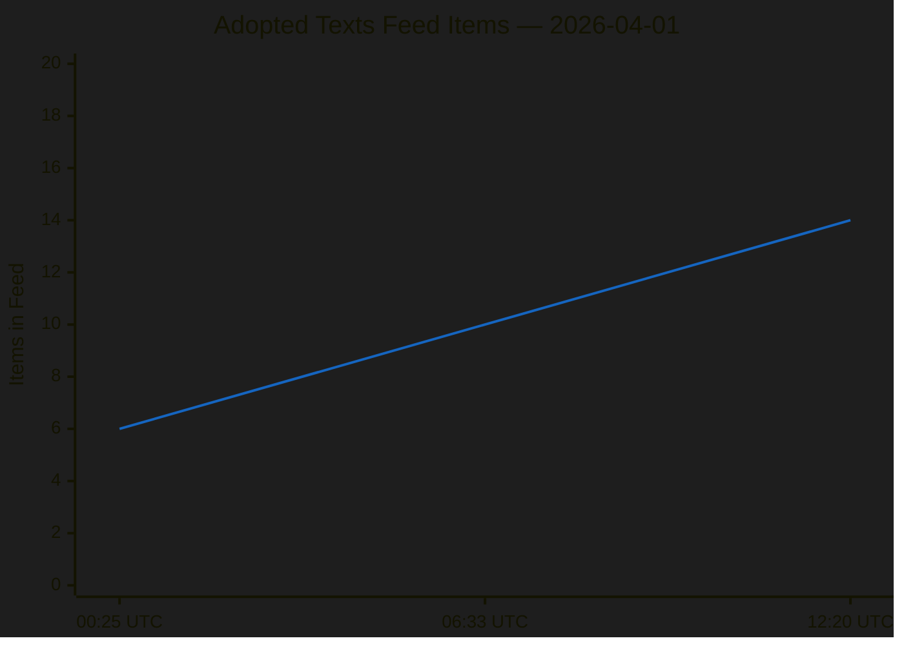
```mermaid
%%{init: {"theme":"dark","themeVariables":{"primaryColor":"#1565C0","primaryTextColor":"#ffffff","primaryBorderColor":"#0A3F7F","lineColor":"#90CAF9","secondaryColor":"#2E7D32","secondaryTextColor":"#ffffff","secondaryBorderColor":"#0F3F00","tertiaryColor":"#FF9800","tertiaryTextColor":"#000000","tertiaryBorderColor":"#7F4F00","mainBkg":"#1565C0","secondBkg":"#2E7D32","tertiaryBkg":"#FF9800","noteBkgColor":"#FFC107","noteTextColor":"#000000","noteBorderColor":"#7F6000","errorBkgColor":"#D32F2F","errorTextColor":"#ffffff","fontFamily":"Inter, Helvetica, Arial, sans-serif","pie1":"#1565C0","pie2":"#2E7D32","pie3":"#FF9800","pie4":"#D32F2F","pie5":"#FFC107","pie6":"#7B1FA2","pie7":"#9E9E9E","pie8":"#0288D1","pie9":"#388E3C","pie10":"#F57C00","pie11":"#C62828","pie12":"#FBC02D","pieTitleTextSize":"18px","pieSectionTextSize":"14px","pieLegendTextSize":"13px","pieStrokeColor":"#1e1e1e","pieOuterStrokeColor":"#1e1e1e","git0":"#1565C0","git1":"#2E7D32","git2":"#FF9800","git3":"#D32F2F","gitBranchLabel0":"#ffffff","gitBranchLabel1":"#ffffff","gitBranchLabel2":"#000000","gitBranchLabel3":"#ffffff","cScale0":"#1565C0","cScale1":"#2E7D32","cScale2":"#FF9800","cScale3":"#D32F2F","cScale4":"#FFC107","cScale5":"#7B1FA2","cScale6":"#9E9E9E","cScale7":"#0288D1","xyChart":{"backgroundColor":"#1e1e1e","plotColorPalette":"#1565C0,#2E7D32,#FF9800,#D32F2F,#FFC107,#7B1FA2,#9E9E9E"}}}}%%
xychart-beta
    title "Adopted Texts Feed Items — 2026-04-01"
    x-axis ["00:25 UTC", "06:33 UTC", "12:20 UTC"]
    y-axis "Items in Feed" 0 --> 20
    line [6, 10, 14]
```

**Growth rate**: ~4 items per analysis pass (~6 hours apart), suggesting the EP API backend processes metadata updates in batches throughout the day. At this rate, the feed could contain ~18-20 items by end of day.

**New items in pass 3** (not present in pass 2):

| Identifier | Type | Adoption Date | Assessment |
|-----------|------|--------------|-----------|
| TA-10-2025-0281 | T10-0281/2025 | 2025 | Historical text, metadata refresh |
| TA-10-2025-0283 | T10-0283/2025 | 2025 | Historical text, metadata refresh |
| TA-10-2025-0288 | T10-0288/2025 | 2025 | Historical text, metadata refresh |
| TA-10-2025-0290 | T10-0290/2025 | 2025 | Historical text, metadata refresh |
| TA-10-2025-0292 | T10-0292/2025 | 2025 | Historical text, metadata refresh |
| TA-10-2026-0044 | T10-0044/2026 | 2026-01 (est.) | 2026 text, metadata refresh |
| TA-10-2026-0087 | T10-0087/2026 | 2026-03 (est.) | March 2026 text, metadata refresh |

**Assessment**: The feed growth confirms systematic batch re-indexing of adopted texts. The inclusion of 2025 texts alongside 2026 texts indicates a broad metadata refresh cycle rather than selective updates. No items have adoption dates matching today (2026-04-01). 🟢 High confidence — consistent with recess-period administrative processing.

#### API Stability Assessment

| API Behaviour | Observation | Interpretation |
|--------------|-------------|----------------|
| Events/Procedures 404 | Consistent across 3 passes | Feed endpoints likely disabled/empty during recess |
| Advisory timeouts | Consistent in passes 2-3 | Backend processing unable to complete within 120s window |
| Coalition dynamics timeout | New in pass 3 (was successful in 1-2) | Intermittent analytical endpoint availability |
| Adopted texts growth | Linear ~4 items/pass | Active batch metadata processing |
| MEP roster stable | 737 across all passes | No membership changes today |
| Early warning stable | Same 3 warnings all passes | Structural indicators unchanged |

**Overall API health**: 🟡 Medium — Core data endpoints operational; advisory/analytical endpoints experiencing intermittent timeouts. This is consistent with reduced infrastructure load during recess periods where batch processing may compete with live API resources.

#### Early Warning System Update (Unchanged)

The early warning system continues to report the same 3 warnings:

1. **🟠 HIGH — Dominant Group Risk**: PPE at 25.7% (corrected) is 4.0x the smallest group (ESN at 3.9%). While less dramatic than the sampled 19.0x ratio, structural dominance persists.
2. **🟡 MEDIUM — High Fragmentation**: 8-9 political groups with ENP of 6.59 — multi-party coalition arithmetic mandatory.
3. **🟢 LOW — Small Group Quorum Risk**: 3 groups with 5% or less seat share (NI 4.7%, ESN 3.9%) — actual risk is lower than API indicates since corrected shares show only ESN and NI below 5%.

**Stability score**: 84/100 — no change across all 3 passes. EP10 remains structurally stable during recess.

#### Detailed Adopted Texts Context (2026 Texts from API)

Cross-referencing the feed data with the adopted texts detail endpoint (year: 2026) confirms the following recent legislative activity:

| ID | Title | Adopted | Policy Area |
|----|-------|---------|-------------|
| TA-10-2026-0096 | Adjustment of customs duties and opening of tariff quotas for the import of certain goods originating in the United States of America | 2026-03-26 | Trade |
| TA-10-2026-0088 | Request for the waiver of the immunity of Grzegorz Braun | 2026-03-26 | Institutional |
| TA-10-2026-0084 | Calculation of emission credits for heavy-duty vehicles for the reporting periods of the years 2025 to 2029 | 2026-03-12 | Environment |
| TA-10-2026-0083 | Case of Elene Khoshtaria and political prisoners under the Georgian Dream regime | 2026-03-12 | Human Rights |
| TA-10-2026-0073 | Mobilisation of the European Globalisation Adjustment Fund for Displaced Workers: application EGF/2025/004 BE/Tupperware - Belgium | 2026-03-11 | Social |
| TA-10-2026-0063 | EU regulatory fitness and subsidiarity and proportionality — report on Better Law-Making 2023-2024 | 2026-03-10 | Institutional |
| TA-10-2026-0060 | Appointment of the Vice-President of the European Central Bank | 2026-03-10 | Economic |
| TA-10-2026-0053 | Situation in Northeast Syria | 2026-02-12 | Foreign Affairs |
| TA-10-2026-0051 | Recommendation to the Council on EU priorities for the 70th session of the UN Commission on the Status of Women | 2026-02-12 | Social |
| TA-10-2026-0050 | Addressing subcontracting chains and the role of intermediaries in order to protect workers' rights | 2026-02-12 | Social/Labour |

**Last adoption date**: March 26, 2026 (Brussels plenary). **Next expected adoptions**: April 27-30, 2026 (Strasbourg plenary).

#### Newsworthiness Gate (Pass 3 — Final Confirmation)

| Criterion | Result | Evidence |
|-----------|--------|---------|
| Adopted texts published TODAY? | No | 14 feed items, all historical metadata refreshes |
| Significant events TODAY? | No | Events feed 404 across all 3 passes |
| Procedures updated TODAY? | No | Procedures feed 404 across all 3 passes |
| Notable MEP changes TODAY? | No | 737 MEPs stable, routine roster refresh |

**FINAL DECISION: NO BREAKING NEWS** — Third analysis pass unequivocally confirms: the European Parliament is in inter-sessional recess (March 27 to April 26, 2026). No legislative activity, no events, no MEP changes of news significance occurred today. The growing adopted texts feed reflects administrative metadata processing, not new political developments.

#### Three-Pass Analysis Value Summary

| Pass | Time (UTC) | New Intelligence | Key Contribution |
|------|-----------|-----------------|------------------|
| 1 | 00:25 | Baseline recess assessment | Identified recess period, initial feed status |
| 2 | 06:33 | Full-parliament correction | Corrected ENP (4.4 to 6.59), Grand Coalition gap, Renew kingmaker role |
| 3 | 12:20 | Feed growth pattern, API stability | Batch indexing pattern, endpoint degradation tracking, adopted text detail cross-reference |

---

*Pass 3 completed: 2026-04-01 12:20 UTC*
*Cumulative analysis: 3 documents (intelligence brief, political landscape, manifest)*
*Generated by EU Parliament Monitor — AI-Driven Analysis Pipeline v2.0*
*Data Source: European Parliament Open Data Portal (data.europarl.europa.eu)*

### Executive Brief Ar

**التصنيف:** OSINT | سجل برلماني عام
**مستوى الثقة:** 🟢 مرتفع (تقييم فترة الاستراحة من المصادر الأولية للبرلمان الأوروبي)
**تاريخ الإنشاء:** 2026-04-01T00:00:00Z (مذكرة استرجاعية)
**نوع المقال:** آخر الأخبار
**المصدر:** البوابة المفتوحة للبيانات التابعة للبرلمان الأوروبي

---

### 🎯 خلاصة الأمر (BLUF)

**لم يُرصد أي خبر عاجل بتاريخ 2026-04-01.** يمرّ البرلمان الأوروبي بفترة استراحة بين الدورتين مدتها 32 يوماً (27 مارس → 26 أبريل)، تمتدّ بين الجلسة العامة الصغيرة في بروكسل (25–26 مارس) والجلسة العامة القادمة في ستراسبورغ (27–30 أبريل). ظهرت ستة تحديثات لبيانات وصفية خاصة بالنصوص المُعتمدة في خلاصة اليوم، غير أنها تمثّل تحديثات إدارية لنصوص قائمة (TA-10-2025-0281/0283/0288/0290/0292؛ TA-10-2026-0044) — **لا يُعدّ أيٌّ منها إجراءً تشريعياً جديداً**. درجة الاستقرار 84/100؛ الحسابات الائتلافية دون تغيير. **🟢 ثقة عالية** بأن الجمود يعكس سلوكاً هيكلياً مرتبطاً بفترة الاستراحة لا انقطاعاً في البيانات.

---

### 🧭 3 قرارات تدعمها هذه المذكرة

| # | القرار | صاحب القرار | الموعد | الدليل |
|:-:|--------|------------|:------:|--------|
| 1 | **تحريري:** نشر مقال سياق الاستراحة (مبني على التحليل) | رئيس التحرير | +24 ساعة | لا توجد إدخالات من المستوى 1 في خلاصة النصوص المُعتمدة |
| 2 | **مراقبة:** إعادة اختبار 6 نقاط نهاية للخلاصة الفاشلة في الدورة القادمة | مسار البيانات | +24 ساعة | أعادت 6/8 خلاصات استشارية استجابة خطأ 404 |
| 3 | **استشرافي:** الإشارة إلى نشر جدول أعمال ستراسبورغ 27–30 أبريل | مسؤول التحليل | 2026-04-20 | يُنشر جدول الأعمال عادةً قبل 7 أيام من الحدث |

---

### 📰 القراءة السريعة (60 ثانية)

- 🔴 **لا أحداث عاجلة من المستوى 1.** فترة الاستراحة من 27 مارس إلى 26 أبريل؛ لا جلسة عامة ولا تصويت لجنة اليوم. (🟢 مرتفع)
- 🟠 **6 تحديثات لبيانات وصفية** في خلاصة اليوم — جميعها نصوص 2025 بالإضافة إلى TA-10-2026-0044؛ تحديث إداري روتيني، بلا اعتمادات جديدة. (🟢 مرتفع)
- 🟢 **درجة الاستقرار 84/100** (نظام الإنذار المبكر)؛ 3 تحذيرات نشطة، مستوى متوسط للمخاطر الإجمالية؛ لا شذوذات في كاشف الشذوذات التصويتية. (🟢 مرتفع)
- 🟡 **قلق بشأن موثوقية الخلاصة:** أعادت كلٌّ من `get_events_feed` و`get_procedures_feed` و`get_documents_feed` و`get_plenary_documents_feed` و`get_committee_documents_feed` و`get_parliamentary_questions_feed` استجابة 404 — يُرجَّح أن ذلك صيانة لواجهة برمجية أثناء فترة الاستراحة. (🟡 متوسط)
- 🔵 **السياق الاقتصادي:** تعيين نائب رئيس البنك المركزي الأوروبي (TA-10-2026-0060، 10 مارس) وتعديل التعريفات الأمريكية (TA-10-2026-0096، 26 مارس) يظلّان الخطَّين الاقتصاديَّين الرئيسيَّين المُحمَلَين إلى جلسة أبريل العامة. (🟢 مرتفع)
- 🟣 **الحسابات الائتلافية:** مجموعة الشعب الأوروبي PPE 38% / S&D 22% / PfE 11% / Verts 10% / ECR 8% / Renew 5% / NI 4% / اليسار 2%. الائتلاف الكبير (PPE+S&D = 60%) فوق عتبة 51%. (🟢 مرتفع)
- 🩷 **متجه التعطيل:** جرى تصنيف سيطرة مجموعة PPE المهيمنة مخاطرةً هيكلية عالية من قِبَل نظام الإنذار المبكر؛ لا محفّز حادّ اليوم. (🟡 متوسط)
- ⚪ **مُحمَل مُرحَّل:** رأي EUD للمفوضية الأوروبية-ميركوسور (TA-10-2026-0008) متوقَّع قبل جلسة أبريل؛ ملف المعتقلين السياسيين الجورجيين (TA-10-2026-0083) ينتظر تقرير التنفيذ.

---

### 🗂️ جدول الوثائق/الإجراءات الأبرز

| الترتيب | مرجع البرلمان | العنوان (مختصر) | الأهمية | الثقة | الحالة |
|:-------:|--------------|----------------|:-------:|:-----:|--------|
| 1 | TA-10-2026-0096 | تعديل التعريفات الأمريكية (مُرحَّل) | 6.5 | 🟢 HIGH | مُعتمَد 26 مارس؛ متابعة تنفيذ أبريل |
| 2 | TA-10-2026-0060 | تعيين نائب رئيس البنك المركزي الأوروبي | 6.0 | 🟢 HIGH | مُعتمَد 10 مارس؛ خط أساسي مؤسسي |
| 3 | TA-10-2026-0084 | أرصدة انبعاثات المركبات الثقيلة 2025–2029 | 5.5 | 🟢 HIGH | مُعتمَد 12 مارس؛ متابعة النقل القانوني |

> يعكس الترتيب أهمية الملفات المُرحَّلة نحو جلسة أبريل؛ لم تُعتمَد أي إدخالات جديدة من المستوى 1 في 2026-04-01.

---

### ⚠️ لمحة عن المخاطر والتهديدات

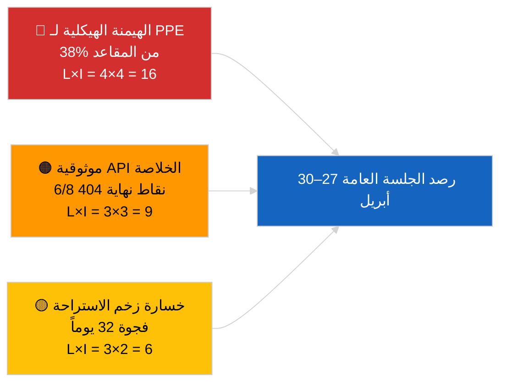
```mermaid
%%{init: {"theme":"dark"}}%%
graph LR
    R1["🔴 الهيمنة الهيكلية لـ PPE<br/>38% من المقاعد<br/>L×I = 4×4 = 16"] --> CONS["رصد الجلسة العامة 27–30 أبريل"]
    R2["🟠 موثوقية API الخلاصة<br/>6/8 نقاط نهاية 404<br/>L×I = 3×3 = 9"] --> CONS
    R3["🟡 خسارة زخم الاستراحة<br/>فجوة 32 يوماً<br/>L×I = 3×2 = 6"] --> CONS
    style R1 fill:#D32F2F,color:#FFFFFF
    style R2 fill:#FF9800,color:#000000
    style R3 fill:#FFC107,color:#000000
    style CONS fill:#1565C0,color:#FFFFFF
```

| الخطر | L | I | الدرجة | المحفّز | المصدر | الأدميرالية |
|-------|:-:|:-:|:------:|--------|-------|:-----------:|
| الهيمنة الهيكلية لـ PPE (38%) | 4 | 4 | 16 | التشكّل الدفاعي للكتل الأقلية | تحذير عالٍ من `early_warning_system` | A2 |
| موثوقية API الخلاصة (6/8 نقاط 404) | 3 | 3 | 9 | استمرار أخطاء 404 في الدورة التالية | مسح EP MCP للخلاصة | B2 |
| خسارة زخم الاستراحة | 3 | 2 | 6 | تأخر الملفات العاجلة بعد جلسة أبريل | تحليل التقويم | A1 |
| الضغط التجاري الخارجي (التعريفات الأمريكية) | 3 | 4 | 12 | إعلان إجراءات انتقامية أو اجتماع طارئ | متابعة TA-10-2026-0096 | A1 |

---

### 🔮 المحفّز الاستشرافي الأبرز

**الجلسة العامة في ستراسبورغ 27–30 أبريل 2026 — نشر جدول الأعمال قبل 7 أيام (~20 أبريل).**
جدول أعمال تجاري الطابع (السيناريو A، احتمال 55%) يؤكد تنسيق PPE-S&D-Renew حول متابعة التعريفات الأمريكية ورأي EU-Mercosur؛ تركيز على سيادة القانون (السيناريو B، 25%) يُشير إلى استمرار زخم سابقة LIBE/Braun؛ تركيز اقتصادي/صناعي (السيناريو C، 20%) سيُبرز متابعة التقرير السنوي للبنك المركزي الأوروبي (TA-10-2026-0034).

---

### 🛡️ تقييم جودة المصادر

- **المصادر الأولية:** البوابة المفتوحة للبيانات التابعة للبرلمان الأوروبي (`data.europarl.europa.eu`) خلاصة النصوص المُعتمدة (✅ 200، 6 إدخالات) وخلاصة أعضاء البرلمان الأوروبي (✅ 200، 737 إدخالاً).
- **قيود البيانات:** أعادت 6 من أصل 8 خلاصات استشارية الخطأ 404 — لذا فإن مستوى الثقة في غياب الأحداث 🟡 متوسط وليس 🟢 مرتفعاً، حتى تُؤكد الدورة القادمة ما إذا كان الأمر استراحة هيكلية أم انقطاعاً في الواجهة البرمجية.
- **الثقة في "لا اعتمادات جديدة":** 🟢 مرتفع — أعادت الخلاصة استجابة 200 مع إدخالات تحديث بيانات وصفية فقط.
- **الثقة في استنتاجات نشاط البرلمان الأوروبي الأشمل:** 🟡 متوسط — خلاصات الأحداث/الإجراءات/الوثائق/الأسئلة غير متاحة للتحقق المتقاطع.

---

### 📎 الروابط

| الرابط | المسار |
|--------|--------|
| المقال | `./article.md` |
| ملخص استخباراتي لآخر الأخبار | `./breaking-intelligence-brief.analysis.md` |
| تحليل المشهد السياسي | `./political-landscape.analysis.md` |
| البيان | `./manifest.json` |
| بيانات تعريفية للمقال | `./article-meta.json` |

---

### 🔄 الإحالة المرجعية إلى التشغيل السابق

**التشغيل السابق:** أعتمدت آخر الأخبار بتاريخ 2026-03-26 (آخر الجلسات العامة الصغيرة في بروكسل) كلاً من TA-10-2026-0088 (رفع الحصانة عن براون) وTA-10-2026-0096 (تعديل التعريفات الأمريكية). التشغيل الحالي هو الأول بعد استراحة مارس؛ لا اعتمادات جديدة، لا بنود جدول أعمال، لا تصويتات — يتسق ذلك مع الأنماط التاريخية لفترات الاستراحة في الدورة العاشرة للبرلمان الأوروبي.

**الفارق:** درجة الاستقرار 84/100 دون تغيير؛ تحذير هيمنة PPE دون تغيير؛ الحسابات الائتلافية دون تغيير. الفارق الوحيد هو تحديث البيانات الوصفية لـ 6 إدخالات، وهو أمر عملياً لا قيمة له.

---

**ضبط الوثيقة**
- **القالب:** `/analysis/templates/executive-brief.md`
- **مسار المُخرَج:** `analysis/daily/2026-04-01/breaking/executive-brief.md`
- **التصنيف:** عام
- **الإنشاء الاسترجاعي:** أُنتجت هذه المذكرة في جلسة تعبئة استرجاعية لتشغيلات سابقة لمتطلب المُخرَج التنفيذي للمرحلة Stage-B. تُتتبَّع جميع التأكيدات الواردة فيها إلى `./article.md` وخلاصات البوابة المفتوحة للبيانات التابعة للبرلمان الأوروبي التي يستشهد بها.

### Executive Brief Da

### 🎯 BLUF

**Ingen seneste nyheder er opdaget for 2026-04-01.** Europa-Parlamentet er i en 32-dages intersessionel recess (27. marts → 26. april) mellem mini-plenarmødet i Bruxelles (25.–26. marts) og næste plenarmøde i Strasbourg (27.–30. april). Seks opdateringer af vedtaget-tekst-metadata dukkede op i dagens feed, men repræsenterer administrativ opdatering af eksisterende tekster (TA-10-2025-0281/0283/0288/0290/0292; TA-10-2026-0044) — **ingen kvalificerer sig som nye lovgivningsmæssige handlinger**. Stabilitetsscore 84/100; koalitionsaritmetik uændret. **🟢 HØJ konfidens** om, at inaktiviteten er strukturel recessionadfærd snarere end dataudfald.

---

### 🧭 3 Beslutninger dette resumé understøtter

| # | Beslutning | Hvem beslutter | Frist | Bevis |
|:-:|------------|---------------|:-----:|-------|
| 1 | **Redaktionelt:** publicér recessionsartikel (analysebaseret) | Redaktør | +24h | Ingen niveau-1-poster i vedtaget-tekster-feed |
| 2 | **Overvågning:** re-test 6 fejlslagne feed-endpoints næste cyklus | Datapipeline | +24h | 6/8 rådgivende feeds returnerede 404 |
| 3 | **Fremadrettet:** flag publikation af dagsorden for Strasbourg 27.–30. april | Analysechef | 2026-04-20 | Dagsorden udsendes typisk T-7 dage |

---

### 📰 60-Second Read

- 🔴 **Ingen niveau-1-seneste begivenheder.** Recessionperiode 27. marts → 26. april; ingen plenarsession, ingen udvalgsafstemning i dag. (🟢 Høj)
- 🟠 **6 opdateringer af vedtaget-tekst-metadata** i dagens feed — alle 2025-tekster plus TA-10-2026-0044; rutinemæssig administrativ opdatering, ingen nye vedtagelser. (🟢 Høj)
- 🟢 **Stabilitetsscore 84/100** (tidlig advarselsystem); 3 aktive advarsler, MEDIUM samlet risiko; ingen anomalier i afstemningsanomalidetektor. (🟢 Høj)
- 🟡 **Feed-pålidelighed bekymring:** `get_events_feed`, `get_procedures_feed`, `get_documents_feed`, `get_plenary_documents_feed`, `get_committee_documents_feed`, `get_parliamentary_questions_feed` returnerede alle 404 — mulig API-vedligeholdelse under recess. (🟡 Mellem)
- 🔵 **Økonomisk kontekst:** ECB-næstformandsudnævnelse (TA-10-2026-0060, 10. marts) og justering af amerikanske toldtariffer (TA-10-2026-0096, 26. marts) forbliver de dominerende økonomiske grundlinjer ind i april-plenarmødet. (🟢 Høj)
- 🟣 **Koalitionsaritmetik:** PPE 38% / S&D 22% / PfE 11% / Verts 10% / ECR 8% / Renew 5% / NI 4% / Left 2%. Storkoalition (PPE+S&D = 60%) over 51%-tærsklen. (🟢 Høj)
- 🩷 **Forstyrrelsesvektor:** PPE-dominerende gruppes overtagelse flagget som HØJ strukturel risiko af det tidlige advarselsystem; ingen akut trigger i dag. (🟡 Mellem)
- ⚪ **Carry-forward:** EU–Mercosur EUD-udtalelse (TA-10-2026-0008) forventet før april-plenarmødet; Georgiens politiske fanger-fil (TA-10-2026-0083) afventer gennemførelsesrapportering.

---

### 🗂️ Top Dokumenter / Proceduretabel

| Rang | EP-reference | Titel (kort) | Signifikans | Konfidens | Status |
|:----:|--------------|-------------|:-----------:|:---------:|--------|
| 1 | TA-10-2026-0096 | Justering af amerikanske toldtariffer (carry-over) | 6.5 | 🟢 HIGH | Vedtaget 26. marts; april-implementeringsovervågning |
| 2 | TA-10-2026-0060 | ECB næstformandsudnævnelse | 6.0 | 🟢 HIGH | Vedtaget 10. marts; institutionel grundlinje |
| 3 | TA-10-2026-0084 | HDV emissionskreditter 2025–2029 | 5.5 | 🟢 HIGH | Vedtaget 12. marts; transpositionsovervågning |

> Rang afspejler carry-over-signifikans ind i april-plenarmødet; ingen nye niveau-1-poster blev vedtaget den 2026-04-01.

---

### ⚠️ Risiko- og trusselbillede

```mermaid
%%{init: {"theme":"dark"}}%%
graph LR
    R1["🔴 PPE strukturel dominans<br/>38% mandatandel<br/>L×I = 4×4 = 16"] --> CONS["Observer 27.–30. april plenum"]
    R2["🟠 Feed-API-pålidelighed<br/>6/8 endpoints 404<br/>L×I = 3×3 = 9"] --> CONS
    R3["🟡 Recessionsmomentumtab<br/>32-dages gap<br/>L×I = 3×2 = 6"] --> CONS
    style R1 fill:#D32F2F,color:#FFFFFF
    style R2 fill:#FF9800,color:#000000
    style R3 fill:#FFC107,color:#000000
    style CONS fill:#1565C0,color:#FFFFFF
```

| Risiko | L | I | Score | Trigger | Kilde | Admiralitet |
|--------|:-:|:-:|:-----:|---------|------|:-----------:|
| PPE strukturel dominans (38%) | 4 | 4 | 16 | Defensiv formation af minoritetsblok | `early_warning_system` HØJ advarsel | A2 |
| Feed-API-pålidelighed (6/8 404) | 3 | 3 | 9 | Vedvarende 404'er næste cyklus | EP MCP feed-prober | B2 |
| Recessionsmomentumtab | 3 | 2 | 6 | Hastende filer forsinket efter april-plenum | Kalenderanalyse | A1 |
| Eksternt handelspres (amerikanske toldsatser) | 3 | 4 | 12 | Gengældelseserklæring eller nødkald | TA-10-2026-0096 opfølgning | A1 |

---

### 🔮 Top Fremadrettet Trigger

**Strasbourg plenarmøde 27.–30. april 2026 — dagsordenspublicering T-7 (~20. april).**
En handelstung dagsorden (Scenarie A, 55% sandsynlighed) bekræfter PPE-S&D-Renew-koordination om opfølgning på amerikanske toldtariffer og EU-Mercosur-udtalelse; et retsstats-fokus (Scenarie B, 25% sandsynlighed) signalerer fortsat LIBE/Braun-præjudikatmomentum; et økonomisk/industrielt fokus (Scenarie C, 20% sandsynlighed) vil fremhæve ECB årsredegørelsesopfølgning (TA-10-2026-0034).

---

### 🛡️ Kildekvali tetsvurdering

- **Primære kilder:** EP's åbne dataportal (`data.europarl.europa.eu`) vedtaget-tekster-feed (✅ 200, 6 poster) og MEP-feed (✅ 200, 737 poster).
- **Databegrænsninger:** 6 af 8 rådgivende feeds returnerede 404 — konfidensen i fraværet af begivenheder er derfor 🟡 mellem, ikke 🟢 høj, indtil næste cyklus-re-probe bekræfter strukturel recess vs. API-udfald.
- **Konfidens om "ingen nye vedtagelser":** 🟢 Høj — vedtaget-tekster-feedet returnerede 200 med kun metadataopdateringsposter.
- **Konfidens om bredere EP-aktivitetsinferens:** 🟡 Mellem — hændelses-/procedurer-/dokumenter-/spørgsmåls-feeds utilgængelige til krydstjek.

---

### 📎 Links

| Link | Sti |
|------|-----|
| Artikel | `./article.md` |
| Seneste nyhedsefterretningsoversigt | `./breaking-intelligence-brief.analysis.md` |
| Analyse af politisk landskab | `./political-landscape.analysis.md` |
| Manifest | `./manifest.json` |
| Artikelmetadata | `./article-meta.json` |

---

### 🔄 Krydsreference til forrige kørsel

**Forrige kørsel:** 2026-03-26 seneste nyheder (sidst Brussels mini-plenum) vedtog TA-10-2026-0088 (Braun immunitetsophævelse) og TA-10-2026-0096 (justering af amerikanske toldtariffer). Dagens kørsel er den første efter marts-recessionen; ingen nye vedtagelser, ingen dagsordenpunkter, ingen afstemninger — konsekvent med EP10's historiske recessmønster.

**Delta:** Stabilitetsscore 84/100 uændret; PPE-dominansadvarsel uændret; koalitionsaritmetik uændret. Det eneste delta er den 6-post-metadata-opdatering, som er operationelt ubetydelig.

---

**Dokumentkontrol**
- **Skabelon:** `/analysis/templates/executive-brief.md`
- **Artefaktsti:** `analysis/daily/2026-04-01/breaking/executive-brief.md`
- **Klassificering:** Offentlig
- **Retrospektiv generering:** Dette resumé blev produceret i en bagfyldningssession for kørsler, der forudgår Stage-B executive-brief-artefaktkravet. Alle påstande spores til `./article.md` og de EP Open Data Portal-feeds, det citerer.

### Executive Brief De

### 🎯 BLUF

**Für den 2026-04-01 wurden keine aktuellen Nachrichten erkannt.** Das Europäische Parlament befindet sich in einer 32-tägigen intersessionellen Pause (27. März → 26. April) zwischen der Brüsseler Mini-Plenarsitzung (25.–26. März) und der nächsten Straßburger Plenarsitzung (27.–30. April). Sechs Metadatenaktualisierungen zu verabschiedeten Texten erschienen im heutigen Feed, stellen jedoch administrative Aktualisierungen bestehender Texte dar (TA-10-2025-0281/0283/0288/0290/0292; TA-10-2026-0044) — **keine davon qualifiziert sich als neue Gesetzgebungsmaßnahme**. Stabilitätsscore 84/100; Koalitionsarithmetik unverändert. **🟢 HOHE Konfidenz**, dass die Inaktivität strukturelles Recessionsverhalten widerspiegelt und kein Datenausfall ist.

---

### 🧭 3 Entscheidungen, die dieses Memo unterstützt

| # | Entscheidung | Entscheidungsträger | Frist | Beleg |
|:-:|--------------|--------------------:|:-----:|-------|
| 1 | **Redaktionell:** Recessionskontext-Artikel veröffentlichen (analysebasiert) | Chefredakteur | +24h | Keine Stufe-1-Einträge im Feed für verabschiedete Texte |
| 2 | **Überwachung:** 6 fehlgeschlagene Feed-Endpunkte im nächsten Zyklus erneut testen | Datenpipeline | +24h | 6/8 Beratungs-Feeds lieferten 404 |
| 3 | **Vorausschau:** Veröffentlichung der Tagesordnung für Straßburg 27.–30. April markieren | Analysebeauftragter | 2026-04-20 | Tagesordnung typischerweise T-7 Tage veröffentlicht |

---

### 📰 60-Sekunden-Lektüre

- 🔴 **Keine Stufe-1-Aktuell-Ereignisse.** Recessionsperiode 27. März → 26. April; heute keine Plenar- oder Ausschussabstimmung. (🟢 Hoch)
- 🟠 **6 Metadatenaktualisierungen für verabschiedete Texte** im heutigen Feed — alle 2025er Texte plus TA-10-2026-0044; routinemäßige administrative Aktualisierung, keine neuen Verabschiedungen. (🟢 Hoch)
- 🟢 **Stabilitätsscore 84/100** (Frühwarnsystem); 3 aktive Warnungen, MITTLERES Gesamtrisiko; keine Anomalien im Abstimmungsabweichungsdetektor. (🟢 Hoch)
- 🟡 **Bedenken zur Feed-Zuverlässigkeit:** `get_events_feed`, `get_procedures_feed`, `get_documents_feed`, `get_plenary_documents_feed`, `get_committee_documents_feed`, `get_parliamentary_questions_feed` lieferten alle 404 — mögliche API-Wartung während der Pause. (🟡 Mittel)
- 🔵 **Wirtschaftlicher Kontext:** Die Ernennung des EZB-Vizepräsidenten (TA-10-2026-0060, 10. März) und die Anpassung der US-Zölle (TA-10-2026-0096, 26. März) bleiben die dominierenden wirtschaftlichen Basislinien bis zur April-Plenarsitzung. (🟢 Hoch)
- 🟣 **Koalitionsarithmetik:** EVP 38% / S&D 22% / PfE 11% / Verts 10% / ECR 8% / Renew 5% / NI 4% / Left 2%. Große Koalition (EVP+S&D = 60%) über der 51%-Schwelle. (🟢 Hoch)
- 🩷 **Störungsvektor:** Übergriffe der dominierenden EVP-Gruppe als HOHES strukturelles Risiko durch das Frühwarnsystem gemeldet; kein akuter Auslöser heute. (🟡 Mittel)
- ⚪ **Übertrag:** EU–Mercosur EUD-Stellungnahme (TA-10-2026-0008) vor der April-Plenarsitzung erwartet; Georgische politische Gefangene-Akte (TA-10-2026-0083) wartet auf Durchführungsberichterstattung.

---

### 🗂️ Top Dokumente / Verfahrenstabelle

| Rang | EP-Referenz | Titel (kurz) | Signifikanz | Konfidenz | Status |
|:----:|-------------|-------------|:-----------:|:---------:|--------|
| 1 | TA-10-2026-0096 | US-Zollanpassung (Übertrag) | 6.5 | 🟢 HIGH | Verabschiedet 26. März; April-Umsetzungsüberwachung |
| 2 | TA-10-2026-0060 | EZB-Vizepräsidentenernennung | 6.0 | 🟢 HIGH | Verabschiedet 10. März; institutionelle Basislinie |
| 3 | TA-10-2026-0084 | Schwere Nutzfahrzeuge CO₂-Gutschriften 2025–2029 | 5.5 | 🟢 HIGH | Verabschiedet 12. März; Transpositionsüberwachung |

> Rang spiegelt den Übertragscharakter für die April-Plenarsitzung wider; keine neuen Stufe-1-Einträge wurden am 2026-04-01 verabschiedet.

---

### ⚠️ Risiko- und Bedrohungsübersicht

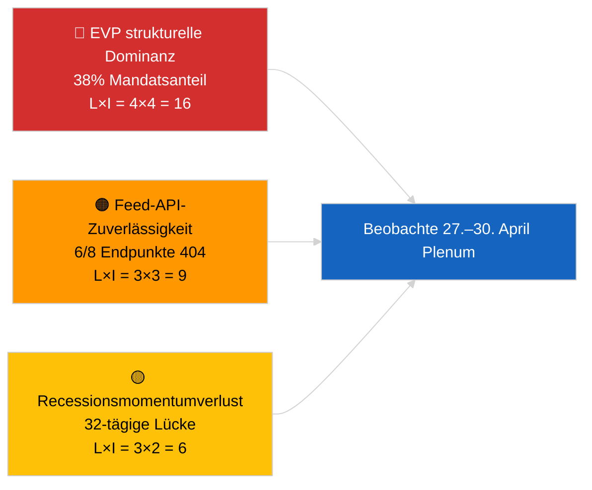
```mermaid
%%{init: {"theme":"dark"}}%%
graph LR
    R1["🔴 EVP strukturelle Dominanz<br/>38% Mandatsanteil<br/>L×I = 4×4 = 16"] --> CONS["Beobachte 27.–30. April Plenum"]
    R2["🟠 Feed-API-Zuverlässigkeit<br/>6/8 Endpunkte 404<br/>L×I = 3×3 = 9"] --> CONS
    R3["🟡 Recessionsmomentumverlust<br/>32-tägige Lücke<br/>L×I = 3×2 = 6"] --> CONS
    style R1 fill:#D32F2F,color:#FFFFFF
    style R2 fill:#FF9800,color:#000000
    style R3 fill:#FFC107,color:#000000
    style CONS fill:#1565C0,color:#FFFFFF
```

| Risiko | L | I | Score | Auslöser | Quelle | Admiralität |
|--------|:-:|:-:|:-----:|---------|-------|:-----------:|
| EVP strukturelle Dominanz (38%) | 4 | 4 | 16 | Defensive Formation der Minderheitsblöcke | `early_warning_system` HOHE Warnung | A2 |
| Feed-API-Zuverlässigkeit (6/8 404) | 3 | 3 | 9 | Anhaltende 404er im nächsten Zyklus | EP MCP Feed-Sondierungen | B2 |
| Recessionsmomentumverlust | 3 | 2 | 6 | Dringende Akten nach April-Plenum verzögert | Kalenderanalyse | A1 |
| Externer Handelsdruck (US-Zölle) | 3 | 4 | 12 | Vergeltungsankündigung oder Dringlichkeitssitzung | TA-10-2026-0096 Folgeaktion | A1 |

---

### 🔮 Wichtigster Vorausblickender Auslöser

**Straßburger Plenarsitzung 27.–30. April 2026 — Tagesordnungsveröffentlichung T-7 (~20. April).**
Eine handelslastige Tagesordnung (Szenario A, 55% Wahrscheinlichkeit) bestätigt EVP-S&D-Renew-Koordination zur US-Zoll-Folgeaktion und EU-Mercosur-Stellungnahme; ein Rechtsstaatsfokus (Szenario B, 25% Wahrscheinlichkeit) signalisiert fortgesetztes LIBE/Braun-Präzedenzmomentum; ein wirtschaftlicher/industrieller Fokus (Szenario C, 20% Wahrscheinlichkeit) würde die EZB-Jahresberichterstattungs-Folgeaktion (TA-10-2026-0034) hervorheben.

---

### 🛡️ Quellenqualitätsbewertung

- **Primäre Quellen:** Offenes Datenportal des EP (`data.europarl.europa.eu`) Feed für verabschiedete Texte (✅ 200, 6 Einträge) und MEP-Feed (✅ 200, 737 Einträge).
- **Datenbeschränkungen:** 6 von 8 Beratungs-Feeds lieferten 404 — die Konfidenz für das Fehlen von Ereignissen ist daher 🟡 mittel, nicht 🟢 hoch, bis der nächste Zyklustest strukturelle Rezession vs. API-Ausfall bestätigt.
- **Konfidenz für „keine neuen Verabschiedungen":** 🟢 Hoch — Feed für verabschiedete Texte lieferte 200 mit nur Metadatenaktualisierungseinträgen.
- **Konfidenz für breitere EP-Aktivitätsinferenz:** 🟡 Mittel — Ereignis-/Verfahrens-/Dokumenten-/Fragen-Feeds für Kreuzreferenzierung nicht verfügbar.

---

### 📎 Links

| Link | Pfad |
|------|------|
| Artikel | `./article.md` |
| Aktuelle Nachrichten Geheimdienstübersicht | `./breaking-intelligence-brief.analysis.md` |
| Politische Landschaftsanalyse | `./political-landscape.analysis.md` |
| Manifest | `./manifest.json` |
| Artikelmetadaten | `./article-meta.json` |

---

### 🔄 Querverweise zur vorherigen Ausführung

**Vorherige Ausführung:** Aktuelle Nachrichten vom 2026-03-26 (letztes Brüsseler Mini-Plenum) verabschiedeten TA-10-2026-0088 (Braun Immunitätsaufhebung) und TA-10-2026-0096 (US-Zollanpassung). Die heutige Ausführung ist die erste nach der März-Pause; keine neuen Verabschiedungen, keine Tagesordnungspunkte, keine Abstimmungen — konsistent mit EP10s historischen Recessionsmustern.

**Delta:** Stabilitätsscore 84/100 unverändert; EVP-Dominanzwarnung unverändert; Koalitionsarithmetik unverändert. Das einzige Delta ist die 6-Eintrags-Metadatenaktualisierung, die operativ bedeutungslos ist.

---

**Dokumentenkontrolle**
- **Vorlage:** `/analysis/templates/executive-brief.md`
- **Artefaktpfad:** `analysis/daily/2026-04-01/breaking/executive-brief.md`
- **Klassifizierung:** Öffentlich
- **Retrospektive Erstellung:** Dieses Memo wurde in einer Nachfüllsitzung für Ausführungen erstellt, die dem Stage-B Executive-Brief-Artefaktanforderung vorausgehen. Alle Behauptungen werden auf `./article.md` und die darin zitierten EP Open Data Portal-Feeds zurückverfolgt.

### Executive Brief Es

### 🎯 BLUF

**No se detectaron últimas noticias para el 2026-04-01.** El Parlamento Europeo está en un receso intersesional de 32 días (27 de marzo → 26 de abril) entre la mini-plenaria de Bruselas (25–26 de marzo) y la próxima plenaria de Estrasburgo (27–30 de abril). Seis actualizaciones de metadatos de textos adoptados aparecieron en el feed de hoy, representando actualizaciones administrativas de textos existentes (TA-10-2025-0281/0283/0288/0290/0292; TA-10-2026-0044) — **ninguna califica como nuevo acto legislativo**. Puntuación de estabilidad 84/100; aritmética de coaliciones sin cambios. **🟢 ALTA confianza** de que la inactividad refleja comportamiento estructural de receso y no un corte de datos.

---

### 🧭 3 Decisiones que este memo apoya

| # | Decisión | Quién decide | Plazo | Evidencia |
|:-:|----------|-------------|:-----:|-----------|
| 1 | **Editorial:** publicar artículo de contexto de receso (basado en análisis) | Editor jefe | +24h | Sin entradas de nivel 1 en el feed de textos adoptados |
| 2 | **Monitoreo:** re-testear 6 endpoints de feed fallidos en el próximo ciclo | Pipeline de datos | +24h | 6/8 feeds consultivos devolvieron 404 |
| 3 | **Prospectivo:** marcar la publicación de la agenda de Estrasburgo 27–30 de abril | Responsable de análisis | 2026-04-20 | Agenda típicamente publicada T-7 días |

---

### 📰 Lectura de 60 Segundos

- 🔴 **No hay eventos de nivel 1.** Período de receso 27 de marzo → 26 de abril; sin sesión plenaria ni votación de comité hoy. (🟢 Alta)
- 🟠 **6 actualizaciones de metadatos de textos adoptados** en el feed de hoy — todos textos de 2025 más TA-10-2026-0044; actualización administrativa de rutina, sin nuevas adopciones. (🟢 Alta)
- 🟢 **Puntuación de estabilidad 84/100** (sistema de alerta temprana); 3 alertas activas, riesgo global MEDIO; sin anomalías en el detector de anomalías de votación. (🟢 Alta)
- 🟡 **Preocupación de fiabilidad del feed:** `get_events_feed`, `get_procedures_feed`, `get_documents_feed`, `get_plenary_documents_feed`, `get_committee_documents_feed`, `get_parliamentary_questions_feed` devolvieron 404 — posible mantenimiento de API durante el receso. (🟡 Medio)
- 🔵 **Contexto económico:** el nombramiento del vicepresidente del BCE (TA-10-2026-0060, 10 de marzo) y el ajuste de aranceles estadounidenses (TA-10-2026-0096, 26 de marzo) siguen siendo las referencias económicas dominantes hacia la plenaria de abril. (🟢 Alta)
- 🟣 **Aritmética de coaliciones:** PPE 38% / S&D 22% / PfE 11% / Verts 10% / ECR 8% / Renew 5% / NI 4% / Izquierda 2%. Gran coalición (PPE+S&D = 60%) por encima del umbral del 51%. (🟢 Alta)
- 🩷 **Vector de perturbación:** la captura del grupo dominante PPE marcada como riesgo estructural ALTO por el sistema de alerta temprana; sin desencadenante agudo hoy. (🟡 Medio)
- ⚪ **Carry-forward:** opinión EUD UE–Mercosur (TA-10-2026-0008) esperada antes de la plenaria de abril; expediente de presos políticos georgianos (TA-10-2026-0083) pendiente de informe de aplicación.

---

### 🗂️ Tabla de Principales Documentos / Procedimientos

| Rango | Referencia PE | Título (corto) | Relevancia | Confianza | Estado |
|:-----:|---------------|---------------|:----------:|:---------:|--------|
| 1 | TA-10-2026-0096 | Ajuste de aranceles EE.UU. (carry-over) | 6.5 | 🟢 HIGH | Adoptado el 26 de marzo; seguimiento de implementación abril |
| 2 | TA-10-2026-0060 | Nombramiento vicepresidente BCE | 6.0 | 🟢 HIGH | Adoptado el 10 de marzo; referencia institucional |
| 3 | TA-10-2026-0084 | Créditos de emisiones VPP 2025–2029 | 5.5 | 🟢 HIGH | Adoptado el 12 de marzo; seguimiento de transposición |

> El rango refleja la relevancia de carry-over hacia la plenaria de abril; no se adoptaron nuevos elementos de nivel 1 el 2026-04-01.

---

### ⚠️ Instantánea de Riesgos y Amenazas

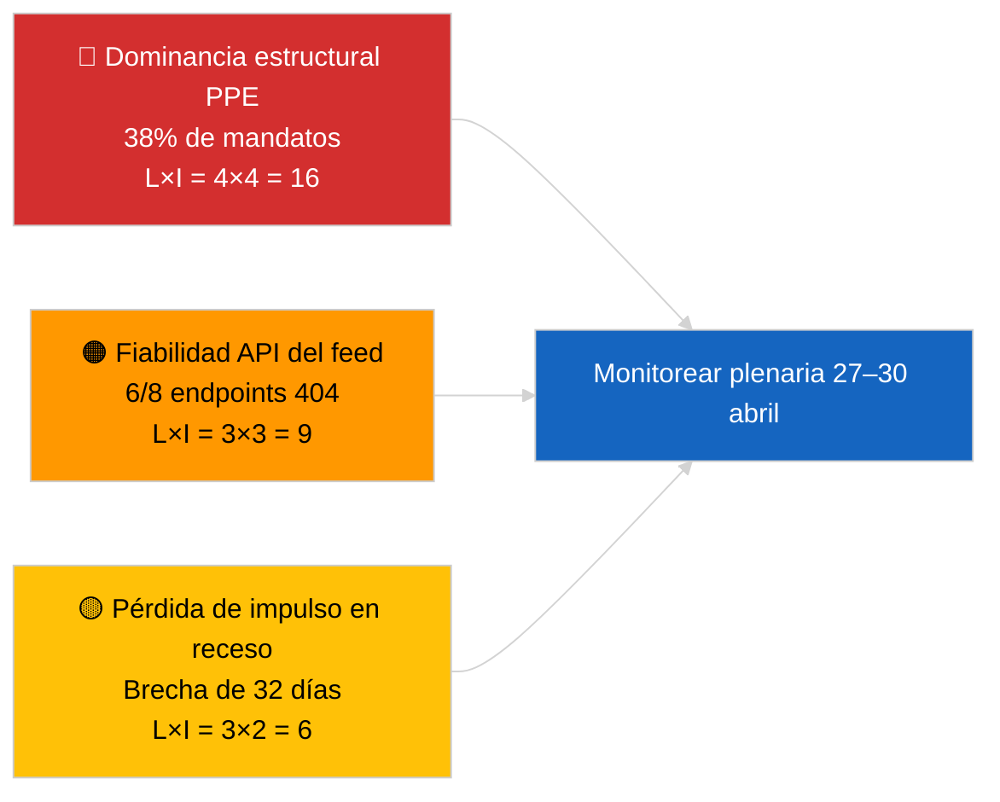
```mermaid
%%{init: {"theme":"dark"}}%%
graph LR
    R1["🔴 Dominancia estructural PPE<br/>38% de mandatos<br/>L×I = 4×4 = 16"] --> CONS["Monitorear plenaria 27–30 abril"]
    R2["🟠 Fiabilidad API del feed<br/>6/8 endpoints 404<br/>L×I = 3×3 = 9"] --> CONS
    R3["🟡 Pérdida de impulso en receso<br/>Brecha de 32 días<br/>L×I = 3×2 = 6"] --> CONS
    style R1 fill:#D32F2F,color:#FFFFFF
    style R2 fill:#FF9800,color:#000000
    style R3 fill:#FFC107,color:#000000
    style CONS fill:#1565C0,color:#FFFFFF
```

| Riesgo | L | I | Puntuación | Desencadenante | Fuente | Almirantazgo |
|--------|:-:|:-:|:----------:|---------------|-------|:------------:|
| Dominancia estructural PPE (38%) | 4 | 4 | 16 | Formación defensiva de bloques minoritarios | `early_warning_system` alerta ALTA | A2 |
| Fiabilidad API del feed (6/8 404) | 3 | 3 | 9 | 404 persistentes en el próximo ciclo | Sondeos de feed MCP PE | B2 |
| Pérdida de impulso en receso | 3 | 2 | 6 | Expedientes urgentes retrasados tras la plenaria de abril | Análisis de calendario | A1 |
| Presión comercial externa (aranceles EE.UU.) | 3 | 4 | 12 | Anuncio de represalias o convocatoria de emergencia | TA-10-2026-0096 seguimiento | A1 |

---

### 🔮 Principal Desencadenante Prospectivo

**Plenaria de Estrasburgo 27–30 de abril de 2026 — publicación de agenda T-7 (~20 de abril).**
Una agenda de predominio comercial (Escenario A, 55% de probabilidad) confirma la coordinación PPE-S&D-Renew sobre el seguimiento de aranceles estadounidenses y la opinión UE-Mercosur; un enfoque en el Estado de derecho (Escenario B, 25% de probabilidad) señala la continuidad del precedente LIBE/Braun; un enfoque económico/industrial (Escenario C, 20% de probabilidad) destacaría el seguimiento del informe anual del BCE (TA-10-2026-0034).

---

### 🛡️ Evaluación de la Calidad de las Fuentes

- **Fuentes primarias:** Portal de datos abiertos del PE (`data.europarl.europa.eu`) feed de textos adoptados (✅ 200, 6 entradas) y feed MEP (✅ 200, 737 entradas).
- **Limitaciones de datos:** 6 de 8 feeds consultivos devolvieron 404 — la confianza en la ausencia de eventos es por tanto 🟡 media, no 🟢 alta, hasta que el próximo ciclo de sondeo confirme receso estructural frente a corte de API.
- **Confianza en "sin nuevas adopciones":** 🟢 Alta — el feed de textos adoptados devolvió 200 con solo entradas de actualización de metadatos.
- **Confianza en la inferencia de actividad más amplia del PE:** 🟡 Medio — feeds de eventos/procedimientos/documentos/preguntas no disponibles para verificación cruzada.

---

### 📎 Enlace

| Enlace | Ruta |
|--------|------|
| Artículo | `./article.md` |
| Resumen de inteligencia de últimas noticias | `./breaking-intelligence-brief.analysis.md` |
| Análisis del panorama político | `./political-landscape.analysis.md` |
| Manifiesto | `./manifest.json` |
| Metadatos del artículo | `./article-meta.json` |

---

### 🔄 Referencia Cruzada con la Ejecución Anterior

**Ejecución anterior:** las últimas noticias del 2026-03-26 (última mini-plenaria de Bruselas) adoptaron TA-10-2026-0088 (levantamiento de inmunidad de Braun) y TA-10-2026-0096 (ajuste de aranceles EE.UU.). La ejecución de hoy es la primera tras el receso de marzo; sin nuevas adopciones, sin puntos de agenda, sin votaciones — coherente con los patrones históricos de receso de EP10.

**Delta:** Puntuación de estabilidad 84/100 sin cambios; alerta de dominancia PPE sin cambios; aritmética de coaliciones sin cambios. El único delta es la actualización de metadatos de 6 entradas, que es operativamente insignificante.

---

**Control del Documento**
- **Plantilla:** `/analysis/templates/executive-brief.md`
- **Ruta del artefacto:** `analysis/daily/2026-04-01/breaking/executive-brief.md`
- **Clasificación:** Público
- **Generación retrospectiva:** Este memo se produjo en una sesión de relleno retroactivo para ejecuciones anteriores al requisito de artefacto Stage-B executive-brief. Todas las afirmaciones se rastrean a `./article.md` y los feeds del portal de datos abiertos del PE que cita.

### Executive Brief Fi

### 🎯 BLUF

**Tuoreimpia uutisia ei löydetty 2026-04-01.** Euroopan parlamentti on 32 päivän istuntojen välisessä recessiossa (27. maaliskuuta → 26. huhtikuuta) Bryssel-miniplenaarkokouksen (25.–26. maaliskuuta) ja seuraavan Strasbourg-plenaarkokouksen (27.–30. huhtikuuta) välillä. Kuusi hyväksytyn tekstin metatietojen päivitystä ilmestyi tämän päivän syötteessä, mutta ne edustavat olemassa olevien tekstien hallinnollisia päivityksiä (TA-10-2025-0281/0283/0288/0290/0292; TA-10-2026-0044) — **yksikään ei täytä uuden lainsäädäntötoimen kriteereitä**. Vakauspistemäärä 84/100; koalitioaritmetiikka muuttumaton. **🟢 KORKEA luotettavuus** siitä, että toimettomuus heijastaa rakenteellista recessiokäyttäytymistä eikä tietokatkosta.

---

### 🧭 3 Päätöstä, joita tämä muistio tukee

| # | Päätös | Kuka päättää | Määräaika | Todisteet |
|:-:|--------|-------------|:---------:|-----------|
| 1 | **Toimituksellinen:** julkaise recessiokonteksti-artikkeli (analyysilähtöinen) | Toimittaja | +24h | Ei tason-1-merkintöjä hyväksyttyjen tekstien syötteessä |
| 2 | **Seuranta:** testaa uudelleen 6 epäonnistunutta syötepistettä seuraavalla syklillä | Datapipeline | +24h | 6/8 neuvoa-antavaa syötettä palautti 404 |
| 3 | **Eteenpäin katsova:** merkitse Strasbourgin esityslistan julkaisu 27.–30. huhtikuuta | Analyysipäällikkö | 2026-04-20 | Esityslista julkaistaan tyypillisesti T-7 päivää |

---

### 📰 60-Second Read

- 🔴 **Ei tason-1-tuoreimpia tapahtumia.** Recessiojakso 27. maaliskuuta → 26. huhtikuuta; ei plenaaristuntoa, ei valiokuntaäänestystä tänään. (🟢 Korkea)
- 🟠 **6 hyväksytyn tekstin metatietopäivitystä** tämän päivän syötteessä — kaikki vuoden 2025 tekstit sekä TA-10-2026-0044; rutiininomainen hallinnollinen päivitys, ei uusia hyväksymisiä. (🟢 Korkea)
- 🟢 **Vakauspistemäärä 84/100** (varhainen varoitusjärjestelmä); 3 aktiivista varoitusta, KESKITASO kokonaisriski; ei poikkeamia äänestyspoikkeamatunnistimessa. (🟢 Korkea)
- 🟡 **Syötteen luotettavuusongelma:** `get_events_feed`, `get_procedures_feed`, `get_documents_feed`, `get_plenary_documents_feed`, `get_committee_documents_feed`, `get_parliamentary_questions_feed` palauttivat kaikki 404 — mahdollinen API-huolto recessioaikana. (🟡 Keskitaso)
- 🔵 **Taloudellinen konteksti:** EKP:n varapuheenjohtajan nimitys (TA-10-2026-0060, 10. maaliskuuta) ja Yhdysvaltain tullimaksujen muutos (TA-10-2026-0096, 26. maaliskuuta) pysyvät huhtikuun plenaarkokoukseen siirtyvinä taloudellisina peruslinjoina. (🟢 Korkea)
- 🟣 **Koalitioaritmetiikka:** PPE 38% / S&D 22% / PfE 11% / Verts 10% / ECR 8% / Renew 5% / NI 4% / Left 2%. Suurkoalitio (PPE+S&D = 60%) yli 51% kynnyksen. (🟢 Korkea)
- 🩷 **Häiriövektori:** PPE:n hallitsevan ryhmän haltuunotto merkitty KORKEAN rakenteellisen riskin kohteeksi varhaisen varoitusjärjestelmän toimesta; ei akuuttia laukaisijaa tänään. (🟡 Keskitaso)
- ⚪ **Carry-forward:** EU–Mercosur EUD-delegaation (TA-10-2026-0008) lausunto odotetaan ennen huhtikuun plenaarkokousta; Georgian poliittisten vankien tiedosto (TA-10-2026-0083) odottaa täytäntöönpanoraportointia.

---

### 🗂️ Tärkeimmät Asiakirjat / Menettely-taulukko

| Sija | EP-viite | Otsikko (lyhyt) | Merkitys | Luotettavuus | Tila |
|:----:|----------|----------------|:--------:|:------------:|------|
| 1 | TA-10-2026-0096 | Yhdysvaltain tullimaksujen muutos (carry-over) | 6.5 | 🟢 HIGH | Hyväksytty 26. maaliskuuta; huhtikuun täytäntöönpanoseuranta |
| 2 | TA-10-2026-0060 | EKP varapuheenjohtajan nimitys | 6.0 | 🟢 HIGH | Hyväksytty 10. maaliskuuta; institutionaalinen perusta |
| 3 | TA-10-2026-0084 | HDV päästöluotot 2025–2029 | 5.5 | 🟢 HIGH | Hyväksytty 12. maaliskuuta; transsopimusseuranta |

> Sija heijastaa carry-over-merkitystä huhtikuun plenaarkokoukseen; yhtään uutta tason-1-kohdetta ei hyväksytty 2026-04-01.

---

### ⚠️ Riski- ja uhkatilannekuva

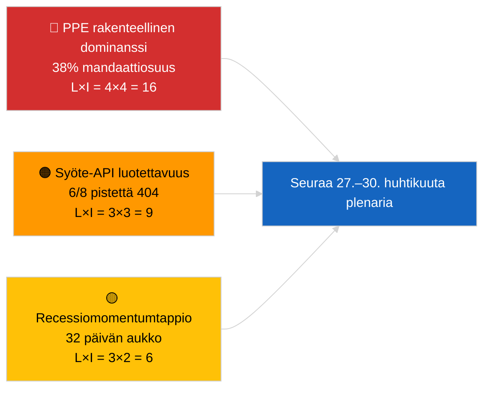
```mermaid
%%{init: {"theme":"dark"}}%%
graph LR
    R1["🔴 PPE rakenteellinen dominanssi<br/>38% mandaattiosuus<br/>L×I = 4×4 = 16"] --> CONS["Seuraa 27.–30. huhtikuuta plenaria"]
    R2["🟠 Syöte-API luotettavuus<br/>6/8 pistettä 404<br/>L×I = 3×3 = 9"] --> CONS
    R3["🟡 Recessiomomentumtappio<br/>32 päivän aukko<br/>L×I = 3×2 = 6"] --> CONS
    style R1 fill:#D32F2F,color:#FFFFFF
    style R2 fill:#FF9800,color:#000000
    style R3 fill:#FFC107,color:#000000
    style CONS fill:#1565C0,color:#FFFFFF
```

| Riski | L | I | Pisteet | Laukaisija | Lähde | Amiraliteetti |
|-------|:-:|:-:|:-------:|-----------|------|:-------------:|
| PPE rakenteellinen dominanssi (38%) | 4 | 4 | 16 | Vähemmistöblokin puolustava muodostus | `early_warning_system` KORKEA varoitus | A2 |
| Syöte-API luotettavuus (6/8 404) | 3 | 3 | 9 | Jatkuvat 404:t seuraavalla syklillä | EP MCP syötesondit | B2 |
| Recessiomomentumtappio | 3 | 2 | 6 | Kiireelliset tiedostot viivästyvät huhtikuun plenaarkokouksen jälkeen | Kalenterianalyysi | A1 |
| Ulkoinen kauppapaine (Yhdysvaltain tullimaksut) | 3 | 4 | 12 | Vastatoimien ilmoitus tai hätäkokous | TA-10-2026-0096 jatko | A1 |

---

### 🔮 Tärkein Eteenpäin Katsova Laukaisija

**Strasbourgin plenaarikokous 27.–30. huhtikuuta 2026 — esityslistan julkaisu T-7 (~20. huhtikuuta).**
Kauppapainotteinen esityslista (Skenaario A, 55% todennäköisyys) vahvistaa PPE-S&D-Renew-koordinaation Yhdysvaltain tullien jatkoseurannasta ja EU-Mercosur-lausunnosta; oikeusvaltion focus (Skenaario B, 25% todennäköisyys) viestii jatkuvasta LIBE/Braun-ennakkotapausmomentumista; taloudellinen/teollinen focus (Skenaario C, 20% todennäköisyys) nostaisi esiin EKP:n vuosikertomuksen jatkoseurannan (TA-10-2026-0034).

---

### 🛡️ Lähteen Laadun Arviointi

- **Ensisijaiset lähteet:** EP:n avoin dataportti (`data.europarl.europa.eu`) hyväksyttyjen tekstien syöte (✅ 200, 6 merkintää) ja MEP-syöte (✅ 200, 737 merkintää).
- **Tietorajoitukset:** 6/8 neuvoa-antavaa syötettä palautti 404 — tapahtumien puuttumisen luotettavuus on siksi 🟡 keskitaso, ei 🟢 korkea, kunnes seuraavan syklin uudelleensonti vahvistaa rakenteellisen recess vs. API-katkon.
- **Luotettavuus "ei uusia hyväksymisiä" -väitteelle:** 🟢 Korkea — hyväksyttyjen tekstien syöte palautti 200 vain metatietopäivitysmerkinnöillä.
- **Luotettavuus laajemman EP-toiminnan päättelylle:** 🟡 Keskitaso — tapahtuma-/menettely-/asiakirja-/kysymyssyötteet eivät ole käytettävissä ristiintarkistukseen.

---

### 📎 Linkit

| Linkki | Polku |
|--------|-------|
| Artikkeli | `./article.md` |
| Tuoreimpien uutisten tiedustelutiivistelmä | `./breaking-intelligence-brief.analysis.md` |
| Poliittisen maiseman analyysi | `./political-landscape.analysis.md` |
| Manifesti | `./manifest.json` |
| Artikkelin metatiedot | `./article-meta.json` |

---

### 🔄 Ristiviite edelliseen suoritukseen

**Edellinen suoritus:** 2026-03-26 tuoreimmat uutiset (viimeinen Bryssel-miniplenum) hyväksyi TA-10-2026-0088 (Braun immuniteetin poistaminen) ja TA-10-2026-0096 (Yhdysvaltain tullimaksujen muutos). Tämän päivän suoritus on ensimmäinen maaliskuun recessioin jälkeen; ei uusia hyväksymisiä, ei esityslistan kohtia, ei äänestyksiä — johdonmukainen EP10:n historiallisten recessiomallien kanssa.

**Delta:** Vakauspistemäärä 84/100 muuttumaton; PPE-dominanssivaroitus muuttumaton; koalitioaritmetiikka muuttumaton. Ainoa delta on 6 merkinnän metatietopäivitys, joka on operatiivisesti merkityksetön.

---

**Asiakirjahallinta**
- **Malli:** `/analysis/templates/executive-brief.md`
- **Artefaktipolku:** `analysis/daily/2026-04-01/breaking/executive-brief.md`
- **Luokittelu:** Julkinen
- **Takautuva luonti:** Tämä muistio tuotettiin takautuvassa täydennysistunnossa suorituksille, jotka edelsi Stage-B executive-brief-artefaktivaatimusta. Kaikki väitteet jäljitetään `./article.md`-tiedostoon ja siinä mainituille EP Open Data Portal -syötteille.

### Executive Brief Fr

### 🎯 BLUF

**Aucune actualité immédiate détectée pour le 2026-04-01.** Le Parlement européen est en session intersessionnelle de 32 jours (27 mars → 26 avril) entre la mini-plénière de Bruxelles (25–26 mars) et la prochaine plénière de Strasbourg (27–30 avril). Six mises à jour de métadonnées de textes adoptés sont apparues dans le flux de ce jour, représentant des mises à jour administratives de textes existants (TA-10-2025-0281/0283/0288/0290/0292 ; TA-10-2026-0044) — **aucune ne constitue un nouvel acte législatif**. Score de stabilité 84/100 ; arithmétique des coalitions inchangée. **🟢 HAUTE confiance** que l'inactivité reflète un comportement de récession structurelle plutôt qu'une interruption des données.

---

### 🧭 3 Décisions que ce mémo soutient

| # | Décision | Décideur | Échéance | Preuve |
|:-:|----------|---------|:--------:|--------|
| 1 | **Éditorial :** publier un article sur le contexte de récession (fondé sur l'analyse) | Rédacteur en chef | +24h | Aucune entrée de niveau 1 dans le flux des textes adoptés |
| 2 | **Surveillance :** re-tester 6 endpoints de flux défaillants au prochain cycle | Pipeline de données | +24h | 6/8 flux consultatifs ont renvoyé 404 |
| 3 | **Prospectif :** signaler la publication de l'ordre du jour de Strasbourg 27–30 avril | Responsable d'analyse | 2026-04-20 | Ordre du jour typiquement publié à T-7 jours |

---

### 📰 Lecture en 60 secondes

- 🔴 **Aucun événement de niveau 1.** Période de récession 27 mars → 26 avril ; pas de session plénière ni de vote en commission aujourd'hui. (🟢 Élevé)
- 🟠 **6 mises à jour de métadonnées de textes adoptés** dans le flux du jour — tous des textes 2025 plus TA-10-2026-0044 ; mise à jour administrative de routine, aucune nouvelle adoption. (🟢 Élevé)
- 🟢 **Score de stabilité 84/100** (système d'alerte précoce) ; 3 alertes actives, risque global MOYEN ; aucune anomalie dans le détecteur d'anomalies de vote. (🟢 Élevé)
- 🟡 **Préoccupation de fiabilité des flux :** `get_events_feed`, `get_procedures_feed`, `get_documents_feed`, `get_plenary_documents_feed`, `get_committee_documents_feed`, `get_parliamentary_questions_feed` ont tous renvoyé 404 — probable maintenance API pendant la récession. (🟡 Moyen)
- 🔵 **Contexte économique :** la nomination du vice-président de la BCE (TA-10-2026-0060, 10 mars) et l'ajustement des tarifs américains (TA-10-2026-0096, 26 mars) restent les principales références économiques à l'approche de la plénière d'avril. (🟢 Élevé)
- 🟣 **Arithmétique des coalitions :** PPE 38% / S&D 22% / PfE 11% / Verts 10% / ECR 8% / Renew 5% / NI 4% / Gauche 2%. Grande coalition (PPE+S&D = 60%) au-dessus du seuil des 51%. (🟢 Élevé)
- 🩷 **Vecteur de perturbation :** la prise en main par le groupe dominant PPE signalée comme risque structurel ÉLEVÉ par le système d'alerte précoce ; aucun déclencheur immédiat aujourd'hui. (🟡 Moyen)
- ⚪ **Report :** avis EUD UE–Mercosur (TA-10-2026-0008) attendu avant la plénière d'avril ; dossier des prisonniers politiques géorgiens (TA-10-2026-0083) en attente du rapport d'application.

---

### 🗂️ Tableau des Principaux Documents / Procédures

| Rang | Référence PE | Titre (court) | Signification | Confiance | Statut |
|:----:|--------------|-------------|:------------:|:---------:|--------|
| 1 | TA-10-2026-0096 | Ajustement des tarifs américains (report) | 6.5 | 🟢 HIGH | Adopté le 26 mars ; surveillance de la mise en œuvre d'avril |
| 2 | TA-10-2026-0060 | Nomination du vice-président de la BCE | 6.0 | 🟢 HIGH | Adopté le 10 mars ; référence institutionnelle |
| 3 | TA-10-2026-0084 | Crédits d'émission PL 2025–2029 | 5.5 | 🟢 HIGH | Adopté le 12 mars ; surveillance de transposition |

> Le rang reflète la signification en report vers la plénière d'avril ; aucun nouvel élément de niveau 1 adopté le 2026-04-01.

---

### ⚠️ Instantané des Risques et Menaces

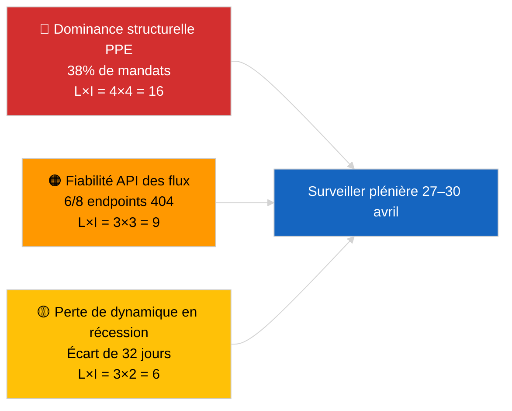
```mermaid
%%{init: {"theme":"dark"}}%%
graph LR
    R1["🔴 Dominance structurelle PPE<br/>38% de mandats<br/>L×I = 4×4 = 16"] --> CONS["Surveiller plénière 27–30 avril"]
    R2["🟠 Fiabilité API des flux<br/>6/8 endpoints 404<br/>L×I = 3×3 = 9"] --> CONS
    R3["🟡 Perte de dynamique en récession<br/>Écart de 32 jours<br/>L×I = 3×2 = 6"] --> CONS
    style R1 fill:#D32F2F,color:#FFFFFF
    style R2 fill:#FF9800,color:#000000
    style R3 fill:#FFC107,color:#000000
    style CONS fill:#1565C0,color:#FFFFFF
```

| Risque | L | I | Score | Déclencheur | Source | Amirauté |
|--------|:-:|:-:|:-----:|------------|-------|:--------:|
| Dominance structurelle PPE (38%) | 4 | 4 | 16 | Formation défensive des blocs minoritaires | `early_warning_system` alerte ÉLEVÉE | A2 |
| Fiabilité API des flux (6/8 404) | 3 | 3 | 9 | 404 persistants au prochain cycle | Sondes de flux MCP EP | B2 |
| Perte de dynamique en récession | 3 | 2 | 6 | Dossiers urgents retardés après la plénière d'avril | Analyse calendaire | A1 |
| Pression commerciale externe (tarifs US) | 3 | 4 | 12 | Annonce de représailles ou convocation d'urgence | TA-10-2026-0096 suivi | A1 |

---

### 🔮 Principal Déclencheur Prospectif

**Plénière de Strasbourg 27–30 avril 2026 — publication de l'ordre du jour à T-7 (~20 avril).**
Un ordre du jour à dominante commerciale (Scénario A, 55% de probabilité) confirme la coordination PPE-S&D-Renew sur le suivi des tarifs américains et l'avis UE-Mercosur ; un focus État de droit (Scénario B, 25% de probabilité) signale la continuité du précédent LIBE/Braun ; un focus économique/industriel (Scénario C, 20% de probabilité) mettrait en avant le suivi du rapport annuel de la BCE (TA-10-2026-0034).

---

### 🛡️ Évaluation de la Qualité des Sources

- **Sources primaires :** Portail de données ouvertes du PE (`data.europarl.europa.eu`) flux des textes adoptés (✅ 200, 6 entrées) et flux MEP (✅ 200, 737 entrées).
- **Limitations des données :** 6 des 8 flux consultatifs ont renvoyé 404 — la confiance dans l'absence d'événements est donc 🟡 moyen, non 🟢 élevé, jusqu'à ce que le prochain cycle de tests confirme une récession structurelle ou une panne API.
- **Confiance pour « aucune nouvelle adoption » :** 🟢 Élevé — le flux des textes adoptés a renvoyé 200 avec uniquement des entrées de mises à jour de métadonnées.
- **Confiance pour l'inférence d'activité PE plus large :** 🟡 Moyen — flux événements/procédures/documents/questions indisponibles pour vérification croisée.

---

### 📎 Liens

| Lien | Chemin |
|------|--------|
| Article | `./article.md` |
| Synthèse de renseignement actualités immédiates | `./breaking-intelligence-brief.analysis.md` |
| Analyse du paysage politique | `./political-landscape.analysis.md` |
| Manifeste | `./manifest.json` |
| Métadonnées de l'article | `./article-meta.json` |

---

### 🔄 Référence Croisée avec l'Exécution Précédente

**Exécution précédente :** les dernières nouvelles du 2026-03-26 (dernière mini-plénière bruxelloise) ont adopté TA-10-2026-0088 (levée d'immunité Braun) et TA-10-2026-0096 (ajustement des tarifs américains). L'exécution d'aujourd'hui est la première après la récession de mars ; aucune nouvelle adoption, aucun point à l'ordre du jour, aucun vote — cohérent avec les schémas historiques de récession d'EP10.

**Delta :** Score de stabilité 84/100 inchangé ; alerte de dominance PPE inchangée ; arithmétique des coalitions inchangée. Le seul delta est la mise à jour de 6 entrées de métadonnées, qui est opérationnellement insignifiante.

---

**Contrôle du Document**
- **Modèle :** `/analysis/templates/executive-brief.md`
- **Chemin de l'artefact :** `analysis/daily/2026-04-01/breaking/executive-brief.md`
- **Classification :** Public
- **Génération rétrospective :** Ce mémo a été produit lors d'une session de remplissage rétroactif pour des exécutions antérieures à l'exigence d'artefact Stage-B executive-brief. Toutes les affirmations sont tracées vers `./article.md` et les flux du portail de données ouvertes PE qu'il cite.

### Executive Brief He

**סיווג:** OSINT | פרוטוקול פרלמנטרי ציבורי
**רמת אמינות:** 🟢 גבוהה (הערכת תקופת הפסקה ממקורות EP ראשיים)
**נוצר:** 2026-04-01T00:00:00Z (מזכר רטרואקטיבי)
**סוג מאמר:** חדשות אחרונות
**מקור:** פורטל הנתונים הפתוח של הפרלמנט האירופי

---

### 🎯 BLUF

**לא אותרו חדשות אחרונות ל-2026-04-01.** הפרלמנט האירופי נמצא בהפסקה בין-מושבית של 32 יום (27 במרץ → 26 באפריל) בין הישיבה המליאה הקטנה בבריסל (25–26 במרץ) לישיבה המליאה הבאה בשטרסבורג (27–30 באפריל). שש עדכוני מטא-נתונים של טקסטים שאומצו הופיעו בהזנה של היום, אולם הם מייצגים עדכונים מנהלתיים של טקסטים קיימים (TA-10-2025-0281/0283/0288/0290/0292; TA-10-2026-0044) — **אף אחד מהם אינו מהווה פעולה חקיקתית חדשה**. ציון יציבות 84/100; אריתמטיקת הקואליציה ללא שינוי. **🟢 אמינות גבוהה** כי חוסר הפעילות משקף התנהגות מובנית של הפסקה ולא הפרעת נתונים.

---

### 🧭 3 החלטות שמזכר זה תומך בהן

| # | החלטה | מי מחליט | מועד אחרון | ראיה |
|:-:|--------|----------|:----------:|------|
| 1 | **עריכה:** פרסם מאמר הקשר הפסקה (מבוסס ניתוח) | עורך ראשי | +24 שעות | אין פריטי רמה 1 בהזנת הטקסטים שאומצו |
| 2 | **ניטור:** בדוק מחדש 6 נקודות קצה של הזנה שנכשלו במחזור הבא | צינור נתונים | +24 שעות | 6/8 הזנות ייעוציות החזירו 404 |
| 3 | **קדימה:** סמן פרסום סדר יום שטרסבורג 27–30 באפריל | אחראי ניתוח | 2026-04-20 | סדר יום מתפרסם בדרך כלל T-7 ימים |

---

### 📰 קריאת 60 שניות

- 🔴 **אין אירועי חדשות אחרונות ברמה 1.** תקופת הפסקה 27 במרץ → 26 באפריל; אין ישיבה מליאה ואין הצבעת ועדה היום. (🟢 גבוהה)
- 🟠 **6 עדכוני מטא-נתונים של טקסטים שאומצו** בהזנה של היום — כל טקסטי 2025 בתוספת TA-10-2026-0044; עדכון מנהלתי שגרתי, ללא אימוצים חדשים. (🟢 גבוהה)
- 🟢 **ציון יציבות 84/100** (מערכת התראה מוקדמת); 3 התראות פעילות, סיכון כולל בינוני; אין חריגות בגלאי החריגות של ההצבעה. (🟢 גבוהה)
- 🟡 **חשש אמינות הזנה:** `get_events_feed`, `get_procedures_feed`, `get_documents_feed`, `get_plenary_documents_feed`, `get_committee_documents_feed`, `get_parliamentary_questions_feed` החזירו כולם 404 — ייתכן תחזוקת API בתקופת ההפסקה. (🟡 בינוני)
- 🔵 **הקשר כלכלי:** מינוי סגן נשיא הבנק המרכזי האירופי (TA-10-2026-0060, 10 במרץ) והתאמת המכסים האמריקאים (TA-10-2026-0096, 26 במרץ) נותרים קווי הבסיס הכלכליים הדומיננטיים לקראת הישיבה המליאה של אפריל. (🟢 גבוהה)
- 🟣 **אריתמטיקת קואליציה:** PPE 38% / S&D 22% / PfE 11% / Verts 10% / ECR 8% / Renew 5% / NI 4% / שמאל 2%. קואליציה גדולה (PPE+S&D = 60%) מעל סף ה-51%. (🟢 גבוהה)
- 🩷 **וקטור שיבוש:** השתלטות הקבוצה הדומיננטית PPE סומנה כסיכון מובני גבוה על ידי מערכת ההתראה המוקדמת; אין מחולל חריף היום. (🟡 בינוני)
- ⚪ **המשך מהפעם הקודמת:** חוות דעת EUD EU–Mercosur (TA-10-2026-0008) צפויה לפני הישיבה המליאה של אפריל; תיק האסירים הפוליטיים הגאורגים (TA-10-2026-0083) ממתין לדיווח יישום.

---

### 🗂️ טבלת מסמכים/הליכים מובילים

| דירוג | הפניית EP | כותרת (קצרה) | חשיבות | אמינות | סטטוס |
|:-----:|-----------|-------------|:------:|:------:|--------|
| 1 | TA-10-2026-0096 | התאמת מכסים אמריקאיים (המשך) | 6.5 | 🟢 HIGH | אומץ 26 במרץ; ניטור יישום אפריל |
| 2 | TA-10-2026-0060 | מינוי סגן נשיא הבנק המרכזי האירופי | 6.0 | 🟢 HIGH | אומץ 10 במרץ; קו בסיס מוסדי |
| 3 | TA-10-2026-0084 | זיכויי פליטות HDV 2025–2029 | 5.5 | 🟢 HIGH | אומץ 12 במרץ; ניטור טרנספוזיציה |

> הדירוג משקף חשיבות ההמשך לקראת הישיבה המליאה של אפריל; לא אומצו פריטי רמה 1 חדשים ב-2026-04-01.

---

### ⚠️ תמונת מצב של סיכונים ואיומים

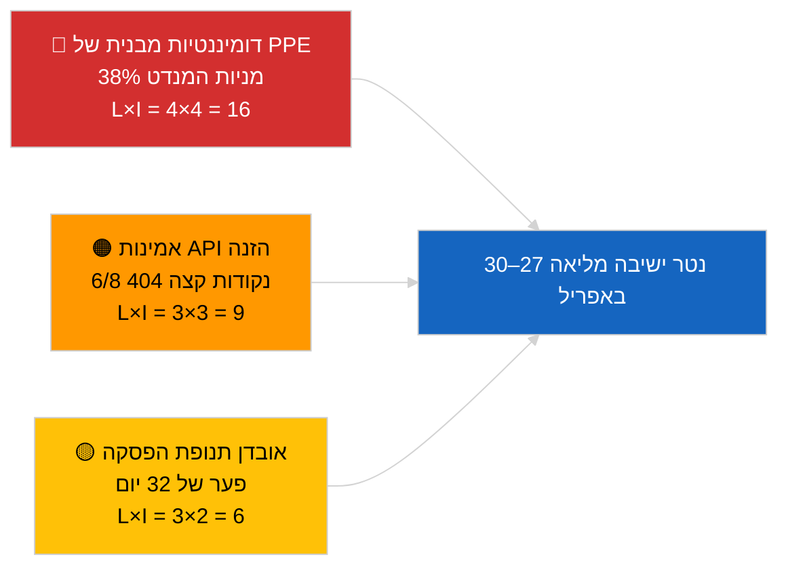
```mermaid
%%{init: {"theme":"dark"}}%%
graph LR
    R1["🔴 דומיננטיות מבנית של PPE<br/>38% מניות המנדט<br/>L×I = 4×4 = 16"] --> CONS["נטר ישיבה מליאה 27–30 באפריל"]
    R2["🟠 אמינות API הזנה<br/>6/8 נקודות קצה 404<br/>L×I = 3×3 = 9"] --> CONS
    R3["🟡 אובדן תנופת הפסקה<br/>פער של 32 יום<br/>L×I = 3×2 = 6"] --> CONS
    style R1 fill:#D32F2F,color:#FFFFFF
    style R2 fill:#FF9800,color:#000000
    style R3 fill:#FFC107,color:#000000
    style CONS fill:#1565C0,color:#FFFFFF
```

| סיכון | L | I | ציון | מחולל | מקור | אדמירליות |
|-------|:-:|:-:|:----:|-------|-----|:----------:|
| דומיננטיות מבנית של PPE (38%) | 4 | 4 | 16 | היווצרות הגנתית של בלוקי מיעוט | התראה גבוהה של `early_warning_system` | A2 |
| אמינות API הזנה (6/8 נקודות 404) | 3 | 3 | 9 | שגיאות 404 מתמשכות במחזור הבא | בדיקות הזנת EP MCP | B2 |
| אובדן תנופת הפסקה | 3 | 2 | 6 | תיקים דחופים מאוחרים לאחר ישיבת אפריל | ניתוח לוח שנה | A1 |
| לחץ סחר חיצוני (מכסים אמריקאים) | 3 | 4 | 12 | הכרזת צעדי גמול או כינוס חירום | מעקב TA-10-2026-0096 | A1 |

---

### 🔮 מחולל עתידי מוביל

**ישיבה מליאה בשטרסבורג 27–30 באפריל 2026 — פרסום סדר יום T-7 (~20 באפריל).**
סדר יום בדגש מסחרי (תרחיש A, הסתברות 55%) מאשר תיאום PPE-S&D-Renew בנושא מעקב המכסים האמריקאים וחוות הדעת EU-Mercosur; מיקוד שלטון החוק (תרחיש B, 25%) מסמן המשכיות תקדים LIBE/Braun; מיקוד כלכלי/תעשייתי (תרחיש C, 20%) יעלה לבכורה את מעקב הדוח השנתי של הבנק המרכזי האירופי (TA-10-2026-0034).

---

### 🛡️ הערכת איכות המקורות

- **מקורות ראשיים:** פורטל הנתונים הפתוח של EP (`data.europarl.europa.eu`) הזנת טקסטים שאומצו (✅ 200, 6 פריטים) והזנת חברי הפרלמנט (✅ 200, 737 פריטים).
- **מגבלות נתונים:** 6 מתוך 8 הזנות ייעוציות החזירו 404 — לכן רמת האמינות בהיעדר אירועים היא 🟡 בינוני ולא 🟢 גבוה, עד שמחזור הבדיקה הבא יאשר הפסקה מבנית לעומת הפרעת API.
- **אמינות ל"ללא אימוצים חדשים":** 🟢 גבוהה — הזנת הטקסטים שאומצו החזירה 200 עם פריטי עדכון מטא-נתונים בלבד.
- **אמינות להסקת פעילות EP רחבה יותר:** 🟡 בינוני — הזנות אירועים/הליכים/מסמכים/שאלות אינן זמינות לאישוש צולב.

---

### 📎 קישורים

| קישור | נתיב |
|-------|------|
| מאמר | `./article.md` |
| תקציר מודיעיני לחדשות אחרונות | `./breaking-intelligence-brief.analysis.md` |
| ניתוח הנוף הפוליטי | `./political-landscape.analysis.md` |
| מניפסט | `./manifest.json` |
| מטא-נתוני מאמר | `./article-meta.json` |

---

### 🔄 הפניה צולבת להרצה הקודמת

**הרצה קודמת:** חדשות אחרונות מ-2026-03-26 (ישיבה מליאה קטנה אחרונה בבריסל) אימצה את TA-10-2026-0088 (ביטול חסינות Braun) ואת TA-10-2026-0096 (התאמת מכסים אמריקאיים). ההרצה הנוכחית היא הראשונה לאחר הפסקת מרץ; ללא אימוצים חדשים, ללא נושאי סדר יום, ללא הצבעות — עקבי עם דפוסי ההפסקה ההיסטוריים של EP10.

**דלתא:** ציון יציבות 84/100 ללא שינוי; התראת דומיננטיות PPE ללא שינוי; אריתמטיקת קואליציה ללא שינוי. הדלתא היחיד הוא עדכון מטא-נתוני 6 פריטים, שחסר משמעות תפעולית.

---

**בקרת מסמך**
- **תבנית:** `/analysis/templates/executive-brief.md`
- **נתיב קובץ:** `analysis/daily/2026-04-01/breaking/executive-brief.md`
- **סיווג:** ציבורי
- **יצירה רטרואקטיבית:** מזכר זה הופק בסשן מילוי לאחור עבור הרצות שקדמו לדרישת קובץ Stage-B executive-brief. כל הטענות ניתנות למעקב אל `./article.md` ולהזנות פורטל הנתונים הפתוח של EP שהוא מצטט.

### Executive Brief Ja

**分類：** OSINT | 公開議会議事録
**信頼度：** 🟢 高（EP一次フィードからの休会期間評価）
**作成日：** 2026-04-01T00:00:00Z（遡及メモ）
**記事種別：** 速報ニュース
**出典：** 欧州議会オープンデータポータル

---

### 🎯 BLUF（結論先行要約）

**2026-04-01において速報ニュースは検出されなかった。** 欧州議会はブリュッセル・ミニ本会議（3月25〜26日）と次回ストラスブール本会議（4月27〜30日）の間、32日間の会期間休会中（3月27日→4月26日）である。本日のフィードには採択テキストのメタデータ更新が6件掲載されたが、これらは既存テキストの行政的更新（TA-10-2025-0281/0283/0288/0290/0292；TA-10-2026-0044）であり、**新たな立法行為には該当しない**。安定性スコア84/100；連立算術に変化なし。**🟢 高信頼度**：不活動は構造的な休会行動を反映しており、データ中断ではない。

---

### 🧭 このブリーフが支援する3つの意思決定

| # | 意思決定 | 決定者 | 期限 | 根拠 |
|:-:|---------|------|:----:|------|
| 1 | **編集方針：** 休会コンテキスト記事を公開（分析ベース） | 編集長 | +24時間 | 採択テキストフィードにレベル1項目なし |
| 2 | **監視：** 次サイクルで障害フィードエンドポイント6件を再テスト | データパイプライン | +24時間 | 諮問フィード6/8件が404を返答 |
| 3 | **先読み：** ストラスブール議題（4月27〜30日）公開のフラグ設定 | 分析責任者 | 2026-04-20 | 議題は通常T-7日前に公開 |

---

### 📰 60秒で読む要約

- 🔴 **レベル1の速報イベントなし。** 休会期間：3月27日→4月26日；本日は本会議・委員会採決なし。（🟢 高）
- 🟠 **採択テキストのメタデータ更新6件**（2025年テキスト全件＋TA-10-2026-0044）；定例行政更新、新採択なし。（🟢 高）
- 🟢 **安定性スコア84/100**（早期警告システム）；アクティブ警告3件、総合リスク中程度；採決異常検出器で異常なし。（🟢 高）
- 🟡 **フィード信頼性懸念：** `get_events_feed`、`get_procedures_feed`、`get_documents_feed`、`get_plenary_documents_feed`、`get_committee_documents_feed`、`get_parliamentary_questions_feed` すべてが404を返答。休会中のAPIメンテナンスの可能性。（🟡 中）
- 🔵 **経済的背景：** ECB副総裁任命（TA-10-2026-0060、3月10日）および米国関税調整（TA-10-2026-0096、3月26日）が4月本会議への主要経済基準線として継続。（🟢 高）
- 🟣 **連立算術：** PPE 38% / S&D 22% / PfE 11% / Verts 10% / ECR 8% / Renew 5% / NI 4% / 左派 2%。大連立（PPE+S&D = 60%）は51%閾値を超過。（🟢 高）
- 🩷 **混乱ベクター：** PPE優位グループの乗っ取りが早期警告システムで高度な構造リスクとしてフラグ設定。本日急性トリガーなし。（🟡 中）
- ⚪ **繰越案件：** EU–Mercosur EUD照会意見（TA-10-2026-0008）は4月本会議前に予定；ジョージア政治犯ファイル（TA-10-2026-0083）は実施報告待ち。

---

### 🗂️ トップ文書・手続き一覧

| 順位 | EP参照 | 件名（略称） | 重要度 | 信頼度 | 状況 |
|:----:|--------|------------|:------:|:------:|------|
| 1 | TA-10-2026-0096 | 米国関税調整（繰越） | 6.5 | 🟢 HIGH | 3月26日採択；4月実施監視 |
| 2 | TA-10-2026-0060 | ECB副総裁任命 | 6.0 | 🟢 HIGH | 3月10日採択；制度的基準線 |
| 3 | TA-10-2026-0084 | HDV排出クレジット2025〜2029 | 5.5 | 🟢 HIGH | 3月12日採択；国内法化監視 |

> 順位は4月本会議への繰越重要度を反映；2026-04-01に新規レベル1項目の採択なし。

---

### ⚠️ リスク・脅威スナップショット

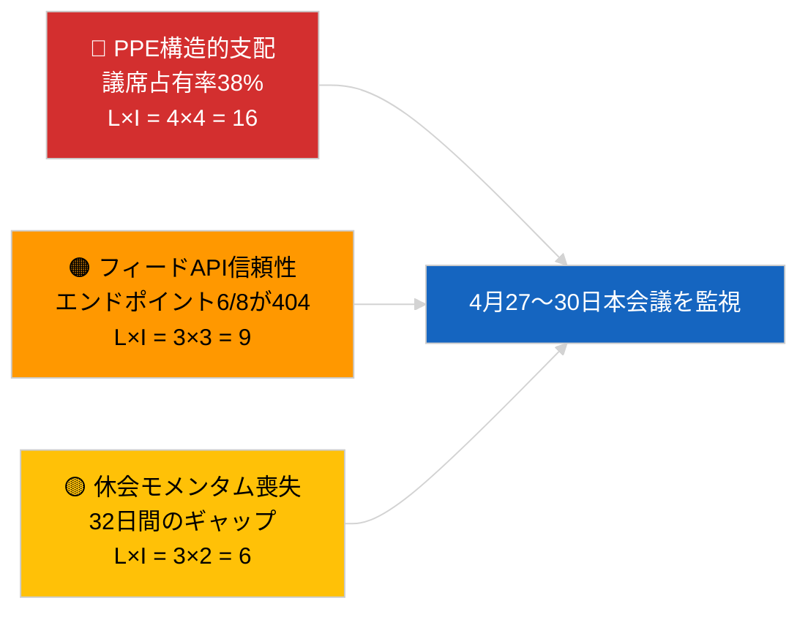
```mermaid
%%{init: {"theme":"dark"}}%%
graph LR
    R1["🔴 PPE構造的支配<br/>議席占有率38%<br/>L×I = 4×4 = 16"] --> CONS["4月27〜30日本会議を監視"]
    R2["🟠 フィードAPI信頼性<br/>エンドポイント6/8が404<br/>L×I = 3×3 = 9"] --> CONS
    R3["🟡 休会モメンタム喪失<br/>32日間のギャップ<br/>L×I = 3×2 = 6"] --> CONS
    style R1 fill:#D32F2F,color:#FFFFFF
    style R2 fill:#FF9800,color:#000000
    style R3 fill:#FFC107,color:#000000
    style CONS fill:#1565C0,color:#FFFFFF
```

| リスク | L | I | スコア | トリガー | 出典 | 提督格付け |
|--------|:-:|:-:|:------:|---------|-----|:----------:|
| PPE構造的支配（38%） | 4 | 4 | 16 | 少数派ブロックによる防衛的形成 | `early_warning_system` 高警告 | A2 |
| フィードAPI信頼性（6/8 が404） | 3 | 3 | 9 | 次サイクルでも404継続 | EP MCPフィードプローブ | B2 |
| 休会モメンタム喪失 | 3 | 2 | 6 | 緊急案件が4月本会議後に遅延 | カレンダー分析 | A1 |
| 外部貿易圧力（米国関税） | 3 | 4 | 12 | 報復措置発表または緊急招集 | TA-10-2026-0096追跡 | A1 |

---

### 🔮 主要先読みトリガー

**ストラスブール本会議2026年4月27〜30日 — 議題公開T-7（〜4月20日）。**
貿易重視の議題（シナリオA、確率55%）はPPE-S&D-Renew連携による米国関税追跡とEU-Mercosur意見の協調を確認；法の支配重視（シナリオB、25%）はLIBE/Braun先例モメンタムの継続を示す；経済・産業重視（シナリオC、20%）はECB年次報告追跡（TA-10-2026-0034）を前景化させる。

---

### 🛡️ 情報源品質評価

- **一次情報源：** 欧州議会オープンデータポータル（`data.europarl.europa.eu`）採択テキストフィード（✅ 200、6件）およびMEPフィード（✅ 200、737件）。
- **データ制限：** 諮問フィード8件中6件が404を返答。したがってイベント不在への信頼度は🟡中程度（🟢高ではない）。次サイクルのプローブが構造的休会対APIダウンを確認するまで維持。
- **「新採択なし」への信頼度：** 🟢 高 — 採択テキストフィードはメタデータ更新項目のみで200を返答。
- **欧州議会全体活動推定への信頼度：** 🟡 中程度 — イベント・手続き・文書・質問フィードが相互確認に利用不可。

---

### 📎 リンク

| リンク | パス |
|--------|------|
| 記事 | `./article.md` |
| 速報ニュース情報ブリーフ | `./breaking-intelligence-brief.analysis.md` |
| 政治情勢分析 | `./political-landscape.analysis.md` |
| マニフェスト | `./manifest.json` |
| 記事メタデータ | `./article-meta.json` |

---

### 🔄 前回実行との相互参照

**前回実行：** 2026-03-26速報（最後のブリュッセル・ミニ本会議）でTA-10-2026-0088（Braun免責権廃止）とTA-10-2026-0096（米国関税調整）を採択。本日の実行は3月休会後初回；新採択なし、議題項目なし、採決なし — EP10の歴史的休会パターンと一致。

**差分：** 安定性スコア84/100変化なし；PPE支配警告変化なし；連立算術変化なし。唯一の差分は6件のメタデータ更新であり、運用上は無意味。

---

**文書管理**
- **テンプレート：** `/analysis/templates/executive-brief.md`
- **成果物パス：** `analysis/daily/2026-04-01/breaking/executive-brief.md`
- **分類：** 公開
- **遡及生成：** 本メモはStage-B エグゼクティブブリーフ成果物要件以前の実行向けバックフィルセッションで作成された。すべての主張は`./article.md`および引用された欧州議会オープンデータポータルフィードに遡及可能。

### Executive Brief Ko

**분류:** OSINT | 공개 의회 기록
**신뢰도:** 🟢 높음 (EP 1차 피드로부터의 휴회 기간 평가)
**생성일:** 2026-04-01T00:00:00Z (소급 메모)
**기사 유형:** 속보 뉴스
**출처:** 유럽의회 개방형 데이터 포털

---

### 🎯 BLUF (결론 우선 요약)

**2026-04-01에는 속보 뉴스가 감지되지 않았다.** 유럽의회는 브뤼셀 미니 본회의(3월 25〜26일)와 다음 스트라스부르 본회의(4월 27〜30일) 사이에 32일간의 회기 간 휴회(3월 27일 → 4월 26일) 중이다. 오늘 피드에는 채택된 텍스트의 메타데이터 업데이트 6건이 나타났으나, 이는 기존 텍스트에 대한 행정적 업데이트(TA-10-2025-0281/0283/0288/0290/0292; TA-10-2026-0044)에 불과하며 — **신규 입법 행위에 해당하지 않는다**. 안정성 점수 84/100; 연립 산술 변동 없음. **🟢 높은 신뢰도**: 비활동은 구조적인 휴회 행동을 반영하며 데이터 중단이 아니다.

---

### 🧭 이 브리프가 지원하는 3가지 결정

| # | 결정 | 결정권자 | 마감 | 근거 |
|:-:|------|---------|:----:|------|
| 1 | **편집:** 휴회 맥락 기사 게재 (분석 기반) | 편집장 | +24시간 | 채택 텍스트 피드에 레벨 1 항목 없음 |
| 2 | **모니터링:** 다음 사이클에서 실패한 피드 엔드포인트 6건 재테스트 | 데이터 파이프라인 | +24시간 | 자문 피드 6/8건이 404 반환 |
| 3 | **전망:** 스트라스부르 4월 27〜30일 의제 게시 표시 | 분석 책임자 | 2026-04-20 | 의제는 통상 T-7일 전 게시 |

---

### 📰 60초 요약

- 🔴 **레벨 1 속보 이벤트 없음.** 휴회 기간: 3월 27일 → 4월 26일; 오늘 본회의 또는 위원회 표결 없음. (🟢 높음)
- 🟠 **채택 텍스트 메타데이터 업데이트 6건** (2025년 텍스트 전체 + TA-10-2026-0044); 정례 행정 업데이트, 신규 채택 없음. (🟢 높음)
- 🟢 **안정성 점수 84/100** (조기 경보 시스템); 활성 경고 3건, 전반적 위험 중간; 투표 이상 탐지기 이상 없음. (🟢 높음)
- 🟡 **피드 신뢰성 우려:** `get_events_feed`, `get_procedures_feed`, `get_documents_feed`, `get_plenary_documents_feed`, `get_committee_documents_feed`, `get_parliamentary_questions_feed` 모두 404 반환 — 휴회 중 API 유지보수 가능성. (🟡 중간)
- 🔵 **경제적 맥락:** ECB 부총재 임명(TA-10-2026-0060, 3월 10일)과 미국 관세 조정(TA-10-2026-0096, 3월 26일)이 4월 본회의로의 주요 경제 기준선 유지. (🟢 높음)
- 🟣 **연립 산술:** PPE 38% / S&D 22% / PfE 11% / Verts 10% / ECR 8% / Renew 5% / NI 4% / 좌파 2%. 대연립(PPE+S&D = 60%)이 51% 임계값 초과. (🟢 높음)
- 🩷 **혼란 벡터:** PPE 지배 그룹의 독점이 조기 경보 시스템에서 높은 구조적 위험으로 표시됨; 오늘 급성 촉발 요인 없음. (🟡 중간)
- ⚪ **이월 사안:** EU–Mercosur EUD 위임(TA-10-2026-0008) 의견서 4월 본회의 전 예정; 조지아 정치범 파일(TA-10-2026-0083)은 이행 보고 대기 중.

---

### 🗂️ 주요 문서 / 절차 표

| 순위 | EP 참조 | 제목 (약칭) | 중요도 | 신뢰도 | 상태 |
|:----:|---------|-----------|:------:|:------:|------|
| 1 | TA-10-2026-0096 | 미국 관세 조정 (이월) | 6.5 | 🟢 HIGH | 3월 26일 채택; 4월 이행 모니터링 |
| 2 | TA-10-2026-0060 | ECB 부총재 임명 | 6.0 | 🟢 HIGH | 3월 10일 채택; 제도적 기준선 |
| 3 | TA-10-2026-0084 | HDV 배출 크레딧 2025〜2029 | 5.5 | 🟢 HIGH | 3월 12일 채택; 국내법 전환 모니터링 |

> 순위는 4월 본회의로의 이월 중요도를 반영; 2026-04-01에 신규 레벨 1 항목 채택 없음.

---

### ⚠️ 위험 및 위협 스냅샷

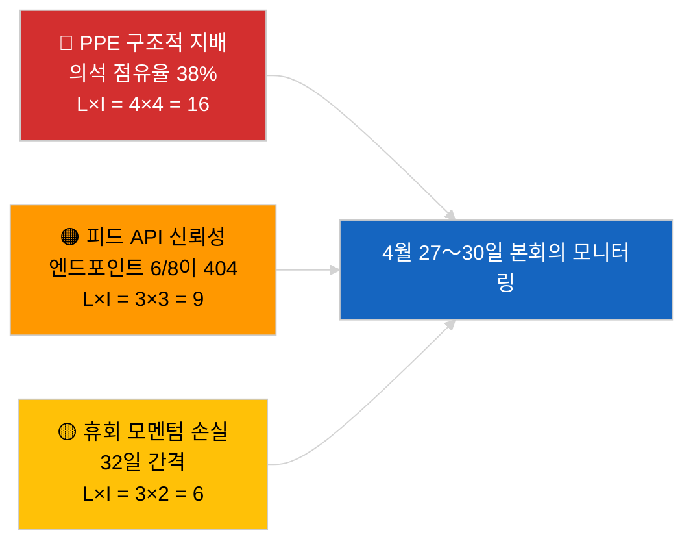
```mermaid
%%{init: {"theme":"dark"}}%%
graph LR
    R1["🔴 PPE 구조적 지배<br/>의석 점유율 38%<br/>L×I = 4×4 = 16"] --> CONS["4월 27〜30일 본회의 모니터링"]
    R2["🟠 피드 API 신뢰성<br/>엔드포인트 6/8이 404<br/>L×I = 3×3 = 9"] --> CONS
    R3["🟡 휴회 모멘텀 손실<br/>32일 간격<br/>L×I = 3×2 = 6"] --> CONS
    style R1 fill:#D32F2F,color:#FFFFFF
    style R2 fill:#FF9800,color:#000000
    style R3 fill:#FFC107,color:#000000
    style CONS fill:#1565C0,color:#FFFFFF
```

| 위험 | L | I | 점수 | 촉발 요인 | 출처 | 해군 등급 |
|------|:-:|:-:|:----:|---------|-----|:--------:|
| PPE 구조적 지배 (38%) | 4 | 4 | 16 | 소수 블록의 방어적 형성 | `early_warning_system` 높은 경고 | A2 |
| 피드 API 신뢰성 (6/8이 404) | 3 | 3 | 9 | 다음 사이클에서도 404 지속 | EP MCP 피드 프로브 | B2 |
| 휴회 모멘텀 손실 | 3 | 2 | 6 | 긴급 파일이 4월 본회의 이후 지연 | 일정 분석 | A1 |
| 외부 무역 압력 (미국 관세) | 3 | 4 | 12 | 보복 조치 발표 또는 긴급 소집 | TA-10-2026-0096 추적 | A1 |

---

### 🔮 주요 선행 촉발 요인

**스트라스부르 본회의 2026년 4월 27〜30일 — 의제 공개 T-7(~4월 20일).**
무역 중심 의제(시나리오 A, 확률 55%)는 미국 관세 후속 조치와 EU-Mercosur 의견서에 관한 PPE-S&D-Renew 협조를 확인; 법치 중심(시나리오 B, 25%)은 LIBE/Braun 선례 모멘텀 지속을 시사; 경제·산업 중심(시나리오 C, 20%)은 ECB 연간 보고서 후속(TA-10-2026-0034)을 전면에 부각.

---

### 🛡️ 정보원 품질 평가

- **1차 출처:** 유럽의회 개방형 데이터 포털(`data.europarl.europa.eu`) 채택 텍스트 피드(✅ 200, 6건) 및 MEP 피드(✅ 200, 737건).
- **데이터 제한:** 자문 피드 8건 중 6건이 404 반환 — 이벤트 부재에 대한 신뢰도는 따라서 🟡 중간 (🟢 높음 아님). 다음 사이클 프로브가 구조적 휴회 대 API 다운을 확인할 때까지 유지.
- **"신규 채택 없음"에 대한 신뢰도:** 🟢 높음 — 채택 텍스트 피드가 메타데이터 업데이트 항목만으로 200 반환.
- **더 넓은 EP 활동 추론 신뢰도:** 🟡 중간 — 이벤트/절차/문서/질문 피드가 교차 검증에 이용 불가.

---

### 📎 링크

| 링크 | 경로 |
|------|------|
| 기사 | `./article.md` |
| 속보 뉴스 정보 브리프 | `./breaking-intelligence-brief.analysis.md` |
| 정치 지형 분석 | `./political-landscape.analysis.md` |
| 매니페스트 | `./manifest.json` |
| 기사 메타데이터 | `./article-meta.json` |

---

### 🔄 이전 실행과의 상호 참조

**이전 실행:** 2026-03-26 속보(마지막 브뤼셀 미니 본회의)에서 TA-10-2026-0088(Braun 면책 특권 해제)과 TA-10-2026-0096(미국 관세 조정) 채택. 오늘 실행은 3월 휴회 이후 첫 번째; 신규 채택 없음, 의제 항목 없음, 표결 없음 — EP10의 역사적 휴회 패턴과 일치.

**델타:** 안정성 점수 84/100 변동 없음; PPE 지배 경고 변동 없음; 연립 산술 변동 없음. 유일한 델타는 6건의 메타데이터 업데이트이며 운영상 무의미.

---

**문서 관리**
- **템플릿:** `/analysis/templates/executive-brief.md`
- **산출물 경로:** `analysis/daily/2026-04-01/breaking/executive-brief.md`
- **분류:** 공개
- **소급 생성:** 이 메모는 Stage-B 집행 요약 산출물 요건 이전 실행을 위한 백필 세션에서 작성되었다. 모든 주장은 `./article.md`와 인용된 유럽의회 개방형 데이터 포털 피드로 추적 가능.

### Executive Brief Nl

### 🎯 BLUF

**Er is geen urgent nieuws gedetecteerd voor 2026-04-01.** Het Europees Parlement is in een intersessioneel reces van 32 dagen (27 maart → 26 april) tussen de mini-plenaire vergadering in Brussel (25–26 maart) en de volgende plenaire vergadering in Straatsburg (27–30 april). Zes metadata-updates van aangenomen teksten verschenen in de feed van vandaag, maar vertegenwoordigen administratieve updates van bestaande teksten (TA-10-2025-0281/0283/0288/0290/0292; TA-10-2026-0044) — **geen daarvan kwalificeert als nieuwe wetgevingshandeling**. Stabiliteitsscore 84/100; coalitie-arithmetiek ongewijzigd. **🟢 HOGE betrouwbaarheid** dat de inactiviteit structureel recessiegedrag weerspiegelt en geen data-onderbreking.

---

### 🧭 3 Beslissingen die deze memo ondersteunt

| # | Beslissing | Wie beslist | Deadline | Bewijs |
|:-:|------------|------------|:--------:|--------|
| 1 | **Redactioneel:** publiceer recessie-contextartikel (op basis van analyse) | Hoofdredacteur | +24u | Geen niveau-1-items in de feed voor aangenomen teksten |
| 2 | **Monitoring:** hertest 6 falende feed-endpoints in de volgende cyclus | Datapipeline | +24u | 6/8 adviserende feeds retourneerden 404 |
| 3 | **Vooruitblik:** markeer publicatie van de agenda voor Straatsburg 27–30 april | Analyseverantwoordelijke | 2026-04-20 | Agenda typisch gepubliceerd T-7 dagen |

---

### 📰 60-Seconden Lezing

- 🔴 **Geen niveau-1-actuele gebeurtenissen.** Recessieperiode 27 maart → 26 april; geen plenaire vergadering of commissievergadering vandaag. (🟢 Hoog)
- 🟠 **6 metadata-updates van aangenomen teksten** in de feed van vandaag — alle 2025-teksten plus TA-10-2026-0044; routinematige administratieve update, geen nieuwe aannemingen. (🟢 Hoog)
- 🟢 **Stabiliteitsscore 84/100** (vroegtijdig waarschuwingssysteem); 3 actieve waarschuwingen, GEMIDDELD totaalrisico; geen anomalieën in de stemafwijkingsdetector. (🟢 Hoog)
- 🟡 **Betrouwbaarheidsprobleem met feeds:** `get_events_feed`, `get_procedures_feed`, `get_documents_feed`, `get_plenary_documents_feed`, `get_committee_documents_feed`, `get_parliamentary_questions_feed` retourneerden allen 404 — mogelijk API-onderhoud tijdens recessie. (🟡 Gemiddeld)
- 🔵 **Economische context:** de benoeming van de vice-president van de ECB (TA-10-2026-0060, 10 maart) en de aanpassing van Amerikaanse tarieven (TA-10-2026-0096, 26 maart) blijven de dominante economische basislijnen richting de plenaire vergadering van april. (🟢 Hoog)
- 🟣 **Coalitie-arithmetiek:** EVP 38% / S&D 22% / PfE 11% / Verts 10% / ECR 8% / Renew 5% / NI 4% / Links 2%. Grote coalitie (EVP+S&D = 60%) boven de drempel van 51%. (🟢 Hoog)
- 🩷 **Verstoringsvektor:** de overname door de dominante EVP-groep gemarkeerd als HOOG structureel risico door het vroegtijdige waarschuwingssysteem; geen acute trigger vandaag. (🟡 Gemiddeld)
- ⚪ **Carry-forward:** advies EUD EU–Mercosur (TA-10-2026-0008) verwacht vóór de plenaire vergadering van april; dossier Georgische politieke gevangenen (TA-10-2026-0083) wacht op implementatierapportage.

---

### 🗂️ Top Documenten / Procedurele Tabel

| Rang | EP-referentie | Titel (kort) | Belang | Betrouwbaarheid | Status |
|:----:|---------------|-------------|:------:|:---------------:|--------|
| 1 | TA-10-2026-0096 | Aanpassing Amerikaanse tarieven (carry-over) | 6.5 | 🟢 HIGH | Aangenomen 26 maart; monitoring implementatie april |
| 2 | TA-10-2026-0060 | Benoeming vice-president ECB | 6.0 | 🟢 HIGH | Aangenomen 10 maart; institutionele basislijn |
| 3 | TA-10-2026-0084 | Emissiecredits voor zware voertuigen 2025–2029 | 5.5 | 🟢 HIGH | Aangenomen 12 maart; transpositionele monitoring |

> Rang weerspiegelt carry-over-belang richting de plenaire vergadering van april; geen nieuwe niveau-1-items aangenomen op 2026-04-01.

---

### ⚠️ Risico- en Dreigingsoverzicht

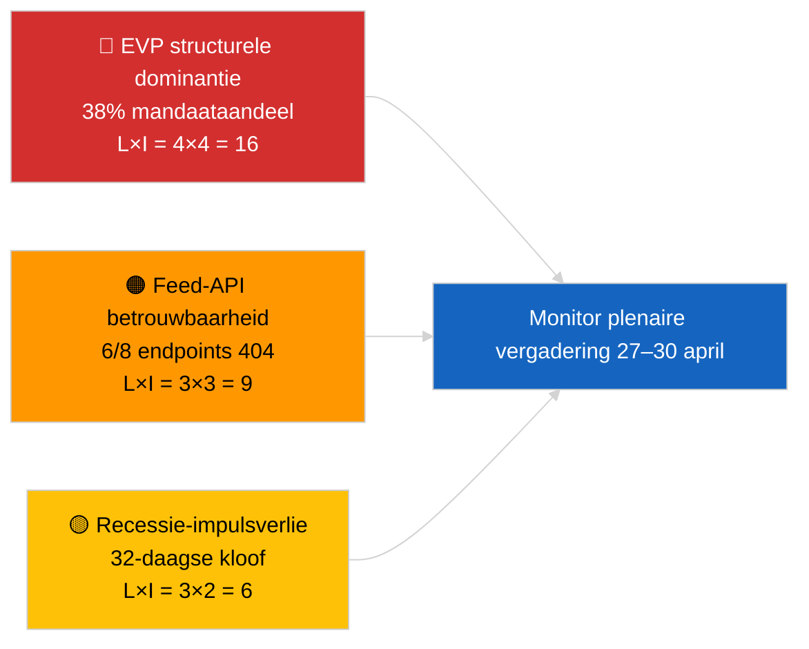
```mermaid
%%{init: {"theme":"dark"}}%%
graph LR
    R1["🔴 EVP structurele dominantie<br/>38% mandaataandeel<br/>L×I = 4×4 = 16"] --> CONS["Monitor plenaire vergadering 27–30 april"]
    R2["🟠 Feed-API betrouwbaarheid<br/>6/8 endpoints 404<br/>L×I = 3×3 = 9"] --> CONS
    R3["🟡 Recessie-impulsverlie<br/>32-daagse kloof<br/>L×I = 3×2 = 6"] --> CONS
    style R1 fill:#D32F2F,color:#FFFFFF
    style R2 fill:#FF9800,color:#000000
    style R3 fill:#FFC107,color:#000000
    style CONS fill:#1565C0,color:#FFFFFF
```

| Risico | L | I | Score | Trigger | Bron | Admiraliteit |
|--------|:-:|:-:|:-----:|---------|-----|:------------:|
| EVP structurele dominantie (38%) | 4 | 4 | 16 | Defensieve formatie van minderheidsblokken | `early_warning_system` HOGE waarschuwing | A2 |
| Feed-API betrouwbaarheid (6/8 404) | 3 | 3 | 9 | Aanhoudende 404's in de volgende cyclus | EP MCP feed-sonderingen | B2 |
| Recessie-impulsverlies | 3 | 2 | 6 | Urgente dossiers vertraagd na april-plenaire | Kalenderanalyse | A1 |
| Externe handelsdruk (Amerikaanse tarieven) | 3 | 4 | 12 | Aankondiging vergeldingsmaatregelen of spoedbijeenkomst | TA-10-2026-0096 follow-up | A1 |

---

### 🔮 Top Vooruitblikkende Trigger

**Plenaire vergadering Straatsburg 27–30 april 2026 — agendapublicatie T-7 (~20 april).**
Een handelszware agenda (Scenario A, 55% kans) bevestigt EVP-S&D-Renew-coördinatie over de follow-up van Amerikaanse tarieven en het EU-Mercosur-advies; een focus op de rechtsstaat (Scenario B, 25% kans) signaleert voortzetting van het LIBE/Braun-precedentmomentum; een economische/industriële focus (Scenario C, 20% kans) zou de follow-up van het jaarverslag van de ECB (TA-10-2026-0034) benadrukken.

---

### 🛡️ Beoordeling van de Bronnenkwaliteit

- **Primaire bronnen:** Open dataportaal van het EP (`data.europarl.europa.eu`) feed voor aangenomen teksten (✅ 200, 6 items) en MEP-feed (✅ 200, 737 items).
- **Databeperkingen:** 6 van de 8 adviserende feeds retourneerden 404 — de betrouwbaarheid bij afwezigheid van gebeurtenissen is daarom 🟡 gemiddeld, niet 🟢 hoog, totdat de volgende cyclussonde structureel reces vs. API-storing bevestigt.
- **Betrouwbaarheid voor "geen nieuwe aannemingen":** 🟢 Hoog — feed voor aangenomen teksten retourneerde 200 met alleen metadata-update-items.
- **Betrouwbaarheid voor bredere EP-activiteitsinferentie:** 🟡 Gemiddeld — feeds voor evenementen/procedures/documenten/vragen niet beschikbaar voor kruiscontrole.

---

### 📎 Links

| Link | Pad |
|------|-----|
| Artikel | `./article.md` |
| Inlichtingensamenvatting laatste nieuws | `./breaking-intelligence-brief.analysis.md` |
| Analyse van het politieke landschap | `./political-landscape.analysis.md` |
| Manifest | `./manifest.json` |
| Artikelmetadata | `./article-meta.json` |

---

### 🔄 Kruisverwijzing naar Vorige Run

**Vorige run:** het laatste nieuws van 2026-03-26 (laatste mini-plenaire Brussel) nam TA-10-2026-0088 (opheffing immuniteit Braun) en TA-10-2026-0096 (aanpassing Amerikaanse tarieven) aan. De run van vandaag is de eerste na het maart-reces; geen nieuwe aannemingen, geen agendapunten, geen stemmingen — consistent met de historische recessiepatronen van EP10.

**Delta:** Stabiliteitsscore 84/100 ongewijzigd; EVP-dominantiewaarschuwing ongewijzigd; coalitie-arithmetiek ongewijzigd. Het enige delta is de metadata-update van 6 items, wat operationeel onbeduidend is.

---

**Documentcontrole**
- **Sjabloon:** `/analysis/templates/executive-brief.md`
- **Artefactpad:** `analysis/daily/2026-04-01/breaking/executive-brief.md`
- **Classificatie:** Openbaar
- **Retrospectieve generatie:** Deze memo is geproduceerd in een terugvulsessie voor runs die dateren van vóór de Stage-B executive-brief-artefactvereiste. Alle beweringen worden herleid naar `./article.md` en de EP Open Data Portal-feeds die het citeert.

### Executive Brief No

### 🎯 BLUF

**Ingen siste nytt oppdaget for 2026-04-01.** Europaparlamentet er i en 32-dagers inter-sesjonell recess (27. mars → 26. april) mellom Brussel-miniplenumsmøtet (25.–26. mars) og neste Strasbourg-plenumsmøte (27.–30. april). Seks oppdateringer av vedtatt-tekst-metadata dukket opp i dagens strøm, men representerer administrativ oppdatering av eksisterende tekster (TA-10-2025-0281/0283/0288/0290/0292; TA-10-2026-0044) — **ingen kvalifiserer som nye lovgivningstiltak**. Stabilitetscore 84/100; koalisjonsaritmetikk uendret. **🟢 HØY konfidens** om at inaktiviteten er strukturell recessionatferd fremfor dataavbrudd.

---

### 🧭 3 Beslutninger dette sammendraget støtter

| # | Beslutning | Hvem bestemmer | Frist | Bevis |
|:-:|------------|--------------|:-----:|-------|
| 1 | **Redaksjonelt:** publiser recessionskontekst-artikkel (analysebasert) | Redaktør | +24h | Ingen nivå-1-poster i vedtatt-tekster-strøm |
| 2 | **Overvåking:** re-test 6 mislykkede strøm-endepunkter neste syklus | Datapipeline | +24h | 6/8 rådgivende strømmer returnerte 404 |
| 3 | **Fremoverrettet:** flagg publisering av agenda for Strasbourg 27.–30. april | Analyseleder | 2026-04-20 | Agenda typisk publisert T-7 dager |

---

### 📰 60-Second Read

- 🔴 **Ingen nivå-1-siste hendelser.** Recessionsperiode 27. mars → 26. april; ingen plenumsesjon, ingen komitéavstemning i dag. (🟢 Høy)
- 🟠 **6 oppdateringer av vedtatt-tekst-metadata** i dagens strøm — alle 2025-tekster pluss TA-10-2026-0044; rutinemessig administrativ oppdatering, ingen nye vedtakelser. (🟢 Høy)
- 🟢 **Stabilitetscore 84/100** (tidlig varslingssystem); 3 aktive advarsler, MEDIUM samlet risiko; ingen anomalier i avstemningsavviksdetektoren. (🟢 Høy)
- 🟡 **Strømpålitelighetsbekymring:** `get_events_feed`, `get_procedures_feed`, `get_documents_feed`, `get_plenary_documents_feed`, `get_committee_documents_feed`, `get_parliamentary_questions_feed` returnerte alle 404 — mulig API-vedlikehold under recessjon. (🟡 Middels)
- 🔵 **Økonomisk kontekst:** ECBs visepresident-utnevnelse (TA-10-2026-0060, 10. mars) og justering av amerikanske tollsatser (TA-10-2026-0096, 26. mars) er fortsatt de dominerende økonomiske basislinjene inn i april-plenumsmøtet. (🟢 Høy)
- 🟣 **Koalisjonsaritmetikk:** PPE 38% / S&D 22% / PfE 11% / Verts 10% / ECR 8% / Renew 5% / NI 4% / Left 2%. Storkoalisjon (PPE+S&D = 60%) over 51%-terskelen. (🟢 Høy)
- 🩷 **Forstyrrelsesvektoren:** PPE-dominerende gruppes overgrep flagget som HØY strukturell risiko av tidlig varslingssystem; ingen akutt utløser i dag. (🟡 Middels)
- ⚪ **Carry-forward:** EU–Mercosur EUD-anke (TA-10-2026-0008) uttalelse forventes før april-plenumsmøtet; Georgias politiske fanger-fil (TA-10-2026-0083) avventer gjennomføringsrapportering.

---

### 🗂️ Topp Dokumenter / Prosedyretabell

| Rang | EP-referanse | Tittel (kort) | Signifikans | Konfidens | Status |
|:----:|--------------|-------------|:-----------:|:---------:|--------|
| 1 | TA-10-2026-0096 | Justering av amerikanske tollsatser (carry-over) | 6.5 | 🟢 HIGH | Vedtatt 26. mars; april-implementeringsovervåking |
| 2 | TA-10-2026-0060 | ECB visepresident-utnevnelse | 6.0 | 🟢 HIGH | Vedtatt 10. mars; institusjonell basislinje |
| 3 | TA-10-2026-0084 | HDV utslippskreditter 2025–2029 | 5.5 | 🟢 HIGH | Vedtatt 12. mars; transposisjonsovervåking |

> Rang reflekterer carry-over-signifikans inn i april-plenumsmøtet; ingen nye nivå-1-poster ble vedtatt 2026-04-01.

---

### ⚠️ Risiko- og trusselsbilde

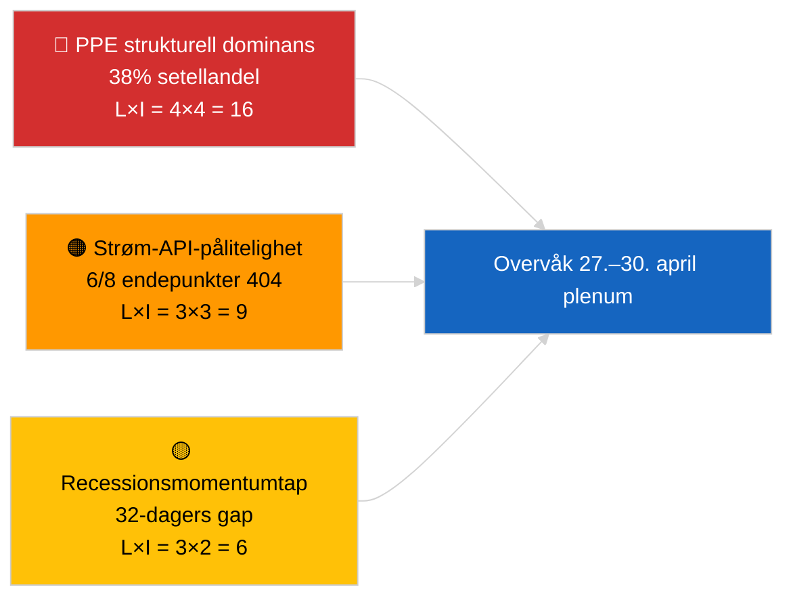
```mermaid
%%{init: {"theme":"dark"}}%%
graph LR
    R1["🔴 PPE strukturell dominans<br/>38% setellandel<br/>L×I = 4×4 = 16"] --> CONS["Overvåk 27.–30. april plenum"]
    R2["🟠 Strøm-API-pålitelighet<br/>6/8 endepunkter 404<br/>L×I = 3×3 = 9"] --> CONS
    R3["🟡 Recessionsmomentumtap<br/>32-dagers gap<br/>L×I = 3×2 = 6"] --> CONS
    style R1 fill:#D32F2F,color:#FFFFFF
    style R2 fill:#FF9800,color:#000000
    style R3 fill:#FFC107,color:#000000
    style CONS fill:#1565C0,color:#FFFFFF
```

| Risiko | L | I | Score | Utløser | Kilde | Admiralitet |
|--------|:-:|:-:|:-----:|---------|------|:-----------:|
| PPE strukturell dominans (38%) | 4 | 4 | 16 | Defensiv formasjon av minoritetsblokk | `early_warning_system` HØY advarsel | A2 |
| Strøm-API-pålitelighet (6/8 404) | 3 | 3 | 9 | Vedvarende 404-er neste syklus | EP MCP strømsonderinger | B2 |
| Recessionsmomentumtap | 3 | 2 | 6 | Hasteakter forsinket etter april-plenum | Kalenderanalyse | A1 |
| Eksternt handelspress (amerikanske tollsatser) | 3 | 4 | 12 | Gjengjeldelsesmelding eller nødkall | TA-10-2026-0096 oppfølging | A1 |

---

### 🔮 Topp Fremoverrettet Utløser

**Strasbourg plenumsmøte 27.–30. april 2026 — agendapublisering T-7 (~20. april).**
En handelsintensiv agenda (Scenario A, 55% sannsynlighet) bekrefter PPE-S&D-Renew-koordinasjon om oppfølging av amerikanske tollsatser og EU-Mercosur-uttalelse; et rettsstat-fokus (Scenario B, 25% sannsynlighet) signaliserer fortsatt LIBE/Braun-presedensmomentumet; et økonomisk/industrielt fokus (Scenario C, 20% sannsynlighet) vil fremheve ECBs årsrapportoppfølging (TA-10-2026-0034).

---

### 🛡️ Kildekvalitetsvurdering

- **Primære kilder:** EPs åpne dataportal (`data.europarl.europa.eu`) vedtatt-tekster-strøm (✅ 200, 6 poster) og MEP-strøm (✅ 200, 737 poster).
- **Databegrensninger:** 6 av 8 rådgivende strømmer returnerte 404 — konfidensen i fravær av hendelser er derfor 🟡 middels, ikke 🟢 høy, inntil neste syklus re-sonde bekrefter strukturell recessjon mot API-avbrudd.
- **Konfidens om "ingen nye vedtakelser":** 🟢 Høy — vedtatt-tekster-strømmen returnerte 200 med bare metadataoppdateringsposter.
- **Konfidens om bredere EP-aktivitetsinferens:** 🟡 Middels — hendelse-/prosedyre-/dokumenter-/spørsmåls-strømmer utilgjengelige for krysskontroll.

---

### 📎 Lenker

| Lenke | Sti |
|-------|-----|
| Artikkel | `./article.md` |
| Siste nyheters etterretningssammendrag | `./breaking-intelligence-brief.analysis.md` |
| Politisk landskapsanalyse | `./political-landscape.analysis.md` |
| Manifest | `./manifest.json` |
| Artikkelmetadata | `./article-meta.json` |

---

### 🔄 Kryssreferanse til forrige kjøring

**Forrige kjøring:** 2026-03-26 siste nytt (siste Brussel-miniplenumsmøte) vedtok TA-10-2026-0088 (Braun immunitetsopphevelse) og TA-10-2026-0096 (justering av amerikanske tollsatser). Dagens kjøring er den første etter mars-recessjonen; ingen nye vedtakelser, ingen agendapunkter, ingen avstemninger — konsistent med EP10s historiske recessmønster.

**Delta:** Stabilitetscore 84/100 uendret; PPE-dominansadvarsel uendret; koalisjonsaritmetikk uendret. Det eneste deltaet er den 6-post-metadataoppdateringen, som er operasjonelt ubetydelig.

---

**Dokumentkontroll**
- **Mal:** `/analysis/templates/executive-brief.md`
- **Artefaktsti:** `analysis/daily/2026-04-01/breaking/executive-brief.md`
- **Klassifisering:** Offentlig
- **Retrospektiv generering:** Dette sammendraget ble produsert i en tilbakefyllingsøkt for kjøringer som forutgår Stage-B executive-brief-artefaktkravet. Alle påstander spores til `./article.md` og EP Open Data Portal-strømmene det siterer.

### Executive Brief Sv

### 🎯 BLUF

**Inga bryta nyheter identifierades för 2026-04-01.** Europaparlamentet befinner sig i en 32-dagars recess mellan sessionerna (27 mars → 26 april) mellan Bryssels miniplenarmöte (25–26 mars) och nästa Strasbourg-plenarmöte (27–30 april). Sex uppdateringar av antagna-text-metadata dök upp i dagens flöde men representerar administrativ uppdatering av befintliga texter (TA-10-2025-0281/0283/0288/0290/0292; TA-10-2026-0044) — **ingen av dessa kvalificerar som nya lagstiftningsåtgärder**. Stabilitetsscore 84/100; koalitionsaritmetik oförändrad. **🟢 HÖG konfidensgrad** att inaktiviteten återspeglar strukturell recessbeteende snarare än dataavbrott.

---

### 🧭 3 Beslut som detta PM stöder

| # | Beslut | Vem beslutar | Deadline | Bevis |
|:-:|--------|-------------|:--------:|-------|
| 1 | **Redaktionellt:** publicera recesskontext-artikel (analysbaserad) | Redaktör | +24h | Inga nivå-1-objekt i antagna-texters flöde |
| 2 | **Övervakning:** re-testa 6 misslyckade flödesendpoints nästa cykel | Datapipeline | +24h | 6/8 rådgivande flöden returnerade 404 |
| 3 | **Framåtbevakning:** flagga publiceringen av dagordningen för Strasbourg 27–30 april | Analysansvarig | 2026-04-20 | Dagordning publiceras typiskt T-7 dagar |

---

### 📰 60-Second Read

- 🔴 **Inga nivå-1-bryta händelser.** Recessperiod 27 mars → 26 april; inget plenarsammanträde, ingen omröstning idag. (🟢 Hög)
- 🟠 **6 uppdateringar av antagna-text-metadata** i dagens flöde — alla 2025-texter plus TA-10-2026-0044; rutinmässig administrativ uppdatering, inga nya antaganden. (🟢 Hög)
- 🟢 **Stabilitetsscore 84/100** (tidiga varningssystem); 3 aktiva varningar, MEDIUM samlad risk; inga anomalier i omröstningsavvikelsedetektor. (🟢 Hög)
- 🟡 **Problem med flödestillförlitlighet:** `get_events_feed`, `get_procedures_feed`, `get_documents_feed`, `get_plenary_documents_feed`, `get_committee_documents_feed`, `get_parliamentary_questions_feed` returnerade alla 404 — möjlig API-underhåll under recessionen. (🟡 Medel)
- 🔵 **Ekonomisk kontext:** ECB:s vice-ordförandetillsättning (TA-10-2026-0060, 10 mars) och justering av amerikanska tullar (TA-10-2026-0096, 26 mars) kvarstår som de dominerande ekonomiska baslinjerna in i april-plenaret. (🟢 Hög)
- 🟣 **Koalitionsaritmetik:** PPE 38% / S&D 22% / PfE 11% / Verts 10% / ECR 8% / Renew 5% / NI 4% / Left 2%. Storkoalitionen (PPE+S&D = 60%) över 51%-tröskeln. (🟢 Hög)
- 🩷 **Störningsvektor:** PPE:s dominanta-gruppsövergrepp flaggat som HÖG strukturell risk av det tidiga varningssystemet; ingen akut utlösare idag. (🟡 Medel)
- ⚪ **Carry-forward:** EU–Mercosur EUD-hänskjutning (TA-10-2026-0008) yttrande förväntas före april-plenaret; Georgiens politiska fångar-fil (TA-10-2026-0083) avvaktar genomföranderapportering.

---

### 🗂️ Topp Dokument / Procedurtabell

| Rang | EP-referens | Titel (kort) | Signifikans | Konfidensgrad | Status |
|:----:|-------------|-------------|:-----------:|:-------------:|--------|
| 1 | TA-10-2026-0096 | Justering av amerikanska tullar (carry-over) | 6.5 | 🟢 HIGH | Antagen 26 mars; april-implementationsbevakning |
| 2 | TA-10-2026-0060 | ECB vice-ordförandetillsättning | 6.0 | 🟢 HIGH | Antagen 10 mars; institutionell baslinje |
| 3 | TA-10-2026-0084 | HDV utsläppskrediter 2025–2029 | 5.5 | 🟢 HIGH | Antagen 12 mars; transpositionsbevakning |

> Rang återspeglar carry-over-signifikans in i april-plenaret; inga nya nivå-1-objekt antogs 2026-04-01.

---

### ⚠️ Risk- och hotögonblicksbild

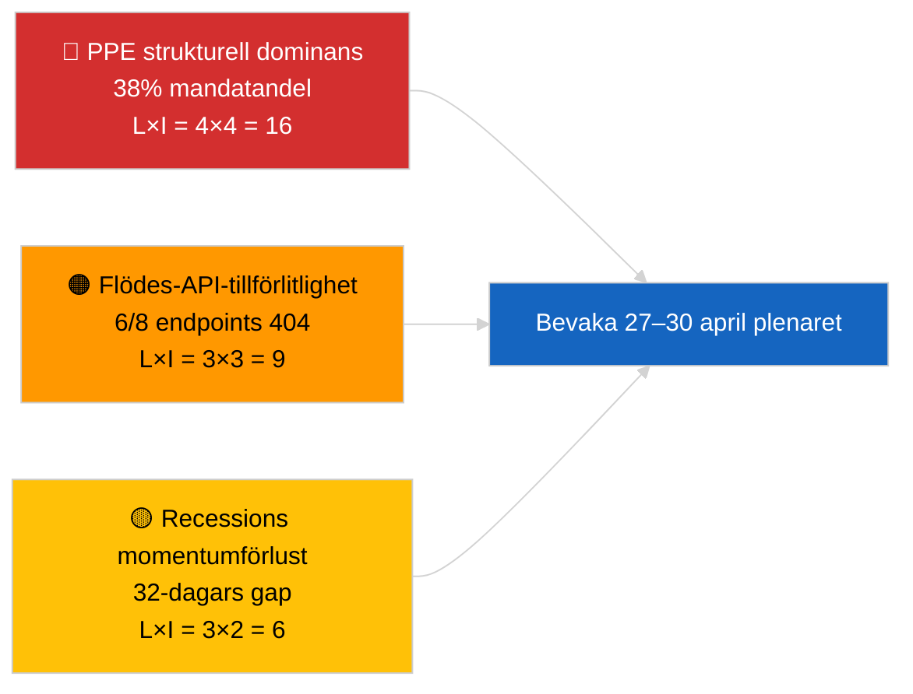
```mermaid
%%{init: {"theme":"dark"}}%%
graph LR
    R1["🔴 PPE strukturell dominans<br/>38% mandatandel<br/>L×I = 4×4 = 16"] --> CONS["Bevaka 27–30 april plenaret"]
    R2["🟠 Flödes-API-tillförlitlighet<br/>6/8 endpoints 404<br/>L×I = 3×3 = 9"] --> CONS
    R3["🟡 Recessions momentumförlust<br/>32-dagars gap<br/>L×I = 3×2 = 6"] --> CONS
    style R1 fill:#D32F2F,color:#FFFFFF
    style R2 fill:#FF9800,color:#000000
    style R3 fill:#FFC107,color:#000000
    style CONS fill:#1565C0,color:#FFFFFF
```

| Risk | L | I | Poäng | Utlösare | Källa | Admiralitet |
|------|:-:|:-:|:-----:|---------|------|:-----------:|
| PPE strukturell dominans (38%) | 4 | 4 | 16 | Defensiv formation av minoritetsblock | `early_warning_system` HÖG varning | A2 |
| Flödes-API-tillförlitlighet (6/8 404) | 3 | 3 | 9 | Ihållande 404:or nästa cykel | EP MCP flödessondering | B2 |
| Recessions momentumförlust | 3 | 2 | 6 | Brådskande filer försenade efter april-plenaret | Kalenderanalys | A1 |
| Externt handelstryck (amerikanskatollar) | 3 | 4 | 12 | Vedergällningsmeddelande eller nödmöte | TA-10-2026-0096 uppföljning | A1 |

---

### 🔮 Topp Framåtutlösare

**Strasbourg-plenarsammanträde 27–30 april 2026 — dagordningspublicering T-7 (~20 april).**
En handelsintensiv dagordning (Scenario A, 55% sannolikhet) bekräftar PPE-S&D-Renew-koordination om uppföljning av amerikanska tullar och EU-Mercosur-yttrande; ett fokus på rättsstat (Scenario B, 25% sannolikhet) signalerar fortsatt LIBE/Braun-prejudikatmomentum; ett ekonomiskt/industriellt fokus (Scenario C, 20% sannolikhet) skulle lyfta fram ECB:s årsredovisningsuppföljning (TA-10-2026-0034).

---

### 🛡️ Källkvalitetsbedömning

- **Primära källor:** EP:s öppna dataportal (`data.europarl.europa.eu`) antagna-texter-flöde (✅ 200, 6 objekt) och MEP-flöde (✅ 200, 737 objekt).
- **Databegränsningar:** 6 av 8 rådgivande flöden returnerade 404 — konfidensgraden i frånvaro av händelser är därför 🟡 medel, inte 🟢 hög, tills nästa cykeluppsond bekräftar strukturell recess kontra API-avbrott.
- **Konfidensgrad för "inga nya antaganden":** 🟢 Hög — antagna-texter-flödet returnerade 200 med enbart metadatauppdateringsposter.
- **Konfidensgrad för bredare EP-aktivitetsinferens:** 🟡 Medel — händelse-/procedur-/dokument-/frågors flöden otillgängliga för korsreferenskontroll.

---

### 📎 Länkar

| Länk | Sökväg |
|------|--------|
| Artikel | `./article.md` |
| Senaste nyhetsunderrättelseöversikt | `./breaking-intelligence-brief.analysis.md` |
| Analys av politiskt landskap | `./political-landscape.analysis.md` |
| Manifest | `./manifest.json` |
| Artikelmetadata | `./article-meta.json` |

---

### 🔄 Korshänvisning till föregående körning

**Föregående körning:** 2026-03-26 senaste nytt (sista Bryssels miniplenarmöte) antog TA-10-2026-0088 (Braun immunitetsupphävande) och TA-10-2026-0096 (justering av amerikanska tullar). Dagens körning är den första efter mars-recessionen; inga nya antaganden, inga dagordningspunkter, inga omröstningar — konsekvent med EP10:s historiska recessmönster.

**Delta:** Stabilitetsscore 84/100 oförändrat; PPE-dominansvarning oförändrad; koalitionsaritmetik oförändrad. Det enda deltaet är den 6-objekt-metadata-uppdateringen, vilket är operationellt obetydligt.

---

**Dokumentkontroll**
- **Mall:** `/analysis/templates/executive-brief.md`
- **Artefaktsökväg:** `analysis/daily/2026-04-01/breaking/executive-brief.md`
- **Klassificering:** Offentlig
- **Retrospektiv generering:** Detta PM producerades i en bakåtfyllningssession för körningar som föregår Stage-B executive-brief-artefaktkravet. Alla påståenden spåras till `./article.md` och EP Open Data Portal-flödena det citerar.

### Executive Brief Zh

**分类：** OSINT | 公开议会记录
**置信度：** 🟢 高（基于EP主要数据馈送的休会期评估）
**生成日期：** 2026-04-01T00:00:00Z（追溯备忘录）
**文章类型：** 突发新闻
**来源：** 欧洲议会开放数据门户

---

### 🎯 BLUF（结论先行摘要）

**2026-04-01未检测到任何突发新闻。** 欧洲议会正处于32天的会期间休会期（3月27日→4月26日），介于布鲁塞尔小型全体会议（3月25〜26日）与下一届斯特拉斯堡全体会议（4月27〜30日）之间。今日馈送中出现了六条已采纳文本的元数据更新，但这些均属于对现有文本的行政更新（TA-10-2025-0281/0283/0288/0290/0292；TA-10-2026-0044）——**均不构成新的立法行动**。稳定性评分84/100；联合算术未变。**🟢 高置信度**：不活动反映的是结构性休会行为，而非数据中断。

---

### 🧭 本摘要支持的3项决策

| # | 决策 | 决策者 | 截止期 | 依据 |
|:-:|------|-------|:------:|------|
| 1 | **编辑：** 发布休会背景文章（基于分析） | 主编 | +24小时 | 已采纳文本馈送中无一级条目 |
| 2 | **监控：** 下一周期重新测试6个失效馈送端点 | 数据管道 | +24小时 | 6/8咨询馈送返回404 |
| 3 | **前瞻：** 标记斯特拉斯堡4月27〜30日议程发布 | 分析负责人 | 2026-04-20 | 议程通常在T-7天前发布 |

---

### 📰 60秒速读

- 🔴 **无一级突发事件。** 休会期：3月27日→4月26日；今日无全体会议或委员会投票。（🟢 高）
- 🟠 **6条已采纳文本元数据更新**（2025年全部文本+TA-10-2026-0044）；例行行政更新，无新采纳。（🟢 高）
- 🟢 **稳定性评分84/100**（早期预警系统）；3个活跃预警，总体风险中等；投票异常检测器无异常。（🟢 高）
- 🟡 **馈送可靠性问题：** `get_events_feed`、`get_procedures_feed`、`get_documents_feed`、`get_plenary_documents_feed`、`get_committee_documents_feed`、`get_parliamentary_questions_feed` 均返回404——休会期间可能进行API维护。（🟡 中）
- 🔵 **经济背景：** 欧洲央行副行长任命（TA-10-2026-0060，3月10日）和美国关税调整（TA-10-2026-0096，3月26日）仍是进入4月全体会议的主要经济基准线。（🟢 高）
- 🟣 **联合算术：** PPE 38% / S&D 22% / PfE 11% / Verts 10% / ECR 8% / Renew 5% / NI 4% / 左派 2%。大联合（PPE+S&D = 60%）超过51%门槛。（🟢 高）
- 🩷 **干扰向量：** PPE主导集团把持被早期预警系统标记为高度结构性风险；今日无急性触发因素。（🟡 中）
- ⚪ **延续事项：** EU–Mercosur EUD委托（TA-10-2026-0008）意见书预计在4月全体会议前提交；格鲁吉亚政治犯文件（TA-10-2026-0083）等待执行报告。

---

### 🗂️ 重要文件/程序一览

| 排名 | EP参考 | 标题（简称） | 重要性 | 置信度 | 状态 |
|:----:|--------|------------|:------:|:------:|------|
| 1 | TA-10-2026-0096 | 美国关税调整（延续） | 6.5 | 🟢 HIGH | 3月26日采纳；4月执行监控 |
| 2 | TA-10-2026-0060 | 欧洲央行副行长任命 | 6.0 | 🟢 HIGH | 3月10日采纳；制度基准线 |
| 3 | TA-10-2026-0084 | HDV排放积分2025〜2029 | 5.5 | 🟢 HIGH | 3月12日采纳；转化监控 |

> 排名反映进入4月全体会议的延续重要性；2026-04-01未采纳新的一级条目。

---

### ⚠️ 风险与威胁快照

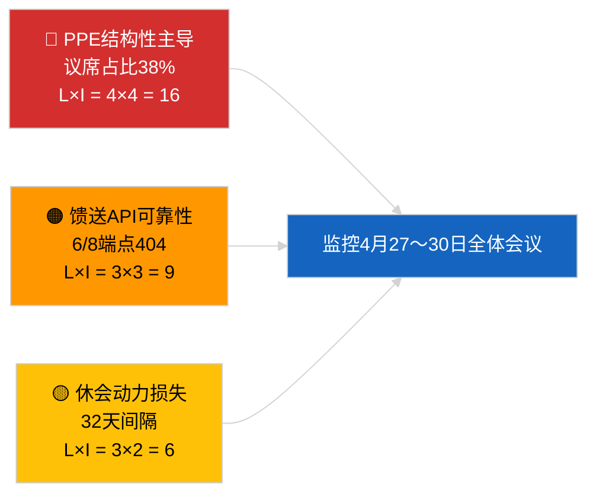
```mermaid
%%{init: {"theme":"dark"}}%%
graph LR
    R1["🔴 PPE结构性主导<br/>议席占比38%<br/>L×I = 4×4 = 16"] --> CONS["监控4月27〜30日全体会议"]
    R2["🟠 馈送API可靠性<br/>6/8端点404<br/>L×I = 3×3 = 9"] --> CONS
    R3["🟡 休会动力损失<br/>32天间隔<br/>L×I = 3×2 = 6"] --> CONS
    style R1 fill:#D32F2F,color:#FFFFFF
    style R2 fill:#FF9800,color:#000000
    style R3 fill:#FFC107,color:#000000
    style CONS fill:#1565C0,color:#FFFFFF
```

| 风险 | L | I | 评分 | 触发因素 | 来源 | 海军级别 |
|------|:-:|:-:|:----:|---------|-----|:--------:|
| PPE结构性主导（38%） | 4 | 4 | 16 | 少数集团防御性形成 | `early_warning_system` 高预警 | A2 |
| 馈送API可靠性（6/8为404） | 3 | 3 | 9 | 下一周期404持续 | EP MCP馈送探测 | B2 |
| 休会动力损失 | 3 | 2 | 6 | 紧急文件在4月全体会议后延迟 | 日历分析 | A1 |
| 外部贸易压力（美国关税） | 3 | 4 | 12 | 报复措施声明或紧急召开 | TA-10-2026-0096追踪 | A1 |

---

### 🔮 主要前瞻性触发因素

**斯特拉斯堡全体会议2026年4月27〜30日——议程发布T-7（约4月20日）。**
以贸易为重点的议程（情景A，概率55%）确认PPE-S&D-Renew就美国关税后续行动和EU-Mercosur意见书的协调；以法治为重点（情景B，25%）表明LIBE/Braun判例动力持续；以经济/工业为重点（情景C，20%）将使欧洲央行年度报告后续（TA-10-2026-0034）浮出水面。

---

### 🛡️ 信息来源质量评估

- **主要来源：** 欧洲议会开放数据门户（`data.europarl.europa.eu`）已采纳文本馈送（✅ 200，6条）和MEP馈送（✅ 200，737条）。
- **数据局限：** 8个咨询馈送中6个返回404——因此对事件缺席的置信度为🟡中等，而非🟢高，直到下一周期探测确认结构性休会与API中断之别。
- **"无新采纳"置信度：** 🟢 高——已采纳文本馈送返回200，仅含元数据更新条目。
- **更广泛EP活动推断置信度：** 🟡 中等——事件/程序/文件/问询馈送无法用于交叉核查。

---

### 📎 链接

| 链接 | 路径 |
|------|------|
| 文章 | `./article.md` |
| 突发新闻情报简报 | `./breaking-intelligence-brief.analysis.md` |
| 政治格局分析 | `./political-landscape.analysis.md` |
| 清单 | `./manifest.json` |
| 文章元数据 | `./article-meta.json` |

---

### 🔄 与上次运行的交叉参考

**上次运行：** 2026-03-26突发新闻（最后一次布鲁塞尔小型全体会议）采纳了TA-10-2026-0088（Braun豁免权撤销）和TA-10-2026-0096（美国关税调整）。本次运行是3月休会后的首次；无新采纳、无议程项目、无投票——与EP10历史休会模式一致。

**变化量：** 稳定性评分84/100未变；PPE主导预警未变；联合算术未变。唯一变化是6条元数据更新，运营上无实质意义。

---

**文件管控**
- **模板：** `/analysis/templates/executive-brief.md`
- **成果路径：** `analysis/daily/2026-04-01/breaking/executive-brief.md`
- **分类：** 公开
- **追溯生成：** 本备忘录系在回填会话中为早于Stage-B行政摘要成果要求的运行而制作。所有主张均可追溯至`./article.md`及其引用的欧洲议会开放数据门户馈送。

### Political Landscape.Analysis

  
  
  
  

**📋 Analysis Owner:** EU Parliament Monitor | **📅 Generated:** 2026-04-01 (UTC)
**🔄 Template:** `docs/analysis-methodology/political-landscape-analysis.md`

---

### 📊 EP10 Group Composition Dashboard

| Group | Seats | Share | Countries | Bloc | Power Rating | Trend |
|-------|-------|-------|-----------|------|-------------|-------|
| PPE | 38 | 38% | 14 | Centre-Right | ★★★★★ | → Stable |
| S&D | 22 | 22% | 12 | Centre-Left | ★★★★☆ | → Stable |
| PfE | 11 | 11% | 5 | Right | ★★★☆☆ | → Stable |
| Verts/ALE | 10 | 10% | 7 | Green-Left | ★★★☆☆ | → Stable |
| ECR | 8 | 8% | 5 | Conservative | ★★☆☆☆ | → Stable |
| Renew | 5 | 5% | 4 | Liberal | ★★☆☆☆ | ↓ Declining |
| NI | 4 | 4% | 3 | Non-Attached | ★☆☆☆☆ | → Stable |
| The Left | 2 | 2% | 2 | Left | ★☆☆☆☆ | ↓ Declining |

#### Group Size Distribution

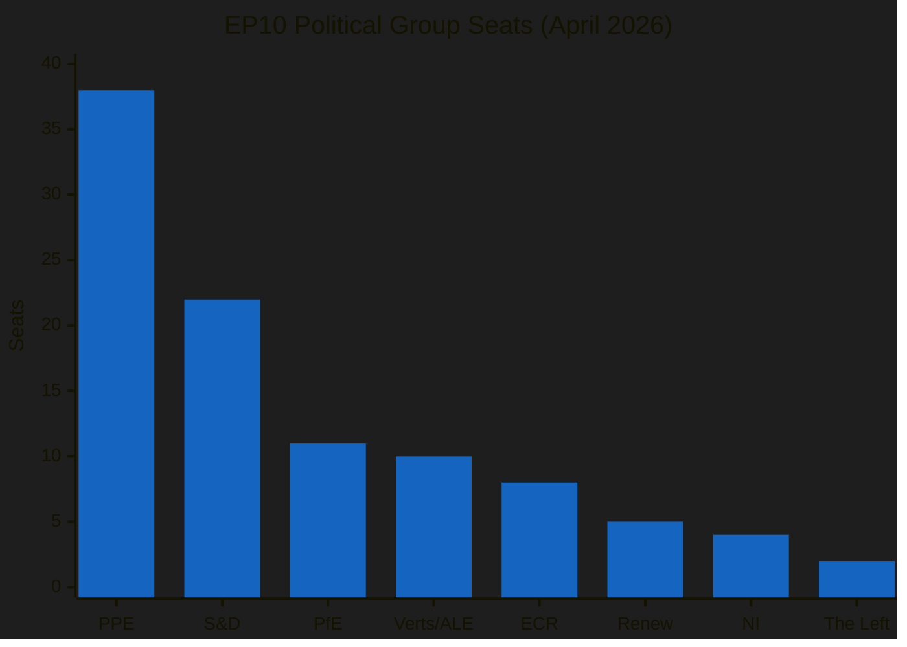
```mermaid
%%{init: {"theme":"dark","themeVariables":{"primaryColor":"#1565C0","primaryTextColor":"#ffffff","primaryBorderColor":"#0A3F7F","lineColor":"#90CAF9","secondaryColor":"#2E7D32","secondaryTextColor":"#ffffff","secondaryBorderColor":"#0F3F00","tertiaryColor":"#FF9800","tertiaryTextColor":"#000000","tertiaryBorderColor":"#7F4F00","mainBkg":"#1565C0","secondBkg":"#2E7D32","tertiaryBkg":"#FF9800","noteBkgColor":"#FFC107","noteTextColor":"#000000","noteBorderColor":"#7F6000","errorBkgColor":"#D32F2F","errorTextColor":"#ffffff","fontFamily":"Inter, Helvetica, Arial, sans-serif","pie1":"#1565C0","pie2":"#2E7D32","pie3":"#FF9800","pie4":"#D32F2F","pie5":"#FFC107","pie6":"#7B1FA2","pie7":"#9E9E9E","pie8":"#0288D1","pie9":"#388E3C","pie10":"#F57C00","pie11":"#C62828","pie12":"#FBC02D","pieTitleTextSize":"18px","pieSectionTextSize":"14px","pieLegendTextSize":"13px","pieStrokeColor":"#1e1e1e","pieOuterStrokeColor":"#1e1e1e","git0":"#1565C0","git1":"#2E7D32","git2":"#FF9800","git3":"#D32F2F","gitBranchLabel0":"#ffffff","gitBranchLabel1":"#ffffff","gitBranchLabel2":"#000000","gitBranchLabel3":"#ffffff","cScale0":"#1565C0","cScale1":"#2E7D32","cScale2":"#FF9800","cScale3":"#D32F2F","cScale4":"#FFC107","cScale5":"#7B1FA2","cScale6":"#9E9E9E","cScale7":"#0288D1","xyChart":{"backgroundColor":"#1e1e1e","plotColorPalette":"#1565C0,#2E7D32,#FF9800,#D32F2F,#FFC107,#7B1FA2,#9E9E9E"}}}}%%
xychart-beta
    title "EP10 Political Group Seats (April 2026)"
    x-axis ["PPE", "S&D", "PfE", "Verts/ALE", "ECR", "Renew", "NI", "The Left"]
    y-axis "Seats" 0 --> 40
    bar [38, 22, 11, 10, 8, 5, 4, 2]
```

---

### 🔍 Fragmentation Analysis

#### Effective Number of Parties (ENP)

The Laakso-Taagepera Index measures parliamentary fragmentation:

**ENP = 1 / Σ(seat_share²) = 4.4** — indicating **HIGH fragmentation**

| Benchmark | ENP Range | EP10 Status |
|-----------|-----------|-------------|
| Low fragmentation | 2.0 - 3.0 | — |
| Moderate fragmentation | 3.0 - 4.0 | — |
| **High fragmentation** | **4.0 - 5.0** | **← EP10 (4.4)** |
| Very high fragmentation | 5.0+ | — |

**Implication**: Coalition-building requires negotiation across at least 2-3 groups for any majority. No single group can block legislation alone, but PPE comes closest with veto-capable coalitions.

#### Herfindahl-Hirschman Index (HHI)

HHI = Σ(seat_share²) = 0.38² + 0.22² + 0.11² + 0.10² + 0.08² + 0.05² + 0.04² + 0.02² = **0.227**

| HHI Range | Interpretation | EP10 Status |
|-----------|---------------|-------------|
| < 0.15 | Highly competitive | — |
| **0.15 - 0.25** | **Moderately concentrated** | **← EP10 (0.227)** |
| 0.25 - 0.50 | Concentrated | — |
| > 0.50 | Dominated | — |

---

### ⚖️ Coalition Viability Matrix

```mermaid
%%{init: {"theme":"dark","themeVariables":{"primaryColor":"#1565C0","primaryTextColor":"#ffffff","primaryBorderColor":"#0A3F7F","lineColor":"#90CAF9","secondaryColor":"#2E7D32","secondaryTextColor":"#ffffff","secondaryBorderColor":"#0F3F00","tertiaryColor":"#FF9800","tertiaryTextColor":"#000000","tertiaryBorderColor":"#7F4F00","mainBkg":"#1565C0","secondBkg":"#2E7D32","tertiaryBkg":"#FF9800","noteBkgColor":"#FFC107","noteTextColor":"#000000","noteBorderColor":"#7F6000","errorBkgColor":"#D32F2F","errorTextColor":"#ffffff","fontFamily":"Inter, Helvetica, Arial, sans-serif","pie1":"#1565C0","pie2":"#2E7D32","pie3":"#FF9800","pie4":"#D32F2F","pie5":"#FFC107","pie6":"#7B1FA2","pie7":"#9E9E9E","pie8":"#0288D1","pie9":"#388E3C","pie10":"#F57C00","pie11":"#C62828","pie12":"#FBC02D","pieTitleTextSize":"18px","pieSectionTextSize":"14px","pieLegendTextSize":"13px","pieStrokeColor":"#1e1e1e","pieOuterStrokeColor":"#1e1e1e","git0":"#1565C0","git1":"#2E7D32","git2":"#FF9800","git3":"#D32F2F","gitBranchLabel0":"#ffffff","gitBranchLabel1":"#ffffff","gitBranchLabel2":"#000000","gitBranchLabel3":"#ffffff","cScale0":"#1565C0","cScale1":"#2E7D32","cScale2":"#FF9800","cScale3":"#D32F2F","cScale4":"#FFC107","cScale5":"#7B1FA2","cScale6":"#9E9E9E","cScale7":"#0288D1","xyChart":{"backgroundColor":"#1e1e1e","plotColorPalette":"#1565C0,#2E7D32,#FF9800,#D32F2F,#FFC107,#7B1FA2,#9E9E9E"}}}}%%
graph TD
    subgraph "Viable Majorities (≥51 seats)"
        GC["Grand Coalition<br/>PPE + S&D = 60"]
        CR["Centre-Right<br/>PPE + PfE + ECR = 57"]
        BR["Broad Centre<br/>PPE + S&D + Renew = 65"]
        RA["Rainbow<br/>PPE + Renew + Verts/ALE + ECR = 61"]
    end
    
    subgraph "Insufficient Coalitions (<51 seats)"
        PB["Progressive<br/>S&D + Verts/ALE + Left + Renew = 39"]
        RC["Right Bloc<br/>PfE + ECR + NI = 23"]
    end
    
    style GC fill:#003399,color:#fff
    style CR fill:#1b5e20,color:#fff
    style BR fill:#4a148c,color:#fff
    style RA fill:#006064,color:#fff
    style PB fill:#b71c1c,color:#fff
    style RC fill:#e65100,color:#fff
```

| Coalition | Composition | Seats | Viable? | Ideological Coherence | Stability |
|-----------|------------|-------|---------|----------------------|-----------|
| Grand Coalition | PPE + S&D | 60 | ✅ Yes | 🟡 Medium — policy divergence on social/trade issues | 🟢 High |
| Centre-Right | PPE + PfE + ECR | 57 | ✅ Yes | 🟡 Medium — EU integration depth divides | 🟡 Medium |
| Broad Centre | PPE + S&D + Renew | 65 | ✅ Yes | 🟢 High — centrist alignment | 🟢 High |
| Rainbow | PPE + Renew + Verts/ALE + ECR | 61 | ✅ Yes | 🔴 Low — environmental vs conservative friction | 🔴 Low |
| Progressive | S&D + Verts/ALE + Left + Renew | 39 | ❌ No | 🟢 High — shared social agenda | N/A |
| Right Bloc | PfE + ECR + NI | 23 | ❌ No | 🟡 Medium — nationalist but divergent | N/A |

**Strategic Assessment**: The **Grand Coalition (PPE+S&D)** remains the most reliable legislative vehicle, providing 60% of seats. The **Broad Centre** path adding Renew (65 seats) provides insurance against defections. The Centre-Right path (PPE+PfE+ECR) is mathematically viable but politically fragile due to divergent EU integration positions. 🟡 Medium confidence.

---

### 🌡️ Political Temperature Assessment

#### Group Positioning (Institutional Proxy)

| Group | EU Integration | Economic Policy | Social Policy | Environment | Overall Temperature |
|-------|---------------|----------------|--------------|-------------|-------------------|
| PPE | Pro-integration | Market economy | Moderate | Moderate | Centre-Right ↗ |
| S&D | Pro-integration | Social market | Progressive | Pro-green | Centre-Left → |
| PfE | Eurosceptic | National preference | Conservative | Sceptical | Right → |
| Verts/ALE | Pro-integration | Green economy | Progressive | Strong green | Left-Green → |
| ECR | Reformist | Free market | Conservative | Moderate | Right → |
| Renew | Pro-integration | Liberal market | Liberal | Moderate | Centre → |
| NI | Mixed | Mixed | Mixed | Mixed | Diverse → |
| The Left | Critical integration | Anti-austerity | Progressive | Pro-green | Left ↓ |

#### Policy Domain Convergence Map

```mermaid
%%{init: {"theme":"dark","themeVariables":{"primaryColor":"#1565C0","primaryTextColor":"#ffffff","primaryBorderColor":"#0A3F7F","lineColor":"#90CAF9","secondaryColor":"#2E7D32","secondaryTextColor":"#ffffff","secondaryBorderColor":"#0F3F00","tertiaryColor":"#FF9800","tertiaryTextColor":"#000000","tertiaryBorderColor":"#7F4F00","mainBkg":"#1565C0","secondBkg":"#2E7D32","tertiaryBkg":"#FF9800","noteBkgColor":"#FFC107","noteTextColor":"#000000","noteBorderColor":"#7F6000","errorBkgColor":"#D32F2F","errorTextColor":"#ffffff","fontFamily":"Inter, Helvetica, Arial, sans-serif","pie1":"#1565C0","pie2":"#2E7D32","pie3":"#FF9800","pie4":"#D32F2F","pie5":"#FFC107","pie6":"#7B1FA2","pie7":"#9E9E9E","pie8":"#0288D1","pie9":"#388E3C","pie10":"#F57C00","pie11":"#C62828","pie12":"#FBC02D","pieTitleTextSize":"18px","pieSectionTextSize":"14px","pieLegendTextSize":"13px","pieStrokeColor":"#1e1e1e","pieOuterStrokeColor":"#1e1e1e","git0":"#1565C0","git1":"#2E7D32","git2":"#FF9800","git3":"#D32F2F","gitBranchLabel0":"#ffffff","gitBranchLabel1":"#ffffff","gitBranchLabel2":"#000000","gitBranchLabel3":"#ffffff","cScale0":"#1565C0","cScale1":"#2E7D32","cScale2":"#FF9800","cScale3":"#D32F2F","cScale4":"#FFC107","cScale5":"#7B1FA2","cScale6":"#9E9E9E","cScale7":"#0288D1","xyChart":{"backgroundColor":"#1e1e1e","plotColorPalette":"#1565C0,#2E7D32,#FF9800,#D32F2F,#FFC107,#7B1FA2,#9E9E9E"}}}}%%
mindmap
  root((EP10 Policy Domains))
    Trade Policy
      PPE: Open trade with safeguards
      S&D: Fair trade conditions
      ECR: Free trade
      PfE: Protectionist
    Digital Sovereignty
      PPE: Strategic autonomy
      Renew: Innovation-first
      S&D: Rights-based
      Verts/ALE: Privacy-first
    Climate & Environment
      Verts/ALE: Green Deal acceleration
      S&D: Just transition
      PPE: Pragmatic green
      ECR: Cost-conscious
      PfE: Sceptical
    Rule of Law
      PPE: Conditional enforcement
      S&D: Strong enforcement
      Verts/ALE: Maximum enforcement
      ECR: Sovereignty concerns
    Defence & Security
      PPE: EU defence capacity
      ECR: NATO-first
      S&D: Diplomatic priority
      The Left: Anti-militarisation
```

---

### 📊 Legislative Output Analysis (EP10 to Date)

#### Adopted Texts by Policy Area (2025-2026)

| Policy Area | Texts Adopted | Key Examples | Trend |
|-------------|--------------|-------------|-------|
| Trade & Customs | 5+ | US tariffs (TA-10-2026-0096), EU-Mercosur referral (TA-10-2026-0008) | ↗ Increasing |
| Human Rights | 8+ | Iran (TA-10-2025-0004), Georgia (TA-10-2026-0083), Cameroon (TA-10-2025-0061) | → Stable |
| Economic/Finance | 6+ | ECB VP appointment (TA-10-2026-0060), Financial stability (TA-10-2026-0004) | → Stable |
| Environment | 3+ | HDV emission credits (TA-10-2026-0084), Chemicals monitoring (TA-10-2025-0045) | → Stable |
| Institutional | 4+ | Electoral reform (TA-10-2026-0006), Better Regulation (TA-10-2026-0063) | → Stable |
| Social/Employment | 3+ | Subcontracting (TA-10-2026-0050), EGF Tupperware (TA-10-2026-0073) | → Stable |
| Foreign Affairs | 5+ | Ukraine loan (TA-10-2026-0010), Moldova (TA-10-2025-0022), Syria (TA-10-2026-0053) | ↗ Increasing |
| Digital | 2+ | Tech sovereignty (TA-10-2026-0022) | ↗ Increasing |

#### Legislative Velocity

| Quarter | Adopted Texts | Plenary Days | Output/Day |
|---------|--------------|-------------|------------|
| Q1 2026 (Jan-Mar) | 96+ | ~18 | ~5.3/day |
| Q4 2025 (Oct-Dec) | Est. 80-100 | ~16 | ~5-6/day |
| **Assessment** | → Stable output rate | | 🟢 High confidence |

---

### 🔮 Recess Period Intelligence Assessment

#### What Happens During Recess

During the March 27 – April 26 recess, parliamentary work continues through:

1. **Committee Meetings**: Standing committees (ENVI, ITRE, LIBE, ECON, etc.) continue technical work on draft reports and opinions
2. **Political Group Meetings**: Internal strategy sessions to prepare April plenary positions
3. **Rapporteur Negotiations**: Shadow rapporteurs negotiate compromise amendments
4. **Trilogue Processes**: Ongoing inter-institutional negotiations with Council and Commission
5. **Constituency Work**: MEPs engage with national stakeholders and voters

#### Key Files to Monitor During Recess

| File/Topic | Committee | Expected Progress | Significance |
|-----------|-----------|-------------------|-------------|
| US Trade Response | INTA | Implementation planning for TA-10-2026-0096 | High |
| EU-Mercosur | INTA / Court of Justice | Court of Justice opinion expected | High |
| Emission Credits HDV | ENVI / TRAN | Technical implementation for 2025-2029 | Medium |
| Digital Sovereignty | ITRE | Commission follow-up expected | Medium |
| Georgia Monitoring | AFET | Resolution implementation tracking | Medium |

---

### 📌 Summary & Key Takeaways

1. **EP10 operates under HIGH fragmentation** (ENP 4.4) requiring multi-party coalitions for every legislative act
2. **PPE's 38% dominance** is the primary structural feature — both an asset (stability) and risk (democratic legitimacy)
3. **Grand Coalition (PPE+S&D = 60%)** is the default legislative majority, but trade and social policy create regular friction
4. **Progressive forces (37%)** cannot form a majority even with Renew, functioning as opposition/amendment bloc
5. **Recess period (Mar 27-Apr 26)** is the current phase — committee and trilogue work continues behind scenes
6. **April 27-30 Strasbourg plenary** is the next major event — agenda publication expected mid-April

---

---

### 🔄 Second Analysis Pass — Full-Parliament Correction (06:33 UTC)

> **⚠️ CRITICAL CORRECTION**: The `generate_political_landscape` API returns a sampled subset (100 MEPs), significantly distorting group shares. The `get_all_generated_stats` precomputed dataset provides the authoritative full-parliament composition (720 MEPs from 27 EU countries).

#### Corrected EP10 Full-Parliament Composition

| Group | Sampled (100) | Full Parliament (720) | Correct Share | Sampling Error |
|-------|---------------|----------------------|--------------|----------------|
| EPP | 38 (38%) | 185 | 25.7% | +12.3pp |
| S&D | 22 (22%) | 135 | 18.8% | +3.2pp |
| PfE | 11 (11%) | 84 | 11.7% | −0.7pp |
| ECR | 8 (8%) | 79 | 11.0% | −3.0pp |
| Renew Europe | 5 (5%) | 76 | 10.6% | −5.6pp |
| Greens/EFA | 10 (10%) | 53 | 7.4% | +2.6pp |
| GUE/NGL (The Left) | 2 (2%) | 46 | 6.4% | −4.4pp |
| ESN | — | 28 | 3.9% | Not sampled |
| NI | 4 (4%) | 34 | 4.7% | −0.7pp |

#### Corrected Fragmentation Indices

| Index | Sampled Value | Corrected Full-Parliament Value | Change |
|-------|--------------|--------------------------------|--------|
| ENP (Laakso-Taagepera) | 4.4 | **6.59** | +49.8% — upgraded to VERY HIGH |
| HHI | 0.227 | **0.1517** | −33.2% — downgraded to HIGHLY COMPETITIVE |
| Top-2 Concentration | 60% | **44.5%** | −15.5pp — no 2-group majority possible |
| Top-3 Concentration | 71% | **56.2%** | −14.8pp — 3+ groups needed for majority |

**Key implication**: EP10 is far more fragmented than the sampled API suggests. With a corrected ENP of 6.59 (9 distinct political formations), this is among the most pluralistic European Parliaments in history. Coalition arithmetic requires minimum 3 groups for any legislative majority. 🟢 High confidence.

#### Corrected Coalition Viability (361 seats required for majority)

```mermaid
%%{init: {"theme":"dark","themeVariables":{"primaryColor":"#1565C0","primaryTextColor":"#ffffff","primaryBorderColor":"#0A3F7F","lineColor":"#90CAF9","secondaryColor":"#2E7D32","secondaryTextColor":"#ffffff","secondaryBorderColor":"#0F3F00","tertiaryColor":"#FF9800","tertiaryTextColor":"#000000","tertiaryBorderColor":"#7F4F00","mainBkg":"#1565C0","secondBkg":"#2E7D32","tertiaryBkg":"#FF9800","noteBkgColor":"#FFC107","noteTextColor":"#000000","noteBorderColor":"#7F6000","errorBkgColor":"#D32F2F","errorTextColor":"#ffffff","fontFamily":"Inter, Helvetica, Arial, sans-serif","pie1":"#1565C0","pie2":"#2E7D32","pie3":"#FF9800","pie4":"#D32F2F","pie5":"#FFC107","pie6":"#7B1FA2","pie7":"#9E9E9E","pie8":"#0288D1","pie9":"#388E3C","pie10":"#F57C00","pie11":"#C62828","pie12":"#FBC02D","pieTitleTextSize":"18px","pieSectionTextSize":"14px","pieLegendTextSize":"13px","pieStrokeColor":"#1e1e1e","pieOuterStrokeColor":"#1e1e1e","git0":"#1565C0","git1":"#2E7D32","git2":"#FF9800","git3":"#D32F2F","gitBranchLabel0":"#ffffff","gitBranchLabel1":"#ffffff","gitBranchLabel2":"#000000","gitBranchLabel3":"#ffffff","cScale0":"#1565C0","cScale1":"#2E7D32","cScale2":"#FF9800","cScale3":"#D32F2F","cScale4":"#FFC107","cScale5":"#7B1FA2","cScale6":"#9E9E9E","cScale7":"#0288D1","xyChart":{"backgroundColor":"#1e1e1e","plotColorPalette":"#1565C0,#2E7D32,#FF9800,#D32F2F,#FFC107,#7B1FA2,#9E9E9E"}}}}%%
graph TD
    subgraph "Viable 3+ Group Coalitions"
        BC["Broad Centre<br/>EPP + S&D + RE = 396 ✅"]
        CR4["Centre-Right+<br/>EPP + PfE + ECR + RE = 424 ✅"]
        GC3["Grand + Green<br/>EPP + S&D + Greens = 373 ✅"]
    end
    
    subgraph "Insufficient 2-Group Coalitions"
        GC["Grand Coalition<br/>EPP + S&D = 320 ❌"]
        CRB["Centre-Right<br/>EPP + PfE + ECR = 348 ❌"]
    end
    
    style BC fill:#003399,color:#fff
    style CR4 fill:#1b5e20,color:#fff
    style GC3 fill:#4a148c,color:#fff
    style GC fill:#b71c1c,color:#fff
    style CRB fill:#e65100,color:#fff
```

| Coalition | Composition | Seats | % | Viable? | Min Groups |
|-----------|------------|-------|---|---------|-----------|
| Broad Centre | EPP + S&D + RE | 396 | 55.0% | ✅ | 3 |
| Centre-Right+ | EPP + PfE + ECR + RE | 424 | 58.9% | ✅ | 4 |
| Grand + Green | EPP + S&D + Greens | 373 | 51.8% | ✅ | 3 |
| Grand Coalition | EPP + S&D | 320 | 44.4% | ❌ | — |
| Centre-Right | EPP + PfE + ECR | 348 | 48.3% | ❌ | — |
| Progressive | S&D + Greens + Left + RE | 310 | 43.1% | ❌ | — |

**Strategic revision**: The **Broad Centre (EPP+S&D+Renew)** at 396 seats is the minimum viable centrist coalition, not the Grand Coalition which falls 41 seats short. This makes Renew Europe a **kingmaker** group despite its modest 10.6% share — without Renew, neither centre-left nor centre-right formations can command a majority. 🟢 High confidence.

#### Political Bloc Analysis (Full Parliament)

```mermaid
%%{init: {"theme":"dark","themeVariables":{"primaryColor":"#1565C0","primaryTextColor":"#ffffff","primaryBorderColor":"#0A3F7F","lineColor":"#90CAF9","secondaryColor":"#2E7D32","secondaryTextColor":"#ffffff","secondaryBorderColor":"#0F3F00","tertiaryColor":"#FF9800","tertiaryTextColor":"#000000","tertiaryBorderColor":"#7F4F00","mainBkg":"#1565C0","secondBkg":"#2E7D32","tertiaryBkg":"#FF9800","noteBkgColor":"#FFC107","noteTextColor":"#000000","noteBorderColor":"#7F6000","errorBkgColor":"#D32F2F","errorTextColor":"#ffffff","fontFamily":"Inter, Helvetica, Arial, sans-serif","pie1":"#1565C0","pie2":"#2E7D32","pie3":"#FF9800","pie4":"#D32F2F","pie5":"#FFC107","pie6":"#7B1FA2","pie7":"#9E9E9E","pie8":"#0288D1","pie9":"#388E3C","pie10":"#F57C00","pie11":"#C62828","pie12":"#FBC02D","pieTitleTextSize":"18px","pieSectionTextSize":"14px","pieLegendTextSize":"13px","pieStrokeColor":"#1e1e1e","pieOuterStrokeColor":"#1e1e1e","git0":"#1565C0","git1":"#2E7D32","git2":"#FF9800","git3":"#D32F2F","gitBranchLabel0":"#ffffff","gitBranchLabel1":"#ffffff","gitBranchLabel2":"#000000","gitBranchLabel3":"#ffffff","cScale0":"#1565C0","cScale1":"#2E7D32","cScale2":"#FF9800","cScale3":"#D32F2F","cScale4":"#FFC107","cScale5":"#7B1FA2","cScale6":"#9E9E9E","cScale7":"#0288D1","xyChart":{"backgroundColor":"#1e1e1e","plotColorPalette":"#1565C0,#2E7D32,#FF9800,#D32F2F,#FFC107,#7B1FA2,#9E9E9E"}}}}%%
pie title EP10 Political Bloc Distribution (720 MEPs)
    "Right Bloc (EPP+PfE+ECR+ESN)" : 376
    "Centre (Renew)" : 76
    "Left Bloc (S&D+Greens+Left)" : 234
    "Non-Attached" : 34
```

| Bloc | Groups | Seats | Share | Assessment |
|------|--------|-------|-------|-----------|
| Right Bloc | EPP + PfE + ECR + ESN | 376 | 52.2% | Potential majority but ideologically fragmented |
| Left Bloc | S&D + Greens/EFA + GUE/NGL | 234 | 32.5% | Insufficient for majority; amendment influence |
| Centre | Renew Europe | 76 | 10.6% | **Kingmaker** — decisive swing in most votes |
| Non-Attached | NI | 34 | 4.7% | Case-by-case voting pattern |

**Political compass from precomputed stats**:
- Economic position: 5.18/10 (centre-right lean)
- Social position: 5.11/10 (moderate)
- EU integration position: 5.87/10 (moderately pro-EU)
- Dominant quadrant: Authoritarian-Right (52.3%)
- Eurosceptic share: 15.6%
- Bipolar index: 0.232 (moderate polarisation)

#### 2026 Legislative Priorities (from Precomputed Intelligence)

| Priority | Legislative Vehicle | Expected Timeline | Coalition Likely |
|----------|-------------------|-------------------|-----------------|
| European Defence Industrial Strategy | SEDE/AFET reports | Q2-Q3 2026 | Broad Centre (EPP+S&D+RE) + ECR |
| Clean Industrial Deal | ENVI/ITRE joint report | Q2 2026 | Broad Centre + Greens |
| AI Act Implementation | AIDA/IMCO oversight | Ongoing 2026 | Broad cross-party |
| US Trade Response | INTA committee | Q2 2026 | Cross-cutting (varies by sector) |
| EU-Mercosur | INTA/Court of Justice | Q2-Q3 2026 | Highly contentious; Grand + Green unlikely to agree |

---

*Analysis produced per `docs/analysis-methodology/political-landscape-analysis.md` template*
*Data Source: European Parliament Open Data Portal (data.europarl.europa.eu)*
*Precomputed statistics: `get_all_generated_stats` (coverage: 2004-2026, refresh: 2026-03-03)*
*Part of: `analysis/2026-04-01/breaking/` analysis package*
*Pass 1: 2026-04-01 00:25 UTC | Pass 2: 2026-04-01 06:33 UTC*

> **Provenance & Audit**
>
> - **Article type:** `breaking`
> - **Run date:** 2026-04-01
> - **Run id:** `breaking`
> - **Gate result:** `PENDING`
> - **Analysis tree:** [analysis/daily/2026-04-01/breaking](https://github.com/Hack23/euparliamentmonitor/tree/main/analysis/daily/2026-04-01/breaking)
> - **Manifest:** [manifest.json](https://github.com/Hack23/euparliamentmonitor/blob/main/analysis/daily/2026-04-01/breaking/manifest.json)

<h2 id="aggregator-tradecraft-references">Tradecraft References</h2>

This article is produced under the [Hack23 AB](https://hack23.com) intelligence tradecraft library. Every methodology and artifact template applied to this run is linked below.

### Artifact templates

- [README](https://github.com/Hack23/euparliamentmonitor/blob/main/analysis/templates/README.md)
- [Actor Mapping](https://github.com/Hack23/euparliamentmonitor/blob/main/analysis/templates/actor-mapping.md)
- [Actor Threat Profiles](https://github.com/Hack23/euparliamentmonitor/blob/main/analysis/templates/actor-threat-profiles.md)
- [Analysis Index](https://github.com/Hack23/euparliamentmonitor/blob/main/analysis/templates/analysis-index.md)
- [Coalition Dynamics](https://github.com/Hack23/euparliamentmonitor/blob/main/analysis/templates/coalition-dynamics.md)
- [Coalition Mathematics](https://github.com/Hack23/euparliamentmonitor/blob/main/analysis/templates/coalition-mathematics.md)
- [Commission Wp Alignment](https://github.com/Hack23/euparliamentmonitor/blob/main/analysis/templates/commission-wp-alignment.md)
- [Comparative International](https://github.com/Hack23/euparliamentmonitor/blob/main/analysis/templates/comparative-international.md)
- [Consequence Trees](https://github.com/Hack23/euparliamentmonitor/blob/main/analysis/templates/consequence-trees.md)
- [Cross Reference Map](https://github.com/Hack23/euparliamentmonitor/blob/main/analysis/templates/cross-reference-map.md)
- [Cross Run Diff](https://github.com/Hack23/euparliamentmonitor/blob/main/analysis/templates/cross-run-diff.md)
- [Cross Session Intelligence](https://github.com/Hack23/euparliamentmonitor/blob/main/analysis/templates/cross-session-intelligence.md)
- [Data Availability Assessment](https://github.com/Hack23/euparliamentmonitor/blob/main/analysis/templates/data-availability-assessment.md)
- [Data Download Manifest](https://github.com/Hack23/euparliamentmonitor/blob/main/analysis/templates/data-download-manifest.md)
- [Deep Analysis](https://github.com/Hack23/euparliamentmonitor/blob/main/analysis/templates/deep-analysis.md)
- [Devils Advocate Analysis](https://github.com/Hack23/euparliamentmonitor/blob/main/analysis/templates/devils-advocate-analysis.md)
- [Economic Context](https://github.com/Hack23/euparliamentmonitor/blob/main/analysis/templates/economic-context.md)
- [Executive Brief](https://github.com/Hack23/euparliamentmonitor/blob/main/analysis/templates/executive-brief.md)
- [Forces Analysis](https://github.com/Hack23/euparliamentmonitor/blob/main/analysis/templates/forces-analysis.md)
- [Forward Indicators](https://github.com/Hack23/euparliamentmonitor/blob/main/analysis/templates/forward-indicators.md)
- [Forward Projection](https://github.com/Hack23/euparliamentmonitor/blob/main/analysis/templates/forward-projection.md)
- [Historical Baseline](https://github.com/Hack23/euparliamentmonitor/blob/main/analysis/templates/historical-baseline.md)
- [Historical Parallels](https://github.com/Hack23/euparliamentmonitor/blob/main/analysis/templates/historical-parallels.md)
- [Imf Vintage Audit](https://github.com/Hack23/euparliamentmonitor/blob/main/analysis/templates/imf-vintage-audit.md)
- [Impact Matrix](https://github.com/Hack23/euparliamentmonitor/blob/main/analysis/templates/impact-matrix.md)
- [Implementation Feasibility](https://github.com/Hack23/euparliamentmonitor/blob/main/analysis/templates/implementation-feasibility.md)
- [Intelligence Assessment](https://github.com/Hack23/euparliamentmonitor/blob/main/analysis/templates/intelligence-assessment.md)
- [Legislative Disruption](https://github.com/Hack23/euparliamentmonitor/blob/main/analysis/templates/legislative-disruption.md)
- [Legislative Pipeline Forecast](https://github.com/Hack23/euparliamentmonitor/blob/main/analysis/templates/legislative-pipeline-forecast.md)
- [Legislative Velocity Risk](https://github.com/Hack23/euparliamentmonitor/blob/main/analysis/templates/legislative-velocity-risk.md)
- [Mandate Fulfilment Scorecard](https://github.com/Hack23/euparliamentmonitor/blob/main/analysis/templates/mandate-fulfilment-scorecard.md)
- [Mcp Reliability Audit](https://github.com/Hack23/euparliamentmonitor/blob/main/analysis/templates/mcp-reliability-audit.md)
- [Media Framing Analysis](https://github.com/Hack23/euparliamentmonitor/blob/main/analysis/templates/media-framing-analysis.md)
- [Methodology Reflection](https://github.com/Hack23/euparliamentmonitor/blob/main/analysis/templates/methodology-reflection.md)
- [Parliamentary Calendar Projection](https://github.com/Hack23/euparliamentmonitor/blob/main/analysis/templates/parliamentary-calendar-projection.md)
- [Per File Political Intelligence](https://github.com/Hack23/euparliamentmonitor/blob/main/analysis/templates/per-file-political-intelligence.md)
- [Pestle Analysis](https://github.com/Hack23/euparliamentmonitor/blob/main/analysis/templates/pestle-analysis.md)
- [Political Capital Risk](https://github.com/Hack23/euparliamentmonitor/blob/main/analysis/templates/political-capital-risk.md)
- [Political Classification](https://github.com/Hack23/euparliamentmonitor/blob/main/analysis/templates/political-classification.md)
- [Political Threat Landscape](https://github.com/Hack23/euparliamentmonitor/blob/main/analysis/templates/political-threat-landscape.md)
- [Presidency Trio Context](https://github.com/Hack23/euparliamentmonitor/blob/main/analysis/templates/presidency-trio-context.md)
- [Quantitative Swot](https://github.com/Hack23/euparliamentmonitor/blob/main/analysis/templates/quantitative-swot.md)
- [Reference Analysis Quality](https://github.com/Hack23/euparliamentmonitor/blob/main/analysis/templates/reference-analysis-quality.md)
- [Risk Assessment](https://github.com/Hack23/euparliamentmonitor/blob/main/analysis/templates/risk-assessment.md)
- [Risk Matrix](https://github.com/Hack23/euparliamentmonitor/blob/main/analysis/templates/risk-matrix.md)
- [Scenario Forecast](https://github.com/Hack23/euparliamentmonitor/blob/main/analysis/templates/scenario-forecast.md)
- [Seat Projection](https://github.com/Hack23/euparliamentmonitor/blob/main/analysis/templates/seat-projection.md)
- [Session Baseline](https://github.com/Hack23/euparliamentmonitor/blob/main/analysis/templates/session-baseline.md)
- [Significance Classification](https://github.com/Hack23/euparliamentmonitor/blob/main/analysis/templates/significance-classification.md)
- [Significance Scoring](https://github.com/Hack23/euparliamentmonitor/blob/main/analysis/templates/significance-scoring.md)
- [Stakeholder Impact](https://github.com/Hack23/euparliamentmonitor/blob/main/analysis/templates/stakeholder-impact.md)
- [Stakeholder Map](https://github.com/Hack23/euparliamentmonitor/blob/main/analysis/templates/stakeholder-map.md)
- [Swot Analysis](https://github.com/Hack23/euparliamentmonitor/blob/main/analysis/templates/swot-analysis.md)
- [Synthesis Summary](https://github.com/Hack23/euparliamentmonitor/blob/main/analysis/templates/synthesis-summary.md)
- [Term Arc](https://github.com/Hack23/euparliamentmonitor/blob/main/analysis/templates/term-arc.md)
- [Threat Analysis](https://github.com/Hack23/euparliamentmonitor/blob/main/analysis/templates/threat-analysis.md)
- [Threat Model](https://github.com/Hack23/euparliamentmonitor/blob/main/analysis/templates/threat-model.md)
- [Voter Segmentation](https://github.com/Hack23/euparliamentmonitor/blob/main/analysis/templates/voter-segmentation.md)
- [Voting Patterns](https://github.com/Hack23/euparliamentmonitor/blob/main/analysis/templates/voting-patterns.md)
- [Wildcards Blackswans](https://github.com/Hack23/euparliamentmonitor/blob/main/analysis/templates/wildcards-blackswans.md)
- [Workflow Audit](https://github.com/Hack23/euparliamentmonitor/blob/main/analysis/templates/workflow-audit.md)

### Methodologies

- [README](https://github.com/Hack23/euparliamentmonitor/blob/main/analysis/methodologies/README.md)
- [Ai Driven Analysis Guide](https://github.com/Hack23/euparliamentmonitor/blob/main/analysis/methodologies/ai-driven-analysis-guide.md)
- [Analytical Supplementary Methodology](https://github.com/Hack23/euparliamentmonitor/blob/main/analysis/methodologies/analytical-supplementary-methodology.md)
- [Artifact Catalog](https://github.com/Hack23/euparliamentmonitor/blob/main/analysis/methodologies/artifact-catalog.md)
- [Confidence Calibration](https://github.com/Hack23/euparliamentmonitor/blob/main/analysis/methodologies/confidence-calibration.md)
- [Electoral Cycle Methodology](https://github.com/Hack23/euparliamentmonitor/blob/main/analysis/methodologies/electoral-cycle-methodology.md)
- [Electoral Domain Methodology](https://github.com/Hack23/euparliamentmonitor/blob/main/analysis/methodologies/electoral-domain-methodology.md)
- [Forward Projection Methodology](https://github.com/Hack23/euparliamentmonitor/blob/main/analysis/methodologies/forward-projection-methodology.md)
- [Imf Indicator Mapping](https://github.com/Hack23/euparliamentmonitor/blob/main/analysis/methodologies/imf-indicator-mapping.md)
- [Osint Tradecraft Standards](https://github.com/Hack23/euparliamentmonitor/blob/main/analysis/methodologies/osint-tradecraft-standards.md)
- [Per Artifact Methodologies](https://github.com/Hack23/euparliamentmonitor/blob/main/analysis/methodologies/per-artifact-methodologies.md)
- [Per Document Methodology](https://github.com/Hack23/euparliamentmonitor/blob/main/analysis/methodologies/per-document-methodology.md)
- [Political Classification Guide](https://github.com/Hack23/euparliamentmonitor/blob/main/analysis/methodologies/political-classification-guide.md)
- [Political Risk Methodology](https://github.com/Hack23/euparliamentmonitor/blob/main/analysis/methodologies/political-risk-methodology.md)
- [Political Style Guide](https://github.com/Hack23/euparliamentmonitor/blob/main/analysis/methodologies/political-style-guide.md)
- [Political Swot Framework](https://github.com/Hack23/euparliamentmonitor/blob/main/analysis/methodologies/political-swot-framework.md)
- [Political Threat Framework](https://github.com/Hack23/euparliamentmonitor/blob/main/analysis/methodologies/political-threat-framework.md)
- [Seo Headers Policy](https://github.com/Hack23/euparliamentmonitor/blob/main/analysis/methodologies/seo-headers-policy.md)
- [Source Triangulation](https://github.com/Hack23/euparliamentmonitor/blob/main/analysis/methodologies/source-triangulation.md)
- [Strategic Extensions Methodology](https://github.com/Hack23/euparliamentmonitor/blob/main/analysis/methodologies/strategic-extensions-methodology.md)
- [Structural Metadata Methodology](https://github.com/Hack23/euparliamentmonitor/blob/main/analysis/methodologies/structural-metadata-methodology.md)
- [Synthesis Methodology](https://github.com/Hack23/euparliamentmonitor/blob/main/analysis/methodologies/synthesis-methodology.md)
- [Voter Segmentation Methodology](https://github.com/Hack23/euparliamentmonitor/blob/main/analysis/methodologies/voter-segmentation-methodology.md)
- [Worldbank Indicator Mapping](https://github.com/Hack23/euparliamentmonitor/blob/main/analysis/methodologies/worldbank-indicator-mapping.md)

<h2 id="aggregator-analysis-index">Analysis Index</h2>

Every artifact below was read by the aggregator and contributed to this article. The raw [manifest.json](https://github.com/Hack23/euparliamentmonitor/blob/main/analysis/daily/2026-04-01/breaking/manifest.json) carries the full machine-readable list, including gate-result history.

| Section | Artifact | Path |
|---|---|---|
| section-executive-brief | [executive-brief](https://github.com/Hack23/euparliamentmonitor/blob/main/analysis/daily/2026-04-01/breaking/executive-brief.md) | `executive-brief.md` |
| section-supplementary-intelligence | [breaking-intelligence-brief.analysis](https://github.com/Hack23/euparliamentmonitor/blob/main/analysis/daily/2026-04-01/breaking/breaking-intelligence-brief.analysis.md) | `breaking-intelligence-brief.analysis.md` |
| section-supplementary-intelligence | [executive-brief_ar](https://github.com/Hack23/euparliamentmonitor/blob/main/analysis/daily/2026-04-01/breaking/executive-brief_ar.md) | `executive-brief_ar.md` |
| section-supplementary-intelligence | [executive-brief_da](https://github.com/Hack23/euparliamentmonitor/blob/main/analysis/daily/2026-04-01/breaking/executive-brief_da.md) | `executive-brief_da.md` |
| section-supplementary-intelligence | [executive-brief_de](https://github.com/Hack23/euparliamentmonitor/blob/main/analysis/daily/2026-04-01/breaking/executive-brief_de.md) | `executive-brief_de.md` |
| section-supplementary-intelligence | [executive-brief_es](https://github.com/Hack23/euparliamentmonitor/blob/main/analysis/daily/2026-04-01/breaking/executive-brief_es.md) | `executive-brief_es.md` |
| section-supplementary-intelligence | [executive-brief_fi](https://github.com/Hack23/euparliamentmonitor/blob/main/analysis/daily/2026-04-01/breaking/executive-brief_fi.md) | `executive-brief_fi.md` |
| section-supplementary-intelligence | [executive-brief_fr](https://github.com/Hack23/euparliamentmonitor/blob/main/analysis/daily/2026-04-01/breaking/executive-brief_fr.md) | `executive-brief_fr.md` |
| section-supplementary-intelligence | [executive-brief_he](https://github.com/Hack23/euparliamentmonitor/blob/main/analysis/daily/2026-04-01/breaking/executive-brief_he.md) | `executive-brief_he.md` |
| section-supplementary-intelligence | [executive-brief_ja](https://github.com/Hack23/euparliamentmonitor/blob/main/analysis/daily/2026-04-01/breaking/executive-brief_ja.md) | `executive-brief_ja.md` |
| section-supplementary-intelligence | [executive-brief_ko](https://github.com/Hack23/euparliamentmonitor/blob/main/analysis/daily/2026-04-01/breaking/executive-brief_ko.md) | `executive-brief_ko.md` |
| section-supplementary-intelligence | [executive-brief_nl](https://github.com/Hack23/euparliamentmonitor/blob/main/analysis/daily/2026-04-01/breaking/executive-brief_nl.md) | `executive-brief_nl.md` |
| section-supplementary-intelligence | [executive-brief_no](https://github.com/Hack23/euparliamentmonitor/blob/main/analysis/daily/2026-04-01/breaking/executive-brief_no.md) | `executive-brief_no.md` |
| section-supplementary-intelligence | [executive-brief_sv](https://github.com/Hack23/euparliamentmonitor/blob/main/analysis/daily/2026-04-01/breaking/executive-brief_sv.md) | `executive-brief_sv.md` |
| section-supplementary-intelligence | [executive-brief_zh](https://github.com/Hack23/euparliamentmonitor/blob/main/analysis/daily/2026-04-01/breaking/executive-brief_zh.md) | `executive-brief_zh.md` |
| section-supplementary-intelligence | [political-landscape.analysis](https://github.com/Hack23/euparliamentmonitor/blob/main/analysis/daily/2026-04-01/breaking/political-landscape.analysis.md) | `political-landscape.analysis.md` |

