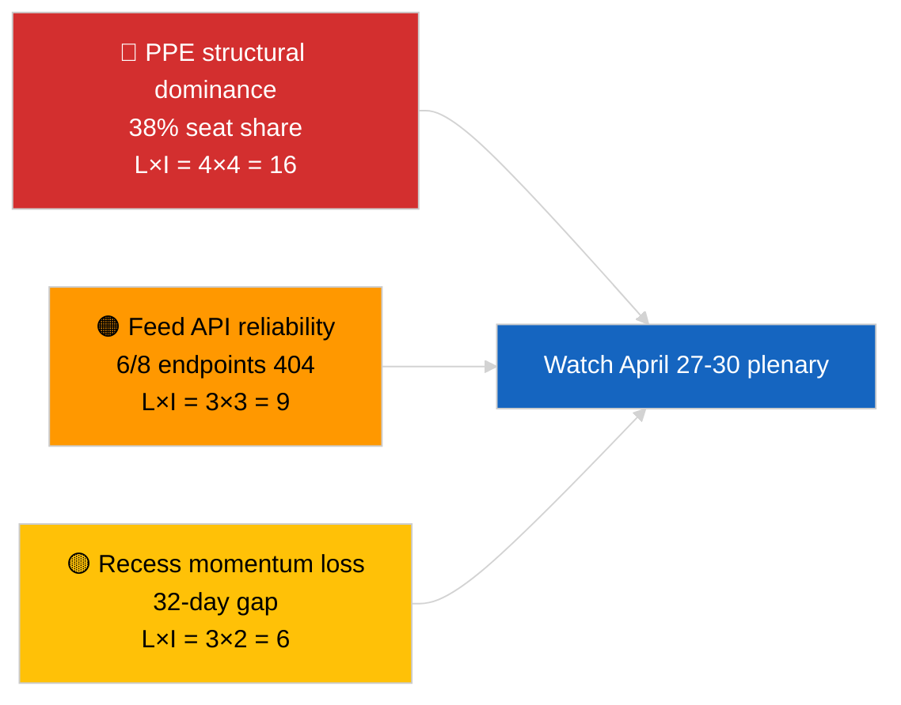

<!-- SPDX-FileCopyrightText: 2026 Hack23 AB -->
<!-- SPDX-License-Identifier: Apache-2.0 -->

# Executive Brief — Breaking News | 2026-04-01

**Classification:** OSINT | Public Parliamentary Record
**Confidence:** 🟢 High (recess-period assessment from primary EP feeds)
**Generated:** 2026-04-01T00:00:00Z (retrospective brief)
**Article Type:** Breaking News
**Source:** European Parliament Open Data Portal

---

## 🎯 BLUF

**No breaking news detected for 2026-04-01.** The European Parliament is in a 32-day inter-sessional recess (27 March → 26 April) between the Brussels mini-plenary (25-26 March) and the next Strasbourg plenary (27-30 April). Six adopted-text metadata updates appeared in today's feed but represent administrative refresh of pre-existing texts (TA-10-2025-0281/0283/0288/0290/0292; TA-10-2026-0044) — **none qualify as new legislative actions**. Stability score 84/100; coalition arithmetic unchanged. **🟢 HIGH confidence** that the inactivity is structural recess behaviour rather than data outage.

---

## 🧭 3 Decisions This Brief Supports

| # | Decision | Who Decides | Deadline | Evidence |
|:-:|----------|-------------|:--------:|----------|
| 1 | **Editorial:** publish recess-context article (analysis-only) | Editor | +24h | No tier-1 items in adopted-texts feed |
| 2 | **Monitoring:** re-test 6 failing feed endpoints next cycle | Data pipeline | +24h | 6/8 advisory feeds returned 404 |
| 3 | **Forward-watch:** flag April 27-30 Strasbourg agenda publication | Analysis lead | 2026-04-20 | Agenda typically released T-7 days |

---

## 📰 60-Second Read

- 🔴 **No tier-1 breaking items.** Recess period 27 March → 26 April; no plenary, no committee voting today. (🟢 High)
- 🟠 **6 adopted-text metadata updates** in today's feed — all 2025 texts plus TA-10-2026-0044; routine administrative refresh, no new adoptions. (🟢 High)
- 🟢 **Stability score 84/100** (early-warning system); 3 active warnings, MEDIUM aggregate risk; no anomalies in voting-anomaly detector. (🟢 High)
- 🟡 **Feed reliability concern:** `get_events_feed`, `get_procedures_feed`, `get_documents_feed`, `get_plenary_documents_feed`, `get_committee_documents_feed`, `get_parliamentary_questions_feed` all returned 404 — possible API maintenance during recess. (🟡 Medium)
- 🔵 **Economic context:** ECB Vice-President appointment (TA-10-2026-0060, 10 March) and US customs-tariff adjustment (TA-10-2026-0096, 26 March) remain the dominant economic baselines into April plenary. (🟢 High)
- 🟣 **Coalition arithmetic:** PPE 38% / S&D 22% / PfE 11% / Verts 10% / ECR 8% / Renew 5% / NI 4% / Left 2%. Grand Coalition (PPE+S&D = 60%) above 51% threshold. (🟢 High)
- 🩷 **Disruption vector:** dominant-group overreach by PPE flagged as HIGH structural risk by early-warning system; no acute trigger today. (🟡 Medium)
- ⚪ **Carry-forward:** EU-Mercosur ECJ referral (TA-10-2026-0008) opinion expected before April plenary; Georgia political-prisoners file (TA-10-2026-0083) awaits implementation reporting.

---

## 🗂️ Top Documents / Procedures Table

| Rank | EP reference | Title (short) | Significance | Confidence | Status |
|:----:|--------------|---------------|:------------:|:----------:|--------|
| 1 | TA-10-2026-0096 | US customs tariff adjustment (carry-over) | 6.5 | 🟢 HIGH | Adopted 26 March; April implementation watch |
| 2 | TA-10-2026-0060 | ECB Vice-President appointment | 6.0 | 🟢 HIGH | Adopted 10 March; institutional baseline |
| 3 | TA-10-2026-0084 | HDV emission credits 2025-2029 | 5.5 | 🟢 HIGH | Adopted 12 March; transposition watch |

> Rank reflects carry-over significance into April plenary; no new tier-1 items were adopted on 2026-04-01.

---

## ⚠️ Risk & Threat Snapshot

| Risk | L | I | Score | Trigger | Source | Admiralty |
|------|:-:|:-:|:-----:|---------|--------|:---------:|
| PPE structural dominance (38%) | 4 | 4 | 16 | Minority bloc defensive formation | `early_warning_system` HIGH warning | A2 |
| Feed API reliability (6/8 404) | 3 | 3 | 9 | Sustained 404s in next cycle | EP MCP feed probes | B2 |
| Recess momentum loss | 3 | 2 | 6 | Urgent files delayed past April plenary | Calendar gap analysis | A1 |
| External trade pressure (US tariff) | 3 | 4 | 12 | Retaliation announcement or emergency call | TA-10-2026-0096 follow-up | A1 |

---

## 🔮 Top Forward Trigger

**Strasbourg plenary 27-30 April 2026 — agenda publication T-7 (~20 April).**
A trade-heavy agenda (Scenario A, 55% probability) confirms PPE-S&D-Renew coordination on US customs follow-up and EU-Mercosur opinion; a rule-of-law focus (Scenario B, 25% probability) signals continued LIBE/Braun-precedent momentum; an economic/industrial focus (Scenario C, 20% probability) would foreground ECB annual report follow-up (TA-10-2026-0034).

---

## 🛡️ Source Quality Assessment

- **Primary sources:** EP Open Data Portal (`data.europarl.europa.eu`) adopted-texts feed (✅ 200, 6 items) and MEP feed (✅ 200, 737 items).
- **Data limitations:** 6 of 8 advisory feeds returned 404 — confidence in absence of events is therefore 🟡 medium, not 🟢 high, until next-cycle re-probe confirms structural recess vs. API outage.
- **Confidence on "no new adoptions":** 🟢 High — the adopted-texts feed itself returned 200 with only metadata-refresh entries.
- **Confidence on broader EP activity inference:** 🟡 Medium — events/procedures/documents/questions feeds unavailable for cross-check.

---

## 📎 Links

| Link | Path |
|------|------|
| Article | `./article.md` |
| Breaking intelligence brief | `./breaking-intelligence-brief.analysis.md` |
| Political landscape analysis | `./political-landscape.analysis.md` |
| Manifest | `./manifest.json` |
| Article metadata | `./article-meta.json` |

---

## 🔄 Cross-Reference to Prior Run

**Prior run:** 2026-03-26 breaking (last Brussels mini-plenary) adopted TA-10-2026-0088 (Braun immunity waiver) and TA-10-2026-0096 (US tariff adjustment). Today's run is the first of the post-March recess; no new adoptions, no agenda items, no votes — consistent with EP10 historical recess pattern.

**Delta:** Stability score 84/100 unchanged; PPE-dominance warning unchanged; coalition arithmetic unchanged. The only delta is the 6-item metadata refresh, which is operationally non-significant.

---

**Document Control**
- **Template:** `/analysis/templates/executive-brief.md`
- **Artifact path:** `analysis/daily/2026-04-01/breaking/executive-brief.md`
- **Classification:** Public
- **Retrospective generation:** This brief was produced in a back-fill session for runs that pre-date the Stage-B executive-brief artifact requirement. All claims trace to `./article.md` and the EP Open Data Portal feeds it cites.
