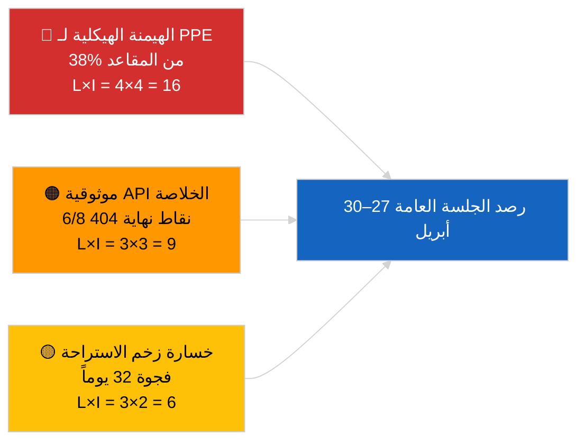

<!-- SPDX-FileCopyrightText: 2026 Hack23 AB -->
<!-- SPDX-License-Identifier: Apache-2.0 -->

# ملخص تنفيذي — آخر الأخبار | 2026-04-01

**التصنيف:** OSINT | سجل برلماني عام
**مستوى الثقة:** 🟢 مرتفع (تقييم فترة الاستراحة من المصادر الأولية للبرلمان الأوروبي)
**تاريخ الإنشاء:** 2026-04-01T00:00:00Z (مذكرة استرجاعية)
**نوع المقال:** آخر الأخبار
**المصدر:** البوابة المفتوحة للبيانات التابعة للبرلمان الأوروبي

---

## 🎯 خلاصة الأمر (BLUF)

**لم يُرصد أي خبر عاجل بتاريخ 2026-04-01.** يمرّ البرلمان الأوروبي بفترة استراحة بين الدورتين مدتها 32 يوماً (27 مارس → 26 أبريل)، تمتدّ بين الجلسة العامة الصغيرة في بروكسل (25–26 مارس) والجلسة العامة القادمة في ستراسبورغ (27–30 أبريل). ظهرت ستة تحديثات لبيانات وصفية خاصة بالنصوص المُعتمدة في خلاصة اليوم، غير أنها تمثّل تحديثات إدارية لنصوص قائمة (TA-10-2025-0281/0283/0288/0290/0292؛ TA-10-2026-0044) — **لا يُعدّ أيٌّ منها إجراءً تشريعياً جديداً**. درجة الاستقرار 84/100؛ الحسابات الائتلافية دون تغيير. **🟢 ثقة عالية** بأن الجمود يعكس سلوكاً هيكلياً مرتبطاً بفترة الاستراحة لا انقطاعاً في البيانات.

---

## 🧭 3 قرارات تدعمها هذه المذكرة

| # | القرار | صاحب القرار | الموعد | الدليل |
|:-:|--------|------------|:------:|--------|
| 1 | **تحريري:** نشر مقال سياق الاستراحة (مبني على التحليل) | رئيس التحرير | +24 ساعة | لا توجد إدخالات من المستوى 1 في خلاصة النصوص المُعتمدة |
| 2 | **مراقبة:** إعادة اختبار 6 نقاط نهاية للخلاصة الفاشلة في الدورة القادمة | مسار البيانات | +24 ساعة | أعادت 6/8 خلاصات استشارية استجابة خطأ 404 |
| 3 | **استشرافي:** الإشارة إلى نشر جدول أعمال ستراسبورغ 27–30 أبريل | مسؤول التحليل | 2026-04-20 | يُنشر جدول الأعمال عادةً قبل 7 أيام من الحدث |

---

## 📰 القراءة السريعة (60 ثانية)

- 🔴 **لا أحداث عاجلة من المستوى 1.** فترة الاستراحة من 27 مارس إلى 26 أبريل؛ لا جلسة عامة ولا تصويت لجنة اليوم. (🟢 مرتفع)
- 🟠 **6 تحديثات لبيانات وصفية** في خلاصة اليوم — جميعها نصوص 2025 بالإضافة إلى TA-10-2026-0044؛ تحديث إداري روتيني، بلا اعتمادات جديدة. (🟢 مرتفع)
- 🟢 **درجة الاستقرار 84/100** (نظام الإنذار المبكر)؛ 3 تحذيرات نشطة، مستوى متوسط للمخاطر الإجمالية؛ لا شذوذات في كاشف الشذوذات التصويتية. (🟢 مرتفع)
- 🟡 **قلق بشأن موثوقية الخلاصة:** أعادت كلٌّ من `get_events_feed` و`get_procedures_feed` و`get_documents_feed` و`get_plenary_documents_feed` و`get_committee_documents_feed` و`get_parliamentary_questions_feed` استجابة 404 — يُرجَّح أن ذلك صيانة لواجهة برمجية أثناء فترة الاستراحة. (🟡 متوسط)
- 🔵 **السياق الاقتصادي:** تعيين نائب رئيس البنك المركزي الأوروبي (TA-10-2026-0060، 10 مارس) وتعديل التعريفات الأمريكية (TA-10-2026-0096، 26 مارس) يظلّان الخطَّين الاقتصاديَّين الرئيسيَّين المُحمَلَين إلى جلسة أبريل العامة. (🟢 مرتفع)
- 🟣 **الحسابات الائتلافية:** مجموعة الشعب الأوروبي PPE 38% / S&D 22% / PfE 11% / Verts 10% / ECR 8% / Renew 5% / NI 4% / اليسار 2%. الائتلاف الكبير (PPE+S&D = 60%) فوق عتبة 51%. (🟢 مرتفع)
- 🩷 **متجه التعطيل:** جرى تصنيف سيطرة مجموعة PPE المهيمنة مخاطرةً هيكلية عالية من قِبَل نظام الإنذار المبكر؛ لا محفّز حادّ اليوم. (🟡 متوسط)
- ⚪ **مُحمَل مُرحَّل:** رأي EUD للمفوضية الأوروبية-ميركوسور (TA-10-2026-0008) متوقَّع قبل جلسة أبريل؛ ملف المعتقلين السياسيين الجورجيين (TA-10-2026-0083) ينتظر تقرير التنفيذ.

---

## 🗂️ جدول الوثائق/الإجراءات الأبرز

| الترتيب | مرجع البرلمان | العنوان (مختصر) | الأهمية | الثقة | الحالة |
|:-------:|--------------|----------------|:-------:|:-----:|--------|
| 1 | TA-10-2026-0096 | تعديل التعريفات الأمريكية (مُرحَّل) | 6.5 | 🟢 HIGH | مُعتمَد 26 مارس؛ متابعة تنفيذ أبريل |
| 2 | TA-10-2026-0060 | تعيين نائب رئيس البنك المركزي الأوروبي | 6.0 | 🟢 HIGH | مُعتمَد 10 مارس؛ خط أساسي مؤسسي |
| 3 | TA-10-2026-0084 | أرصدة انبعاثات المركبات الثقيلة 2025–2029 | 5.5 | 🟢 HIGH | مُعتمَد 12 مارس؛ متابعة النقل القانوني |

> يعكس الترتيب أهمية الملفات المُرحَّلة نحو جلسة أبريل؛ لم تُعتمَد أي إدخالات جديدة من المستوى 1 في 2026-04-01.

---

## ⚠️ لمحة عن المخاطر والتهديدات

| الخطر | L | I | الدرجة | المحفّز | المصدر | الأدميرالية |
|-------|:-:|:-:|:------:|--------|-------|:-----------:|
| الهيمنة الهيكلية لـ PPE (38%) | 4 | 4 | 16 | التشكّل الدفاعي للكتل الأقلية | تحذير عالٍ من `early_warning_system` | A2 |
| موثوقية API الخلاصة (6/8 نقاط 404) | 3 | 3 | 9 | استمرار أخطاء 404 في الدورة التالية | مسح EP MCP للخلاصة | B2 |
| خسارة زخم الاستراحة | 3 | 2 | 6 | تأخر الملفات العاجلة بعد جلسة أبريل | تحليل التقويم | A1 |
| الضغط التجاري الخارجي (التعريفات الأمريكية) | 3 | 4 | 12 | إعلان إجراءات انتقامية أو اجتماع طارئ | متابعة TA-10-2026-0096 | A1 |

---

## 🔮 المحفّز الاستشرافي الأبرز

**الجلسة العامة في ستراسبورغ 27–30 أبريل 2026 — نشر جدول الأعمال قبل 7 أيام (~20 أبريل).**
جدول أعمال تجاري الطابع (السيناريو A، احتمال 55%) يؤكد تنسيق PPE-S&D-Renew حول متابعة التعريفات الأمريكية ورأي EU-Mercosur؛ تركيز على سيادة القانون (السيناريو B، 25%) يُشير إلى استمرار زخم سابقة LIBE/Braun؛ تركيز اقتصادي/صناعي (السيناريو C، 20%) سيُبرز متابعة التقرير السنوي للبنك المركزي الأوروبي (TA-10-2026-0034).

---

## 🛡️ تقييم جودة المصادر

- **المصادر الأولية:** البوابة المفتوحة للبيانات التابعة للبرلمان الأوروبي (`data.europarl.europa.eu`) خلاصة النصوص المُعتمدة (✅ 200، 6 إدخالات) وخلاصة أعضاء البرلمان الأوروبي (✅ 200، 737 إدخالاً).
- **قيود البيانات:** أعادت 6 من أصل 8 خلاصات استشارية الخطأ 404 — لذا فإن مستوى الثقة في غياب الأحداث 🟡 متوسط وليس 🟢 مرتفعاً، حتى تُؤكد الدورة القادمة ما إذا كان الأمر استراحة هيكلية أم انقطاعاً في الواجهة البرمجية.
- **الثقة في "لا اعتمادات جديدة":** 🟢 مرتفع — أعادت الخلاصة استجابة 200 مع إدخالات تحديث بيانات وصفية فقط.
- **الثقة في استنتاجات نشاط البرلمان الأوروبي الأشمل:** 🟡 متوسط — خلاصات الأحداث/الإجراءات/الوثائق/الأسئلة غير متاحة للتحقق المتقاطع.

---

## 📎 الروابط

| الرابط | المسار |
|--------|--------|
| المقال | `./article.md` |
| ملخص استخباراتي لآخر الأخبار | `./breaking-intelligence-brief.analysis.md` |
| تحليل المشهد السياسي | `./political-landscape.analysis.md` |
| البيان | `./manifest.json` |
| بيانات تعريفية للمقال | `./article-meta.json` |

---

## 🔄 الإحالة المرجعية إلى التشغيل السابق

**التشغيل السابق:** أعتمدت آخر الأخبار بتاريخ 2026-03-26 (آخر الجلسات العامة الصغيرة في بروكسل) كلاً من TA-10-2026-0088 (رفع الحصانة عن براون) وTA-10-2026-0096 (تعديل التعريفات الأمريكية). التشغيل الحالي هو الأول بعد استراحة مارس؛ لا اعتمادات جديدة، لا بنود جدول أعمال، لا تصويتات — يتسق ذلك مع الأنماط التاريخية لفترات الاستراحة في الدورة العاشرة للبرلمان الأوروبي.

**الفارق:** درجة الاستقرار 84/100 دون تغيير؛ تحذير هيمنة PPE دون تغيير؛ الحسابات الائتلافية دون تغيير. الفارق الوحيد هو تحديث البيانات الوصفية لـ 6 إدخالات، وهو أمر عملياً لا قيمة له.

---

**ضبط الوثيقة**
- **القالب:** `/analysis/templates/executive-brief.md`
- **مسار المُخرَج:** `analysis/daily/2026-04-01/breaking/executive-brief.md`
- **التصنيف:** عام
- **الإنشاء الاسترجاعي:** أُنتجت هذه المذكرة في جلسة تعبئة استرجاعية لتشغيلات سابقة لمتطلب المُخرَج التنفيذي للمرحلة Stage-B. تُتتبَّع جميع التأكيدات الواردة فيها إلى `./article.md` وخلاصات البوابة المفتوحة للبيانات التابعة للبرلمان الأوروبي التي يستشهد بها.
