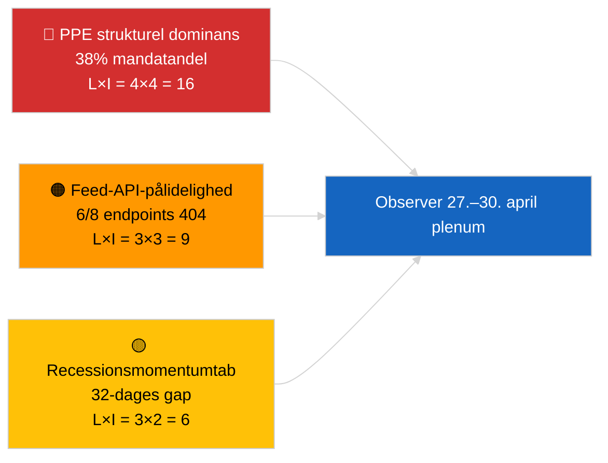

<!-- SPDX-FileCopyrightText: 2026 Hack23 AB -->
<!-- SPDX-License-Identifier: Apache-2.0 -->

# Ledelsesoversigt — Seneste nyt | 2026-04-01

**Klassificering:** OSINT | Offentlig parlamentarisk protokol
**Konfidens:** 🟢 Høj (recessionsvurdering fra primære EP-feeds)
**Genereret:** 2026-04-01T00:00:00Z (retrospektivt resumé)
**Artikeltype:** Seneste nyt
**Kilde:** Europa-Parlamentets åbne dataportal

---

## 🎯 BLUF

**Ingen seneste nyheder er opdaget for 2026-04-01.** Europa-Parlamentet er i en 32-dages intersessionel recess (27. marts → 26. april) mellem mini-plenarmødet i Bruxelles (25.–26. marts) og næste plenarmøde i Strasbourg (27.–30. april). Seks opdateringer af vedtaget-tekst-metadata dukkede op i dagens feed, men repræsenterer administrativ opdatering af eksisterende tekster (TA-10-2025-0281/0283/0288/0290/0292; TA-10-2026-0044) — **ingen kvalificerer sig som nye lovgivningsmæssige handlinger**. Stabilitetsscore 84/100; koalitionsaritmetik uændret. **🟢 HØJ konfidens** om, at inaktiviteten er strukturel recessionadfærd snarere end dataudfald.

---

## 🧭 3 Beslutninger dette resumé understøtter

| # | Beslutning | Hvem beslutter | Frist | Bevis |
|:-:|------------|---------------|:-----:|-------|
| 1 | **Redaktionelt:** publicér recessionsartikel (analysebaseret) | Redaktør | +24h | Ingen niveau-1-poster i vedtaget-tekster-feed |
| 2 | **Overvågning:** re-test 6 fejlslagne feed-endpoints næste cyklus | Datapipeline | +24h | 6/8 rådgivende feeds returnerede 404 |
| 3 | **Fremadrettet:** flag publikation af dagsorden for Strasbourg 27.–30. april | Analysechef | 2026-04-20 | Dagsorden udsendes typisk T-7 dage |

---

## 📰 60-Second Read

- 🔴 **Ingen niveau-1-seneste begivenheder.** Recessionperiode 27. marts → 26. april; ingen plenarsession, ingen udvalgsafstemning i dag. (🟢 Høj)
- 🟠 **6 opdateringer af vedtaget-tekst-metadata** i dagens feed — alle 2025-tekster plus TA-10-2026-0044; rutinemæssig administrativ opdatering, ingen nye vedtagelser. (🟢 Høj)
- 🟢 **Stabilitetsscore 84/100** (tidlig advarselsystem); 3 aktive advarsler, MEDIUM samlet risiko; ingen anomalier i afstemningsanomalidetektor. (🟢 Høj)
- 🟡 **Feed-pålidelighed bekymring:** `get_events_feed`, `get_procedures_feed`, `get_documents_feed`, `get_plenary_documents_feed`, `get_committee_documents_feed`, `get_parliamentary_questions_feed` returnerede alle 404 — mulig API-vedligeholdelse under recess. (🟡 Mellem)
- 🔵 **Økonomisk kontekst:** ECB-næstformandsudnævnelse (TA-10-2026-0060, 10. marts) og justering af amerikanske toldtariffer (TA-10-2026-0096, 26. marts) forbliver de dominerende økonomiske grundlinjer ind i april-plenarmødet. (🟢 Høj)
- 🟣 **Koalitionsaritmetik:** PPE 38% / S&D 22% / PfE 11% / Verts 10% / ECR 8% / Renew 5% / NI 4% / Left 2%. Storkoalition (PPE+S&D = 60%) over 51%-tærsklen. (🟢 Høj)
- 🩷 **Forstyrrelsesvektor:** PPE-dominerende gruppes overtagelse flagget som HØJ strukturel risiko af det tidlige advarselsystem; ingen akut trigger i dag. (🟡 Mellem)
- ⚪ **Carry-forward:** EU–Mercosur EUD-udtalelse (TA-10-2026-0008) forventet før april-plenarmødet; Georgiens politiske fanger-fil (TA-10-2026-0083) afventer gennemførelsesrapportering.

---

## 🗂️ Top Dokumenter / Proceduretabel

| Rang | EP-reference | Titel (kort) | Signifikans | Konfidens | Status |
|:----:|--------------|-------------|:-----------:|:---------:|--------|
| 1 | TA-10-2026-0096 | Justering af amerikanske toldtariffer (carry-over) | 6.5 | 🟢 HIGH | Vedtaget 26. marts; april-implementeringsovervågning |
| 2 | TA-10-2026-0060 | ECB næstformandsudnævnelse | 6.0 | 🟢 HIGH | Vedtaget 10. marts; institutionel grundlinje |
| 3 | TA-10-2026-0084 | HDV emissionskreditter 2025–2029 | 5.5 | 🟢 HIGH | Vedtaget 12. marts; transpositionsovervågning |

> Rang afspejler carry-over-signifikans ind i april-plenarmødet; ingen nye niveau-1-poster blev vedtaget den 2026-04-01.

---

## ⚠️ Risiko- og trusselbillede

| Risiko | L | I | Score | Trigger | Kilde | Admiralitet |
|--------|:-:|:-:|:-----:|---------|------|:-----------:|
| PPE strukturel dominans (38%) | 4 | 4 | 16 | Defensiv formation af minoritetsblok | `early_warning_system` HØJ advarsel | A2 |
| Feed-API-pålidelighed (6/8 404) | 3 | 3 | 9 | Vedvarende 404'er næste cyklus | EP MCP feed-prober | B2 |
| Recessionsmomentumtab | 3 | 2 | 6 | Hastende filer forsinket efter april-plenum | Kalenderanalyse | A1 |
| Eksternt handelspres (amerikanske toldsatser) | 3 | 4 | 12 | Gengældelseserklæring eller nødkald | TA-10-2026-0096 opfølgning | A1 |

---

## 🔮 Top Fremadrettet Trigger

**Strasbourg plenarmøde 27.–30. april 2026 — dagsordenspublicering T-7 (~20. april).**
En handelstung dagsorden (Scenarie A, 55% sandsynlighed) bekræfter PPE-S&D-Renew-koordination om opfølgning på amerikanske toldtariffer og EU-Mercosur-udtalelse; et retsstats-fokus (Scenarie B, 25% sandsynlighed) signalerer fortsat LIBE/Braun-præjudikatmomentum; et økonomisk/industrielt fokus (Scenarie C, 20% sandsynlighed) vil fremhæve ECB årsredegørelsesopfølgning (TA-10-2026-0034).

---

## 🛡️ Kildekvali tetsvurdering

- **Primære kilder:** EP's åbne dataportal (`data.europarl.europa.eu`) vedtaget-tekster-feed (✅ 200, 6 poster) og MEP-feed (✅ 200, 737 poster).
- **Databegrænsninger:** 6 af 8 rådgivende feeds returnerede 404 — konfidensen i fraværet af begivenheder er derfor 🟡 mellem, ikke 🟢 høj, indtil næste cyklus-re-probe bekræfter strukturel recess vs. API-udfald.
- **Konfidens om "ingen nye vedtagelser":** 🟢 Høj — vedtaget-tekster-feedet returnerede 200 med kun metadataopdateringsposter.
- **Konfidens om bredere EP-aktivitetsinferens:** 🟡 Mellem — hændelses-/procedurer-/dokumenter-/spørgsmåls-feeds utilgængelige til krydstjek.

---

## 📎 Links

| Link | Sti |
|------|-----|
| Artikel | `./article.md` |
| Seneste nyhedsefterretningsoversigt | `./breaking-intelligence-brief.analysis.md` |
| Analyse af politisk landskab | `./political-landscape.analysis.md` |
| Manifest | `./manifest.json` |
| Artikelmetadata | `./article-meta.json` |

---

## 🔄 Krydsreference til forrige kørsel

**Forrige kørsel:** 2026-03-26 seneste nyheder (sidst Brussels mini-plenum) vedtog TA-10-2026-0088 (Braun immunitetsophævelse) og TA-10-2026-0096 (justering af amerikanske toldtariffer). Dagens kørsel er den første efter marts-recessionen; ingen nye vedtagelser, ingen dagsordenpunkter, ingen afstemninger — konsekvent med EP10's historiske recessmønster.

**Delta:** Stabilitetsscore 84/100 uændret; PPE-dominansadvarsel uændret; koalitionsaritmetik uændret. Det eneste delta er den 6-post-metadata-opdatering, som er operationelt ubetydelig.

---

**Dokumentkontrol**
- **Skabelon:** `/analysis/templates/executive-brief.md`
- **Artefaktsti:** `analysis/daily/2026-04-01/breaking/executive-brief.md`
- **Klassificering:** Offentlig
- **Retrospektiv generering:** Dette resumé blev produceret i en bagfyldningssession for kørsler, der forudgår Stage-B executive-brief-artefaktkravet. Alle påstande spores til `./article.md` og de EP Open Data Portal-feeds, det citerer.
