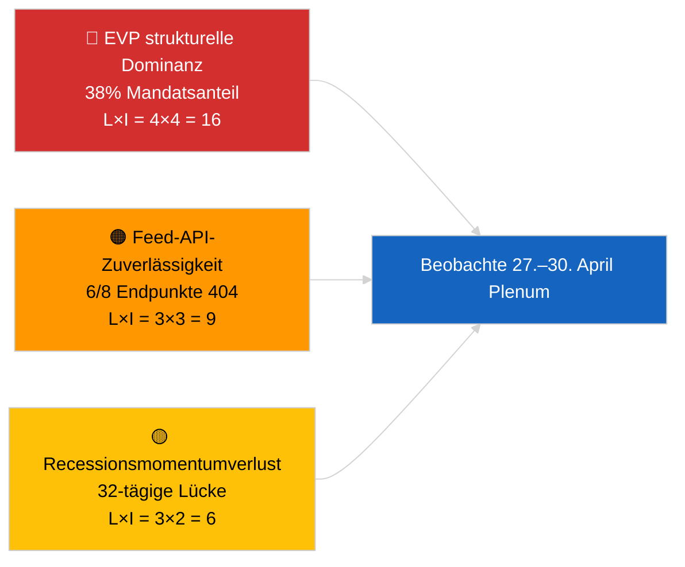

<!-- SPDX-FileCopyrightText: 2026 Hack23 AB -->
<!-- SPDX-License-Identifier: Apache-2.0 -->

# Führungszusammenfassung — Aktuelle Nachrichten | 2026-04-01

**Klassifizierung:** OSINT | Öffentliches parlamentarisches Protokoll
**Konfidenz:** 🟢 Hoch (Recessionseinschätzung aus primären EP-Feeds)
**Erstellt:** 2026-04-01T00:00:00Z (retrospektives Memo)
**Artikeltyp:** Aktuelle Nachrichten
**Quelle:** Offenes Datenportal des Europäischen Parlaments

---

## 🎯 BLUF

**Für den 2026-04-01 wurden keine aktuellen Nachrichten erkannt.** Das Europäische Parlament befindet sich in einer 32-tägigen intersessionellen Pause (27. März → 26. April) zwischen der Brüsseler Mini-Plenarsitzung (25.–26. März) und der nächsten Straßburger Plenarsitzung (27.–30. April). Sechs Metadatenaktualisierungen zu verabschiedeten Texten erschienen im heutigen Feed, stellen jedoch administrative Aktualisierungen bestehender Texte dar (TA-10-2025-0281/0283/0288/0290/0292; TA-10-2026-0044) — **keine davon qualifiziert sich als neue Gesetzgebungsmaßnahme**. Stabilitätsscore 84/100; Koalitionsarithmetik unverändert. **🟢 HOHE Konfidenz**, dass die Inaktivität strukturelles Recessionsverhalten widerspiegelt und kein Datenausfall ist.

---

## 🧭 3 Entscheidungen, die dieses Memo unterstützt

| # | Entscheidung | Entscheidungsträger | Frist | Beleg |
|:-:|--------------|--------------------:|:-----:|-------|
| 1 | **Redaktionell:** Recessionskontext-Artikel veröffentlichen (analysebasiert) | Chefredakteur | +24h | Keine Stufe-1-Einträge im Feed für verabschiedete Texte |
| 2 | **Überwachung:** 6 fehlgeschlagene Feed-Endpunkte im nächsten Zyklus erneut testen | Datenpipeline | +24h | 6/8 Beratungs-Feeds lieferten 404 |
| 3 | **Vorausschau:** Veröffentlichung der Tagesordnung für Straßburg 27.–30. April markieren | Analysebeauftragter | 2026-04-20 | Tagesordnung typischerweise T-7 Tage veröffentlicht |

---

## 📰 60-Sekunden-Lektüre

- 🔴 **Keine Stufe-1-Aktuell-Ereignisse.** Recessionsperiode 27. März → 26. April; heute keine Plenar- oder Ausschussabstimmung. (🟢 Hoch)
- 🟠 **6 Metadatenaktualisierungen für verabschiedete Texte** im heutigen Feed — alle 2025er Texte plus TA-10-2026-0044; routinemäßige administrative Aktualisierung, keine neuen Verabschiedungen. (🟢 Hoch)
- 🟢 **Stabilitätsscore 84/100** (Frühwarnsystem); 3 aktive Warnungen, MITTLERES Gesamtrisiko; keine Anomalien im Abstimmungsabweichungsdetektor. (🟢 Hoch)
- 🟡 **Bedenken zur Feed-Zuverlässigkeit:** `get_events_feed`, `get_procedures_feed`, `get_documents_feed`, `get_plenary_documents_feed`, `get_committee_documents_feed`, `get_parliamentary_questions_feed` lieferten alle 404 — mögliche API-Wartung während der Pause. (🟡 Mittel)
- 🔵 **Wirtschaftlicher Kontext:** Die Ernennung des EZB-Vizepräsidenten (TA-10-2026-0060, 10. März) und die Anpassung der US-Zölle (TA-10-2026-0096, 26. März) bleiben die dominierenden wirtschaftlichen Basislinien bis zur April-Plenarsitzung. (🟢 Hoch)
- 🟣 **Koalitionsarithmetik:** EVP 38% / S&D 22% / PfE 11% / Verts 10% / ECR 8% / Renew 5% / NI 4% / Left 2%. Große Koalition (EVP+S&D = 60%) über der 51%-Schwelle. (🟢 Hoch)
- 🩷 **Störungsvektor:** Übergriffe der dominierenden EVP-Gruppe als HOHES strukturelles Risiko durch das Frühwarnsystem gemeldet; kein akuter Auslöser heute. (🟡 Mittel)
- ⚪ **Übertrag:** EU–Mercosur EUD-Stellungnahme (TA-10-2026-0008) vor der April-Plenarsitzung erwartet; Georgische politische Gefangene-Akte (TA-10-2026-0083) wartet auf Durchführungsberichterstattung.

---

## 🗂️ Top Dokumente / Verfahrenstabelle

| Rang | EP-Referenz | Titel (kurz) | Signifikanz | Konfidenz | Status |
|:----:|-------------|-------------|:-----------:|:---------:|--------|
| 1 | TA-10-2026-0096 | US-Zollanpassung (Übertrag) | 6.5 | 🟢 HIGH | Verabschiedet 26. März; April-Umsetzungsüberwachung |
| 2 | TA-10-2026-0060 | EZB-Vizepräsidentenernennung | 6.0 | 🟢 HIGH | Verabschiedet 10. März; institutionelle Basislinie |
| 3 | TA-10-2026-0084 | Schwere Nutzfahrzeuge CO₂-Gutschriften 2025–2029 | 5.5 | 🟢 HIGH | Verabschiedet 12. März; Transpositionsüberwachung |

> Rang spiegelt den Übertragscharakter für die April-Plenarsitzung wider; keine neuen Stufe-1-Einträge wurden am 2026-04-01 verabschiedet.

---

## ⚠️ Risiko- und Bedrohungsübersicht

| Risiko | L | I | Score | Auslöser | Quelle | Admiralität |
|--------|:-:|:-:|:-----:|---------|-------|:-----------:|
| EVP strukturelle Dominanz (38%) | 4 | 4 | 16 | Defensive Formation der Minderheitsblöcke | `early_warning_system` HOHE Warnung | A2 |
| Feed-API-Zuverlässigkeit (6/8 404) | 3 | 3 | 9 | Anhaltende 404er im nächsten Zyklus | EP MCP Feed-Sondierungen | B2 |
| Recessionsmomentumverlust | 3 | 2 | 6 | Dringende Akten nach April-Plenum verzögert | Kalenderanalyse | A1 |
| Externer Handelsdruck (US-Zölle) | 3 | 4 | 12 | Vergeltungsankündigung oder Dringlichkeitssitzung | TA-10-2026-0096 Folgeaktion | A1 |

---

## 🔮 Wichtigster Vorausblickender Auslöser

**Straßburger Plenarsitzung 27.–30. April 2026 — Tagesordnungsveröffentlichung T-7 (~20. April).**
Eine handelslastige Tagesordnung (Szenario A, 55% Wahrscheinlichkeit) bestätigt EVP-S&D-Renew-Koordination zur US-Zoll-Folgeaktion und EU-Mercosur-Stellungnahme; ein Rechtsstaatsfokus (Szenario B, 25% Wahrscheinlichkeit) signalisiert fortgesetztes LIBE/Braun-Präzedenzmomentum; ein wirtschaftlicher/industrieller Fokus (Szenario C, 20% Wahrscheinlichkeit) würde die EZB-Jahresberichterstattungs-Folgeaktion (TA-10-2026-0034) hervorheben.

---

## 🛡️ Quellenqualitätsbewertung

- **Primäre Quellen:** Offenes Datenportal des EP (`data.europarl.europa.eu`) Feed für verabschiedete Texte (✅ 200, 6 Einträge) und MEP-Feed (✅ 200, 737 Einträge).
- **Datenbeschränkungen:** 6 von 8 Beratungs-Feeds lieferten 404 — die Konfidenz für das Fehlen von Ereignissen ist daher 🟡 mittel, nicht 🟢 hoch, bis der nächste Zyklustest strukturelle Rezession vs. API-Ausfall bestätigt.
- **Konfidenz für „keine neuen Verabschiedungen":** 🟢 Hoch — Feed für verabschiedete Texte lieferte 200 mit nur Metadatenaktualisierungseinträgen.
- **Konfidenz für breitere EP-Aktivitätsinferenz:** 🟡 Mittel — Ereignis-/Verfahrens-/Dokumenten-/Fragen-Feeds für Kreuzreferenzierung nicht verfügbar.

---

## 📎 Links

| Link | Pfad |
|------|------|
| Artikel | `./article.md` |
| Aktuelle Nachrichten Geheimdienstübersicht | `./breaking-intelligence-brief.analysis.md` |
| Politische Landschaftsanalyse | `./political-landscape.analysis.md` |
| Manifest | `./manifest.json` |
| Artikelmetadaten | `./article-meta.json` |

---

## 🔄 Querverweise zur vorherigen Ausführung

**Vorherige Ausführung:** Aktuelle Nachrichten vom 2026-03-26 (letztes Brüsseler Mini-Plenum) verabschiedeten TA-10-2026-0088 (Braun Immunitätsaufhebung) und TA-10-2026-0096 (US-Zollanpassung). Die heutige Ausführung ist die erste nach der März-Pause; keine neuen Verabschiedungen, keine Tagesordnungspunkte, keine Abstimmungen — konsistent mit EP10s historischen Recessionsmustern.

**Delta:** Stabilitätsscore 84/100 unverändert; EVP-Dominanzwarnung unverändert; Koalitionsarithmetik unverändert. Das einzige Delta ist die 6-Eintrags-Metadatenaktualisierung, die operativ bedeutungslos ist.

---

**Dokumentenkontrolle**
- **Vorlage:** `/analysis/templates/executive-brief.md`
- **Artefaktpfad:** `analysis/daily/2026-04-01/breaking/executive-brief.md`
- **Klassifizierung:** Öffentlich
- **Retrospektive Erstellung:** Dieses Memo wurde in einer Nachfüllsitzung für Ausführungen erstellt, die dem Stage-B Executive-Brief-Artefaktanforderung vorausgehen. Alle Behauptungen werden auf `./article.md` und die darin zitierten EP Open Data Portal-Feeds zurückverfolgt.
