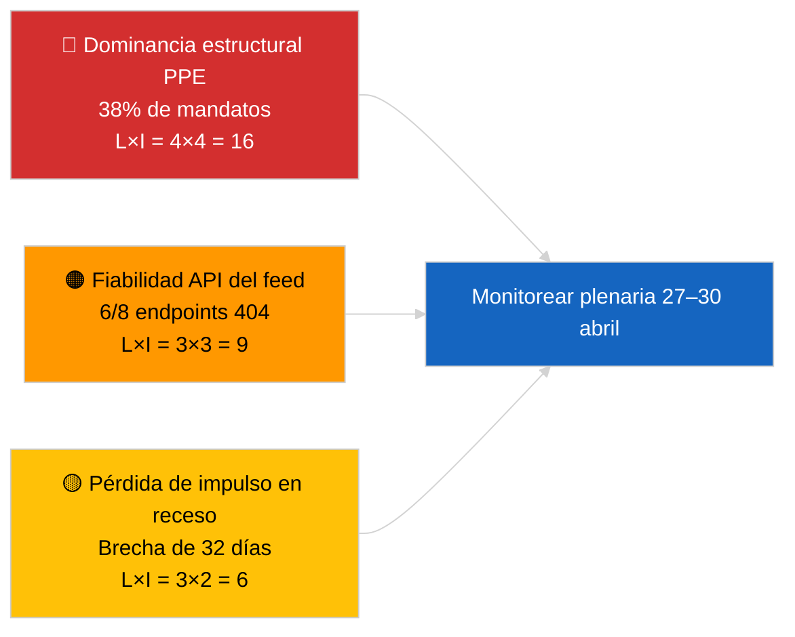

<!-- SPDX-FileCopyrightText: 2026 Hack23 AB -->
<!-- SPDX-License-Identifier: Apache-2.0 -->

# Resumen Ejecutivo — Últimas Noticias | 2026-04-01

**Clasificación:** OSINT | Registro parlamentario público
**Confianza:** 🟢 Alta (evaluación de período de receso de fuentes primarias del PE)
**Generado:** 2026-04-01T00:00:00Z (memo retrospectivo)
**Tipo de artículo:** Últimas noticias
**Fuente:** Portal de datos abiertos del Parlamento Europeo

---

## 🎯 BLUF

**No se detectaron últimas noticias para el 2026-04-01.** El Parlamento Europeo está en un receso intersesional de 32 días (27 de marzo → 26 de abril) entre la mini-plenaria de Bruselas (25–26 de marzo) y la próxima plenaria de Estrasburgo (27–30 de abril). Seis actualizaciones de metadatos de textos adoptados aparecieron en el feed de hoy, representando actualizaciones administrativas de textos existentes (TA-10-2025-0281/0283/0288/0290/0292; TA-10-2026-0044) — **ninguna califica como nuevo acto legislativo**. Puntuación de estabilidad 84/100; aritmética de coaliciones sin cambios. **🟢 ALTA confianza** de que la inactividad refleja comportamiento estructural de receso y no un corte de datos.

---

## 🧭 3 Decisiones que este memo apoya

| # | Decisión | Quién decide | Plazo | Evidencia |
|:-:|----------|-------------|:-----:|-----------|
| 1 | **Editorial:** publicar artículo de contexto de receso (basado en análisis) | Editor jefe | +24h | Sin entradas de nivel 1 en el feed de textos adoptados |
| 2 | **Monitoreo:** re-testear 6 endpoints de feed fallidos en el próximo ciclo | Pipeline de datos | +24h | 6/8 feeds consultivos devolvieron 404 |
| 3 | **Prospectivo:** marcar la publicación de la agenda de Estrasburgo 27–30 de abril | Responsable de análisis | 2026-04-20 | Agenda típicamente publicada T-7 días |

---

## 📰 Lectura de 60 Segundos

- 🔴 **No hay eventos de nivel 1.** Período de receso 27 de marzo → 26 de abril; sin sesión plenaria ni votación de comité hoy. (🟢 Alta)
- 🟠 **6 actualizaciones de metadatos de textos adoptados** en el feed de hoy — todos textos de 2025 más TA-10-2026-0044; actualización administrativa de rutina, sin nuevas adopciones. (🟢 Alta)
- 🟢 **Puntuación de estabilidad 84/100** (sistema de alerta temprana); 3 alertas activas, riesgo global MEDIO; sin anomalías en el detector de anomalías de votación. (🟢 Alta)
- 🟡 **Preocupación de fiabilidad del feed:** `get_events_feed`, `get_procedures_feed`, `get_documents_feed`, `get_plenary_documents_feed`, `get_committee_documents_feed`, `get_parliamentary_questions_feed` devolvieron 404 — posible mantenimiento de API durante el receso. (🟡 Medio)
- 🔵 **Contexto económico:** el nombramiento del vicepresidente del BCE (TA-10-2026-0060, 10 de marzo) y el ajuste de aranceles estadounidenses (TA-10-2026-0096, 26 de marzo) siguen siendo las referencias económicas dominantes hacia la plenaria de abril. (🟢 Alta)
- 🟣 **Aritmética de coaliciones:** PPE 38% / S&D 22% / PfE 11% / Verts 10% / ECR 8% / Renew 5% / NI 4% / Izquierda 2%. Gran coalición (PPE+S&D = 60%) por encima del umbral del 51%. (🟢 Alta)
- 🩷 **Vector de perturbación:** la captura del grupo dominante PPE marcada como riesgo estructural ALTO por el sistema de alerta temprana; sin desencadenante agudo hoy. (🟡 Medio)
- ⚪ **Carry-forward:** opinión EUD UE–Mercosur (TA-10-2026-0008) esperada antes de la plenaria de abril; expediente de presos políticos georgianos (TA-10-2026-0083) pendiente de informe de aplicación.

---

## 🗂️ Tabla de Principales Documentos / Procedimientos

| Rango | Referencia PE | Título (corto) | Relevancia | Confianza | Estado |
|:-----:|---------------|---------------|:----------:|:---------:|--------|
| 1 | TA-10-2026-0096 | Ajuste de aranceles EE.UU. (carry-over) | 6.5 | 🟢 HIGH | Adoptado el 26 de marzo; seguimiento de implementación abril |
| 2 | TA-10-2026-0060 | Nombramiento vicepresidente BCE | 6.0 | 🟢 HIGH | Adoptado el 10 de marzo; referencia institucional |
| 3 | TA-10-2026-0084 | Créditos de emisiones VPP 2025–2029 | 5.5 | 🟢 HIGH | Adoptado el 12 de marzo; seguimiento de transposición |

> El rango refleja la relevancia de carry-over hacia la plenaria de abril; no se adoptaron nuevos elementos de nivel 1 el 2026-04-01.

---

## ⚠️ Instantánea de Riesgos y Amenazas

| Riesgo | L | I | Puntuación | Desencadenante | Fuente | Almirantazgo |
|--------|:-:|:-:|:----------:|---------------|-------|:------------:|
| Dominancia estructural PPE (38%) | 4 | 4 | 16 | Formación defensiva de bloques minoritarios | `early_warning_system` alerta ALTA | A2 |
| Fiabilidad API del feed (6/8 404) | 3 | 3 | 9 | 404 persistentes en el próximo ciclo | Sondeos de feed MCP PE | B2 |
| Pérdida de impulso en receso | 3 | 2 | 6 | Expedientes urgentes retrasados tras la plenaria de abril | Análisis de calendario | A1 |
| Presión comercial externa (aranceles EE.UU.) | 3 | 4 | 12 | Anuncio de represalias o convocatoria de emergencia | TA-10-2026-0096 seguimiento | A1 |

---

## 🔮 Principal Desencadenante Prospectivo

**Plenaria de Estrasburgo 27–30 de abril de 2026 — publicación de agenda T-7 (~20 de abril).**
Una agenda de predominio comercial (Escenario A, 55% de probabilidad) confirma la coordinación PPE-S&D-Renew sobre el seguimiento de aranceles estadounidenses y la opinión UE-Mercosur; un enfoque en el Estado de derecho (Escenario B, 25% de probabilidad) señala la continuidad del precedente LIBE/Braun; un enfoque económico/industrial (Escenario C, 20% de probabilidad) destacaría el seguimiento del informe anual del BCE (TA-10-2026-0034).

---

## 🛡️ Evaluación de la Calidad de las Fuentes

- **Fuentes primarias:** Portal de datos abiertos del PE (`data.europarl.europa.eu`) feed de textos adoptados (✅ 200, 6 entradas) y feed MEP (✅ 200, 737 entradas).
- **Limitaciones de datos:** 6 de 8 feeds consultivos devolvieron 404 — la confianza en la ausencia de eventos es por tanto 🟡 media, no 🟢 alta, hasta que el próximo ciclo de sondeo confirme receso estructural frente a corte de API.
- **Confianza en "sin nuevas adopciones":** 🟢 Alta — el feed de textos adoptados devolvió 200 con solo entradas de actualización de metadatos.
- **Confianza en la inferencia de actividad más amplia del PE:** 🟡 Medio — feeds de eventos/procedimientos/documentos/preguntas no disponibles para verificación cruzada.

---

## 📎 Enlace

| Enlace | Ruta |
|--------|------|
| Artículo | `./article.md` |
| Resumen de inteligencia de últimas noticias | `./breaking-intelligence-brief.analysis.md` |
| Análisis del panorama político | `./political-landscape.analysis.md` |
| Manifiesto | `./manifest.json` |
| Metadatos del artículo | `./article-meta.json` |

---

## 🔄 Referencia Cruzada con la Ejecución Anterior

**Ejecución anterior:** las últimas noticias del 2026-03-26 (última mini-plenaria de Bruselas) adoptaron TA-10-2026-0088 (levantamiento de inmunidad de Braun) y TA-10-2026-0096 (ajuste de aranceles EE.UU.). La ejecución de hoy es la primera tras el receso de marzo; sin nuevas adopciones, sin puntos de agenda, sin votaciones — coherente con los patrones históricos de receso de EP10.

**Delta:** Puntuación de estabilidad 84/100 sin cambios; alerta de dominancia PPE sin cambios; aritmética de coaliciones sin cambios. El único delta es la actualización de metadatos de 6 entradas, que es operativamente insignificante.

---

**Control del Documento**
- **Plantilla:** `/analysis/templates/executive-brief.md`
- **Ruta del artefacto:** `analysis/daily/2026-04-01/breaking/executive-brief.md`
- **Clasificación:** Público
- **Generación retrospectiva:** Este memo se produjo en una sesión de relleno retroactivo para ejecuciones anteriores al requisito de artefacto Stage-B executive-brief. Todas las afirmaciones se rastrean a `./article.md` y los feeds del portal de datos abiertos del PE que cita.
