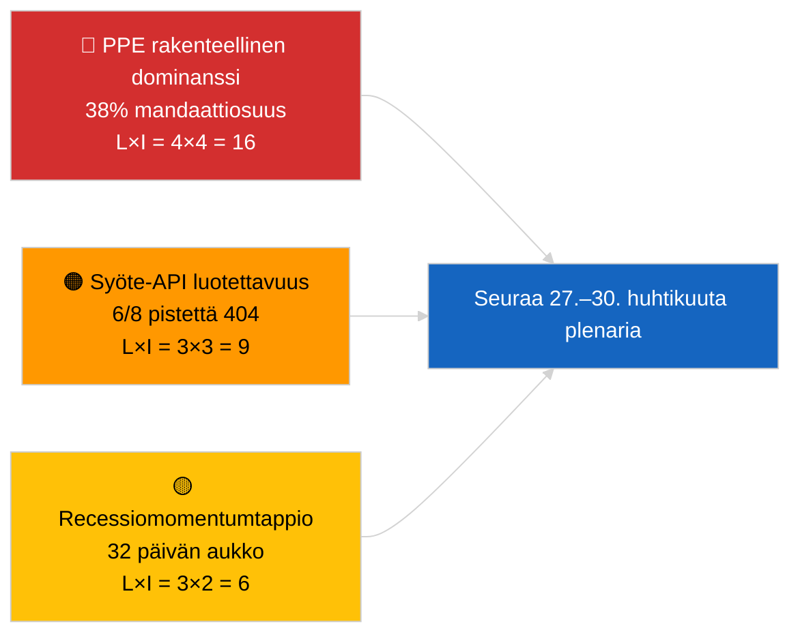

<!-- SPDX-FileCopyrightText: 2026 Hack23 AB -->
<!-- SPDX-License-Identifier: Apache-2.0 -->

# Johtotiivistelmä — Tuoreimmat uutiset | 2026-04-01

**Luokittelu:** OSINT | Julkinen parlamentaarinen pöytäkirja
**Luotettavuus:** 🟢 Korkea (recessioarviointi ensisijaisista EP-syötteistä)
**Luotu:** 2026-04-01T00:00:00Z (takautuva muistio)
**Artikkelityyppi:** Tuoreimmat uutiset
**Lähde:** Euroopan parlamentin avoin dataportti

---

## 🎯 BLUF

**Tuoreimpia uutisia ei löydetty 2026-04-01.** Euroopan parlamentti on 32 päivän istuntojen välisessä recessiossa (27. maaliskuuta → 26. huhtikuuta) Bryssel-miniplenaarkokouksen (25.–26. maaliskuuta) ja seuraavan Strasbourg-plenaarkokouksen (27.–30. huhtikuuta) välillä. Kuusi hyväksytyn tekstin metatietojen päivitystä ilmestyi tämän päivän syötteessä, mutta ne edustavat olemassa olevien tekstien hallinnollisia päivityksiä (TA-10-2025-0281/0283/0288/0290/0292; TA-10-2026-0044) — **yksikään ei täytä uuden lainsäädäntötoimen kriteereitä**. Vakauspistemäärä 84/100; koalitioaritmetiikka muuttumaton. **🟢 KORKEA luotettavuus** siitä, että toimettomuus heijastaa rakenteellista recessiokäyttäytymistä eikä tietokatkosta.

---

## 🧭 3 Päätöstä, joita tämä muistio tukee

| # | Päätös | Kuka päättää | Määräaika | Todisteet |
|:-:|--------|-------------|:---------:|-----------|
| 1 | **Toimituksellinen:** julkaise recessiokonteksti-artikkeli (analyysilähtöinen) | Toimittaja | +24h | Ei tason-1-merkintöjä hyväksyttyjen tekstien syötteessä |
| 2 | **Seuranta:** testaa uudelleen 6 epäonnistunutta syötepistettä seuraavalla syklillä | Datapipeline | +24h | 6/8 neuvoa-antavaa syötettä palautti 404 |
| 3 | **Eteenpäin katsova:** merkitse Strasbourgin esityslistan julkaisu 27.–30. huhtikuuta | Analyysipäällikkö | 2026-04-20 | Esityslista julkaistaan tyypillisesti T-7 päivää |

---

## 📰 60-Second Read

- 🔴 **Ei tason-1-tuoreimpia tapahtumia.** Recessiojakso 27. maaliskuuta → 26. huhtikuuta; ei plenaaristuntoa, ei valiokuntaäänestystä tänään. (🟢 Korkea)
- 🟠 **6 hyväksytyn tekstin metatietopäivitystä** tämän päivän syötteessä — kaikki vuoden 2025 tekstit sekä TA-10-2026-0044; rutiininomainen hallinnollinen päivitys, ei uusia hyväksymisiä. (🟢 Korkea)
- 🟢 **Vakauspistemäärä 84/100** (varhainen varoitusjärjestelmä); 3 aktiivista varoitusta, KESKITASO kokonaisriski; ei poikkeamia äänestyspoikkeamatunnistimessa. (🟢 Korkea)
- 🟡 **Syötteen luotettavuusongelma:** `get_events_feed`, `get_procedures_feed`, `get_documents_feed`, `get_plenary_documents_feed`, `get_committee_documents_feed`, `get_parliamentary_questions_feed` palauttivat kaikki 404 — mahdollinen API-huolto recessioaikana. (🟡 Keskitaso)
- 🔵 **Taloudellinen konteksti:** EKP:n varapuheenjohtajan nimitys (TA-10-2026-0060, 10. maaliskuuta) ja Yhdysvaltain tullimaksujen muutos (TA-10-2026-0096, 26. maaliskuuta) pysyvät huhtikuun plenaarkokoukseen siirtyvinä taloudellisina peruslinjoina. (🟢 Korkea)
- 🟣 **Koalitioaritmetiikka:** PPE 38% / S&D 22% / PfE 11% / Verts 10% / ECR 8% / Renew 5% / NI 4% / Left 2%. Suurkoalitio (PPE+S&D = 60%) yli 51% kynnyksen. (🟢 Korkea)
- 🩷 **Häiriövektori:** PPE:n hallitsevan ryhmän haltuunotto merkitty KORKEAN rakenteellisen riskin kohteeksi varhaisen varoitusjärjestelmän toimesta; ei akuuttia laukaisijaa tänään. (🟡 Keskitaso)
- ⚪ **Carry-forward:** EU–Mercosur EUD-delegaation (TA-10-2026-0008) lausunto odotetaan ennen huhtikuun plenaarkokousta; Georgian poliittisten vankien tiedosto (TA-10-2026-0083) odottaa täytäntöönpanoraportointia.

---

## 🗂️ Tärkeimmät Asiakirjat / Menettely-taulukko

| Sija | EP-viite | Otsikko (lyhyt) | Merkitys | Luotettavuus | Tila |
|:----:|----------|----------------|:--------:|:------------:|------|
| 1 | TA-10-2026-0096 | Yhdysvaltain tullimaksujen muutos (carry-over) | 6.5 | 🟢 HIGH | Hyväksytty 26. maaliskuuta; huhtikuun täytäntöönpanoseuranta |
| 2 | TA-10-2026-0060 | EKP varapuheenjohtajan nimitys | 6.0 | 🟢 HIGH | Hyväksytty 10. maaliskuuta; institutionaalinen perusta |
| 3 | TA-10-2026-0084 | HDV päästöluotot 2025–2029 | 5.5 | 🟢 HIGH | Hyväksytty 12. maaliskuuta; transsopimusseuranta |

> Sija heijastaa carry-over-merkitystä huhtikuun plenaarkokoukseen; yhtään uutta tason-1-kohdetta ei hyväksytty 2026-04-01.

---

## ⚠️ Riski- ja uhkatilannekuva

| Riski | L | I | Pisteet | Laukaisija | Lähde | Amiraliteetti |
|-------|:-:|:-:|:-------:|-----------|------|:-------------:|
| PPE rakenteellinen dominanssi (38%) | 4 | 4 | 16 | Vähemmistöblokin puolustava muodostus | `early_warning_system` KORKEA varoitus | A2 |
| Syöte-API luotettavuus (6/8 404) | 3 | 3 | 9 | Jatkuvat 404:t seuraavalla syklillä | EP MCP syötesondit | B2 |
| Recessiomomentumtappio | 3 | 2 | 6 | Kiireelliset tiedostot viivästyvät huhtikuun plenaarkokouksen jälkeen | Kalenterianalyysi | A1 |
| Ulkoinen kauppapaine (Yhdysvaltain tullimaksut) | 3 | 4 | 12 | Vastatoimien ilmoitus tai hätäkokous | TA-10-2026-0096 jatko | A1 |

---

## 🔮 Tärkein Eteenpäin Katsova Laukaisija

**Strasbourgin plenaarikokous 27.–30. huhtikuuta 2026 — esityslistan julkaisu T-7 (~20. huhtikuuta).**
Kauppapainotteinen esityslista (Skenaario A, 55% todennäköisyys) vahvistaa PPE-S&D-Renew-koordinaation Yhdysvaltain tullien jatkoseurannasta ja EU-Mercosur-lausunnosta; oikeusvaltion focus (Skenaario B, 25% todennäköisyys) viestii jatkuvasta LIBE/Braun-ennakkotapausmomentumista; taloudellinen/teollinen focus (Skenaario C, 20% todennäköisyys) nostaisi esiin EKP:n vuosikertomuksen jatkoseurannan (TA-10-2026-0034).

---

## 🛡️ Lähteen Laadun Arviointi

- **Ensisijaiset lähteet:** EP:n avoin dataportti (`data.europarl.europa.eu`) hyväksyttyjen tekstien syöte (✅ 200, 6 merkintää) ja MEP-syöte (✅ 200, 737 merkintää).
- **Tietorajoitukset:** 6/8 neuvoa-antavaa syötettä palautti 404 — tapahtumien puuttumisen luotettavuus on siksi 🟡 keskitaso, ei 🟢 korkea, kunnes seuraavan syklin uudelleensonti vahvistaa rakenteellisen recess vs. API-katkon.
- **Luotettavuus "ei uusia hyväksymisiä" -väitteelle:** 🟢 Korkea — hyväksyttyjen tekstien syöte palautti 200 vain metatietopäivitysmerkinnöillä.
- **Luotettavuus laajemman EP-toiminnan päättelylle:** 🟡 Keskitaso — tapahtuma-/menettely-/asiakirja-/kysymyssyötteet eivät ole käytettävissä ristiintarkistukseen.

---

## 📎 Linkit

| Linkki | Polku |
|--------|-------|
| Artikkeli | `./article.md` |
| Tuoreimpien uutisten tiedustelutiivistelmä | `./breaking-intelligence-brief.analysis.md` |
| Poliittisen maiseman analyysi | `./political-landscape.analysis.md` |
| Manifesti | `./manifest.json` |
| Artikkelin metatiedot | `./article-meta.json` |

---

## 🔄 Ristiviite edelliseen suoritukseen

**Edellinen suoritus:** 2026-03-26 tuoreimmat uutiset (viimeinen Bryssel-miniplenum) hyväksyi TA-10-2026-0088 (Braun immuniteetin poistaminen) ja TA-10-2026-0096 (Yhdysvaltain tullimaksujen muutos). Tämän päivän suoritus on ensimmäinen maaliskuun recessioin jälkeen; ei uusia hyväksymisiä, ei esityslistan kohtia, ei äänestyksiä — johdonmukainen EP10:n historiallisten recessiomallien kanssa.

**Delta:** Vakauspistemäärä 84/100 muuttumaton; PPE-dominanssivaroitus muuttumaton; koalitioaritmetiikka muuttumaton. Ainoa delta on 6 merkinnän metatietopäivitys, joka on operatiivisesti merkityksetön.

---

**Asiakirjahallinta**
- **Malli:** `/analysis/templates/executive-brief.md`
- **Artefaktipolku:** `analysis/daily/2026-04-01/breaking/executive-brief.md`
- **Luokittelu:** Julkinen
- **Takautuva luonti:** Tämä muistio tuotettiin takautuvassa täydennysistunnossa suorituksille, jotka edelsi Stage-B executive-brief-artefaktivaatimusta. Kaikki väitteet jäljitetään `./article.md`-tiedostoon ja siinä mainituille EP Open Data Portal -syötteille.
