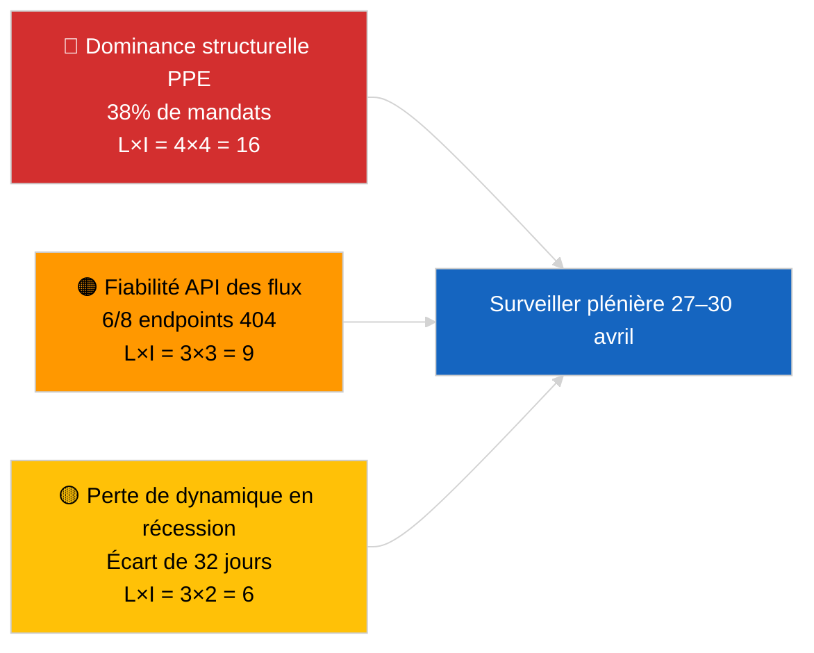

<!-- SPDX-FileCopyrightText: 2026 Hack23 AB -->
<!-- SPDX-License-Identifier: Apache-2.0 -->

# Résumé Exécutif — Dernières Nouvelles | 2026-04-01

**Classification :** OSINT | Protocole parlementaire public
**Niveau de confiance :** 🟢 Élevé (évaluation de la période de récession à partir des flux EP primaires)
**Généré :** 2026-04-01T00:00:00Z (mémo rétrospectif)
**Type d'article :** Dernières nouvelles
**Source :** Portail de données ouvertes du Parlement européen

---

## 🎯 BLUF

**Aucune actualité immédiate détectée pour le 2026-04-01.** Le Parlement européen est en session intersessionnelle de 32 jours (27 mars → 26 avril) entre la mini-plénière de Bruxelles (25–26 mars) et la prochaine plénière de Strasbourg (27–30 avril). Six mises à jour de métadonnées de textes adoptés sont apparues dans le flux de ce jour, représentant des mises à jour administratives de textes existants (TA-10-2025-0281/0283/0288/0290/0292 ; TA-10-2026-0044) — **aucune ne constitue un nouvel acte législatif**. Score de stabilité 84/100 ; arithmétique des coalitions inchangée. **🟢 HAUTE confiance** que l'inactivité reflète un comportement de récession structurelle plutôt qu'une interruption des données.

---

## 🧭 3 Décisions que ce mémo soutient

| # | Décision | Décideur | Échéance | Preuve |
|:-:|----------|---------|:--------:|--------|
| 1 | **Éditorial :** publier un article sur le contexte de récession (fondé sur l'analyse) | Rédacteur en chef | +24h | Aucune entrée de niveau 1 dans le flux des textes adoptés |
| 2 | **Surveillance :** re-tester 6 endpoints de flux défaillants au prochain cycle | Pipeline de données | +24h | 6/8 flux consultatifs ont renvoyé 404 |
| 3 | **Prospectif :** signaler la publication de l'ordre du jour de Strasbourg 27–30 avril | Responsable d'analyse | 2026-04-20 | Ordre du jour typiquement publié à T-7 jours |

---

## 📰 Lecture en 60 secondes

- 🔴 **Aucun événement de niveau 1.** Période de récession 27 mars → 26 avril ; pas de session plénière ni de vote en commission aujourd'hui. (🟢 Élevé)
- 🟠 **6 mises à jour de métadonnées de textes adoptés** dans le flux du jour — tous des textes 2025 plus TA-10-2026-0044 ; mise à jour administrative de routine, aucune nouvelle adoption. (🟢 Élevé)
- 🟢 **Score de stabilité 84/100** (système d'alerte précoce) ; 3 alertes actives, risque global MOYEN ; aucune anomalie dans le détecteur d'anomalies de vote. (🟢 Élevé)
- 🟡 **Préoccupation de fiabilité des flux :** `get_events_feed`, `get_procedures_feed`, `get_documents_feed`, `get_plenary_documents_feed`, `get_committee_documents_feed`, `get_parliamentary_questions_feed` ont tous renvoyé 404 — probable maintenance API pendant la récession. (🟡 Moyen)
- 🔵 **Contexte économique :** la nomination du vice-président de la BCE (TA-10-2026-0060, 10 mars) et l'ajustement des tarifs américains (TA-10-2026-0096, 26 mars) restent les principales références économiques à l'approche de la plénière d'avril. (🟢 Élevé)
- 🟣 **Arithmétique des coalitions :** PPE 38% / S&D 22% / PfE 11% / Verts 10% / ECR 8% / Renew 5% / NI 4% / Gauche 2%. Grande coalition (PPE+S&D = 60%) au-dessus du seuil des 51%. (🟢 Élevé)
- 🩷 **Vecteur de perturbation :** la prise en main par le groupe dominant PPE signalée comme risque structurel ÉLEVÉ par le système d'alerte précoce ; aucun déclencheur immédiat aujourd'hui. (🟡 Moyen)
- ⚪ **Report :** avis EUD UE–Mercosur (TA-10-2026-0008) attendu avant la plénière d'avril ; dossier des prisonniers politiques géorgiens (TA-10-2026-0083) en attente du rapport d'application.

---

## 🗂️ Tableau des Principaux Documents / Procédures

| Rang | Référence PE | Titre (court) | Signification | Confiance | Statut |
|:----:|--------------|-------------|:------------:|:---------:|--------|
| 1 | TA-10-2026-0096 | Ajustement des tarifs américains (report) | 6.5 | 🟢 HIGH | Adopté le 26 mars ; surveillance de la mise en œuvre d'avril |
| 2 | TA-10-2026-0060 | Nomination du vice-président de la BCE | 6.0 | 🟢 HIGH | Adopté le 10 mars ; référence institutionnelle |
| 3 | TA-10-2026-0084 | Crédits d'émission PL 2025–2029 | 5.5 | 🟢 HIGH | Adopté le 12 mars ; surveillance de transposition |

> Le rang reflète la signification en report vers la plénière d'avril ; aucun nouvel élément de niveau 1 adopté le 2026-04-01.

---

## ⚠️ Instantané des Risques et Menaces

| Risque | L | I | Score | Déclencheur | Source | Amirauté |
|--------|:-:|:-:|:-----:|------------|-------|:--------:|
| Dominance structurelle PPE (38%) | 4 | 4 | 16 | Formation défensive des blocs minoritaires | `early_warning_system` alerte ÉLEVÉE | A2 |
| Fiabilité API des flux (6/8 404) | 3 | 3 | 9 | 404 persistants au prochain cycle | Sondes de flux MCP EP | B2 |
| Perte de dynamique en récession | 3 | 2 | 6 | Dossiers urgents retardés après la plénière d'avril | Analyse calendaire | A1 |
| Pression commerciale externe (tarifs US) | 3 | 4 | 12 | Annonce de représailles ou convocation d'urgence | TA-10-2026-0096 suivi | A1 |

---

## 🔮 Principal Déclencheur Prospectif

**Plénière de Strasbourg 27–30 avril 2026 — publication de l'ordre du jour à T-7 (~20 avril).**
Un ordre du jour à dominante commerciale (Scénario A, 55% de probabilité) confirme la coordination PPE-S&D-Renew sur le suivi des tarifs américains et l'avis UE-Mercosur ; un focus État de droit (Scénario B, 25% de probabilité) signale la continuité du précédent LIBE/Braun ; un focus économique/industriel (Scénario C, 20% de probabilité) mettrait en avant le suivi du rapport annuel de la BCE (TA-10-2026-0034).

---

## 🛡️ Évaluation de la Qualité des Sources

- **Sources primaires :** Portail de données ouvertes du PE (`data.europarl.europa.eu`) flux des textes adoptés (✅ 200, 6 entrées) et flux MEP (✅ 200, 737 entrées).
- **Limitations des données :** 6 des 8 flux consultatifs ont renvoyé 404 — la confiance dans l'absence d'événements est donc 🟡 moyen, non 🟢 élevé, jusqu'à ce que le prochain cycle de tests confirme une récession structurelle ou une panne API.
- **Confiance pour « aucune nouvelle adoption » :** 🟢 Élevé — le flux des textes adoptés a renvoyé 200 avec uniquement des entrées de mises à jour de métadonnées.
- **Confiance pour l'inférence d'activité PE plus large :** 🟡 Moyen — flux événements/procédures/documents/questions indisponibles pour vérification croisée.

---

## 📎 Liens

| Lien | Chemin |
|------|--------|
| Article | `./article.md` |
| Synthèse de renseignement actualités immédiates | `./breaking-intelligence-brief.analysis.md` |
| Analyse du paysage politique | `./political-landscape.analysis.md` |
| Manifeste | `./manifest.json` |
| Métadonnées de l'article | `./article-meta.json` |

---

## 🔄 Référence Croisée avec l'Exécution Précédente

**Exécution précédente :** les dernières nouvelles du 2026-03-26 (dernière mini-plénière bruxelloise) ont adopté TA-10-2026-0088 (levée d'immunité Braun) et TA-10-2026-0096 (ajustement des tarifs américains). L'exécution d'aujourd'hui est la première après la récession de mars ; aucune nouvelle adoption, aucun point à l'ordre du jour, aucun vote — cohérent avec les schémas historiques de récession d'EP10.

**Delta :** Score de stabilité 84/100 inchangé ; alerte de dominance PPE inchangée ; arithmétique des coalitions inchangée. Le seul delta est la mise à jour de 6 entrées de métadonnées, qui est opérationnellement insignifiante.

---

**Contrôle du Document**
- **Modèle :** `/analysis/templates/executive-brief.md`
- **Chemin de l'artefact :** `analysis/daily/2026-04-01/breaking/executive-brief.md`
- **Classification :** Public
- **Génération rétrospective :** Ce mémo a été produit lors d'une session de remplissage rétroactif pour des exécutions antérieures à l'exigence d'artefact Stage-B executive-brief. Toutes les affirmations sont tracées vers `./article.md` et les flux du portail de données ouvertes PE qu'il cite.
