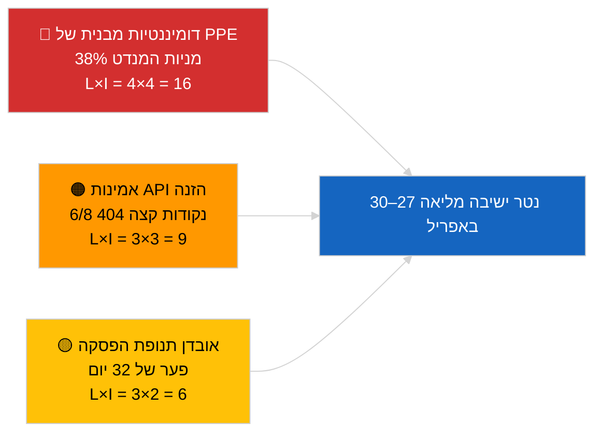

<!-- SPDX-FileCopyrightText: 2026 Hack23 AB -->
<!-- SPDX-License-Identifier: Apache-2.0 -->

# סיכום מנהלים — חדשות אחרונות | 2026-04-01

**סיווג:** OSINT | פרוטוקול פרלמנטרי ציבורי
**רמת אמינות:** 🟢 גבוהה (הערכת תקופת הפסקה ממקורות EP ראשיים)
**נוצר:** 2026-04-01T00:00:00Z (מזכר רטרואקטיבי)
**סוג מאמר:** חדשות אחרונות
**מקור:** פורטל הנתונים הפתוח של הפרלמנט האירופי

---

## 🎯 BLUF

**לא אותרו חדשות אחרונות ל-2026-04-01.** הפרלמנט האירופי נמצא בהפסקה בין-מושבית של 32 יום (27 במרץ → 26 באפריל) בין הישיבה המליאה הקטנה בבריסל (25–26 במרץ) לישיבה המליאה הבאה בשטרסבורג (27–30 באפריל). שש עדכוני מטא-נתונים של טקסטים שאומצו הופיעו בהזנה של היום, אולם הם מייצגים עדכונים מנהלתיים של טקסטים קיימים (TA-10-2025-0281/0283/0288/0290/0292; TA-10-2026-0044) — **אף אחד מהם אינו מהווה פעולה חקיקתית חדשה**. ציון יציבות 84/100; אריתמטיקת הקואליציה ללא שינוי. **🟢 אמינות גבוהה** כי חוסר הפעילות משקף התנהגות מובנית של הפסקה ולא הפרעת נתונים.

---

## 🧭 3 החלטות שמזכר זה תומך בהן

| # | החלטה | מי מחליט | מועד אחרון | ראיה |
|:-:|--------|----------|:----------:|------|
| 1 | **עריכה:** פרסם מאמר הקשר הפסקה (מבוסס ניתוח) | עורך ראשי | +24 שעות | אין פריטי רמה 1 בהזנת הטקסטים שאומצו |
| 2 | **ניטור:** בדוק מחדש 6 נקודות קצה של הזנה שנכשלו במחזור הבא | צינור נתונים | +24 שעות | 6/8 הזנות ייעוציות החזירו 404 |
| 3 | **קדימה:** סמן פרסום סדר יום שטרסבורג 27–30 באפריל | אחראי ניתוח | 2026-04-20 | סדר יום מתפרסם בדרך כלל T-7 ימים |

---

## 📰 קריאת 60 שניות

- 🔴 **אין אירועי חדשות אחרונות ברמה 1.** תקופת הפסקה 27 במרץ → 26 באפריל; אין ישיבה מליאה ואין הצבעת ועדה היום. (🟢 גבוהה)
- 🟠 **6 עדכוני מטא-נתונים של טקסטים שאומצו** בהזנה של היום — כל טקסטי 2025 בתוספת TA-10-2026-0044; עדכון מנהלתי שגרתי, ללא אימוצים חדשים. (🟢 גבוהה)
- 🟢 **ציון יציבות 84/100** (מערכת התראה מוקדמת); 3 התראות פעילות, סיכון כולל בינוני; אין חריגות בגלאי החריגות של ההצבעה. (🟢 גבוהה)
- 🟡 **חשש אמינות הזנה:** `get_events_feed`, `get_procedures_feed`, `get_documents_feed`, `get_plenary_documents_feed`, `get_committee_documents_feed`, `get_parliamentary_questions_feed` החזירו כולם 404 — ייתכן תחזוקת API בתקופת ההפסקה. (🟡 בינוני)
- 🔵 **הקשר כלכלי:** מינוי סגן נשיא הבנק המרכזי האירופי (TA-10-2026-0060, 10 במרץ) והתאמת המכסים האמריקאים (TA-10-2026-0096, 26 במרץ) נותרים קווי הבסיס הכלכליים הדומיננטיים לקראת הישיבה המליאה של אפריל. (🟢 גבוהה)
- 🟣 **אריתמטיקת קואליציה:** PPE 38% / S&D 22% / PfE 11% / Verts 10% / ECR 8% / Renew 5% / NI 4% / שמאל 2%. קואליציה גדולה (PPE+S&D = 60%) מעל סף ה-51%. (🟢 גבוהה)
- 🩷 **וקטור שיבוש:** השתלטות הקבוצה הדומיננטית PPE סומנה כסיכון מובני גבוה על ידי מערכת ההתראה המוקדמת; אין מחולל חריף היום. (🟡 בינוני)
- ⚪ **המשך מהפעם הקודמת:** חוות דעת EUD EU–Mercosur (TA-10-2026-0008) צפויה לפני הישיבה המליאה של אפריל; תיק האסירים הפוליטיים הגאורגים (TA-10-2026-0083) ממתין לדיווח יישום.

---

## 🗂️ טבלת מסמכים/הליכים מובילים

| דירוג | הפניית EP | כותרת (קצרה) | חשיבות | אמינות | סטטוס |
|:-----:|-----------|-------------|:------:|:------:|--------|
| 1 | TA-10-2026-0096 | התאמת מכסים אמריקאיים (המשך) | 6.5 | 🟢 HIGH | אומץ 26 במרץ; ניטור יישום אפריל |
| 2 | TA-10-2026-0060 | מינוי סגן נשיא הבנק המרכזי האירופי | 6.0 | 🟢 HIGH | אומץ 10 במרץ; קו בסיס מוסדי |
| 3 | TA-10-2026-0084 | זיכויי פליטות HDV 2025–2029 | 5.5 | 🟢 HIGH | אומץ 12 במרץ; ניטור טרנספוזיציה |

> הדירוג משקף חשיבות ההמשך לקראת הישיבה המליאה של אפריל; לא אומצו פריטי רמה 1 חדשים ב-2026-04-01.

---

## ⚠️ תמונת מצב של סיכונים ואיומים

| סיכון | L | I | ציון | מחולל | מקור | אדמירליות |
|-------|:-:|:-:|:----:|-------|-----|:----------:|
| דומיננטיות מבנית של PPE (38%) | 4 | 4 | 16 | היווצרות הגנתית של בלוקי מיעוט | התראה גבוהה של `early_warning_system` | A2 |
| אמינות API הזנה (6/8 נקודות 404) | 3 | 3 | 9 | שגיאות 404 מתמשכות במחזור הבא | בדיקות הזנת EP MCP | B2 |
| אובדן תנופת הפסקה | 3 | 2 | 6 | תיקים דחופים מאוחרים לאחר ישיבת אפריל | ניתוח לוח שנה | A1 |
| לחץ סחר חיצוני (מכסים אמריקאים) | 3 | 4 | 12 | הכרזת צעדי גמול או כינוס חירום | מעקב TA-10-2026-0096 | A1 |

---

## 🔮 מחולל עתידי מוביל

**ישיבה מליאה בשטרסבורג 27–30 באפריל 2026 — פרסום סדר יום T-7 (~20 באפריל).**
סדר יום בדגש מסחרי (תרחיש A, הסתברות 55%) מאשר תיאום PPE-S&D-Renew בנושא מעקב המכסים האמריקאים וחוות הדעת EU-Mercosur; מיקוד שלטון החוק (תרחיש B, 25%) מסמן המשכיות תקדים LIBE/Braun; מיקוד כלכלי/תעשייתי (תרחיש C, 20%) יעלה לבכורה את מעקב הדוח השנתי של הבנק המרכזי האירופי (TA-10-2026-0034).

---

## 🛡️ הערכת איכות המקורות

- **מקורות ראשיים:** פורטל הנתונים הפתוח של EP (`data.europarl.europa.eu`) הזנת טקסטים שאומצו (✅ 200, 6 פריטים) והזנת חברי הפרלמנט (✅ 200, 737 פריטים).
- **מגבלות נתונים:** 6 מתוך 8 הזנות ייעוציות החזירו 404 — לכן רמת האמינות בהיעדר אירועים היא 🟡 בינוני ולא 🟢 גבוה, עד שמחזור הבדיקה הבא יאשר הפסקה מבנית לעומת הפרעת API.
- **אמינות ל"ללא אימוצים חדשים":** 🟢 גבוהה — הזנת הטקסטים שאומצו החזירה 200 עם פריטי עדכון מטא-נתונים בלבד.
- **אמינות להסקת פעילות EP רחבה יותר:** 🟡 בינוני — הזנות אירועים/הליכים/מסמכים/שאלות אינן זמינות לאישוש צולב.

---

## 📎 קישורים

| קישור | נתיב |
|-------|------|
| מאמר | `./article.md` |
| תקציר מודיעיני לחדשות אחרונות | `./breaking-intelligence-brief.analysis.md` |
| ניתוח הנוף הפוליטי | `./political-landscape.analysis.md` |
| מניפסט | `./manifest.json` |
| מטא-נתוני מאמר | `./article-meta.json` |

---

## 🔄 הפניה צולבת להרצה הקודמת

**הרצה קודמת:** חדשות אחרונות מ-2026-03-26 (ישיבה מליאה קטנה אחרונה בבריסל) אימצה את TA-10-2026-0088 (ביטול חסינות Braun) ואת TA-10-2026-0096 (התאמת מכסים אמריקאיים). ההרצה הנוכחית היא הראשונה לאחר הפסקת מרץ; ללא אימוצים חדשים, ללא נושאי סדר יום, ללא הצבעות — עקבי עם דפוסי ההפסקה ההיסטוריים של EP10.

**דלתא:** ציון יציבות 84/100 ללא שינוי; התראת דומיננטיות PPE ללא שינוי; אריתמטיקת קואליציה ללא שינוי. הדלתא היחיד הוא עדכון מטא-נתוני 6 פריטים, שחסר משמעות תפעולית.

---

**בקרת מסמך**
- **תבנית:** `/analysis/templates/executive-brief.md`
- **נתיב קובץ:** `analysis/daily/2026-04-01/breaking/executive-brief.md`
- **סיווג:** ציבורי
- **יצירה רטרואקטיבית:** מזכר זה הופק בסשן מילוי לאחור עבור הרצות שקדמו לדרישת קובץ Stage-B executive-brief. כל הטענות ניתנות למעקב אל `./article.md` ולהזנות פורטל הנתונים הפתוח של EP שהוא מצטט.
