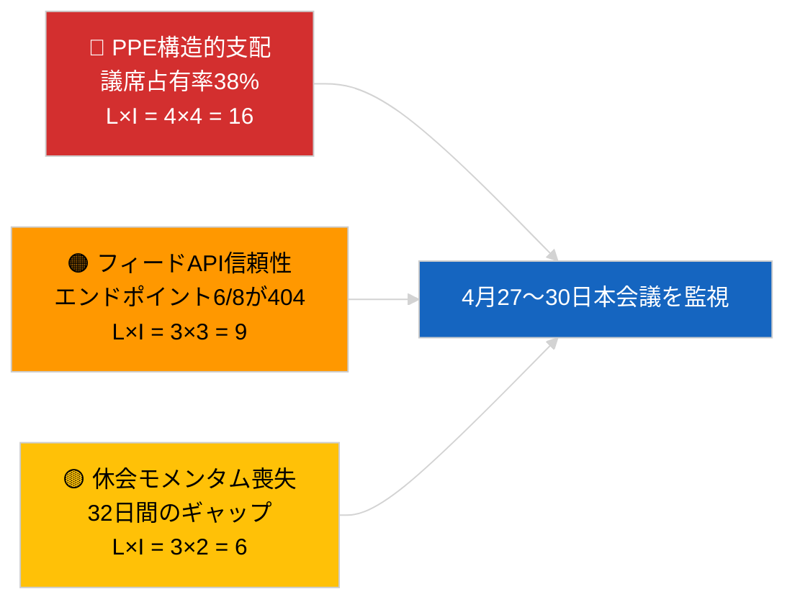

<!-- SPDX-FileCopyrightText: 2026 Hack23 AB -->
<!-- SPDX-License-Identifier: Apache-2.0 -->

# エグゼクティブブリーフ — 速報ニュース | 2026-04-01

**分類：** OSINT | 公開議会議事録
**信頼度：** 🟢 高（EP一次フィードからの休会期間評価）
**作成日：** 2026-04-01T00:00:00Z（遡及メモ）
**記事種別：** 速報ニュース
**出典：** 欧州議会オープンデータポータル

---

## 🎯 BLUF（結論先行要約）

**2026-04-01において速報ニュースは検出されなかった。** 欧州議会はブリュッセル・ミニ本会議（3月25〜26日）と次回ストラスブール本会議（4月27〜30日）の間、32日間の会期間休会中（3月27日→4月26日）である。本日のフィードには採択テキストのメタデータ更新が6件掲載されたが、これらは既存テキストの行政的更新（TA-10-2025-0281/0283/0288/0290/0292；TA-10-2026-0044）であり、**新たな立法行為には該当しない**。安定性スコア84/100；連立算術に変化なし。**🟢 高信頼度**：不活動は構造的な休会行動を反映しており、データ中断ではない。

---

## 🧭 このブリーフが支援する3つの意思決定

| # | 意思決定 | 決定者 | 期限 | 根拠 |
|:-:|---------|------|:----:|------|
| 1 | **編集方針：** 休会コンテキスト記事を公開（分析ベース） | 編集長 | +24時間 | 採択テキストフィードにレベル1項目なし |
| 2 | **監視：** 次サイクルで障害フィードエンドポイント6件を再テスト | データパイプライン | +24時間 | 諮問フィード6/8件が404を返答 |
| 3 | **先読み：** ストラスブール議題（4月27〜30日）公開のフラグ設定 | 分析責任者 | 2026-04-20 | 議題は通常T-7日前に公開 |

---

## 📰 60秒で読む要約

- 🔴 **レベル1の速報イベントなし。** 休会期間：3月27日→4月26日；本日は本会議・委員会採決なし。（🟢 高）
- 🟠 **採択テキストのメタデータ更新6件**（2025年テキスト全件＋TA-10-2026-0044）；定例行政更新、新採択なし。（🟢 高）
- 🟢 **安定性スコア84/100**（早期警告システム）；アクティブ警告3件、総合リスク中程度；採決異常検出器で異常なし。（🟢 高）
- 🟡 **フィード信頼性懸念：** `get_events_feed`、`get_procedures_feed`、`get_documents_feed`、`get_plenary_documents_feed`、`get_committee_documents_feed`、`get_parliamentary_questions_feed` すべてが404を返答。休会中のAPIメンテナンスの可能性。（🟡 中）
- 🔵 **経済的背景：** ECB副総裁任命（TA-10-2026-0060、3月10日）および米国関税調整（TA-10-2026-0096、3月26日）が4月本会議への主要経済基準線として継続。（🟢 高）
- 🟣 **連立算術：** PPE 38% / S&D 22% / PfE 11% / Verts 10% / ECR 8% / Renew 5% / NI 4% / 左派 2%。大連立（PPE+S&D = 60%）は51%閾値を超過。（🟢 高）
- 🩷 **混乱ベクター：** PPE優位グループの乗っ取りが早期警告システムで高度な構造リスクとしてフラグ設定。本日急性トリガーなし。（🟡 中）
- ⚪ **繰越案件：** EU–Mercosur EUD照会意見（TA-10-2026-0008）は4月本会議前に予定；ジョージア政治犯ファイル（TA-10-2026-0083）は実施報告待ち。

---

## 🗂️ トップ文書・手続き一覧

| 順位 | EP参照 | 件名（略称） | 重要度 | 信頼度 | 状況 |
|:----:|--------|------------|:------:|:------:|------|
| 1 | TA-10-2026-0096 | 米国関税調整（繰越） | 6.5 | 🟢 HIGH | 3月26日採択；4月実施監視 |
| 2 | TA-10-2026-0060 | ECB副総裁任命 | 6.0 | 🟢 HIGH | 3月10日採択；制度的基準線 |
| 3 | TA-10-2026-0084 | HDV排出クレジット2025〜2029 | 5.5 | 🟢 HIGH | 3月12日採択；国内法化監視 |

> 順位は4月本会議への繰越重要度を反映；2026-04-01に新規レベル1項目の採択なし。

---

## ⚠️ リスク・脅威スナップショット

| リスク | L | I | スコア | トリガー | 出典 | 提督格付け |
|--------|:-:|:-:|:------:|---------|-----|:----------:|
| PPE構造的支配（38%） | 4 | 4 | 16 | 少数派ブロックによる防衛的形成 | `early_warning_system` 高警告 | A2 |
| フィードAPI信頼性（6/8 が404） | 3 | 3 | 9 | 次サイクルでも404継続 | EP MCPフィードプローブ | B2 |
| 休会モメンタム喪失 | 3 | 2 | 6 | 緊急案件が4月本会議後に遅延 | カレンダー分析 | A1 |
| 外部貿易圧力（米国関税） | 3 | 4 | 12 | 報復措置発表または緊急招集 | TA-10-2026-0096追跡 | A1 |

---

## 🔮 主要先読みトリガー

**ストラスブール本会議2026年4月27〜30日 — 議題公開T-7（〜4月20日）。**
貿易重視の議題（シナリオA、確率55%）はPPE-S&D-Renew連携による米国関税追跡とEU-Mercosur意見の協調を確認；法の支配重視（シナリオB、25%）はLIBE/Braun先例モメンタムの継続を示す；経済・産業重視（シナリオC、20%）はECB年次報告追跡（TA-10-2026-0034）を前景化させる。

---

## 🛡️ 情報源品質評価

- **一次情報源：** 欧州議会オープンデータポータル（`data.europarl.europa.eu`）採択テキストフィード（✅ 200、6件）およびMEPフィード（✅ 200、737件）。
- **データ制限：** 諮問フィード8件中6件が404を返答。したがってイベント不在への信頼度は🟡中程度（🟢高ではない）。次サイクルのプローブが構造的休会対APIダウンを確認するまで維持。
- **「新採択なし」への信頼度：** 🟢 高 — 採択テキストフィードはメタデータ更新項目のみで200を返答。
- **欧州議会全体活動推定への信頼度：** 🟡 中程度 — イベント・手続き・文書・質問フィードが相互確認に利用不可。

---

## 📎 リンク

| リンク | パス |
|--------|------|
| 記事 | `./article.md` |
| 速報ニュース情報ブリーフ | `./breaking-intelligence-brief.analysis.md` |
| 政治情勢分析 | `./political-landscape.analysis.md` |
| マニフェスト | `./manifest.json` |
| 記事メタデータ | `./article-meta.json` |

---

## 🔄 前回実行との相互参照

**前回実行：** 2026-03-26速報（最後のブリュッセル・ミニ本会議）でTA-10-2026-0088（Braun免責権廃止）とTA-10-2026-0096（米国関税調整）を採択。本日の実行は3月休会後初回；新採択なし、議題項目なし、採決なし — EP10の歴史的休会パターンと一致。

**差分：** 安定性スコア84/100変化なし；PPE支配警告変化なし；連立算術変化なし。唯一の差分は6件のメタデータ更新であり、運用上は無意味。

---

**文書管理**
- **テンプレート：** `/analysis/templates/executive-brief.md`
- **成果物パス：** `analysis/daily/2026-04-01/breaking/executive-brief.md`
- **分類：** 公開
- **遡及生成：** 本メモはStage-B エグゼクティブブリーフ成果物要件以前の実行向けバックフィルセッションで作成された。すべての主張は`./article.md`および引用された欧州議会オープンデータポータルフィードに遡及可能。
