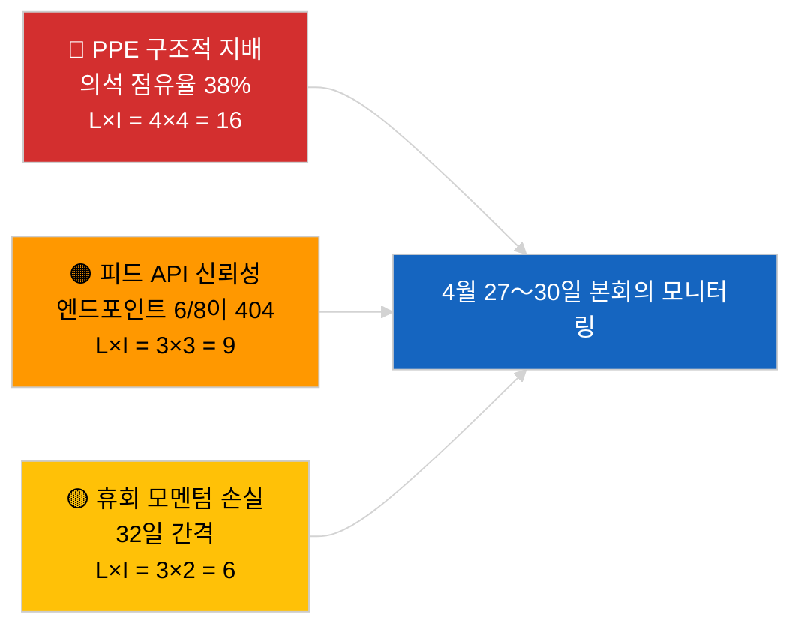

<!-- SPDX-FileCopyrightText: 2026 Hack23 AB -->
<!-- SPDX-License-Identifier: Apache-2.0 -->

# 집행 요약 — 속보 뉴스 | 2026-04-01

**분류:** OSINT | 공개 의회 기록
**신뢰도:** 🟢 높음 (EP 1차 피드로부터의 휴회 기간 평가)
**생성일:** 2026-04-01T00:00:00Z (소급 메모)
**기사 유형:** 속보 뉴스
**출처:** 유럽의회 개방형 데이터 포털

---

## 🎯 BLUF (결론 우선 요약)

**2026-04-01에는 속보 뉴스가 감지되지 않았다.** 유럽의회는 브뤼셀 미니 본회의(3월 25〜26일)와 다음 스트라스부르 본회의(4월 27〜30일) 사이에 32일간의 회기 간 휴회(3월 27일 → 4월 26일) 중이다. 오늘 피드에는 채택된 텍스트의 메타데이터 업데이트 6건이 나타났으나, 이는 기존 텍스트에 대한 행정적 업데이트(TA-10-2025-0281/0283/0288/0290/0292; TA-10-2026-0044)에 불과하며 — **신규 입법 행위에 해당하지 않는다**. 안정성 점수 84/100; 연립 산술 변동 없음. **🟢 높은 신뢰도**: 비활동은 구조적인 휴회 행동을 반영하며 데이터 중단이 아니다.

---

## 🧭 이 브리프가 지원하는 3가지 결정

| # | 결정 | 결정권자 | 마감 | 근거 |
|:-:|------|---------|:----:|------|
| 1 | **편집:** 휴회 맥락 기사 게재 (분석 기반) | 편집장 | +24시간 | 채택 텍스트 피드에 레벨 1 항목 없음 |
| 2 | **모니터링:** 다음 사이클에서 실패한 피드 엔드포인트 6건 재테스트 | 데이터 파이프라인 | +24시간 | 자문 피드 6/8건이 404 반환 |
| 3 | **전망:** 스트라스부르 4월 27〜30일 의제 게시 표시 | 분석 책임자 | 2026-04-20 | 의제는 통상 T-7일 전 게시 |

---

## 📰 60초 요약

- 🔴 **레벨 1 속보 이벤트 없음.** 휴회 기간: 3월 27일 → 4월 26일; 오늘 본회의 또는 위원회 표결 없음. (🟢 높음)
- 🟠 **채택 텍스트 메타데이터 업데이트 6건** (2025년 텍스트 전체 + TA-10-2026-0044); 정례 행정 업데이트, 신규 채택 없음. (🟢 높음)
- 🟢 **안정성 점수 84/100** (조기 경보 시스템); 활성 경고 3건, 전반적 위험 중간; 투표 이상 탐지기 이상 없음. (🟢 높음)
- 🟡 **피드 신뢰성 우려:** `get_events_feed`, `get_procedures_feed`, `get_documents_feed`, `get_plenary_documents_feed`, `get_committee_documents_feed`, `get_parliamentary_questions_feed` 모두 404 반환 — 휴회 중 API 유지보수 가능성. (🟡 중간)
- 🔵 **경제적 맥락:** ECB 부총재 임명(TA-10-2026-0060, 3월 10일)과 미국 관세 조정(TA-10-2026-0096, 3월 26일)이 4월 본회의로의 주요 경제 기준선 유지. (🟢 높음)
- 🟣 **연립 산술:** PPE 38% / S&D 22% / PfE 11% / Verts 10% / ECR 8% / Renew 5% / NI 4% / 좌파 2%. 대연립(PPE+S&D = 60%)이 51% 임계값 초과. (🟢 높음)
- 🩷 **혼란 벡터:** PPE 지배 그룹의 독점이 조기 경보 시스템에서 높은 구조적 위험으로 표시됨; 오늘 급성 촉발 요인 없음. (🟡 중간)
- ⚪ **이월 사안:** EU–Mercosur EUD 위임(TA-10-2026-0008) 의견서 4월 본회의 전 예정; 조지아 정치범 파일(TA-10-2026-0083)은 이행 보고 대기 중.

---

## 🗂️ 주요 문서 / 절차 표

| 순위 | EP 참조 | 제목 (약칭) | 중요도 | 신뢰도 | 상태 |
|:----:|---------|-----------|:------:|:------:|------|
| 1 | TA-10-2026-0096 | 미국 관세 조정 (이월) | 6.5 | 🟢 HIGH | 3월 26일 채택; 4월 이행 모니터링 |
| 2 | TA-10-2026-0060 | ECB 부총재 임명 | 6.0 | 🟢 HIGH | 3월 10일 채택; 제도적 기준선 |
| 3 | TA-10-2026-0084 | HDV 배출 크레딧 2025〜2029 | 5.5 | 🟢 HIGH | 3월 12일 채택; 국내법 전환 모니터링 |

> 순위는 4월 본회의로의 이월 중요도를 반영; 2026-04-01에 신규 레벨 1 항목 채택 없음.

---

## ⚠️ 위험 및 위협 스냅샷

| 위험 | L | I | 점수 | 촉발 요인 | 출처 | 해군 등급 |
|------|:-:|:-:|:----:|---------|-----|:--------:|
| PPE 구조적 지배 (38%) | 4 | 4 | 16 | 소수 블록의 방어적 형성 | `early_warning_system` 높은 경고 | A2 |
| 피드 API 신뢰성 (6/8이 404) | 3 | 3 | 9 | 다음 사이클에서도 404 지속 | EP MCP 피드 프로브 | B2 |
| 휴회 모멘텀 손실 | 3 | 2 | 6 | 긴급 파일이 4월 본회의 이후 지연 | 일정 분석 | A1 |
| 외부 무역 압력 (미국 관세) | 3 | 4 | 12 | 보복 조치 발표 또는 긴급 소집 | TA-10-2026-0096 추적 | A1 |

---

## 🔮 주요 선행 촉발 요인

**스트라스부르 본회의 2026년 4월 27〜30일 — 의제 공개 T-7(~4월 20일).**
무역 중심 의제(시나리오 A, 확률 55%)는 미국 관세 후속 조치와 EU-Mercosur 의견서에 관한 PPE-S&D-Renew 협조를 확인; 법치 중심(시나리오 B, 25%)은 LIBE/Braun 선례 모멘텀 지속을 시사; 경제·산업 중심(시나리오 C, 20%)은 ECB 연간 보고서 후속(TA-10-2026-0034)을 전면에 부각.

---

## 🛡️ 정보원 품질 평가

- **1차 출처:** 유럽의회 개방형 데이터 포털(`data.europarl.europa.eu`) 채택 텍스트 피드(✅ 200, 6건) 및 MEP 피드(✅ 200, 737건).
- **데이터 제한:** 자문 피드 8건 중 6건이 404 반환 — 이벤트 부재에 대한 신뢰도는 따라서 🟡 중간 (🟢 높음 아님). 다음 사이클 프로브가 구조적 휴회 대 API 다운을 확인할 때까지 유지.
- **"신규 채택 없음"에 대한 신뢰도:** 🟢 높음 — 채택 텍스트 피드가 메타데이터 업데이트 항목만으로 200 반환.
- **더 넓은 EP 활동 추론 신뢰도:** 🟡 중간 — 이벤트/절차/문서/질문 피드가 교차 검증에 이용 불가.

---

## 📎 링크

| 링크 | 경로 |
|------|------|
| 기사 | `./article.md` |
| 속보 뉴스 정보 브리프 | `./breaking-intelligence-brief.analysis.md` |
| 정치 지형 분석 | `./political-landscape.analysis.md` |
| 매니페스트 | `./manifest.json` |
| 기사 메타데이터 | `./article-meta.json` |

---

## 🔄 이전 실행과의 상호 참조

**이전 실행:** 2026-03-26 속보(마지막 브뤼셀 미니 본회의)에서 TA-10-2026-0088(Braun 면책 특권 해제)과 TA-10-2026-0096(미국 관세 조정) 채택. 오늘 실행은 3월 휴회 이후 첫 번째; 신규 채택 없음, 의제 항목 없음, 표결 없음 — EP10의 역사적 휴회 패턴과 일치.

**델타:** 안정성 점수 84/100 변동 없음; PPE 지배 경고 변동 없음; 연립 산술 변동 없음. 유일한 델타는 6건의 메타데이터 업데이트이며 운영상 무의미.

---

**문서 관리**
- **템플릿:** `/analysis/templates/executive-brief.md`
- **산출물 경로:** `analysis/daily/2026-04-01/breaking/executive-brief.md`
- **분류:** 공개
- **소급 생성:** 이 메모는 Stage-B 집행 요약 산출물 요건 이전 실행을 위한 백필 세션에서 작성되었다. 모든 주장은 `./article.md`와 인용된 유럽의회 개방형 데이터 포털 피드로 추적 가능.
