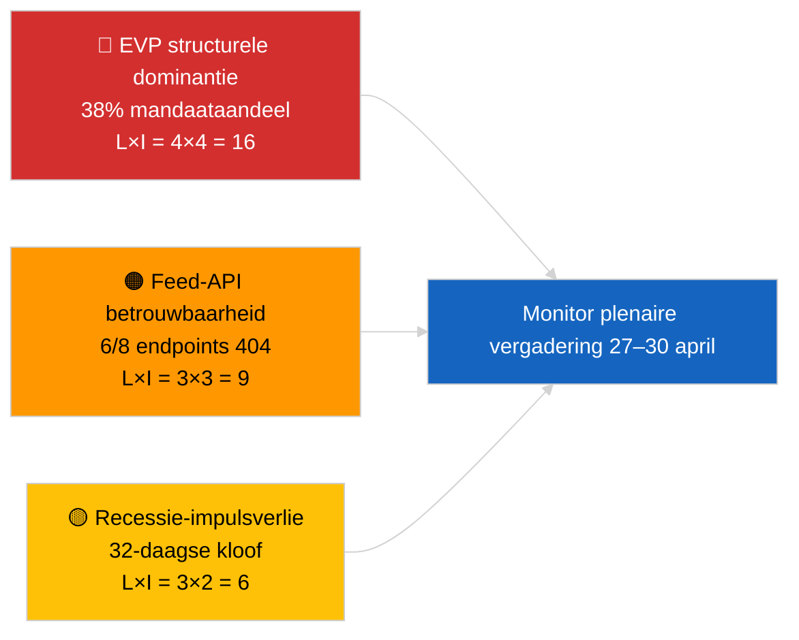

<!-- SPDX-FileCopyrightText: 2026 Hack23 AB -->
<!-- SPDX-License-Identifier: Apache-2.0 -->

# Managementsamenvatting — Laatste Nieuws | 2026-04-01

**Classificatie:** OSINT | Openbaar parlementair protocol
**Betrouwbaarheid:** 🟢 Hoog (recessiebeoordeling op basis van primaire EP-feeds)
**Gegenereerd:** 2026-04-01T00:00:00Z (retrospectieve memo)
**Artikeltype:** Laatste nieuws
**Bron:** Open dataportaal van het Europees Parlement

---

## 🎯 BLUF

**Er is geen urgent nieuws gedetecteerd voor 2026-04-01.** Het Europees Parlement is in een intersessioneel reces van 32 dagen (27 maart → 26 april) tussen de mini-plenaire vergadering in Brussel (25–26 maart) en de volgende plenaire vergadering in Straatsburg (27–30 april). Zes metadata-updates van aangenomen teksten verschenen in de feed van vandaag, maar vertegenwoordigen administratieve updates van bestaande teksten (TA-10-2025-0281/0283/0288/0290/0292; TA-10-2026-0044) — **geen daarvan kwalificeert als nieuwe wetgevingshandeling**. Stabiliteitsscore 84/100; coalitie-arithmetiek ongewijzigd. **🟢 HOGE betrouwbaarheid** dat de inactiviteit structureel recessiegedrag weerspiegelt en geen data-onderbreking.

---

## 🧭 3 Beslissingen die deze memo ondersteunt

| # | Beslissing | Wie beslist | Deadline | Bewijs |
|:-:|------------|------------|:--------:|--------|
| 1 | **Redactioneel:** publiceer recessie-contextartikel (op basis van analyse) | Hoofdredacteur | +24u | Geen niveau-1-items in de feed voor aangenomen teksten |
| 2 | **Monitoring:** hertest 6 falende feed-endpoints in de volgende cyclus | Datapipeline | +24u | 6/8 adviserende feeds retourneerden 404 |
| 3 | **Vooruitblik:** markeer publicatie van de agenda voor Straatsburg 27–30 april | Analyseverantwoordelijke | 2026-04-20 | Agenda typisch gepubliceerd T-7 dagen |

---

## 📰 60-Seconden Lezing

- 🔴 **Geen niveau-1-actuele gebeurtenissen.** Recessieperiode 27 maart → 26 april; geen plenaire vergadering of commissievergadering vandaag. (🟢 Hoog)
- 🟠 **6 metadata-updates van aangenomen teksten** in de feed van vandaag — alle 2025-teksten plus TA-10-2026-0044; routinematige administratieve update, geen nieuwe aannemingen. (🟢 Hoog)
- 🟢 **Stabiliteitsscore 84/100** (vroegtijdig waarschuwingssysteem); 3 actieve waarschuwingen, GEMIDDELD totaalrisico; geen anomalieën in de stemafwijkingsdetector. (🟢 Hoog)
- 🟡 **Betrouwbaarheidsprobleem met feeds:** `get_events_feed`, `get_procedures_feed`, `get_documents_feed`, `get_plenary_documents_feed`, `get_committee_documents_feed`, `get_parliamentary_questions_feed` retourneerden allen 404 — mogelijk API-onderhoud tijdens recessie. (🟡 Gemiddeld)
- 🔵 **Economische context:** de benoeming van de vice-president van de ECB (TA-10-2026-0060, 10 maart) en de aanpassing van Amerikaanse tarieven (TA-10-2026-0096, 26 maart) blijven de dominante economische basislijnen richting de plenaire vergadering van april. (🟢 Hoog)
- 🟣 **Coalitie-arithmetiek:** EVP 38% / S&D 22% / PfE 11% / Verts 10% / ECR 8% / Renew 5% / NI 4% / Links 2%. Grote coalitie (EVP+S&D = 60%) boven de drempel van 51%. (🟢 Hoog)
- 🩷 **Verstoringsvektor:** de overname door de dominante EVP-groep gemarkeerd als HOOG structureel risico door het vroegtijdige waarschuwingssysteem; geen acute trigger vandaag. (🟡 Gemiddeld)
- ⚪ **Carry-forward:** advies EUD EU–Mercosur (TA-10-2026-0008) verwacht vóór de plenaire vergadering van april; dossier Georgische politieke gevangenen (TA-10-2026-0083) wacht op implementatierapportage.

---

## 🗂️ Top Documenten / Procedurele Tabel

| Rang | EP-referentie | Titel (kort) | Belang | Betrouwbaarheid | Status |
|:----:|---------------|-------------|:------:|:---------------:|--------|
| 1 | TA-10-2026-0096 | Aanpassing Amerikaanse tarieven (carry-over) | 6.5 | 🟢 HIGH | Aangenomen 26 maart; monitoring implementatie april |
| 2 | TA-10-2026-0060 | Benoeming vice-president ECB | 6.0 | 🟢 HIGH | Aangenomen 10 maart; institutionele basislijn |
| 3 | TA-10-2026-0084 | Emissiecredits voor zware voertuigen 2025–2029 | 5.5 | 🟢 HIGH | Aangenomen 12 maart; transpositionele monitoring |

> Rang weerspiegelt carry-over-belang richting de plenaire vergadering van april; geen nieuwe niveau-1-items aangenomen op 2026-04-01.

---

## ⚠️ Risico- en Dreigingsoverzicht

| Risico | L | I | Score | Trigger | Bron | Admiraliteit |
|--------|:-:|:-:|:-----:|---------|-----|:------------:|
| EVP structurele dominantie (38%) | 4 | 4 | 16 | Defensieve formatie van minderheidsblokken | `early_warning_system` HOGE waarschuwing | A2 |
| Feed-API betrouwbaarheid (6/8 404) | 3 | 3 | 9 | Aanhoudende 404's in de volgende cyclus | EP MCP feed-sonderingen | B2 |
| Recessie-impulsverlies | 3 | 2 | 6 | Urgente dossiers vertraagd na april-plenaire | Kalenderanalyse | A1 |
| Externe handelsdruk (Amerikaanse tarieven) | 3 | 4 | 12 | Aankondiging vergeldingsmaatregelen of spoedbijeenkomst | TA-10-2026-0096 follow-up | A1 |

---

## 🔮 Top Vooruitblikkende Trigger

**Plenaire vergadering Straatsburg 27–30 april 2026 — agendapublicatie T-7 (~20 april).**
Een handelszware agenda (Scenario A, 55% kans) bevestigt EVP-S&D-Renew-coördinatie over de follow-up van Amerikaanse tarieven en het EU-Mercosur-advies; een focus op de rechtsstaat (Scenario B, 25% kans) signaleert voortzetting van het LIBE/Braun-precedentmomentum; een economische/industriële focus (Scenario C, 20% kans) zou de follow-up van het jaarverslag van de ECB (TA-10-2026-0034) benadrukken.

---

## 🛡️ Beoordeling van de Bronnenkwaliteit

- **Primaire bronnen:** Open dataportaal van het EP (`data.europarl.europa.eu`) feed voor aangenomen teksten (✅ 200, 6 items) en MEP-feed (✅ 200, 737 items).
- **Databeperkingen:** 6 van de 8 adviserende feeds retourneerden 404 — de betrouwbaarheid bij afwezigheid van gebeurtenissen is daarom 🟡 gemiddeld, niet 🟢 hoog, totdat de volgende cyclussonde structureel reces vs. API-storing bevestigt.
- **Betrouwbaarheid voor "geen nieuwe aannemingen":** 🟢 Hoog — feed voor aangenomen teksten retourneerde 200 met alleen metadata-update-items.
- **Betrouwbaarheid voor bredere EP-activiteitsinferentie:** 🟡 Gemiddeld — feeds voor evenementen/procedures/documenten/vragen niet beschikbaar voor kruiscontrole.

---

## 📎 Links

| Link | Pad |
|------|-----|
| Artikel | `./article.md` |
| Inlichtingensamenvatting laatste nieuws | `./breaking-intelligence-brief.analysis.md` |
| Analyse van het politieke landschap | `./political-landscape.analysis.md` |
| Manifest | `./manifest.json` |
| Artikelmetadata | `./article-meta.json` |

---

## 🔄 Kruisverwijzing naar Vorige Run

**Vorige run:** het laatste nieuws van 2026-03-26 (laatste mini-plenaire Brussel) nam TA-10-2026-0088 (opheffing immuniteit Braun) en TA-10-2026-0096 (aanpassing Amerikaanse tarieven) aan. De run van vandaag is de eerste na het maart-reces; geen nieuwe aannemingen, geen agendapunten, geen stemmingen — consistent met de historische recessiepatronen van EP10.

**Delta:** Stabiliteitsscore 84/100 ongewijzigd; EVP-dominantiewaarschuwing ongewijzigd; coalitie-arithmetiek ongewijzigd. Het enige delta is de metadata-update van 6 items, wat operationeel onbeduidend is.

---

**Documentcontrole**
- **Sjabloon:** `/analysis/templates/executive-brief.md`
- **Artefactpad:** `analysis/daily/2026-04-01/breaking/executive-brief.md`
- **Classificatie:** Openbaar
- **Retrospectieve generatie:** Deze memo is geproduceerd in een terugvulsessie voor runs die dateren van vóór de Stage-B executive-brief-artefactvereiste. Alle beweringen worden herleid naar `./article.md` en de EP Open Data Portal-feeds die het citeert.
