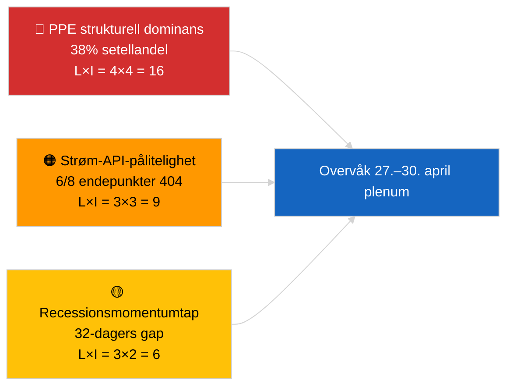

<!-- SPDX-FileCopyrightText: 2026 Hack23 AB -->
<!-- SPDX-License-Identifier: Apache-2.0 -->

# Ledersammendrag — Siste nytt | 2026-04-01

**Klassifisering:** OSINT | Offentlig parlamentarisk protokoll
**Konfidens:** 🟢 Høy (recessionsvurdering fra primære EP-strømmer)
**Generert:** 2026-04-01T00:00:00Z (retrospektivt sammendrag)
**Artikeltype:** Siste nytt
**Kilde:** Europaparlamentets åpne dataportal

---

## 🎯 BLUF

**Ingen siste nytt oppdaget for 2026-04-01.** Europaparlamentet er i en 32-dagers inter-sesjonell recess (27. mars → 26. april) mellom Brussel-miniplenumsmøtet (25.–26. mars) og neste Strasbourg-plenumsmøte (27.–30. april). Seks oppdateringer av vedtatt-tekst-metadata dukket opp i dagens strøm, men representerer administrativ oppdatering av eksisterende tekster (TA-10-2025-0281/0283/0288/0290/0292; TA-10-2026-0044) — **ingen kvalifiserer som nye lovgivningstiltak**. Stabilitetscore 84/100; koalisjonsaritmetikk uendret. **🟢 HØY konfidens** om at inaktiviteten er strukturell recessionatferd fremfor dataavbrudd.

---

## 🧭 3 Beslutninger dette sammendraget støtter

| # | Beslutning | Hvem bestemmer | Frist | Bevis |
|:-:|------------|--------------|:-----:|-------|
| 1 | **Redaksjonelt:** publiser recessionskontekst-artikkel (analysebasert) | Redaktør | +24h | Ingen nivå-1-poster i vedtatt-tekster-strøm |
| 2 | **Overvåking:** re-test 6 mislykkede strøm-endepunkter neste syklus | Datapipeline | +24h | 6/8 rådgivende strømmer returnerte 404 |
| 3 | **Fremoverrettet:** flagg publisering av agenda for Strasbourg 27.–30. april | Analyseleder | 2026-04-20 | Agenda typisk publisert T-7 dager |

---

## 📰 60-Second Read

- 🔴 **Ingen nivå-1-siste hendelser.** Recessionsperiode 27. mars → 26. april; ingen plenumsesjon, ingen komitéavstemning i dag. (🟢 Høy)
- 🟠 **6 oppdateringer av vedtatt-tekst-metadata** i dagens strøm — alle 2025-tekster pluss TA-10-2026-0044; rutinemessig administrativ oppdatering, ingen nye vedtakelser. (🟢 Høy)
- 🟢 **Stabilitetscore 84/100** (tidlig varslingssystem); 3 aktive advarsler, MEDIUM samlet risiko; ingen anomalier i avstemningsavviksdetektoren. (🟢 Høy)
- 🟡 **Strømpålitelighetsbekymring:** `get_events_feed`, `get_procedures_feed`, `get_documents_feed`, `get_plenary_documents_feed`, `get_committee_documents_feed`, `get_parliamentary_questions_feed` returnerte alle 404 — mulig API-vedlikehold under recessjon. (🟡 Middels)
- 🔵 **Økonomisk kontekst:** ECBs visepresident-utnevnelse (TA-10-2026-0060, 10. mars) og justering av amerikanske tollsatser (TA-10-2026-0096, 26. mars) er fortsatt de dominerende økonomiske basislinjene inn i april-plenumsmøtet. (🟢 Høy)
- 🟣 **Koalisjonsaritmetikk:** PPE 38% / S&D 22% / PfE 11% / Verts 10% / ECR 8% / Renew 5% / NI 4% / Left 2%. Storkoalisjon (PPE+S&D = 60%) over 51%-terskelen. (🟢 Høy)
- 🩷 **Forstyrrelsesvektoren:** PPE-dominerende gruppes overgrep flagget som HØY strukturell risiko av tidlig varslingssystem; ingen akutt utløser i dag. (🟡 Middels)
- ⚪ **Carry-forward:** EU–Mercosur EUD-anke (TA-10-2026-0008) uttalelse forventes før april-plenumsmøtet; Georgias politiske fanger-fil (TA-10-2026-0083) avventer gjennomføringsrapportering.

---

## 🗂️ Topp Dokumenter / Prosedyretabell

| Rang | EP-referanse | Tittel (kort) | Signifikans | Konfidens | Status |
|:----:|--------------|-------------|:-----------:|:---------:|--------|
| 1 | TA-10-2026-0096 | Justering av amerikanske tollsatser (carry-over) | 6.5 | 🟢 HIGH | Vedtatt 26. mars; april-implementeringsovervåking |
| 2 | TA-10-2026-0060 | ECB visepresident-utnevnelse | 6.0 | 🟢 HIGH | Vedtatt 10. mars; institusjonell basislinje |
| 3 | TA-10-2026-0084 | HDV utslippskreditter 2025–2029 | 5.5 | 🟢 HIGH | Vedtatt 12. mars; transposisjonsovervåking |

> Rang reflekterer carry-over-signifikans inn i april-plenumsmøtet; ingen nye nivå-1-poster ble vedtatt 2026-04-01.

---

## ⚠️ Risiko- og trusselsbilde

| Risiko | L | I | Score | Utløser | Kilde | Admiralitet |
|--------|:-:|:-:|:-----:|---------|------|:-----------:|
| PPE strukturell dominans (38%) | 4 | 4 | 16 | Defensiv formasjon av minoritetsblokk | `early_warning_system` HØY advarsel | A2 |
| Strøm-API-pålitelighet (6/8 404) | 3 | 3 | 9 | Vedvarende 404-er neste syklus | EP MCP strømsonderinger | B2 |
| Recessionsmomentumtap | 3 | 2 | 6 | Hasteakter forsinket etter april-plenum | Kalenderanalyse | A1 |
| Eksternt handelspress (amerikanske tollsatser) | 3 | 4 | 12 | Gjengjeldelsesmelding eller nødkall | TA-10-2026-0096 oppfølging | A1 |

---

## 🔮 Topp Fremoverrettet Utløser

**Strasbourg plenumsmøte 27.–30. april 2026 — agendapublisering T-7 (~20. april).**
En handelsintensiv agenda (Scenario A, 55% sannsynlighet) bekrefter PPE-S&D-Renew-koordinasjon om oppfølging av amerikanske tollsatser og EU-Mercosur-uttalelse; et rettsstat-fokus (Scenario B, 25% sannsynlighet) signaliserer fortsatt LIBE/Braun-presedensmomentumet; et økonomisk/industrielt fokus (Scenario C, 20% sannsynlighet) vil fremheve ECBs årsrapportoppfølging (TA-10-2026-0034).

---

## 🛡️ Kildekvalitetsvurdering

- **Primære kilder:** EPs åpne dataportal (`data.europarl.europa.eu`) vedtatt-tekster-strøm (✅ 200, 6 poster) og MEP-strøm (✅ 200, 737 poster).
- **Databegrensninger:** 6 av 8 rådgivende strømmer returnerte 404 — konfidensen i fravær av hendelser er derfor 🟡 middels, ikke 🟢 høy, inntil neste syklus re-sonde bekrefter strukturell recessjon mot API-avbrudd.
- **Konfidens om "ingen nye vedtakelser":** 🟢 Høy — vedtatt-tekster-strømmen returnerte 200 med bare metadataoppdateringsposter.
- **Konfidens om bredere EP-aktivitetsinferens:** 🟡 Middels — hendelse-/prosedyre-/dokumenter-/spørsmåls-strømmer utilgjengelige for krysskontroll.

---

## 📎 Lenker

| Lenke | Sti |
|-------|-----|
| Artikkel | `./article.md` |
| Siste nyheters etterretningssammendrag | `./breaking-intelligence-brief.analysis.md` |
| Politisk landskapsanalyse | `./political-landscape.analysis.md` |
| Manifest | `./manifest.json` |
| Artikkelmetadata | `./article-meta.json` |

---

## 🔄 Kryssreferanse til forrige kjøring

**Forrige kjøring:** 2026-03-26 siste nytt (siste Brussel-miniplenumsmøte) vedtok TA-10-2026-0088 (Braun immunitetsopphevelse) og TA-10-2026-0096 (justering av amerikanske tollsatser). Dagens kjøring er den første etter mars-recessjonen; ingen nye vedtakelser, ingen agendapunkter, ingen avstemninger — konsistent med EP10s historiske recessmønster.

**Delta:** Stabilitetscore 84/100 uendret; PPE-dominansadvarsel uendret; koalisjonsaritmetikk uendret. Det eneste deltaet er den 6-post-metadataoppdateringen, som er operasjonelt ubetydelig.

---

**Dokumentkontroll**
- **Mal:** `/analysis/templates/executive-brief.md`
- **Artefaktsti:** `analysis/daily/2026-04-01/breaking/executive-brief.md`
- **Klassifisering:** Offentlig
- **Retrospektiv generering:** Dette sammendraget ble produsert i en tilbakefyllingsøkt for kjøringer som forutgår Stage-B executive-brief-artefaktkravet. Alle påstander spores til `./article.md` og EP Open Data Portal-strømmene det siterer.
