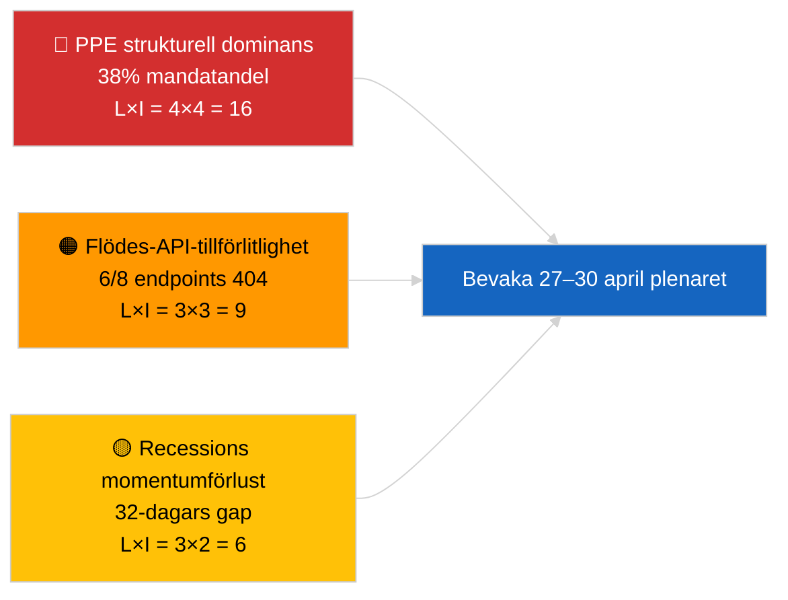

<!-- SPDX-FileCopyrightText: 2026 Hack23 AB -->
<!-- SPDX-License-Identifier: Apache-2.0 -->

# Verksamhetsöversikt — Senaste nytt | 2026-04-01

**Klassificering:** OSINT | Offentligt parlamentariskt protokoll
**Konfidensgrad:** 🟢 Hög (bedömning av recessionperiod från primära EP-flöden)
**Genererad:** 2026-04-01T00:00:00Z (retrospektivt PM)
**Artikeltyp:** Senaste nytt
**Källa:** Europaparlamentets öppna dataportal

---

## 🎯 BLUF

**Inga bryta nyheter identifierades för 2026-04-01.** Europaparlamentet befinner sig i en 32-dagars recess mellan sessionerna (27 mars → 26 april) mellan Bryssels miniplenarmöte (25–26 mars) och nästa Strasbourg-plenarmöte (27–30 april). Sex uppdateringar av antagna-text-metadata dök upp i dagens flöde men representerar administrativ uppdatering av befintliga texter (TA-10-2025-0281/0283/0288/0290/0292; TA-10-2026-0044) — **ingen av dessa kvalificerar som nya lagstiftningsåtgärder**. Stabilitetsscore 84/100; koalitionsaritmetik oförändrad. **🟢 HÖG konfidensgrad** att inaktiviteten återspeglar strukturell recessbeteende snarare än dataavbrott.

---

## 🧭 3 Beslut som detta PM stöder

| # | Beslut | Vem beslutar | Deadline | Bevis |
|:-:|--------|-------------|:--------:|-------|
| 1 | **Redaktionellt:** publicera recesskontext-artikel (analysbaserad) | Redaktör | +24h | Inga nivå-1-objekt i antagna-texters flöde |
| 2 | **Övervakning:** re-testa 6 misslyckade flödesendpoints nästa cykel | Datapipeline | +24h | 6/8 rådgivande flöden returnerade 404 |
| 3 | **Framåtbevakning:** flagga publiceringen av dagordningen för Strasbourg 27–30 april | Analysansvarig | 2026-04-20 | Dagordning publiceras typiskt T-7 dagar |

---

## 📰 60-Second Read

- 🔴 **Inga nivå-1-bryta händelser.** Recessperiod 27 mars → 26 april; inget plenarsammanträde, ingen omröstning idag. (🟢 Hög)
- 🟠 **6 uppdateringar av antagna-text-metadata** i dagens flöde — alla 2025-texter plus TA-10-2026-0044; rutinmässig administrativ uppdatering, inga nya antaganden. (🟢 Hög)
- 🟢 **Stabilitetsscore 84/100** (tidiga varningssystem); 3 aktiva varningar, MEDIUM samlad risk; inga anomalier i omröstningsavvikelsedetektor. (🟢 Hög)
- 🟡 **Problem med flödestillförlitlighet:** `get_events_feed`, `get_procedures_feed`, `get_documents_feed`, `get_plenary_documents_feed`, `get_committee_documents_feed`, `get_parliamentary_questions_feed` returnerade alla 404 — möjlig API-underhåll under recessionen. (🟡 Medel)
- 🔵 **Ekonomisk kontext:** ECB:s vice-ordförandetillsättning (TA-10-2026-0060, 10 mars) och justering av amerikanska tullar (TA-10-2026-0096, 26 mars) kvarstår som de dominerande ekonomiska baslinjerna in i april-plenaret. (🟢 Hög)
- 🟣 **Koalitionsaritmetik:** PPE 38% / S&D 22% / PfE 11% / Verts 10% / ECR 8% / Renew 5% / NI 4% / Left 2%. Storkoalitionen (PPE+S&D = 60%) över 51%-tröskeln. (🟢 Hög)
- 🩷 **Störningsvektor:** PPE:s dominanta-gruppsövergrepp flaggat som HÖG strukturell risk av det tidiga varningssystemet; ingen akut utlösare idag. (🟡 Medel)
- ⚪ **Carry-forward:** EU–Mercosur EUD-hänskjutning (TA-10-2026-0008) yttrande förväntas före april-plenaret; Georgiens politiska fångar-fil (TA-10-2026-0083) avvaktar genomföranderapportering.

---

## 🗂️ Topp Dokument / Procedurtabell

| Rang | EP-referens | Titel (kort) | Signifikans | Konfidensgrad | Status |
|:----:|-------------|-------------|:-----------:|:-------------:|--------|
| 1 | TA-10-2026-0096 | Justering av amerikanska tullar (carry-over) | 6.5 | 🟢 HIGH | Antagen 26 mars; april-implementationsbevakning |
| 2 | TA-10-2026-0060 | ECB vice-ordförandetillsättning | 6.0 | 🟢 HIGH | Antagen 10 mars; institutionell baslinje |
| 3 | TA-10-2026-0084 | HDV utsläppskrediter 2025–2029 | 5.5 | 🟢 HIGH | Antagen 12 mars; transpositionsbevakning |

> Rang återspeglar carry-over-signifikans in i april-plenaret; inga nya nivå-1-objekt antogs 2026-04-01.

---

## ⚠️ Risk- och hotögonblicksbild

| Risk | L | I | Poäng | Utlösare | Källa | Admiralitet |
|------|:-:|:-:|:-----:|---------|------|:-----------:|
| PPE strukturell dominans (38%) | 4 | 4 | 16 | Defensiv formation av minoritetsblock | `early_warning_system` HÖG varning | A2 |
| Flödes-API-tillförlitlighet (6/8 404) | 3 | 3 | 9 | Ihållande 404:or nästa cykel | EP MCP flödessondering | B2 |
| Recessions momentumförlust | 3 | 2 | 6 | Brådskande filer försenade efter april-plenaret | Kalenderanalys | A1 |
| Externt handelstryck (amerikanskatollar) | 3 | 4 | 12 | Vedergällningsmeddelande eller nödmöte | TA-10-2026-0096 uppföljning | A1 |

---

## 🔮 Topp Framåtutlösare

**Strasbourg-plenarsammanträde 27–30 april 2026 — dagordningspublicering T-7 (~20 april).**
En handelsintensiv dagordning (Scenario A, 55% sannolikhet) bekräftar PPE-S&D-Renew-koordination om uppföljning av amerikanska tullar och EU-Mercosur-yttrande; ett fokus på rättsstat (Scenario B, 25% sannolikhet) signalerar fortsatt LIBE/Braun-prejudikatmomentum; ett ekonomiskt/industriellt fokus (Scenario C, 20% sannolikhet) skulle lyfta fram ECB:s årsredovisningsuppföljning (TA-10-2026-0034).

---

## 🛡️ Källkvalitetsbedömning

- **Primära källor:** EP:s öppna dataportal (`data.europarl.europa.eu`) antagna-texter-flöde (✅ 200, 6 objekt) och MEP-flöde (✅ 200, 737 objekt).
- **Databegränsningar:** 6 av 8 rådgivande flöden returnerade 404 — konfidensgraden i frånvaro av händelser är därför 🟡 medel, inte 🟢 hög, tills nästa cykeluppsond bekräftar strukturell recess kontra API-avbrott.
- **Konfidensgrad för "inga nya antaganden":** 🟢 Hög — antagna-texter-flödet returnerade 200 med enbart metadatauppdateringsposter.
- **Konfidensgrad för bredare EP-aktivitetsinferens:** 🟡 Medel — händelse-/procedur-/dokument-/frågors flöden otillgängliga för korsreferenskontroll.

---

## 📎 Länkar

| Länk | Sökväg |
|------|--------|
| Artikel | `./article.md` |
| Senaste nyhetsunderrättelseöversikt | `./breaking-intelligence-brief.analysis.md` |
| Analys av politiskt landskap | `./political-landscape.analysis.md` |
| Manifest | `./manifest.json` |
| Artikelmetadata | `./article-meta.json` |

---

## 🔄 Korshänvisning till föregående körning

**Föregående körning:** 2026-03-26 senaste nytt (sista Bryssels miniplenarmöte) antog TA-10-2026-0088 (Braun immunitetsupphävande) och TA-10-2026-0096 (justering av amerikanska tullar). Dagens körning är den första efter mars-recessionen; inga nya antaganden, inga dagordningspunkter, inga omröstningar — konsekvent med EP10:s historiska recessmönster.

**Delta:** Stabilitetsscore 84/100 oförändrat; PPE-dominansvarning oförändrad; koalitionsaritmetik oförändrad. Det enda deltaet är den 6-objekt-metadata-uppdateringen, vilket är operationellt obetydligt.

---

**Dokumentkontroll**
- **Mall:** `/analysis/templates/executive-brief.md`
- **Artefaktsökväg:** `analysis/daily/2026-04-01/breaking/executive-brief.md`
- **Klassificering:** Offentlig
- **Retrospektiv generering:** Detta PM producerades i en bakåtfyllningssession för körningar som föregår Stage-B executive-brief-artefaktkravet. Alla påståenden spåras till `./article.md` och EP Open Data Portal-flödena det citerar.
