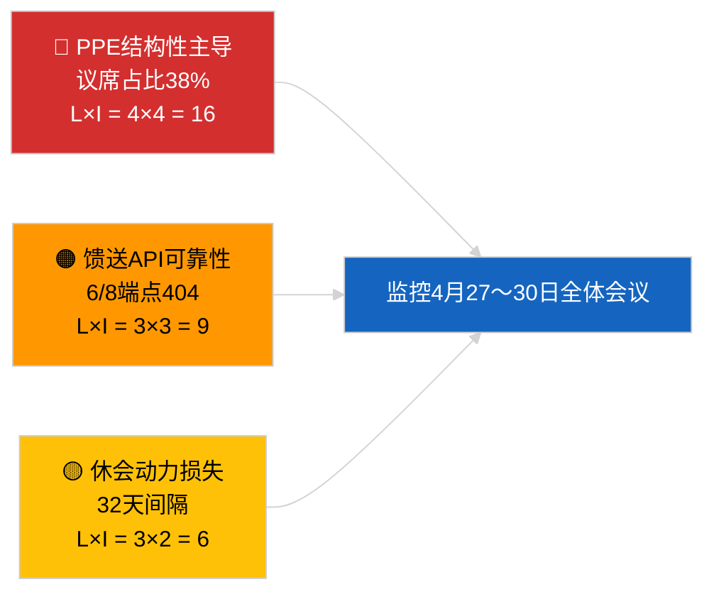

<!-- SPDX-FileCopyrightText: 2026 Hack23 AB -->
<!-- SPDX-License-Identifier: Apache-2.0 -->

# 行政摘要 — 突发新闻 | 2026-04-01

**分类：** OSINT | 公开议会记录
**置信度：** 🟢 高（基于EP主要数据馈送的休会期评估）
**生成日期：** 2026-04-01T00:00:00Z（追溯备忘录）
**文章类型：** 突发新闻
**来源：** 欧洲议会开放数据门户

---

## 🎯 BLUF（结论先行摘要）

**2026-04-01未检测到任何突发新闻。** 欧洲议会正处于32天的会期间休会期（3月27日→4月26日），介于布鲁塞尔小型全体会议（3月25〜26日）与下一届斯特拉斯堡全体会议（4月27〜30日）之间。今日馈送中出现了六条已采纳文本的元数据更新，但这些均属于对现有文本的行政更新（TA-10-2025-0281/0283/0288/0290/0292；TA-10-2026-0044）——**均不构成新的立法行动**。稳定性评分84/100；联合算术未变。**🟢 高置信度**：不活动反映的是结构性休会行为，而非数据中断。

---

## 🧭 本摘要支持的3项决策

| # | 决策 | 决策者 | 截止期 | 依据 |
|:-:|------|-------|:------:|------|
| 1 | **编辑：** 发布休会背景文章（基于分析） | 主编 | +24小时 | 已采纳文本馈送中无一级条目 |
| 2 | **监控：** 下一周期重新测试6个失效馈送端点 | 数据管道 | +24小时 | 6/8咨询馈送返回404 |
| 3 | **前瞻：** 标记斯特拉斯堡4月27〜30日议程发布 | 分析负责人 | 2026-04-20 | 议程通常在T-7天前发布 |

---

## 📰 60秒速读

- 🔴 **无一级突发事件。** 休会期：3月27日→4月26日；今日无全体会议或委员会投票。（🟢 高）
- 🟠 **6条已采纳文本元数据更新**（2025年全部文本+TA-10-2026-0044）；例行行政更新，无新采纳。（🟢 高）
- 🟢 **稳定性评分84/100**（早期预警系统）；3个活跃预警，总体风险中等；投票异常检测器无异常。（🟢 高）
- 🟡 **馈送可靠性问题：** `get_events_feed`、`get_procedures_feed`、`get_documents_feed`、`get_plenary_documents_feed`、`get_committee_documents_feed`、`get_parliamentary_questions_feed` 均返回404——休会期间可能进行API维护。（🟡 中）
- 🔵 **经济背景：** 欧洲央行副行长任命（TA-10-2026-0060，3月10日）和美国关税调整（TA-10-2026-0096，3月26日）仍是进入4月全体会议的主要经济基准线。（🟢 高）
- 🟣 **联合算术：** PPE 38% / S&D 22% / PfE 11% / Verts 10% / ECR 8% / Renew 5% / NI 4% / 左派 2%。大联合（PPE+S&D = 60%）超过51%门槛。（🟢 高）
- 🩷 **干扰向量：** PPE主导集团把持被早期预警系统标记为高度结构性风险；今日无急性触发因素。（🟡 中）
- ⚪ **延续事项：** EU–Mercosur EUD委托（TA-10-2026-0008）意见书预计在4月全体会议前提交；格鲁吉亚政治犯文件（TA-10-2026-0083）等待执行报告。

---

## 🗂️ 重要文件/程序一览

| 排名 | EP参考 | 标题（简称） | 重要性 | 置信度 | 状态 |
|:----:|--------|------------|:------:|:------:|------|
| 1 | TA-10-2026-0096 | 美国关税调整（延续） | 6.5 | 🟢 HIGH | 3月26日采纳；4月执行监控 |
| 2 | TA-10-2026-0060 | 欧洲央行副行长任命 | 6.0 | 🟢 HIGH | 3月10日采纳；制度基准线 |
| 3 | TA-10-2026-0084 | HDV排放积分2025〜2029 | 5.5 | 🟢 HIGH | 3月12日采纳；转化监控 |

> 排名反映进入4月全体会议的延续重要性；2026-04-01未采纳新的一级条目。

---

## ⚠️ 风险与威胁快照

| 风险 | L | I | 评分 | 触发因素 | 来源 | 海军级别 |
|------|:-:|:-:|:----:|---------|-----|:--------:|
| PPE结构性主导（38%） | 4 | 4 | 16 | 少数集团防御性形成 | `early_warning_system` 高预警 | A2 |
| 馈送API可靠性（6/8为404） | 3 | 3 | 9 | 下一周期404持续 | EP MCP馈送探测 | B2 |
| 休会动力损失 | 3 | 2 | 6 | 紧急文件在4月全体会议后延迟 | 日历分析 | A1 |
| 外部贸易压力（美国关税） | 3 | 4 | 12 | 报复措施声明或紧急召开 | TA-10-2026-0096追踪 | A1 |

---

## 🔮 主要前瞻性触发因素

**斯特拉斯堡全体会议2026年4月27〜30日——议程发布T-7（约4月20日）。**
以贸易为重点的议程（情景A，概率55%）确认PPE-S&D-Renew就美国关税后续行动和EU-Mercosur意见书的协调；以法治为重点（情景B，25%）表明LIBE/Braun判例动力持续；以经济/工业为重点（情景C，20%）将使欧洲央行年度报告后续（TA-10-2026-0034）浮出水面。

---

## 🛡️ 信息来源质量评估

- **主要来源：** 欧洲议会开放数据门户（`data.europarl.europa.eu`）已采纳文本馈送（✅ 200，6条）和MEP馈送（✅ 200，737条）。
- **数据局限：** 8个咨询馈送中6个返回404——因此对事件缺席的置信度为🟡中等，而非🟢高，直到下一周期探测确认结构性休会与API中断之别。
- **"无新采纳"置信度：** 🟢 高——已采纳文本馈送返回200，仅含元数据更新条目。
- **更广泛EP活动推断置信度：** 🟡 中等——事件/程序/文件/问询馈送无法用于交叉核查。

---

## 📎 链接

| 链接 | 路径 |
|------|------|
| 文章 | `./article.md` |
| 突发新闻情报简报 | `./breaking-intelligence-brief.analysis.md` |
| 政治格局分析 | `./political-landscape.analysis.md` |
| 清单 | `./manifest.json` |
| 文章元数据 | `./article-meta.json` |

---

## 🔄 与上次运行的交叉参考

**上次运行：** 2026-03-26突发新闻（最后一次布鲁塞尔小型全体会议）采纳了TA-10-2026-0088（Braun豁免权撤销）和TA-10-2026-0096（美国关税调整）。本次运行是3月休会后的首次；无新采纳、无议程项目、无投票——与EP10历史休会模式一致。

**变化量：** 稳定性评分84/100未变；PPE主导预警未变；联合算术未变。唯一变化是6条元数据更新，运营上无实质意义。

---

**文件管控**
- **模板：** `/analysis/templates/executive-brief.md`
- **成果路径：** `analysis/daily/2026-04-01/breaking/executive-brief.md`
- **分类：** 公开
- **追溯生成：** 本备忘录系在回填会话中为早于Stage-B行政摘要成果要求的运行而制作。所有主张均可追溯至`./article.md`及其引用的欧洲议会开放数据门户馈送。
