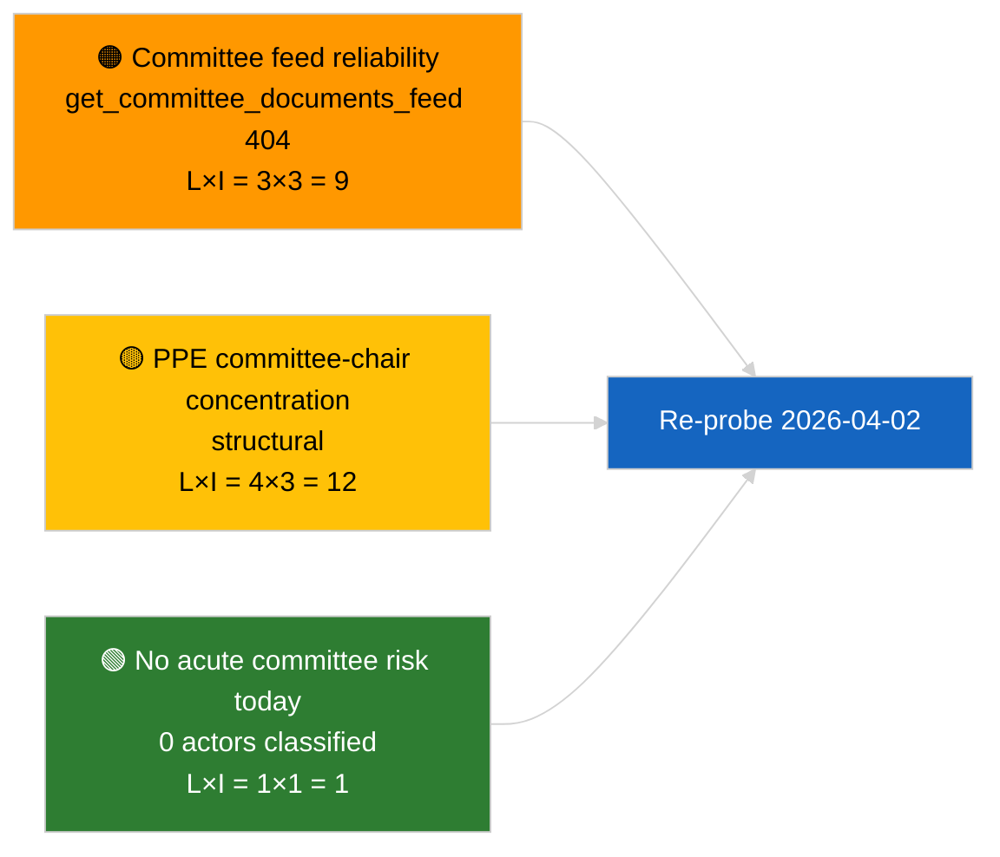
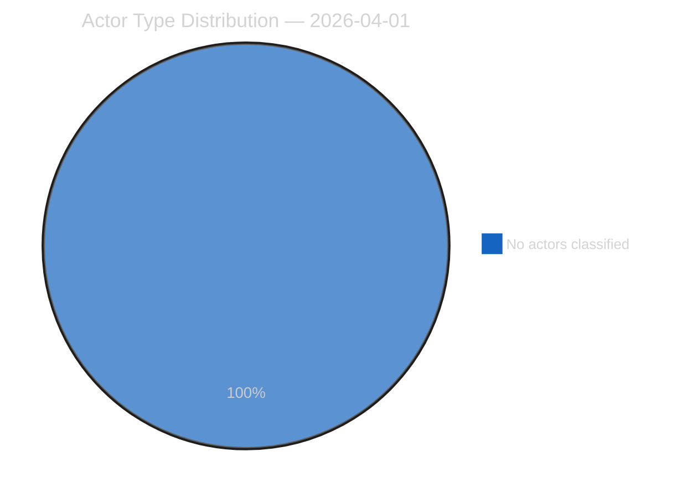
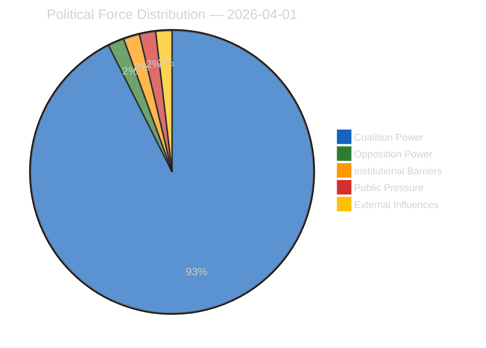
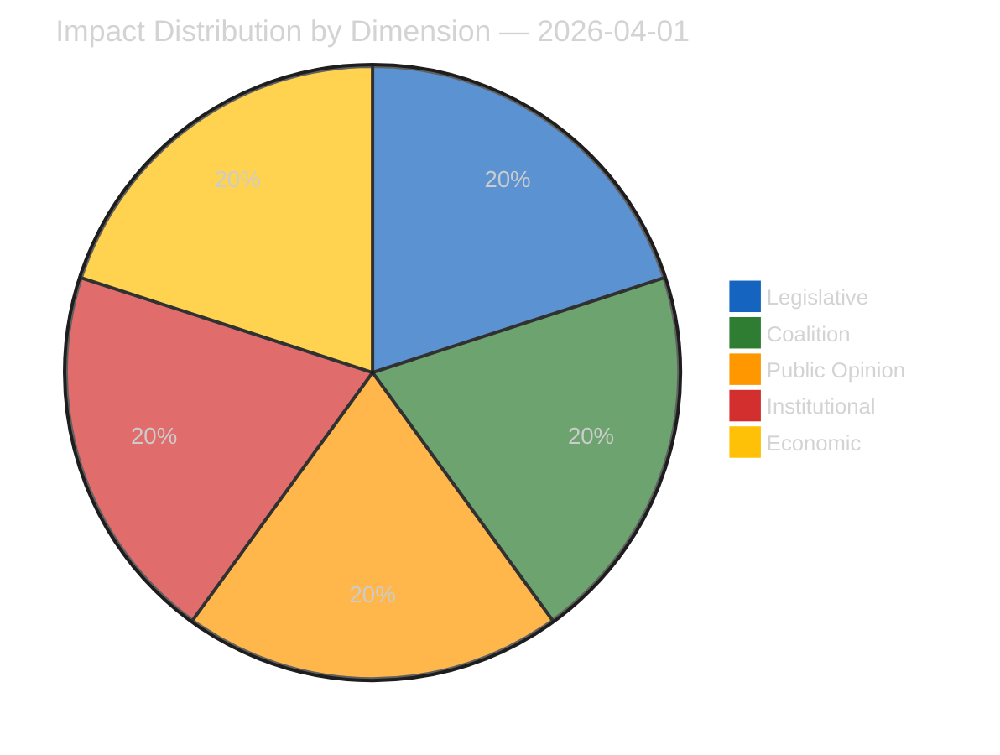
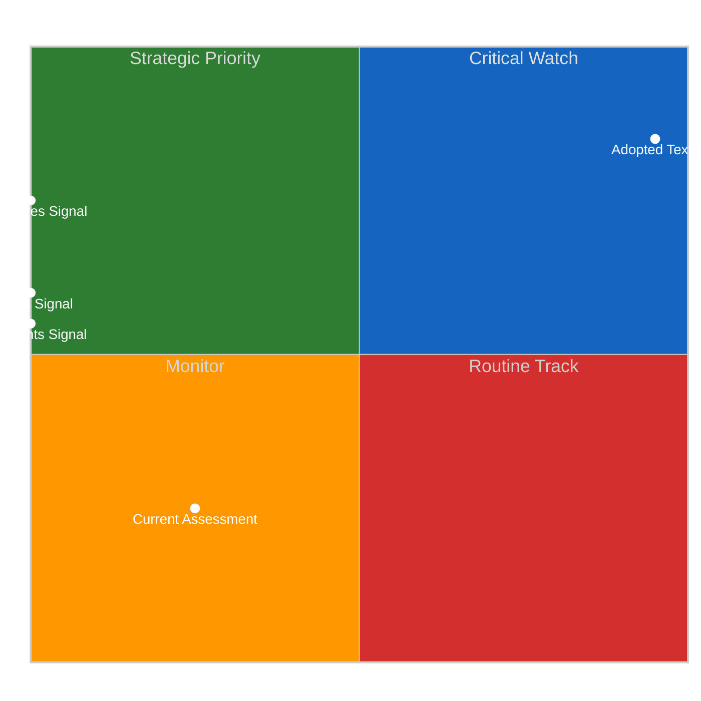
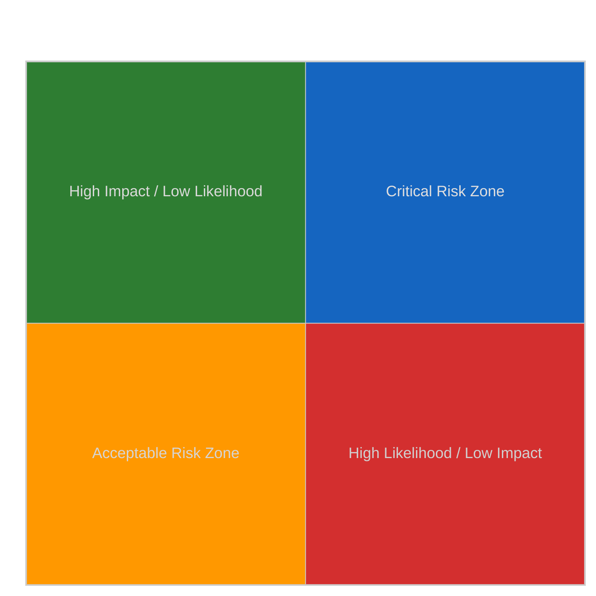
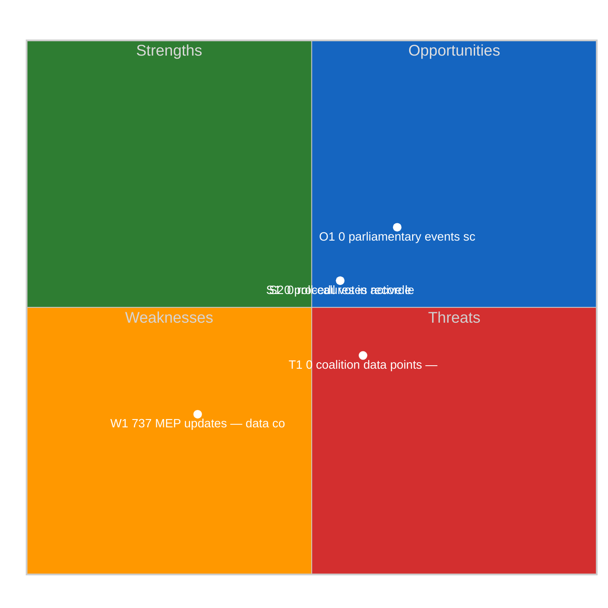
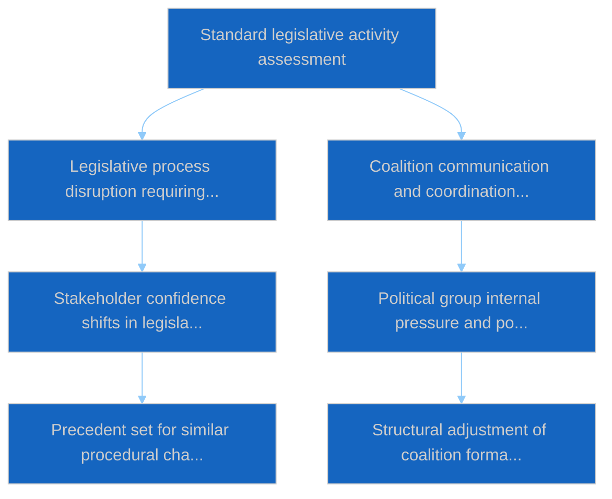

# Committee Reports — 2026-04-01

<h2 id="section-executive-brief">Executive Brief</h2>

### 🎯 BLUF

**No new committee reports identified for 2026-04-01; first full day of post-March committee recess.** Run `64ada77d-c1f3-48f7-804d-be58857d0f18` returned **0 classified actors** and **ROUTINE** significance across all five impact dimensions, consistent with the EP10 inter-sessional calendar (committees do not formally sit during plenary-recess weeks unless extraordinarily convened). The substantive committee-reports baseline therefore remains the carry-over from March: ECON's ECB Vice-President file (TA-10-2026-0060), TRAN/ENVI HDV emission-credits report (TA-10-2026-0084), and JURI's Braun immunity dossier (TA-10-2026-0088). **🟢 HIGH confidence** the empty state is calendar-driven.

---

### 🧭 3 Decisions This Brief Supports

| # | Decision | Who Decides | Deadline | Evidence |
|:-:|----------|-------------|:--------:|----------|
| 1 | **Editorial:** SKIP committee-reports daily; produce week-recap | Editor | +24h | Empty run output |
| 2 | **Monitoring:** add `get_committee_documents_feed` to next-cycle health probe (404 on 2026-04-01) | Data pipeline | 2026-04-02 | Feed availability anomaly |
| 3 | **Forward-watch:** flag committee work-week 13-17 April for first substantive committee-reports cycle | Analysis lead | 2026-04-13 | Pre-plenary committee drafts |

---

### 📰 60-Second Read

- 🔴 **No committee documents in today's feed** — `get_committee_documents_feed` returned 404 in concurrent breaking-news run. (🟡 Medium — endpoint health is the qualifier, not absence of work)
- 🟠 **0 actors classified** in this committee-reports run; no rapporteurs, shadow rapporteurs, or committee chairs identified. (🟢 High)
- 🟢 **Committee carry-over baseline:** ECON (ECB), TRAN/ENVI (HDV emissions), JURI (immunity), AFET (Georgia) remain the active March-into-Q2 portfolios. (🟢 High)
- 🟡 **Risk dimensions all "none"** — no acute committee-stage risk flagged today. (🟢 High)
- 🔵 **Economic context:** ECON's ECB Vice-President confirmation provides Q2 institutional anchor. (🟢 High)
- 🟣 **Cross-reference:** sibling 2026-04-01/breaking article documents the 6/8 advisory-feed 404 pattern that explains the data absence here. (🟢 High)
- 🩷 **Disruption vector:** none acute; structural PPE-dominance and committee-chair concentration risks inherited. (🟡 Medium)
- ⚪ **Carry-forward:** EU-Mercosur INTA file awaiting ECJ opinion; CULT/EMPL pipeline yet to fully emerge for Q2.

---

### 🗂️ Top Documents / Procedures Table

| Rank | EP reference | Title (short) | Significance | Confidence | Status |
|:----:|--------------|---------------|:------------:|:----------:|--------|
| 1 | — | No committee reports on 2026-04-01 | 0.0 | 🟢 HIGH | Recess — no activity |
| 2 | TA-10-2026-0060 | ECON — ECB Vice-President (carry-over) | 7.5 | 🟢 HIGH | Adopted 10 March; baseline |
| 3 | TA-10-2026-0084 | TRAN/ENVI — HDV emission credits (carry-over) | 7.0 | 🟢 HIGH | Adopted 12 March; transposition watch |

---

### ⚠️ Risk & Threat Snapshot

| Risk | L | I | Score | Trigger | Source | Admiralty |
|------|:-:|:-:|:-----:|---------|--------|:---------:|
| Committee feed-API reliability | 3 | 3 | 9 | Sustained 404 in next cycle | Sibling breaking run | B2 |
| PPE committee-chair concentration | 4 | 3 | 12 | Q2 rapporteur appointments | Structural | A2 |
| HDV transposition disputes | 2 | 3 | 6 | National-level pushback | TA-10-2026-0084 | A1 |

---

### 🔮 Top Forward Trigger

**Committee work-week 13-17 April 2026.** Committee draft reports and shadow-rapporteur negotiations during this window pre-determine the substance of the 27-30 April Strasbourg agenda; the first substantive committee-reports cycle of Q2 will land here.

---

### 🛡️ Source Quality Assessment

- **Primary sources:** EP Open Data Portal `get_committee_documents_feed` (404 on 2026-04-01 per concurrent runs) and analysis run `64ada77d-c1f3-48f7-804d-be58857d0f18` classification output (0 actors).
- **Data limitations:** Feed unavailability prevents independent corroboration of "no activity" — confidence on absence of new committee documents is 🟡 medium pending next-cycle probe.
- **Confidence on calendar-driven inactivity:** 🟢 HIGH.

---

### 📎 Links

| Link | Path |
|------|------|
| Article | `./article.md` |
| Classification (empty) | `./classification/` |
| Risk scoring | `./risk-scoring/` |
| Sibling breaking run | `analysis/daily/2026-04-01/breaking/` |
| Manifest | `./manifest.json` |

---

### 🔄 Cross-Reference

**Concurrent runs:** 2026-04-01 breaking / month-ahead / motions / propositions — all show the same empty-template pattern, confirming this is a system-wide recess-period state, not a committee-reports-specific failure.

**Delta from prior runs:** Pre-recess committee activity (Strasbourg week 9-12 March, Brussels mini-plenary 25-26 March) was substantive; the recess transition is the explanatory variable, not a regression.

---

**Document Control**
- **Template:** `/analysis/templates/executive-brief.md`
- **Artifact path:** `analysis/daily/2026-04-01/committee-reports/executive-brief.md`
- **Classification:** Public
- **Retrospective generation:** Back-fill session.

<h2 id="reader-intelligence-guide">Reader Intelligence Guide</h2>

Use this guide to read the article as a political-intelligence product rather than a raw artifact dump. High-value reader lenses appear first; technical provenance remains available in the audit appendices.

| Reader need | What you'll get | Source artifact |
|---|---|---|
| [BLUF and editorial decisions](#section-executive-brief) | fast answer to what happened, why it matters, who is accountable, and the next dated trigger | `executive-brief.md` |
| [Actors and forces](#section-actors-forces) | who is driving the story, what political forces line up behind them, and which institutional levers they can pull | `classification/actor-mapping.md` |
| [Coalitions and voting](#section-coalitions-voting) | political group alignment, voting evidence, and coalition pressure points | `existing/voting-patterns.md` |
| [Risk assessment](#section-risk) | policy, institutional, coalition, communications, and implementation risk register | `risk-scoring/risk-matrix.md` |
| [Threat landscape](#section-threat) | hostile actors, attack vectors, consequence trees, and legislative-disruption pathways | `threat-assessment/actor-threat-profiles.md` |
| [Cross-run continuity](#section-continuity) | what changed since prior sessions and how confidence shifted between runs | `existing/cross-session-intelligence.md` |
| [Deep analysis](#section-deep-analysis) | long-form Economist-style explanation for readers who want the full argument | `existing/deep-analysis.md` |
| [Supplementary intelligence](#section-supplementary-intelligence) | additional markdown discovered in the run that has not yet been assigned to a canonical section | `executive-brief_ar.md` |

<h2 id="section-actors-forces">Actors & Forces</h2>

### Actor Mapping

### Actors Identified: 0

### Actor Classification

| Actor | Type | Influence | Position | Role |
|-------|------|-----------|----------|------|
| — | — | — | — | — |

### Type Counts

| Type | Count |
|------|-------|
| — | 0 |

### Date: 2026-04-01

### Forces Analysis

### Forces Data

| Force | Trend | Strength | Key Actors | Confidence |
|-------|-------|----------|------------|------------|
| Coalition Power | stable | 50% | — | low |
| Opposition Power | stable | 0% | — | low |
| Institutional Barriers | stable | 0% | — | low |
| Public Pressure | stable | 0% | — | low |
| External Influences | stable | 0% | — | low |

### Balance

| Metric | Value |
|--------|-------|
| Coalition vs Opposition | 50% vs 1% |
| Dominant force | Coalition |
| Date | 2026-04-01 |

### Date: 2026-04-01

### Impact Matrix

### Overall Significance: **ROUTINE**

### Impact Dimensions

| Dimension | Level | Indicator | Numeric |
|-----------|-------|-----------|---------|
| Legislative | none | 🟢 | 5 |
| Coalition | none | 🟢 | 5 |
| Public Opinion | none | 🟢 | 5 |
| Institutional | none | 🟢 | 5 |
| Economic | none | 🟢 | 5 |

### Summary

| Metric | Value |
|--------|-------|
| Overall significance | ROUTINE |
| Highest impact | Legislative |
| Date | 2026-04-01 |

### Date: 2026-04-01

### Significance Assessment

### Overall Significance: **ROUTINE**

### 5-Signal Model Scores

| Signal | Raw Data | Score |
|--------|----------|-------|
| Volume | 0 events, 0 documents | 0.0/5 |
| Pipeline | 0 procedures | 0.0/5 |
| Output | 242 adopted texts | 5.0/5 |
| Anomalies | Pattern deviation detection | — |
| Coalition | Group alignment analysis | — |

### Data Summary

| Metric | Value |
|--------|-------|
| Computed significance | ROUTINE |
| Total data points | 242 |
| Events | 0 |
| Documents | 0 |
| Procedures | 0 |
| Adopted texts | 242 |
| Date | 2026-04-01 |

### Date: 2026-04-01

<h2 id="section-coalitions-voting">Coalitions & Voting</h2>

### Voting Patterns

### Overview
Detection and analysis of voting trends across European Parliament proceedings.

### Detected Trends
| Trend ID | Direction | Confidence | Data Points |
|----------|-----------|------------|-------------|
| No trend data available | — | — | — |

### Summary
- **Trends identified**: 0
- **Records analysed**: 0
- **Date**: 2026-04-01

<h2 id="section-risk">Risk Assessment</h2>

### Risk Matrix

### Overview

Quantitative risk scoring across 0 identified political dimensions.
This matrix uses a standardized likelihood × impact framework to quantify and
prioritize political risks affecting the European Parliament legislative process.

### Risk Heat Map

### Risk Matrix

| Risk ID | Description | Likelihood | Impact | Score | Level |
|---------|-------------|------------|--------|-------|-------|
| — | — | — | — | — | — |

> **Risk Score** = Likelihood × Impact. **Levels**: 🟢 LOW (≤1.0), 🟡 MEDIUM (≤2.0), 🟠 HIGH (≤3.5), 🔴 CRITICAL (>3.5)

### Risk Assessment Details

| — | — | — | — | — | — |

### Risk Mitigation Framework

| Risk Level | Count | Tolerance | Action Required |
|------------|-------|-----------|-----------------|
| 🔴 CRITICAL | 0 | Zero tolerance | Immediate escalation |
| 🟠 HIGH | 0 | Low tolerance | Active mitigation |
| 🟡 MEDIUM | 0 | Moderate | Enhanced monitoring |
| 🟢 LOW | 0 | Acceptable | Routine tracking |

### Date: 2026-04-01

### Quantitative Swot

### Executive Summary

**Strategic Position Score**: 3.4/10
**Overall Assessment**: Weak strategic position: weaknesses and threats dominate — urgent mitigation needed.
**Analysis Date**: 2026-04-01

> This SWOT analysis is derived from 0 procedures, 0 events, 242 adopted texts, 0 documents, 0 voting records, and 0 coalition data points fetched from the European Parliament.

### SWOT Quadrant Chart

### SWOT Overview

| Category | Items | Avg Score | Trend |
|----------|-------|-----------|-------|
| 🟢 Strengths | 2 | 0.0 | stable |
| 🔴 Weaknesses | 1 | 2.0 | stable |
| 🔵 Opportunities | 1 | 1.5 | stable |
| 🟠 Threats | 1 | 0.9 | stable |

### 🟢 Strengths

#### S1: 0 procedures in active legislative pipeline
- **Score**: 0.0/5
- **Confidence**: low
- **Trend**: stable
- **Evidence**:
  - 0 procedures tracked in current period
  - 242 texts adopted
  - 0 documents published

#### S2: 0 roll-call votes recorded with 0 questions
- **Score**: 0.0/5
- **Confidence**: low
- **Trend**: stable
- **Evidence**:
  - 0 voting records available
  - 0 parliamentary questions filed
  - 737 MEP activity updates

### 🔴 Weaknesses

#### W1: 737 MEP updates — data coverage gap assessment
- **Score**: 2.0/5
- **Confidence**: medium
- **Trend**: stable
- **Evidence**:
  - 737 MEP updates in current period
  - 0 documents vs 0 procedures ratio
  - Data freshness depends on EP feed update frequency

### 🔵 Opportunities

#### O1: 0 parliamentary events scheduled
- **Score**: 1.5/5
- **Confidence**: medium
- **Trend**: stable
- **Evidence**:
  - 0 events in analysis period
  - 242 texts adopted indicates legislative throughput
  - 0 procedures in various stages

### 🟠 Threats

#### T1: 0 coalition data points — cohesion monitoring
- **Score**: 0.9/5
- **Confidence**: low
- **Trend**: stable
- **Evidence**:
  - 0 coalition observations recorded
  - Cross-reference with 0 voting records
  - 0 procedures may be affected by coalition shifts

### Cross-Impact Matrix

| Interaction | Net Effect | Rationale |
|-------------|-----------|----------|
| strength #1 × threat #1 | 0.00 | Strength "0 procedures in active legislative pipeline" partially mitigates threat "0 coalition data points — cohesion monitoring" |
| strength #2 × threat #1 | 0.00 | Strength "0 roll-call votes recorded with 0 questions" partially mitigates threat "0 coalition data points — cohesion monitoring" |
| weakness #1 × threat #1 | 0.30 | Weakness "737 MEP updates — data coverage gap assessment" amplifies threat "0 coalition data points — cohesion monitoring" |

### Strategic Priorities Matrix

### Data Summary

| Data Source | Count |
|-------------|-------|
| Procedures | 0 |
| Events | 0 |
| Documents | 0 |
| Voting Records | 0 |
| Adopted Texts | 242 |
| Coalitions | 0 |
| Questions | 0 |
| MEP Updates | 737 |
| **Total Data Points** | **242** |

### Date: 2026-04-01

### Political Capital Risk

### Data Inventory for Capital Risk Assessment
| Data Source | Count | Relevance |
|-------------|-------|-----------|
| Coalition data points | 0 | Group cohesion indicators |
| Voting records | 0 | Voting alignment metrics |
| Voting patterns | 0 | Trend and anomaly data |
| Active procedures | 0 | Legislative engagement |

### Date: 2026-04-01

### Legislative Velocity Risk

### Overview
Risk assessment based on legislative processing speed for 0 procedures.

### Top Velocity Risks
| Procedure | Title | Stage | Days (actual/expected) | Risk Score | Level |
|-----------|-------|-------|----------------------|------------|-------|
| — | — | — | — | — | — |

### Summary
- **Procedures analysed**: 0
- **High/Critical risks**: 0
- **Date**: 2026-04-01

### Agent Risk Workflow

### Risk Heat Map

| Impact ↓ / Likelihood → | Rare | Unlikely | Possible | Likely | Almost Certain |
|--------------------------|------|----------|----------|--------|----------------|
| **Severe** | 🟢 | 🟡 | 🟠 | 🟠 | 🔴 |
| **Major** | 🟢 | 🟡 | 🟡 | 🟠 | 🔴 |
| **Moderate** | 🟢 | 🟢 | 🟡 | 🟠 | 🟠 |
| **Minor** | 🟢 | 🟢 | 🟢 | 🟡 | 🟡 |
| **Negligible** | 🟢 | 🟢 | 🟢 | 🟢 | 🟢 |

### Identified Risks

#### RISK-W00: Baseline political risk
- **Likelihood**: rare (0.1) | **Impact**: minor (2) | **Score**: 0.2 (LOW) | **Confidence**: low
- **Evidence**: Routine parliamentary activity
- **Mitigating Factors**: Stable institutional framework

### Risk Evaluation Matrix

| Rank | Risk ID | Description | Score | Level | Confidence |
|------|---------|-------------|-------|-------|------------|
| 1 | RISK-W00 | Baseline political risk | 0.2 | LOW | low |

### Risk Treatment Plan

- Monitor legislative velocity indicators
- Track coalition voting patterns

### Recommendations

- Monitor legislative velocity indicators
- Track coalition voting patterns

<h2 id="section-threat">Threat Landscape</h2>

### Actor Threat Profiles

### Overview
Individual threat profiles for 0 political actors.

### Actor Threat Matrix
| Actor | Type | Capability | Motivation | Opportunity | Threat Level |
|-------|------|------------|------------|-------------|--------------|
| — | — | — | — | — | — |

### Date: 2026-04-01

### Consequence Trees

### Overview
Structured analysis of action-consequence chains for 0 legislative procedures.

### No procedures available for consequence analysis

### Date: 2026-04-01

### Legislative Disruption

### Overview
Identification of factors disrupting the normal legislative process.

### Disruption Assessment
| Procedure ID | Title | Stage | Resilience | Disruption Points |
|-------------|-------|-------|-----------|-------------------|
| — | — | — | — | — |

### Date: 2026-04-01

### Political Threat Landscape

### Political Threat Landscape Analysis

#### Coalition Shifts
**Threat Level**: 🟢 Low

Coalition stability appears maintained. No significant realignment signals.

**Evidence:**
- No coalition shift signals detected in available data

#### Transparency Deficit
**Threat Level**: ⚠️ Moderate

Transparency concerns at moderate level. Review committee meeting records and public documentation.

**Evidence:**
- No committee activity data available — potential information gap

#### Policy Reversal
**Threat Level**: 🟢 Low

Legislative trajectory appears stable. No major reversal signals.

**Evidence:**
- No significant policy reversal signals detected

#### Institutional Pressure
**Threat Level**: 🟢 Low

Institutional balance appears maintained. Power distribution within normal parameters.

**Evidence:**
- No institutional threat signals detected

#### Legislative Obstruction
**Threat Level**: 🟢 Low

Legislative pace within normal parameters. No obstruction signals.

**Evidence:**
- No significant legislative delay signals detected

#### Democratic Erosion
**Threat Level**: 🟢 Low

Democratic norms appear stable. Institutional processes functioning within expected parameters.

**Evidence:**
- Democratic norms appear stable. No systematic erosion signals.

### Actor Threat Profiles

*No actor threat profiles generated from available data.*

### Consequence Trees

#### Consequence Tree: Standard legislative activity assessment

**Mitigating Factors:**
- Institutional resilience mechanisms
- Cross-party dialogue channels

**Amplifying Factors:**
- No significant amplifying factors identified

### Legislative Disruption Analysis

#### Procedure: General legislative pipeline

**Current Stage**: proposal | **Resilience**: high

| Stage | Threat Category | Likelihood | Risk Level |
|-------|----------------|------------|------------|
| proposal | delay | 8% | 🟢 Low |
| committee | transparency | 18% | 🟢 Low |
| plenary first reading | shift | 22% | 🟢 Low |
| council position | delay | 12% | 🟢 Low |
| plenary second reading | shift | 21% | 🟢 Low |
| conciliation | reversal | 17% | 🟢 Low |
| adoption | delay | 5% | 🟢 Low |

**Alternative Pathways:**
- Commission resubmission with revised proposal
- Enhanced informal trilogue engagement
- Interim resolution as procedural bridge

### Key Findings

- No high-priority threats detected across threat landscape dimensions

### Recommendations

- Continue routine monitoring of parliamentary activity

---
*Assessment generated by EU Parliament Monitor Political Threat Assessment Pipeline.*  
*Based on public European Parliament data. GDPR-compliant.*

<h2 id="section-continuity">Cross-Run Continuity</h2>

### Cross Session Intelligence

### Overview
Analysis of coalition stability patterns across multiple plenary sessions.

### Stability Report
- **Overall Stability**: 0.0%
- **Forecast**: volatile
- **Patterns Analysed**: 0

### Group Analysis
- **Stable Groups**: None identified
- **Declining Groups**: None identified

### Date: 2026-04-01

<h2 id="section-deep-analysis">Deep Analysis</h2>

### Raw Data Inventory
| Data Source | Count |
|-------------|-------|
| Events | 0 |
| Procedures | 0 |
| Documents | 0 |
| Adopted Texts | 242 |
| Questions | 0 |
| MEP Updates | 737 |
| **Total** | **979** |

### Stakeholder Groups for AI Analysis
| Stakeholder Group | Data Points Available |
|-------------------|---------------------|
| Political Groups | 242 (procedures + adopted texts) |
| Civil Society | 0 (documents + questions) |
| Industry | 0 (procedures) |
| National Governments | 242 (adopted texts) |
| Citizens | 737 (questions + MEP updates) |
| EU Institutions | 0 (events + procedures) |

### Date: 2026-04-01

<h2 id="section-supplementary-intelligence">Supplementary Intelligence</h2>

### Executive Brief Ar

**التصنيف:** OSINT | سجل برلماني عام
**مستوى الثقة:** 🟢 مرتفع (تقييم هيكلي خلال فترة الاستراحة)
**تاريخ الإصدار:** 2026-04-01T00:00:00Z (موجز استرجاعي)
**نوع المقالة:** تقارير اللجان
**معرّف التشغيل:** `64ada77d-c1f3-48f7-804d-be58857d0f18`
**المصدر:** بوابة البيانات المفتوحة للبرلمان الأوروبي

---

### 🎯 BLUF

**لم يُحدَّد أي تقرير للجان جديد بتاريخ 2026-04-01؛ أول يوم كامل لاستراحة اللجان عقب مارس.** أسفر التشغيل `64ada77d-c1f3-48f7-804d-be58857d0f18` عن **0 جهات فاعلة مصنَّفة** وأهمية **اعتيادية** عبر جميع أبعاد التأثير الخمسة، وهو ما يتسق مع التقويم بين الدورات للبرلمان الأوروبي EP10 (لا تجتمع اللجان رسمياً خلال أسابيع استراحة الجلسة العامة إلا إذا دُعيت في اجتماع استثنائي). وبالتالي تبقى خط الأساس الموضوعي لتقارير اللجان هو الترحيل من مارس: ملف ECON المتعلق بنائب رئيس البنك المركزي الأوروبي (TA-10-2026-0060)، وتقرير TRAN/ENVI حول ائتمانات انبعاثات المركبات الثقيلة (TA-10-2026-0084)، وملف حصانة براون لدى JURI (TA-10-2026-0088). **🟢 ثقة مرتفعة** في أن الحالة الفارغة مدفوعة بالتقويم.

---

### 🧭 3 قرارات يدعمها هذا الموجز

| # | القرار | صاحب القرار | الموعد النهائي | الأدلة |
|:-:|--------|-------------|:--------------:|--------|
| 1 | **تحريري:** تخطي تقرير اللجان اليومي؛ إنتاج ملخص أسبوعي | المحرر | +24 ساعة | ناتج تشغيل فارغ |
| 2 | **المراقبة:** إضافة `get_committee_documents_feed` إلى فحص الحالة في الدورة القادمة (خطأ 404 بتاريخ 2026-04-01) | خط البيانات | 2026-04-02 | شذوذ توفر التغذية |
| 3 | **الرصد الاستشرافي:** وضع علامة على أسبوع عمل اللجان 13-17 أبريل كأول دورة جوهرية لتقارير اللجان | مسؤول التحليل | 2026-04-13 | مسودات اللجان قبيل الجلسة العامة |

---

### 📰 قراءة في 60 ثانية

- 🔴 **لا توجد وثائق للجان في تغذية اليوم** — أعادت `get_committee_documents_feed` خطأ 404 في تشغيل الأخبار المتوازي. (🟡 متوسط — صحة نقطة النهاية هي المحدد، لا غياب العمل)
- 🟠 **0 جهات فاعلة مصنَّفة** في هذا التشغيل لتقارير اللجان؛ لم يُحدَّد أي مقرر أو مقرر ظل أو رئيس لجنة. (🟢 مرتفع)
- 🟢 **خط الأساس الترحيلي للجان:** ECON (البنك المركزي الأوروبي)، TRAN/ENVI (انبعاثات HDV)، JURI (الحصانة)، AFET (جورجيا) تبقى المحافظ النشطة من مارس إلى الربع الثاني. (🟢 مرتفع)
- 🟡 **أبعاد المخاطر جميعها "لا شيء"** — لا خطر حاد في مرحلة اللجنة اليوم. (🟢 مرتفع)
- 🔵 **السياق الاقتصادي:** تأكيد ECON لنائب رئيس البنك المركزي الأوروبي يوفر نقطة ارتكاز مؤسسية للربع الثاني. (🟢 مرتفع)
- 🟣 **الإسناد المتقاطع:** مقالة 2026-04-01/breaking الشقيقة توثق نمط 404 في 6/8 من تغذيات الاستشارات مما يفسر غياب البيانات هنا. (🟢 مرتفع)
- 🩷 **ناقل الاضطراب:** لا حاد؛ مخاطر هيكلية موروثة من هيمنة PPE وتركز رئاسة اللجان. (🟡 متوسط)
- ⚪ **الترحيل:** ملف INTA EU-Mercosur في انتظار رأي محكمة العدل الأوروبية؛ خط أنابيب CULT/EMPL لم يتبلور بعد للربع الثاني.

---

### 🗂️ جدول أبرز الوثائق / الإجراءات

| الترتيب | مرجع البرلمان الأوروبي | العنوان (مختصر) | الأهمية | الثقة | الحالة |
|:-------:|----------------------|-----------------|:-------:|:-----:|--------|
| 1 | — | لا تقارير للجان بتاريخ 2026-04-01 | 0.0 | 🟢 مرتفع | استراحة — لا نشاط |
| 2 | TA-10-2026-0060 | ECON — نائب رئيس البنك المركزي الأوروبي (ترحيل) | 7.5 | 🟢 مرتفع | اعتُمد في 10 مارس؛ خط الأساس |
| 3 | TA-10-2026-0084 | TRAN/ENVI — ائتمانات انبعاثات HDV (ترحيل) | 7.0 | 🟢 مرتفع | اعتُمد في 12 مارس؛ متابعة النقل |

---

### ⚠️ لقطة المخاطر والتهديدات

<!-- mermaid block deduplicated: identical to earlier occurrence (hash=40eeaf52) -->

| المخاطر | ا | ش | الدرجة | المحفز | المصدر | درجة الأميرالية |
|---------|:-:|:-:|:------:|--------|--------|:---------------:|
| موثوقية API تغذية اللجان | 3 | 3 | 9 | خطأ 404 مستمر في الدورة التالية | تشغيل breaking الشقيق | B2 |
| تركز رئاسة اللجان في PPE | 4 | 3 | 12 | تعيينات مقررين الربع الثاني | هيكلي | A2 |
| نزاعات نقل HDV | 2 | 3 | 6 | مقاومة وطنية | TA-10-2026-0084 | A1 |

---

### 🔮 المحفز الاستشرافي الأول

**أسبوع عمل اللجان 13-17 أبريل 2026.** مسودات تقارير اللجان ومفاوضات المقررين الظل خلال هذه الفترة تحدد مسبقاً محتوى جدول أعمال ستراسبورغ في الفترة 27-30 أبريل؛ ستبدأ هنا أول دورة جوهرية لتقارير اللجان في الربع الثاني.

---

### 🛡️ تقييم جودة المصادر

- **المصادر الأولية:** بوابة البيانات المفتوحة للبرلمان الأوروبي `get_committee_documents_feed` (خطأ 404 بتاريخ 2026-04-01 وفقاً للتشغيلات المتوازية) وناتج تصنيف تشغيل التحليل `64ada77d-c1f3-48f7-804d-be58857d0f18` (0 جهات فاعلة).
- **قيود البيانات:** يمنع عدم توفر التغذية التحقق المستقل من "لا نشاط" — مستوى الثقة في غياب وثائق اللجان الجديدة 🟡 متوسط في انتظار مسح الدورة التالية.
- **الثقة في عدم النشاط القائم على التقويم:** 🟢 مرتفع.

---

### 📎 الروابط

| الرابط | المسار |
|--------|--------|
| المقالة | `./article.md` |
| التصنيف (فارغ) | `./classification/` |
| تسجيل المخاطر | `./risk-scoring/` |
| تشغيل breaking الشقيق | `analysis/daily/2026-04-01/breaking/` |
| البيان | `./manifest.json` |

---

### 🔄 الإسناد المتقاطع

**التشغيلات المتزامنة:** 2026-04-01 breaking / month-ahead / motions / propositions — تُظهر جميعها نفس نمط القالب الفارغ، مما يؤكد أن هذه حالة فترة استراحة على مستوى النظام بأكمله، وليست إخفاقاً خاصاً بتقارير اللجان.

**الفارق عن التشغيلات السابقة:** كان نشاط اللجان قبيل الاستراحة (أسبوع ستراسبورغ 9-12 مارس، الجلسة العامة المصغرة ببروكسل 25-26 مارس) جوهرياً؛ التحول إلى الاستراحة هو المتغير التفسيري، لا تراجعاً في الأداء.

---

**مراقبة الوثائق**
- **القالب:** `/analysis/templates/executive-brief.md`
- **مسار القطعة الأثرية:** `analysis/daily/2026-04-01/committee-reports/executive-brief.md`
- **التصنيف:** عام
- **الإنشاء الاسترجاعي:** جلسة تعبئة خلفية.

### Executive Brief Da

### 🎯 BLUF

**Ingen nye udvalgsrapporter identificeret for 2026-04-01; første hele dag af post-marts udvalgsrecessen.** Kørsel `64ada77d-c1f3-48f7-804d-be58857d0f18` returnerede **0 klassificerede aktører** og **RUTINE** betydning på tværs af alle fem påvirkningsdimensioner, i overensstemmelse med EP10's intersessionelle kalender (udvalg sidder ikke formelt under plenarrecesperioder medmindre de er ekstraordinært indkaldt). Den substantielle baslinje for udvalgsrapporter er derfor carry-over fra marts: ECON's fil om ECB's vicepræsident (TA-10-2026-0060), TRAN/ENVI's HDV-emissionskredit-rapport (TA-10-2026-0084) og JURI's Braun-immunitetsmappe (TA-10-2026-0088). **🟢 HØJ tillid** til at den tomme tilstand er kalender-drevet.

---

### 🧭 3 Beslutninger som Briefingen Støtter

| # | Beslutning | Hvem Bestemmer | Deadline | Bevis |
|:-:|------------|----------------|:--------:|-------|
| 1 | **Redaktionelt:** SPRING daglig udvalgsrapport over; producér ugeoversigt | Redaktør | +24h | Tom kørselsoutput |
| 2 | **Overvågning:** tilføj `get_committee_documents_feed` til næste cyklus' sundhedsprøve (404 den 2026-04-01) | Datapipeline | 2026-04-02 | Feed-tilgængeligheds-anomali |
| 3 | **Fremtidsovervågning:** markér udvalgets arbejdsuge 13-17 april for første substantielle udvalgsrapportscyklus | Analysechef | 2026-04-13 | Pre-plenary udvalgsudkast |

---

### 📰 60-Sekunders Læsning

- 🔴 **Ingen udvalgs-dokumenter i dagens feed** — `get_committee_documents_feed` returnerede 404 i parallel nyhedskørsel. (🟡 Middel — slutpunktens sundhed er kvalificereren, ikke fraværet af arbejde)
- 🟠 **0 aktører klassificeret** i denne udvalgsrapportskørsel; ingen ordførere, skyggeordførere eller udvalgsformænd identificeret. (🟢 Høj)
- 🟢 **Udvalgets carry-over-baslinje:** ECON (ECB), TRAN/ENVI (HDV-emissioner), JURI (immunitet), AFET (Georgien) forbliver de aktive marts-til-Q2-porteføljer. (🟢 Høj)
- 🟡 **Risikodimensioner alle "ingen"** — ingen akut udvalgsstadie-risiko flagget i dag. (🟢 Høj)
- 🔵 **Økonomisk kontekst:** ECON's bekræftelse af ECB's vicepræsident giver institutionelt anker for Q2. (🟢 Høj)
- 🟣 **Krydsreference:** søster 2026-04-01/breaking-artikel dokumenterer 6/8 rådgivnings-feed 404-mønsteret, der forklarer dataabsensen her. (🟢 Høj)
- 🩷 **Forstyrrelsesvektor:** ingen akut; strukturelle PPE-dominans- og udvalgsformands-koncentrationsrisici arvet. (🟡 Middel)
- ⚪ **Carry-forward:** EU-Mercosur INTA-fil afventer EF-Domstolens udtalelse; CULT/EMPL-pipeline endnu ikke fuldt fremkommet for Q2.

---

### 🗂️ Tabel over Topdokumenter / Procedurer

| Rang | EP-reference | Titel (kort) | Betydning | Tillid | Status |
|:----:|--------------|--------------|:---------:|:------:|--------|
| 1 | — | Ingen udvalgsrapporter 2026-04-01 | 0,0 | 🟢 HØJ | Recess — ingen aktivitet |
| 2 | TA-10-2026-0060 | ECON — ECB vicepræsident (carry-over) | 7,5 | 🟢 HØJ | Vedtaget 10. marts; baslinje |
| 3 | TA-10-2026-0084 | TRAN/ENVI — HDV-emissionskreditter (carry-over) | 7,0 | 🟢 HØJ | Vedtaget 12. marts; transpositionsovervågning |

---

### ⚠️ Risiko- og Trussel-Snapshot

<!-- mermaid block deduplicated: identical to earlier occurrence (hash=40eeaf52) -->

| Risiko | L | P | Score | Udløser | Kilde | Admiralitetsgrad |
|--------|:-:|:-:|:-----:|---------|-------|:----------------:|
| Udvalgs-feed-API-pålidelighed | 3 | 3 | 9 | Vedvarende 404 i næste cyklus | Søster breaking-kørsel | B2 |
| PPE udvalgsformands-koncentration | 4 | 3 | 12 | Q2 ordførerindstillinger | Strukturel | A2 |
| HDV transpositionstvist | 2 | 3 | 6 | National modstand | TA-10-2026-0084 | A1 |

---

### 🔮 Ledende Fremtidstrigger

**Udvalgets arbejdsuge 13-17. april 2026.** Udvalgets udkast til betænkninger og skyggeordførernes forhandlinger i dette vindue forudbestemmer substansen i Strasbourg-dagsordenen 27-30. april; den første substantielle udvalgsrapportscyklus i Q2 lander her.

---

### 🛡️ Kildekvalitetsvurdering

- **Primære kilder:** EP's åbne dataportal `get_committee_documents_feed` (404 den 2026-04-01 pr. parallelle kørsler) og analysekørsel `64ada77d-c1f3-48f7-804d-be58857d0f18` klassificeringsoutput (0 aktører).
- **Databegrænsninger:** Feed-utilgængelighed forhindrer uafhængig bekræftelse af "ingen aktivitet" — tillid til fravær af nye udvalgs-dokumenter er 🟡 middel i afventning af næste cyklus' undersøgelse.
- **Tillid til kalender-drevet inaktivitet:** 🟢 HØJ.

---

### 📎 Links

| Link | Sti |
|------|-----|
| Artikel | `./article.md` |
| Klassifikation (tom) | `./classification/` |
| Risikovurdering | `./risk-scoring/` |
| Søster breaking-kørsel | `analysis/daily/2026-04-01/breaking/` |
| Manifest | `./manifest.json` |

---

### 🔄 Krydsreference

**Parallelle kørsler:** 2026-04-01 breaking / month-ahead / motions / propositions — alle viser det samme tomme skabelon-mønster, hvilket bekræfter at dette er en systemomspændende recessionsperiodestilstand, ikke en udvalgsrapports-specifik fejl.

**Delta fra tidligere kørsler:** Pre-recess-udvalgsaktiviteten (Strasbourg-uge 9-12. marts, Bruxelles mini-plenum 25-26. marts) var substantiel; recessionsovergangen er den forklarende variabel, ikke en regression.

---

**Dokumentkontrol**
- **Skabelon:** `/analysis/templates/executive-brief.md`
- **Artefaktsti:** `analysis/daily/2026-04-01/committee-reports/executive-brief.md`
- **Klassifikation:** Offentlig
- **Retrospektiv generering:** Baggrundsoplysningssession.

### Executive Brief De

### 🎯 BLUF

**Keine neuen Ausschussberichte für den 2026-04-01 identifiziert; erster voller Tag der Ausschuss-Recess nach März.** Lauf `64ada77d-c1f3-48f7-804d-be58857d0f18` ergab **0 klassifizierte Akteure** und **ROUTINEBEDEUTUNG** in allen fünf Wirkungsdimensionen, entsprechend dem intersessionellen Kalender des EP10 (Ausschüsse treten während Plenar-Rezesswochen nicht förmlich zusammen, sofern sie nicht außerordentlich einberufen werden). Die inhaltliche Basislinie für Ausschussberichte ist daher der Carry-over aus März: ECONs Akte zum EZB-Vizepräsidenten (TA-10-2026-0060), TRAN/ENVIs Bericht zu HDV-Emissionsgutschriften (TA-10-2026-0084) und JURIs Braun-Immunitätsdossier (TA-10-2026-0088). **🟢 HOHER Konfidenzgrad**, dass der leere Zustand kalenderbedingt ist.

---

### 🧭 3 Entscheidungen, die Dieser Lagebericht Unterstützt

| # | Entscheidung | Wer Entscheidet | Frist | Beweise |
|:-:|--------------|-----------------|:-----:|---------|
| 1 | **Redaktionell:** Täglichen Ausschussbericht ÜBERSPRINGEN; Wochenzusammenfassung erstellen | Redakteur | +24h | Leere Laufausgabe |
| 2 | **Überwachung:** `get_committee_documents_feed` in die Gesundheitsprüfung des nächsten Zyklus aufnehmen (404 am 2026-04-01) | Datenpipeline | 2026-04-02 | Feed-Verfügbarkeitsanomalie |
| 3 | **Vorausschau:** Ausschuss-Arbeitswoche 13.-17. April für den ersten inhaltlichen Ausschussberichtszyklus markieren | Analyseleitung | 2026-04-13 | Vorab-Plenums-Ausschussentwürfe |

---

### 📰 60-Sekunden-Lektüre

- 🔴 **Keine Ausschussdokumente im heutigen Feed** — `get_committee_documents_feed` gab im gleichzeitigen Nachrichtenlauf 404 zurück. (🟡 Mittel — der Gesundheitszustand des Endpunkts ist der Qualifikator, nicht die Abwesenheit von Arbeit)
- 🟠 **0 Akteure klassifiziert** in diesem Ausschussberichtslauf; keine Berichterstatter, Schattenberichterstatter oder Ausschussvorsitzende identifiziert. (🟢 Hoch)
- 🟢 **Ausschuss-Carry-over-Basislinie:** ECON (EZB), TRAN/ENVI (HDV-Emissionen), JURI (Immunität), AFET (Georgien) bleiben die aktiven März-bis-Q2-Portfolios. (🟢 Hoch)
- 🟡 **Risikodimensionen alle „keine"** — kein akutes Ausschussrisiko heute gekennzeichnet. (🟢 Hoch)
- 🔵 **Wirtschaftlicher Kontext:** ECONs Bestätigung des EZB-Vizepräsidenten liefert den institutionellen Anker für Q2. (🟢 Hoch)
- 🟣 **Querverweise:** Geschwister 2026-04-01/breaking-Artikel dokumentiert das 6/8-Beratungsfeed-404-Muster, das den Datenmangel hier erklärt. (🟢 Hoch)
- 🩷 **Störungsfaktor:** kein akuter; strukturelle PPE-Dominanz- und Ausschussvorsitzenden-Konzentrationsrisiken geerbt. (🟡 Mittel)
- ⚪ **Carry-forward:** EU-Mercosur INTA-Akte wartet auf EuGH-Gutachten; CULT/EMPL-Pipeline noch nicht vollständig für Q2 erkennbar.

---

### 🗂️ Tabelle der Top-Dokumente / Verfahren

| Rang | EP-Referenz | Titel (kurz) | Bedeutung | Konfidenz | Status |
|:----:|-------------|--------------|:---------:|:---------:|--------|
| 1 | — | Keine Ausschussberichte 2026-04-01 | 0,0 | 🟢 HOCH | Recess — keine Aktivität |
| 2 | TA-10-2026-0060 | ECON — EZB-Vizepräsident (Carry-over) | 7,5 | 🟢 HOCH | Angenommen 10. März; Basislinie |
| 3 | TA-10-2026-0084 | TRAN/ENVI — HDV-Emissionsgutschriften (Carry-over) | 7,0 | 🟢 HOCH | Angenommen 12. März; Umsetzungsüberwachung |

---

### ⚠️ Risiko- und Bedrohungsübersicht

<!-- mermaid block deduplicated: identical to earlier occurrence (hash=40eeaf52) -->

| Risiko | W | S | Punktzahl | Auslöser | Quelle | Admiralitätsgrad |
|--------|:-:|:-:|:---------:|----------|--------|:----------------:|
| Zuverlässigkeit Ausschuss-Feed-API | 3 | 3 | 9 | Anhaltende 404 im nächsten Zyklus | Geschwister Breaking-Lauf | B2 |
| PPE-Ausschussvorsitzenden-Konzentration | 4 | 3 | 12 | Q2-Berichterstatterernennungen | Strukturell | A2 |
| HDV-Umsetzungsstreitigkeiten | 2 | 3 | 6 | Nationaler Widerstand | TA-10-2026-0084 | A1 |

---

### 🔮 Führender Zukunftsauslöser

**Ausschuss-Arbeitswoche 13.-17. April 2026.** Ausschussentwürfe und Schattenberichterstatter-Verhandlungen in diesem Zeitfenster bestimmen vorab den Inhalt der Straßburger Agenda vom 27.-30. April; der erste inhaltliche Ausschussberichtszyklus von Q2 wird hier beginnen.

---

### 🛡️ Bewertung der Quellenqualität

- **Primärquellen:** Offenes Datenportal des EP `get_committee_documents_feed` (404 am 2026-04-01 gemäß gleichzeitigen Läufen) und Analyselauf `64ada77d-c1f3-48f7-804d-be58857d0f18` Klassifizierungsausgabe (0 Akteure).
- **Datenbeschränkungen:** Feed-Nichtverfügbarkeit verhindert eine unabhängige Bestätigung von „keine Aktivität" — Konfidenz bezüglich des Fehlens neuer Ausschussdokumente ist 🟡 mittel bis zur Überprüfung im nächsten Zyklus.
- **Konfidenz für kalenderbedingte Inaktivität:** 🟢 HOCH.

---

### 📎 Links

| Link | Pfad |
|------|------|
| Artikel | `./article.md` |
| Klassifizierung (leer) | `./classification/` |
| Risikobewertung | `./risk-scoring/` |
| Geschwister Breaking-Lauf | `analysis/daily/2026-04-01/breaking/` |
| Manifest | `./manifest.json` |

---

### 🔄 Querverweise

**Gleichzeitige Läufe:** 2026-04-01 breaking / month-ahead / motions / propositions — alle zeigen das gleiche leere Vorlagenmuster und bestätigen, dass es sich um einen systemweiten Recess-Perioden-Zustand handelt, nicht um ein ausschussberichtsspezifisches Versagen.

**Delta gegenüber früheren Läufen:** Die Ausschussaktivität vor der Recess (Straßburger Woche 9.-12. März, Brüsseler Mini-Plenum 25.-26. März) war substantiell; der Recess-Übergang ist die erklärende Variable, keine Regression.

---

**Dokumentenkontrolle**
- **Vorlage:** `/analysis/templates/executive-brief.md`
- **Artefaktpfad:** `analysis/daily/2026-04-01/committee-reports/executive-brief.md`
- **Klassifizierung:** Öffentlich
- **Retrospektive Erstellung:** Nachfüllungssitzung.

### Executive Brief Es

### 🎯 BLUF

**No se han identificado nuevos informes de comisión para el 2026-04-01; primer día completo del receso de comisiones post-marzo.** La ejecución `64ada77d-c1f3-48f7-804d-be58857d0f18` devolvió **0 actores clasificados** y significación **RUTINARIA** en las cinco dimensiones de impacto, en consonancia con el calendario intersesional del PE10 (las comisiones no se reúnen formalmente durante las semanas de receso plenario salvo convocatoria extraordinaria). La línea de base sustantiva para los informes de comisión es, por tanto, el arrastre de marzo: el expediente de la ECON sobre el Vicepresidente del BCE (TA-10-2026-0060), el informe de TRAN/ENVI sobre los créditos de emisiones HDV (TA-10-2026-0084) y el dossier de inmunidad Braun de la JURI (TA-10-2026-0088). **🟢 ALTA confianza** en que el estado vacío obedece al calendario.

---

### 🧭 3 Decisiones que Apoya Este Informe

| # | Decisión | Decisor | Plazo | Evidencia |
|:-:|----------|---------|:-----:|-----------|
| 1 | **Editorial:** OMITIR informe diario de comisión; producir resumen semanal | Editor | +24h | Salida de ejecución vacía |
| 2 | **Monitoreo:** Agregar `get_committee_documents_feed` a la sonda de salud del próximo ciclo (404 el 2026-04-01) | Canal de datos | 2026-04-02 | Anomalía de disponibilidad del feed |
| 3 | **Vigilancia prospectiva:** Señalar la semana de trabajo de comisiones 13-17 de abril para el primer ciclo sustantivo de informes de comisión | Responsable de análisis | 2026-04-13 | Borradores de comisión pre-plenario |

---

### 📰 Lectura en 60 Segundos

- 🔴 **No hay documentos de comisión en el feed de hoy** — `get_committee_documents_feed` devolvió 404 en la ejecución paralela de noticias. (🟡 Medio — el estado del endpoint es el calificador, no la ausencia de trabajo)
- 🟠 **0 actores clasificados** en esta ejecución de informes de comisión; no se identificaron ponentes, ponentes en la sombra ni presidentes de comisión. (🟢 Alto)
- 🟢 **Línea de base de arrastre de comisión:** ECON (BCE), TRAN/ENVI (emisiones HDV), JURI (inmunidad), AFET (Georgia) siguen siendo las carteras activas de marzo a Q2. (🟢 Alto)
- 🟡 **Dimensiones de riesgo todas «ninguna»** — no se ha señalado riesgo agudo en fase de comisión hoy. (🟢 Alto)
- 🔵 **Contexto económico:** La confirmación del Vicepresidente del BCE por parte de la ECON proporciona el ancla institucional para Q2. (🟢 Alto)
- 🟣 **Referencia cruzada:** el artículo hermano 2026-04-01/breaking documenta el patrón 6/8 de 404 en feeds de asesoría que explica la ausencia de datos aquí. (🟢 Alto)
- 🩷 **Vector de perturbación:** ninguno agudo; riesgos estructurales de dominancia PPE y de concentración en la presidencia de comisiones heredados. (🟡 Medio)
- ⚪ **Arrastre:** expediente INTA EU-Mercosur pendiente de dictamen del TJUE; cartera CULT/EMPL aún sin emerger plenamente para Q2.

---

### 🗂️ Tabla de Principales Documentos / Procedimientos

| Rango | Referencia PE | Título (corto) | Significación | Confianza | Estado |
|:-----:|---------------|----------------|:-------------:|:---------:|--------|
| 1 | — | Sin informes de comisión el 2026-04-01 | 0,0 | 🟢 ALTA | Receso — sin actividad |
| 2 | TA-10-2026-0060 | ECON — Vicepresidente BCE (arrastre) | 7,5 | 🟢 ALTA | Adoptado el 10 de marzo; línea de base |
| 3 | TA-10-2026-0084 | TRAN/ENVI — Créditos emisiones HDV (arrastre) | 7,0 | 🟢 ALTA | Adoptado el 12 de marzo; seguimiento de transposición |

---

### ⚠️ Instantánea de Riesgos y Amenazas

<!-- mermaid block deduplicated: identical to earlier occurrence (hash=40eeaf52) -->

| Riesgo | V | I | Puntaje | Detonante | Fuente | Grado de almirantazgo |
|--------|:-:|:-:|:-------:|-----------|--------|:---------------------:|
| Fiabilidad del feed API de comisión | 3 | 3 | 9 | 404 persistente en el próximo ciclo | Ejecución hermana breaking | B2 |
| Concentración de presidentes de comisión PPE | 4 | 3 | 12 | Nombramientos de ponentes Q2 | Estructural | A2 |
| Disputas de transposición HDV | 2 | 3 | 6 | Resistencia nacional | TA-10-2026-0084 | A1 |

---

### 🔮 Principal Detonante Futuro

**Semana de trabajo de comisiones del 13 al 17 de abril de 2026.** Los borradores de informes de comisión y las negociaciones de los ponentes en la sombra durante esta ventana predeterminan el contenido del orden del día de Estrasburgo del 27 al 30 de abril; el primer ciclo sustantivo de informes de comisión de Q2 comenzará aquí.

---

### 🛡️ Evaluación de la Calidad de las Fuentes

- **Fuentes primarias:** Portal de datos abiertos del PE `get_committee_documents_feed` (404 el 2026-04-01 según ejecuciones paralelas) y salida de clasificación de la ejecución de análisis `64ada77d-c1f3-48f7-804d-be58857d0f18` (0 actores).
- **Limitaciones de datos:** La indisponibilidad del feed impide la corroboración independiente de «sin actividad» — la confianza en la ausencia de nuevos documentos de comisión es 🟡 media pendiente de la sonda del próximo ciclo.
- **Confianza en la inactividad debida al calendario:** 🟢 ALTA.

---

### 📎 Enlaces

| Enlace | Ruta |
|--------|------|
| Artículo | `./article.md` |
| Clasificación (vacía) | `./classification/` |
| Puntuación de riesgos | `./risk-scoring/` |
| Ejecución hermana breaking | `analysis/daily/2026-04-01/breaking/` |
| Manifiesto | `./manifest.json` |

---

### 🔄 Referencia Cruzada

**Ejecuciones simultáneas:** 2026-04-01 breaking / month-ahead / motions / propositions — todas muestran el mismo patrón de plantilla vacía, lo que confirma que se trata de un estado de período de receso en todo el sistema, no de un fallo específico de los informes de comisión.

**Delta respecto a ejecuciones anteriores:** La actividad de comisiones previa al receso (semana de Estrasburgo 9-12 de marzo, mini-plenario de Bruselas 25-26 de marzo) fue sustantiva; la transición al receso es la variable explicativa, no una regresión.

---

**Control de documentos**
- **Plantilla:** `/analysis/templates/executive-brief.md`
- **Ruta de artefacto:** `analysis/daily/2026-04-01/committee-reports/executive-brief.md`
- **Clasificación:** Público
- **Generación retrospectiva:** Sesión de relleno retroactivo.

### Executive Brief Fi

### 🎯 BLUF

**Uusia valiokuntaraportteja ei tunnistettu 2026-04-01; ensimmäinen täysi päivä maaliskuun jälkeistä valiokuntaistuntotaukoa.** Ajo `64ada77d-c1f3-48f7-804d-be58857d0f18` palautti **0 luokiteltua toimijaa** ja **RUTIINITASON** merkityksen kaikilla viidellä vaikutusdimensiolla, mikä vastaa EP10:n istuntotaukojen välistä kalenteria (valiokunnat eivät kokoonnu virallisesti täysistuntotaukojen aikana ellei niitä kutsuta erikoisistuntoon). Valiokuntaraporttien aineellinen perustaso on siksi maaliskuun carry-over: ECONin tiedosto EKP:n varapuheenjohtajasta (TA-10-2026-0060), TRAN/ENVIn HDV-päästökredittiraportti (TA-10-2026-0084) ja JURIn Braun-koskemattomuusdossier (TA-10-2026-0088). **🟢 KORKEA luottamustaso** sille, että tyhjä tila on kalenterin mukainen.

---

### 🧭 3 Päätöstä, joita Tiedote Tukee

| # | Päätös | Päättäjä | Määräaika | Näyttö |
|:-:|--------|----------|:---------:|--------|
| 1 | **Toimituksellinen:** OHITA päivittäinen valiokuntaraportti; laadi viikkoyhteenveto | Toimittaja | +24h | Tyhjä ajon tulos |
| 2 | **Seuranta:** lisää `get_committee_documents_feed` seuraavan syklin terveystarkastukseen (404 päivänä 2026-04-01) | Datapipeline | 2026-04-02 | Syötteen saatavuuspoikkeama |
| 3 | **Ennakoiva seuranta:** merkitse valiokunnan työviikko 13–17. huhtikuuta ensimmäiselle aineelliselle valiokuntaraporttisyklille | Analyysipäällikkö | 2026-04-13 | Täysistuntoa edeltävät valiokuntamietinnöt |

---

### 📰 60 Sekunnin Lukeminen

- 🔴 **Ei valiokunta-asiakirjoja tämän päivän syötteessä** — `get_committee_documents_feed` palautti 404 rinnakkaisessa uutisajossa. (🟡 Kohtalainen — päätepisteen toimivuus on ehto, ei työn puute)
- 🟠 **0 toimijaa luokiteltu** tässä valiokuntaraporttien ajossa; ei esittelijöitä, varjoesittelijöitä tai valiokunnan puheenjohtajia tunnistettu. (🟢 Korkea)
- 🟢 **Valiokunnan carry-over-perustaso:** ECON (EKP), TRAN/ENVI (HDV-päästöt), JURI (koskemattomuus), AFET (Georgia) ovat edelleen aktiiviset maaliskuusta Q2:een -portfoliot. (🟢 Korkea)
- 🟡 **Riskidimensiot kaikki "ei mitään"** — ei akuuttia valiokuntavaiheen riskiä tänään. (🟢 Korkea)
- 🔵 **Taloudellinen konteksti:** ECONin vahvistama EKP:n varapuheenjohtaja tarjoaa institutionaalisen ankkurin Q2:lle. (🟢 Korkea)
- 🟣 **Ristikkäisviittaus:** sisaruusartikkeli 2026-04-01/breaking dokumentoi 6/8 neuvontasyötteen 404-mallin, joka selittää tietopuutteen täällä. (🟢 Korkea)
- 🩷 **Häiriötekijä:** ei akuuttia; rakenteellinen PPE-hallitsevuus ja valiokunnan puheenjohtajan keskittymisriskit perittyinä. (🟡 Kohtalainen)
- ⚪ **Carry-forward:** EU–Mercosur INTA-tiedosto odottaa EUT:n lausuntoa; CULT/EMPL-pipeline ei ole vielä täysin ilmaantunut Q2:lle.

---

### 🗂️ Tärkeimpien Asiakirjojen / Menettelyjen Taulukko

| Sija | EP-viite | Otsikko (lyhyt) | Merkitys | Luotettavuus | Tila |
|:----:|----------|-----------------|:--------:|:------------:|------|
| 1 | — | Ei valiokuntaraportteja 2026-04-01 | 0,0 | 🟢 KORKEA | Istuntotauko — ei toimintaa |
| 2 | TA-10-2026-0060 | ECON — EKP:n varapuheenjohtaja (carry-over) | 7,5 | 🟢 KORKEA | Hyväksytty 10. maaliskuuta; perustaso |
| 3 | TA-10-2026-0084 | TRAN/ENVI — HDV-päästökreditit (carry-over) | 7,0 | 🟢 KORKEA | Hyväksytty 12. maaliskuuta; toimeenpanoseuranta |

---

### ⚠️ Riski- ja Uhkakuva

<!-- mermaid block deduplicated: identical to earlier occurrence (hash=40eeaf52) -->

| Riski | T | V | Pisteet | Laukaisija | Lähde | Amiraliteettiluokka |
|-------|:-:|:-:|:-------:|------------|-------|:-------------------:|
| Valiokuntasyötteen API-luotettavuus | 3 | 3 | 9 | Jatkuva 404 seuraavassa syklissä | Sisaruus breaking-ajo | B2 |
| PPE:n valiokunnanpuheenjohtajakeskittymä | 4 | 3 | 12 | Q2 esittelijänimitykset | Rakenteellinen | A2 |
| HDV:n toimeenpanoriidat | 2 | 3 | 6 | Kansallinen vastustus | TA-10-2026-0084 | A1 |

---

### 🔮 Johtava Tulevaisuuden Laukaisija

**Valiokunnan työviikko 13–17. huhtikuuta 2026.** Valiokuntamietintöjen luonnokset ja varjoesittelijöiden neuvottelut tällä ajanjaksolla ennalta määräävät Strasbourgissa 27–30. huhtikuuta käsiteltävän asialistauksen aineiston; Q2:n ensimmäinen aineellinen valiokuntaraporttisykli laskeutuu tähän.

---

### 🛡️ Lähteen Laadun Arviointi

- **Ensisijaiset lähteet:** EP:n avoin tietoportaali `get_committee_documents_feed` (404 päivänä 2026-04-01 rinnakkaisten ajojen mukaan) ja analyysiajon `64ada77d-c1f3-48f7-804d-be58857d0f18` luokittelutulokset (0 toimijaa).
- **Datan rajoitukset:** Syötteen saatavuusongelma estää itsenäisen vahvistuksen "ei toimintaa" -väitteelle — uusien valiokunta-asiakirjojen puuttumisen luottamustaso on 🟡 kohtalainen odotettaessa seuraavan syklin tarkistusta.
- **Kalenterilähtöisen passiivisuuden luottamustaso:** 🟢 KORKEA.

---

### 📎 Linkit

| Linkki | Polku |
|--------|-------|
| Artikkeli | `./article.md` |
| Luokitus (tyhjä) | `./classification/` |
| Riskipisteytys | `./risk-scoring/` |
| Sisaruus breaking-ajo | `analysis/daily/2026-04-01/breaking/` |
| Manifest | `./manifest.json` |

---

### 🔄 Ristikkäisviittaus

**Rinnakkaiset ajot:** 2026-04-01 breaking / month-ahead / motions / propositions — kaikki näyttävät saman tyhjän mallin, mikä vahvistaa, että tämä on järjestelmänlaajuinen istuntotaukoajan tila, ei valiokuntaraporttikohtainen ongelma.

**Muutos aiempiin ajoihin nähden:** Istuntotaukoa edeltänyt valiokunta-aktiivisuus (Strasbourg-viikko 9–12. maaliskuuta, Brysselin mini-täysistunto 25–26. maaliskuuta) oli aineellista; istuntotaukosiirtymä on selittävä muuttuja, ei taantuma.

---

**Asiakirjojen hallinta**
- **Malli:** `/analysis/templates/executive-brief.md`
- **Artefaktipolku:** `analysis/daily/2026-04-01/committee-reports/executive-brief.md`
- **Luokitus:** Julkinen
- **Takautuva generointi:** Täyttöistunto.

### Executive Brief Fr

### 🎯 BLUF

**Aucun nouveau rapport de commission identifié pour le 2026-04-01 ; premier jour complet de la suspension des commissions post-mars.** L'exécution `64ada77d-c1f3-48f7-804d-be58857d0f18` a renvoyé **0 acteurs classifiés** et une signification **ROUTINIÈRE** sur l'ensemble des cinq dimensions d'impact, conformément au calendrier intersessionnel du PE10 (les commissions ne siègent pas formellement lors des semaines de suspension plénière, sauf convocation extraordinaire). La ligne de base substantielle pour les rapports de commission est donc le report de mars : le dossier de la ECON sur le Vice-Président de la BCE (TA-10-2026-0060), le rapport TRAN/ENVI sur les crédits d'émissions HDV (TA-10-2026-0084) et le dossier d'immunité Braun de la JURI (TA-10-2026-0088). **🟢 HAUTE confiance** que l'état vide est dû au calendrier.

---

### 🧭 3 Décisions Soutenues par Cette Note

| # | Décision | Décideur | Délai | Éléments de preuve |
|:-:|----------|----------|:-----:|--------------------|
| 1 | **Éditorial :** PASSER le rapport quotidien de commission ; produire un récapitulatif hebdomadaire | Rédacteur | +24h | Sortie d'exécution vide |
| 2 | **Surveillance :** Ajouter `get_committee_documents_feed` à la sonde de santé du prochain cycle (404 le 2026-04-01) | Pipeline de données | 2026-04-02 | Anomalie de disponibilité du flux |
| 3 | **Veille prospective :** Signaler la semaine de travail des commissions du 13 au 17 avril pour le premier cycle substantiel des rapports de commission | Responsable d'analyse | 2026-04-13 | Projets de rapports de commission pré-plénier |

---

### 📰 Lecture en 60 Secondes

- 🔴 **Aucun document de commission dans le flux du jour** — `get_committee_documents_feed` a retourné 404 lors de l'exécution parallèle des actualités. (🟡 Moyen — l'état de santé du point de terminaison est le qualificatif, non l'absence de travail)
- 🟠 **0 acteurs classifiés** dans cette exécution des rapports de commission ; aucun rapporteur, rapporteur fictif ni président de commission identifié. (🟢 Élevé)
- 🟢 **Ligne de base carry-over des commissions :** ECON (BCE), TRAN/ENVI (émissions HDV), JURI (immunité), AFET (Géorgie) restent les portefeuilles actifs de mars à Q2. (🟢 Élevé)
- 🟡 **Dimensions de risque toutes « aucun »** — aucun risque aigu en phase de commission signalé aujourd'hui. (🟢 Élevé)
- 🔵 **Contexte économique :** La confirmation du Vice-Président de la BCE par la ECON fournit un ancrage institutionnel pour Q2. (🟢 Élevé)
- 🟣 **Référence croisée :** l'article frère 2026-04-01/breaking documente le schéma 6/8 flux de conseil 404 qui explique l'absence de données ici. (🟢 Élevé)
- 🩷 **Vecteur de perturbation :** aucun aigu ; risques structurels de dominance PPE et de concentration des présidences de commission hérités. (🟡 Moyen)
- ⚪ **Report :** le dossier EU-Mercosur INTA en attente d'avis de la CJE ; le pipeline CULT/EMPL pas encore pleinement émergent pour Q2.

---

### 🗂️ Tableau des Principaux Documents / Procédures

| Rang | Référence PE | Titre (abrégé) | Importance | Confiance | Statut |
|:----:|--------------|----------------|:----------:|:---------:|--------|
| 1 | — | Aucun rapport de commission le 2026-04-01 | 0,0 | 🟢 ÉLEVÉ | Suspension — aucune activité |
| 2 | TA-10-2026-0060 | ECON — Vice-Président BCE (report) | 7,5 | 🟢 ÉLEVÉ | Adopté le 10 mars ; ligne de base |
| 3 | TA-10-2026-0084 | TRAN/ENVI — Crédits émissions HDV (report) | 7,0 | 🟢 ÉLEVÉ | Adopté le 12 mars ; surveillance de transposition |

---

### ⚠️ Instantané des Risques et Menaces

<!-- mermaid block deduplicated: identical to earlier occurrence (hash=40eeaf52) -->

| Risque | V | I | Score | Déclencheur | Source | Grade amirauté |
|--------|:-:|:-:|:-----:|-------------|--------|:--------------:|
| Fiabilité du flux API de commission | 3 | 3 | 9 | 404 persistant lors du prochain cycle | Exécution frère breaking | B2 |
| Concentration des présidents de commission PPE | 4 | 3 | 12 | Nominations de rapporteurs Q2 | Structurel | A2 |
| Litiges de transposition HDV | 2 | 3 | 6 | Résistance nationale | TA-10-2026-0084 | A1 |

---

### 🔮 Principal Déclencheur Prospectif

**Semaine de travail des commissions du 13 au 17 avril 2026.** Les projets de rapports de commission et les négociations des rapporteurs fictifs pendant cette fenêtre prédéterminent la substance de l'agenda de Strasbourg du 27 au 30 avril ; le premier cycle substantiel des rapports de commission de Q2 démarrera ici.

---

### 🛡️ Évaluation de la Qualité des Sources

- **Sources primaires :** Portail de données ouvertes du PE `get_committee_documents_feed` (404 le 2026-04-01 selon les exécutions parallèles) et sortie de classification de l'exécution d'analyse `64ada77d-c1f3-48f7-804d-be58857d0f18` (0 acteurs).
- **Limites des données :** L'indisponibilité du flux empêche la corroboration indépendante de « aucune activité » — la confiance dans l'absence de nouveaux documents de commission est 🟡 moyen en attente de la sonde du prochain cycle.
- **Confiance dans l'inactivité due au calendrier :** 🟢 ÉLEVÉ.

---

### 📎 Liens

| Lien | Chemin |
|------|--------|
| Article | `./article.md` |
| Classification (vide) | `./classification/` |
| Notation des risques | `./risk-scoring/` |
| Exécution frère breaking | `analysis/daily/2026-04-01/breaking/` |
| Manifeste | `./manifest.json` |

---

### 🔄 Référence Croisée

**Exécutions simultanées :** 2026-04-01 breaking / month-ahead / motions / propositions — toutes montrent le même schéma de modèle vide, confirmant qu'il s'agit d'un état de période de suspension à l'échelle du système, et non d'un défaut spécifique aux rapports de commission.

**Delta par rapport aux exécutions précédentes :** L'activité des commissions avant la suspension (semaine de Strasbourg 9-12 mars, mini-plénière de Bruxelles 25-26 mars) était substantielle ; la transition vers la suspension est la variable explicative, non une régression.

---

**Contrôle des documents**
- **Modèle :** `/analysis/templates/executive-brief.md`
- **Chemin d'artefact :** `analysis/daily/2026-04-01/committee-reports/executive-brief.md`
- **Classification :** Public
- **Génération rétrospective :** Session de rétro-remplissage.

### Executive Brief He

**סיווג:** OSINT | תיעוד פרלמנטרי ציבורי
**רמת אמינות:** 🟢 גבוהה (הערכה מבנית בתקופת הפסקה)
**נוצר:** 2026-04-01T00:00:00Z (סיכום רטרוספקטיבי)
**סוג מאמר:** דוחות ועדות
**מזהה ריצה:** `64ada77d-c1f3-48f7-804d-be58857d0f18`
**מקור:** פורטל הנתונים הפתוח של הפרלמנט האירופי

---

### 🎯 BLUF

**לא זוהו דוחות ועדות חדשים לתאריך 2026-04-01; היום המלא הראשון של תקופת הפסקת הוועדות שלאחר מרץ.** ריצה `64ada77d-c1f3-48f7-804d-be58857d0f18` החזירה **0 גורמים מסווגים** ומשמעות **שגרתית** על פני כל חמש מימדי ההשפעה, בהתאם ללוח השנה הבין-מושבי של EP10 (ועדות אינן מתכנסות רשמית בשבועות הפסקת מליאה אלא אם כן כונסו באופן חריג). קו הבסיס המהותי של דוחות הועדות מחודש מרץ ממשיך: תיק סגן נשיא ECB של ECON (TA-10-2026-0060), דוח TRAN/ENVI על זיכויי פליטות HDV (TA-10-2026-0084), ותיק חסינות בראון של JURI (TA-10-2026-0088). **🟢 אמינות גבוהה** שהמצב הריק מונע על ידי לוח השנה.

---

### 🧭 3 החלטות שסיכום זה תומך בהן

| # | החלטה | מקבל החלטה | מועד אחרון | ראיות |
|:-:|-------|-----------|:----------:|-------|
| 1 | **עריכה:** דלג על דוח ועדות יומי; הפק סיכום שבועי | עורך | +24 שעות | פלט ריצה ריק |
| 2 | **מעקב:** הוסף `get_committee_documents_feed` לבדיקת בריאות המחזור הבא (404 ב-2026-04-01) | צינור נתונים | 2026-04-02 | חריגת זמינות זרם |
| 3 | **מעקב קדימה:** סמן שבוע עבודת ועדות 13-17 באפריל למחזור הראשון המהותי של דוחות ועדות | אחראי ניתוח | 2026-04-13 | טיוטות ועדות לפני מליאה |

---

### 📰 קריאה של 60 שניות

- 🔴 **אין מסמכי ועדות בזרם היום** — `get_committee_documents_feed` החזיר 404 בריצת החדשות האחרונות המקבילה. (🟡 בינוני — מצב נקודת הקצה הוא המוגדר, לא היעדר עבודה)
- 🟠 **0 גורמים סווגו** בריצת דוחות הועדות; לא זוהו מרצים, מרצי צל או יושבי-ראש ועדות. (🟢 גבוה)
- 🟢 **קו הבסיס הנמשך של הועדה:** ECON (ECB), TRAN/ENVI (פליטות HDV), JURI (חסינות), AFET (גאורגיה) ממשיכים להיות תיקים פעילים ממרץ ל-Q2. (🟢 גבוה)
- 🟡 **מימדי סיכון כולם "אין"** — לא דווח על סיכון חריף בשלב הועדה היום. (🟢 גבוה)
- 🔵 **הקשר כלכלי:** אישור ECON לסגן נשיא ECB מספק עוגן מוסדי ל-Q2. (🟢 גבוה)
- 🟣 **הפניה צולבת:** המאמר השותף 2026-04-01/breaking מתעד את דפוס 6/8 של שגיאות זרם ייעוץ 404 המסביר את היעדר הנתונים כאן. (🟢 גבוה)
- 🩷 **וקטור שיבוש:** ללא חריף; סיכוני דומיננטיות PPE מבנית וריכוז יושבי-ראש ועדות שנורשו. (🟡 בינוני)
- ⚪ **העברה קדימה:** תיק INTA של EU-Mercosur ממתין לחוות דעת CJEU; צינור CULT/EMPL עדיין לא צץ לחלוטין ל-Q2.

---

### 🗂️ מסמכים מובילים / טבלת נהלים

| דרוג | מסמך EP | כותרת (קצרה) | חשיבות | אמינות | סטטוס |
|:----:|---------|--------------|:------:|:------:|-------|
| 1 | — | אין דוחות ועדות ב-2026-04-01 | 0.0 | 🟢 גבוהה | הפסקה — אין פעילות |
| 2 | TA-10-2026-0060 | ECON — סגן נשיא ECB (נמשך) | 7.5 | 🟢 גבוהה | אושר 10 במרץ; קו בסיס |
| 3 | TA-10-2026-0084 | TRAN/ENVI — זיכויי פליטות HDV (נמשך) | 7.0 | 🟢 גבוהה | אושר 12 במרץ; מעקב אחר אימוץ |

---

### ⚠️ תמונת מצב סיכונים ואיומים

<!-- mermaid block deduplicated: identical to earlier occurrence (hash=40eeaf52) -->

| סיכון | ל | ת | ניקוד | מחולל | מקור | דרגת אדמירלות |
|-------|:-:|:-:|:-----:|-------|------|:-------------:|
| אמינות API זרם ועדות | 3 | 3 | 9 | 404 מתמשך במחזור הבא | ריצת חדשות אחרונות שותפה | B2 |
| ריכוז יושבי-ראש ועדות PPE | 4 | 3 | 12 | מינויי מרצים ל-Q2 | מבני | A2 |
| סכסוכי העברת HDV | 2 | 3 | 6 | התנגדות לאומית | TA-10-2026-0084 | A1 |

---

### 🔮 המחולל הצופה קדימה המוביל

**שבוע עבודת ועדות 13-17 באפריל 2026.** טיוטות דוחות ועדות ומשאות ומתנים של מרצי צל בחלון זה קובעים מראש את תוכן סדר היום של שטרסבורג ב-27-30 באפריל; מחזור דוחות הועדות המהותי הראשון של Q2 נוחת כאן.

---

### 🛡️ הערכת איכות מקורות

- **מקורות ראשוניים:** פורטל הנתונים הפתוח של EP `get_committee_documents_feed` (404 ב-2026-04-01 לפי ריצות מקבילות) ופלט סיווג ריצת ניתוח `64ada77d-c1f3-48f7-804d-be58857d0f18` (0 גורמים).
- **מגבלות נתונים:** אי-זמינות הזרם מונעת אישור עצמאי של "אין פעילות" — אמינות בנוגע להיעדר מסמכי ועדות חדשים היא 🟡 בינונית עד לבדיקת המחזור הבא.
- **אמינות לגבי חוסר פעילות מונע לוח שנה:** 🟢 גבוהה.

---

### 📎 קישורים

| קישור | נתיב |
|-------|-------|
| מאמר | `./article.md` |
| סיווג (ריק) | `./classification/` |
| ניקוד סיכונים | `./risk-scoring/` |
| ריצת חדשות אחרונות שותפה | `analysis/daily/2026-04-01/breaking/` |
| מניפסט | `./manifest.json` |

---

### 🔄 הפניה צולבת

**ריצות מקבילות:** 2026-04-01 חדשות אחרונות / חודש קדימה / הצעות / הצעות חוק — כולן מציגות את אותו דפוס תבנית ריקה, מאשר שזהו מצב תקופת הפסקה ברחבי המערכת, לא כשל ספציפי לדוחות ועדות.

**דלתא מריצות קודמות:** פעילות ועדות קדם-הפסקה (שבוע שטרסבורג 9-12 במרץ, מיני-מליאת בריסל 25-26 במרץ) הייתה מהותית; המעבר להפסקה הוא המשתנה המסביר, לא רגרסיה.

---

**בקרת מסמכים**
- **תבנית:** `/analysis/templates/executive-brief.md`
- **נתיב הגורם:** `analysis/daily/2026-04-01/committee-reports/executive-brief.md`
- **סיווג:** ציבורי
- **יצירה רטרוספקטיבית:** מושב מילוי לאחור.

### Executive Brief Ja

**分類：** OSINT | 公開議会文書
**信頼度：** 🟢 高（休会期における構造的評価）
**作成日時：** 2026-04-01T00:00:00Z（遡及サマリー）
**記事種別：** 委員会報告書
**実行ID：** `64ada77d-c1f3-48f7-804d-be58857d0f18`
**出典：** 欧州議会オープンデータポータル

---

### 🎯 BLUF

**2026-04-01時点では新規委員会報告書はなし；3月以降の委員会休会初日。** 実行`64ada77d-c1f3-48f7-804d-be58857d0f18`は**0件のアクター分類**を返し、5つの影響力次元すべてにわたって**ルーティン**の評価となった。これはEP10の会期間カレンダー（本会議休会週には特段の召集がない限り委員会は正式に開催しない）に沿ったものです。3月委員会報告書の実質的ベースラインは継続中：EIT副総裁EconポートフォリオのECON（TA-10-2026-0060）、HDV排出クレジットに関するTRAN/ENVI（TA-10-2026-0084）、JURI議員免除案件（TA-10-2026-0088）。**🟢 信頼度高**：空の状態はカレンダー主導。

---

### 🧭 このブリーフが支援する3つの意思決定

| # | 意思決定 | 意思決定者 | 期限 | 証拠 |
|:-:|---------|-----------|:----:|------|
| 1 | **編集：** 本日の委員会報告書は省略；週次サマリーを作成 | 編集者 | +24時間 | 実行結果ゼロ |
| 2 | **追跡：** 次サイクルのヘルスチェックに`get_committee_documents_feed`を追加（2026-04-01の404エラー） | データパイプライン | 2026-04-02 | フィード可用性例外 |
| 3 | **先行追跡：** 4月13〜17日の委員会作業週を委員会報告書初回実質サイクルとしてマーク | 分析担当 | 2026-04-13 | 本会議前委員会草稿 |

---

### 📰 60秒リード

- 🔴 **本日フィードに委員会文書なし** — `get_committee_documents_feed`は直近の並行実行で404を返した。（🟡 中程度 — エンドポイント状態は定義済み、作業がないわけではない）
- 🟠 **0件のアクター分類** — 代表者、シャドー代表者、委員会委員長は識別されなかった。（🟢 高）
- 🟢 **委員会継続ベースライン：** ECON（ECB）、TRAN/ENVI（HDV排出）、JURI（免除）、AFET（ジョージア）は3月からQ2への継続案件。（🟢 高）
- 🟡 **リスク次元すべて「なし」** — 委員会フェーズにおける本日の緊急リスクなし。（🟢 高）
- 🔵 **経済的文脈：** ECON承認によるECB副総裁はQ2の制度的アンカーを提供。（🟢 高）
- 🟣 **クロスリファレンス：** 2026-04-01/breaking記事はここでのデータ欠如を説明するアドバイザリー404フィード障害の6/8パターンを記録。（🟢 高）
- 🩷 **混乱ベクター：** 緊急なし；PPE構造的支配と委員会委員長集中のリスクを指摘。（🟡 中程度）
- ⚪ **前進移行：** EU-MercosurのINTAポートフォリオはCJEU意見待ち；CULT/EMPLパイプラインはQ2に完全浮上せず。

---

### 🗂️ 主要文書 / 手続き一覧

| 順位 | EP文書 | タイトル（短縮） | 重要度 | 信頼度 | 状態 |
|:---:|---------|--------------|:------:|:------:|------|
| 1 | — | 2026-04-01は委員会報告書なし | 0.0 | 🟢 高 | 休会 — 活動なし |
| 2 | TA-10-2026-0060 | ECON — ECB副総裁（継続） | 7.5 | 🟢 高 | 3月10日承認；ベースライン |
| 3 | TA-10-2026-0084 | TRAN/ENVI — HDV排出クレジット（継続） | 7.0 | 🟢 高 | 3月12日承認；採択追跡 |

---

### ⚠️ リスク・脅威スナップショット

<!-- mermaid block deduplicated: identical to earlier occurrence (hash=40eeaf52) -->

| リスク | 確率 | 影響 | スコア | 誘発要因 | 出典 | 評価段階 |
|-------|:---:|:---:|:-----:|---------|------|:--------:|
| 委員会フィードAPI信頼性 | 3 | 3 | 9 | 次サイクルでの持続的404 | 直近並行実行 | B2 |
| PPE委員会委員長集中 | 4 | 3 | 12 | Q2代表者任命 | 構造的 | A2 |
| HDV移行紛争 | 2 | 3 | 6 | 国別反対 | TA-10-2026-0084 | A1 |

---

### 🔮 主要先行トリガー

**2026年4月13〜17日委員会作業週。** この期間中の委員会報告書草稿とシャドー代表者交渉が4月27〜30日のストラスブール本会議議題内容を先行決定する；Q2最初の実質的委員会報告書サイクルがここに到着する。

---

### 🛡️ ソース品質評価

- **一次情報源：** EP オープンデータポータル `get_committee_documents_feed`（並行実行によると2026-04-01は404）と分析実行`64ada77d-c1f3-48f7-804d-be58857d0f18`の分類出力（0件のアクター）。
- **データ制限：** フィード不可用により「活動なし」の独立検証が不可能 — 新規委員会文書がないという信頼度は次サイクル確認まで🟡中程度。
- **カレンダー主導の非活動信頼度：** 🟢 高。

---

### 📎 リンク

| リンク | パス |
|-------|------|
| 記事 | `./article.md` |
| 分類（空） | `./classification/` |
| リスクスコアリング | `./risk-scoring/` |
| 直近並行実行 | `analysis/daily/2026-04-01/breaking/` |
| マニフェスト | `./manifest.json` |

---

### 🔄 クロスリファレンス

**並行実行：** 2026-04-01の最新ニュース/翌月展望/動議/提案 — 全て同一の空テンプレートパターンを示し、これが委員会報告書固有の障害ではなくシステム全体の休会状態であることを確認。

**前回実行からのデルタ：** 休会前の委員会活動（3月9〜12日ストラスブール週、3月25〜26日ブリュッセルミニ本会議）は実質的だった；休会への移行が回帰ではなく説明変数。

---

**文書管理**
- **テンプレート：** `/analysis/templates/executive-brief.md`
- **アクターパス：** `analysis/daily/2026-04-01/committee-reports/executive-brief.md`
- **分類：** 公開
- **遡及作成：** バックフィルセッション。

### Executive Brief Ko

**분류:** OSINT | 공개 의회 문서
**신뢰도:** 🟢 높음 (휴회 기간 구조적 평가)
**생성일시:** 2026-04-01T00:00:00Z (소급 요약)
**기사 유형:** 위원회 보고서
**실행 ID:** `64ada77d-c1f3-48f7-804d-be58857d0f18`
**출처:** 유럽의회 공개 데이터 포털

---

### 🎯 BLUF

**2026-04-01 기준 신규 위원회 보고서 없음; 3월 이후 위원회 휴회 첫날.** 실행 `64ada77d-c1f3-48f7-804d-be58857d0f18`은 **0건의 행위자 분류**를 반환했으며 5개 영향력 차원 전반에 걸쳐 **일상적** 평가가 내려졌다. 이는 EP10 회기 간 일정(본회의 휴회 주에는 특별 소집이 없는 한 위원회가 공식적으로 개최되지 않음)과 일치한다. 3월 위원회 보고서의 실질적 기준선이 지속됨: ECON ECB 부총재 포트폴리오(TA-10-2026-0060), TRAN/ENVI HDV 배출권(TA-10-2026-0084), JURI 의원 면책 사건(TA-10-2026-0088). **🟢 높은 신뢰도**: 공백 상태는 일정 주도.

---

### 🧭 이 브리핑이 지원하는 3가지 결정

| # | 결정 | 의사결정자 | 마감 | 근거 |
|:-:|------|-----------|:----:|------|
| 1 | **편집:** 오늘의 위원회 보고서 건너뜀; 주간 요약 작성 | 편집자 | +24시간 | 실행 결과 없음 |
| 2 | **추적:** 다음 주기 상태 점검에 `get_committee_documents_feed` 추가 (2026-04-01 404) | 데이터 파이프라인 | 2026-04-02 | 피드 가용성 예외 |
| 3 | **전향 추적:** 4월 13~17일 위원회 작업 주를 위원회 보고서 첫 실질 주기로 표시 | 분석 담당 | 2026-04-13 | 본회의 전 위원회 초안 |

---

### 📰 60초 요약

- 🔴 **오늘 피드에 위원회 문서 없음** — `get_committee_documents_feed`는 최근 병렬 실행에서 404를 반환했습니다. (🟡 중간 — 엔드포인트 상태가 정의됨, 작업이 없는 것이 아님)
- 🟠 **0건의 행위자 분류됨** — 보고자, 그림자 보고자, 위원회 위원장이 식별되지 않았습니다. (🟢 높음)
- 🟢 **위원회 지속 기준선:** ECON(ECB), TRAN/ENVI(HDV 배출), JURI(면책), AFET(조지아)는 3월부터 Q2까지 진행 중인 사안. (🟢 높음)
- 🟡 **리스크 차원 모두 "없음"** — 오늘 위원회 단계에서 긴급 리스크 없음. (🟢 높음)
- 🔵 **경제적 맥락:** ECON이 승인한 ECB 부총재는 Q2 제도적 닻을 제공합니다. (🟢 높음)
- 🟣 **교차 참조:** 2026-04-01/breaking 기사는 여기서 데이터 부재를 설명하는 advisory 404 피드 오류의 6/8 패턴을 기록. (🟢 높음)
- 🩷 **혼란 벡터:** 긴급 없음; PPE 구조적 지배 및 위원회 위원장 집중 리스크 주목. (🟡 중간)
- ⚪ **전진 전환:** EU-Mercosur INTA 포트폴리오는 CJEU 의견 대기 중; CULT/EMPL 파이프라인은 Q2에 완전히 부상하지 않음.

---

### 🗂️ 주요 문서 / 절차 표

| 순위 | EP 문서 | 제목 (단축) | 중요도 | 신뢰도 | 상태 |
|:---:|---------|------------|:------:|:------:|------|
| 1 | — | 2026-04-01 위원회 보고서 없음 | 0.0 | 🟢 높음 | 휴회 — 활동 없음 |
| 2 | TA-10-2026-0060 | ECON — ECB 부총재 (지속) | 7.5 | 🟢 높음 | 3월 10일 승인; 기준선 |
| 3 | TA-10-2026-0084 | TRAN/ENVI — HDV 배출권 (지속) | 7.0 | 🟢 높음 | 3월 12일 승인; 채택 추적 |

---

### ⚠️ 리스크 및 위협 스냅샷

<!-- mermaid block deduplicated: identical to earlier occurrence (hash=40eeaf52) -->

| 리스크 | 가능성 | 영향 | 점수 | 유발요인 | 출처 | 제독 등급 |
|-------|:------:|:----:|:----:|---------|------|:--------:|
| 위원회 피드 API 신뢰성 | 3 | 3 | 9 | 다음 주기에서 지속되는 404 | 최근 병렬 실행 | B2 |
| PPE 위원회 위원장 집중 | 4 | 3 | 12 | Q2 보고자 임명 | 구조적 | A2 |
| HDV 전환 분쟁 | 2 | 3 | 6 | 국가별 반대 | TA-10-2026-0084 | A1 |

---

### 🔮 주요 선행 트리거

**2026년 4월 13~17일 위원회 작업 주.** 이 기간의 위원회 보고서 초안 및 그림자 보고자 협상이 4월 27~30일 스트라스부르 본회의 의제를 선행 결정함; Q2 첫 번째 실질적 위원회 보고서 주기가 여기에 도착.

---

### 🛡️ 출처 품질 평가

- **일차 출처:** EP 오픈 데이터 포털 `get_committee_documents_feed`(병렬 실행에 따르면 2026-04-01은 404)와 분석 실행 `64ada77d-c1f3-48f7-804d-be58857d0f18`의 분류 출력(0건 행위자).
- **데이터 제한:** 피드 불가용으로 "활동 없음"의 독립 검증 불가 — 신규 위원회 문서 없음에 대한 신뢰도는 다음 주기 확인까지 🟡 중간.
- **일정 주도 비활동 신뢰도:** 🟢 높음.

---

### 📎 링크

| 링크 | 경로 |
|-----|------|
| 기사 | `./article.md` |
| 분류 (비어있음) | `./classification/` |
| 리스크 점수 | `./risk-scoring/` |
| 최근 병렬 실행 | `analysis/daily/2026-04-01/breaking/` |
| 매니페스트 | `./manifest.json` |

---

### 🔄 교차 참조

**병렬 실행:** 2026-04-01 최신 뉴스/월간 전망/동의안/제안서 — 모두 동일한 빈 템플릿 패턴을 보여주며, 이것이 위원회 보고서 특유의 오류가 아닌 시스템 전체 휴회 상태임을 확인.

**이전 실행 대비 변화:** 휴회 전 위원회 활동(3월 9~12일 스트라스부르 주, 3월 25~26일 브뤼셀 미니 본회의)은 실질적이었음; 휴회로의 전환이 설명 변수이며 회귀가 아님.

---

**문서 관리**
- **템플릿:** `/analysis/templates/executive-brief.md`
- **행위자 경로:** `analysis/daily/2026-04-01/committee-reports/executive-brief.md`
- **분류:** 공개
- **소급 생성:** 백필 세션.

### Executive Brief Nl

### 🎯 BLUF

**Geen nieuwe commissierapporten geïdentificeerd voor 2026-04-01; eerste volledige dag van de commissiereces na maart.** Run `64ada77d-c1f3-48f7-804d-be58857d0f18` leverde **0 geclassificeerde actoren** en **ROUTINE** betekenis op in alle vijf impact-dimensies, overeenkomstig de intersessionele kalender van het EP10 (commissies vergaderen niet formeel tijdens plenaire recessweken tenzij buitengewoon bijeengeroepen). De inhoudelijke basislijn voor commissierapporten is daher de carry-over van maart: het ECON-dossier over de vice-president van de ECB (TA-10-2026-0060), het TRAN/ENVI-rapport over HDV-emissiekredieten (TA-10-2026-0084) en het Braun-immuniteitsdossier van de JURI (TA-10-2026-0088). **🟢 HOOG vertrouwen** dat de lege toestand kalendergestuurd is.

---

### 🧭 3 Beslissingen die Dit Briefing Ondersteunt

| # | Beslissing | Beslisser | Deadline | Bewijs |
|:-:|------------|-----------|:--------:|--------|
| 1 | **Redactioneel:** SLA dagelijks commissierapport OVER; maak wekelijkse samenvatting | Redacteur | +24u | Lege uitvoeringsuitvoer |
| 2 | **Monitoring:** voeg `get_committee_documents_feed` toe aan de gezondheidscontrole van de volgende cyclus (404 op 2026-04-01) | Datapijplijn | 2026-04-02 | Anomalie in feedbeschikbaarheid |
| 3 | **Vooruitblik:** markeer de commissie-werkweek 13-17 april voor de eerste inhoudelijke commissierapportencyclus | Analyseleider | 2026-04-13 | Pre-plenaire commissieontwerpen |

---

### 📰 60-Seconden Leesbaar

- 🔴 **Geen commissiedocumenten in de feed van vandaag** — `get_committee_documents_feed` gaf 404 terug bij parallelle nieuwsrun. (🟡 Gemiddeld — de eindpuntgezondheid is de kwalificatie, niet de afwezigheid van werk)
- 🟠 **0 actoren geclassificeerd** in deze commissierapportenrun; geen rapporteurs, schaduwrapporteurs of commissievoorzitters geïdentificeerd. (🟢 Hoog)
- 🟢 **Commissie carry-over-basislijn:** ECON (ECB), TRAN/ENVI (HDV-emissies), JURI (immuniteit), AFET (Georgië) blijven de actieve portfolios van maart tot Q2. (🟢 Hoog)
- 🟡 **Risico-dimensies alle «geen»** — geen acuut commissierisico vandaag gemarkeerd. (🟢 Hoog)
- 🔵 **Economische context:** De bevestiging van de ECB-vicevoorzitter door ECON biedt een institutioneel ankerpunt voor Q2. (🟢 Hoog)
- 🟣 **Kruisverwijzing:** zuster 2026-04-01/breaking-artikel documenteert het 6/8-adviefeed 404-patroon dat het ontbreken van gegevens hier verklaart. (🟢 Hoog)
- 🩷 **Verstoringsrisico:** geen acuut; structurele PPE-dominantie en concentratierisico's van commissievoorzitters geërfd. (🟡 Gemiddeld)
- ⚪ **Carry-forward:** EU-Mercosur INTA-dossier in afwachting van Hof van Justitie-advies; CULT/EMPL-pijplijn nog niet volledig zichtbaar voor Q2.

---

### 🗂️ Tabel van Topdocumenten / Procedures

| Rang | EP-referentie | Titel (kort) | Significantie | Betrouwbaarheid | Status |
|:----:|---------------|--------------|:-------------:|:---------------:|--------|
| 1 | — | Geen commissierapporten op 2026-04-01 | 0,0 | 🟢 HOOG | Reces — geen activiteit |
| 2 | TA-10-2026-0060 | ECON — ECB vice-president (carry-over) | 7,5 | 🟢 HOOG | Aangenomen op 10 maart; basislijn |
| 3 | TA-10-2026-0084 | TRAN/ENVI — HDV-emissiekredieten (carry-over) | 7,0 | 🟢 HOOG | Aangenomen op 12 maart; transpositiebewaking |

---

### ⚠️ Risico- en Dreigingssnapshot

<!-- mermaid block deduplicated: identical to earlier occurrence (hash=40eeaf52) -->

| Risico | W | I | Score | Trigger | Bron | Admiraliteitsgraad |
|--------|:-:|:-:|:-----:|---------|------|:------------------:|
| Betrouwbaarheid commissiefeed-API | 3 | 3 | 9 | Aanhoudende 404 in volgende cyclus | Zuster breaking-run | B2 |
| PPE commissievoorzittersconcentratie | 4 | 3 | 12 | Q2 rapporteur-benoemingen | Structureel | A2 |
| HDV transpositiegeschillen | 2 | 3 | 6 | Nationale weerstand | TA-10-2026-0084 | A1 |

---

### 🔮 Leidende Toekomstige Trigger

**Commissie-werkweek 13-17 april 2026.** Commissieontwerprapporten en schaduwrapporteuronderhandelingen tijdens dit tijdvenster bepalen vooraf de inhoud van de Straatsburgse agenda van 27-30 april; de eerste inhoudelijke commissierapportencyclus van Q2 start hier.

---

### 🛡️ Beoordeling van Bronkwaliteit

- **Primaire bronnen:** Open dataportal van het EP `get_committee_documents_feed` (404 op 2026-04-01 per parallelle runs) en classificatie-uitvoer van analyserun `64ada77d-c1f3-48f7-804d-be58857d0f18` (0 actoren).
- **Gegevensbeperkingen:** Feedonbeschikbaarheid voorkomt onafhankelijke bevestiging van «geen activiteit» — vertrouwen in afwezigheid van nieuwe commissiedocumenten is 🟡 gemiddeld in afwachting van de sonde van de volgende cyclus.
- **Vertrouwen in kalendergestuurde inactiviteit:** 🟢 HOOG.

---

### 📎 Links

| Link | Pad |
|------|-----|
| Artikel | `./article.md` |
| Classificatie (leeg) | `./classification/` |
| Risicoscoring | `./risk-scoring/` |
| Zuster breaking-run | `analysis/daily/2026-04-01/breaking/` |
| Manifest | `./manifest.json` |

---

### 🔄 Kruisverwijzing

**Gelijktijdige runs:** 2026-04-01 breaking / month-ahead / motions / propositions — alle tonen hetzelfde lege sjabloonpatroon, wat bevestigt dat dit een systeembrede recessperiodestatus is, niet een commissierapport-specifiek falen.

**Delta ten opzichte van vorige runs:** De commissieactiviteit vóór het reces (Straatsburg-week 9-12 maart, Brussel mini-plenaire 25-26 maart) was substantieel; de recessovergang is de verklarende variabele, geen regressie.

---

**Documentbeheer**
- **Sjabloon:** `/analysis/templates/executive-brief.md`
- **Artefactpad:** `analysis/daily/2026-04-01/committee-reports/executive-brief.md`
- **Classificatie:** Openbaar
- **Retrospectieve generatie:** Terugvulsessie.

### Executive Brief No

### 🎯 BLUF

**Ingen nye komitérapporter identifisert for 2026-04-01; første hele dag av post-mars komitérecessen.** Kjøring `64ada77d-c1f3-48f7-804d-be58857d0f18` returnerte **0 klassifiserte aktører** og **RUTINE** betydning på tvers av alle fem påvirkningsdimensjoner, i tråd med EP10s intersesjonelle kalender (komiteer sitter ikke formelt under plenarrecesperioder med mindre de er ekstraordinært innkalt). Den substantielle baslinjen for komitérapporter er derfor carry-over fra mars: ECONs fil om ECBs visepresident (TA-10-2026-0060), TRAN/ENVIs HDV-utslippskredittrapport (TA-10-2026-0084) og JURIs Braun-immunitetsmappe (TA-10-2026-0088). **🟢 HØY konfidensgrad** for at den tomme tilstanden er kalender-drevet.

---

### 🧭 3 Beslutninger som Orienteringen Støtter

| # | Beslutning | Hvem Bestemmer | Frist | Bevis |
|:-:|------------|----------------|:-----:|-------|
| 1 | **Redaksjonelt:** HOPP OVER daglig komitérapport; produser ukesoppsummering | Redaktør | +24h | Tom kjøringsutdata |
| 2 | **Overvåking:** legg til `get_committee_documents_feed` i neste syklus helsesjekk (404 den 2026-04-01) | Datapipeline | 2026-04-02 | Feed-tilgjengelighetsavvik |
| 3 | **Fremtidsovervåking:** flagg komitéens arbeidsuke 13-17. april for første substantielle komitérapportsyklus | Analyseansvarlig | 2026-04-13 | Pre-plenare komitéutkast |

---

### 📰 60-Sekunders Lesing

- 🔴 **Ingen komitédokumenter i dagens feed** — `get_committee_documents_feed` returnerte 404 i parallell nyhetskjøring. (🟡 Middels — slutpunktets helse er kvalifikasjonen, ikke fraværet av arbeid)
- 🟠 **0 aktører klassifisert** i denne komitérapportskjøringen; ingen ordførere, skyggeordførere eller komitéledere identifisert. (🟢 Høy)
- 🟢 **Komitéens carry-over-baslinje:** ECON (ECB), TRAN/ENVI (HDV-utslipp), JURI (immunitet), AFET (Georgia) forblir de aktive mars-til-Q2-porteføljene. (🟢 Høy)
- 🟡 **Risikodimensjoner alle "ingen"** — ingen akutt komitéstagium-risiko flagget i dag. (🟢 Høy)
- 🔵 **Økonomisk kontekst:** ECONs bekreftelse av ECBs visepresident gir institusjonelt anker for Q2. (🟢 Høy)
- 🟣 **Kryssreferanse:** søsken 2026-04-01/breaking-artikkel dokumenterer 6/8 rådgivningsfeed 404-mønsteret som forklarer dataabsensen her. (🟢 Høy)
- 🩷 **Forstyrrelsesfaktor:** ingen akutt; strukturelle PPE-dominans- og komitélederkonsentrasjonsrisikoer arvet. (🟡 Middels)
- ⚪ **Carry-forward:** EU-Mercosur INTA-fil venter på EU-domstolens uttalelse; CULT/EMPL-pipeline ennå ikke fullt fremkommet for Q2.

---

### 🗂️ Tabell over Topdokumenter / Prosedyrer

| Rang | EP-referanse | Tittel (kort) | Betydning | Konfidensgrad | Status |
|:----:|--------------|---------------|:---------:|:-------------:|--------|
| 1 | — | Ingen komitérapporter 2026-04-01 | 0,0 | 🟢 HØY | Recess — ingen aktivitet |
| 2 | TA-10-2026-0060 | ECON — ECB visepresident (carry-over) | 7,5 | 🟢 HØY | Vedtatt 10. mars; baslinje |
| 3 | TA-10-2026-0084 | TRAN/ENVI — HDV-utslippskreditter (carry-over) | 7,0 | 🟢 HØY | Vedtatt 12. mars; transponeringsovervåking |

---

### ⚠️ Risiko- og Trusselsbilde

<!-- mermaid block deduplicated: identical to earlier occurrence (hash=40eeaf52) -->

| Risiko | S | P | Score | Utløser | Kilde | Admiralitetsgrad |
|--------|:-:|:-:|:-----:|---------|-------|:----------------:|
| Pålitelighet for komitéfeed-API | 3 | 3 | 9 | Vedvarende 404 i neste syklus | Søsken breaking-kjøring | B2 |
| PPE komitélederkonsentrasjon | 4 | 3 | 12 | Q2 ordførerutnevnelser | Strukturell | A2 |
| HDV transponeringstvist | 2 | 3 | 6 | Nasjonal motstand | TA-10-2026-0084 | A1 |

---

### 🔮 Ledende Fremtidsutløser

**Komitéens arbeidsuke 13-17. april 2026.** Komitéutkast til rapporter og skyggeordførernes forhandlinger i dette vinduet forutbestemmer substansen i Strasbourg-dagsordenen 27-30. april; den første substantielle komitérapportsyklusen for Q2 lander her.

---

### 🛡️ Vurdering av Kildekvalitet

- **Primære kilder:** EPs åpne dataportal `get_committee_documents_feed` (404 den 2026-04-01 per parallelle kjøringer) og analysekjøring `64ada77d-c1f3-48f7-804d-be58857d0f18` klassifiseringsutdata (0 aktører).
- **Databegrensninger:** Feed-utilgjengelighet forhindrer uavhengig bekreftelse av "ingen aktivitet" — konfidensgrad for fravær av nye komitédokumenter er 🟡 middels i påvente av neste syklus undersøkelse.
- **Konfidensgrad for kalender-drevet inaktivitet:** 🟢 HØY.

---

### 📎 Lenker

| Lenke | Sti |
|-------|-----|
| Artikkel | `./article.md` |
| Klassifisering (tom) | `./classification/` |
| Risikovurdering | `./risk-scoring/` |
| Søsken breaking-kjøring | `analysis/daily/2026-04-01/breaking/` |
| Manifest | `./manifest.json` |

---

### 🔄 Kryssreferanse

**Parallelle kjøringer:** 2026-04-01 breaking / month-ahead / motions / propositions — alle viser det samme tomme mønsteret, noe som bekrefter at dette er en systemomfattende recessperiodetilstand, ikke en komitérapport-spesifikk feil.

**Delta fra tidligere kjøringer:** Pre-recess komitéaktiviteten (Strasbourg-uke 9-12. mars, Brussel mini-plenum 25-26. mars) var substantiell; recessovergangen er den forklarende variabelen, ikke en regresjon.

---

**Dokumentkontroll**
- **Mal:** `/analysis/templates/executive-brief.md`
- **Artefaktsti:** `analysis/daily/2026-04-01/committee-reports/executive-brief.md`
- **Klassifisering:** Offentlig
- **Retrospektiv generering:** Etterfyllingssesjon.

### Executive Brief Sv

### 🎯 BLUF

**Inga nya utskottsrapporter identifierade för 2026-04-01; första hela dagen av post-mars utskottsrecessen.** Körning `64ada77d-c1f3-48f7-804d-be58857d0f18` returnerade **0 klassificerade aktörer** och **RUTINMÄSSIG** betydelse i samtliga fem påverkansdimensioner, i enlighet med EP10:s intersessionella kalender (utskott sammanträder inte formellt under plenarrecesständer om inte extraordinärt sammankallat). Den substantiella baslinjen för utskottsrapporter är därför carry-over från mars: ECON:s fil om ECB:s vice ordförande (TA-10-2026-0060), TRAN/ENVI:s HDV-utsläppskreditsrapport (TA-10-2026-0084) och JURI:s Braun-immunitetsärende (TA-10-2026-0088). **🟢 HÖG konfidensgrad** att det tomma tillståndet är kalenderstyrt.

---

### 🧭 3 Beslut som Briefingen Stödjer

| # | Beslut | Vem Beslutar | Deadline | Bevis |
|:-:|--------|--------------|:--------:|-------|
| 1 | **Redaktionellt:** SKIPPA daglig utskottsrapport; producera veckorekapitulation | Redaktör | +24h | Tom körningsutdata |
| 2 | **Övervakning:** lägg till `get_committee_documents_feed` i nästa cykelns hälsokontroll (404 den 2026-04-01) | Datapipeline | 2026-04-02 | Feedtillgänglighetsavvikelse |
| 3 | **Framtidsbevakning:** flagga utskottets arbetsvecka 13-17 april för första substantiella utskottsrapportscykeln | Analysansvarig | 2026-04-13 | Pre-plenara utskottsutkast |

---

### 📰 60-Sekunders Läsning

- 🔴 **Inga utskottsdokument i dagens feed** — `get_committee_documents_feed` returnerade 404 i parallell nyhetskörning. (🟡 Medel — slutpunktens hälsa är kvalifikationen, inte frånvaro av arbete)
- 🟠 **0 aktörer klassificerade** i denna utskottsrapportskörning; inga föredragande, skuggföredragande eller utskottsordföranden identifierade. (🟢 Hög)
- 🟢 **Utskottets carry-over-baslinje:** ECON (ECB), TRAN/ENVI (HDV-utsläpp), JURI (immunitet), AFET (Georgien) förblir de aktiva mars-till-Q2-portföljerna. (🟢 Hög)
- 🟡 **Riskdimensioner alla "ingen"** — ingen akut utskottsstadierisk flaggad idag. (🟢 Hög)
- 🔵 **Ekonomisk kontext:** ECON:s bekräftelse av ECB:s vice ordförande ger institutionellt ankare för Q2. (🟢 Hög)
- 🟣 **Korsreferens:** syskon 2026-04-01/breaking-artikel dokumenterar 6/8 rådgivningsfeed 404-mönstret som förklarar datafrånvaron här. (🟢 Hög)
- 🩷 **Störningsfaktor:** ingen akut; strukturella PPE-dominans- och utskottsordförandekoncentrationsrisker ärvda. (🟡 Medel)
- ⚪ **Carry-forward:** EU-Mercosur INTA-fil väntar på EUD-yttrande; CULT/EMPL-pipeline ännu inte fullt framträdd för Q2.

---

### 🗂️ Tabell över Toppdokument / Förfaranden

| Rank | EP-referens | Titel (kort) | Betydelse | Konfidensgrad | Status |
|:----:|-------------|--------------|:---------:|:-------------:|--------|
| 1 | — | Inga utskottsrapporter 2026-04-01 | 0,0 | 🟢 HÖG | Recess — ingen aktivitet |
| 2 | TA-10-2026-0060 | ECON — ECB vice ordförande (carry-over) | 7,5 | 🟢 HÖG | Antagen 10 mars; baslinje |
| 3 | TA-10-2026-0084 | TRAN/ENVI — HDV-utsläppskrediter (carry-over) | 7,0 | 🟢 HÖG | Antagen 12 mars; transponeringsbevakning |

---

### ⚠️ Risk- och Hotögonblicksbild

<!-- mermaid block deduplicated: identical to earlier occurrence (hash=40eeaf52) -->

| Risk | S | P | Poäng | Utlösare | Källa | Admiralitetsgrad |
|------|:-:|:-:|:-----:|----------|-------|:----------------:|
| Tillförlitlighet för utskottsfeed-API | 3 | 3 | 9 | Bestående 404 i nästa cykel | Syskon breaking-körning | B2 |
| PPE utskottsordförandekoncentration | 4 | 3 | 12 | Q2 föredragandetillsättningar | Strukturell | A2 |
| HDV transpositionstvister | 2 | 3 | 6 | Nationell motreaktion | TA-10-2026-0084 | A1 |

---

### 🔮 Ledande Framtidstrigger

**Utskottets arbetsvecka 13-17 april 2026.** Utskottets utkast till betänkanden och skuggföredragandenas förhandlingar under detta fönster förutbestämmer substansen i Strasbourg-agendan 27-30 april; den första substantiella utskottsrapportscykeln för Q2 kommer att landa här.

---

### 🛡️ Bedömning av Källkvalitet

- **Primära källor:** EP:s öppna dataportal `get_committee_documents_feed` (404 den 2026-04-01 per parallella körningar) och analysköringens `64ada77d-c1f3-48f7-804d-be58857d0f18` klassificeringsutdata (0 aktörer).
- **Databegränsningar:** Feedotillgänglighet förhindrar oberoende bekräftelse av "ingen aktivitet" — konfidensgrad för frånvaro av nya utskottsdokument är 🟡 medel i avvaktan på nästa cykels undersökning.
- **Konfidensgrad för kalenderdriven inaktivitet:** 🟢 HÖG.

---

### 📎 Länkar

| Länk | Sökväg |
|------|--------|
| Artikel | `./article.md` |
| Klassificering (tom) | `./classification/` |
| Riskbedömning | `./risk-scoring/` |
| Syskon breaking-körning | `analysis/daily/2026-04-01/breaking/` |
| Manifest | `./manifest.json` |

---

### 🔄 Korsreferens

**Parallella körningar:** 2026-04-01 breaking / month-ahead / motions / propositions — alla visar samma tomma mallmönster, vilket bekräftar att detta är ett systemomfattande recessionsperiodstillstånd, inte ett utskottsrapports-specifikt fel.

**Delta från tidigare körningar:** Pre-recess-utskottsaktiviteten (Strasbourg-veckan 9-12 mars, Bryssel mini-plenum 25-26 mars) var substantiell; recessionsövergången är den förklarande variabeln, inte en regression.

---

**Dokumentkontroll**
- **Mall:** `/analysis/templates/executive-brief.md`
- **Artefaktsökväg:** `analysis/daily/2026-04-01/committee-reports/executive-brief.md`
- **Klassificering:** Offentlig
- **Retroaktiv generering:** Bakåtfyllningssession.

### Executive Brief Zh

**分类：** OSINT | 公开议会文件
**可信度：** 🟢 高（休会期结构性评估）
**生成时间：** 2026-04-01T00:00:00Z（追溯摘要）
**文章类型：** 委员会报告
**运行 ID：** `64ada77d-c1f3-48f7-804d-be58857d0f18`
**来源：** 欧洲议会开放数据门户

---

### 🎯 BLUF

**2026-04-01 无新委员会报告；为三月后委员会休会首日。** 运行 `64ada77d-c1f3-48f7-804d-be58857d0f18` 返回 **0 个行为者分类**，五个影响力维度均评估为**例行**，符合 EP10 会期间日历（本会议休会周委员会除非特别召集否则不正式开会）。三月委员会报告实质基准持续：ECON 欧洲央行副行长组合（TA-10-2026-0060）、TRAN/ENVI HDV 排放信用额度（TA-10-2026-0084）、JURI 议员豁免案（TA-10-2026-0088）。**🟢 可信度高**：空白状态由日历驱动。

---

### 🧭 本摘要支持的三项决策

| # | 决策 | 决策者 | 截止日期 | 证据 |
|:-:|------|-------|:--------:|------|
| 1 | **编辑：** 跳过今日委员会报告；制作周报 | 编辑 | +24小时 | 运行结果为零 |
| 2 | **追踪：** 在下一周期健康检查中增加 `get_committee_documents_feed`（2026-04-01 返回404） | 数据管道 | 2026-04-02 | 馈送可用性异常 |
| 3 | **前瞻追踪：** 将4月13-17日委员会工作周标记为首个实质委员会报告周期 | 分析负责人 | 2026-04-13 | 本会议前委员会草稿 |

---

### 📰 60秒阅读

- 🔴 **今日馈送无委员会文件** — `get_committee_documents_feed` 在最近并行运行中返回 404。（🟡 中等 — 端点状态明确，并非无工作可做）
- 🟠 **0 个行为者被分类** — 未识别报告人、影子报告人或委员会主席。（🟢 高）
- 🟢 **委员会持续基准：** ECON（欧洲央行）、TRAN/ENVI（HDV排放）、JURI（豁免）、AFET（格鲁吉亚）持续作为三月至Q2的进行中事项。（🟢 高）
- 🟡 **风险维度均为"无"** — 今日委员会阶段无紧急风险。（🟢 高）
- 🔵 **经济背景：** ECON 批准的欧洲央行副行长为Q2提供制度锚点。（🟢 高）
- 🟣 **交叉参考：** 2026-04-01/breaking 文章记录了解释此处数据缺失的咨询性404馈送故障6/8模式。（🟢 高）
- 🩷 **混乱向量：** 无紧急；注意PPE结构性主导和委员会主席集中风险。（🟡 中等）
- ⚪ **前进过渡：** EU-Mercosur INTA 组合等待CJEU意见；CULT/EMPL 管道尚未在Q2完全浮现。

---

### 🗂️ 主要文件 / 程序表

| 排名 | EP 文件 | 标题（简短） | 重要性 | 可信度 | 状态 |
|:---:|---------|------------|:------:|:------:|------|
| 1 | — | 2026-04-01 无委员会报告 | 0.0 | 🟢 高 | 休会 — 无活动 |
| 2 | TA-10-2026-0060 | ECON — 欧洲央行副行长（持续） | 7.5 | 🟢 高 | 3月10日批准；基准 |
| 3 | TA-10-2026-0084 | TRAN/ENVI — HDV排放信用额度（持续） | 7.0 | 🟢 高 | 3月12日批准；采纳追踪 |

---

### ⚠️ 风险与威胁快照

<!-- mermaid block deduplicated: identical to earlier occurrence (hash=40eeaf52) -->

| 风险 | 可能性 | 影响 | 得分 | 触发因素 | 来源 | 海军上将等级 |
|-----|:------:|:----:|:----:|---------|------|:-----------:|
| 委员会馈送 API 可靠性 | 3 | 3 | 9 | 下一周期持续404 | 最近并行运行 | B2 |
| PPE 委员会主席集中 | 4 | 3 | 12 | Q2 报告人任命 | 结构性 | A2 |
| HDV 过渡争议 | 2 | 3 | 6 | 国别反对 | TA-10-2026-0084 | A1 |

---

### 🔮 主要前瞻触发因素

**2026年4月13-17日委员会工作周。** 该期间的委员会报告草稿和影子报告人谈判预先决定4月27-30日斯特拉斯堡本会议议程内容；Q2首个实质委员会报告周期在此到来。

---

### 🛡️ 来源质量评估

- **一手来源：** EP 开放数据门户 `get_committee_documents_feed`（并行运行显示2026-04-01返回404）和分析运行 `64ada77d-c1f3-48f7-804d-be58857d0f18` 分类输出（0个行为者）。
- **数据局限：** 馈送不可用导致"无活动"无法独立核实 — 无新委员会文件的可信度在下一周期确认前为🟡中等。
- **日历驱动无活动可信度：** 🟢 高。

---

### 📎 链接

| 链接 | 路径 |
|-----|------|
| 文章 | `./article.md` |
| 分类（空） | `./classification/` |
| 风险评分 | `./risk-scoring/` |
| 最近并行运行 | `analysis/daily/2026-04-01/breaking/` |
| 清单 | `./manifest.json` |

---

### 🔄 交叉参考

**并行运行：** 2026-04-01最新动态/月度展望/动议/提案 — 全部显示相同空模板模式，确认这是系统全局休会状态，而非委员会报告特有故障。

**与前次运行的差异：** 休会前委员会活动（3月9-12日斯特拉斯堡周、3月25-26日布鲁塞尔小型本会议）是实质性的；向休会的过渡是解释变量，而非回归。

---

**文件控制**
- **模板：** `/analysis/templates/executive-brief.md`
- **行为者路径：** `analysis/daily/2026-04-01/committee-reports/executive-brief.md`
- **分类：** 公开
- **追溯创建：** 回填会话。

### Coalition Analysis

### Overview
Analysis of political group cohesion and coalition dynamics.

### Coalition Metrics
- **Overall Stability**: 0.0%
- **Forecast**: volatile
- **Patterns Analysed**: 0

### Group Analysis
- **Stable Groups**: No stable groups identified
- **Declining Groups**: No declining groups identified

### Coalition Intelligence
- **Patterns Evaluated**: 0

### Date: 2026-04-01

### Stakeholder Analysis

### Data Available for Stakeholder Assessment
| Stakeholder Group | Primary Data Sources | Data Points |
|-------------------|---------------------|-------------|
| Political Groups | Procedures, Adopted Texts, Voting Records, Coalitions | 242 |
| Civil Society | Documents, Questions, Events | 0 |
| Industry | Procedures, Adopted Texts | 242 |
| National Governments | Adopted Texts, Procedures, Coalitions | 242 |
| Citizens | Questions, MEP Updates, Events | 737 |
| EU Institutions | Events, Procedures, Adopted Texts, Voting Records | 242 |

### Data Source Summary
| Source | Count |
|--------|-------|
| patterns | 0 |
| votingRecords | 0 |
| events | 0 |
| documents | 0 |
| adoptedTexts | 242 |
| procedures | 0 |
| mepUpdates | 737 |
| plenaryDocuments | 0 |
| committeeDocuments | 0 |
| plenarySessionDocuments | 0 |
| externalDocuments | 30 |
| questions | 0 |
| declarations | 498 |
| corporateBodies | 0 |

### Date: 2026-04-01

> **Provenance & Audit**
>
> - **Article type:** `committee-reports`
> - **Run date:** 2026-04-01
> - **Run id:** `64ada77d-c1f3-48f7-804d-be58857d0f18`
> - **Gate result:** `PENDING`
> - **Analysis tree:** [analysis/daily/2026-04-01/committee-reports](https://github.com/Hack23/euparliamentmonitor/tree/main/analysis/daily/2026-04-01/committee-reports)
> - **Manifest:** [manifest.json](https://github.com/Hack23/euparliamentmonitor/blob/main/analysis/daily/2026-04-01/committee-reports/manifest.json)

<h2 id="aggregator-tradecraft-references">Tradecraft References</h2>

This article is produced under the [Hack23 AB](https://hack23.com) intelligence tradecraft library. Every methodology and artifact template applied to this run is linked below.

### Artifact templates

- [README](https://github.com/Hack23/euparliamentmonitor/blob/main/analysis/templates/README.md)
- [Actor Mapping](https://github.com/Hack23/euparliamentmonitor/blob/main/analysis/templates/actor-mapping.md)
- [Actor Threat Profiles](https://github.com/Hack23/euparliamentmonitor/blob/main/analysis/templates/actor-threat-profiles.md)
- [Analysis Index](https://github.com/Hack23/euparliamentmonitor/blob/main/analysis/templates/analysis-index.md)
- [Coalition Dynamics](https://github.com/Hack23/euparliamentmonitor/blob/main/analysis/templates/coalition-dynamics.md)
- [Coalition Mathematics](https://github.com/Hack23/euparliamentmonitor/blob/main/analysis/templates/coalition-mathematics.md)
- [Commission Wp Alignment](https://github.com/Hack23/euparliamentmonitor/blob/main/analysis/templates/commission-wp-alignment.md)
- [Comparative International](https://github.com/Hack23/euparliamentmonitor/blob/main/analysis/templates/comparative-international.md)
- [Consequence Trees](https://github.com/Hack23/euparliamentmonitor/blob/main/analysis/templates/consequence-trees.md)
- [Cross Reference Map](https://github.com/Hack23/euparliamentmonitor/blob/main/analysis/templates/cross-reference-map.md)
- [Cross Run Diff](https://github.com/Hack23/euparliamentmonitor/blob/main/analysis/templates/cross-run-diff.md)
- [Cross Session Intelligence](https://github.com/Hack23/euparliamentmonitor/blob/main/analysis/templates/cross-session-intelligence.md)
- [Data Availability Assessment](https://github.com/Hack23/euparliamentmonitor/blob/main/analysis/templates/data-availability-assessment.md)
- [Data Download Manifest](https://github.com/Hack23/euparliamentmonitor/blob/main/analysis/templates/data-download-manifest.md)
- [Deep Analysis](https://github.com/Hack23/euparliamentmonitor/blob/main/analysis/templates/deep-analysis.md)
- [Devils Advocate Analysis](https://github.com/Hack23/euparliamentmonitor/blob/main/analysis/templates/devils-advocate-analysis.md)
- [Economic Context](https://github.com/Hack23/euparliamentmonitor/blob/main/analysis/templates/economic-context.md)
- [Executive Brief](https://github.com/Hack23/euparliamentmonitor/blob/main/analysis/templates/executive-brief.md)
- [Forces Analysis](https://github.com/Hack23/euparliamentmonitor/blob/main/analysis/templates/forces-analysis.md)
- [Forward Indicators](https://github.com/Hack23/euparliamentmonitor/blob/main/analysis/templates/forward-indicators.md)
- [Forward Projection](https://github.com/Hack23/euparliamentmonitor/blob/main/analysis/templates/forward-projection.md)
- [Historical Baseline](https://github.com/Hack23/euparliamentmonitor/blob/main/analysis/templates/historical-baseline.md)
- [Historical Parallels](https://github.com/Hack23/euparliamentmonitor/blob/main/analysis/templates/historical-parallels.md)
- [Imf Vintage Audit](https://github.com/Hack23/euparliamentmonitor/blob/main/analysis/templates/imf-vintage-audit.md)
- [Impact Matrix](https://github.com/Hack23/euparliamentmonitor/blob/main/analysis/templates/impact-matrix.md)
- [Implementation Feasibility](https://github.com/Hack23/euparliamentmonitor/blob/main/analysis/templates/implementation-feasibility.md)
- [Intelligence Assessment](https://github.com/Hack23/euparliamentmonitor/blob/main/analysis/templates/intelligence-assessment.md)
- [Legislative Disruption](https://github.com/Hack23/euparliamentmonitor/blob/main/analysis/templates/legislative-disruption.md)
- [Legislative Pipeline Forecast](https://github.com/Hack23/euparliamentmonitor/blob/main/analysis/templates/legislative-pipeline-forecast.md)
- [Legislative Velocity Risk](https://github.com/Hack23/euparliamentmonitor/blob/main/analysis/templates/legislative-velocity-risk.md)
- [Mandate Fulfilment Scorecard](https://github.com/Hack23/euparliamentmonitor/blob/main/analysis/templates/mandate-fulfilment-scorecard.md)
- [Mcp Reliability Audit](https://github.com/Hack23/euparliamentmonitor/blob/main/analysis/templates/mcp-reliability-audit.md)
- [Media Framing Analysis](https://github.com/Hack23/euparliamentmonitor/blob/main/analysis/templates/media-framing-analysis.md)
- [Methodology Reflection](https://github.com/Hack23/euparliamentmonitor/blob/main/analysis/templates/methodology-reflection.md)
- [Parliamentary Calendar Projection](https://github.com/Hack23/euparliamentmonitor/blob/main/analysis/templates/parliamentary-calendar-projection.md)
- [Per File Political Intelligence](https://github.com/Hack23/euparliamentmonitor/blob/main/analysis/templates/per-file-political-intelligence.md)
- [Pestle Analysis](https://github.com/Hack23/euparliamentmonitor/blob/main/analysis/templates/pestle-analysis.md)
- [Political Capital Risk](https://github.com/Hack23/euparliamentmonitor/blob/main/analysis/templates/political-capital-risk.md)
- [Political Classification](https://github.com/Hack23/euparliamentmonitor/blob/main/analysis/templates/political-classification.md)
- [Political Threat Landscape](https://github.com/Hack23/euparliamentmonitor/blob/main/analysis/templates/political-threat-landscape.md)
- [Presidency Trio Context](https://github.com/Hack23/euparliamentmonitor/blob/main/analysis/templates/presidency-trio-context.md)
- [Quantitative Swot](https://github.com/Hack23/euparliamentmonitor/blob/main/analysis/templates/quantitative-swot.md)
- [Reference Analysis Quality](https://github.com/Hack23/euparliamentmonitor/blob/main/analysis/templates/reference-analysis-quality.md)
- [Risk Assessment](https://github.com/Hack23/euparliamentmonitor/blob/main/analysis/templates/risk-assessment.md)
- [Risk Matrix](https://github.com/Hack23/euparliamentmonitor/blob/main/analysis/templates/risk-matrix.md)
- [Scenario Forecast](https://github.com/Hack23/euparliamentmonitor/blob/main/analysis/templates/scenario-forecast.md)
- [Seat Projection](https://github.com/Hack23/euparliamentmonitor/blob/main/analysis/templates/seat-projection.md)
- [Session Baseline](https://github.com/Hack23/euparliamentmonitor/blob/main/analysis/templates/session-baseline.md)
- [Significance Classification](https://github.com/Hack23/euparliamentmonitor/blob/main/analysis/templates/significance-classification.md)
- [Significance Scoring](https://github.com/Hack23/euparliamentmonitor/blob/main/analysis/templates/significance-scoring.md)
- [Stakeholder Impact](https://github.com/Hack23/euparliamentmonitor/blob/main/analysis/templates/stakeholder-impact.md)
- [Stakeholder Map](https://github.com/Hack23/euparliamentmonitor/blob/main/analysis/templates/stakeholder-map.md)
- [Swot Analysis](https://github.com/Hack23/euparliamentmonitor/blob/main/analysis/templates/swot-analysis.md)
- [Synthesis Summary](https://github.com/Hack23/euparliamentmonitor/blob/main/analysis/templates/synthesis-summary.md)
- [Term Arc](https://github.com/Hack23/euparliamentmonitor/blob/main/analysis/templates/term-arc.md)
- [Threat Analysis](https://github.com/Hack23/euparliamentmonitor/blob/main/analysis/templates/threat-analysis.md)
- [Threat Model](https://github.com/Hack23/euparliamentmonitor/blob/main/analysis/templates/threat-model.md)
- [Voter Segmentation](https://github.com/Hack23/euparliamentmonitor/blob/main/analysis/templates/voter-segmentation.md)
- [Voting Patterns](https://github.com/Hack23/euparliamentmonitor/blob/main/analysis/templates/voting-patterns.md)
- [Wildcards Blackswans](https://github.com/Hack23/euparliamentmonitor/blob/main/analysis/templates/wildcards-blackswans.md)
- [Workflow Audit](https://github.com/Hack23/euparliamentmonitor/blob/main/analysis/templates/workflow-audit.md)

### Methodologies

- [README](https://github.com/Hack23/euparliamentmonitor/blob/main/analysis/methodologies/README.md)
- [Ai Driven Analysis Guide](https://github.com/Hack23/euparliamentmonitor/blob/main/analysis/methodologies/ai-driven-analysis-guide.md)
- [Analytical Supplementary Methodology](https://github.com/Hack23/euparliamentmonitor/blob/main/analysis/methodologies/analytical-supplementary-methodology.md)
- [Artifact Catalog](https://github.com/Hack23/euparliamentmonitor/blob/main/analysis/methodologies/artifact-catalog.md)
- [Confidence Calibration](https://github.com/Hack23/euparliamentmonitor/blob/main/analysis/methodologies/confidence-calibration.md)
- [Electoral Cycle Methodology](https://github.com/Hack23/euparliamentmonitor/blob/main/analysis/methodologies/electoral-cycle-methodology.md)
- [Electoral Domain Methodology](https://github.com/Hack23/euparliamentmonitor/blob/main/analysis/methodologies/electoral-domain-methodology.md)
- [Forward Projection Methodology](https://github.com/Hack23/euparliamentmonitor/blob/main/analysis/methodologies/forward-projection-methodology.md)
- [Imf Indicator Mapping](https://github.com/Hack23/euparliamentmonitor/blob/main/analysis/methodologies/imf-indicator-mapping.md)
- [Osint Tradecraft Standards](https://github.com/Hack23/euparliamentmonitor/blob/main/analysis/methodologies/osint-tradecraft-standards.md)
- [Per Artifact Methodologies](https://github.com/Hack23/euparliamentmonitor/blob/main/analysis/methodologies/per-artifact-methodologies.md)
- [Per Document Methodology](https://github.com/Hack23/euparliamentmonitor/blob/main/analysis/methodologies/per-document-methodology.md)
- [Political Classification Guide](https://github.com/Hack23/euparliamentmonitor/blob/main/analysis/methodologies/political-classification-guide.md)
- [Political Risk Methodology](https://github.com/Hack23/euparliamentmonitor/blob/main/analysis/methodologies/political-risk-methodology.md)
- [Political Style Guide](https://github.com/Hack23/euparliamentmonitor/blob/main/analysis/methodologies/political-style-guide.md)
- [Political Swot Framework](https://github.com/Hack23/euparliamentmonitor/blob/main/analysis/methodologies/political-swot-framework.md)
- [Political Threat Framework](https://github.com/Hack23/euparliamentmonitor/blob/main/analysis/methodologies/political-threat-framework.md)
- [Seo Headers Policy](https://github.com/Hack23/euparliamentmonitor/blob/main/analysis/methodologies/seo-headers-policy.md)
- [Source Triangulation](https://github.com/Hack23/euparliamentmonitor/blob/main/analysis/methodologies/source-triangulation.md)
- [Strategic Extensions Methodology](https://github.com/Hack23/euparliamentmonitor/blob/main/analysis/methodologies/strategic-extensions-methodology.md)
- [Structural Metadata Methodology](https://github.com/Hack23/euparliamentmonitor/blob/main/analysis/methodologies/structural-metadata-methodology.md)
- [Synthesis Methodology](https://github.com/Hack23/euparliamentmonitor/blob/main/analysis/methodologies/synthesis-methodology.md)
- [Voter Segmentation Methodology](https://github.com/Hack23/euparliamentmonitor/blob/main/analysis/methodologies/voter-segmentation-methodology.md)
- [Worldbank Indicator Mapping](https://github.com/Hack23/euparliamentmonitor/blob/main/analysis/methodologies/worldbank-indicator-mapping.md)

<h2 id="aggregator-analysis-index">Analysis Index</h2>

Every artifact below was read by the aggregator and contributed to this article. The raw [manifest.json](https://github.com/Hack23/euparliamentmonitor/blob/main/analysis/daily/2026-04-01/committee-reports/manifest.json) carries the full machine-readable list, including gate-result history.

| Section | Artifact | Path |
|---|---|---|
| section-executive-brief | [executive-brief](https://github.com/Hack23/euparliamentmonitor/blob/main/analysis/daily/2026-04-01/committee-reports/executive-brief.md) | `executive-brief.md` |
| section-actors-forces | [actor-mapping](https://github.com/Hack23/euparliamentmonitor/blob/main/analysis/daily/2026-04-01/committee-reports/classification/actor-mapping.md) | `classification/actor-mapping.md` |
| section-actors-forces | [forces-analysis](https://github.com/Hack23/euparliamentmonitor/blob/main/analysis/daily/2026-04-01/committee-reports/classification/forces-analysis.md) | `classification/forces-analysis.md` |
| section-actors-forces | [impact-matrix](https://github.com/Hack23/euparliamentmonitor/blob/main/analysis/daily/2026-04-01/committee-reports/classification/impact-matrix.md) | `classification/impact-matrix.md` |
| section-actors-forces | [significance-assessment](https://github.com/Hack23/euparliamentmonitor/blob/main/analysis/daily/2026-04-01/committee-reports/classification/significance-assessment.md) | `classification/significance-assessment.md` |
| section-coalitions-voting | [voting-patterns](https://github.com/Hack23/euparliamentmonitor/blob/main/analysis/daily/2026-04-01/committee-reports/existing/voting-patterns.md) | `existing/voting-patterns.md` |
| section-risk | [risk-matrix](https://github.com/Hack23/euparliamentmonitor/blob/main/analysis/daily/2026-04-01/committee-reports/risk-scoring/risk-matrix.md) | `risk-scoring/risk-matrix.md` |
| section-risk | [quantitative-swot](https://github.com/Hack23/euparliamentmonitor/blob/main/analysis/daily/2026-04-01/committee-reports/risk-scoring/quantitative-swot.md) | `risk-scoring/quantitative-swot.md` |
| section-risk | [political-capital-risk](https://github.com/Hack23/euparliamentmonitor/blob/main/analysis/daily/2026-04-01/committee-reports/risk-scoring/political-capital-risk.md) | `risk-scoring/political-capital-risk.md` |
| section-risk | [legislative-velocity-risk](https://github.com/Hack23/euparliamentmonitor/blob/main/analysis/daily/2026-04-01/committee-reports/risk-scoring/legislative-velocity-risk.md) | `risk-scoring/legislative-velocity-risk.md` |
| section-risk | [agent-risk-workflow](https://github.com/Hack23/euparliamentmonitor/blob/main/analysis/daily/2026-04-01/committee-reports/risk-scoring/agent-risk-workflow.md) | `risk-scoring/agent-risk-workflow.md` |
| section-threat | [actor-threat-profiles](https://github.com/Hack23/euparliamentmonitor/blob/main/analysis/daily/2026-04-01/committee-reports/threat-assessment/actor-threat-profiles.md) | `threat-assessment/actor-threat-profiles.md` |
| section-threat | [consequence-trees](https://github.com/Hack23/euparliamentmonitor/blob/main/analysis/daily/2026-04-01/committee-reports/threat-assessment/consequence-trees.md) | `threat-assessment/consequence-trees.md` |
| section-threat | [legislative-disruption](https://github.com/Hack23/euparliamentmonitor/blob/main/analysis/daily/2026-04-01/committee-reports/threat-assessment/legislative-disruption.md) | `threat-assessment/legislative-disruption.md` |
| section-threat | [political-threat-landscape](https://github.com/Hack23/euparliamentmonitor/blob/main/analysis/daily/2026-04-01/committee-reports/threat-assessment/political-threat-landscape.md) | `threat-assessment/political-threat-landscape.md` |
| section-continuity | [cross-session-intelligence](https://github.com/Hack23/euparliamentmonitor/blob/main/analysis/daily/2026-04-01/committee-reports/existing/cross-session-intelligence.md) | `existing/cross-session-intelligence.md` |
| section-deep-analysis | [deep-analysis](https://github.com/Hack23/euparliamentmonitor/blob/main/analysis/daily/2026-04-01/committee-reports/existing/deep-analysis.md) | `existing/deep-analysis.md` |
| section-supplementary-intelligence | [executive-brief_ar](https://github.com/Hack23/euparliamentmonitor/blob/main/analysis/daily/2026-04-01/committee-reports/executive-brief_ar.md) | `executive-brief_ar.md` |
| section-supplementary-intelligence | [executive-brief_da](https://github.com/Hack23/euparliamentmonitor/blob/main/analysis/daily/2026-04-01/committee-reports/executive-brief_da.md) | `executive-brief_da.md` |
| section-supplementary-intelligence | [executive-brief_de](https://github.com/Hack23/euparliamentmonitor/blob/main/analysis/daily/2026-04-01/committee-reports/executive-brief_de.md) | `executive-brief_de.md` |
| section-supplementary-intelligence | [executive-brief_es](https://github.com/Hack23/euparliamentmonitor/blob/main/analysis/daily/2026-04-01/committee-reports/executive-brief_es.md) | `executive-brief_es.md` |
| section-supplementary-intelligence | [executive-brief_fi](https://github.com/Hack23/euparliamentmonitor/blob/main/analysis/daily/2026-04-01/committee-reports/executive-brief_fi.md) | `executive-brief_fi.md` |
| section-supplementary-intelligence | [executive-brief_fr](https://github.com/Hack23/euparliamentmonitor/blob/main/analysis/daily/2026-04-01/committee-reports/executive-brief_fr.md) | `executive-brief_fr.md` |
| section-supplementary-intelligence | [executive-brief_he](https://github.com/Hack23/euparliamentmonitor/blob/main/analysis/daily/2026-04-01/committee-reports/executive-brief_he.md) | `executive-brief_he.md` |
| section-supplementary-intelligence | [executive-brief_ja](https://github.com/Hack23/euparliamentmonitor/blob/main/analysis/daily/2026-04-01/committee-reports/executive-brief_ja.md) | `executive-brief_ja.md` |
| section-supplementary-intelligence | [executive-brief_ko](https://github.com/Hack23/euparliamentmonitor/blob/main/analysis/daily/2026-04-01/committee-reports/executive-brief_ko.md) | `executive-brief_ko.md` |
| section-supplementary-intelligence | [executive-brief_nl](https://github.com/Hack23/euparliamentmonitor/blob/main/analysis/daily/2026-04-01/committee-reports/executive-brief_nl.md) | `executive-brief_nl.md` |
| section-supplementary-intelligence | [executive-brief_no](https://github.com/Hack23/euparliamentmonitor/blob/main/analysis/daily/2026-04-01/committee-reports/executive-brief_no.md) | `executive-brief_no.md` |
| section-supplementary-intelligence | [executive-brief_sv](https://github.com/Hack23/euparliamentmonitor/blob/main/analysis/daily/2026-04-01/committee-reports/executive-brief_sv.md) | `executive-brief_sv.md` |
| section-supplementary-intelligence | [executive-brief_zh](https://github.com/Hack23/euparliamentmonitor/blob/main/analysis/daily/2026-04-01/committee-reports/executive-brief_zh.md) | `executive-brief_zh.md` |
| section-supplementary-intelligence | [coalition-analysis](https://github.com/Hack23/euparliamentmonitor/blob/main/analysis/daily/2026-04-01/committee-reports/existing/coalition-analysis.md) | `existing/coalition-analysis.md` |
| section-supplementary-intelligence | [stakeholder-analysis](https://github.com/Hack23/euparliamentmonitor/blob/main/analysis/daily/2026-04-01/committee-reports/existing/stakeholder-analysis.md) | `existing/stakeholder-analysis.md` |

