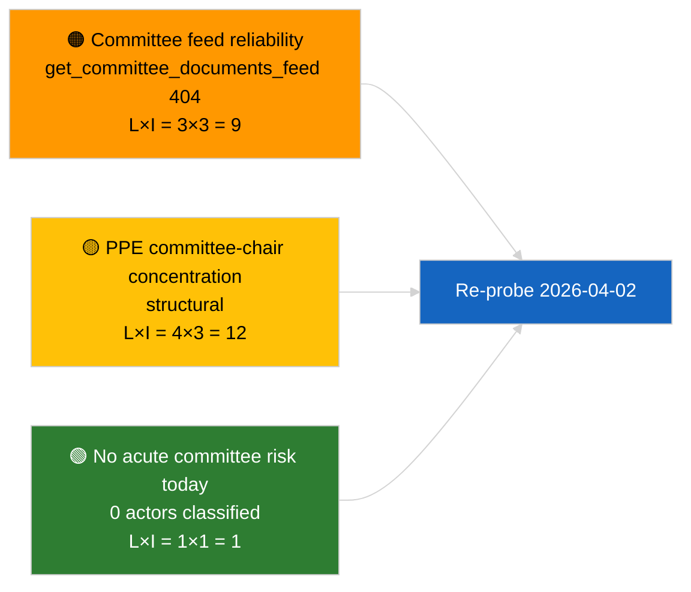

<!-- SPDX-FileCopyrightText: 2026 Hack23 AB -->
<!-- SPDX-License-Identifier: Apache-2.0 -->

# Executive Brief — Committee Reports | 2026-04-01

**Classification:** OSINT | Public Parliamentary Record
**Confidence:** 🟢 High (recess-period structural assessment)
**Generated:** 2026-04-01T00:00:00Z (retrospective brief)
**Article Type:** Committee Reports
**Run ID:** `64ada77d-c1f3-48f7-804d-be58857d0f18`
**Source:** European Parliament Open Data Portal

---

## 🎯 BLUF

**No new committee reports identified for 2026-04-01; first full day of post-March committee recess.** Run `64ada77d-c1f3-48f7-804d-be58857d0f18` returned **0 classified actors** and **ROUTINE** significance across all five impact dimensions, consistent with the EP10 inter-sessional calendar (committees do not formally sit during plenary-recess weeks unless extraordinarily convened). The substantive committee-reports baseline therefore remains the carry-over from March: ECON's ECB Vice-President file (TA-10-2026-0060), TRAN/ENVI HDV emission-credits report (TA-10-2026-0084), and JURI's Braun immunity dossier (TA-10-2026-0088). **🟢 HIGH confidence** the empty state is calendar-driven.

---

## 🧭 3 Decisions This Brief Supports

| # | Decision | Who Decides | Deadline | Evidence |
|:-:|----------|-------------|:--------:|----------|
| 1 | **Editorial:** SKIP committee-reports daily; produce week-recap | Editor | +24h | Empty run output |
| 2 | **Monitoring:** add `get_committee_documents_feed` to next-cycle health probe (404 on 2026-04-01) | Data pipeline | 2026-04-02 | Feed availability anomaly |
| 3 | **Forward-watch:** flag committee work-week 13-17 April for first substantive committee-reports cycle | Analysis lead | 2026-04-13 | Pre-plenary committee drafts |

---

## 📰 60-Second Read

- 🔴 **No committee documents in today's feed** — `get_committee_documents_feed` returned 404 in concurrent breaking-news run. (🟡 Medium — endpoint health is the qualifier, not absence of work)
- 🟠 **0 actors classified** in this committee-reports run; no rapporteurs, shadow rapporteurs, or committee chairs identified. (🟢 High)
- 🟢 **Committee carry-over baseline:** ECON (ECB), TRAN/ENVI (HDV emissions), JURI (immunity), AFET (Georgia) remain the active March-into-Q2 portfolios. (🟢 High)
- 🟡 **Risk dimensions all "none"** — no acute committee-stage risk flagged today. (🟢 High)
- 🔵 **Economic context:** ECON's ECB Vice-President confirmation provides Q2 institutional anchor. (🟢 High)
- 🟣 **Cross-reference:** sibling 2026-04-01/breaking article documents the 6/8 advisory-feed 404 pattern that explains the data absence here. (🟢 High)
- 🩷 **Disruption vector:** none acute; structural PPE-dominance and committee-chair concentration risks inherited. (🟡 Medium)
- ⚪ **Carry-forward:** EU-Mercosur INTA file awaiting ECJ opinion; CULT/EMPL pipeline yet to fully emerge for Q2.

---

## 🗂️ Top Documents / Procedures Table

| Rank | EP reference | Title (short) | Significance | Confidence | Status |
|:----:|--------------|---------------|:------------:|:----------:|--------|
| 1 | — | No committee reports on 2026-04-01 | 0.0 | 🟢 HIGH | Recess — no activity |
| 2 | TA-10-2026-0060 | ECON — ECB Vice-President (carry-over) | 7.5 | 🟢 HIGH | Adopted 10 March; baseline |
| 3 | TA-10-2026-0084 | TRAN/ENVI — HDV emission credits (carry-over) | 7.0 | 🟢 HIGH | Adopted 12 March; transposition watch |

---

## ⚠️ Risk & Threat Snapshot

| Risk | L | I | Score | Trigger | Source | Admiralty |
|------|:-:|:-:|:-----:|---------|--------|:---------:|
| Committee feed-API reliability | 3 | 3 | 9 | Sustained 404 in next cycle | Sibling breaking run | B2 |
| PPE committee-chair concentration | 4 | 3 | 12 | Q2 rapporteur appointments | Structural | A2 |
| HDV transposition disputes | 2 | 3 | 6 | National-level pushback | TA-10-2026-0084 | A1 |

---

## 🔮 Top Forward Trigger

**Committee work-week 13-17 April 2026.** Committee draft reports and shadow-rapporteur negotiations during this window pre-determine the substance of the 27-30 April Strasbourg agenda; the first substantive committee-reports cycle of Q2 will land here.

---

## 🛡️ Source Quality Assessment

- **Primary sources:** EP Open Data Portal `get_committee_documents_feed` (404 on 2026-04-01 per concurrent runs) and analysis run `64ada77d-c1f3-48f7-804d-be58857d0f18` classification output (0 actors).
- **Data limitations:** Feed unavailability prevents independent corroboration of "no activity" — confidence on absence of new committee documents is 🟡 medium pending next-cycle probe.
- **Confidence on calendar-driven inactivity:** 🟢 HIGH.

---

## 📎 Links

| Link | Path |
|------|------|
| Article | `./article.md` |
| Classification (empty) | `./classification/` |
| Risk scoring | `./risk-scoring/` |
| Sibling breaking run | `analysis/daily/2026-04-01/breaking/` |
| Manifest | `./manifest.json` |

---

## 🔄 Cross-Reference

**Concurrent runs:** 2026-04-01 breaking / month-ahead / motions / propositions — all show the same empty-template pattern, confirming this is a system-wide recess-period state, not a committee-reports-specific failure.

**Delta from prior runs:** Pre-recess committee activity (Strasbourg week 9-12 March, Brussels mini-plenary 25-26 March) was substantive; the recess transition is the explanatory variable, not a regression.

---

**Document Control**
- **Template:** `/analysis/templates/executive-brief.md`
- **Artifact path:** `analysis/daily/2026-04-01/committee-reports/executive-brief.md`
- **Classification:** Public
- **Retrospective generation:** Back-fill session.
