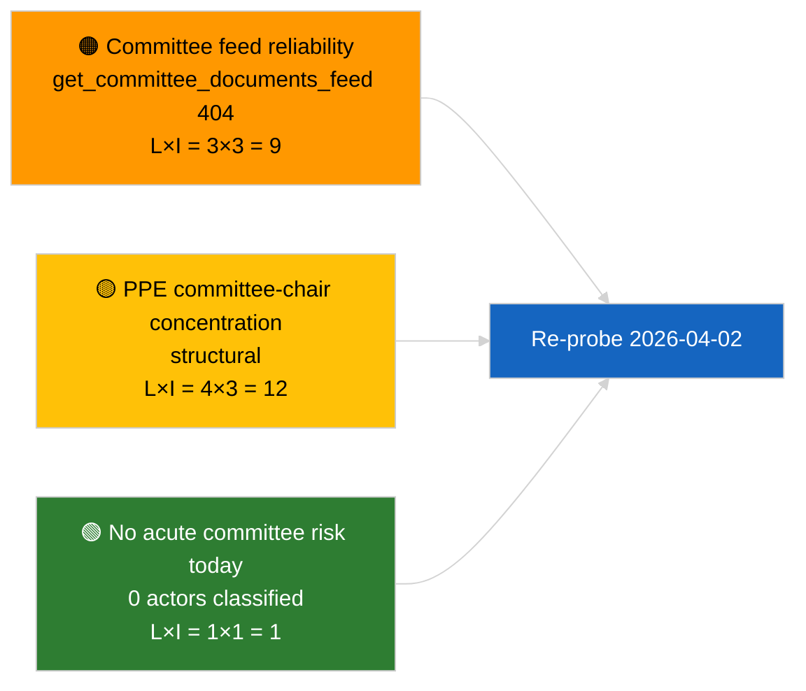

<!-- SPDX-FileCopyrightText: 2026 Hack23 AB -->
<!-- SPDX-License-Identifier: Apache-2.0 -->

# موجز تنفيذي — تقارير اللجان | 2026-04-01

**التصنيف:** OSINT | سجل برلماني عام
**مستوى الثقة:** 🟢 مرتفع (تقييم هيكلي خلال فترة الاستراحة)
**تاريخ الإصدار:** 2026-04-01T00:00:00Z (موجز استرجاعي)
**نوع المقالة:** تقارير اللجان
**معرّف التشغيل:** `64ada77d-c1f3-48f7-804d-be58857d0f18`
**المصدر:** بوابة البيانات المفتوحة للبرلمان الأوروبي

---

## 🎯 BLUF

**لم يُحدَّد أي تقرير للجان جديد بتاريخ 2026-04-01؛ أول يوم كامل لاستراحة اللجان عقب مارس.** أسفر التشغيل `64ada77d-c1f3-48f7-804d-be58857d0f18` عن **0 جهات فاعلة مصنَّفة** وأهمية **اعتيادية** عبر جميع أبعاد التأثير الخمسة، وهو ما يتسق مع التقويم بين الدورات للبرلمان الأوروبي EP10 (لا تجتمع اللجان رسمياً خلال أسابيع استراحة الجلسة العامة إلا إذا دُعيت في اجتماع استثنائي). وبالتالي تبقى خط الأساس الموضوعي لتقارير اللجان هو الترحيل من مارس: ملف ECON المتعلق بنائب رئيس البنك المركزي الأوروبي (TA-10-2026-0060)، وتقرير TRAN/ENVI حول ائتمانات انبعاثات المركبات الثقيلة (TA-10-2026-0084)، وملف حصانة براون لدى JURI (TA-10-2026-0088). **🟢 ثقة مرتفعة** في أن الحالة الفارغة مدفوعة بالتقويم.

---

## 🧭 3 قرارات يدعمها هذا الموجز

| # | القرار | صاحب القرار | الموعد النهائي | الأدلة |
|:-:|--------|-------------|:--------------:|--------|
| 1 | **تحريري:** تخطي تقرير اللجان اليومي؛ إنتاج ملخص أسبوعي | المحرر | +24 ساعة | ناتج تشغيل فارغ |
| 2 | **المراقبة:** إضافة `get_committee_documents_feed` إلى فحص الحالة في الدورة القادمة (خطأ 404 بتاريخ 2026-04-01) | خط البيانات | 2026-04-02 | شذوذ توفر التغذية |
| 3 | **الرصد الاستشرافي:** وضع علامة على أسبوع عمل اللجان 13-17 أبريل كأول دورة جوهرية لتقارير اللجان | مسؤول التحليل | 2026-04-13 | مسودات اللجان قبيل الجلسة العامة |

---

## 📰 قراءة في 60 ثانية

- 🔴 **لا توجد وثائق للجان في تغذية اليوم** — أعادت `get_committee_documents_feed` خطأ 404 في تشغيل الأخبار المتوازي. (🟡 متوسط — صحة نقطة النهاية هي المحدد، لا غياب العمل)
- 🟠 **0 جهات فاعلة مصنَّفة** في هذا التشغيل لتقارير اللجان؛ لم يُحدَّد أي مقرر أو مقرر ظل أو رئيس لجنة. (🟢 مرتفع)
- 🟢 **خط الأساس الترحيلي للجان:** ECON (البنك المركزي الأوروبي)، TRAN/ENVI (انبعاثات HDV)، JURI (الحصانة)، AFET (جورجيا) تبقى المحافظ النشطة من مارس إلى الربع الثاني. (🟢 مرتفع)
- 🟡 **أبعاد المخاطر جميعها "لا شيء"** — لا خطر حاد في مرحلة اللجنة اليوم. (🟢 مرتفع)
- 🔵 **السياق الاقتصادي:** تأكيد ECON لنائب رئيس البنك المركزي الأوروبي يوفر نقطة ارتكاز مؤسسية للربع الثاني. (🟢 مرتفع)
- 🟣 **الإسناد المتقاطع:** مقالة 2026-04-01/breaking الشقيقة توثق نمط 404 في 6/8 من تغذيات الاستشارات مما يفسر غياب البيانات هنا. (🟢 مرتفع)
- 🩷 **ناقل الاضطراب:** لا حاد؛ مخاطر هيكلية موروثة من هيمنة PPE وتركز رئاسة اللجان. (🟡 متوسط)
- ⚪ **الترحيل:** ملف INTA EU-Mercosur في انتظار رأي محكمة العدل الأوروبية؛ خط أنابيب CULT/EMPL لم يتبلور بعد للربع الثاني.

---

## 🗂️ جدول أبرز الوثائق / الإجراءات

| الترتيب | مرجع البرلمان الأوروبي | العنوان (مختصر) | الأهمية | الثقة | الحالة |
|:-------:|----------------------|-----------------|:-------:|:-----:|--------|
| 1 | — | لا تقارير للجان بتاريخ 2026-04-01 | 0.0 | 🟢 مرتفع | استراحة — لا نشاط |
| 2 | TA-10-2026-0060 | ECON — نائب رئيس البنك المركزي الأوروبي (ترحيل) | 7.5 | 🟢 مرتفع | اعتُمد في 10 مارس؛ خط الأساس |
| 3 | TA-10-2026-0084 | TRAN/ENVI — ائتمانات انبعاثات HDV (ترحيل) | 7.0 | 🟢 مرتفع | اعتُمد في 12 مارس؛ متابعة النقل |

---

## ⚠️ لقطة المخاطر والتهديدات

| المخاطر | ا | ش | الدرجة | المحفز | المصدر | درجة الأميرالية |
|---------|:-:|:-:|:------:|--------|--------|:---------------:|
| موثوقية API تغذية اللجان | 3 | 3 | 9 | خطأ 404 مستمر في الدورة التالية | تشغيل breaking الشقيق | B2 |
| تركز رئاسة اللجان في PPE | 4 | 3 | 12 | تعيينات مقررين الربع الثاني | هيكلي | A2 |
| نزاعات نقل HDV | 2 | 3 | 6 | مقاومة وطنية | TA-10-2026-0084 | A1 |

---

## 🔮 المحفز الاستشرافي الأول

**أسبوع عمل اللجان 13-17 أبريل 2026.** مسودات تقارير اللجان ومفاوضات المقررين الظل خلال هذه الفترة تحدد مسبقاً محتوى جدول أعمال ستراسبورغ في الفترة 27-30 أبريل؛ ستبدأ هنا أول دورة جوهرية لتقارير اللجان في الربع الثاني.

---

## 🛡️ تقييم جودة المصادر

- **المصادر الأولية:** بوابة البيانات المفتوحة للبرلمان الأوروبي `get_committee_documents_feed` (خطأ 404 بتاريخ 2026-04-01 وفقاً للتشغيلات المتوازية) وناتج تصنيف تشغيل التحليل `64ada77d-c1f3-48f7-804d-be58857d0f18` (0 جهات فاعلة).
- **قيود البيانات:** يمنع عدم توفر التغذية التحقق المستقل من "لا نشاط" — مستوى الثقة في غياب وثائق اللجان الجديدة 🟡 متوسط في انتظار مسح الدورة التالية.
- **الثقة في عدم النشاط القائم على التقويم:** 🟢 مرتفع.

---

## 📎 الروابط

| الرابط | المسار |
|--------|--------|
| المقالة | `./article.md` |
| التصنيف (فارغ) | `./classification/` |
| تسجيل المخاطر | `./risk-scoring/` |
| تشغيل breaking الشقيق | `analysis/daily/2026-04-01/breaking/` |
| البيان | `./manifest.json` |

---

## 🔄 الإسناد المتقاطع

**التشغيلات المتزامنة:** 2026-04-01 breaking / month-ahead / motions / propositions — تُظهر جميعها نفس نمط القالب الفارغ، مما يؤكد أن هذه حالة فترة استراحة على مستوى النظام بأكمله، وليست إخفاقاً خاصاً بتقارير اللجان.

**الفارق عن التشغيلات السابقة:** كان نشاط اللجان قبيل الاستراحة (أسبوع ستراسبورغ 9-12 مارس، الجلسة العامة المصغرة ببروكسل 25-26 مارس) جوهرياً؛ التحول إلى الاستراحة هو المتغير التفسيري، لا تراجعاً في الأداء.

---

**مراقبة الوثائق**
- **القالب:** `/analysis/templates/executive-brief.md`
- **مسار القطعة الأثرية:** `analysis/daily/2026-04-01/committee-reports/executive-brief.md`
- **التصنيف:** عام
- **الإنشاء الاسترجاعي:** جلسة تعبئة خلفية.
