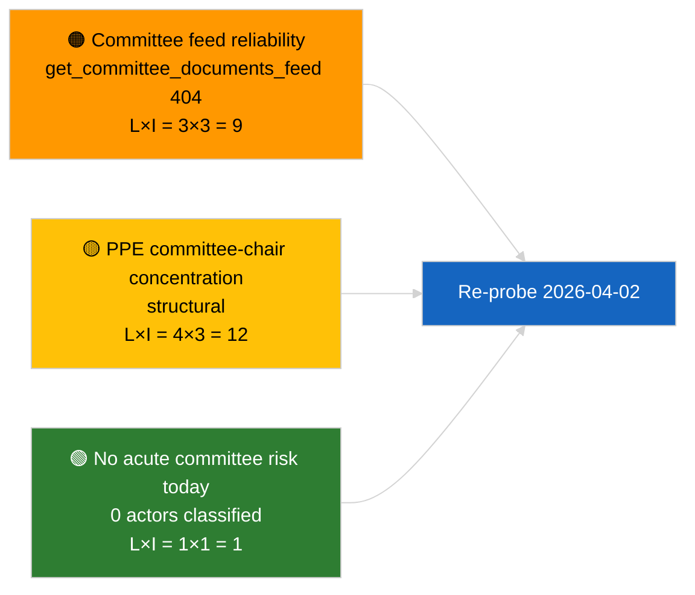

<!-- SPDX-FileCopyrightText: 2026 Hack23 AB -->
<!-- SPDX-License-Identifier: Apache-2.0 -->

# Ledelsesbriefing — Udvalgsrapporter | 2026-04-01

**Klassifikation:** OSINT | Offentlig parlamentarisk protokol
**Tillid:** 🟢 Høj (strukturel vurdering i recessionsperiode)
**Genereret:** 2026-04-01T00:00:00Z (retrospektiv briefing)
**Artikeltype:** Udvalgsrapporter
**Kørsel-ID:** `64ada77d-c1f3-48f7-804d-be58857d0f18`
**Kilde:** Europa-Parlamentets åbne dataportal

---

## 🎯 BLUF

**Ingen nye udvalgsrapporter identificeret for 2026-04-01; første hele dag af post-marts udvalgsrecessen.** Kørsel `64ada77d-c1f3-48f7-804d-be58857d0f18` returnerede **0 klassificerede aktører** og **RUTINE** betydning på tværs af alle fem påvirkningsdimensioner, i overensstemmelse med EP10's intersessionelle kalender (udvalg sidder ikke formelt under plenarrecesperioder medmindre de er ekstraordinært indkaldt). Den substantielle baslinje for udvalgsrapporter er derfor carry-over fra marts: ECON's fil om ECB's vicepræsident (TA-10-2026-0060), TRAN/ENVI's HDV-emissionskredit-rapport (TA-10-2026-0084) og JURI's Braun-immunitetsmappe (TA-10-2026-0088). **🟢 HØJ tillid** til at den tomme tilstand er kalender-drevet.

---

## 🧭 3 Beslutninger som Briefingen Støtter

| # | Beslutning | Hvem Bestemmer | Deadline | Bevis |
|:-:|------------|----------------|:--------:|-------|
| 1 | **Redaktionelt:** SPRING daglig udvalgsrapport over; producér ugeoversigt | Redaktør | +24h | Tom kørselsoutput |
| 2 | **Overvågning:** tilføj `get_committee_documents_feed` til næste cyklus' sundhedsprøve (404 den 2026-04-01) | Datapipeline | 2026-04-02 | Feed-tilgængeligheds-anomali |
| 3 | **Fremtidsovervågning:** markér udvalgets arbejdsuge 13-17 april for første substantielle udvalgsrapportscyklus | Analysechef | 2026-04-13 | Pre-plenary udvalgsudkast |

---

## 📰 60-Sekunders Læsning

- 🔴 **Ingen udvalgs-dokumenter i dagens feed** — `get_committee_documents_feed` returnerede 404 i parallel nyhedskørsel. (🟡 Middel — slutpunktens sundhed er kvalificereren, ikke fraværet af arbejde)
- 🟠 **0 aktører klassificeret** i denne udvalgsrapportskørsel; ingen ordførere, skyggeordførere eller udvalgsformænd identificeret. (🟢 Høj)
- 🟢 **Udvalgets carry-over-baslinje:** ECON (ECB), TRAN/ENVI (HDV-emissioner), JURI (immunitet), AFET (Georgien) forbliver de aktive marts-til-Q2-porteføljer. (🟢 Høj)
- 🟡 **Risikodimensioner alle "ingen"** — ingen akut udvalgsstadie-risiko flagget i dag. (🟢 Høj)
- 🔵 **Økonomisk kontekst:** ECON's bekræftelse af ECB's vicepræsident giver institutionelt anker for Q2. (🟢 Høj)
- 🟣 **Krydsreference:** søster 2026-04-01/breaking-artikel dokumenterer 6/8 rådgivnings-feed 404-mønsteret, der forklarer dataabsensen her. (🟢 Høj)
- 🩷 **Forstyrrelsesvektor:** ingen akut; strukturelle PPE-dominans- og udvalgsformands-koncentrationsrisici arvet. (🟡 Middel)
- ⚪ **Carry-forward:** EU-Mercosur INTA-fil afventer EF-Domstolens udtalelse; CULT/EMPL-pipeline endnu ikke fuldt fremkommet for Q2.

---

## 🗂️ Tabel over Topdokumenter / Procedurer

| Rang | EP-reference | Titel (kort) | Betydning | Tillid | Status |
|:----:|--------------|--------------|:---------:|:------:|--------|
| 1 | — | Ingen udvalgsrapporter 2026-04-01 | 0,0 | 🟢 HØJ | Recess — ingen aktivitet |
| 2 | TA-10-2026-0060 | ECON — ECB vicepræsident (carry-over) | 7,5 | 🟢 HØJ | Vedtaget 10. marts; baslinje |
| 3 | TA-10-2026-0084 | TRAN/ENVI — HDV-emissionskreditter (carry-over) | 7,0 | 🟢 HØJ | Vedtaget 12. marts; transpositionsovervågning |

---

## ⚠️ Risiko- og Trussel-Snapshot

| Risiko | L | P | Score | Udløser | Kilde | Admiralitetsgrad |
|--------|:-:|:-:|:-----:|---------|-------|:----------------:|
| Udvalgs-feed-API-pålidelighed | 3 | 3 | 9 | Vedvarende 404 i næste cyklus | Søster breaking-kørsel | B2 |
| PPE udvalgsformands-koncentration | 4 | 3 | 12 | Q2 ordførerindstillinger | Strukturel | A2 |
| HDV transpositionstvist | 2 | 3 | 6 | National modstand | TA-10-2026-0084 | A1 |

---

## 🔮 Ledende Fremtidstrigger

**Udvalgets arbejdsuge 13-17. april 2026.** Udvalgets udkast til betænkninger og skyggeordførernes forhandlinger i dette vindue forudbestemmer substansen i Strasbourg-dagsordenen 27-30. april; den første substantielle udvalgsrapportscyklus i Q2 lander her.

---

## 🛡️ Kildekvalitetsvurdering

- **Primære kilder:** EP's åbne dataportal `get_committee_documents_feed` (404 den 2026-04-01 pr. parallelle kørsler) og analysekørsel `64ada77d-c1f3-48f7-804d-be58857d0f18` klassificeringsoutput (0 aktører).
- **Databegrænsninger:** Feed-utilgængelighed forhindrer uafhængig bekræftelse af "ingen aktivitet" — tillid til fravær af nye udvalgs-dokumenter er 🟡 middel i afventning af næste cyklus' undersøgelse.
- **Tillid til kalender-drevet inaktivitet:** 🟢 HØJ.

---

## 📎 Links

| Link | Sti |
|------|-----|
| Artikel | `./article.md` |
| Klassifikation (tom) | `./classification/` |
| Risikovurdering | `./risk-scoring/` |
| Søster breaking-kørsel | `analysis/daily/2026-04-01/breaking/` |
| Manifest | `./manifest.json` |

---

## 🔄 Krydsreference

**Parallelle kørsler:** 2026-04-01 breaking / month-ahead / motions / propositions — alle viser det samme tomme skabelon-mønster, hvilket bekræfter at dette er en systemomspændende recessionsperiodestilstand, ikke en udvalgsrapports-specifik fejl.

**Delta fra tidligere kørsler:** Pre-recess-udvalgsaktiviteten (Strasbourg-uge 9-12. marts, Bruxelles mini-plenum 25-26. marts) var substantiel; recessionsovergangen er den forklarende variabel, ikke en regression.

---

**Dokumentkontrol**
- **Skabelon:** `/analysis/templates/executive-brief.md`
- **Artefaktsti:** `analysis/daily/2026-04-01/committee-reports/executive-brief.md`
- **Klassifikation:** Offentlig
- **Retrospektiv generering:** Baggrundsoplysningssession.
