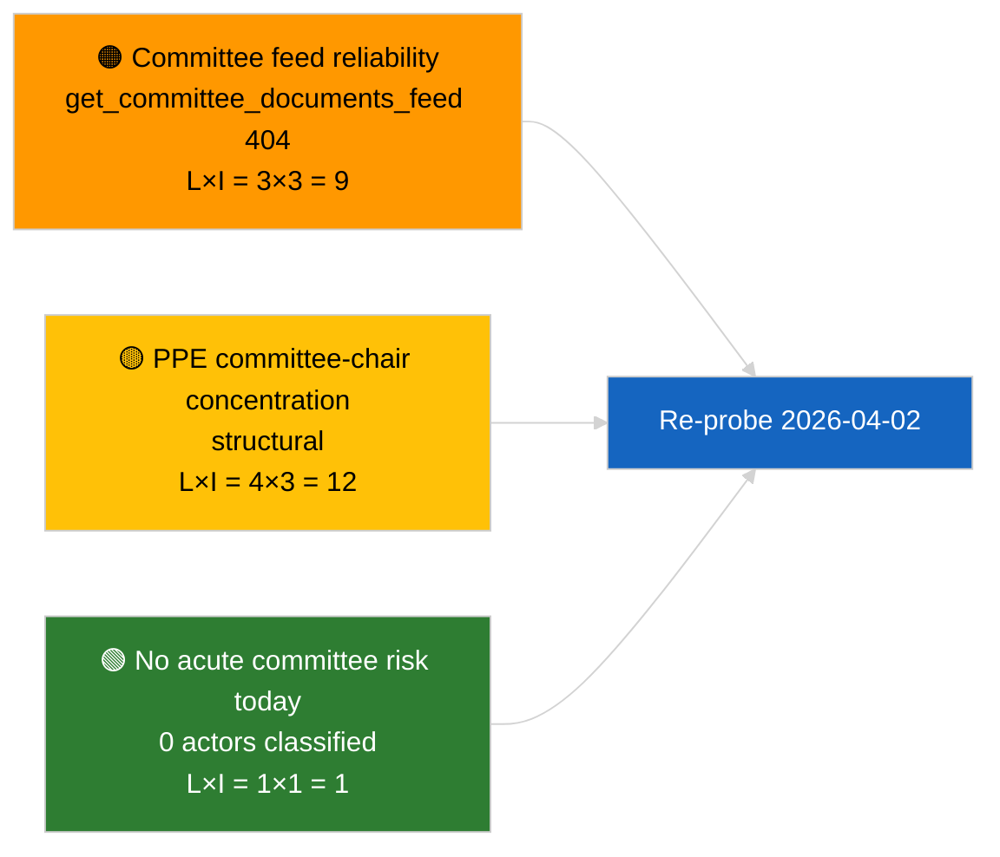

<!-- SPDX-FileCopyrightText: 2026 Hack23 AB -->
<!-- SPDX-License-Identifier: Apache-2.0 -->

# Lageberichte — Ausschussberichte | 2026-04-01

**Klassifizierung:** OSINT | Öffentlicher parlamentarischer Bericht
**Konfidenzgrad:** 🟢 Hoch (strukturelle Bewertung im Recesszeitraum)
**Erstellt:** 2026-04-01T00:00:00Z (retrospektiver Lagebericht)
**Artikeltyp:** Ausschussberichte
**Ausführungs-ID:** `64ada77d-c1f3-48f7-804d-be58857d0f18`
**Quelle:** Offenes Datenportal des Europäischen Parlaments

---

## 🎯 BLUF

**Keine neuen Ausschussberichte für den 2026-04-01 identifiziert; erster voller Tag der Ausschuss-Recess nach März.** Lauf `64ada77d-c1f3-48f7-804d-be58857d0f18` ergab **0 klassifizierte Akteure** und **ROUTINEBEDEUTUNG** in allen fünf Wirkungsdimensionen, entsprechend dem intersessionellen Kalender des EP10 (Ausschüsse treten während Plenar-Rezesswochen nicht förmlich zusammen, sofern sie nicht außerordentlich einberufen werden). Die inhaltliche Basislinie für Ausschussberichte ist daher der Carry-over aus März: ECONs Akte zum EZB-Vizepräsidenten (TA-10-2026-0060), TRAN/ENVIs Bericht zu HDV-Emissionsgutschriften (TA-10-2026-0084) und JURIs Braun-Immunitätsdossier (TA-10-2026-0088). **🟢 HOHER Konfidenzgrad**, dass der leere Zustand kalenderbedingt ist.

---

## 🧭 3 Entscheidungen, die Dieser Lagebericht Unterstützt

| # | Entscheidung | Wer Entscheidet | Frist | Beweise |
|:-:|--------------|-----------------|:-----:|---------|
| 1 | **Redaktionell:** Täglichen Ausschussbericht ÜBERSPRINGEN; Wochenzusammenfassung erstellen | Redakteur | +24h | Leere Laufausgabe |
| 2 | **Überwachung:** `get_committee_documents_feed` in die Gesundheitsprüfung des nächsten Zyklus aufnehmen (404 am 2026-04-01) | Datenpipeline | 2026-04-02 | Feed-Verfügbarkeitsanomalie |
| 3 | **Vorausschau:** Ausschuss-Arbeitswoche 13.-17. April für den ersten inhaltlichen Ausschussberichtszyklus markieren | Analyseleitung | 2026-04-13 | Vorab-Plenums-Ausschussentwürfe |

---

## 📰 60-Sekunden-Lektüre

- 🔴 **Keine Ausschussdokumente im heutigen Feed** — `get_committee_documents_feed` gab im gleichzeitigen Nachrichtenlauf 404 zurück. (🟡 Mittel — der Gesundheitszustand des Endpunkts ist der Qualifikator, nicht die Abwesenheit von Arbeit)
- 🟠 **0 Akteure klassifiziert** in diesem Ausschussberichtslauf; keine Berichterstatter, Schattenberichterstatter oder Ausschussvorsitzende identifiziert. (🟢 Hoch)
- 🟢 **Ausschuss-Carry-over-Basislinie:** ECON (EZB), TRAN/ENVI (HDV-Emissionen), JURI (Immunität), AFET (Georgien) bleiben die aktiven März-bis-Q2-Portfolios. (🟢 Hoch)
- 🟡 **Risikodimensionen alle „keine"** — kein akutes Ausschussrisiko heute gekennzeichnet. (🟢 Hoch)
- 🔵 **Wirtschaftlicher Kontext:** ECONs Bestätigung des EZB-Vizepräsidenten liefert den institutionellen Anker für Q2. (🟢 Hoch)
- 🟣 **Querverweise:** Geschwister 2026-04-01/breaking-Artikel dokumentiert das 6/8-Beratungsfeed-404-Muster, das den Datenmangel hier erklärt. (🟢 Hoch)
- 🩷 **Störungsfaktor:** kein akuter; strukturelle PPE-Dominanz- und Ausschussvorsitzenden-Konzentrationsrisiken geerbt. (🟡 Mittel)
- ⚪ **Carry-forward:** EU-Mercosur INTA-Akte wartet auf EuGH-Gutachten; CULT/EMPL-Pipeline noch nicht vollständig für Q2 erkennbar.

---

## 🗂️ Tabelle der Top-Dokumente / Verfahren

| Rang | EP-Referenz | Titel (kurz) | Bedeutung | Konfidenz | Status |
|:----:|-------------|--------------|:---------:|:---------:|--------|
| 1 | — | Keine Ausschussberichte 2026-04-01 | 0,0 | 🟢 HOCH | Recess — keine Aktivität |
| 2 | TA-10-2026-0060 | ECON — EZB-Vizepräsident (Carry-over) | 7,5 | 🟢 HOCH | Angenommen 10. März; Basislinie |
| 3 | TA-10-2026-0084 | TRAN/ENVI — HDV-Emissionsgutschriften (Carry-over) | 7,0 | 🟢 HOCH | Angenommen 12. März; Umsetzungsüberwachung |

---

## ⚠️ Risiko- und Bedrohungsübersicht

| Risiko | W | S | Punktzahl | Auslöser | Quelle | Admiralitätsgrad |
|--------|:-:|:-:|:---------:|----------|--------|:----------------:|
| Zuverlässigkeit Ausschuss-Feed-API | 3 | 3 | 9 | Anhaltende 404 im nächsten Zyklus | Geschwister Breaking-Lauf | B2 |
| PPE-Ausschussvorsitzenden-Konzentration | 4 | 3 | 12 | Q2-Berichterstatterernennungen | Strukturell | A2 |
| HDV-Umsetzungsstreitigkeiten | 2 | 3 | 6 | Nationaler Widerstand | TA-10-2026-0084 | A1 |

---

## 🔮 Führender Zukunftsauslöser

**Ausschuss-Arbeitswoche 13.-17. April 2026.** Ausschussentwürfe und Schattenberichterstatter-Verhandlungen in diesem Zeitfenster bestimmen vorab den Inhalt der Straßburger Agenda vom 27.-30. April; der erste inhaltliche Ausschussberichtszyklus von Q2 wird hier beginnen.

---

## 🛡️ Bewertung der Quellenqualität

- **Primärquellen:** Offenes Datenportal des EP `get_committee_documents_feed` (404 am 2026-04-01 gemäß gleichzeitigen Läufen) und Analyselauf `64ada77d-c1f3-48f7-804d-be58857d0f18` Klassifizierungsausgabe (0 Akteure).
- **Datenbeschränkungen:** Feed-Nichtverfügbarkeit verhindert eine unabhängige Bestätigung von „keine Aktivität" — Konfidenz bezüglich des Fehlens neuer Ausschussdokumente ist 🟡 mittel bis zur Überprüfung im nächsten Zyklus.
- **Konfidenz für kalenderbedingte Inaktivität:** 🟢 HOCH.

---

## 📎 Links

| Link | Pfad |
|------|------|
| Artikel | `./article.md` |
| Klassifizierung (leer) | `./classification/` |
| Risikobewertung | `./risk-scoring/` |
| Geschwister Breaking-Lauf | `analysis/daily/2026-04-01/breaking/` |
| Manifest | `./manifest.json` |

---

## 🔄 Querverweise

**Gleichzeitige Läufe:** 2026-04-01 breaking / month-ahead / motions / propositions — alle zeigen das gleiche leere Vorlagenmuster und bestätigen, dass es sich um einen systemweiten Recess-Perioden-Zustand handelt, nicht um ein ausschussberichtsspezifisches Versagen.

**Delta gegenüber früheren Läufen:** Die Ausschussaktivität vor der Recess (Straßburger Woche 9.-12. März, Brüsseler Mini-Plenum 25.-26. März) war substantiell; der Recess-Übergang ist die erklärende Variable, keine Regression.

---

**Dokumentenkontrolle**
- **Vorlage:** `/analysis/templates/executive-brief.md`
- **Artefaktpfad:** `analysis/daily/2026-04-01/committee-reports/executive-brief.md`
- **Klassifizierung:** Öffentlich
- **Retrospektive Erstellung:** Nachfüllungssitzung.
