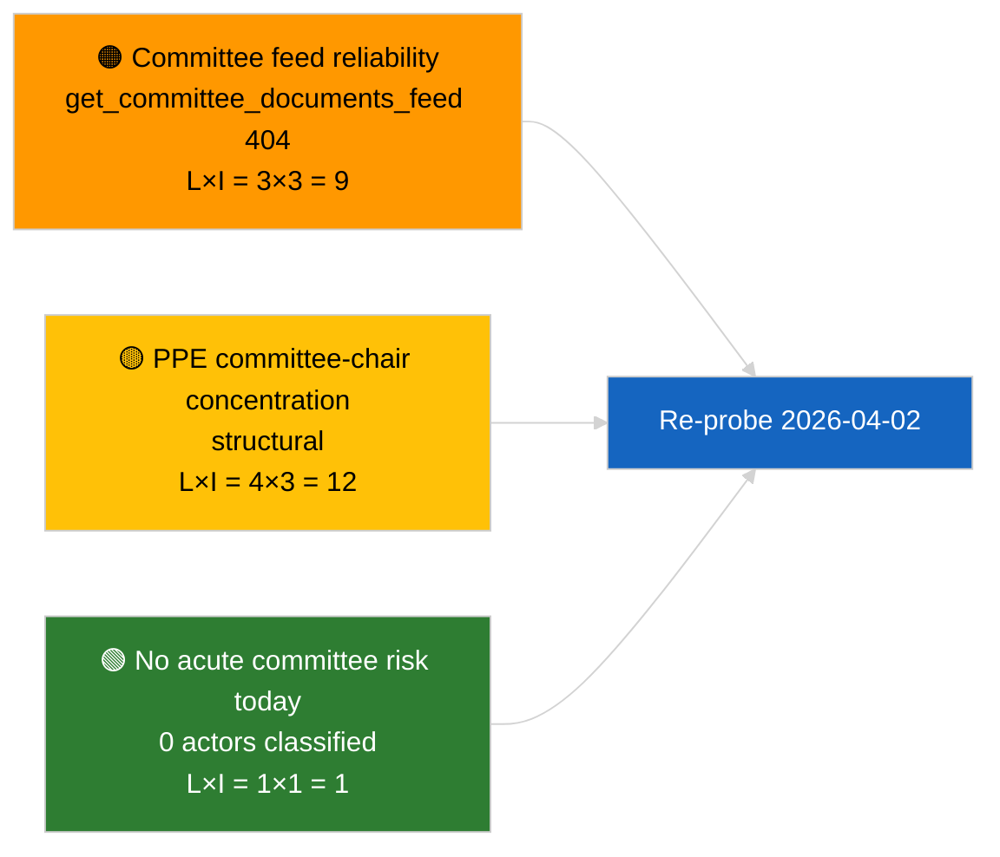

<!-- SPDX-FileCopyrightText: 2026 Hack23 AB -->
<!-- SPDX-License-Identifier: Apache-2.0 -->

# Informe Ejecutivo — Informes de Comisión | 2026-04-01

**Clasificación:** OSINT | Registro parlamentario público
**Nivel de confianza:** 🟢 Alto (evaluación estructural en período de receso)
**Generado:** 2026-04-01T00:00:00Z (informe retrospectivo)
**Tipo de artículo:** Informes de comisión
**ID de ejecución:** `64ada77d-c1f3-48f7-804d-be58857d0f18`
**Fuente:** Portal de datos abiertos del Parlamento Europeo

---

## 🎯 BLUF

**No se han identificado nuevos informes de comisión para el 2026-04-01; primer día completo del receso de comisiones post-marzo.** La ejecución `64ada77d-c1f3-48f7-804d-be58857d0f18` devolvió **0 actores clasificados** y significación **RUTINARIA** en las cinco dimensiones de impacto, en consonancia con el calendario intersesional del PE10 (las comisiones no se reúnen formalmente durante las semanas de receso plenario salvo convocatoria extraordinaria). La línea de base sustantiva para los informes de comisión es, por tanto, el arrastre de marzo: el expediente de la ECON sobre el Vicepresidente del BCE (TA-10-2026-0060), el informe de TRAN/ENVI sobre los créditos de emisiones HDV (TA-10-2026-0084) y el dossier de inmunidad Braun de la JURI (TA-10-2026-0088). **🟢 ALTA confianza** en que el estado vacío obedece al calendario.

---

## 🧭 3 Decisiones que Apoya Este Informe

| # | Decisión | Decisor | Plazo | Evidencia |
|:-:|----------|---------|:-----:|-----------|
| 1 | **Editorial:** OMITIR informe diario de comisión; producir resumen semanal | Editor | +24h | Salida de ejecución vacía |
| 2 | **Monitoreo:** Agregar `get_committee_documents_feed` a la sonda de salud del próximo ciclo (404 el 2026-04-01) | Canal de datos | 2026-04-02 | Anomalía de disponibilidad del feed |
| 3 | **Vigilancia prospectiva:** Señalar la semana de trabajo de comisiones 13-17 de abril para el primer ciclo sustantivo de informes de comisión | Responsable de análisis | 2026-04-13 | Borradores de comisión pre-plenario |

---

## 📰 Lectura en 60 Segundos

- 🔴 **No hay documentos de comisión en el feed de hoy** — `get_committee_documents_feed` devolvió 404 en la ejecución paralela de noticias. (🟡 Medio — el estado del endpoint es el calificador, no la ausencia de trabajo)
- 🟠 **0 actores clasificados** en esta ejecución de informes de comisión; no se identificaron ponentes, ponentes en la sombra ni presidentes de comisión. (🟢 Alto)
- 🟢 **Línea de base de arrastre de comisión:** ECON (BCE), TRAN/ENVI (emisiones HDV), JURI (inmunidad), AFET (Georgia) siguen siendo las carteras activas de marzo a Q2. (🟢 Alto)
- 🟡 **Dimensiones de riesgo todas «ninguna»** — no se ha señalado riesgo agudo en fase de comisión hoy. (🟢 Alto)
- 🔵 **Contexto económico:** La confirmación del Vicepresidente del BCE por parte de la ECON proporciona el ancla institucional para Q2. (🟢 Alto)
- 🟣 **Referencia cruzada:** el artículo hermano 2026-04-01/breaking documenta el patrón 6/8 de 404 en feeds de asesoría que explica la ausencia de datos aquí. (🟢 Alto)
- 🩷 **Vector de perturbación:** ninguno agudo; riesgos estructurales de dominancia PPE y de concentración en la presidencia de comisiones heredados. (🟡 Medio)
- ⚪ **Arrastre:** expediente INTA EU-Mercosur pendiente de dictamen del TJUE; cartera CULT/EMPL aún sin emerger plenamente para Q2.

---

## 🗂️ Tabla de Principales Documentos / Procedimientos

| Rango | Referencia PE | Título (corto) | Significación | Confianza | Estado |
|:-----:|---------------|----------------|:-------------:|:---------:|--------|
| 1 | — | Sin informes de comisión el 2026-04-01 | 0,0 | 🟢 ALTA | Receso — sin actividad |
| 2 | TA-10-2026-0060 | ECON — Vicepresidente BCE (arrastre) | 7,5 | 🟢 ALTA | Adoptado el 10 de marzo; línea de base |
| 3 | TA-10-2026-0084 | TRAN/ENVI — Créditos emisiones HDV (arrastre) | 7,0 | 🟢 ALTA | Adoptado el 12 de marzo; seguimiento de transposición |

---

## ⚠️ Instantánea de Riesgos y Amenazas

| Riesgo | V | I | Puntaje | Detonante | Fuente | Grado de almirantazgo |
|--------|:-:|:-:|:-------:|-----------|--------|:---------------------:|
| Fiabilidad del feed API de comisión | 3 | 3 | 9 | 404 persistente en el próximo ciclo | Ejecución hermana breaking | B2 |
| Concentración de presidentes de comisión PPE | 4 | 3 | 12 | Nombramientos de ponentes Q2 | Estructural | A2 |
| Disputas de transposición HDV | 2 | 3 | 6 | Resistencia nacional | TA-10-2026-0084 | A1 |

---

## 🔮 Principal Detonante Futuro

**Semana de trabajo de comisiones del 13 al 17 de abril de 2026.** Los borradores de informes de comisión y las negociaciones de los ponentes en la sombra durante esta ventana predeterminan el contenido del orden del día de Estrasburgo del 27 al 30 de abril; el primer ciclo sustantivo de informes de comisión de Q2 comenzará aquí.

---

## 🛡️ Evaluación de la Calidad de las Fuentes

- **Fuentes primarias:** Portal de datos abiertos del PE `get_committee_documents_feed` (404 el 2026-04-01 según ejecuciones paralelas) y salida de clasificación de la ejecución de análisis `64ada77d-c1f3-48f7-804d-be58857d0f18` (0 actores).
- **Limitaciones de datos:** La indisponibilidad del feed impide la corroboración independiente de «sin actividad» — la confianza en la ausencia de nuevos documentos de comisión es 🟡 media pendiente de la sonda del próximo ciclo.
- **Confianza en la inactividad debida al calendario:** 🟢 ALTA.

---

## 📎 Enlaces

| Enlace | Ruta |
|--------|------|
| Artículo | `./article.md` |
| Clasificación (vacía) | `./classification/` |
| Puntuación de riesgos | `./risk-scoring/` |
| Ejecución hermana breaking | `analysis/daily/2026-04-01/breaking/` |
| Manifiesto | `./manifest.json` |

---

## 🔄 Referencia Cruzada

**Ejecuciones simultáneas:** 2026-04-01 breaking / month-ahead / motions / propositions — todas muestran el mismo patrón de plantilla vacía, lo que confirma que se trata de un estado de período de receso en todo el sistema, no de un fallo específico de los informes de comisión.

**Delta respecto a ejecuciones anteriores:** La actividad de comisiones previa al receso (semana de Estrasburgo 9-12 de marzo, mini-plenario de Bruselas 25-26 de marzo) fue sustantiva; la transición al receso es la variable explicativa, no una regresión.

---

**Control de documentos**
- **Plantilla:** `/analysis/templates/executive-brief.md`
- **Ruta de artefacto:** `analysis/daily/2026-04-01/committee-reports/executive-brief.md`
- **Clasificación:** Público
- **Generación retrospectiva:** Sesión de relleno retroactivo.
