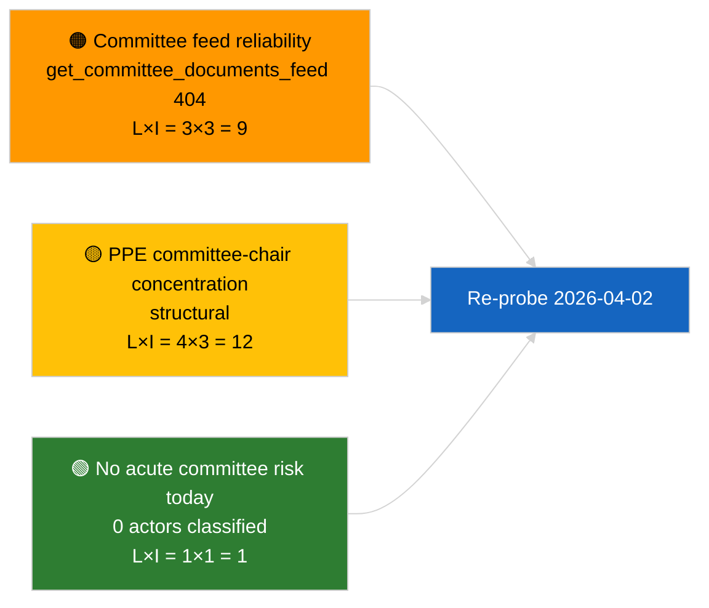

<!-- SPDX-FileCopyrightText: 2026 Hack23 AB -->
<!-- SPDX-License-Identifier: Apache-2.0 -->

# Johtotiedote — Valiokuntaraportit | 2026-04-01

**Luokitus:** OSINT | Julkinen parlamentaarinen asiakirja
**Luotettavuus:** 🟢 Korkea (rakenteellinen arvio istuntotauon aikana)
**Laadittu:** 2026-04-01T00:00:00Z (takautuva tiedote)
**Artikkelityyppi:** Valiokuntaraportit
**Ajon tunnus:** `64ada77d-c1f3-48f7-804d-be58857d0f18`
**Lähde:** Euroopan parlamentin avoin tietoportaali

---

## 🎯 BLUF

**Uusia valiokuntaraportteja ei tunnistettu 2026-04-01; ensimmäinen täysi päivä maaliskuun jälkeistä valiokuntaistuntotaukoa.** Ajo `64ada77d-c1f3-48f7-804d-be58857d0f18` palautti **0 luokiteltua toimijaa** ja **RUTIINITASON** merkityksen kaikilla viidellä vaikutusdimensiolla, mikä vastaa EP10:n istuntotaukojen välistä kalenteria (valiokunnat eivät kokoonnu virallisesti täysistuntotaukojen aikana ellei niitä kutsuta erikoisistuntoon). Valiokuntaraporttien aineellinen perustaso on siksi maaliskuun carry-over: ECONin tiedosto EKP:n varapuheenjohtajasta (TA-10-2026-0060), TRAN/ENVIn HDV-päästökredittiraportti (TA-10-2026-0084) ja JURIn Braun-koskemattomuusdossier (TA-10-2026-0088). **🟢 KORKEA luottamustaso** sille, että tyhjä tila on kalenterin mukainen.

---

## 🧭 3 Päätöstä, joita Tiedote Tukee

| # | Päätös | Päättäjä | Määräaika | Näyttö |
|:-:|--------|----------|:---------:|--------|
| 1 | **Toimituksellinen:** OHITA päivittäinen valiokuntaraportti; laadi viikkoyhteenveto | Toimittaja | +24h | Tyhjä ajon tulos |
| 2 | **Seuranta:** lisää `get_committee_documents_feed` seuraavan syklin terveystarkastukseen (404 päivänä 2026-04-01) | Datapipeline | 2026-04-02 | Syötteen saatavuuspoikkeama |
| 3 | **Ennakoiva seuranta:** merkitse valiokunnan työviikko 13–17. huhtikuuta ensimmäiselle aineelliselle valiokuntaraporttisyklille | Analyysipäällikkö | 2026-04-13 | Täysistuntoa edeltävät valiokuntamietinnöt |

---

## 📰 60 Sekunnin Lukeminen

- 🔴 **Ei valiokunta-asiakirjoja tämän päivän syötteessä** — `get_committee_documents_feed` palautti 404 rinnakkaisessa uutisajossa. (🟡 Kohtalainen — päätepisteen toimivuus on ehto, ei työn puute)
- 🟠 **0 toimijaa luokiteltu** tässä valiokuntaraporttien ajossa; ei esittelijöitä, varjoesittelijöitä tai valiokunnan puheenjohtajia tunnistettu. (🟢 Korkea)
- 🟢 **Valiokunnan carry-over-perustaso:** ECON (EKP), TRAN/ENVI (HDV-päästöt), JURI (koskemattomuus), AFET (Georgia) ovat edelleen aktiiviset maaliskuusta Q2:een -portfoliot. (🟢 Korkea)
- 🟡 **Riskidimensiot kaikki "ei mitään"** — ei akuuttia valiokuntavaiheen riskiä tänään. (🟢 Korkea)
- 🔵 **Taloudellinen konteksti:** ECONin vahvistama EKP:n varapuheenjohtaja tarjoaa institutionaalisen ankkurin Q2:lle. (🟢 Korkea)
- 🟣 **Ristikkäisviittaus:** sisaruusartikkeli 2026-04-01/breaking dokumentoi 6/8 neuvontasyötteen 404-mallin, joka selittää tietopuutteen täällä. (🟢 Korkea)
- 🩷 **Häiriötekijä:** ei akuuttia; rakenteellinen PPE-hallitsevuus ja valiokunnan puheenjohtajan keskittymisriskit perittyinä. (🟡 Kohtalainen)
- ⚪ **Carry-forward:** EU–Mercosur INTA-tiedosto odottaa EUT:n lausuntoa; CULT/EMPL-pipeline ei ole vielä täysin ilmaantunut Q2:lle.

---

## 🗂️ Tärkeimpien Asiakirjojen / Menettelyjen Taulukko

| Sija | EP-viite | Otsikko (lyhyt) | Merkitys | Luotettavuus | Tila |
|:----:|----------|-----------------|:--------:|:------------:|------|
| 1 | — | Ei valiokuntaraportteja 2026-04-01 | 0,0 | 🟢 KORKEA | Istuntotauko — ei toimintaa |
| 2 | TA-10-2026-0060 | ECON — EKP:n varapuheenjohtaja (carry-over) | 7,5 | 🟢 KORKEA | Hyväksytty 10. maaliskuuta; perustaso |
| 3 | TA-10-2026-0084 | TRAN/ENVI — HDV-päästökreditit (carry-over) | 7,0 | 🟢 KORKEA | Hyväksytty 12. maaliskuuta; toimeenpanoseuranta |

---

## ⚠️ Riski- ja Uhkakuva

| Riski | T | V | Pisteet | Laukaisija | Lähde | Amiraliteettiluokka |
|-------|:-:|:-:|:-------:|------------|-------|:-------------------:|
| Valiokuntasyötteen API-luotettavuus | 3 | 3 | 9 | Jatkuva 404 seuraavassa syklissä | Sisaruus breaking-ajo | B2 |
| PPE:n valiokunnanpuheenjohtajakeskittymä | 4 | 3 | 12 | Q2 esittelijänimitykset | Rakenteellinen | A2 |
| HDV:n toimeenpanoriidat | 2 | 3 | 6 | Kansallinen vastustus | TA-10-2026-0084 | A1 |

---

## 🔮 Johtava Tulevaisuuden Laukaisija

**Valiokunnan työviikko 13–17. huhtikuuta 2026.** Valiokuntamietintöjen luonnokset ja varjoesittelijöiden neuvottelut tällä ajanjaksolla ennalta määräävät Strasbourgissa 27–30. huhtikuuta käsiteltävän asialistauksen aineiston; Q2:n ensimmäinen aineellinen valiokuntaraporttisykli laskeutuu tähän.

---

## 🛡️ Lähteen Laadun Arviointi

- **Ensisijaiset lähteet:** EP:n avoin tietoportaali `get_committee_documents_feed` (404 päivänä 2026-04-01 rinnakkaisten ajojen mukaan) ja analyysiajon `64ada77d-c1f3-48f7-804d-be58857d0f18` luokittelutulokset (0 toimijaa).
- **Datan rajoitukset:** Syötteen saatavuusongelma estää itsenäisen vahvistuksen "ei toimintaa" -väitteelle — uusien valiokunta-asiakirjojen puuttumisen luottamustaso on 🟡 kohtalainen odotettaessa seuraavan syklin tarkistusta.
- **Kalenterilähtöisen passiivisuuden luottamustaso:** 🟢 KORKEA.

---

## 📎 Linkit

| Linkki | Polku |
|--------|-------|
| Artikkeli | `./article.md` |
| Luokitus (tyhjä) | `./classification/` |
| Riskipisteytys | `./risk-scoring/` |
| Sisaruus breaking-ajo | `analysis/daily/2026-04-01/breaking/` |
| Manifest | `./manifest.json` |

---

## 🔄 Ristikkäisviittaus

**Rinnakkaiset ajot:** 2026-04-01 breaking / month-ahead / motions / propositions — kaikki näyttävät saman tyhjän mallin, mikä vahvistaa, että tämä on järjestelmänlaajuinen istuntotaukoajan tila, ei valiokuntaraporttikohtainen ongelma.

**Muutos aiempiin ajoihin nähden:** Istuntotaukoa edeltänyt valiokunta-aktiivisuus (Strasbourg-viikko 9–12. maaliskuuta, Brysselin mini-täysistunto 25–26. maaliskuuta) oli aineellista; istuntotaukosiirtymä on selittävä muuttuja, ei taantuma.

---

**Asiakirjojen hallinta**
- **Malli:** `/analysis/templates/executive-brief.md`
- **Artefaktipolku:** `analysis/daily/2026-04-01/committee-reports/executive-brief.md`
- **Luokitus:** Julkinen
- **Takautuva generointi:** Täyttöistunto.
