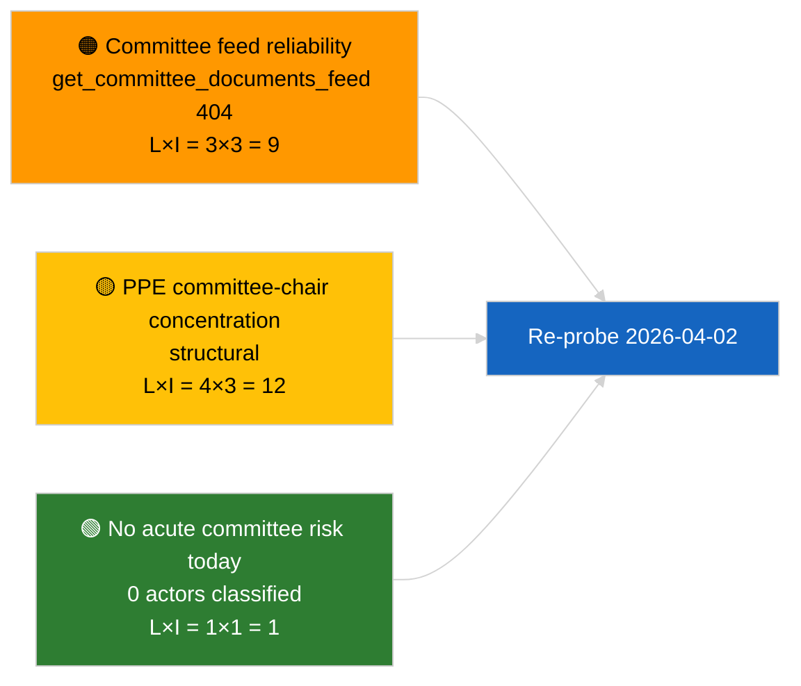

<!-- SPDX-FileCopyrightText: 2026 Hack23 AB -->
<!-- SPDX-License-Identifier: Apache-2.0 -->

# Note de Synthèse — Rapports de Commission | 2026-04-01

**Classification :** OSINT | Document parlementaire public
**Niveau de confiance :** 🟢 Élevé (évaluation structurelle en période de suspension)
**Généré :** 2026-04-01T00:00:00Z (note rétrospective)
**Type d'article :** Rapports de commission
**ID d'exécution :** `64ada77d-c1f3-48f7-804d-be58857d0f18`
**Source :** Portail de données ouvertes du Parlement européen

---

## 🎯 BLUF

**Aucun nouveau rapport de commission identifié pour le 2026-04-01 ; premier jour complet de la suspension des commissions post-mars.** L'exécution `64ada77d-c1f3-48f7-804d-be58857d0f18` a renvoyé **0 acteurs classifiés** et une signification **ROUTINIÈRE** sur l'ensemble des cinq dimensions d'impact, conformément au calendrier intersessionnel du PE10 (les commissions ne siègent pas formellement lors des semaines de suspension plénière, sauf convocation extraordinaire). La ligne de base substantielle pour les rapports de commission est donc le report de mars : le dossier de la ECON sur le Vice-Président de la BCE (TA-10-2026-0060), le rapport TRAN/ENVI sur les crédits d'émissions HDV (TA-10-2026-0084) et le dossier d'immunité Braun de la JURI (TA-10-2026-0088). **🟢 HAUTE confiance** que l'état vide est dû au calendrier.

---

## 🧭 3 Décisions Soutenues par Cette Note

| # | Décision | Décideur | Délai | Éléments de preuve |
|:-:|----------|----------|:-----:|--------------------|
| 1 | **Éditorial :** PASSER le rapport quotidien de commission ; produire un récapitulatif hebdomadaire | Rédacteur | +24h | Sortie d'exécution vide |
| 2 | **Surveillance :** Ajouter `get_committee_documents_feed` à la sonde de santé du prochain cycle (404 le 2026-04-01) | Pipeline de données | 2026-04-02 | Anomalie de disponibilité du flux |
| 3 | **Veille prospective :** Signaler la semaine de travail des commissions du 13 au 17 avril pour le premier cycle substantiel des rapports de commission | Responsable d'analyse | 2026-04-13 | Projets de rapports de commission pré-plénier |

---

## 📰 Lecture en 60 Secondes

- 🔴 **Aucun document de commission dans le flux du jour** — `get_committee_documents_feed` a retourné 404 lors de l'exécution parallèle des actualités. (🟡 Moyen — l'état de santé du point de terminaison est le qualificatif, non l'absence de travail)
- 🟠 **0 acteurs classifiés** dans cette exécution des rapports de commission ; aucun rapporteur, rapporteur fictif ni président de commission identifié. (🟢 Élevé)
- 🟢 **Ligne de base carry-over des commissions :** ECON (BCE), TRAN/ENVI (émissions HDV), JURI (immunité), AFET (Géorgie) restent les portefeuilles actifs de mars à Q2. (🟢 Élevé)
- 🟡 **Dimensions de risque toutes « aucun »** — aucun risque aigu en phase de commission signalé aujourd'hui. (🟢 Élevé)
- 🔵 **Contexte économique :** La confirmation du Vice-Président de la BCE par la ECON fournit un ancrage institutionnel pour Q2. (🟢 Élevé)
- 🟣 **Référence croisée :** l'article frère 2026-04-01/breaking documente le schéma 6/8 flux de conseil 404 qui explique l'absence de données ici. (🟢 Élevé)
- 🩷 **Vecteur de perturbation :** aucun aigu ; risques structurels de dominance PPE et de concentration des présidences de commission hérités. (🟡 Moyen)
- ⚪ **Report :** le dossier EU-Mercosur INTA en attente d'avis de la CJE ; le pipeline CULT/EMPL pas encore pleinement émergent pour Q2.

---

## 🗂️ Tableau des Principaux Documents / Procédures

| Rang | Référence PE | Titre (abrégé) | Importance | Confiance | Statut |
|:----:|--------------|----------------|:----------:|:---------:|--------|
| 1 | — | Aucun rapport de commission le 2026-04-01 | 0,0 | 🟢 ÉLEVÉ | Suspension — aucune activité |
| 2 | TA-10-2026-0060 | ECON — Vice-Président BCE (report) | 7,5 | 🟢 ÉLEVÉ | Adopté le 10 mars ; ligne de base |
| 3 | TA-10-2026-0084 | TRAN/ENVI — Crédits émissions HDV (report) | 7,0 | 🟢 ÉLEVÉ | Adopté le 12 mars ; surveillance de transposition |

---

## ⚠️ Instantané des Risques et Menaces

| Risque | V | I | Score | Déclencheur | Source | Grade amirauté |
|--------|:-:|:-:|:-----:|-------------|--------|:--------------:|
| Fiabilité du flux API de commission | 3 | 3 | 9 | 404 persistant lors du prochain cycle | Exécution frère breaking | B2 |
| Concentration des présidents de commission PPE | 4 | 3 | 12 | Nominations de rapporteurs Q2 | Structurel | A2 |
| Litiges de transposition HDV | 2 | 3 | 6 | Résistance nationale | TA-10-2026-0084 | A1 |

---

## 🔮 Principal Déclencheur Prospectif

**Semaine de travail des commissions du 13 au 17 avril 2026.** Les projets de rapports de commission et les négociations des rapporteurs fictifs pendant cette fenêtre prédéterminent la substance de l'agenda de Strasbourg du 27 au 30 avril ; le premier cycle substantiel des rapports de commission de Q2 démarrera ici.

---

## 🛡️ Évaluation de la Qualité des Sources

- **Sources primaires :** Portail de données ouvertes du PE `get_committee_documents_feed` (404 le 2026-04-01 selon les exécutions parallèles) et sortie de classification de l'exécution d'analyse `64ada77d-c1f3-48f7-804d-be58857d0f18` (0 acteurs).
- **Limites des données :** L'indisponibilité du flux empêche la corroboration indépendante de « aucune activité » — la confiance dans l'absence de nouveaux documents de commission est 🟡 moyen en attente de la sonde du prochain cycle.
- **Confiance dans l'inactivité due au calendrier :** 🟢 ÉLEVÉ.

---

## 📎 Liens

| Lien | Chemin |
|------|--------|
| Article | `./article.md` |
| Classification (vide) | `./classification/` |
| Notation des risques | `./risk-scoring/` |
| Exécution frère breaking | `analysis/daily/2026-04-01/breaking/` |
| Manifeste | `./manifest.json` |

---

## 🔄 Référence Croisée

**Exécutions simultanées :** 2026-04-01 breaking / month-ahead / motions / propositions — toutes montrent le même schéma de modèle vide, confirmant qu'il s'agit d'un état de période de suspension à l'échelle du système, et non d'un défaut spécifique aux rapports de commission.

**Delta par rapport aux exécutions précédentes :** L'activité des commissions avant la suspension (semaine de Strasbourg 9-12 mars, mini-plénière de Bruxelles 25-26 mars) était substantielle ; la transition vers la suspension est la variable explicative, non une régression.

---

**Contrôle des documents**
- **Modèle :** `/analysis/templates/executive-brief.md`
- **Chemin d'artefact :** `analysis/daily/2026-04-01/committee-reports/executive-brief.md`
- **Classification :** Public
- **Génération rétrospective :** Session de rétro-remplissage.
