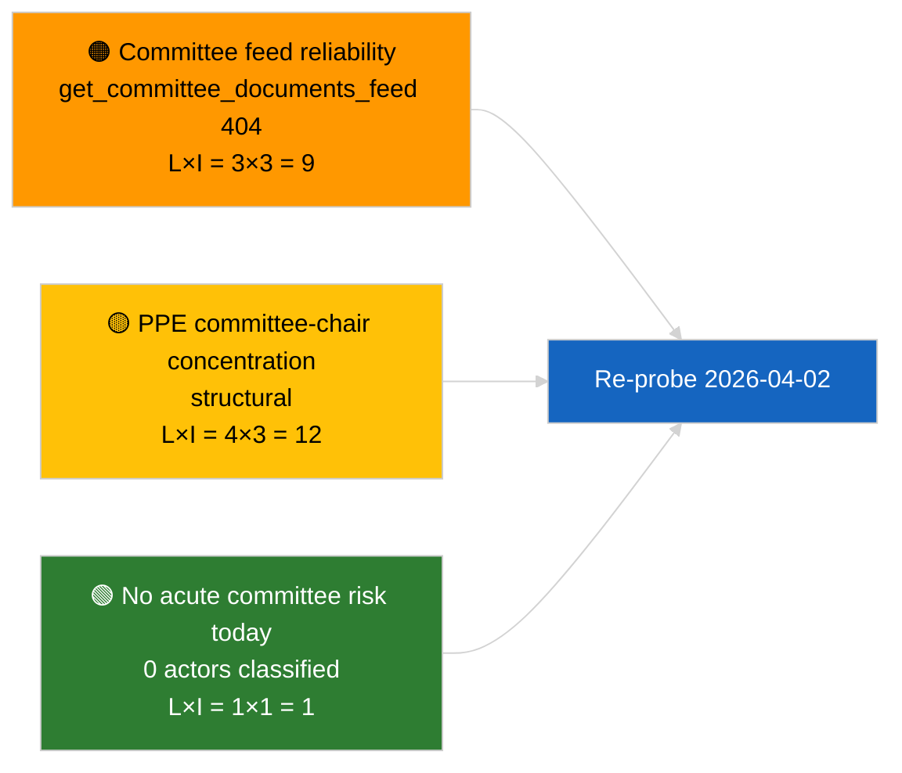

<!-- SPDX-FileCopyrightText: 2026 Hack23 AB -->
<!-- SPDX-License-Identifier: Apache-2.0 -->

# סיכום מנהלים — דוחות ועדות | 2026-04-01

**סיווג:** OSINT | תיעוד פרלמנטרי ציבורי
**רמת אמינות:** 🟢 גבוהה (הערכה מבנית בתקופת הפסקה)
**נוצר:** 2026-04-01T00:00:00Z (סיכום רטרוספקטיבי)
**סוג מאמר:** דוחות ועדות
**מזהה ריצה:** `64ada77d-c1f3-48f7-804d-be58857d0f18`
**מקור:** פורטל הנתונים הפתוח של הפרלמנט האירופי

---

## 🎯 BLUF

**לא זוהו דוחות ועדות חדשים לתאריך 2026-04-01; היום המלא הראשון של תקופת הפסקת הוועדות שלאחר מרץ.** ריצה `64ada77d-c1f3-48f7-804d-be58857d0f18` החזירה **0 גורמים מסווגים** ומשמעות **שגרתית** על פני כל חמש מימדי ההשפעה, בהתאם ללוח השנה הבין-מושבי של EP10 (ועדות אינן מתכנסות רשמית בשבועות הפסקת מליאה אלא אם כן כונסו באופן חריג). קו הבסיס המהותי של דוחות הועדות מחודש מרץ ממשיך: תיק סגן נשיא ECB של ECON (TA-10-2026-0060), דוח TRAN/ENVI על זיכויי פליטות HDV (TA-10-2026-0084), ותיק חסינות בראון של JURI (TA-10-2026-0088). **🟢 אמינות גבוהה** שהמצב הריק מונע על ידי לוח השנה.

---

## 🧭 3 החלטות שסיכום זה תומך בהן

| # | החלטה | מקבל החלטה | מועד אחרון | ראיות |
|:-:|-------|-----------|:----------:|-------|
| 1 | **עריכה:** דלג על דוח ועדות יומי; הפק סיכום שבועי | עורך | +24 שעות | פלט ריצה ריק |
| 2 | **מעקב:** הוסף `get_committee_documents_feed` לבדיקת בריאות המחזור הבא (404 ב-2026-04-01) | צינור נתונים | 2026-04-02 | חריגת זמינות זרם |
| 3 | **מעקב קדימה:** סמן שבוע עבודת ועדות 13-17 באפריל למחזור הראשון המהותי של דוחות ועדות | אחראי ניתוח | 2026-04-13 | טיוטות ועדות לפני מליאה |

---

## 📰 קריאה של 60 שניות

- 🔴 **אין מסמכי ועדות בזרם היום** — `get_committee_documents_feed` החזיר 404 בריצת החדשות האחרונות המקבילה. (🟡 בינוני — מצב נקודת הקצה הוא המוגדר, לא היעדר עבודה)
- 🟠 **0 גורמים סווגו** בריצת דוחות הועדות; לא זוהו מרצים, מרצי צל או יושבי-ראש ועדות. (🟢 גבוה)
- 🟢 **קו הבסיס הנמשך של הועדה:** ECON (ECB), TRAN/ENVI (פליטות HDV), JURI (חסינות), AFET (גאורגיה) ממשיכים להיות תיקים פעילים ממרץ ל-Q2. (🟢 גבוה)
- 🟡 **מימדי סיכון כולם "אין"** — לא דווח על סיכון חריף בשלב הועדה היום. (🟢 גבוה)
- 🔵 **הקשר כלכלי:** אישור ECON לסגן נשיא ECB מספק עוגן מוסדי ל-Q2. (🟢 גבוה)
- 🟣 **הפניה צולבת:** המאמר השותף 2026-04-01/breaking מתעד את דפוס 6/8 של שגיאות זרם ייעוץ 404 המסביר את היעדר הנתונים כאן. (🟢 גבוה)
- 🩷 **וקטור שיבוש:** ללא חריף; סיכוני דומיננטיות PPE מבנית וריכוז יושבי-ראש ועדות שנורשו. (🟡 בינוני)
- ⚪ **העברה קדימה:** תיק INTA של EU-Mercosur ממתין לחוות דעת CJEU; צינור CULT/EMPL עדיין לא צץ לחלוטין ל-Q2.

---

## 🗂️ מסמכים מובילים / טבלת נהלים

| דרוג | מסמך EP | כותרת (קצרה) | חשיבות | אמינות | סטטוס |
|:----:|---------|--------------|:------:|:------:|-------|
| 1 | — | אין דוחות ועדות ב-2026-04-01 | 0.0 | 🟢 גבוהה | הפסקה — אין פעילות |
| 2 | TA-10-2026-0060 | ECON — סגן נשיא ECB (נמשך) | 7.5 | 🟢 גבוהה | אושר 10 במרץ; קו בסיס |
| 3 | TA-10-2026-0084 | TRAN/ENVI — זיכויי פליטות HDV (נמשך) | 7.0 | 🟢 גבוהה | אושר 12 במרץ; מעקב אחר אימוץ |

---

## ⚠️ תמונת מצב סיכונים ואיומים

| סיכון | ל | ת | ניקוד | מחולל | מקור | דרגת אדמירלות |
|-------|:-:|:-:|:-----:|-------|------|:-------------:|
| אמינות API זרם ועדות | 3 | 3 | 9 | 404 מתמשך במחזור הבא | ריצת חדשות אחרונות שותפה | B2 |
| ריכוז יושבי-ראש ועדות PPE | 4 | 3 | 12 | מינויי מרצים ל-Q2 | מבני | A2 |
| סכסוכי העברת HDV | 2 | 3 | 6 | התנגדות לאומית | TA-10-2026-0084 | A1 |

---

## 🔮 המחולל הצופה קדימה המוביל

**שבוע עבודת ועדות 13-17 באפריל 2026.** טיוטות דוחות ועדות ומשאות ומתנים של מרצי צל בחלון זה קובעים מראש את תוכן סדר היום של שטרסבורג ב-27-30 באפריל; מחזור דוחות הועדות המהותי הראשון של Q2 נוחת כאן.

---

## 🛡️ הערכת איכות מקורות

- **מקורות ראשוניים:** פורטל הנתונים הפתוח של EP `get_committee_documents_feed` (404 ב-2026-04-01 לפי ריצות מקבילות) ופלט סיווג ריצת ניתוח `64ada77d-c1f3-48f7-804d-be58857d0f18` (0 גורמים).
- **מגבלות נתונים:** אי-זמינות הזרם מונעת אישור עצמאי של "אין פעילות" — אמינות בנוגע להיעדר מסמכי ועדות חדשים היא 🟡 בינונית עד לבדיקת המחזור הבא.
- **אמינות לגבי חוסר פעילות מונע לוח שנה:** 🟢 גבוהה.

---

## 📎 קישורים

| קישור | נתיב |
|-------|-------|
| מאמר | `./article.md` |
| סיווג (ריק) | `./classification/` |
| ניקוד סיכונים | `./risk-scoring/` |
| ריצת חדשות אחרונות שותפה | `analysis/daily/2026-04-01/breaking/` |
| מניפסט | `./manifest.json` |

---

## 🔄 הפניה צולבת

**ריצות מקבילות:** 2026-04-01 חדשות אחרונות / חודש קדימה / הצעות / הצעות חוק — כולן מציגות את אותו דפוס תבנית ריקה, מאשר שזהו מצב תקופת הפסקה ברחבי המערכת, לא כשל ספציפי לדוחות ועדות.

**דלתא מריצות קודמות:** פעילות ועדות קדם-הפסקה (שבוע שטרסבורג 9-12 במרץ, מיני-מליאת בריסל 25-26 במרץ) הייתה מהותית; המעבר להפסקה הוא המשתנה המסביר, לא רגרסיה.

---

**בקרת מסמכים**
- **תבנית:** `/analysis/templates/executive-brief.md`
- **נתיב הגורם:** `analysis/daily/2026-04-01/committee-reports/executive-brief.md`
- **סיווג:** ציבורי
- **יצירה רטרוספקטיבית:** מושב מילוי לאחור.
