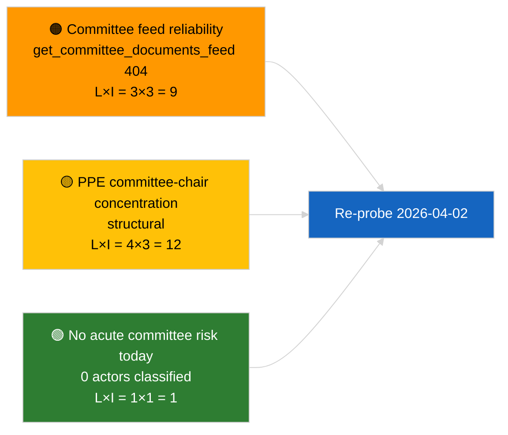

<!-- SPDX-FileCopyrightText: 2026 Hack23 AB -->
<!-- SPDX-License-Identifier: Apache-2.0 -->

# תדריך מנהלים — דוחות ועדות | 2026-04-01

**סיווג:** OSINT | תיעוד פרלמנטרי ציבורי
**רמת ביטחון:** 🟢 גבוהה (הערכה מבנית בתקופת הפסקה)
**נוצר:** 2026-04-01T00:00:00Z (תדריך רטרוספקטיבי)
**סוג מאמר:** דוחות ועדות
**מזהה ריצה:** `64ada77d-c1f3-48f7-804d-be58857d0f18`
**מקור:** פורטל הנתונים הפתוח של הפרלמנט האירופי

---

## 🎯 BLUF

**לא זוהו דוחות ועדות חדשים ל-2026-04-01; היום המלא הראשון של הפסקת הוועדות לאחר מרץ.** ריצה `64ada77d-c1f3-48f7-804d-be58857d0f18` החזירה **0 שחקנים מסווגים** ומשמעות **שגרתית** בכל חמשת מימדי ההשפעה, בהתאם ללוח הזמנים הבין-מושבי של EP10 (ועדות לא מתכנסות באופן רשמי בזמן שבועות הפסקת המליאה אלא אם כינוסן מיוחד). לפיכך, קו הבסיס המהותי לדוחות הוועדות הוא ה-carry-over ממרץ: תיק ECON על סגן נשיא הבנק המרכזי האירופי (TA-10-2026-0060), דוח TRAN/ENVI על קרדיטים לפליטות HDV (TA-10-2026-0084), ותיק החסינות של Braun ב-JURI (TA-10-2026-0088). **🟢 ביטחון גבוה** שהמצב הריק מונע מלוח הזמנים.

---

## 🧭 3 החלטות שתדריך זה תומך בהן

| # | החלטה | מחליט | מועד אחרון | ראיות |
|:-:|-------|-------|:----------:|-------|
| 1 | **עריכה:** דלג על דוח הוועדות היומי; הפק סיכום שבועי | עורך | +24 שעות | פלט ריצה ריק |
| 2 | **ניטור:** הוסף `get_committee_documents_feed` לבדיקת בריאות המחזור הבא (404 ב-2026-04-01) | צינור נתונים | 2026-04-02 | אנומליה בזמינות פיד |
| 3 | **מעקב עתידי:** סמן את שבוע עבודת הוועדות 13-17 באפריל כמחזור ראשון מהותי של דוחות ועדות | ראש ניתוח | 2026-04-13 | טיוטות ועדות לפני המליאה |

---

## 📰 קריאה של 60 שניות

- 🔴 **אין מסמכי ועדות בפיד של היום** — `get_committee_documents_feed` החזיר 404 בריצת החדשות המקבילה. (🟡 בינוני — בריאות נקודת הקצה היא הגורם המוסמך, לא היעדר עבודה)
- 🟠 **0 שחקנים מסווגים** בריצת דוחות הוועדות זו; לא זוהו מרצים, מרצי צל, או יושבי ראש ועדות. (🟢 גבוה)
- 🟢 **קו בסיס carry-over של ועדות:** ECON (בנק מרכזי אירופי), TRAN/ENVI (פליטות HDV), JURI (חסינות), AFET (גאורגיה) נשארים התיקים הפעילים ממרץ עד Q2. (🟢 גבוה)
- 🟡 **מימדי סיכון כולם "אין"** — לא סומן סיכון חמור בשלב הוועדות היום. (🟢 גבוה)
- 🔵 **הקשר כלכלי:** אישור ECON לסגן נשיא הבנק המרכזי האירופי מספק עוגן מוסדי ל-Q2. (🟢 גבוה)
- 🟣 **הפניה צולבת:** המאמר האח 2026-04-01/breaking מתעד את דפוס 404 של 6/8 פידי ייעוץ המסביר את היעדר הנתונים כאן. (🟢 גבוה)
- 🩷 **וקטור שיבוש:** אין חמור; סיכונים מובנים שנורשו של דומיננטיות PPE וריכוז יושבי ראש ועדות. (🟡 בינוני)
- ⚪ **carry-forward:** תיק INTA EU-Mercosur ממתין לחוות דעת בית משפט האיחוד האירופי; צינור CULT/EMPL טרם עלה במלואו ל-Q2.

---

## 🗂️ טבלת המסמכים / ההליכים המובילים

| דירוג | הפניה לפרלמנט האירופי | כותרת (קצרה) | מובהקות | ביטחון | סטטוס |
|:-----:|----------------------|--------------|:-------:|:------:|-------|
| 1 | — | אין דוחות ועדות ב-2026-04-01 | 0.0 | 🟢 גבוה | הפסקה — אין פעילות |
| 2 | TA-10-2026-0060 | ECON — סגן נשיא בנק מרכזי אירופי (carry-over) | 7.5 | 🟢 גבוה | אומץ 10 מרץ; קו בסיס |
| 3 | TA-10-2026-0084 | TRAN/ENVI — קרדיטים פליטות HDV (carry-over) | 7.0 | 🟢 גבוה | אומץ 12 מרץ; מעקב עיגון |

---

## ⚠️ תמונת מצב סיכונים ואיומים

| סיכון | ס | ע | ציון | מפעיל | מקור | דרגת אדמירלות |
|-------|:-:|:-:|:----:|-------|------|:--------------:|
| אמינות API פיד ועדות | 3 | 3 | 9 | 404 מתמשך במחזור הבא | ריצת breaking האחות | B2 |
| ריכוז יושבי ראש ועדות PPE | 4 | 3 | 12 | מינויי מרצים Q2 | מבני | A2 |
| סכסוכי עיגון HDV | 2 | 3 | 6 | התנגדות לאומית | TA-10-2026-0084 | A1 |

---

## 🔮 הגורם המניע העתידי המוביל

**שבוע עבודת הוועדות 13-17 באפריל 2026.** טיוטות דוחות הוועדות ומשא ומתן של מרצי הצל בחלון זה קובעים מראש את תוכן סדר יום שטרסבורג של 27-30 באפריל; המחזור הראשון המהותי של דוחות הוועדות ב-Q2 יחל כאן.

---

## 🛡️ הערכת איכות מקורות

- **מקורות ראשיים:** פורטל הנתונים הפתוח של הפרלמנט האירופי `get_committee_documents_feed` (404 ב-2026-04-01 לפי ריצות מקבילות) ופלט סיווג ריצת ניתוח `64ada77d-c1f3-48f7-804d-be58857d0f18` (0 שחקנים).
- **מגבלות נתונים:** אי-זמינות הפיד מונעת אימות עצמאי של "אין פעילות" — רמת הביטחון בהיעדר מסמכי ועדות חדשים היא 🟡 בינונית בהמתנה לסריקת המחזור הבא.
- **ביטחון בחוסר פעילות מונע מלוח הזמנים:** 🟢 גבוה.

---

## 📎 קישורים

| קישור | נתיב |
|-------|------|
| מאמר | `./article.md` |
| סיווג (ריק) | `./classification/` |
| ניקוד סיכונים | `./risk-scoring/` |
| ריצת breaking האחות | `analysis/daily/2026-04-01/breaking/` |
| מניפסט | `./manifest.json` |

---

## 🔄 הפניה צולבת

**ריצות מקבילות:** 2026-04-01 breaking / month-ahead / motions / propositions — כולן מציגות את אותו דפוס תבנית ריקה, מה שמאשר שמדובר במצב תקופת הפסקה רחב-מערכת, לא כשל ספציפי לדוחות ועדות.

**דלתא לעומת ריצות קודמות:** פעילות הוועדות לפני ההפסקה (שבוע שטרסבורג 9-12 מרץ, מליאה מיני בבריסל 25-26 מרץ) הייתה מהותית; מעבר ההפסקה הוא המשתנה המסביר, לא נסיגה.

---

**בקרת מסמכים**
- **תבנית:** `/analysis/templates/executive-brief.md`
- **נתיב קובץ:** `analysis/daily/2026-04-01/committee-reports/executive-brief.md`
- **סיווג:** ציבורי
- **יצירה רטרוספקטיבית:** פגישת מילוי רטרואקטיבי.
