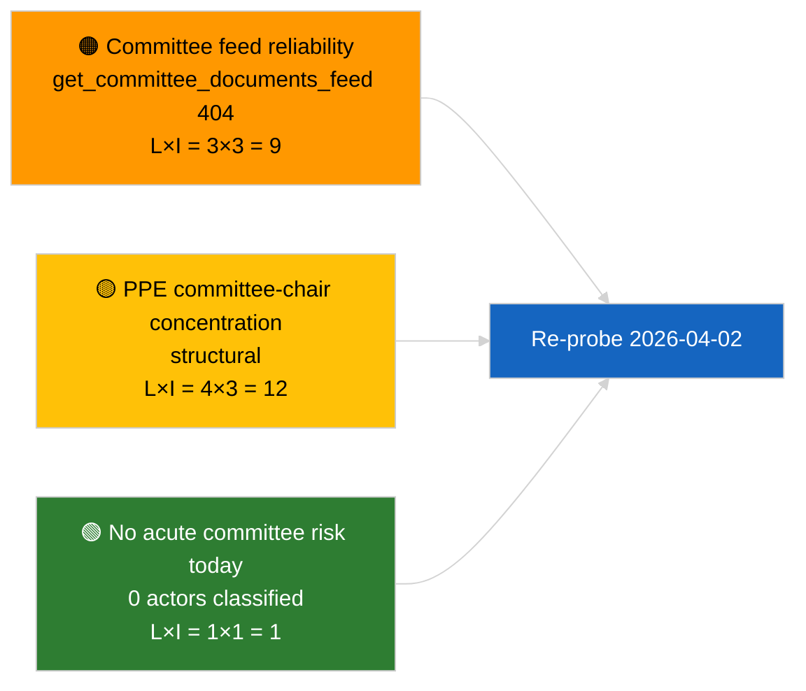

<!-- SPDX-FileCopyrightText: 2026 Hack23 AB -->
<!-- SPDX-License-Identifier: Apache-2.0 -->

# エグゼクティブ・ブリーフ — 委員会報告 | 2026-04-01

**分類:** OSINT | 公開議会記録
**信頼水準:** 🟢 高（休会期間中の構造的評価）
**作成日:** 2026-04-01T00:00:00Z (遡及的ブリーフ)
**記事タイプ:** 委員会報告
**実行ID:** `64ada77d-c1f3-48f7-804d-be58857d0f18`
**出典:** 欧州議会オープンデータポータル

---

## 🎯 BLUF

**2026年4月1日に新しい委員会報告は確認されなかった。3月以降の委員会休会の最初の丸一日。** 実行 `64ada77d-c1f3-48f7-804d-be58857d0f18` は5つの影響次元すべてで**0件の分類済み関係者**と**日常的**な重要性を返した。これはEP10の会期間カレンダーと一致している（委員会は特別召集がない限り、本会議休会週に正式には開かない）。したがって委員会報告の実質的なベースラインは3月からの繰り越しとなる：ECON のECB副総裁ファイル（TA-10-2026-0060）、TRAN/ENVIのHDV排出クレジット報告（TA-10-2026-0084）、JURIのBraun免責案件（TA-10-2026-0088）。**🟢 高**信頼水準：空の状態はカレンダーによるもの。

---

## 🧭 このブリーフが支援する3つの決定

| # | 決定 | 決定者 | 期限 | 根拠 |
|:-:|------|--------|:----:|------|
| 1 | **編集：** 日次委員会報告をスキップ；週次要約を作成 | 編集者 | +24時間 | 空の実行出力 |
| 2 | **監視：** 次のサイクルの健全性プローブに `get_committee_documents_feed` を追加（2026-04-01に404） | データパイプライン | 2026-04-02 | フィード可用性の異常 |
| 3 | **将来監視：** 4月13〜17日の委員会作業週を最初の実質的な委員会報告サイクルとしてフラグ | 分析責任者 | 2026-04-13 | 本会議前委員会草稿 |

---

## 📰 60秒の読み

- 🔴 **今日のフィードに委員会文書なし** — `get_committee_documents_feed` が並行ニュース実行で404を返した。（🟡 中：エンドポイントの健全性が条件、作業の不在ではない）
- 🟠 **0件の関係者が分類**：この委員会報告実行では報告者、影の報告者、委員会委員長は特定されなかった。（🟢 高）
- 🟢 **委員会繰り越しベースライン：** ECON（ECB）、TRAN/ENVI（HDV排出）、JURI（免責）、AFET（ジョージア）が3月から第2四半期の活発なポートフォリオとして継続。（🟢 高）
- 🟡 **リスク次元はすべて「なし」** — 本日は委員会段階での急性リスクはフラグなし。（🟢 高）
- 🔵 **経済文脈：** ECONのECB副総裁確認が第2四半期の制度的碇を提供。（🟢 高）
- 🟣 **相互参照：** 2026-04-01/breaking の兄弟記事がここのデータ不在を説明する6/8 アドバイザリーフィード404パターンを文書化。（🟢 高）
- 🩷 **混乱ベクター：** 急性なし；PPEの構造的優位性と委員会委員長集中リスクを継承。（🟡 中）
- ⚪ **繰り越し：** EU-MercosurのINTAファイルがECJの意見を待機中；CULT/EMPLパイプラインは第2四半期にまだ完全に出現していない。

---

## 🗂️ 主要文書 / 手続き表

| 順位 | EP参照 | タイトル（短縮） | 重要度 | 信頼度 | ステータス |
|:----:|--------|-----------------|:------:|:------:|-----------|
| 1 | — | 2026-04-01に委員会報告なし | 0.0 | 🟢 高 | 休会 — 活動なし |
| 2 | TA-10-2026-0060 | ECON — ECB副総裁（繰り越し） | 7.5 | 🟢 高 | 3月10日採択；ベースライン |
| 3 | TA-10-2026-0084 | TRAN/ENVI — HDV排出クレジット（繰り越し） | 7.0 | 🟢 高 | 3月12日採択；移行監視 |

---

## ⚠️ リスク・脅威スナップショット

| リスク | 可 | 影 | スコア | トリガー | 出典 | 提督等級 |
|--------|:--:|:--:|:------:|----------|------|:--------:|
| 委員会フィードAPIの信頼性 | 3 | 3 | 9 | 次のサイクルで継続する404 | 兄弟breaking実行 | B2 |
| PPE委員会委員長集中 | 4 | 3 | 12 | Q2報告者任命 | 構造的 | A2 |
| HDV移行紛争 | 2 | 3 | 6 | 国内反発 | TA-10-2026-0084 | A1 |

---

## 🔮 主要将来トリガー

**2026年4月13〜17日の委員会作業週。** この期間中の委員会草稿報告書と影の報告者の交渉が、4月27〜30日のストラスブール議題の内容を事前に決定する；第2四半期の最初の実質的な委員会報告サイクルはここで始まる。

---

## 🛡️ ソース品質評価

- **一次情報源：** EPオープンデータポータル `get_committee_documents_feed`（並行実行によると2026-04-01に404）と分析実行 `64ada77d-c1f3-48f7-804d-be58857d0f18` の分類出力（0関係者）。
- **データ制限：** フィードの利用不可により「活動なし」の独立した確認が不可能 — 次のサイクルのプローブ待ちで新しい委員会文書の不在に対する信頼は🟡 中。
- **カレンダー主導の不活動への信頼：** 🟢 高。

---

## 📎 リンク

| リンク | パス |
|--------|------|
| 記事 | `./article.md` |
| 分類（空） | `./classification/` |
| リスク評価 | `./risk-scoring/` |
| 兄弟breaking実行 | `analysis/daily/2026-04-01/breaking/` |
| マニフェスト | `./manifest.json` |

---

## 🔄 相互参照

**並行実行：** 2026-04-01 breaking / month-ahead / motions / propositions — すべてが同じ空のテンプレートパターンを示しており、これが委員会報告固有の障害ではなく、システム全体の休会期間状態であることを確認している。

**前回実行からの変化：** 休会前の委員会活動（ストラスブール週3月9〜12日、ブリュッセルミニ本会議3月25〜26日）は実質的だった；休会移行が説明変数であり、後退ではない。

---

**文書管理**
- **テンプレート：** `/analysis/templates/executive-brief.md`
- **成果物パス：** `analysis/daily/2026-04-01/committee-reports/executive-brief.md`
- **分類：** 公開
- **遡及的生成：** バックフィルセッション。
