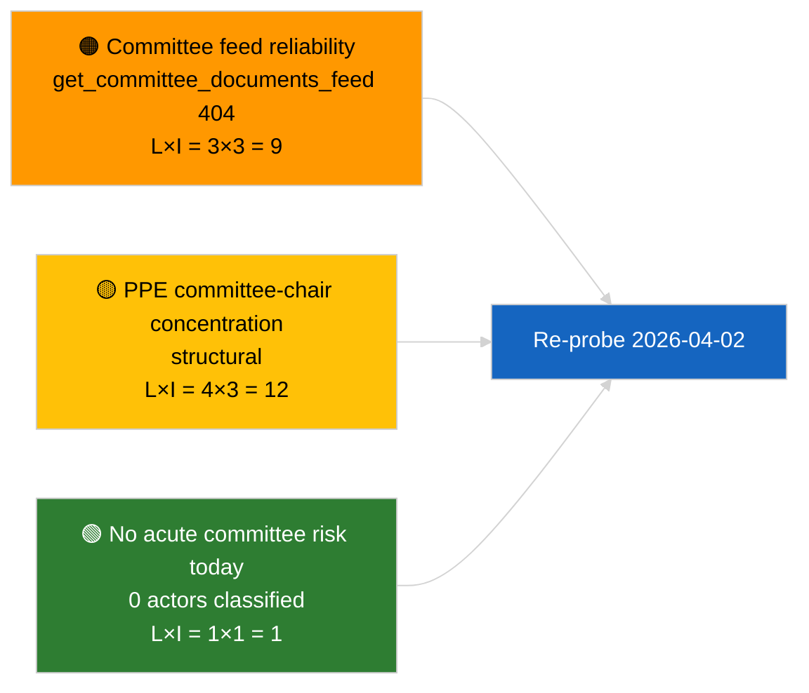

<!-- SPDX-FileCopyrightText: 2026 Hack23 AB -->
<!-- SPDX-License-Identifier: Apache-2.0 -->

# エグゼクティブ・ブリーフ — 委員会報告書 | 2026-04-01

**分類：** OSINT | 公開議会文書
**信頼度：** 🟢 高（休会期における構造的評価）
**作成日時：** 2026-04-01T00:00:00Z（遡及サマリー）
**記事種別：** 委員会報告書
**実行ID：** `64ada77d-c1f3-48f7-804d-be58857d0f18`
**出典：** 欧州議会オープンデータポータル

---

## 🎯 BLUF

**2026-04-01時点では新規委員会報告書はなし；3月以降の委員会休会初日。** 実行`64ada77d-c1f3-48f7-804d-be58857d0f18`は**0件のアクター分類**を返し、5つの影響力次元すべてにわたって**ルーティン**の評価となった。これはEP10の会期間カレンダー（本会議休会週には特段の召集がない限り委員会は正式に開催しない）に沿ったものです。3月委員会報告書の実質的ベースラインは継続中：EIT副総裁EconポートフォリオのECON（TA-10-2026-0060）、HDV排出クレジットに関するTRAN/ENVI（TA-10-2026-0084）、JURI議員免除案件（TA-10-2026-0088）。**🟢 信頼度高**：空の状態はカレンダー主導。

---

## 🧭 このブリーフが支援する3つの意思決定

| # | 意思決定 | 意思決定者 | 期限 | 証拠 |
|:-:|---------|-----------|:----:|------|
| 1 | **編集：** 本日の委員会報告書は省略；週次サマリーを作成 | 編集者 | +24時間 | 実行結果ゼロ |
| 2 | **追跡：** 次サイクルのヘルスチェックに`get_committee_documents_feed`を追加（2026-04-01の404エラー） | データパイプライン | 2026-04-02 | フィード可用性例外 |
| 3 | **先行追跡：** 4月13〜17日の委員会作業週を委員会報告書初回実質サイクルとしてマーク | 分析担当 | 2026-04-13 | 本会議前委員会草稿 |

---

## 📰 60秒リード

- 🔴 **本日フィードに委員会文書なし** — `get_committee_documents_feed`は直近の並行実行で404を返した。（🟡 中程度 — エンドポイント状態は定義済み、作業がないわけではない）
- 🟠 **0件のアクター分類** — 代表者、シャドー代表者、委員会委員長は識別されなかった。（🟢 高）
- 🟢 **委員会継続ベースライン：** ECON（ECB）、TRAN/ENVI（HDV排出）、JURI（免除）、AFET（ジョージア）は3月からQ2への継続案件。（🟢 高）
- 🟡 **リスク次元すべて「なし」** — 委員会フェーズにおける本日の緊急リスクなし。（🟢 高）
- 🔵 **経済的文脈：** ECON承認によるECB副総裁はQ2の制度的アンカーを提供。（🟢 高）
- 🟣 **クロスリファレンス：** 2026-04-01/breaking記事はここでのデータ欠如を説明するアドバイザリー404フィード障害の6/8パターンを記録。（🟢 高）
- 🩷 **混乱ベクター：** 緊急なし；PPE構造的支配と委員会委員長集中のリスクを指摘。（🟡 中程度）
- ⚪ **前進移行：** EU-MercosurのINTAポートフォリオはCJEU意見待ち；CULT/EMPLパイプラインはQ2に完全浮上せず。

---

## 🗂️ 主要文書 / 手続き一覧

| 順位 | EP文書 | タイトル（短縮） | 重要度 | 信頼度 | 状態 |
|:---:|---------|--------------|:------:|:------:|------|
| 1 | — | 2026-04-01は委員会報告書なし | 0.0 | 🟢 高 | 休会 — 活動なし |
| 2 | TA-10-2026-0060 | ECON — ECB副総裁（継続） | 7.5 | 🟢 高 | 3月10日承認；ベースライン |
| 3 | TA-10-2026-0084 | TRAN/ENVI — HDV排出クレジット（継続） | 7.0 | 🟢 高 | 3月12日承認；採択追跡 |

---

## ⚠️ リスク・脅威スナップショット

| リスク | 確率 | 影響 | スコア | 誘発要因 | 出典 | 評価段階 |
|-------|:---:|:---:|:-----:|---------|------|:--------:|
| 委員会フィードAPI信頼性 | 3 | 3 | 9 | 次サイクルでの持続的404 | 直近並行実行 | B2 |
| PPE委員会委員長集中 | 4 | 3 | 12 | Q2代表者任命 | 構造的 | A2 |
| HDV移行紛争 | 2 | 3 | 6 | 国別反対 | TA-10-2026-0084 | A1 |

---

## 🔮 主要先行トリガー

**2026年4月13〜17日委員会作業週。** この期間中の委員会報告書草稿とシャドー代表者交渉が4月27〜30日のストラスブール本会議議題内容を先行決定する；Q2最初の実質的委員会報告書サイクルがここに到着する。

---

## 🛡️ ソース品質評価

- **一次情報源：** EP オープンデータポータル `get_committee_documents_feed`（並行実行によると2026-04-01は404）と分析実行`64ada77d-c1f3-48f7-804d-be58857d0f18`の分類出力（0件のアクター）。
- **データ制限：** フィード不可用により「活動なし」の独立検証が不可能 — 新規委員会文書がないという信頼度は次サイクル確認まで🟡中程度。
- **カレンダー主導の非活動信頼度：** 🟢 高。

---

## 📎 リンク

| リンク | パス |
|-------|------|
| 記事 | `./article.md` |
| 分類（空） | `./classification/` |
| リスクスコアリング | `./risk-scoring/` |
| 直近並行実行 | `analysis/daily/2026-04-01/breaking/` |
| マニフェスト | `./manifest.json` |

---

## 🔄 クロスリファレンス

**並行実行：** 2026-04-01の最新ニュース/翌月展望/動議/提案 — 全て同一の空テンプレートパターンを示し、これが委員会報告書固有の障害ではなくシステム全体の休会状態であることを確認。

**前回実行からのデルタ：** 休会前の委員会活動（3月9〜12日ストラスブール週、3月25〜26日ブリュッセルミニ本会議）は実質的だった；休会への移行が回帰ではなく説明変数。

---

**文書管理**
- **テンプレート：** `/analysis/templates/executive-brief.md`
- **アクターパス：** `analysis/daily/2026-04-01/committee-reports/executive-brief.md`
- **分類：** 公開
- **遡及作成：** バックフィルセッション。
