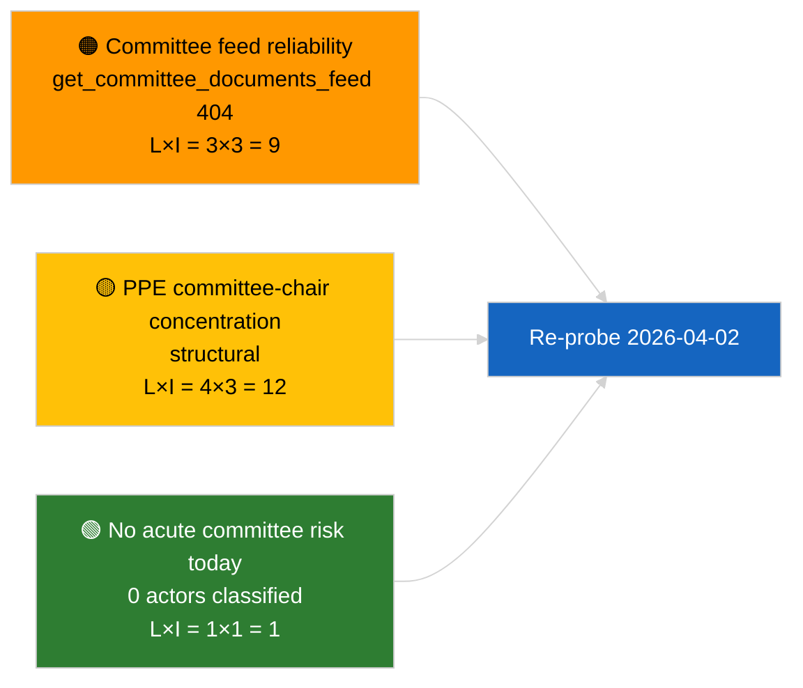

<!-- SPDX-FileCopyrightText: 2026 Hack23 AB -->
<!-- SPDX-License-Identifier: Apache-2.0 -->

# 행정 브리핑 — 위원회 보고서 | 2026-04-01

**분류:** OSINT | 공개 의회 기록
**신뢰 수준:** 🟢 높음 (휴회 기간 중 구조적 평가)
**생성일:** 2026-04-01T00:00:00Z (소급 브리핑)
**기사 유형:** 위원회 보고서
**실행 ID:** `64ada77d-c1f3-48f7-804d-be58857d0f18`
**출처:** 유럽의회 개방형 데이터 포털

---

## 🎯 BLUF

**2026-04-01에 새로운 위원회 보고서가 확인되지 않음; 3월 이후 위원회 휴회의 첫 번째 완전한 날.** 실행 `64ada77d-c1f3-48f7-804d-be58857d0f18`은 모든 5개 영향 차원에서 **0명의 분류된 행위자**와 **일상적** 중요도를 반환했으며, 이는 EP10의 회기 간 달력과 일치한다 (위원회는 임시 소집이 없는 한 본회의 휴회 주간에 공식적으로 열리지 않는다). 따라서 위원회 보고서의 실질적 기준선은 3월의 이월분이다: ECON의 ECB 부총재 파일 (TA-10-2026-0060), TRAN/ENVI의 HDV 배출 크레딧 보고서 (TA-10-2026-0084), 그리고 JURI의 브라운 면책 사건 (TA-10-2026-0088). **🟢 높은 신뢰도**: 빈 상태는 달력에 의해 결정됨.

---

## 🧭 이 브리핑이 지원하는 3가지 결정

| # | 결정 | 결정자 | 기한 | 증거 |
|:-:|------|--------|:----:|------|
| 1 | **편집:** 일일 위원회 보고서 건너뛰기; 주간 요약 작성 | 편집자 | +24시간 | 빈 실행 출력 |
| 2 | **모니터링:** 다음 사이클 상태 점검에 `get_committee_documents_feed` 추가 (2026-04-01에 404) | 데이터 파이프라인 | 2026-04-02 | 피드 가용성 이상 |
| 3 | **선제적 모니터링:** 4월 13-17일 위원회 작업 주간을 첫 번째 실질적 위원회 보고서 사이클로 표시 | 분석 책임자 | 2026-04-13 | 본회의 전 위원회 초안 |

---

## 📰 60초 읽기

- 🔴 **오늘 피드에 위원회 문서 없음** — `get_committee_documents_feed`가 병행 뉴스 실행에서 404를 반환했다. (🟡 중간 — 엔드포인트 상태가 자격 요건이며 작업 부재가 아님)
- 🟠 **0명의 행위자 분류**: 이 위원회 보고서 실행에서 보고관, 예비 보고관, 위원회 의장이 확인되지 않음. (🟢 높음)
- 🟢 **위원회 이월 기준선:** ECON (ECB), TRAN/ENVI (HDV 배출), JURI (면책), AFET (조지아)가 3월부터 Q2까지 활성 포트폴리오로 유지. (🟢 높음)
- 🟡 **리스크 차원 모두 "없음"** — 오늘 위원회 단계 급성 리스크 없음. (🟢 높음)
- 🔵 **경제적 맥락:** ECON의 ECB 부총재 확인이 Q2를 위한 제도적 닻을 제공. (🟢 높음)
- 🟣 **교차 참조:** 2026-04-01/breaking 형제 기사는 여기서 데이터 부재를 설명하는 6/8 자문 피드 404 패턴을 문서화. (🟢 높음)
- 🩷 **혼란 요인:** 급성 없음; 구조적 PPE 지배력 및 위원회 의장 집중 리스크 상속. (🟡 중간)
- ⚪ **이월:** EU-Mercosur INTA 파일이 EU 사법재판소 의견 대기 중; CULT/EMPL 파이프라인이 Q2에 아직 완전히 나타나지 않음.

---

## 🗂️ 주요 문서 / 절차 표

| 순위 | EP 참조 | 제목 (약어) | 중요도 | 신뢰도 | 상태 |
|:----:|---------|------------|:------:|:------:|------|
| 1 | — | 2026-04-01에 위원회 보고서 없음 | 0.0 | 🟢 높음 | 휴회 — 활동 없음 |
| 2 | TA-10-2026-0060 | ECON — ECB 부총재 (이월) | 7.5 | 🟢 높음 | 3월 10일 채택; 기준선 |
| 3 | TA-10-2026-0084 | TRAN/ENVI — HDV 배출 크레딧 (이월) | 7.0 | 🟢 높음 | 3월 12일 채택; 전치 모니터링 |

---

## ⚠️ 리스크 및 위협 스냅샷

| 리스크 | 가 | 영 | 점수 | 트리거 | 출처 | 제독 등급 |
|--------|:--:|:--:|:----:|--------|------|:---------:|
| 위원회 피드 API 신뢰성 | 3 | 3 | 9 | 다음 사이클의 지속적 404 | 형제 breaking 실행 | B2 |
| PPE 위원회 의장 집중 | 4 | 3 | 12 | Q2 보고관 임명 | 구조적 | A2 |
| HDV 전치 분쟁 | 2 | 3 | 6 | 국내 반발 | TA-10-2026-0084 | A1 |

---

## 🔮 주요 미래 트리거

**2026년 4월 13-17일 위원회 작업 주간.** 이 기간 중 위원회 초안 보고서와 예비 보고관 협상이 4월 27-30일 스트라스부르 의제의 내용을 사전에 결정한다; Q2의 첫 번째 실질적 위원회 보고서 사이클이 여기서 시작된다.

---

## 🛡️ 출처 품질 평가

- **1차 출처:** EP 개방형 데이터 포털 `get_committee_documents_feed` (병행 실행에 따르면 2026-04-01에 404) 및 분석 실행 `64ada77d-c1f3-48f7-804d-be58857d0f18` 분류 출력 (0 행위자).
- **데이터 한계:** 피드 불가용성으로 인해 "활동 없음"의 독립적 확인 불가 — 다음 사이클 점검 대기 중 새로운 위원회 문서 부재에 대한 신뢰도는 🟡 중간.
- **달력 기반 비활성에 대한 신뢰도:** 🟢 높음.

---

## 📎 링크

| 링크 | 경로 |
|------|------|
| 기사 | `./article.md` |
| 분류 (비어 있음) | `./classification/` |
| 위험 점수 | `./risk-scoring/` |
| 형제 breaking 실행 | `analysis/daily/2026-04-01/breaking/` |
| 매니페스트 | `./manifest.json` |

---

## 🔄 교차 참조

**병행 실행:** 2026-04-01 breaking / month-ahead / motions / propositions — 모두 동일한 빈 템플릿 패턴을 보여 이것이 위원회 보고서별 오류가 아닌 시스템 전반의 휴회 기간 상태임을 확인한다.

**이전 실행과의 차이:** 휴회 전 위원회 활동 (스트라스부르 주간 3월 9-12일, 브뤼셀 소규모 본회의 3월 25-26일)은 실질적이었다; 휴회 전환이 설명 변수이지 퇴행이 아니다.

---

**문서 관리**
- **템플릿:** `/analysis/templates/executive-brief.md`
- **아티팩트 경로:** `analysis/daily/2026-04-01/committee-reports/executive-brief.md`
- **분류:** 공개
- **소급 생성:** 백필 세션.
