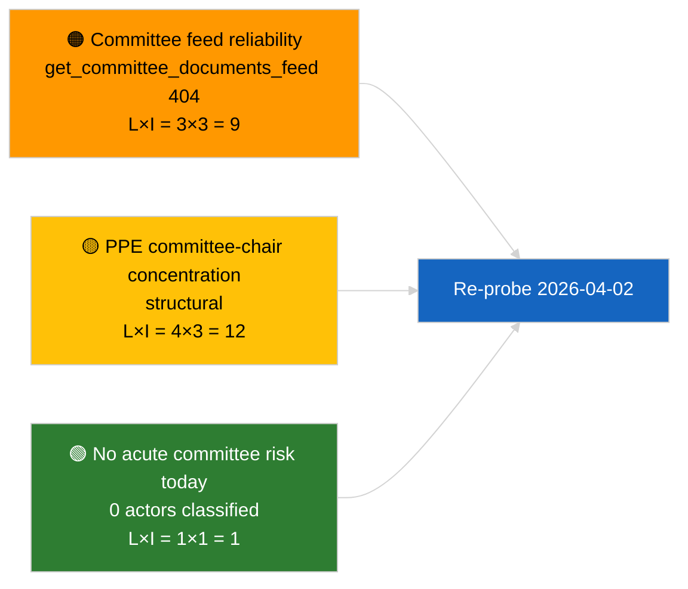

<!-- SPDX-FileCopyrightText: 2026 Hack23 AB -->
<!-- SPDX-License-Identifier: Apache-2.0 -->

# 집행부 브리핑 — 위원회 보고서 | 2026-04-01

**분류:** OSINT | 공개 의회 문서
**신뢰도:** 🟢 높음 (휴회 기간 구조적 평가)
**생성일시:** 2026-04-01T00:00:00Z (소급 요약)
**기사 유형:** 위원회 보고서
**실행 ID:** `64ada77d-c1f3-48f7-804d-be58857d0f18`
**출처:** 유럽의회 공개 데이터 포털

---

## 🎯 BLUF

**2026-04-01 기준 신규 위원회 보고서 없음; 3월 이후 위원회 휴회 첫날.** 실행 `64ada77d-c1f3-48f7-804d-be58857d0f18`은 **0건의 행위자 분류**를 반환했으며 5개 영향력 차원 전반에 걸쳐 **일상적** 평가가 내려졌다. 이는 EP10 회기 간 일정(본회의 휴회 주에는 특별 소집이 없는 한 위원회가 공식적으로 개최되지 않음)과 일치한다. 3월 위원회 보고서의 실질적 기준선이 지속됨: ECON ECB 부총재 포트폴리오(TA-10-2026-0060), TRAN/ENVI HDV 배출권(TA-10-2026-0084), JURI 의원 면책 사건(TA-10-2026-0088). **🟢 높은 신뢰도**: 공백 상태는 일정 주도.

---

## 🧭 이 브리핑이 지원하는 3가지 결정

| # | 결정 | 의사결정자 | 마감 | 근거 |
|:-:|------|-----------|:----:|------|
| 1 | **편집:** 오늘의 위원회 보고서 건너뜀; 주간 요약 작성 | 편집자 | +24시간 | 실행 결과 없음 |
| 2 | **추적:** 다음 주기 상태 점검에 `get_committee_documents_feed` 추가 (2026-04-01 404) | 데이터 파이프라인 | 2026-04-02 | 피드 가용성 예외 |
| 3 | **전향 추적:** 4월 13~17일 위원회 작업 주를 위원회 보고서 첫 실질 주기로 표시 | 분석 담당 | 2026-04-13 | 본회의 전 위원회 초안 |

---

## 📰 60초 요약

- 🔴 **오늘 피드에 위원회 문서 없음** — `get_committee_documents_feed`는 최근 병렬 실행에서 404를 반환했습니다. (🟡 중간 — 엔드포인트 상태가 정의됨, 작업이 없는 것이 아님)
- 🟠 **0건의 행위자 분류됨** — 보고자, 그림자 보고자, 위원회 위원장이 식별되지 않았습니다. (🟢 높음)
- 🟢 **위원회 지속 기준선:** ECON(ECB), TRAN/ENVI(HDV 배출), JURI(면책), AFET(조지아)는 3월부터 Q2까지 진행 중인 사안. (🟢 높음)
- 🟡 **리스크 차원 모두 "없음"** — 오늘 위원회 단계에서 긴급 리스크 없음. (🟢 높음)
- 🔵 **경제적 맥락:** ECON이 승인한 ECB 부총재는 Q2 제도적 닻을 제공합니다. (🟢 높음)
- 🟣 **교차 참조:** 2026-04-01/breaking 기사는 여기서 데이터 부재를 설명하는 advisory 404 피드 오류의 6/8 패턴을 기록. (🟢 높음)
- 🩷 **혼란 벡터:** 긴급 없음; PPE 구조적 지배 및 위원회 위원장 집중 리스크 주목. (🟡 중간)
- ⚪ **전진 전환:** EU-Mercosur INTA 포트폴리오는 CJEU 의견 대기 중; CULT/EMPL 파이프라인은 Q2에 완전히 부상하지 않음.

---

## 🗂️ 주요 문서 / 절차 표

| 순위 | EP 문서 | 제목 (단축) | 중요도 | 신뢰도 | 상태 |
|:---:|---------|------------|:------:|:------:|------|
| 1 | — | 2026-04-01 위원회 보고서 없음 | 0.0 | 🟢 높음 | 휴회 — 활동 없음 |
| 2 | TA-10-2026-0060 | ECON — ECB 부총재 (지속) | 7.5 | 🟢 높음 | 3월 10일 승인; 기준선 |
| 3 | TA-10-2026-0084 | TRAN/ENVI — HDV 배출권 (지속) | 7.0 | 🟢 높음 | 3월 12일 승인; 채택 추적 |

---

## ⚠️ 리스크 및 위협 스냅샷

| 리스크 | 가능성 | 영향 | 점수 | 유발요인 | 출처 | 제독 등급 |
|-------|:------:|:----:|:----:|---------|------|:--------:|
| 위원회 피드 API 신뢰성 | 3 | 3 | 9 | 다음 주기에서 지속되는 404 | 최근 병렬 실행 | B2 |
| PPE 위원회 위원장 집중 | 4 | 3 | 12 | Q2 보고자 임명 | 구조적 | A2 |
| HDV 전환 분쟁 | 2 | 3 | 6 | 국가별 반대 | TA-10-2026-0084 | A1 |

---

## 🔮 주요 선행 트리거

**2026년 4월 13~17일 위원회 작업 주.** 이 기간의 위원회 보고서 초안 및 그림자 보고자 협상이 4월 27~30일 스트라스부르 본회의 의제를 선행 결정함; Q2 첫 번째 실질적 위원회 보고서 주기가 여기에 도착.

---

## 🛡️ 출처 품질 평가

- **일차 출처:** EP 오픈 데이터 포털 `get_committee_documents_feed`(병렬 실행에 따르면 2026-04-01은 404)와 분석 실행 `64ada77d-c1f3-48f7-804d-be58857d0f18`의 분류 출력(0건 행위자).
- **데이터 제한:** 피드 불가용으로 "활동 없음"의 독립 검증 불가 — 신규 위원회 문서 없음에 대한 신뢰도는 다음 주기 확인까지 🟡 중간.
- **일정 주도 비활동 신뢰도:** 🟢 높음.

---

## 📎 링크

| 링크 | 경로 |
|-----|------|
| 기사 | `./article.md` |
| 분류 (비어있음) | `./classification/` |
| 리스크 점수 | `./risk-scoring/` |
| 최근 병렬 실행 | `analysis/daily/2026-04-01/breaking/` |
| 매니페스트 | `./manifest.json` |

---

## 🔄 교차 참조

**병렬 실행:** 2026-04-01 최신 뉴스/월간 전망/동의안/제안서 — 모두 동일한 빈 템플릿 패턴을 보여주며, 이것이 위원회 보고서 특유의 오류가 아닌 시스템 전체 휴회 상태임을 확인.

**이전 실행 대비 변화:** 휴회 전 위원회 활동(3월 9~12일 스트라스부르 주, 3월 25~26일 브뤼셀 미니 본회의)은 실질적이었음; 휴회로의 전환이 설명 변수이며 회귀가 아님.

---

**문서 관리**
- **템플릿:** `/analysis/templates/executive-brief.md`
- **행위자 경로:** `analysis/daily/2026-04-01/committee-reports/executive-brief.md`
- **분류:** 공개
- **소급 생성:** 백필 세션.
