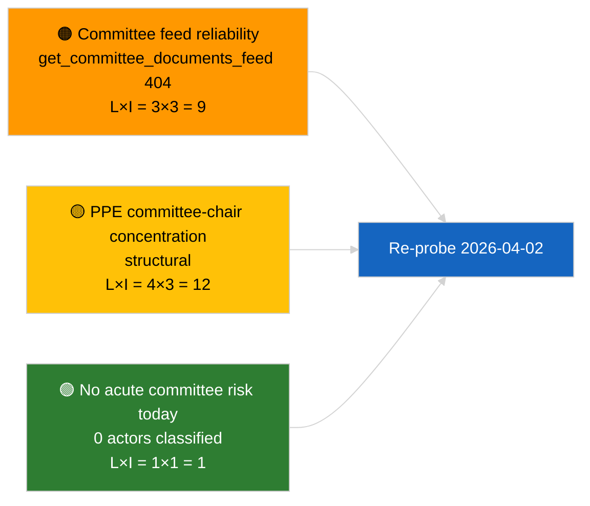

<!-- SPDX-FileCopyrightText: 2026 Hack23 AB -->
<!-- SPDX-License-Identifier: Apache-2.0 -->

# Uitvoerend Briefing — Commissierapporten | 2026-04-01

**Classificatie:** OSINT | Openbaar parlementair dossier
**Betrouwbaarheidsniveau:** 🟢 Hoog (structurele beoordeling tijdens recessperiode)
**Gegenereerd:** 2026-04-01T00:00:00Z (retrospectieve briefing)
**Artikeltype:** Commissierapporten
**Uitvoerings-ID:** `64ada77d-c1f3-48f7-804d-be58857d0f18`
**Bron:** Open dataportal van het Europees Parlement

---

## 🎯 BLUF

**Geen nieuwe commissierapporten geïdentificeerd voor 2026-04-01; eerste volledige dag van de commissiereces na maart.** Run `64ada77d-c1f3-48f7-804d-be58857d0f18` leverde **0 geclassificeerde actoren** en **ROUTINE** betekenis op in alle vijf impact-dimensies, overeenkomstig de intersessionele kalender van het EP10 (commissies vergaderen niet formeel tijdens plenaire recessweken tenzij buitengewoon bijeengeroepen). De inhoudelijke basislijn voor commissierapporten is daher de carry-over van maart: het ECON-dossier over de vice-president van de ECB (TA-10-2026-0060), het TRAN/ENVI-rapport over HDV-emissiekredieten (TA-10-2026-0084) en het Braun-immuniteitsdossier van de JURI (TA-10-2026-0088). **🟢 HOOG vertrouwen** dat de lege toestand kalendergestuurd is.

---

## 🧭 3 Beslissingen die Dit Briefing Ondersteunt

| # | Beslissing | Beslisser | Deadline | Bewijs |
|:-:|------------|-----------|:--------:|--------|
| 1 | **Redactioneel:** SLA dagelijks commissierapport OVER; maak wekelijkse samenvatting | Redacteur | +24u | Lege uitvoeringsuitvoer |
| 2 | **Monitoring:** voeg `get_committee_documents_feed` toe aan de gezondheidscontrole van de volgende cyclus (404 op 2026-04-01) | Datapijplijn | 2026-04-02 | Anomalie in feedbeschikbaarheid |
| 3 | **Vooruitblik:** markeer de commissie-werkweek 13-17 april voor de eerste inhoudelijke commissierapportencyclus | Analyseleider | 2026-04-13 | Pre-plenaire commissieontwerpen |

---

## 📰 60-Seconden Leesbaar

- 🔴 **Geen commissiedocumenten in de feed van vandaag** — `get_committee_documents_feed` gaf 404 terug bij parallelle nieuwsrun. (🟡 Gemiddeld — de eindpuntgezondheid is de kwalificatie, niet de afwezigheid van werk)
- 🟠 **0 actoren geclassificeerd** in deze commissierapportenrun; geen rapporteurs, schaduwrapporteurs of commissievoorzitters geïdentificeerd. (🟢 Hoog)
- 🟢 **Commissie carry-over-basislijn:** ECON (ECB), TRAN/ENVI (HDV-emissies), JURI (immuniteit), AFET (Georgië) blijven de actieve portfolios van maart tot Q2. (🟢 Hoog)
- 🟡 **Risico-dimensies alle «geen»** — geen acuut commissierisico vandaag gemarkeerd. (🟢 Hoog)
- 🔵 **Economische context:** De bevestiging van de ECB-vicevoorzitter door ECON biedt een institutioneel ankerpunt voor Q2. (🟢 Hoog)
- 🟣 **Kruisverwijzing:** zuster 2026-04-01/breaking-artikel documenteert het 6/8-adviefeed 404-patroon dat het ontbreken van gegevens hier verklaart. (🟢 Hoog)
- 🩷 **Verstoringsrisico:** geen acuut; structurele PPE-dominantie en concentratierisico's van commissievoorzitters geërfd. (🟡 Gemiddeld)
- ⚪ **Carry-forward:** EU-Mercosur INTA-dossier in afwachting van Hof van Justitie-advies; CULT/EMPL-pijplijn nog niet volledig zichtbaar voor Q2.

---

## 🗂️ Tabel van Topdocumenten / Procedures

| Rang | EP-referentie | Titel (kort) | Significantie | Betrouwbaarheid | Status |
|:----:|---------------|--------------|:-------------:|:---------------:|--------|
| 1 | — | Geen commissierapporten op 2026-04-01 | 0,0 | 🟢 HOOG | Reces — geen activiteit |
| 2 | TA-10-2026-0060 | ECON — ECB vice-president (carry-over) | 7,5 | 🟢 HOOG | Aangenomen op 10 maart; basislijn |
| 3 | TA-10-2026-0084 | TRAN/ENVI — HDV-emissiekredieten (carry-over) | 7,0 | 🟢 HOOG | Aangenomen op 12 maart; transpositiebewaking |

---

## ⚠️ Risico- en Dreigingssnapshot

| Risico | W | I | Score | Trigger | Bron | Admiraliteitsgraad |
|--------|:-:|:-:|:-----:|---------|------|:------------------:|
| Betrouwbaarheid commissiefeed-API | 3 | 3 | 9 | Aanhoudende 404 in volgende cyclus | Zuster breaking-run | B2 |
| PPE commissievoorzittersconcentratie | 4 | 3 | 12 | Q2 rapporteur-benoemingen | Structureel | A2 |
| HDV transpositiegeschillen | 2 | 3 | 6 | Nationale weerstand | TA-10-2026-0084 | A1 |

---

## 🔮 Leidende Toekomstige Trigger

**Commissie-werkweek 13-17 april 2026.** Commissieontwerprapporten en schaduwrapporteuronderhandelingen tijdens dit tijdvenster bepalen vooraf de inhoud van de Straatsburgse agenda van 27-30 april; de eerste inhoudelijke commissierapportencyclus van Q2 start hier.

---

## 🛡️ Beoordeling van Bronkwaliteit

- **Primaire bronnen:** Open dataportal van het EP `get_committee_documents_feed` (404 op 2026-04-01 per parallelle runs) en classificatie-uitvoer van analyserun `64ada77d-c1f3-48f7-804d-be58857d0f18` (0 actoren).
- **Gegevensbeperkingen:** Feedonbeschikbaarheid voorkomt onafhankelijke bevestiging van «geen activiteit» — vertrouwen in afwezigheid van nieuwe commissiedocumenten is 🟡 gemiddeld in afwachting van de sonde van de volgende cyclus.
- **Vertrouwen in kalendergestuurde inactiviteit:** 🟢 HOOG.

---

## 📎 Links

| Link | Pad |
|------|-----|
| Artikel | `./article.md` |
| Classificatie (leeg) | `./classification/` |
| Risicoscoring | `./risk-scoring/` |
| Zuster breaking-run | `analysis/daily/2026-04-01/breaking/` |
| Manifest | `./manifest.json` |

---

## 🔄 Kruisverwijzing

**Gelijktijdige runs:** 2026-04-01 breaking / month-ahead / motions / propositions — alle tonen hetzelfde lege sjabloonpatroon, wat bevestigt dat dit een systeembrede recessperiodestatus is, niet een commissierapport-specifiek falen.

**Delta ten opzichte van vorige runs:** De commissieactiviteit vóór het reces (Straatsburg-week 9-12 maart, Brussel mini-plenaire 25-26 maart) was substantieel; de recessovergang is de verklarende variabele, geen regressie.

---

**Documentbeheer**
- **Sjabloon:** `/analysis/templates/executive-brief.md`
- **Artefactpad:** `analysis/daily/2026-04-01/committee-reports/executive-brief.md`
- **Classificatie:** Openbaar
- **Retrospectieve generatie:** Terugvulsessie.
