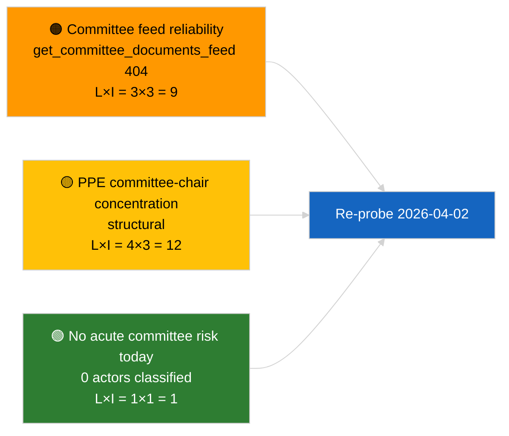

<!-- SPDX-FileCopyrightText: 2026 Hack23 AB -->
<!-- SPDX-License-Identifier: Apache-2.0 -->

# Lederorientering — Komitérapporter | 2026-04-01

**Klassifisering:** OSINT | Offentlig parlamentarisk protokoll
**Konfidensgrad:** 🟢 Høy (strukturell vurdering i recessperiode)
**Generert:** 2026-04-01T00:00:00Z (retrospektiv orientering)
**Artikkeltype:** Komitérapporter
**Kjørings-ID:** `64ada77d-c1f3-48f7-804d-be58857d0f18`
**Kilde:** Europaparlamentets åpne dataportal

---

## 🎯 BLUF

**Ingen nye komitérapporter identifisert for 2026-04-01; første hele dag av post-mars komitérecessen.** Kjøring `64ada77d-c1f3-48f7-804d-be58857d0f18` returnerte **0 klassifiserte aktører** og **RUTINE** betydning på tvers av alle fem påvirkningsdimensjoner, i tråd med EP10s intersesjonelle kalender (komiteer sitter ikke formelt under plenarrecesperioder med mindre de er ekstraordinært innkalt). Den substantielle baslinjen for komitérapporter er derfor carry-over fra mars: ECONs fil om ECBs visepresident (TA-10-2026-0060), TRAN/ENVIs HDV-utslippskredittrapport (TA-10-2026-0084) og JURIs Braun-immunitetsmappe (TA-10-2026-0088). **🟢 HØY konfidensgrad** for at den tomme tilstanden er kalender-drevet.

---

## 🧭 3 Beslutninger som Orienteringen Støtter

| # | Beslutning | Hvem Bestemmer | Frist | Bevis |
|:-:|------------|----------------|:-----:|-------|
| 1 | **Redaksjonelt:** HOPP OVER daglig komitérapport; produser ukesoppsummering | Redaktør | +24h | Tom kjøringsutdata |
| 2 | **Overvåking:** legg til `get_committee_documents_feed` i neste syklus helsesjekk (404 den 2026-04-01) | Datapipeline | 2026-04-02 | Feed-tilgjengelighetsavvik |
| 3 | **Fremtidsovervåking:** flagg komitéens arbeidsuke 13-17. april for første substantielle komitérapportsyklus | Analyseansvarlig | 2026-04-13 | Pre-plenare komitéutkast |

---

## 📰 60-Sekunders Lesing

- 🔴 **Ingen komitédokumenter i dagens feed** — `get_committee_documents_feed` returnerte 404 i parallell nyhetskjøring. (🟡 Middels — slutpunktets helse er kvalifikasjonen, ikke fraværet av arbeid)
- 🟠 **0 aktører klassifisert** i denne komitérapportskjøringen; ingen ordførere, skyggeordførere eller komitéledere identifisert. (🟢 Høy)
- 🟢 **Komitéens carry-over-baslinje:** ECON (ECB), TRAN/ENVI (HDV-utslipp), JURI (immunitet), AFET (Georgia) forblir de aktive mars-til-Q2-porteføljene. (🟢 Høy)
- 🟡 **Risikodimensjoner alle "ingen"** — ingen akutt komitéstagium-risiko flagget i dag. (🟢 Høy)
- 🔵 **Økonomisk kontekst:** ECONs bekreftelse av ECBs visepresident gir institusjonelt anker for Q2. (🟢 Høy)
- 🟣 **Kryssreferanse:** søsken 2026-04-01/breaking-artikkel dokumenterer 6/8 rådgivningsfeed 404-mønsteret som forklarer dataabsensen her. (🟢 Høy)
- 🩷 **Forstyrrelsesfaktor:** ingen akutt; strukturelle PPE-dominans- og komitélederkonsentrasjonsrisikoer arvet. (🟡 Middels)
- ⚪ **Carry-forward:** EU-Mercosur INTA-fil venter på EU-domstolens uttalelse; CULT/EMPL-pipeline ennå ikke fullt fremkommet for Q2.

---

## 🗂️ Tabell over Topdokumenter / Prosedyrer

| Rang | EP-referanse | Tittel (kort) | Betydning | Konfidensgrad | Status |
|:----:|--------------|---------------|:---------:|:-------------:|--------|
| 1 | — | Ingen komitérapporter 2026-04-01 | 0,0 | 🟢 HØY | Recess — ingen aktivitet |
| 2 | TA-10-2026-0060 | ECON — ECB visepresident (carry-over) | 7,5 | 🟢 HØY | Vedtatt 10. mars; baslinje |
| 3 | TA-10-2026-0084 | TRAN/ENVI — HDV-utslippskreditter (carry-over) | 7,0 | 🟢 HØY | Vedtatt 12. mars; transponeringsovervåking |

---

## ⚠️ Risiko- og Trusselsbilde

| Risiko | S | P | Score | Utløser | Kilde | Admiralitetsgrad |
|--------|:-:|:-:|:-----:|---------|-------|:----------------:|
| Pålitelighet for komitéfeed-API | 3 | 3 | 9 | Vedvarende 404 i neste syklus | Søsken breaking-kjøring | B2 |
| PPE komitélederkonsentrasjon | 4 | 3 | 12 | Q2 ordførerutnevnelser | Strukturell | A2 |
| HDV transponeringstvist | 2 | 3 | 6 | Nasjonal motstand | TA-10-2026-0084 | A1 |

---

## 🔮 Ledende Fremtidsutløser

**Komitéens arbeidsuke 13-17. april 2026.** Komitéutkast til rapporter og skyggeordførernes forhandlinger i dette vinduet forutbestemmer substansen i Strasbourg-dagsordenen 27-30. april; den første substantielle komitérapportsyklusen for Q2 lander her.

---

## 🛡️ Vurdering av Kildekvalitet

- **Primære kilder:** EPs åpne dataportal `get_committee_documents_feed` (404 den 2026-04-01 per parallelle kjøringer) og analysekjøring `64ada77d-c1f3-48f7-804d-be58857d0f18` klassifiseringsutdata (0 aktører).
- **Databegrensninger:** Feed-utilgjengelighet forhindrer uavhengig bekreftelse av "ingen aktivitet" — konfidensgrad for fravær av nye komitédokumenter er 🟡 middels i påvente av neste syklus undersøkelse.
- **Konfidensgrad for kalender-drevet inaktivitet:** 🟢 HØY.

---

## 📎 Lenker

| Lenke | Sti |
|-------|-----|
| Artikkel | `./article.md` |
| Klassifisering (tom) | `./classification/` |
| Risikovurdering | `./risk-scoring/` |
| Søsken breaking-kjøring | `analysis/daily/2026-04-01/breaking/` |
| Manifest | `./manifest.json` |

---

## 🔄 Kryssreferanse

**Parallelle kjøringer:** 2026-04-01 breaking / month-ahead / motions / propositions — alle viser det samme tomme mønsteret, noe som bekrefter at dette er en systemomfattende recessperiodetilstand, ikke en komitérapport-spesifikk feil.

**Delta fra tidligere kjøringer:** Pre-recess komitéaktiviteten (Strasbourg-uke 9-12. mars, Brussel mini-plenum 25-26. mars) var substantiell; recessovergangen er den forklarende variabelen, ikke en regresjon.

---

**Dokumentkontroll**
- **Mal:** `/analysis/templates/executive-brief.md`
- **Artefaktsti:** `analysis/daily/2026-04-01/committee-reports/executive-brief.md`
- **Klassifisering:** Offentlig
- **Retrospektiv generering:** Etterfyllingssesjon.
