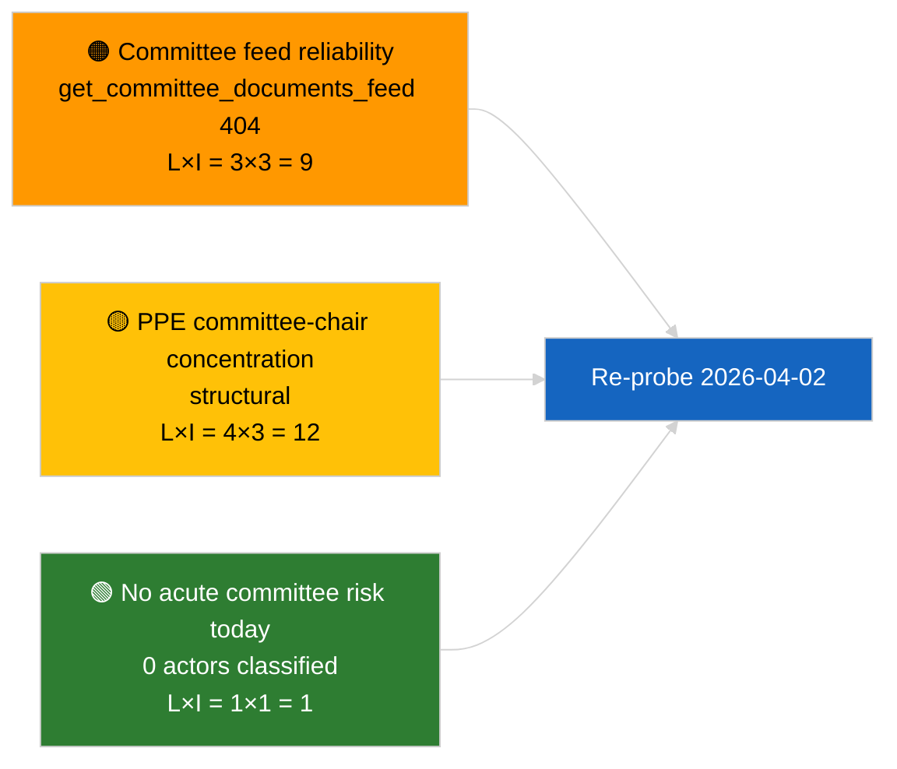

<!-- SPDX-FileCopyrightText: 2026 Hack23 AB -->
<!-- SPDX-License-Identifier: Apache-2.0 -->

# Verkställande Briefing — Utskottsrapporter | 2026-04-01

**Klassificering:** OSINT | Offentligt parlamentariskt protokoll
**Konfidensgrad:** 🟢 Hög (strukturell bedömning under recessperiod)
**Genererad:** 2026-04-01T00:00:00Z (retroaktiv briefing)
**Artikeltyp:** Utskottsrapporter
**Körnings-ID:** `64ada77d-c1f3-48f7-804d-be58857d0f18`
**Källa:** Europaparlamentets öppna dataportal

---

## 🎯 BLUF

**Inga nya utskottsrapporter identifierade för 2026-04-01; första hela dagen av post-mars utskottsrecessen.** Körning `64ada77d-c1f3-48f7-804d-be58857d0f18` returnerade **0 klassificerade aktörer** och **RUTINMÄSSIG** betydelse i samtliga fem påverkansdimensioner, i enlighet med EP10:s intersessionella kalender (utskott sammanträder inte formellt under plenarrecesständer om inte extraordinärt sammankallat). Den substantiella baslinjen för utskottsrapporter är därför carry-over från mars: ECON:s fil om ECB:s vice ordförande (TA-10-2026-0060), TRAN/ENVI:s HDV-utsläppskreditsrapport (TA-10-2026-0084) och JURI:s Braun-immunitetsärende (TA-10-2026-0088). **🟢 HÖG konfidensgrad** att det tomma tillståndet är kalenderstyrt.

---

## 🧭 3 Beslut som Briefingen Stödjer

| # | Beslut | Vem Beslutar | Deadline | Bevis |
|:-:|--------|--------------|:--------:|-------|
| 1 | **Redaktionellt:** SKIPPA daglig utskottsrapport; producera veckorekapitulation | Redaktör | +24h | Tom körningsutdata |
| 2 | **Övervakning:** lägg till `get_committee_documents_feed` i nästa cykelns hälsokontroll (404 den 2026-04-01) | Datapipeline | 2026-04-02 | Feedtillgänglighetsavvikelse |
| 3 | **Framtidsbevakning:** flagga utskottets arbetsvecka 13-17 april för första substantiella utskottsrapportscykeln | Analysansvarig | 2026-04-13 | Pre-plenara utskottsutkast |

---

## 📰 60-Sekunders Läsning

- 🔴 **Inga utskottsdokument i dagens feed** — `get_committee_documents_feed` returnerade 404 i parallell nyhetskörning. (🟡 Medel — slutpunktens hälsa är kvalifikationen, inte frånvaro av arbete)
- 🟠 **0 aktörer klassificerade** i denna utskottsrapportskörning; inga föredragande, skuggföredragande eller utskottsordföranden identifierade. (🟢 Hög)
- 🟢 **Utskottets carry-over-baslinje:** ECON (ECB), TRAN/ENVI (HDV-utsläpp), JURI (immunitet), AFET (Georgien) förblir de aktiva mars-till-Q2-portföljerna. (🟢 Hög)
- 🟡 **Riskdimensioner alla "ingen"** — ingen akut utskottsstadierisk flaggad idag. (🟢 Hög)
- 🔵 **Ekonomisk kontext:** ECON:s bekräftelse av ECB:s vice ordförande ger institutionellt ankare för Q2. (🟢 Hög)
- 🟣 **Korsreferens:** syskon 2026-04-01/breaking-artikel dokumenterar 6/8 rådgivningsfeed 404-mönstret som förklarar datafrånvaron här. (🟢 Hög)
- 🩷 **Störningsfaktor:** ingen akut; strukturella PPE-dominans- och utskottsordförandekoncentrationsrisker ärvda. (🟡 Medel)
- ⚪ **Carry-forward:** EU-Mercosur INTA-fil väntar på EUD-yttrande; CULT/EMPL-pipeline ännu inte fullt framträdd för Q2.

---

## 🗂️ Tabell över Toppdokument / Förfaranden

| Rank | EP-referens | Titel (kort) | Betydelse | Konfidensgrad | Status |
|:----:|-------------|--------------|:---------:|:-------------:|--------|
| 1 | — | Inga utskottsrapporter 2026-04-01 | 0,0 | 🟢 HÖG | Recess — ingen aktivitet |
| 2 | TA-10-2026-0060 | ECON — ECB vice ordförande (carry-over) | 7,5 | 🟢 HÖG | Antagen 10 mars; baslinje |
| 3 | TA-10-2026-0084 | TRAN/ENVI — HDV-utsläppskrediter (carry-over) | 7,0 | 🟢 HÖG | Antagen 12 mars; transponeringsbevakning |

---

## ⚠️ Risk- och Hotögonblicksbild

| Risk | S | P | Poäng | Utlösare | Källa | Admiralitetsgrad |
|------|:-:|:-:|:-----:|----------|-------|:----------------:|
| Tillförlitlighet för utskottsfeed-API | 3 | 3 | 9 | Bestående 404 i nästa cykel | Syskon breaking-körning | B2 |
| PPE utskottsordförandekoncentration | 4 | 3 | 12 | Q2 föredragandetillsättningar | Strukturell | A2 |
| HDV transpositionstvister | 2 | 3 | 6 | Nationell motreaktion | TA-10-2026-0084 | A1 |

---

## 🔮 Ledande Framtidstrigger

**Utskottets arbetsvecka 13-17 april 2026.** Utskottets utkast till betänkanden och skuggföredragandenas förhandlingar under detta fönster förutbestämmer substansen i Strasbourg-agendan 27-30 april; den första substantiella utskottsrapportscykeln för Q2 kommer att landa här.

---

## 🛡️ Bedömning av Källkvalitet

- **Primära källor:** EP:s öppna dataportal `get_committee_documents_feed` (404 den 2026-04-01 per parallella körningar) och analysköringens `64ada77d-c1f3-48f7-804d-be58857d0f18` klassificeringsutdata (0 aktörer).
- **Databegränsningar:** Feedotillgänglighet förhindrar oberoende bekräftelse av "ingen aktivitet" — konfidensgrad för frånvaro av nya utskottsdokument är 🟡 medel i avvaktan på nästa cykels undersökning.
- **Konfidensgrad för kalenderdriven inaktivitet:** 🟢 HÖG.

---

## 📎 Länkar

| Länk | Sökväg |
|------|--------|
| Artikel | `./article.md` |
| Klassificering (tom) | `./classification/` |
| Riskbedömning | `./risk-scoring/` |
| Syskon breaking-körning | `analysis/daily/2026-04-01/breaking/` |
| Manifest | `./manifest.json` |

---

## 🔄 Korsreferens

**Parallella körningar:** 2026-04-01 breaking / month-ahead / motions / propositions — alla visar samma tomma mallmönster, vilket bekräftar att detta är ett systemomfattande recessionsperiodstillstånd, inte ett utskottsrapports-specifikt fel.

**Delta från tidigare körningar:** Pre-recess-utskottsaktiviteten (Strasbourg-veckan 9-12 mars, Bryssel mini-plenum 25-26 mars) var substantiell; recessionsövergången är den förklarande variabeln, inte en regression.

---

**Dokumentkontroll**
- **Mall:** `/analysis/templates/executive-brief.md`
- **Artefaktsökväg:** `analysis/daily/2026-04-01/committee-reports/executive-brief.md`
- **Klassificering:** Offentlig
- **Retroaktiv generering:** Bakåtfyllningssession.
