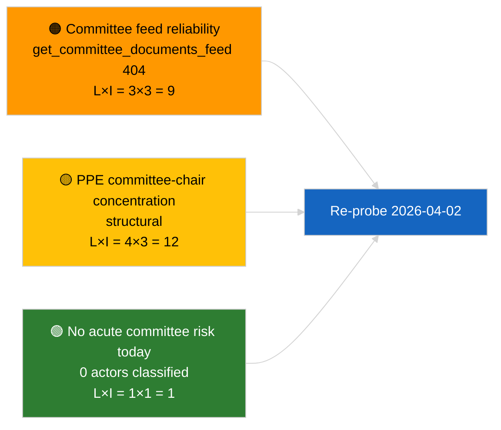

<!-- SPDX-FileCopyrightText: 2026 Hack23 AB -->
<!-- SPDX-License-Identifier: Apache-2.0 -->

# 执行摘要 — 委员会报告 | 2026-04-01

**分类：** OSINT | 公开议会文件
**可信度：** 🟢 高（休会期结构性评估）
**生成时间：** 2026-04-01T00:00:00Z（追溯摘要）
**文章类型：** 委员会报告
**运行 ID：** `64ada77d-c1f3-48f7-804d-be58857d0f18`
**来源：** 欧洲议会开放数据门户

---

## 🎯 BLUF

**2026-04-01 无新委员会报告；为三月后委员会休会首日。** 运行 `64ada77d-c1f3-48f7-804d-be58857d0f18` 返回 **0 个行为者分类**，五个影响力维度均评估为**例行**，符合 EP10 会期间日历（本会议休会周委员会除非特别召集否则不正式开会）。三月委员会报告实质基准持续：ECON 欧洲央行副行长组合（TA-10-2026-0060）、TRAN/ENVI HDV 排放信用额度（TA-10-2026-0084）、JURI 议员豁免案（TA-10-2026-0088）。**🟢 可信度高**：空白状态由日历驱动。

---

## 🧭 本摘要支持的三项决策

| # | 决策 | 决策者 | 截止日期 | 证据 |
|:-:|------|-------|:--------:|------|
| 1 | **编辑：** 跳过今日委员会报告；制作周报 | 编辑 | +24小时 | 运行结果为零 |
| 2 | **追踪：** 在下一周期健康检查中增加 `get_committee_documents_feed`（2026-04-01 返回404） | 数据管道 | 2026-04-02 | 馈送可用性异常 |
| 3 | **前瞻追踪：** 将4月13-17日委员会工作周标记为首个实质委员会报告周期 | 分析负责人 | 2026-04-13 | 本会议前委员会草稿 |

---

## 📰 60秒阅读

- 🔴 **今日馈送无委员会文件** — `get_committee_documents_feed` 在最近并行运行中返回 404。（🟡 中等 — 端点状态明确，并非无工作可做）
- 🟠 **0 个行为者被分类** — 未识别报告人、影子报告人或委员会主席。（🟢 高）
- 🟢 **委员会持续基准：** ECON（欧洲央行）、TRAN/ENVI（HDV排放）、JURI（豁免）、AFET（格鲁吉亚）持续作为三月至Q2的进行中事项。（🟢 高）
- 🟡 **风险维度均为"无"** — 今日委员会阶段无紧急风险。（🟢 高）
- 🔵 **经济背景：** ECON 批准的欧洲央行副行长为Q2提供制度锚点。（🟢 高）
- 🟣 **交叉参考：** 2026-04-01/breaking 文章记录了解释此处数据缺失的咨询性404馈送故障6/8模式。（🟢 高）
- 🩷 **混乱向量：** 无紧急；注意PPE结构性主导和委员会主席集中风险。（🟡 中等）
- ⚪ **前进过渡：** EU-Mercosur INTA 组合等待CJEU意见；CULT/EMPL 管道尚未在Q2完全浮现。

---

## 🗂️ 主要文件 / 程序表

| 排名 | EP 文件 | 标题（简短） | 重要性 | 可信度 | 状态 |
|:---:|---------|------------|:------:|:------:|------|
| 1 | — | 2026-04-01 无委员会报告 | 0.0 | 🟢 高 | 休会 — 无活动 |
| 2 | TA-10-2026-0060 | ECON — 欧洲央行副行长（持续） | 7.5 | 🟢 高 | 3月10日批准；基准 |
| 3 | TA-10-2026-0084 | TRAN/ENVI — HDV排放信用额度（持续） | 7.0 | 🟢 高 | 3月12日批准；采纳追踪 |

---

## ⚠️ 风险与威胁快照

| 风险 | 可能性 | 影响 | 得分 | 触发因素 | 来源 | 海军上将等级 |
|-----|:------:|:----:|:----:|---------|------|:-----------:|
| 委员会馈送 API 可靠性 | 3 | 3 | 9 | 下一周期持续404 | 最近并行运行 | B2 |
| PPE 委员会主席集中 | 4 | 3 | 12 | Q2 报告人任命 | 结构性 | A2 |
| HDV 过渡争议 | 2 | 3 | 6 | 国别反对 | TA-10-2026-0084 | A1 |

---

## 🔮 主要前瞻触发因素

**2026年4月13-17日委员会工作周。** 该期间的委员会报告草稿和影子报告人谈判预先决定4月27-30日斯特拉斯堡本会议议程内容；Q2首个实质委员会报告周期在此到来。

---

## 🛡️ 来源质量评估

- **一手来源：** EP 开放数据门户 `get_committee_documents_feed`（并行运行显示2026-04-01返回404）和分析运行 `64ada77d-c1f3-48f7-804d-be58857d0f18` 分类输出（0个行为者）。
- **数据局限：** 馈送不可用导致"无活动"无法独立核实 — 无新委员会文件的可信度在下一周期确认前为🟡中等。
- **日历驱动无活动可信度：** 🟢 高。

---

## 📎 链接

| 链接 | 路径 |
|-----|------|
| 文章 | `./article.md` |
| 分类（空） | `./classification/` |
| 风险评分 | `./risk-scoring/` |
| 最近并行运行 | `analysis/daily/2026-04-01/breaking/` |
| 清单 | `./manifest.json` |

---

## 🔄 交叉参考

**并行运行：** 2026-04-01最新动态/月度展望/动议/提案 — 全部显示相同空模板模式，确认这是系统全局休会状态，而非委员会报告特有故障。

**与前次运行的差异：** 休会前委员会活动（3月9-12日斯特拉斯堡周、3月25-26日布鲁塞尔小型本会议）是实质性的；向休会的过渡是解释变量，而非回归。

---

**文件控制**
- **模板：** `/analysis/templates/executive-brief.md`
- **行为者路径：** `analysis/daily/2026-04-01/committee-reports/executive-brief.md`
- **分类：** 公开
- **追溯创建：** 回填会话。
