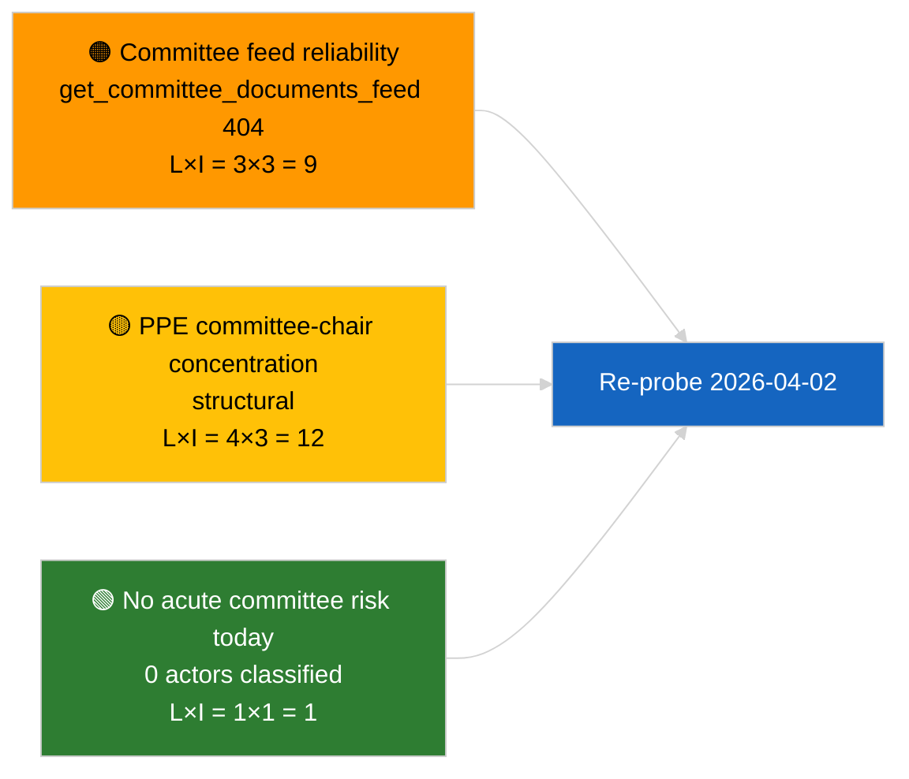

<!-- SPDX-FileCopyrightText: 2026 Hack23 AB -->
<!-- SPDX-License-Identifier: Apache-2.0 -->

# 执行简报 — 委员会报告 | 2026-04-01

**分类：** OSINT | 公开议会记录
**置信水平：** 🟢 高（休会期间结构性评估）
**生成时间：** 2026-04-01T00:00:00Z（回溯性简报）
**文章类型：** 委员会报告
**运行ID：** `64ada77d-c1f3-48f7-804d-be58857d0f18`
**来源：** 欧洲议会开放数据门户

---

## 🎯 BLUF

**2026-04-01未发现新委员会报告；这是3月后委员会休会的第一个完整工作日。** 运行 `64ada77d-c1f3-48f7-804d-be58857d0f18` 在所有五个影响维度上返回了**0个已分类行为者**和**日常性**重要度，符合EP10的会期间日历（委员会在全会休会周内不正式开会，除非特别召集）。因此，委员会报告的实质性基准线是来自三月的延续：ECON的欧洲央行副行长文件（TA-10-2026-0060）、TRAN/ENVI的重型车辆排放额度报告（TA-10-2026-0084）以及JURI的布劳恩豁免权案卷（TA-10-2026-0088）。**🟢 高置信度**：空状态由日历决定。

---

## 🧭 本简报支持的3项决策

| # | 决策 | 决策者 | 截止日期 | 依据 |
|:-:|------|--------|:--------:|------|
| 1 | **编辑：** 跳过每日委员会报告；生成每周摘要 | 编辑 | +24小时 | 运行输出为空 |
| 2 | **监控：** 将 `get_committee_documents_feed` 添加到下一周期的健康探针（2026-04-01时返回404） | 数据管道 | 2026-04-02 | 数据馈送可用性异常 |
| 3 | **前瞻监视：** 将4月13-17日的委员会工作周标记为首个实质性委员会报告周期 | 分析负责人 | 2026-04-13 | 全会前委员会草案 |

---

## 📰 60秒速读

- 🔴 **今日数据馈送无委员会文件** — `get_committee_documents_feed` 在并行新闻运行中返回404。（🟡 中 — 端点健康状况是限定条件，不是工作缺失）
- 🟠 **本次委员会报告运行中0个行为者被分类**；未发现任何报告员、影子报告员或委员会主席。（🟢 高）
- 🟢 **委员会延续基准线：** ECON（欧洲央行）、TRAN/ENVI（HDV排放）、JURI（豁免权）、AFET（格鲁吉亚）持续作为3月至第二季度的活跃投资组合。（🟢 高）
- 🟡 **风险维度均为"无"** — 今日委员会阶段无急性风险标记。（🟢 高）
- 🔵 **经济背景：** ECON确认欧洲央行副行长为第二季度提供制度性锚点。（🟢 高）
- 🟣 **交叉参考：** 2026-04-01/breaking姊妹文章记录了6/8咨询馈送404模式，解释了此处的数据缺失。（🟢 高）
- 🩷 **扰乱向量：** 无急性问题；继承了PPE结构性主导和委员会主席集中风险。（🟡 中）
- ⚪ **延续事项：** EU-Mercosur INTA文件等待欧盟法院意见；CULT/EMPL管道在第二季度尚未完全显现。

---

## 🗂️ 主要文件 / 程序表

| 排名 | EP参考 | 标题（简短） | 重要性 | 置信度 | 状态 |
|:----:|--------|------------|:------:|:------:|------|
| 1 | — | 2026-04-01无委员会报告 | 0.0 | 🟢 高 | 休会 — 无活动 |
| 2 | TA-10-2026-0060 | ECON — 欧洲央行副行长（延续） | 7.5 | 🟢 高 | 3月10日通过；基准线 |
| 3 | TA-10-2026-0084 | TRAN/ENVI — HDV排放额度（延续） | 7.0 | 🟢 高 | 3月12日通过；转置跟踪 |

---

## ⚠️ 风险与威胁快照

| 风险 | 可 | 影 | 分值 | 触发因素 | 来源 | 海军情报等级 |
|------|:--:|:--:|:----:|---------|------|:-----------:|
| 委员会数据馈送API可靠性 | 3 | 3 | 9 | 下一周期持续404 | 姊妹breaking运行 | B2 |
| PPE委员会主席集中 | 4 | 3 | 12 | 第二季度报告员任命 | 结构性 | A2 |
| HDV转置争议 | 2 | 3 | 6 | 国内反弹 | TA-10-2026-0084 | A1 |

---

## 🔮 主要前瞻性触发因素

**2026年4月13-17日委员会工作周。** 这一时间窗口内的委员会报告草案及影子报告员谈判将预先决定4月27-30日斯特拉斯堡议程的内容；第二季度首个实质性委员会报告周期将在此启动。

---

## 🛡️ 来源质量评估

- **主要来源：** 欧洲议会开放数据门户 `get_committee_documents_feed`（根据并行运行，2026-04-01时返回404）及分析运行 `64ada77d-c1f3-48f7-804d-be58857d0f18` 分类输出（0个行为者）。
- **数据限制：** 数据馈送不可用妨碍了对"无活动"的独立核实 — 在等待下一周期探针期间，对新委员会文件缺失的置信度为🟡中。
- **日历驱动不活跃的置信度：** 🟢 高。

---

## 📎 链接

| 链接 | 路径 |
|------|------|
| 文章 | `./article.md` |
| 分类（空） | `./classification/` |
| 风险评分 | `./risk-scoring/` |
| 姊妹breaking运行 | `analysis/daily/2026-04-01/breaking/` |
| 清单 | `./manifest.json` |

---

## 🔄 交叉参考

**并行运行：** 2026-04-01 breaking / month-ahead / motions / propositions — 所有运行均显示相同的空模板模式，确认这是系统范围的休会期状态，而非委员会报告特有的故障。

**与先前运行的差异：** 休会前的委员会活动（斯特拉斯堡周3月9-12日，布鲁塞尔小型全会3月25-26日）是实质性的；休会过渡是解释变量，而非退步。

---

**文件管控**
- **模板：** `/analysis/templates/executive-brief.md`
- **制品路径：** `analysis/daily/2026-04-01/committee-reports/executive-brief.md`
- **分类：** 公开
- **回溯生成：** 补录会话。
