# Month Ahead — 2026-04-01

<h2 id="section-executive-brief">Executive Brief</h2>

### 🎯 BLUF

**April 2026 outlook anchored on the 27-30 April Strasbourg plenary and pre-plenary committee work-week 13-17 April.** The month-ahead run returned **0 classified actors** and **ROUTINE** dimension scores, reflecting the EP's first post-March recess day rather than offering a substantive April scenario forecast. Carry-over priorities entering April: US customs-tariff follow-up (TA-10-2026-0096), EU-Mercosur ECJ opinion (pending), HDV emission-credits transposition (TA-10-2026-0084), Georgia political-prisoners implementation (TA-10-2026-0083), and ongoing Polish-judiciary spill-over from the Braun immunity precedent (TA-10-2026-0088). Three working scenarios: **Scenario A — trade-heavy agenda (55%)**, **Scenario B — rule-of-law focus (25%)**, **Scenario C — economic/industrial focus (20%)**. **🟡 MEDIUM confidence** — April agenda not yet published.

---

### 🧭 3 Decisions This Brief Supports

| # | Decision | Who Decides | Deadline | Evidence |
|:-:|----------|-------------|:--------:|----------|
| 1 | **Editorial:** publish as scenario-led month-ahead with explicit "agenda pending" caveat | Editor | +24h | Carry-over inventory; three scenarios |
| 2 | **Monitoring:** pre-plenary intelligence cycle 13-17 April (committee week) | Analyst | 2026-04-13 | First substantive April signals |
| 3 | **Forward-watch:** rerun month-ahead T-7 to plenary (~20 April) with published agenda | Analysis lead | 2026-04-20 | Confirm scenario selection |

---

### 📰 60-Second Read

- 🔴 **No new April-specific procedures or agenda items in today's feed** — Strasbourg agenda typically released T-7 days. (🟢 High)
- 🟠 **Three working scenarios** for April plenary, dominated by trade-heavy variant (55%): US customs follow-up, Mercosur opinion, digital sovereignty. (🟡 Medium)
- 🟢 **Carry-over rule-of-law track:** Braun-precedent fallout, Georgia implementation, potential additional immunity proceedings (LIBE-driven). (🟡 Medium)
- 🟡 **Economic/industrial variant:** ECB annual-report follow-up (TA-10-2026-0034), HDV transposition pushback from member states. (🟡 Medium)
- 🔵 **Economic context:** IMF April WEO release window aligns with plenary — fiscal-stress forecasts may colour MFF early debate. (🟢 High — calendar alignment)
- 🟣 **Cross-reference:** sibling 2026-04-01/breaking run documents the 6/8 advisory-feed 404 pattern that prevented this month-ahead run from producing fresh actor classification. (🟢 High)
- 🩷 **Disruption vector:** dominant-group overreach (PPE 38%) flagged HIGH by early-warning system — most likely vector for an April surprise is an EPP-internal split on trade or rule-of-law. (🟡 Medium)
- ⚪ **Carry-forward:** Better Law-Making report TA-10-2026-0063 baselines the institutional reform debate for the rest of EP10.

---

### 🗂️ Top Documents / Procedures — April Watch List

| Rank | EP reference | Title (short) | Significance | Confidence | Status |
|:----:|--------------|---------------|:------------:|:----------:|--------|
| 1 | TA-10-2026-0096 | US customs tariff adjustment | 7.5 | 🟢 HIGH | Adopted 26 March; April follow-up expected |
| 2 | TA-10-2026-0008 | EU-Mercosur ECJ referral (pending opinion) | 7.0 | 🟡 MEDIUM | Court opinion expected pre-April plenary |
| 3 | TA-10-2026-0083 | Georgia political prisoners | 6.5 | 🟢 HIGH | Implementation reporting due |
| 4 | TA-10-2026-0088 | Braun immunity (precedent for follow-on cases) | 6.5 | 🟢 HIGH | LIBE follow-up watch |
| 5 | TA-10-2026-0084 | HDV emission credits 2025-2029 | 6.0 | 🟢 HIGH | National transposition |

---

### ⚠️ Risk & Threat Snapshot — April Outlook

```mermaid
%%{init: {"theme":"dark"}}%%
graph LR
    R1["🔴 US-EU trade retaliation<br/>L×I = 3×4 = 12"] --> CONS["April Strasbourg"]
    R2["🔴 EPP internal split (trade or RoL)<br/>L×I = 3×4 = 12"] --> CONS
    R3["🟠 EP-Polish judiciary spill-over<br/>L×I = 4×3 = 12"] --> CONS
    R4["🟡 Mercosur ECJ opinion politicises INTA<br/>L×I = 3×3 = 9"] --> CONS
    style R1 fill:#D32F2F,color:#FFFFFF
    style R2 fill:#D32F2F,color:#FFFFFF
    style R3 fill:#FF9800,color:#000000
    style R4 fill:#FFC107,color:#000000
    style CONS fill:#1565C0,color:#FFFFFF
```

| Risk | L | I | Score | Trigger | Source | Admiralty |
|------|:-:|:-:|:-----:|---------|--------|:---------:|
| US-EU trade retaliation | 3 | 4 | 12 | US counter-announcement | TA-10-2026-0096 | A1 |
| EPP internal split | 3 | 4 | 12 | Visible roll-call division | Coalition arithmetic | A2 |
| EP-Polish judiciary spill-over | 4 | 3 | 12 | Further immunity case | TA-10-2026-0088 | A1 |
| Mercosur opinion politicisation | 3 | 3 | 9 | Court releases pre-plenary | TA-10-2026-0008 | A2 |
| Empty month-ahead classification | 3 | 2 | 6 | Re-run also empty 2026-04-20 | This run | B3 |

---

### 🔮 Top Forward Trigger

**Strasbourg agenda publication ~20 April 2026 (T-7).** Agenda composition will resolve the three-scenario uncertainty: trade-heavy weighting (Scenario A) confirms the dominant carry-over narrative; rule-of-law weighting (Scenario B) signals LIBE momentum from the Braun precedent; economic/industrial weighting (Scenario C) elevates ECON and ENVI files.

---

### 🛡️ Source Quality Assessment

- **Primary sources:** EP Open Data Portal — analysis run `7f928e7c-85fd-4f76-890b-f362622c3f42`; March 2026 adopted-texts inventory (carry-over).
- **Data limitations:** Today's run produced 0 actors and ROUTINE significance; forward inference is anchored to prior-day articles and EP calendar, not regenerated scenario modelling.
- **Confidence on scenario probabilities:** 🟡 Medium (qualitative weighting).
- **Confidence on carry-over priority list:** 🟢 High.

---

### 📎 Links

| Link | Path |
|------|------|
| Article | `./article.md` |
| Classification (empty) | `./classification/` |
| Sibling runs | `analysis/daily/2026-04-01/breaking/`, `committee-reports/`, `motions/`, `propositions/` |
| Source — March legislative inventory | `analysis/daily/2026-03-10/` → `2026-03-26/` |
| Manifest | `./manifest.json` |

---

### 🔄 Cross-Reference

**Prior runs:** Strasbourg 9-12 March and Brussels mini-plenary 25-26 March supply the substantive carry-over base used by this month-ahead view.

**Subsequent verification:** Compare to the post-April-plenary month-in-review (expected early May 2026) to grade scenario-call accuracy.

---

**Document Control**
- **Template:** `/analysis/templates/executive-brief.md`
- **Artifact path:** `analysis/daily/2026-04-01/month-ahead/executive-brief.md`
- **Classification:** Public
- **Retrospective generation:** Back-fill session.

<h2 id="reader-intelligence-guide">Reader Intelligence Guide</h2>

Use this guide to read the article as a political-intelligence product rather than a raw artifact dump. High-value reader lenses appear first; technical provenance remains available in the audit appendices.

| Reader need | What you'll get | Source artifact |
|---|---|---|
| [BLUF and editorial decisions](#section-executive-brief) | fast answer to what happened, why it matters, who is accountable, and the next dated trigger | `executive-brief.md` |
| [Actors and forces](#section-actors-forces) | who is driving the story, what political forces line up behind them, and which institutional levers they can pull | `classification/actor-mapping.md` |
| [Coalitions and voting](#section-coalitions-voting) | political group alignment, voting evidence, and coalition pressure points | `existing/voting-patterns.md` |
| [Risk assessment](#section-risk) | policy, institutional, coalition, communications, and implementation risk register | `risk-scoring/risk-matrix.md` |
| [Threat landscape](#section-threat) | hostile actors, attack vectors, consequence trees, and legislative-disruption pathways | `threat-assessment/actor-threat-profiles.md` |
| [Cross-run continuity](#section-continuity) | what changed since prior sessions and how confidence shifted between runs | `existing/cross-session-intelligence.md` |
| [Deep analysis](#section-deep-analysis) | long-form Economist-style explanation for readers who want the full argument | `existing/deep-analysis.md` |
| [Supplementary intelligence](#section-supplementary-intelligence) | additional markdown discovered in the run that has not yet been assigned to a canonical section | `executive-brief_ar.md` |

<h2 id="section-actors-forces">Actors & Forces</h2>

### Actor Mapping

### Actors Identified: 0

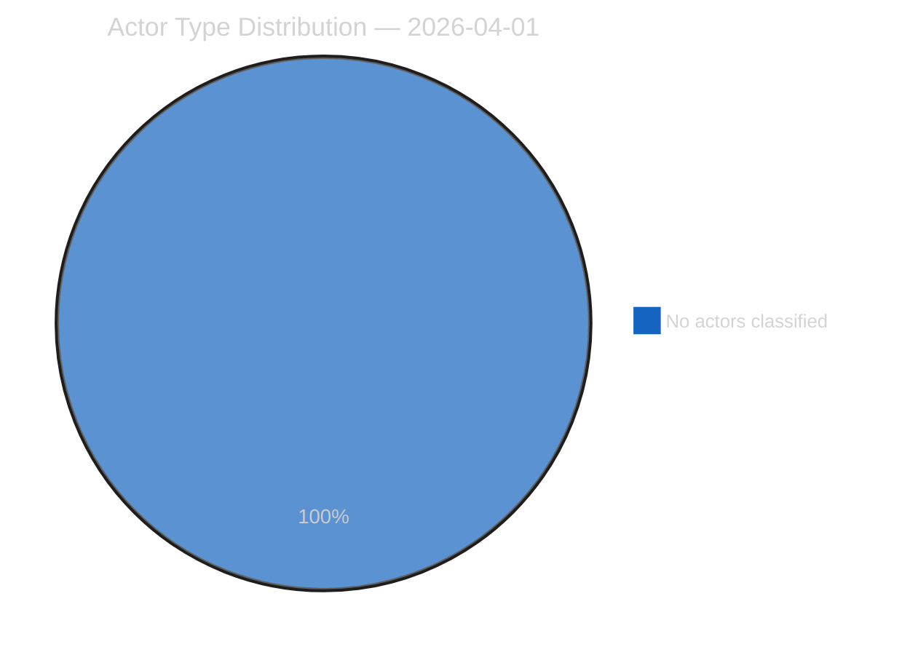
```mermaid
%%{init: {"theme":"dark","themeVariables":{"primaryColor":"#1565C0","primaryTextColor":"#ffffff","primaryBorderColor":"#0A3F7F","lineColor":"#90CAF9","secondaryColor":"#2E7D32","secondaryTextColor":"#ffffff","secondaryBorderColor":"#0F3F00","tertiaryColor":"#FF9800","tertiaryTextColor":"#000000","tertiaryBorderColor":"#7F4F00","mainBkg":"#1565C0","secondBkg":"#2E7D32","tertiaryBkg":"#FF9800","noteBkgColor":"#FFC107","noteTextColor":"#000000","noteBorderColor":"#7F6000","errorBkgColor":"#D32F2F","errorTextColor":"#ffffff","fontFamily":"Inter, Helvetica, Arial, sans-serif","pie1":"#1565C0","pie2":"#2E7D32","pie3":"#FF9800","pie4":"#D32F2F","pie5":"#FFC107","pie6":"#7B1FA2","pie7":"#9E9E9E","pie8":"#0288D1","pie9":"#388E3C","pie10":"#F57C00","pie11":"#C62828","pie12":"#FBC02D","pieTitleTextSize":"18px","pieSectionTextSize":"14px","pieLegendTextSize":"13px","pieStrokeColor":"#1e1e1e","pieOuterStrokeColor":"#1e1e1e","git0":"#1565C0","git1":"#2E7D32","git2":"#FF9800","git3":"#D32F2F","gitBranchLabel0":"#ffffff","gitBranchLabel1":"#ffffff","gitBranchLabel2":"#000000","gitBranchLabel3":"#ffffff","cScale0":"#1565C0","cScale1":"#2E7D32","cScale2":"#FF9800","cScale3":"#D32F2F","cScale4":"#FFC107","cScale5":"#7B1FA2","cScale6":"#9E9E9E","cScale7":"#0288D1","xyChart":{"backgroundColor":"#1e1e1e","plotColorPalette":"#1565C0,#2E7D32,#FF9800,#D32F2F,#FFC107,#7B1FA2,#9E9E9E"}}}}%%
pie title Actor Type Distribution — 2026-04-01
    "No actors classified" : 1
```

### Actor Classification

| Actor | Type | Influence | Position | Role |
|-------|------|-----------|----------|------|
| — | — | — | — | — |

### Type Counts

| Type | Count |
|------|-------|
| — | 0 |

### Date: 2026-04-01

### Forces Analysis

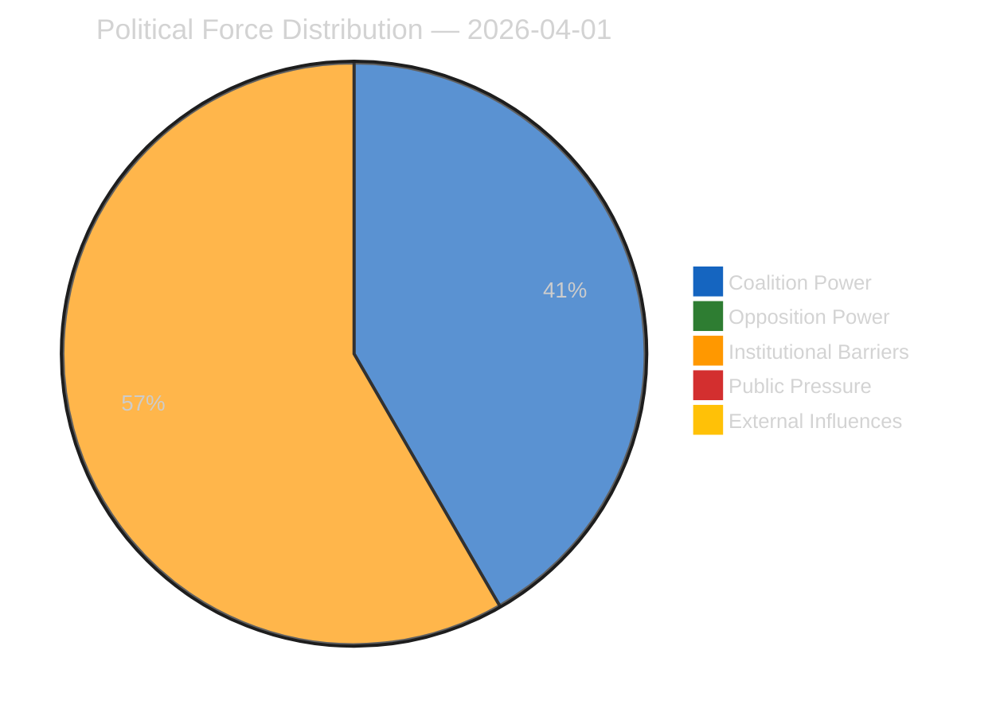
```mermaid
%%{init: {"theme":"dark","themeVariables":{"primaryColor":"#1565C0","primaryTextColor":"#ffffff","primaryBorderColor":"#0A3F7F","lineColor":"#90CAF9","secondaryColor":"#2E7D32","secondaryTextColor":"#ffffff","secondaryBorderColor":"#0F3F00","tertiaryColor":"#FF9800","tertiaryTextColor":"#000000","tertiaryBorderColor":"#7F4F00","mainBkg":"#1565C0","secondBkg":"#2E7D32","tertiaryBkg":"#FF9800","noteBkgColor":"#FFC107","noteTextColor":"#000000","noteBorderColor":"#7F6000","errorBkgColor":"#D32F2F","errorTextColor":"#ffffff","fontFamily":"Inter, Helvetica, Arial, sans-serif","pie1":"#1565C0","pie2":"#2E7D32","pie3":"#FF9800","pie4":"#D32F2F","pie5":"#FFC107","pie6":"#7B1FA2","pie7":"#9E9E9E","pie8":"#0288D1","pie9":"#388E3C","pie10":"#F57C00","pie11":"#C62828","pie12":"#FBC02D","pieTitleTextSize":"18px","pieSectionTextSize":"14px","pieLegendTextSize":"13px","pieStrokeColor":"#1e1e1e","pieOuterStrokeColor":"#1e1e1e","git0":"#1565C0","git1":"#2E7D32","git2":"#FF9800","git3":"#D32F2F","gitBranchLabel0":"#ffffff","gitBranchLabel1":"#ffffff","gitBranchLabel2":"#000000","gitBranchLabel3":"#ffffff","cScale0":"#1565C0","cScale1":"#2E7D32","cScale2":"#FF9800","cScale3":"#D32F2F","cScale4":"#FFC107","cScale5":"#7B1FA2","cScale6":"#9E9E9E","cScale7":"#0288D1","xyChart":{"backgroundColor":"#1e1e1e","plotColorPalette":"#1565C0,#2E7D32,#FF9800,#D32F2F,#FFC107,#7B1FA2,#9E9E9E"}}}}%%
pie title Political Force Distribution — 2026-04-01
    "Coalition Power" : 50
    "Opposition Power" : 1
    "Institutional Barriers" : 70
    "Public Pressure" : 1
    "External Influences" : 1
```

### Forces Data

| Force | Trend | Strength | Key Actors | Confidence |
|-------|-------|----------|------------|------------|
| Coalition Power | stable | 50% | — | low |
| Opposition Power | stable | 0% | — | low |
| Institutional Barriers | stable | 70% | — | medium |
| Public Pressure | stable | 0% | — | medium |
| External Influences | stable | 0% | — | low |

### Balance

| Metric | Value |
|--------|-------|
| Coalition vs Opposition | 50% vs 1% |
| Dominant force | Coalition |
| Date | 2026-04-01 |

### Date: 2026-04-01

### Impact Matrix

### Overall Significance: **ROUTINE**

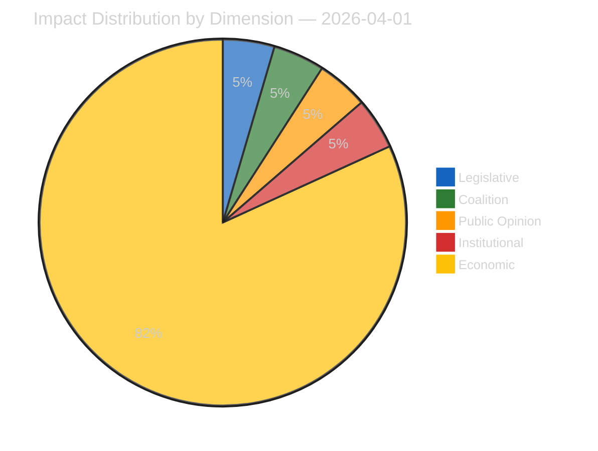
```mermaid
%%{init: {"theme":"dark","themeVariables":{"primaryColor":"#1565C0","primaryTextColor":"#ffffff","primaryBorderColor":"#0A3F7F","lineColor":"#90CAF9","secondaryColor":"#2E7D32","secondaryTextColor":"#ffffff","secondaryBorderColor":"#0F3F00","tertiaryColor":"#FF9800","tertiaryTextColor":"#000000","tertiaryBorderColor":"#7F4F00","mainBkg":"#1565C0","secondBkg":"#2E7D32","tertiaryBkg":"#FF9800","noteBkgColor":"#FFC107","noteTextColor":"#000000","noteBorderColor":"#7F6000","errorBkgColor":"#D32F2F","errorTextColor":"#ffffff","fontFamily":"Inter, Helvetica, Arial, sans-serif","pie1":"#1565C0","pie2":"#2E7D32","pie3":"#FF9800","pie4":"#D32F2F","pie5":"#FFC107","pie6":"#7B1FA2","pie7":"#9E9E9E","pie8":"#0288D1","pie9":"#388E3C","pie10":"#F57C00","pie11":"#C62828","pie12":"#FBC02D","pieTitleTextSize":"18px","pieSectionTextSize":"14px","pieLegendTextSize":"13px","pieStrokeColor":"#1e1e1e","pieOuterStrokeColor":"#1e1e1e","git0":"#1565C0","git1":"#2E7D32","git2":"#FF9800","git3":"#D32F2F","gitBranchLabel0":"#ffffff","gitBranchLabel1":"#ffffff","gitBranchLabel2":"#000000","gitBranchLabel3":"#ffffff","cScale0":"#1565C0","cScale1":"#2E7D32","cScale2":"#FF9800","cScale3":"#D32F2F","cScale4":"#FFC107","cScale5":"#7B1FA2","cScale6":"#9E9E9E","cScale7":"#0288D1","xyChart":{"backgroundColor":"#1e1e1e","plotColorPalette":"#1565C0,#2E7D32,#FF9800,#D32F2F,#FFC107,#7B1FA2,#9E9E9E"}}}}%%
pie title Impact Distribution by Dimension — 2026-04-01
    "Legislative" : 5
    "Coalition" : 5
    "Public Opinion" : 5
    "Institutional" : 5
    "Economic" : 90
```

### Impact Dimensions

| Dimension | Level | Indicator | Numeric |
|-----------|-------|-----------|---------|
| Legislative | none | 🟢 | 5 |
| Coalition | none | 🟢 | 5 |
| Public Opinion | none | 🟢 | 5 |
| Institutional | none | 🟢 | 5 |
| Economic | critical | 🔴 | 90 |

### Summary

| Metric | Value |
|--------|-------|
| Overall significance | ROUTINE |
| Highest impact | Economic |
| Date | 2026-04-01 |

### Date: 2026-04-01

### Significance Assessment

### Overall Significance: **ROUTINE**

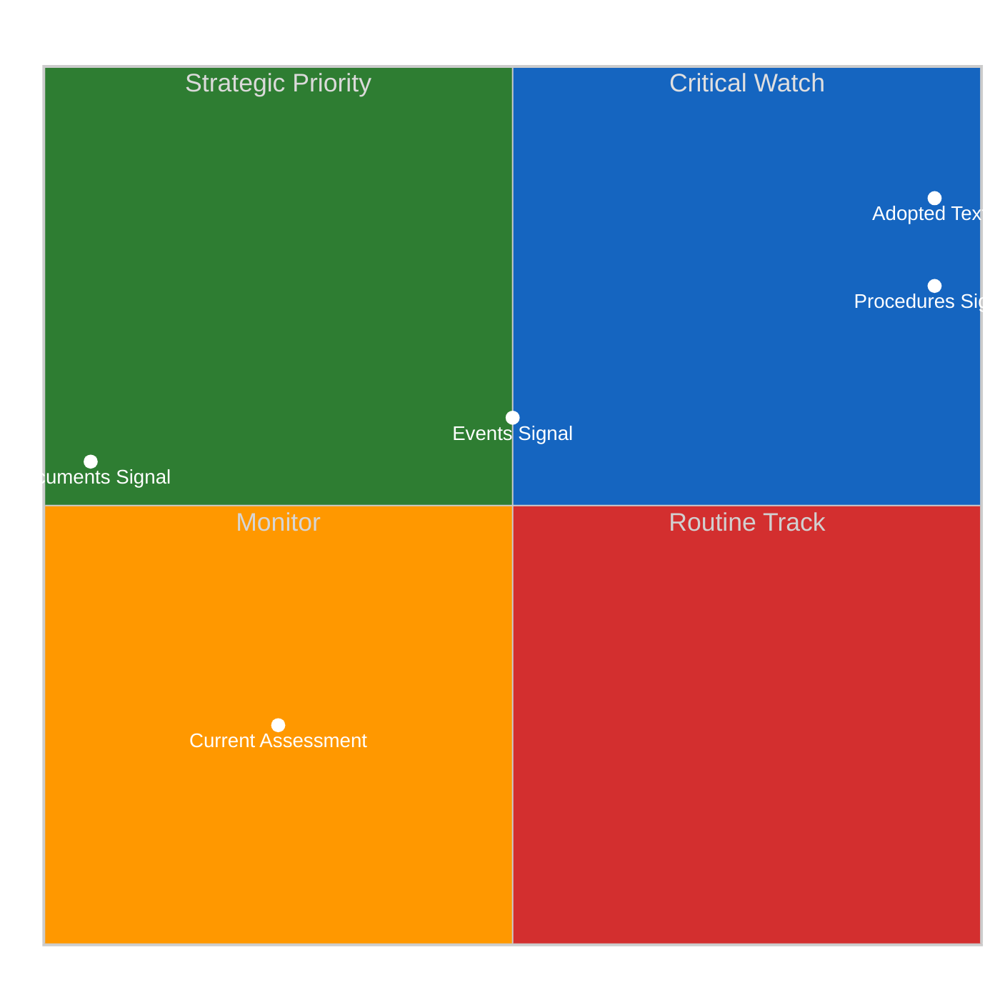
```mermaid
%%{init: {
  "theme": "dark",
  "themeVariables": {
    "quadrant1Fill": "#1565C0",
    "quadrant2Fill": "#2E7D32",
    "quadrant3Fill": "#FF9800",
    "quadrant4Fill": "#D32F2F",
    "quadrantTitleFill": "#ffffff",
    "quadrantPointFill": "#ffffff",
    "quadrantPointTextFill": "#ffffff",
    "quadrantXAxisTextFill": "#ffffff",
    "quadrantYAxisTextFill": "#ffffff"
  },
  "quadrantChart": {
    "chartWidth": 700,
    "chartHeight": 700,
    "pointLabelFontSize": 14,
    "titleFontSize": 22,
    "quadrantLabelFontSize": 18,
    "xAxisLabelFontSize": 16,
    "yAxisLabelFontSize": 16
  }
}}%%
quadrantChart
    title Political Significance Assessment — 2026-04-01
    x-axis Low Volume --> High Volume
    y-axis Low Impact --> High Impact
    quadrant-1 Critical Watch
    quadrant-2 Strategic Priority
    quadrant-3 Monitor
    quadrant-4 Routine Track
    Current Assessment: [0.25, 0.25]
    Events Signal: [0.50, 0.60]
    Documents Signal: [0.05, 0.55]
    Procedures Signal: [0.95, 0.75]
    Adopted Texts: [0.95, 0.85]
```

### 5-Signal Model Scores

| Signal | Raw Data | Score |
|--------|----------|-------|
| Volume | 10 events, 1 documents | 1.1/5 |
| Pipeline | 20 procedures | 4.0/5 |
| Output | 16 adopted texts | 3.2/5 |
| Anomalies | Pattern deviation detection | — |
| Coalition | Group alignment analysis | — |

### Data Summary

| Metric | Value |
|--------|-------|
| Computed significance | ROUTINE |
| Total data points | 47 |
| Events | 10 |
| Documents | 1 |
| Procedures | 20 |
| Adopted texts | 16 |
| Date | 2026-04-01 |

### Date: 2026-04-01

<h2 id="section-coalitions-voting">Coalitions & Voting</h2>

### Voting Patterns

### Overview
Detection and analysis of voting trends across European Parliament proceedings.

### Detected Trends
| Trend ID | Direction | Confidence | Data Points |
|----------|-----------|------------|-------------|
| No trend data available | — | — | — |

### Summary
- **Trends identified**: 0
- **Records analysed**: 0
- **Date**: 2026-04-01

<h2 id="section-risk">Risk Assessment</h2>

### Risk Matrix

### Overview

Quantitative risk scoring across 1 identified political dimensions.
This matrix uses a standardized likelihood × impact framework to quantify and
prioritize political risks affecting the European Parliament legislative process.

### Risk Heat Map

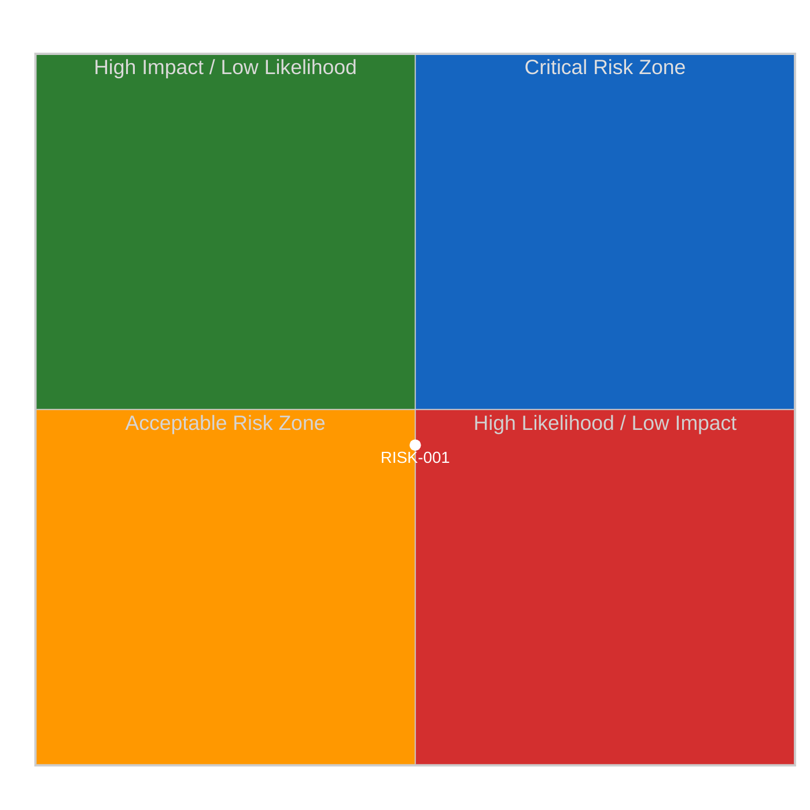
```mermaid
%%{init: {
  "theme": "dark",
  "themeVariables": {
    "quadrant1Fill": "#1565C0",
    "quadrant2Fill": "#2E7D32",
    "quadrant3Fill": "#FF9800",
    "quadrant4Fill": "#D32F2F",
    "quadrantTitleFill": "#ffffff",
    "quadrantPointFill": "#ffffff",
    "quadrantPointTextFill": "#ffffff",
    "quadrantXAxisTextFill": "#ffffff",
    "quadrantYAxisTextFill": "#ffffff"
  },
  "quadrantChart": {
    "chartWidth": 700,
    "chartHeight": 700,
    "pointLabelFontSize": 14,
    "titleFontSize": 22,
    "quadrantLabelFontSize": 18,
    "xAxisLabelFontSize": 16,
    "yAxisLabelFontSize": 16
  }
}}%%
quadrantChart
    title Political Risk Heat Map — 2026-04-01
    x-axis Low Likelihood --> High Likelihood
    y-axis Low Impact --> High Impact
    quadrant-1 Critical Risk Zone
    quadrant-2 High Impact / Low Likelihood
    quadrant-3 Acceptable Risk Zone
    quadrant-4 High Likelihood / Low Impact
    RISK-001: [0.50, 0.45]
```

### Risk Matrix

| Risk ID | Description | Likelihood | Impact | Score | Level |
|---------|-------------|------------|--------|-------|-------|
| RISK-001 | Legislative blockage risk from procedure backlog | possible | moderate | 1.5 | medium |

> **Risk Score** = Likelihood × Impact. **Levels**: 🟢 LOW (≤1.0), 🟡 MEDIUM (≤2.0), 🟠 HIGH (≤3.5), 🔴 CRITICAL (>3.5)

### Risk Assessment Details

#### RISK-001: Legislative blockage risk from procedure backlog

| Metric | Value |
|--------|-------|
| Risk Score | 1.50 |
| Risk Level | MEDIUM |
| Likelihood | possible |
| Impact | moderate |

### Risk Mitigation Framework

| Risk Level | Count | Tolerance | Action Required |
|------------|-------|-----------|-----------------|
| 🔴 CRITICAL | 0 | Zero tolerance | Immediate escalation |
| 🟠 HIGH | 0 | Low tolerance | Active mitigation |
| 🟡 MEDIUM | 1 | Moderate | Enhanced monitoring |
| 🟢 LOW | 0 | Acceptable | Routine tracking |

### Date: 2026-04-01

### Quantitative Swot

### Executive Summary

**Strategic Position Score**: 5.3/10
**Overall Assessment**: Moderate strategic position: balanced strengths and risks requiring careful monitoring.
**Analysis Date**: 2026-04-01

> This SWOT analysis is derived from 20 procedures, 10 events, 16 adopted texts, 1 documents, 0 voting records, and 0 coalition data points fetched from the European Parliament.

### SWOT Quadrant Chart

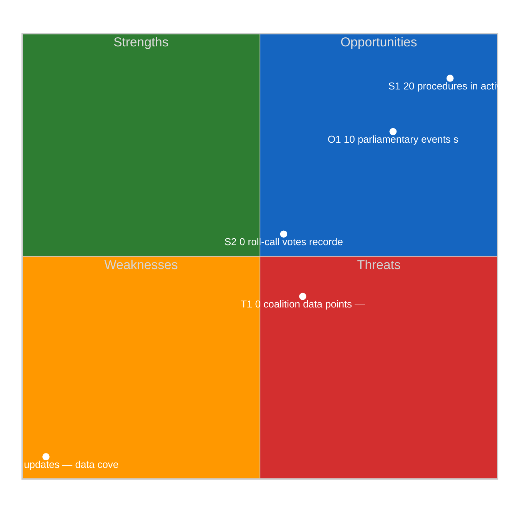
```mermaid
%%{init: {
  "theme": "dark",
  "themeVariables": {
    "quadrant1Fill": "#1565C0",
    "quadrant2Fill": "#2E7D32",
    "quadrant3Fill": "#FF9800",
    "quadrant4Fill": "#D32F2F",
    "quadrantTitleFill": "#ffffff",
    "quadrantPointFill": "#ffffff",
    "quadrantPointTextFill": "#ffffff",
    "quadrantXAxisTextFill": "#ffffff",
    "quadrantYAxisTextFill": "#ffffff"
  },
  "quadrantChart": {
    "chartWidth": 700,
    "chartHeight": 700,
    "pointLabelFontSize": 14,
    "titleFontSize": 22,
    "quadrantLabelFontSize": 18,
    "xAxisLabelFontSize": 16,
    "yAxisLabelFontSize": 16
  }
}}%%
quadrantChart
    title Political SWOT — Strategic Position (2026-04-01)
    x-axis Low Impact --> High Impact
    y-axis Low Priority --> High Priority
    quadrant-1 Opportunities
    quadrant-2 Strengths
    quadrant-3 Weaknesses
    quadrant-4 Threats
    S1 20 procedures in active l: [0.90, 0.90]
    S2 0 roll-call votes recorde: [0.55, 0.55]
    W1 0 MEP updates — data cove: [0.05, 0.05]
    O1 10 parliamentary events s: [0.78, 0.78]
    T1 0 coalition data points —: [0.59, 0.41]
```

### SWOT Overview

| Category | Items | Avg Score | Trend |
|----------|-------|-----------|-------|
| 🟢 Strengths | 2 | 2.0 | improving |
| 🔴 Weaknesses | 1 | 5.0 | stable |
| 🔵 Opportunities | 1 | 2.8 | improving |
| 🟠 Threats | 1 | 0.9 | stable |

### 🟢 Strengths

#### S1: 20 procedures in active legislative pipeline
- **Score**: 4.0/5
- **Confidence**: medium
- **Trend**: improving
- **Evidence**:
  - 20 procedures tracked in current period
  - 16 texts adopted
  - 1 documents published

#### S2: 0 roll-call votes recorded with 6 questions
- **Score**: 0.0/5
- **Confidence**: low
- **Trend**: stable
- **Evidence**:
  - 0 voting records available
  - 6 parliamentary questions filed
  - 0 MEP activity updates

### 🔴 Weaknesses

#### W1: 0 MEP updates — data coverage gap assessment
- **Score**: 5.0/5
- **Confidence**: medium
- **Trend**: stable
- **Evidence**:
  - 0 MEP updates in current period
  - 1 documents vs 20 procedures ratio
  - Data freshness depends on EP feed update frequency

### 🔵 Opportunities

#### O1: 10 parliamentary events scheduled
- **Score**: 2.8/5
- **Confidence**: medium
- **Trend**: improving
- **Evidence**:
  - 10 events in analysis period
  - 16 texts adopted indicates legislative throughput
  - 20 procedures in various stages

### 🟠 Threats

#### T1: 0 coalition data points — cohesion monitoring
- **Score**: 0.9/5
- **Confidence**: low
- **Trend**: stable
- **Evidence**:
  - 0 coalition observations recorded
  - Cross-reference with 0 voting records
  - 20 procedures may be affected by coalition shifts

### Cross-Impact Matrix

| Interaction | Net Effect | Rationale |
|-------------|-----------|----------|
| strength #1 × threat #1 | -0.80 | Strength "20 procedures in active legislative pipeline" partially mitigates threat "0 coalition data points — cohesion monitoring" |
| strength #2 × threat #1 | 0.00 | Strength "0 roll-call votes recorded with 6 questions" partially mitigates threat "0 coalition data points — cohesion monitoring" |
| weakness #1 × threat #1 | 0.75 | Weakness "0 MEP updates — data coverage gap assessment" amplifies threat "0 coalition data points — cohesion monitoring" |

### Strategic Priorities Matrix

### Data Summary

| Data Source | Count |
|-------------|-------|
| Procedures | 20 |
| Events | 10 |
| Documents | 1 |
| Voting Records | 0 |
| Adopted Texts | 16 |
| Coalitions | 0 |
| Questions | 6 |
| MEP Updates | 0 |
| **Total Data Points** | **47** |

### Date: 2026-04-01

### Political Capital Risk

### Data Inventory for Capital Risk Assessment
| Data Source | Count | Relevance |
|-------------|-------|-----------|
| Coalition data points | 0 | Group cohesion indicators |
| Voting records | 0 | Voting alignment metrics |
| Voting patterns | 0 | Trend and anomaly data |
| Active procedures | 20 | Legislative engagement |

### Date: 2026-04-01

### Legislative Velocity Risk

### Overview
Risk assessment based on legislative processing speed for 20 procedures.

### Top Velocity Risks
| Procedure | Title | Stage | Days (actual/expected) | Risk Score | Level |
|-----------|-------|-------|----------------------|------------|-------|
| 2026/0008(COD) | Ordinary legislative procedure 2026/0008 | committee | 0d / 180d | 0.30 | low |
| 2026/0010(COD) | Ordinary legislative procedure 2026/0010 | committee | 0d / 180d | 0.30 | low |
| 2026/0011(COD) | Ordinary legislative procedure 2026/0011 | committee | 0d / 180d | 0.30 | low |
| 2026/0012(COD) | Ordinary legislative procedure 2026/0012 | committee | 0d / 180d | 0.30 | low |
| 2026/0013(COD) | Ordinary legislative procedure 2026/0013 | committee | 0d / 180d | 0.30 | low |
| 2026/0001(BUD) | Budget procedure 2026/0001 | committee | 0d / 180d | 0.30 | low |
| 2026/0004(BUD) | Budget procedure 2026/0004 | committee | 0d / 180d | 0.30 | low |
| 2026/0037(BUD) | Budget procedure 2026/0037 | committee | 0d / 180d | 0.30 | low |
| 2026/0044(COD) | Ordinary legislative procedure 2026/0044 | committee | 0d / 180d | 0.30 | low |
| 2026/0045(COD) | Ordinary legislative procedure 2026/0045 | committee | 0d / 180d | 0.30 | low |

### Summary
- **Procedures analysed**: 20
- **High/Critical risks**: 0
- **Date**: 2026-04-01

### Agent Risk Workflow

### Risk Heat Map

| Impact ↓ / Likelihood → | Rare | Unlikely | Possible | Likely | Almost Certain |
|--------------------------|------|----------|----------|--------|----------------|
| **Severe** | 🟢 | 🟡 | 🟠 | 🟠 | 🔴 |
| **Major** | 🟢 | 🟡 | 🟡 | 🟠 | 🔴 |
| **Moderate** | 🟢 | 🟢 | 🟡 | 🟠 | 🟠 |
| **Minor** | 🟢 | 🟢 | 🟢 | 🟡 | 🟡 |
| **Negligible** | 🟢 | 🟢 | 🟢 | 🟢 | 🟢 |

### Identified Risks

#### RISK-W01: Legislative backlog risk
- **Likelihood**: possible (0.5) | **Impact**: moderate (3) | **Score**: 1.5 (MEDIUM) | **Confidence**: medium
- **Evidence**: 20 active procedures
- **Mitigating Factors**: Committee oversight

### Risk Evaluation Matrix

| Rank | Risk ID | Description | Score | Level | Confidence |
|------|---------|-------------|-------|-------|------------|
| 1 | RISK-W01 | Legislative backlog risk | 1.5 | MEDIUM | medium |

### Risk Treatment Plan

- Monitor legislative velocity indicators
- Track coalition voting patterns

### Recommendations

- Monitor legislative velocity indicators
- Track coalition voting patterns

<h2 id="section-threat">Threat Landscape</h2>

### Actor Threat Profiles

### Overview
Individual threat profiles for 0 political actors.

### Actor Threat Matrix
| Actor | Type | Capability | Motivation | Opportunity | Threat Level |
|-------|------|------------|------------|-------------|--------------|
| — | — | — | — | — | — |

### Date: 2026-04-01

### Consequence Trees

### Overview
Structured analysis of action-consequence chains for 5 legislative procedures.

#### Ordinary legislative procedure 2026/0008
- **Immediate**: Legislative process disruption requiring procedural recalibration; Coalition communication and coordination burden increases
- **Secondary**: Stakeholder confidence shifts in legislative outcome predictability; Political group internal pressure and positioning adjustments
- **Long-term**: Precedent set for similar procedural challenges in future legislative cycles; Structural adjustment of coalition formation strategies
- **Mitigating factors**: Institutional resilience mechanisms, Cross-party dialogue channels
- **Amplifying factors**: No significant amplifying factors identified

#### Ordinary legislative procedure 2026/0010
- **Immediate**: Legislative process disruption requiring procedural recalibration; Coalition communication and coordination burden increases
- **Secondary**: Stakeholder confidence shifts in legislative outcome predictability; Political group internal pressure and positioning adjustments
- **Long-term**: Precedent set for similar procedural challenges in future legislative cycles; Structural adjustment of coalition formation strategies
- **Mitigating factors**: Institutional resilience mechanisms, Cross-party dialogue channels
- **Amplifying factors**: No significant amplifying factors identified

#### Ordinary legislative procedure 2026/0011
- **Immediate**: Legislative process disruption requiring procedural recalibration; Coalition communication and coordination burden increases
- **Secondary**: Stakeholder confidence shifts in legislative outcome predictability; Political group internal pressure and positioning adjustments
- **Long-term**: Precedent set for similar procedural challenges in future legislative cycles; Structural adjustment of coalition formation strategies
- **Mitigating factors**: Institutional resilience mechanisms, Cross-party dialogue channels
- **Amplifying factors**: No significant amplifying factors identified

#### Ordinary legislative procedure 2026/0012
- **Immediate**: Legislative process disruption requiring procedural recalibration; Coalition communication and coordination burden increases
- **Secondary**: Stakeholder confidence shifts in legislative outcome predictability; Political group internal pressure and positioning adjustments
- **Long-term**: Precedent set for similar procedural challenges in future legislative cycles; Structural adjustment of coalition formation strategies
- **Mitigating factors**: Institutional resilience mechanisms, Cross-party dialogue channels
- **Amplifying factors**: No significant amplifying factors identified

#### Ordinary legislative procedure 2026/0013
- **Immediate**: Legislative process disruption requiring procedural recalibration; Coalition communication and coordination burden increases
- **Secondary**: Stakeholder confidence shifts in legislative outcome predictability; Political group internal pressure and positioning adjustments
- **Long-term**: Precedent set for similar procedural challenges in future legislative cycles; Structural adjustment of coalition formation strategies
- **Mitigating factors**: Institutional resilience mechanisms, Cross-party dialogue channels
- **Amplifying factors**: No significant amplifying factors identified

### Date: 2026-04-01

### Legislative Disruption

### Overview
Identification of factors disrupting the normal legislative process.

### Disruption Assessment
| Procedure ID | Title | Stage | Resilience | Disruption Points |
|-------------|-------|-------|-----------|-------------------|
| 2026/0008(COD) | Ordinary legislative procedure 2026/0008 | proposal | high | 7 |
| 2026/0010(COD) | Ordinary legislative procedure 2026/0010 | proposal | high | 7 |
| 2026/0011(COD) | Ordinary legislative procedure 2026/0011 | proposal | high | 7 |
| 2026/0012(COD) | Ordinary legislative procedure 2026/0012 | proposal | high | 7 |
| 2026/0013(COD) | Ordinary legislative procedure 2026/0013 | proposal | high | 7 |

### Date: 2026-04-01

### Political Threat Landscape

### Political Threat Landscape Analysis

#### Coalition Shifts
**Threat Level**: 🟢 Low

Coalition stability appears maintained. No significant realignment signals.

**Evidence:**
- No coalition shift signals detected in available data

#### Transparency Deficit
**Threat Level**: ⚠️ Moderate

Transparency concerns at moderate level. Review committee meeting records and public documentation.

**Evidence:**
- No committee activity data available — potential information gap
- 6 parliamentary questions submitted — active oversight

#### Policy Reversal
**Threat Level**: 🟢 Low

Legislative trajectory appears stable. No major reversal signals.

**Evidence:**
- No significant policy reversal signals detected

#### Institutional Pressure
**Threat Level**: 🟢 Low

Institutional balance appears maintained. Power distribution within normal parameters.

**Evidence:**
- No institutional threat signals detected

#### Legislative Obstruction
**Threat Level**: 🟢 Low

Legislative pace within normal parameters. No obstruction signals.

**Evidence:**
- No significant legislative delay signals detected

#### Democratic Erosion
**Threat Level**: 🟢 Low

Democratic norms appear stable. Institutional processes functioning within expected parameters.

**Evidence:**
- Democratic norms appear stable. No systematic erosion signals.

### Actor Threat Profiles

*No actor threat profiles generated from available data.*

### Consequence Trees

#### Consequence Tree: Standard legislative activity assessment

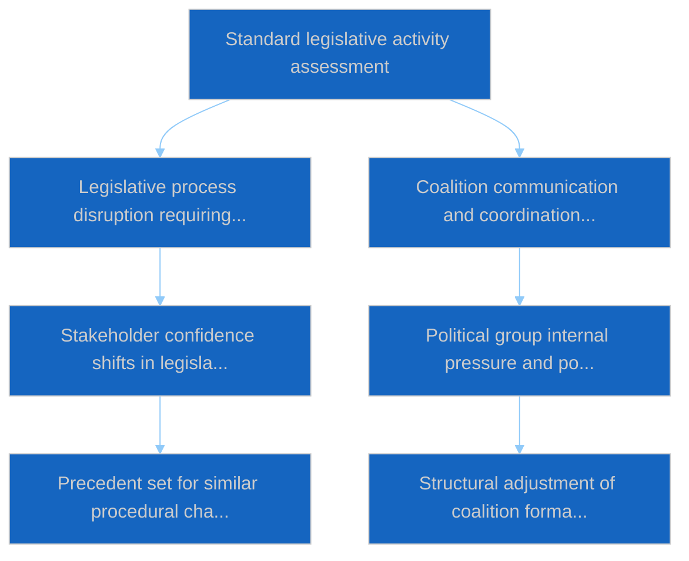
```mermaid
%%{init: {"theme":"dark","themeVariables":{"primaryColor":"#1565C0","primaryTextColor":"#ffffff","primaryBorderColor":"#0A3F7F","lineColor":"#90CAF9","secondaryColor":"#2E7D32","secondaryTextColor":"#ffffff","secondaryBorderColor":"#0F3F00","tertiaryColor":"#FF9800","tertiaryTextColor":"#000000","tertiaryBorderColor":"#7F4F00","mainBkg":"#1565C0","secondBkg":"#2E7D32","tertiaryBkg":"#FF9800","noteBkgColor":"#FFC107","noteTextColor":"#000000","noteBorderColor":"#7F6000","errorBkgColor":"#D32F2F","errorTextColor":"#ffffff","fontFamily":"Inter, Helvetica, Arial, sans-serif","pie1":"#1565C0","pie2":"#2E7D32","pie3":"#FF9800","pie4":"#D32F2F","pie5":"#FFC107","pie6":"#7B1FA2","pie7":"#9E9E9E","pie8":"#0288D1","pie9":"#388E3C","pie10":"#F57C00","pie11":"#C62828","pie12":"#FBC02D","pieTitleTextSize":"18px","pieSectionTextSize":"14px","pieLegendTextSize":"13px","pieStrokeColor":"#1e1e1e","pieOuterStrokeColor":"#1e1e1e","git0":"#1565C0","git1":"#2E7D32","git2":"#FF9800","git3":"#D32F2F","gitBranchLabel0":"#ffffff","gitBranchLabel1":"#ffffff","gitBranchLabel2":"#000000","gitBranchLabel3":"#ffffff","cScale0":"#1565C0","cScale1":"#2E7D32","cScale2":"#FF9800","cScale3":"#D32F2F","cScale4":"#FFC107","cScale5":"#7B1FA2","cScale6":"#9E9E9E","cScale7":"#0288D1","xyChart":{"backgroundColor":"#1e1e1e","plotColorPalette":"#1565C0,#2E7D32,#FF9800,#D32F2F,#FFC107,#7B1FA2,#9E9E9E"}}}}%%
graph TD
    A["Standard legislative activity assessment"]
    B0["Legislative process disruption requiring..."]
    A --> B0
    B1["Coalition communication and coordination..."]
    A --> B1
    C0["Stakeholder confidence shifts in legisla..."]
    B0 --> C0
    C1["Political group internal pressure and po..."]
    B1 --> C1
    D0["Precedent set for similar procedural cha..."]
    C0 --> D0
    D1["Structural adjustment of coalition forma..."]
    C1 --> D1
```

**Mitigating Factors:**
- Institutional resilience mechanisms
- Cross-party dialogue channels

**Amplifying Factors:**
- No significant amplifying factors identified

### Legislative Disruption Analysis

#### Procedure: 2026/0008\(COD\)

**Current Stage**: proposal | **Resilience**: high

| Stage | Threat Category | Likelihood | Risk Level |
|-------|----------------|------------|------------|
| proposal | delay | 8% | 🟢 Low |
| committee | transparency | 18% | 🟢 Low |
| plenary first reading | shift | 22% | 🟢 Low |
| council position | delay | 12% | 🟢 Low |
| plenary second reading | shift | 21% | 🟢 Low |
| conciliation | reversal | 17% | 🟢 Low |
| adoption | delay | 5% | 🟢 Low |

**Alternative Pathways:**
- Commission resubmission with revised proposal
- Enhanced informal trilogue engagement
- Interim resolution as procedural bridge

#### Procedure: 2026/0010\(COD\)

**Current Stage**: proposal | **Resilience**: high

| Stage | Threat Category | Likelihood | Risk Level |
|-------|----------------|------------|------------|
| proposal | delay | 8% | 🟢 Low |
| committee | transparency | 18% | 🟢 Low |
| plenary first reading | shift | 22% | 🟢 Low |
| council position | delay | 12% | 🟢 Low |
| plenary second reading | shift | 21% | 🟢 Low |
| conciliation | reversal | 17% | 🟢 Low |
| adoption | delay | 5% | 🟢 Low |

**Alternative Pathways:**
- Commission resubmission with revised proposal
- Enhanced informal trilogue engagement
- Interim resolution as procedural bridge

#### Procedure: 2026/0011\(COD\)

**Current Stage**: proposal | **Resilience**: high

| Stage | Threat Category | Likelihood | Risk Level |
|-------|----------------|------------|------------|
| proposal | delay | 8% | 🟢 Low |
| committee | transparency | 18% | 🟢 Low |
| plenary first reading | shift | 22% | 🟢 Low |
| council position | delay | 12% | 🟢 Low |
| plenary second reading | shift | 21% | 🟢 Low |
| conciliation | reversal | 17% | 🟢 Low |
| adoption | delay | 5% | 🟢 Low |

**Alternative Pathways:**
- Commission resubmission with revised proposal
- Enhanced informal trilogue engagement
- Interim resolution as procedural bridge

### Key Findings

- No high-priority threats detected across threat landscape dimensions

### Recommendations

- Continue routine monitoring of parliamentary activity

---
*Assessment generated by EU Parliament Monitor Political Threat Assessment Pipeline.*  
*Based on public European Parliament data. GDPR-compliant.*

<h2 id="section-continuity">Cross-Run Continuity</h2>

### Cross Session Intelligence

### Overview
Analysis of coalition stability patterns across multiple plenary sessions.

### Stability Report
- **Overall Stability**: 0.0%
- **Forecast**: volatile
- **Patterns Analysed**: 0

### Group Analysis
- **Stable Groups**: None identified
- **Declining Groups**: None identified

### Date: 2026-04-01

<h2 id="section-deep-analysis">Deep Analysis</h2>

### Raw Data Inventory
| Data Source | Count |
|-------------|-------|
| Events | 10 |
| Procedures | 20 |
| Documents | 1 |
| Adopted Texts | 16 |
| Questions | 6 |
| MEP Updates | 0 |
| **Total** | **53** |

### Stakeholder Groups for AI Analysis
| Stakeholder Group | Data Points Available |
|-------------------|---------------------|
| Political Groups | 36 (procedures + adopted texts) |
| Civil Society | 7 (documents + questions) |
| Industry | 20 (procedures) |
| National Governments | 16 (adopted texts) |
| Citizens | 6 (questions + MEP updates) |
| EU Institutions | 30 (events + procedures) |

### Date: 2026-04-01

<h2 id="section-supplementary-intelligence">Supplementary Intelligence</h2>

### Executive Brief Ar

**التصنيف:** OSINT | سجل برلماني عام
**مستوى الثقة:** 🟡 متوسط (استشرافي؛ إخراج التصنيف الفارغ يحدّ من العمق)
**تاريخ الإصدار:** 2026-04-01T00:00:00Z (ملخص استعادي)
**نوع المقال:** الشهر القادم
**معرّف التشغيل:** `7f928e7c-85fd-4f76-890b-f362622c3f42`
**المصدر:** بوابة البيانات المفتوحة للبرلمان الأوروبي

---

### 🎯 BLUF

**آفاق أبريل 2026 مرتبطة بجلسة البرلمان الأوروبي العامة في ستراسبورغ من 27 إلى 30 أبريل وأسبوع اللجان التحضيري من 13 إلى 17 أبريل.** أسفر تشغيل التوقعات الشهرية عن **0 جهة فاعلة مصنَّفة** ودرجات أبعاد **اعتيادية**، مما يعكس اليوم الأول للبرلمان الأوروبي بعد استراحة مارس بدلاً من تقديم توقعات سيناريو أبريل الجوهرية. الأولويات المُنقلة إلى أبريل: تعديل التعريفة الجمركية الأمريكية (TA-10-2026-0096)، رأي محكمة العدل الأوروبية بشأن اتفاقية الاتحاد الأوروبي-ميركوسور (معلّق)، نقل أرصدة انبعاثات HDV (TA-10-2026-0084)، تنفيذ قرارات السجناء السياسيين الجورجيين (TA-10-2026-0083)، والتداعيات القانونية البولندية الجارية من سابقة الحصانة لبراون (TA-10-2026-0088). ثلاثة سيناريوهات عمل: **السيناريو أ — جدول أعمال ثقيل تجاريًا (55%)**, **السيناريو ب — تركيز على سيادة القانون (25%)**, **السيناريو ج — تركيز اقتصادي/صناعي (20%)**. **🟡 ثقة متوسطة** — جدول أعمال أبريل لم يُنشر بعد.

---

### 🧭 3 قرارات يدعمها هذا الملخص

| # | القرار | من يقرر | الموعد النهائي | الأدلة |
|:-:|--------|---------|:--------------:|--------|
| 1 | **تحريري:** النشر كتوقعات شهرية قائمة على سيناريوهات مع تحفظ صريح «الجدول الزمني في الانتظار» | المحرر | +24 ساعة | المخزون المُنقل؛ ثلاثة سيناريوهات |
| 2 | **المراقبة:** دورة استخبارات ما قبل الجلسة 13-17 أبريل (أسبوع اللجان) | المحلل | 2026-04-13 | أولى إشارات أبريل الجوهرية |
| 3 | **مراقبة استشرافية:** إعادة تشغيل التوقعات الشهرية T-7 للجلسة (~20 أبريل) مع جدول الأعمال المنشور | رئيس التحليل | 2026-04-20 | تأكيد اختيار السيناريو |

---

### 📰 قراءة 60 ثانية

- 🔴 **لا إجراءات أو نقاط جدول أعمال جديدة خاصة بأبريل في التغذية اليومية** — يُنشر جدول أعمال ستراسبورغ عادةً قبل T-7 أيام. (🟢 مرتفع)
- 🟠 **ثلاثة سيناريوهات عمل** للجلسة العامة في أبريل، يهيمن عليها المتغير التجاري (55%): تعديل رسوم جمركية أمريكية، رأي ميركوسور، السيادة الرقمية. (🟡 متوسط)
- 🟢 **مسار سيادة القانون المُنقل:** تداعيات سابقة براون، تنفيذ قرارات جورجيا، إجراءات حصانة إضافية محتملة (مدفوعة من LIBE). (🟡 متوسط)
- 🟡 **المتغير الاقتصادي/الصناعي:** متابعة التقرير السنوي للبنك المركزي الأوروبي (TA-10-2026-0034)، مقاومة الدول الأعضاء لنقل HDV. (🟡 متوسط)
- 🔵 **السياق الاقتصادي:** نافذة نشر تقرير IMF WEO لأبريل تتزامن مع الجلسة العامة — قد تلوّن توقعات ضغط المالية العامة النقاش المبكر حول الإطار المالي متعدد السنوات. (🟢 مرتفع — توافق التقويم)
- 🟣 **الإسناد المتقاطع:** وثّق تشغيل 2026-04-01/breaking نمط خطأ 404 في 6/8 من تغذيات الاستشارات مما منع هذا التشغيل من إنتاج تصنيفات جهات فاعلة جديدة. (🟢 مرتفع)
- 🩷 **متجه التعطيل:** سُجِّل تغلّب مجموعة PPE المهيمنة (38%) كمخاطر مرتفعة من قِبل نظام الإنذار المبكر — أرجح متجه لمفاجأة أبريل هو انقسام داخلي في EPP حول التجارة أو سيادة القانون. (🟡 متوسط)
- ⚪ **الترحيل:** يرسي تقرير «التشريع الأفضل» TA-10-2026-0063 خط الأساس لنقاش إصلاح المؤسسات لبقية EP10.

---

### 🗂️ أهم الوثائق / الإجراءات — قائمة مراقبة أبريل

| الترتيب | المرجع البرلماني | العنوان (مختصر) | الأهمية | مستوى الثقة | الحالة |
|:-------:|-----------------|-----------------|:-------:|:-----------:|--------|
| 1 | TA-10-2026-0096 | تعديل التعريفة الجمركية الأمريكية | 7.5 | 🟢 مرتفع | تمت الموافقة في 26 مارس؛ المتابعة في أبريل متوقعة |
| 2 | TA-10-2026-0008 | إحالة EU-Mercosur إلى محكمة العدل الأوروبية (الرأي معلّق) | 7.0 | 🟡 متوسط | الرأي القضائي متوقع قبل الجلسة العامة في أبريل |
| 3 | TA-10-2026-0083 | السجناء السياسيون الجورجيون | 6.5 | 🟢 مرتفع | تقارير التنفيذ مستحقة |
| 4 | TA-10-2026-0088 | حصانة براون (سابقة للقضايا اللاحقة) | 6.5 | 🟢 مرتفع | مراقبة متابعة LIBE |
| 5 | TA-10-2026-0084 | أرصدة انبعاثات HDV 2025–2029 | 6.0 | 🟢 مرتفع | النقل الوطني |

---

### ⚠️ لقطة المخاطر والتهديدات — آفاق أبريل

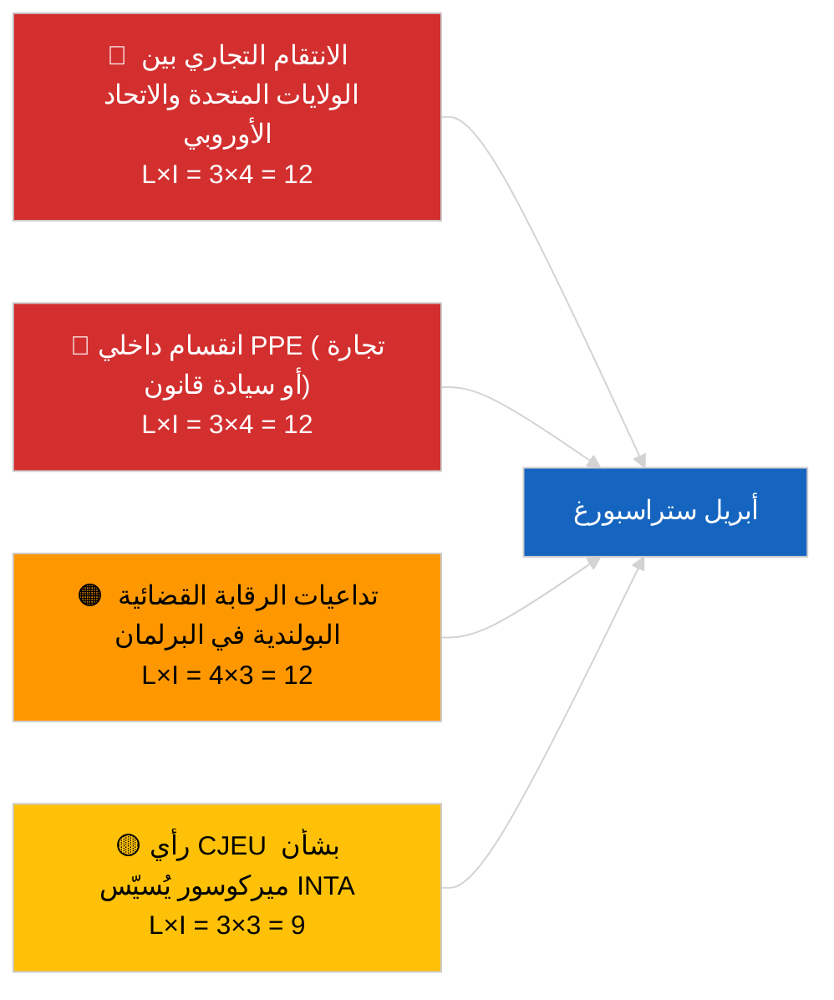
```mermaid
%%{init: {"theme":"dark"}}%%
graph LR
    R1["🔴 الانتقام التجاري بين الولايات المتحدة والاتحاد الأوروبي<br/>L×I = 3×4 = 12"] --> CONS["أبريل ستراسبورغ"]
    R2["🔴 انقسام داخلي PPE (تجارة أو سيادة قانون)<br/>L×I = 3×4 = 12"] --> CONS
    R3["🟠 تداعيات الرقابة القضائية البولندية في البرلمان<br/>L×I = 4×3 = 12"] --> CONS
    R4["🟡 رأي CJEU بشأن ميركوسور يُسيّس INTA<br/>L×I = 3×3 = 9"] --> CONS
    style R1 fill:#D32F2F,color:#FFFFFF
    style R2 fill:#D32F2F,color:#FFFFFF
    style R3 fill:#FF9800,color:#000000
    style R4 fill:#FFC107,color:#000000
    style CONS fill:#1565C0,color:#FFFFFF
```

| المخاطرة | L | I | النتيجة | المحفّز | المصدر | الأدميرالية |
|----------|:-:|:-:|:-------:|---------|--------|:-----------:|
| الانتقام التجاري بين الولايات المتحدة والاتحاد الأوروبي | 3 | 4 | 12 | إعلان مضاد أمريكي | TA-10-2026-0096 | A1 |
| الانقسام الداخلي EPP | 3 | 4 | 12 | انقسام تصويت مرئي | حسابات الائتلاف | A2 |
| التداعيات القضائية البولندية في البرلمان | 4 | 3 | 12 | قضية حصانة إضافية | TA-10-2026-0088 | A1 |
| تسييس رأي ميركوسور | 3 | 3 | 9 | المحكمة تنشر قبل الجلسة | TA-10-2026-0008 | A2 |
| تصنيف التوقعات الشهرية الفارغ | 3 | 2 | 6 | إعادة التشغيل فارغة أيضًا 2026-04-20 | هذا التشغيل | B3 |

---

### 🔮 أهم المحفّزات الاستشرافية

**نشر جدول أعمال ستراسبورغ ~20 أبريل 2026 (T-7).** ستُحسم عدم اليقين المتعلقة بالسيناريوهات الثلاثة من خلال تكوين جدول الأعمال: الترجيح التجاري الثقيل (السيناريو أ) يؤكد الرواية المهيمنة المُنقلة؛ ترجيح سيادة القانون (السيناريو ب) يشير إلى زخم LIBE من سابقة براون؛ الترجيح الاقتصادي/الصناعي (السيناريو ج) يرفع ملفات ECON و ENVI.

---

### 🛡️ تقييم جودة المصادر

- **المصادر الأولية:** بوابة البيانات المفتوحة للبرلمان الأوروبي — تشغيل التحليل `7f928e7c-85fd-4f76-890b-f362622c3f42`؛ مخزون نصوص مارس 2026 المعتمدة (مُنقل).
- **قيود البيانات:** أسفر تشغيل اليوم عن 0 جهة فاعلة وأهمية اعتيادية؛ الاستنتاج الاستشرافي مرتكز على مقالات اليوم السابق وتقويم البرلمان الأوروبي، لا على نمذجة سيناريوهات متجددة.
- **الثقة في احتمالات السيناريوهات:** 🟡 متوسط (ترجيح نوعي).
- **الثقة في قائمة الأولويات المُنقلة:** 🟢 مرتفع.

---

### 📎 الروابط

| الرابط | المسار |
|--------|--------|
| المقال | `./article.md` |
| التصنيف (فارغ) | `./classification/` |
| التشغيلات الشقيقة | `analysis/daily/2026-04-01/breaking/`, `committee-reports/`, `motions/`, `propositions/` |
| المصدر — مخزون تشريعات مارس | `analysis/daily/2026-03-10/` → `2026-03-26/` |
| الملف التعريفي | `./manifest.json` |

---

### 🔄 الإسناد المتقاطع

**التشغيلات السابقة:** توفر جلسة ستراسبورغ 9-12 مارس وجلسة بروكسل العامة المصغرة 25-26 مارس القاعدة المُنقلة الجوهرية التي تستخدمها توقعات هذا الشهر.

**التحقق اللاحق:** المقارنة مع مراجعة ما بعد جلسة أبريل العامة الشهرية (متوقعة في مطلع مايو 2026) لتقييم دقة توقعات السيناريو.

---

**التحكم في الوثيقة**
- **القالب:** `/analysis/templates/executive-brief.md`
- **مسار الأداة:** `analysis/daily/2026-04-01/month-ahead/executive-brief.md`
- **التصنيف:** عام
- **الإنتاج الاستعادي:** جلسة الملء السابق للتاريخ.

### Executive Brief Da

### 🎯 BLUF

**Apriludsigterne for 2026 er forankret i Strasbourg-plenarsamlingen 27.–30. april og den forberedende udvalgsvecka 13.–17. april.** Måneds-fremsyn-kørslen returnerede **0 klassificerede aktører** og **RUTINE**-dimensionsscorer, hvilket afspejler Europa-Parlamentets første dag efter marts-pausen frem for en substantiel aprilscenario-prognose. Overførte prioriteter ind i april: USA's toldtarif-tilpasning (TA-10-2026-0096), EU-Mercosur EF-domstolsudtalelse (afventende), HDV-emissionskreditter transponering (TA-10-2026-0084), implementering af georgiske politiske fanger (TA-10-2026-0083), og igangværende polsk-retlige følgevirkninger fra Braun-immunitets-præcedensen (TA-10-2026-0088). Tre arbejdsscenarier: **Scenarie A — handelstungt program (55%)**, **Scenarie B — retsstatsfokus (25%)**, **Scenarie C — økonomisk/industrielt fokus (20%)**. **🟡 MIDDEL konfidensgrad** — aprilprogrammet er endnu ikke offentliggjort.

---

### 🧭 3 Beslutninger Dette Notat Understøtter

| # | Beslutning | Hvem beslutter | Deadline | Dokumentation |
|:-:|-----------|---------------|:--------:|---------------|
| 1 | **Redaktionel:** udgiv som scenariedrevet måneds-fremsyn med eksplicit "program afventes"-forbehold | Redaktør | +24h | Overført inventar; tre scenarier |
| 2 | **Overvågning:** for-plenar efterretningscyklus 13.–17. april (udvalgsuge) | Analytiker | 2026-04-13 | Første substantielle aprilsignaler |
| 3 | **Fremadrettet bevakning:** kør måneds-fremsyn igen T-7 til plenar (~20. april) med offentliggjort program | Analyseansvarlig | 2026-04-20 | Bekræft scenarievalg |

---

### 📰 60-Sekunders Læsning

- 🔴 **Ingen nye aprilspecifikke procedurer eller dagsordenspunkter i dagens feed** — Strasbourg-programmet offentliggøres typisk T-7 dage. (🟢 Høj)
- 🟠 **Tre arbejdsscenarier** for aprilplenarsamlingen, domineret af handelstung variant (55%): USA's toldtilpasning, Mercosur-udtalelse, digital suverænitet. (🟡 Middel)
- 🟢 **Overført retsstatsspor:** Braun-præcedensens eftervirkninger, Georgien-implementering, potentielle yderligere immunitetsforhandlinger (LIBE-drevet). (🟡 Middel)
- 🟡 **Økonomisk/industriel variant:** ECB's årsrapport-opfølgning (TA-10-2026-0034), HDV-transponeringmodstand fra medlemsstater. (🟡 Middel)
- 🔵 **Økonomisk kontekst:** IMF april WEO-offentliggørelsevinduet sammenfalder med plenarsamlingen — skattemæssige stressudsigter kan farve den tidlige MFF-debat. (🟢 Høj — kalenderoverlapning)
- 🟣 **Krydsreference:** søskende-kørslen 2026-04-01/breaking dokumenterer 6/8 404-fejlsmønstret i rådgivningsfeedet, som hindrede denne måneds-fremsyn-kørsel i at producere ny aktørklassificering. (🟢 Høj)
- 🩷 **Forstyrrelsesvektor:** dominerende-gruppe-overgreb (PPE 38%) markeret HØJ af det tidlige varslingssystem — sandsynligste vektor for en apriloverraskelse er en EPP-intern splittelse om handel eller retsstat. (🟡 Middel)
- ⚪ **Fremadrettet overførsel:** Bedre lovgivning-rapporten TA-10-2026-0063 fastlægger baseline for den institutionelle reformdebat for resten af EP10.

---

### 🗂️ Topdokumenter / Procedurer — Aprilovervågningsliste

| Rang | EP-reference | Titel (kort) | Betydning | Konfidensgrad | Status |
|:----:|--------------|--------------|:---------:|:-------------:|--------|
| 1 | TA-10-2026-0096 | USA's toldtarifjustering | 7,5 | 🟢 HØJ | Vedtaget 26. marts; aprilopfølgning forventet |
| 2 | TA-10-2026-0008 | EU-Mercosur EF-domstolshenskydning (afventer udtalelse) | 7,0 | 🟡 MIDDEL | Domstolsudtalelse forventes inden aprilplenarsamlingen |
| 3 | TA-10-2026-0083 | Georgiske politiske fanger | 6,5 | 🟢 HØJ | Implementeringsrapportering forfalder |
| 4 | TA-10-2026-0088 | Braun-immunitet (præcedens for efterfølgende sager) | 6,5 | 🟢 HØJ | LIBE-opfølgningsbevakning |
| 5 | TA-10-2026-0084 | HDV-emissionskreditter 2025–2029 | 6,0 | 🟢 HØJ | National transponering |

---

### ⚠️ Risiko- og Trusselbillede — Apriludsigt

```mermaid
%%{init: {"theme":"dark"}}%%
graph LR
    R1["🔴 USA-EU handelsgengældelse<br/>L×I = 3×4 = 12"] --> CONS["April Strasbourg"]
    R2["🔴 EPP-intern splittelse (handel eller RoL)<br/>L×I = 3×4 = 12"] --> CONS
    R3["🟠 EP-polsk retsstats-spill-over<br/>L×I = 4×3 = 12"] --> CONS
    R4["🟡 Mercosur EF-udtalelse politiserer INTA<br/>L×I = 3×3 = 9"] --> CONS
    style R1 fill:#D32F2F,color:#FFFFFF
    style R2 fill:#D32F2F,color:#FFFFFF
    style R3 fill:#FF9800,color:#000000
    style R4 fill:#FFC107,color:#000000
    style CONS fill:#1565C0,color:#FFFFFF
```

| Risiko | L | I | Score | Udløser | Kilde | Admiralitet |
|--------|:-:|:-:|:-----:|---------|-------|:-----------:|
| USA-EU handelsgengældelse | 3 | 4 | 12 | USA's modmeddelelse | TA-10-2026-0096 | A1 |
| EPP-intern splittelse | 3 | 4 | 12 | Synlig afstemningsdivision | Koalitionsaritmetik | A2 |
| EP-polsk retsstats-spill-over | 4 | 3 | 12 | Yderligere immunitetsssag | TA-10-2026-0088 | A1 |
| Mercosur-udtalelse politisering | 3 | 3 | 9 | Domstol offentliggør forud for plenar | TA-10-2026-0008 | A2 |
| Tom måneds-fremsyn-klassificering | 3 | 2 | 6 | Genkørsel også tom 2026-04-20 | Denne kørsel | B3 |

---

### 🔮 Vigtigste Fremtidige Udløser

**Strasbourgs programoffentliggørelse ~20. april 2026 (T-7).** Programmets sammensætning vil løse den tre-scenarios-usikkerhed: handelstung vægtning (Scenarie A) bekræfter den dominerende overførte narrativ; retsstatsvægtning (Scenarie B) signalerer LIBE-momentum fra Braun-præcedensen; økonomisk/industriel vægtning (Scenarie C) løfter ECON- og ENVI-filer.

---

### 🛡️ Vurdering af Kildekvalitet

- **Primære kilder:** Europa-Parlamentets åbne dataportal — analysekørsel `7f928e7c-85fd-4f76-890b-f362622c3f42`; marts 2026 vedtagne-tekster-inventar (overført).
- **Databegrænsninger:** Dagens kørsel producerede 0 aktører og RUTINE-signifikans; fremadrettet inferens er forankret til foregående dags artikler og EP's kalender, ikke regenereret scenariemodellering.
- **Konfidensgrad for scenarieprobabiliteter:** 🟡 Middel (kvalitativ vægtning).
- **Konfidensgrad for overført prioriteringsliste:** 🟢 Høj.

---

### 📎 Links

| Link | Sti |
|------|-----|
| Artikel | `./article.md` |
| Klassificering (tom) | `./classification/` |
| Søskende-kørsler | `analysis/daily/2026-04-01/breaking/`, `committee-reports/`, `motions/`, `propositions/` |
| Kilde — marts lovgivningsinventar | `analysis/daily/2026-03-10/` → `2026-03-26/` |
| Manifest | `./manifest.json` |

---

### 🔄 Krydsreference

**Tidligere kørsler:** Strasbourg 9.–12. marts og Bruxelles mini-plenarsamling 25.–26. marts leverer den substantielle overførte base, der bruges af dette måneds-fremsyn.

**Efterfølgende verifikation:** Sammenlign med post-april-plenar månedsoversigten (forventes tidligt maj 2026) for at bedømme scenariekald-nøjagtigheden.

---

**Dokumentkontrol**
- **Skabelon:** `/analysis/templates/executive-brief.md`
- **Artefaktsti:** `analysis/daily/2026-04-01/month-ahead/executive-brief.md`
- **Klassifikation:** Offentlig
- **Retrospektiv generering:** Tilbagedateret session.

### Executive Brief De

### 🎯 BLUF

**Die April-2026-Aussichten sind auf die Straßburger Plenarsitzung 27.–30. April und die vorbereitende Ausschusswoche 13.–17. April ausgerichtet.** Der Monatsvorschau-Lauf lieferte **0 klassifizierte Akteure** und **ROUTINE**-Dimensionsbewertungen, was den ersten Tag des Europäischen Parlaments nach der März-Pause widerspiegelt und keine substanzielle April-Szenario-Prognose bietet. Übertragene Prioritäten in den April hinein: US-Zolltarifanpassung (TA-10-2026-0096), EU-Mercosur-EuGH-Stellungnahme (ausstehend), HDV-Emissionsgutschriften-Umsetzung (TA-10-2026-0084), Umsetzung georgischer politischer Gefangener (TA-10-2026-0083) und laufende polnisch-rechtliche Nachwirkungen aus dem Braun-Immunitätspräzedenzfall (TA-10-2026-0088). Drei Arbeitsszenarien: **Szenario A — handelschwere Tagesordnung (55%)**, **Szenario B — Rechtsstaatsfokus (25%)**, **Szenario C — wirtschaftlicher/industrieller Fokus (20%)**. **🟡 MITTLERER Konfidenzgrad** — April-Tagesordnung noch nicht veröffentlicht.

---

### 🧭 3 Entscheidungen, die dieser Brief unterstützt

| # | Entscheidung | Wer entscheidet | Frist | Belege |
|:-:|-------------|----------------|:-----:|--------|
| 1 | **Redaktionell:** als szenariogeleitete Monatsvorschau mit ausdrücklichem „Tagesordnung ausstehend"-Vorbehalt veröffentlichen | Redakteur | +24h | Übertragenes Inventar; drei Szenarien |
| 2 | **Überwachung:** Vor-Plenar-Geheimdienstzyklus 13.–17. April (Ausschusswoche) | Analyst | 2026-04-13 | Erste substanzielle April-Signale |
| 3 | **Vorausschauende Überwachung:** Monatsvorschau T-7 vor Plenar (~20. April) mit veröffentlichter Tagesordnung erneut ausführen | Analyseverantwortlicher | 2026-04-20 | Szenarioauswahl bestätigen |

---

### 📰 60-Sekunden-Lesung

- 🔴 **Keine neuen aprilspezifischen Verfahren oder Tagesordnungspunkte im heutigen Feed** — Straßburger Tagesordnung wird typischerweise T-7 Tage veröffentlicht. (🟢 Hoch)
- 🟠 **Drei Arbeitsszenarien** für die April-Plenarsitzung, dominiert von handelschwerer Variante (55%): US-Zollanpassung, Mercosur-Stellungnahme, digitale Souveränität. (🟡 Mittel)
- 🟢 **Übertragene Rechtsstaatsspur:** Nachwirkungen des Braun-Präzedenzfalls, Georgien-Umsetzung, potenzielle zusätzliche Immunitätsverfahren (LIBE-gesteuert). (🟡 Mittel)
- 🟡 **Wirtschaftliche/industrielle Variante:** EZB-Jahresbericht-Folgeaufgaben (TA-10-2026-0034), HDV-Umsetzungswiderstand von Mitgliedstaaten. (🟡 Mittel)
- 🔵 **Wirtschaftlicher Kontext:** IMF April-WEO-Veröffentlichungsfenster fällt mit der Plenarsitzung zusammen — fiskalische Stressprognosen können die frühe MFR-Debatte prägen. (🟢 Hoch — Kalenderabstimmung)
- 🟣 **Querverweise:** Der Geschwister-Lauf 2026-04-01/breaking dokumentiert das 6/8 Advisory-Feed-404-Muster, das diesen Monatsvorschau-Lauf daran hinderte, eine neue Akteurklassifizierung zu produzieren. (🟢 Hoch)
- 🩷 **Störungsvektor:** Dominante-Gruppe-Übergriff (PPE 38%) wurde vom Frühwarnsystem als HOCH eingestuft — wahrscheinlichster Vektor für eine April-Überraschung ist eine EPP-interne Spaltung bei Handel oder Rechtsstaat. (🟡 Mittel)
- ⚪ **Weitergabe:** Der Bericht „Bessere Rechtsetzung" TA-10-2026-0063 legt die Baseline für die institutionelle Reformdebatte für den Rest von EP10 fest.

---

### 🗂️ Top-Dokumente / Verfahren — April-Überwachungsliste

| Rang | EP-Referenz | Titel (kurz) | Bedeutung | Konfidenzgrad | Status |
|:----:|-------------|--------------|:---------:|:-------------:|--------|
| 1 | TA-10-2026-0096 | US-Zolltarifanpassung | 7,5 | 🟢 HOCH | Angenommen am 26. März; April-Folgeaufgaben erwartet |
| 2 | TA-10-2026-0008 | EU-Mercosur-EuGH-Vorlage (Stellungnahme ausstehend) | 7,0 | 🟡 MITTEL | Gerichtliche Stellungnahme vor April-Plenar erwartet |
| 3 | TA-10-2026-0083 | Georgische politische Gefangene | 6,5 | 🟢 HOCH | Umsetzungsberichterstattung fällig |
| 4 | TA-10-2026-0088 | Braun-Immunität (Präzedenzfall für Folgesachen) | 6,5 | 🟢 HOCH | LIBE-Folgeüberwachung |
| 5 | TA-10-2026-0084 | HDV-Emissionsgutschriften 2025–2029 | 6,0 | 🟢 HOCH | Nationale Umsetzung |

---

### ⚠️ Risiko- und Bedrohungsüberblick — April-Aussicht

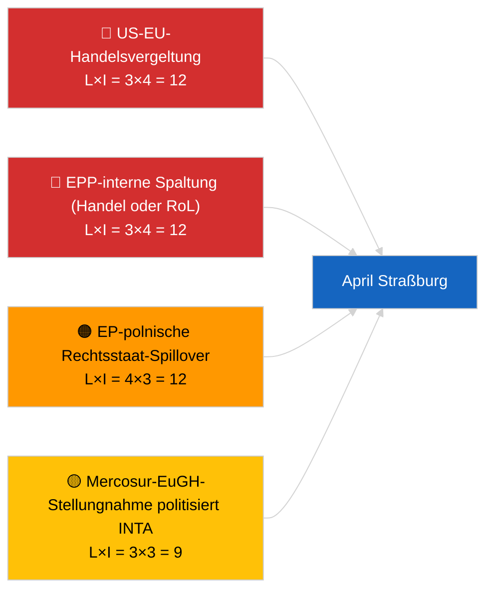
```mermaid
%%{init: {"theme":"dark"}}%%
graph LR
    R1["🔴 US-EU-Handelsvergeltung<br/>L×I = 3×4 = 12"] --> CONS["April Straßburg"]
    R2["🔴 EPP-interne Spaltung (Handel oder RoL)<br/>L×I = 3×4 = 12"] --> CONS
    R3["🟠 EP-polnische Rechtsstaat-Spillover<br/>L×I = 4×3 = 12"] --> CONS
    R4["🟡 Mercosur-EuGH-Stellungnahme politisiert INTA<br/>L×I = 3×3 = 9"] --> CONS
    style R1 fill:#D32F2F,color:#FFFFFF
    style R2 fill:#D32F2F,color:#FFFFFF
    style R3 fill:#FF9800,color:#000000
    style R4 fill:#FFC107,color:#000000
    style CONS fill:#1565C0,color:#FFFFFF
```

| Risiko | L | I | Punkte | Auslöser | Quelle | Admiralität |
|--------|:-:|:-:|:------:|---------|--------|:-----------:|
| US-EU-Handelsvergeltung | 3 | 4 | 12 | US-Gegenmitteilung | TA-10-2026-0096 | A1 |
| EPP-interne Spaltung | 3 | 4 | 12 | Sichtbare Abstimmungsdivision | Koalitionsarithmetik | A2 |
| EP-polnische Rechtsstaat-Spillover | 4 | 3 | 12 | Weiterer Immunitätsfall | TA-10-2026-0088 | A1 |
| Mercosur-Stellungnahme-Politisierung | 3 | 3 | 9 | Gericht veröffentlicht vor Plenar | TA-10-2026-0008 | A2 |
| Leere Monatsvorschau-Klassifizierung | 3 | 2 | 6 | Wiederholung ebenfalls leer 2026-04-20 | Dieser Lauf | B3 |

---

### 🔮 Wichtigster Vorwärts-Auslöser

**Straßburger Tagesordnungsveröffentlichung ~20. April 2026 (T-7).** Die Zusammensetzung der Tagesordnung wird die Drei-Szenario-Unsicherheit auflösen: handelsschwere Gewichtung (Szenario A) bestätigt die dominierende übertragene Erzählung; Rechtsstaat-Gewichtung (Szenario B) signalisiert LIBE-Momentum aus dem Braun-Präzedenzfall; wirtschaftliche/industrielle Gewichtung (Szenario C) hebt ECON- und ENVI-Dateien an.

---

### 🛡️ Quellenqualitätsbewertung

- **Primärquellen:** Offenes Datenportal des Europäischen Parlaments — Analyselauf `7f928e7c-85fd-4f76-890b-f362622c3f42`; März 2026 Inventar angenommener Texte (übertragen).
- **Datenbeschränkungen:** Der heutige Lauf produzierte 0 Akteure und ROUTINE-Signifikanz; vorausschauende Schlussfolgerung basiert auf Artikeln des Vortags und EP-Kalender, nicht auf regenerierter Szenariomodellierung.
- **Konfidenz bei Szenariowahrscheinlichkeiten:** 🟡 Mittel (qualitative Gewichtung).
- **Konfidenz bei der übertragenen Prioritätenliste:** 🟢 Hoch.

---

### 📎 Links

| Link | Pfad |
|------|------|
| Artikel | `./article.md` |
| Klassifizierung (leer) | `./classification/` |
| Geschwister-Läufe | `analysis/daily/2026-04-01/breaking/`, `committee-reports/`, `motions/`, `propositions/` |
| Quelle — März-Gesetzgebungsinventar | `analysis/daily/2026-03-10/` → `2026-03-26/` |
| Manifest | `./manifest.json` |

---

### 🔄 Querverweis

**Frühere Läufe:** Straßburg 9.–12. März und Brüsseler Mini-Plenarsitzung 25.–26. März liefern die substanzielle übertragene Basis, die von dieser Monatsvorschau verwendet wird.

**Nachfolgende Überprüfung:** Mit der Post-April-Plenar-Monatsübersicht (erwartet Anfang Mai 2026) vergleichen, um die Genauigkeit der Szenario-Prognose zu bewerten.

---

**Dokumentenkontrolle**
- **Vorlage:** `/analysis/templates/executive-brief.md`
- **Artefaktpfad:** `analysis/daily/2026-04-01/month-ahead/executive-brief.md`
- **Klassifizierung:** Öffentlich
- **Retrospektive Erstellung:** Nachfüllungssitzung.

### Executive Brief Es

### 🎯 BLUF

**Las perspectivas de abril de 2026 están ancladas en el pleno de Estrasburgo del 27 al 30 de abril y la semana preparatoria de comisiones del 13 al 17 de abril.** La ejecución del pronóstico mensual devolvió **0 actores clasificados** y puntuaciones de dimensiones **RUTINARIAS**, reflejando el primer día del Parlamento Europeo tras el receso de marzo en lugar de un pronóstico sustancial de escenarios para abril. Prioridades trasladadas a abril: ajuste del arancel aduanero de EE.UU. (TA-10-2026-0096), dictamen del TJUE sobre UE-Mercosur (pendiente), transposición de créditos de emisión HDV (TA-10-2026-0084), implementación relativa a presos políticos georgianos (TA-10-2026-0083) y repercusiones jurídicas polacas en curso del precedente de inmunidad Braun (TA-10-2026-0088). Tres escenarios de trabajo: **Escenario A — agenda con peso comercial (55%)**, **Escenario B — enfoque en el Estado de derecho (25%)**, **Escenario C — enfoque económico/industrial (20%)**. **🟡 Confianza MEDIA** — agenda de abril aún no publicada.

---

### 🧭 3 Decisiones que este informe respalda

| # | Decisión | Quién decide | Plazo | Evidencia |
|:-:|----------|------------|:-----:|-----------|
| 1 | **Editorial:** publicar como pronóstico mensual basado en escenarios con la advertencia explícita de «agenda pendiente» | Editor | +24h | Inventario trasladado; tres escenarios |
| 2 | **Seguimiento:** ciclo de inteligencia previo al pleno 13-17 de abril (semana de comisiones) | Analista | 2026-04-13 | Primeras señales sustanciales de abril |
| 3 | **Seguimiento prospectivo:** volver a ejecutar el pronóstico mensual T-7 antes del pleno (~20 de abril) con la agenda publicada | Responsable de análisis | 2026-04-20 | Confirmar la selección del escenario |

---

### 📰 Lectura de 60 Segundos

- 🔴 **No hay nuevos procedimientos ni puntos de agenda específicos de abril en el feed de hoy** — la agenda de Estrasburgo se publica típicamente T-7 días. (🟢 Alta)
- 🟠 **Tres escenarios de trabajo** para el pleno de abril, dominados por la variante con peso comercial (55%): ajuste arancelario de EE.UU., dictamen Mercosur, soberanía digital. (🟡 Media)
- 🟢 **Pista del Estado de derecho trasladada:** repercusiones del precedente Braun, implementación en Georgia, potenciales procedimientos de inmunidad adicionales (impulsados por LIBE). (🟡 Media)
- 🟡 **Variante económica/industrial:** seguimiento del informe anual del BCE (TA-10-2026-0034), resistencia de los Estados miembros a la transposición HDV. (🟡 Media)
- 🔵 **Contexto económico:** la ventana de publicación del IMF WEO de abril coincide con el pleno — las previsiones de estrés fiscal pueden colorear el debate temprano sobre el MFP. (🟢 Alta — alineación de calendarios)
- 🟣 **Referencia cruzada:** la ejecución hermana 2026-04-01/breaking documenta el patrón 6/8 de 404 en el feed consultivo que impidió que esta ejecución de pronóstico mensual produjera una nueva clasificación de actores. (🟢 Alta)
- 🩷 **Vector de perturbación:** abuso del grupo dominante (PPE 38%) marcado como ALTO por el sistema de alerta temprana — el vector más probable para una sorpresa en abril es una escisión interna del PPE sobre comercio o Estado de derecho. (🟡 Media)
- ⚪ **Traslado:** el informe «Mejor legislación» TA-10-2026-0063 establece la línea de base para el debate sobre reforma institucional para el resto de EP10.

---

### 🗂️ Principales Documentos / Procedimientos — Lista de vigilancia de abril

| Rango | Referencia PE | Título (corto) | Importancia | Confianza | Estado |
|:-----:|---------------|----------------|:-----------:|:---------:|--------|
| 1 | TA-10-2026-0096 | Ajuste del arancel aduanero de EE.UU. | 7,5 | 🟢 ALTA | Adoptado el 26 de marzo; seguimiento en abril esperado |
| 2 | TA-10-2026-0008 | Remisión UE-Mercosur al TJUE (dictamen pendiente) | 7,0 | 🟡 MEDIA | Dictamen judicial esperado antes del pleno de abril |
| 3 | TA-10-2026-0083 | Presos políticos georgianos | 6,5 | 🟢 ALTA | Informe de implementación vence |
| 4 | TA-10-2026-0088 | Inmunidad Braun (precedente para casos posteriores) | 6,5 | 🟢 ALTA | Seguimiento de vigilancia LIBE |
| 5 | TA-10-2026-0084 | Créditos de emisión HDV 2025–2029 | 6,0 | 🟢 ALTA | Transposición nacional |

---

### ⚠️ Panorama de Riesgos y Amenazas — Perspectiva de abril

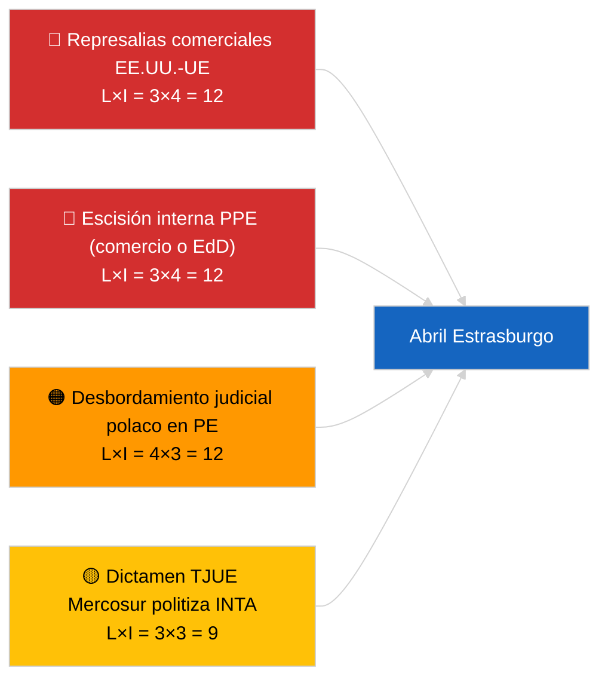
```mermaid
%%{init: {"theme":"dark"}}%%
graph LR
    R1["🔴 Represalias comerciales EE.UU.-UE<br/>L×I = 3×4 = 12"] --> CONS["Abril Estrasburgo"]
    R2["🔴 Escisión interna PPE (comercio o EdD)<br/>L×I = 3×4 = 12"] --> CONS
    R3["🟠 Desbordamiento judicial polaco en PE<br/>L×I = 4×3 = 12"] --> CONS
    R4["🟡 Dictamen TJUE Mercosur politiza INTA<br/>L×I = 3×3 = 9"] --> CONS
    style R1 fill:#D32F2F,color:#FFFFFF
    style R2 fill:#D32F2F,color:#FFFFFF
    style R3 fill:#FF9800,color:#000000
    style R4 fill:#FFC107,color:#000000
    style CONS fill:#1565C0,color:#FFFFFF
```

| Riesgo | L | I | Puntos | Desencadenante | Fuente | Almirante |
|--------|:-:|:-:|:------:|---------------|--------|:---------:|
| Represalias comerciales EE.UU.-UE | 3 | 4 | 12 | Contraanuncio de EE.UU. | TA-10-2026-0096 | A1 |
| Escisión interna PPE | 3 | 4 | 12 | División visible en la votación | Aritmética de coalición | A2 |
| Desbordamiento judicial polaco en PE | 4 | 3 | 12 | Nuevo caso de inmunidad | TA-10-2026-0088 | A1 |
| Politización del dictamen Mercosur | 3 | 3 | 9 | Tribunal publica antes del pleno | TA-10-2026-0008 | A2 |
| Clasificación vacía del pronóstico mensual | 3 | 2 | 6 | Re-ejecución también vacía 2026-04-20 | Esta ejecución | B3 |

---

### 🔮 Principal Detonante Prospectivo

**Publicación de la agenda de Estrasburgo ~20 de abril de 2026 (T-7).** La composición de la agenda resolverá la incertidumbre de los tres escenarios: la ponderación con peso comercial (Escenario A) confirma la narrativa dominante trasladada; la ponderación del Estado de derecho (Escenario B) señala el impulso de LIBE desde el precedente Braun; la ponderación económica/industrial (Escenario C) eleva los archivos de ECON y ENVI.

---

### 🛡️ Evaluación de la Calidad de las Fuentes

- **Fuentes primarias:** Portal de datos abiertos del Parlamento Europeo — ejecución de análisis `7f928e7c-85fd-4f76-890b-f362622c3f42`; inventario de textos adoptados de marzo 2026 (trasladado).
- **Limitaciones de datos:** La ejecución de hoy produjo 0 actores y significación RUTINARIA; la inferencia prospectiva está anclada en artículos del día anterior y el calendario del PE, no en modelización de escenarios regenerada.
- **Confianza en las probabilidades de escenarios:** 🟡 Media (ponderación cualitativa).
- **Confianza en la lista de prioridades trasladada:** 🟢 Alta.

---

### 📎 Enlaces

| Enlace | Ruta |
|--------|------|
| Artículo | `./article.md` |
| Clasificación (vacío) | `./classification/` |
| Ejecuciones hermanas | `analysis/daily/2026-04-01/breaking/`, `committee-reports/`, `motions/`, `propositions/` |
| Fuente — inventario legislativo de marzo | `analysis/daily/2026-03-10/` → `2026-03-26/` |
| Manifiesto | `./manifest.json` |

---

### 🔄 Referencia Cruzada

**Ejecuciones anteriores:** Estrasburgo 9–12 de marzo y la mini-sesión plenaria de Bruselas 25–26 de marzo proporcionan la base trasladada sustancial utilizada por este pronóstico mensual.

**Verificación posterior:** Comparar con la revisión mensual posterior al pleno de abril (esperada a principios de mayo de 2026) para calificar la precisión del pronóstico de escenarios.

---

**Control del documento**
- **Plantilla:** `/analysis/templates/executive-brief.md`
- **Ruta de artefacto:** `analysis/daily/2026-04-01/month-ahead/executive-brief.md`
- **Clasificación:** Público
- **Generación retrospectiva:** Sesión de relleno.

### Executive Brief Fi

### 🎯 BLUF

**Huhtikuun 2026 näkymät perustuvat Strasbourgin täysistuntoon 27.–30. huhtikuuta ja valmistavaan valiokuntaviikkoon 13.–17. huhtikuuta.** Kuukauden eteenpäin -ajo palautti **0 luokiteltua toimijaa** ja **RUTIINITASON** ulottuvuuspisteytykset, mikä heijastaa Euroopan parlamentin ensimmäistä päivää maaliskuun tauon jälkeen eikä tarjoa merkittävää huhtikuun skenaarioennustetta. Huhtikuulle siirtyvät prioriteetit: Yhdysvaltojen tullitariffin sopeuttaminen (TA-10-2026-0096), EU–Mercosur EY-tuomioistuimen lausunto (odottaa), HDV-päästökredittien täytäntöönpano (TA-10-2026-0084), Georgian poliittisten vankien täytäntöönpano (TA-10-2026-0083) ja Braun-immuniteettipresedenttiin liittyvät Puola-oikeudelliset jälkivaikutukset (TA-10-2026-0088). Kolme työskentelyskenaariota: **Skenaario A — kauppapainotteinen ohjelma (55%)**, **Skenaario B — oikeusvaltiofokus (25%)**, **Skenaario C — taloudellinen/teollinen fokus (20%)**. **🟡 KESKITASON luottamus** — huhtikuun ohjelma ei vielä julkaistu.

---

### 🧭 3 Päätöstä, joita tämä tiiviistelmä tukee

| # | Päätös | Kuka päättää | Määräaika | Näyttö |
|:-:|--------|-------------|:---------:|--------|
| 1 | **Toimituksellinen:** julkaise skenaariovetoinen kuukauden eteenpäin -katsaus, jossa on nimenomainen "ohjelma odottaa"-varauma | Päätoimittaja | +24h | Siirtyvä inventaari; kolme skenaariota |
| 2 | **Seuranta:** täysistuntoa edeltävä tiedustelusykli 13.–17. huhtikuuta (valiokuntaviikko) | Analyytikko | 2026-04-13 | Ensimmäiset merkittävät huhtikuun signaalit |
| 3 | **Eteenpäin katsova seuranta:** aja kuukauden eteenpäin uudelleen T-7 täysistuntoon (~20. huhtikuuta) julkaistun ohjelman kanssa | Analyysipäällikkö | 2026-04-20 | Vahvista skenaarion valinta |

---

### 📰 60 Sekunnin Katsaus

- 🔴 **Ei uusia huhtikuuspesifisiä menettelyjä tai esityslistapisteitä tämän päivän syötteessä** — Strasbourgin ohjelma julkaistaan tyypillisesti T-7 päivää. (🟢 Korkea)
- 🟠 **Kolme työskentelyskenaariota** huhtikuun täysistunnolle, johon kauppapainotteinen variantti (55%) dominoi: Yhdysvaltojen tullisopeuttaminen, Mercosur-lausunto, digitaalinen suvereniteetti. (🟡 Keskitaso)
- 🟢 **Siirtyvä oikeusvaltiospori:** Braun-presedenttien jälkivaikutukset, Georgian täytäntöönpano, mahdolliset lisäimmuniteettimenettelyt (LIBE-vetoinen). (🟡 Keskitaso)
- 🟡 **Taloudellinen/teollinen variantti:** EKP:n vuosiraportin seuranta (TA-10-2026-0034), HDV-täytäntöönpanomuutosvastarinta jäsenvaltioilta. (🟡 Keskitaso)
- 🔵 **Taloudellinen konteksti:** IMF huhtikuun WEO-julkaisuikkuna osuu yhteen täysistunnon kanssa — julkisen talouden stressiennusteet voivat värittää varhaista MFF-keskustelua. (🟢 Korkea — kalenterijohdonmukaisuus)
- 🟣 **Ristiviite:** sisarajo 2026-04-01/breaking dokumentoi 6/8 404-virhemallin neuvontasyötteessä, joka esti tätä kuukauden eteenpäin -ajoa tuottamasta uutta toimijaluokittelua. (🟢 Korkea)
- 🩷 **Häiriövektori:** hallitsevan ryhmän ylivalta (PPE 38%) merkitty KORKEAKSI varhaisvaroitusjärjestelmässä — todennäköisin vektori huhtikuun yllätykselle on EPP-sisäinen jakautuminen kaupasta tai oikeusvaltiosta. (🟡 Keskitaso)
- ⚪ **Siirtäminen eteenpäin:** Parempi lainsäädäntö -raportti TA-10-2026-0063 asettaa institutionaalisen uudistuskeskustelun peruslinjat loppuun EP10.

---

### 🗂️ Tärkeimmät Asiakirjat / Menettelyt — Huhtikuun Seurantalista

| Sija | EP-viite | Otsikko (lyhyt) | Merkittävyys | Luottamustaso | Tila |
|:----:|----------|-----------------|:------------:|:-------------:|------|
| 1 | TA-10-2026-0096 | Yhdysvaltojen tullitariffin sopeuttaminen | 7,5 | 🟢 KORKEA | Hyväksytty 26. maaliskuuta; huhtikuun seuranta odotettavissa |
| 2 | TA-10-2026-0008 | EU–Mercosur EY-tuomioistuimen lähettäminen (odottaa lausuntoa) | 7,0 | 🟡 KESKITASO | Tuomioistuinlausunto odotettavissa ennen huhtikuun täysistuntoa |
| 3 | TA-10-2026-0083 | Georgian poliittiset vangit | 6,5 | 🟢 KORKEA | Täytäntöönpanoraportointi erääntyy |
| 4 | TA-10-2026-0088 | Braun-immuniteetti (ennakkotapaus myöhemmille asioille) | 6,5 | 🟢 KORKEA | LIBE-jatkoseuranta |
| 5 | TA-10-2026-0084 | HDV-päästökreditit 2025–2029 | 6,0 | 🟢 KORKEA | Kansallinen täytäntöönpano |

---

### ⚠️ Riski- ja Uhka-analyysi — Huhtikuun Näkymä

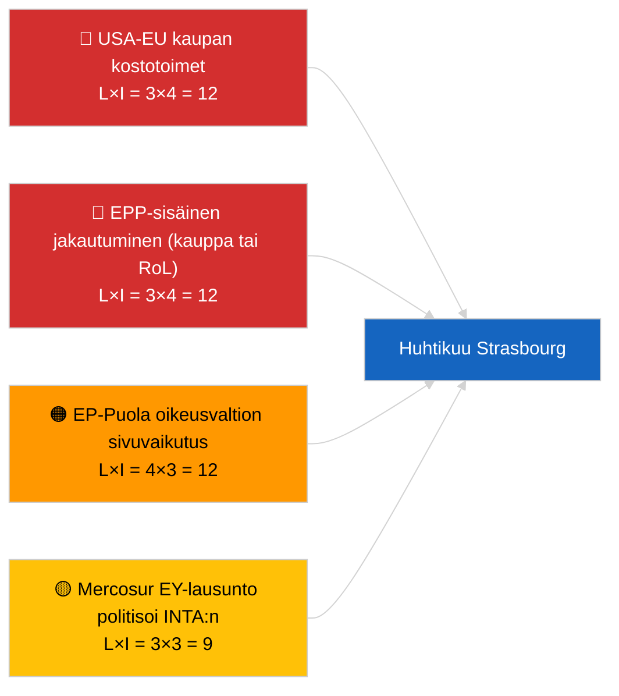
```mermaid
%%{init: {"theme":"dark"}}%%
graph LR
    R1["🔴 USA-EU kaupan kostotoimet<br/>L×I = 3×4 = 12"] --> CONS["Huhtikuu Strasbourg"]
    R2["🔴 EPP-sisäinen jakautuminen (kauppa tai RoL)<br/>L×I = 3×4 = 12"] --> CONS
    R3["🟠 EP-Puola oikeusvaltion sivuvaikutus<br/>L×I = 4×3 = 12"] --> CONS
    R4["🟡 Mercosur EY-lausunto politisoi INTA:n<br/>L×I = 3×3 = 9"] --> CONS
    style R1 fill:#D32F2F,color:#FFFFFF
    style R2 fill:#D32F2F,color:#FFFFFF
    style R3 fill:#FF9800,color:#000000
    style R4 fill:#FFC107,color:#000000
    style CONS fill:#1565C0,color:#FFFFFF
```

| Riski | L | I | Pisteet | Laukaisin | Lähde | Admiraliteetti |
|-------|:-:|:-:|:-------:|-----------|-------|:--------------:|
| USA-EU kaupan kostotoimet | 3 | 4 | 12 | Yhdysvaltojen vastainen ilmoitus | TA-10-2026-0096 | A1 |
| EPP-sisäinen jakautuminen | 3 | 4 | 12 | Näkyvä äänestysjako | Koalitioaritmetiikka | A2 |
| EP-Puola oikeusvaltion sivuvaikutus | 4 | 3 | 12 | Lisäimmuniteettitapaus | TA-10-2026-0088 | A1 |
| Mercosur-lausunnon politisoituminen | 3 | 3 | 9 | Tuomioistuin julkaisee ennen täysistuntoa | TA-10-2026-0008 | A2 |
| Tyhjä kuukauden eteenpäin -luokittelu | 3 | 2 | 6 | Uusinta myös tyhjä 2026-04-20 | Tämä ajo | B3 |

---

### 🔮 Tärkein Ennakoiva Laukaisin

**Strasbourgin ohjelmanjulkaisu ~20. huhtikuuta 2026 (T-7).** Ohjelman kokoonpano ratkaisee kolmen skenaarion epävarmuuden: kauppapainotteinen painotus (Skenaario A) vahvistaa hallitsevan siirtyvän narratiivin; oikeusvaltion painotus (Skenaario B) signaloi LIBE-momentumia Braun-presedenttistä; taloudellinen/teollinen painotus (Skenaario C) nostaa ECON- ja ENVI-tiedostoja.

---

### 🛡️ Lähteen Laadun Arviointi

- **Ensisijaiset lähteet:** Euroopan parlamentin avoin dataportti — analyysiajoajo `7f928e7c-85fd-4f76-890b-f362622c3f42`; maaliskuun 2026 hyväksyttyjen tekstien inventaario (siirretty).
- **Tietorajoitukset:** Tämän päivän ajo tuotti 0 toimijaa ja RUTIINITASON merkittävyyden; eteenpäin katsova päättely perustuu edellisen päivän artikkeleihin ja EP:n kalenteriin, ei uudelleen luotuun skenaariomallinnukseen.
- **Luottamus skenaarioprobabiiliteetteihin:** 🟡 Keskitaso (laadullinen painotus).
- **Luottamus siirrettyyn prioriteettilistaan:** 🟢 Korkea.

---

### 📎 Linkit

| Linkki | Polku |
|--------|-------|
| Artikkeli | `./article.md` |
| Luokittelu (tyhjä) | `./classification/` |
| Sisa-ajot | `analysis/daily/2026-04-01/breaking/`, `committee-reports/`, `motions/`, `propositions/` |
| Lähde — maaliskuun lainsäädäntöinventaario | `analysis/daily/2026-03-10/` → `2026-03-26/` |
| Manifesti | `./manifest.json` |

---

### 🔄 Ristiviite

**Aiemmat ajot:** Strasbourg 9.–12. maaliskuuta ja Bryssel mini-täysistunto 25.–26. maaliskuuta tarjoavat tämän kuukauden eteenpäin -katsauksen käyttämän merkittävän siirtyvän perustan.

**Myöhempi vahvistus:** Vertaa post-huhtikuun täysistunnon kuukausikatsaukseen (odotetaan toukokuun alussa 2026) arvioidaksesi skenaarion ennusteen tarkkuuden.

---

**Asiakirjavalvonta**
- **Malli:** `/analysis/templates/executive-brief.md`
- **Artefaktipolku:** `analysis/daily/2026-04-01/month-ahead/executive-brief.md`
- **Luokittelu:** Julkinen
- **Retrospektiivinen luominen:** Täyttö-sessio.

### Executive Brief Fr

### 🎯 BLUF

**Les perspectives d'avril 2026 sont ancrées sur la session plénière de Strasbourg du 27 au 30 avril et la semaine préparatoire des commissions du 13 au 17 avril.** L'exécution des prévisions mensuelles a renvoyé **0 acteur classifié** et des scores de dimensions **ROUTINIÈRES**, reflétant le premier jour du Parlement européen après la pause de mars plutôt qu'une prévision substantielle de scénario pour avril. Priorités reportées en avril : ajustement du tarif douanier américain (TA-10-2026-0096), avis de la CJUE sur EU-Mercosur (en attente), transposition des crédits d'émission HDV (TA-10-2026-0084), mise en œuvre relative aux prisonniers politiques géorgiens (TA-10-2026-0083) et répercussions juridiques polonaises en cours du précédent d'immunité Braun (TA-10-2026-0088). Trois scénarios de travail : **Scénario A — programme axé sur le commerce (55%)**, **Scénario B — accent sur l'État de droit (25%)**, **Scénario C — accent économique/industriel (20%)**. **🟡 Confiance MOYENNE** — programme d'avril pas encore publié.

---

### 🧭 3 Décisions que cette note soutient

| # | Décision | Qui décide | Échéance | Preuves |
|:-:|----------|-----------|:--------:|---------|
| 1 | **Éditorial :** publier comme prévision mensuelle axée sur des scénarios avec une mise en garde explicite « programme en attente » | Rédacteur | +24h | Inventaire reporté ; trois scénarios |
| 2 | **Surveillance :** cycle de renseignement pré-plénier 13–17 avril (semaine de commission) | Analyste | 2026-04-13 | Premiers signaux substantiels d'avril |
| 3 | **Surveillance prospective :** relancer les prévisions mensuelles à T-7 avant le plénier (~20 avril) avec le programme publié | Responsable analyse | 2026-04-20 | Confirmer la sélection du scénario |

---

### 📰 Lecture en 60 Secondes

- 🔴 **Aucune nouvelle procédure ou point d'ordre du jour spécifique à avril dans le flux d'aujourd'hui** — le programme de Strasbourg est généralement publié à T-7 jours. (🟢 Élevée)
- 🟠 **Trois scénarios de travail** pour la session plénière d'avril, dominés par la variante axée sur le commerce (55%) : ajustement douanier américain, avis Mercosur, souveraineté numérique. (🟡 Moyen)
- 🟢 **Piste État de droit reportée :** répercussions du précédent Braun, mise en œuvre Géorgie, procédures d'immunité supplémentaires potentielles (axées sur LIBE). (🟡 Moyen)
- 🟡 **Variante économique/industrielle :** suivi du rapport annuel de la BCE (TA-10-2026-0034), résistance des États membres à la transposition HDV. (🟡 Moyen)
- 🔵 **Contexte économique :** la fenêtre de publication du IMF WEO d'avril coïncide avec la session plénière — les prévisions de stress budgétaire pourraient teinter le début du débat sur le CFP. (🟢 Élevée — alignement calendaire)
- 🟣 **Référence croisée :** l'exécution sœur 2026-04-01/breaking documente le schéma 6/8 404 dans le flux consultatif qui a empêché cette exécution de prévision mensuelle de produire une nouvelle classification d'acteurs. (🟢 Élevée)
- 🩷 **Vecteur de perturbation :** abus du groupe dominant (PPE 38%) signalé comme ÉLEVÉ par le système d'alerte précoce — le vecteur le plus probable pour une surprise en avril est une scission interne au PPE sur le commerce ou l'État de droit. (🟡 Moyen)
- ⚪ **Report :** le rapport « Mieux légiférer » TA-10-2026-0063 établit la base du débat sur la réforme institutionnelle pour le reste d'EP10.

---

### 🗂️ Top Documents / Procédures — Liste de surveillance d'avril

| Rang | Référence PE | Titre (court) | Importance | Confiance | Statut |
|:----:|--------------|---------------|:----------:|:---------:|--------|
| 1 | TA-10-2026-0096 | Ajustement du tarif douanier américain | 7,5 | 🟢 ÉLEVÉE | Adopté le 26 mars ; suivi en avril attendu |
| 2 | TA-10-2026-0008 | Renvoi UE-Mercosur à la CJUE (avis en attente) | 7,0 | 🟡 MOYEN | Avis judiciaire attendu avant le plénier d'avril |
| 3 | TA-10-2026-0083 | Prisonniers politiques géorgiens | 6,5 | 🟢 ÉLEVÉE | Rapport de mise en œuvre à remettre |
| 4 | TA-10-2026-0088 | Immunité Braun (précédent pour les affaires ultérieures) | 6,5 | 🟢 ÉLEVÉE | Surveillance de suivi LIBE |
| 5 | TA-10-2026-0084 | Crédits d'émission HDV 2025–2029 | 6,0 | 🟢 ÉLEVÉE | Transposition nationale |

---

### ⚠️ Aperçu des Risques et Menaces — Perspectives d'avril

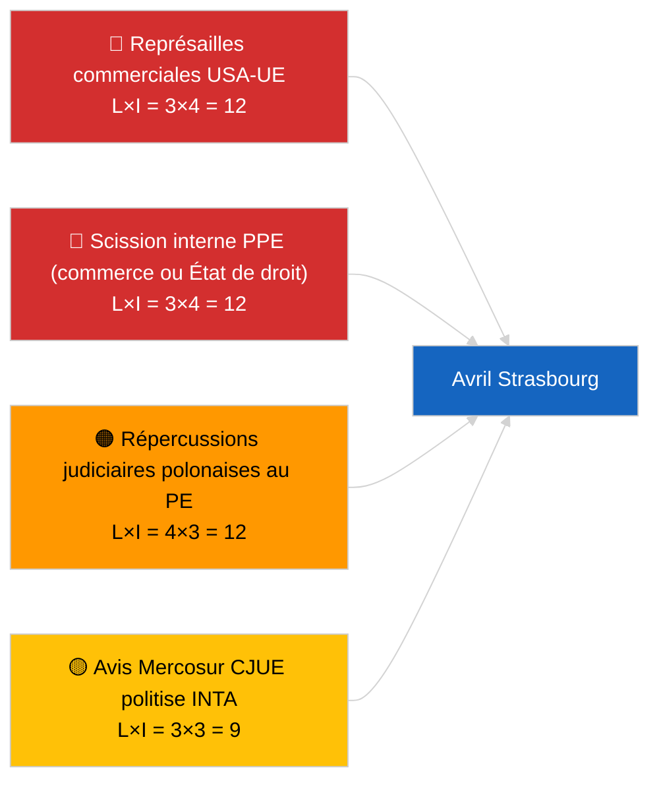
```mermaid
%%{init: {"theme":"dark"}}%%
graph LR
    R1["🔴 Représailles commerciales USA-UE<br/>L×I = 3×4 = 12"] --> CONS["Avril Strasbourg"]
    R2["🔴 Scission interne PPE (commerce ou État de droit)<br/>L×I = 3×4 = 12"] --> CONS
    R3["🟠 Répercussions judiciaires polonaises au PE<br/>L×I = 4×3 = 12"] --> CONS
    R4["🟡 Avis Mercosur CJUE politise INTA<br/>L×I = 3×3 = 9"] --> CONS
    style R1 fill:#D32F2F,color:#FFFFFF
    style R2 fill:#D32F2F,color:#FFFFFF
    style R3 fill:#FF9800,color:#000000
    style R4 fill:#FFC107,color:#000000
    style CONS fill:#1565C0,color:#FFFFFF
```

| Risque | L | I | Score | Déclencheur | Source | Admirauté |
|--------|:-:|:-:|:-----:|-------------|--------|:---------:|
| Représailles commerciales USA-UE | 3 | 4 | 12 | Contre-annonce américaine | TA-10-2026-0096 | A1 |
| Scission interne PPE | 3 | 4 | 12 | Division visible lors du vote | Arithmétique de coalition | A2 |
| Répercussions judiciaires polonaises au PE | 4 | 3 | 12 | Nouvelle affaire d'immunité | TA-10-2026-0088 | A1 |
| Politisation de l'avis Mercosur | 3 | 3 | 9 | Tribunal publie avant le plénier | TA-10-2026-0008 | A2 |
| Classification vide des prévisions mensuelles | 3 | 2 | 6 | Nouvelle exécution également vide 2026-04-20 | Cette exécution | B3 |

---

### 🔮 Principal Déclencheur Prospectif

**Publication du programme de Strasbourg ~20 avril 2026 (T-7).** La composition du programme résoudra l'incertitude des trois scénarios : une pondération axée sur le commerce (Scénario A) confirme le récit dominant reporté ; une pondération axée sur l'État de droit (Scénario B) signale l'élan du LIBE depuis le précédent Braun ; une pondération économique/industrielle (Scénario C) met en avant les dossiers ECON et ENVI.

---

### 🛡️ Évaluation de la Qualité des Sources

- **Sources primaires :** Portail de données ouvertes du Parlement européen — exécution d'analyse `7f928e7c-85fd-4f76-890b-f362622c3f42` ; inventaire des textes adoptés de mars 2026 (reporté).
- **Limites des données :** L'exécution d'aujourd'hui a produit 0 acteur et une signification ROUTINIÈRE ; l'inférence prospective est ancrée sur les articles du jour précédent et le calendrier du PE, et non sur une modélisation de scénarios régénérée.
- **Confiance dans les probabilités de scénarios :** 🟡 Moyen (pondération qualitative).
- **Confiance dans la liste de priorités reportée :** 🟢 Élevée.

---

### 📎 Liens

| Lien | Chemin |
|------|--------|
| Article | `./article.md` |
| Classification (vide) | `./classification/` |
| Exécutions sœurs | `analysis/daily/2026-04-01/breaking/`, `committee-reports/`, `motions/`, `propositions/` |
| Source — inventaire législatif de mars | `analysis/daily/2026-03-10/` → `2026-03-26/` |
| Manifeste | `./manifest.json` |

---

### 🔄 Référence Croisée

**Exécutions précédentes :** Strasbourg 9–12 mars et la mini-session plénière de Bruxelles 25–26 mars fournissent la base reportée substantielle utilisée par cette prévision mensuelle.

**Vérification ultérieure :** Comparer avec la revue mensuelle post-session plénière d'avril (attendue début mai 2026) pour évaluer la précision des prévisions de scénarios.

---

**Contrôle du document**
- **Modèle :** `/analysis/templates/executive-brief.md`
- **Chemin d'artefact :** `analysis/daily/2026-04-01/month-ahead/executive-brief.md`
- **Classification :** Public
- **Génération rétrospective :** Session de remplissage.

### Executive Brief He

**סיווג:** OSINT | רשומה פרלמנטרית ציבורית
**רמת ביטחון:** 🟡 בינוני (צופה פני עתיד; פלט סיווג ריק מגביל את העומק)
**נוצר:** 2026-04-01T00:00:00Z (תקציר רטרוספקטיבי)
**סוג מאמר:** החודש הקרוב
**מזהה הרצה:** `7f928e7c-85fd-4f76-890b-f362622c3f42`
**מקור:** פורטל הנתונים הפתוח של הפרלמנט האירופי

---

### 🎯 BLUF

**תחזיות אפריל 2026 מעוגנות במושב המליאה בסטרסבורג בין 27 ל-30 באפריל ובשבוע הוועדות ההכנתי בין 13 ל-17 באפריל.** הרצת תחזיות החודש הקרוב החזירה **0 שחקנים מסווגים** וציוני ממדים **שגרתיים**, המשקפים את יומו הראשון של הפרלמנט האירופי לאחר הפסקת מרץ ולא תחזית תרחיש מהותית לאפריל. עדיפויות שהועברו לאפריל: התאמת המכס האמריקאי (TA-10-2026-0096), חוות דעת בית המשפט האירופי לצדק בנושא EU-Mercosur (ממתינה), השתלת זיכויי פליטת HDV (TA-10-2026-0084), יישום החלטות אסירים פוליטיים גיאורגיים (TA-10-2026-0083), והשלכות משפטיות פולניות מתמשכות מתקדים חסינות בראון (TA-10-2026-0088). שלושה תרחישי עבודה: **תרחיש א' — סדר יום כבד סחר (55%)**, **תרחיש ב' — דגש על שלטון החוק (25%)**, **תרחיש ג' — דגש כלכלי/תעשייתי (20%)**. **🟡 ביטחון בינוני** — סדר יום אפריל טרם פורסם.

---

### 🧭 3 החלטות שתקציר זה תומך בהן

| # | החלטה | מי מחליט | מועד אחרון | ראיות |
|:-:|-------|---------|:---------:|-------|
| 1 | **עריכה:** פרסם כתחזית חודשית מבוססת תרחישים עם אזהרה מפורשת "סדר יום ממתין" | עורך | +24 שעות | מלאי מועבר; שלושה תרחישים |
| 2 | **מעקב:** מחזור מודיעין טרום-מליאה 13-17 באפריל (שבוע ועדות) | אנליסט | 2026-04-13 | אותות אפריל מהותיים ראשונים |
| 3 | **מעקב צופה פני עתיד:** הפעל מחדש תחזיות חודש קרוב T-7 לפני מליאה (~20 באפריל) עם סדר יום מפורסם | ראש ניתוח | 2026-04-20 | אשר בחירת תרחיש |

---

### 📰 קריאה של 60 שניות

- 🔴 **אין הליכים חדשים ספציפיים לאפריל או נקודות סדר יום בזרם היום** — סדר היום של סטרסבורג מתפרסם בדרך כלל T-7 ימים. (🟢 גבוה)
- 🟠 **שלושה תרחישי עבודה** למליאת אפריל, בשליטת הגרסה הכבדה-סחר (55%): התאמת מכס אמריקאי, חוות דעת Mercosur, ריבונות דיגיטלית. (🟡 בינוני)
- 🟢 **מסלול שלטון חוק מועבר:** השלכות תקדים בראון, יישום גיאורגיה, הליכי חסינות נוספים אפשריים (מונע על-ידי LIBE). (🟡 בינוני)
- 🟡 **גרסה כלכלית/תעשייתית:** מעקב אחר דוח שנתי של ה-ECB (TA-10-2026-0034), התנגדות מדינות חברות להשתלת HDV. (🟡 בינוני)
- 🔵 **הקשר כלכלי:** חלון פרסום IMF WEO של אפריל עולה בקנה אחד עם מושב המליאה — תחזיות לחץ פיסקלי עשויות לצבוע את הוויכוח המוקדם על ה-MFF. (🟢 גבוה — יישור לוח שנה)
- 🟣 **הפניה צולבת:** הרצת האח 2026-04-01/breaking מתעדת את דפוס שגיאות 404 ב-6/8 מהזרמים הייעוציים שמנעה מהרצת תחזיות זו לייצר סיווג שחקנים חדש. (🟢 גבוה)
- 🩷 **וקטור שיבוש:** שליטת קבוצה דומיננטית (PPE 38%) סומנה כגבוהה על-ידי מערכת האזהרה המוקדמת — הוקטור הסביר ביותר להפתעת אפריל הוא פיצול פנימי ב-EPP בנושא סחר או שלטון חוק. (🟡 בינוני)
- ⚪ **העברה:** דוח "חקיקה טובה יותר" TA-10-2026-0063 קובע את בסיס הדיון לרפורמה מוסדית לשאר EP10.

---

### 🗂️ מסמכים / הליכים מרכזיים — רשימת מעקב אפריל

| דרגה | הפניה לפרלמנט האירופי | כותרת (קצרה) | חשיבות | ביטחון | מצב |
|:----:|----------------------|--------------|:------:|:------:|-----|
| 1 | TA-10-2026-0096 | התאמת מכס אמריקאי | 7.5 | 🟢 גבוה | אושר 26 במרץ; מעקב אפריל צפוי |
| 2 | TA-10-2026-0008 | הפניית EU-Mercosur לבית משפט (חוות דעת ממתינה) | 7.0 | 🟡 בינוני | חוות דעת שיפוטית צפויה לפני מליאת אפריל |
| 3 | TA-10-2026-0083 | אסירים פוליטיים גיאורגיים | 6.5 | 🟢 גבוה | דיווח יישום מגיע |
| 4 | TA-10-2026-0088 | חסינות בראון (תקדים לתיקים עוקבים) | 6.5 | 🟢 גבוה | מעקב LIBE |
| 5 | TA-10-2026-0084 | זיכויי פליטת HDV 2025–2029 | 6.0 | 🟢 גבוה | השתלה לאומית |

---

### ⚠️ סקירת סיכונים ואיומים — תחזית אפריל

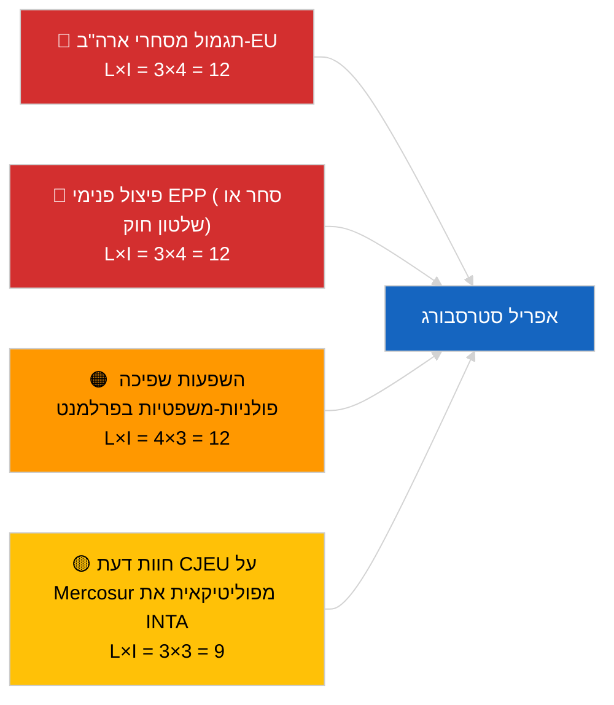
```mermaid
%%{init: {"theme":"dark"}}%%
graph LR
    R1["🔴 תגמול מסחרי ארה&quot;ב-EU<br/>L×I = 3×4 = 12"] --> CONS["אפריל סטרסבורג"]
    R2["🔴 פיצול פנימי EPP (סחר או שלטון חוק)<br/>L×I = 3×4 = 12"] --> CONS
    R3["🟠 השפעות שפיכה פולניות-משפטיות בפרלמנט<br/>L×I = 4×3 = 12"] --> CONS
    R4["🟡 חוות דעת CJEU על Mercosur מפוליטיקאית את INTA<br/>L×I = 3×3 = 9"] --> CONS
    style R1 fill:#D32F2F,color:#FFFFFF
    style R2 fill:#D32F2F,color:#FFFFFF
    style R3 fill:#FF9800,color:#000000
    style R4 fill:#FFC107,color:#000000
    style CONS fill:#1565C0,color:#FFFFFF
```

| סיכון | L | I | ציון | מפעיל | מקור | אדמירליות |
|-------|:-:|:-:|:----:|-------|------|:---------:|
| תגמול מסחרי ארה"ב-EU | 3 | 4 | 12 | הודעת נגד אמריקאית | TA-10-2026-0096 | A1 |
| פיצול פנימי EPP | 3 | 4 | 12 | חלוקת הצבעה גלויה | אריתמטיקת קואליציה | A2 |
| השפעות שפיכה פולניות-משפטיות בפרלמנט | 4 | 3 | 12 | תיק חסינות נוסף | TA-10-2026-0088 | A1 |
| פוליטיזציה של חוות דעת Mercosur | 3 | 3 | 9 | בית משפט מפרסם לפני מליאה | TA-10-2026-0008 | A2 |
| סיווג תחזית חודשית ריק | 3 | 2 | 6 | הרצה חוזרת גם ריקה 2026-04-20 | הרצה זו | B3 |

---

### 🔮 הגורם המניע המרכזי לעתיד

**פרסום סדר יום סטרסבורג ~20 באפריל 2026 (T-7).** הרכב סדר היום יפתור את אי-הוודאות בין שלושת התרחישים: משקל כבד-סחר (תרחיש א') מאשר את הנרטיב הדומיננטי המועבר; משקל שלטון חוק (תרחיש ב') מסמן מומנטום LIBE מתקדים בראון; משקל כלכלי/תעשייתי (תרחיש ג') מרים קבצי ECON ו-ENVI.

---

### 🛡️ הערכת איכות המקורות

- **מקורות ראשיים:** פורטל הנתונים הפתוח של הפרלמנט האירופי — הרצת ניתוח `7f928e7c-85fd-4f76-890b-f362622c3f42`; מלאי טקסטים שאושרו ממרץ 2026 (מועבר).
- **מגבלות נתונים:** הרצת היום הניבה 0 שחקנים ומשמעות שגרתית; ההיסק הצופה פני עתיד מעוגן במאמרים של היום הקודם ובלוח השנה של הפרלמנט, לא בדוגמנות תרחישים שנוצרה מחדש.
- **ביטחון בהסתברויות תרחיש:** 🟡 בינוני (שקלול איכותי).
- **ביטחון ברשימת עדיפויות מועברת:** 🟢 גבוה.

---

### 📎 קישורים

| קישור | נתיב |
|-------|------|
| מאמר | `./article.md` |
| סיווג (ריק) | `./classification/` |
| הרצות אחיות | `analysis/daily/2026-04-01/breaking/`, `committee-reports/`, `motions/`, `propositions/` |
| מקור — מלאי חקיקה מרץ | `analysis/daily/2026-03-10/` → `2026-03-26/` |
| מניפסט | `./manifest.json` |

---

### 🔄 הפניה צולבת

**הרצות קודמות:** סטרסבורג 9-12 במרץ ומליאת בריסל המיני 25-26 במרץ מספקות את הבסיס המהותי המועבר המשמש תחזית חודש זה.

**אימות עוקב:** השווה עם סקירת ה-post-אפריל-מליאה הכללית (צפויה לתחילת מאי 2026) כדי לדרג את דיוק תחזית התרחיש.

---

**בקרת מסמכים**
- **תבנית:** `/analysis/templates/executive-brief.md`
- **נתיב פריט:** `analysis/daily/2026-04-01/month-ahead/executive-brief.md`
- **סיווג:** ציבורי
- **יצירה רטרוספקטיבית:** סשן מילוי לאחור.

### Executive Brief Ja

**分類：** OSINT | 公開議会記録
**信頼度：** 🟡 中程度（将来予測；分類出力が空のため深度が制限される）
**生成日：** 2026-04-01T00:00:00Z（遡及的ブリーフ）
**記事タイプ：** 来月展望
**実行ID：** `7f928e7c-85fd-4f76-890b-f362622c3f42`
**出典：** 欧州議会オープンデータポータル

---

### 🎯 BLUF

**2026年4月の見通しは、4月27〜30日のストラスブール本会議および4月13〜17日の準備委員会週を中心に据えられている。** 月間先行実行では**分類済み行為者0名**と**ルーティン**の次元スコアが返り、3月休会明けの欧州議会初日を反映するに留まり、実質的な4月シナリオ予測は提供されていない。4月への引き継ぎ優先事項：米国関税調整（TA-10-2026-0096）、EU・メルコスールECJ意見（保留中）、HDV排出クレジット移行（TA-10-2026-0084）、グルジア政治犯の実施（TA-10-2026-0083）、ブラウン免責先例（TA-10-2026-0088）に起因するポーランド司法の余波。3つの作業シナリオ：**シナリオA — 貿易重視の議題（55%）**、**シナリオB — 法の支配重視（25%）**、**シナリオC — 経済・産業重視（20%）**。**🟡 中程度の信頼度** — 4月議題未公表。

---

### 🧭 このブリーフが支援する3つの意思決定

| # | 意思決定 | 決定者 | 期限 | 根拠 |
|:-:|---------|--------|:----:|------|
| 1 | **編集：**「議題保留」の明示的注記付きでシナリオ主導の月間先行予測として発行する | 編集長 | +24時間 | 引き継ぎ台帳；3シナリオ |
| 2 | **モニタリング：** 4月13〜17日（委員会週）の本会議前情報サイクル | アナリスト | 2026-04-13 | 最初の実質的4月シグナル |
| 3 | **将来監視：** 公表済み議題を用いてT-7（〜4月20日）頃に月間先行実行を再実行する | 分析責任者 | 2026-04-20 | シナリオ選択の確認 |

---

### 📰 60秒読み

- 🔴 **本日のフィードに4月固有の新しい手続きや議題はなし** — ストラスブール議題は通常T-7日に公表される。（🟢 高）
- 🟠 **3つの作業シナリオ**：4月本会議は貿易重視型（55%）が支配。米国関税調整、メルコスール意見、デジタル主権。（🟡 中程度）
- 🟢 **引き継ぎ法の支配トラック：** ブラウン先例の余波、グルジア実施、追加免責手続きの可能性（LIBE主導）。（🟡 中程度）
- 🟡 **経済・産業型：** ECB年次報告フォローアップ（TA-10-2026-0034）、HDV移行に対する加盟国の抵抗。（🟡 中程度）
- 🔵 **経済文脈：** IMF 4月 WEO公表ウィンドウが本会議と重なる — 財政ストレス予測がMFF初期議論に影響する可能性。（🟢 高 — カレンダー整合）
- 🟣 **相互参照：** 2026-04-01/breakingの兄弟実行が助言フィードの6/8件の404パターンを文書化しており、この月間先行実行が新規行為者分類を生成できなかった原因となっている。（🟢 高）
- 🩷 **混乱ベクター：** 支配グループの独走（PPE 38%）が早期警告システムにより高と判定 — 4月の予想外展開で最も可能性が高いのはEPP内部における貿易または法の支配を巡る分裂。（🟡 中程度）
- ⚪ **繰り越し：** 「よりよい立法」報告書 TA-10-2026-0063 がEP10残り期間の制度改革議論のベースラインを設定。

---

### 🗂️ 主要文書・手続き — 4月ウォッチリスト

| 順位 | EP参照 | タイトル（短縮） | 重要度 | 信頼度 | 状態 |
|:----:|--------|----------------|:------:|:------:|------|
| 1 | TA-10-2026-0096 | 米国関税調整 | 7.5 | 🟢 高 | 3月26日採択済；4月フォローアップ見込み |
| 2 | TA-10-2026-0008 | EU・メルコスールECJ付託（意見保留中） | 7.0 | 🟡 中程度 | 4月本会議前に司法意見見込み |
| 3 | TA-10-2026-0083 | グルジア政治犯 | 6.5 | 🟢 高 | 実施報告期限到来 |
| 4 | TA-10-2026-0088 | ブラウン免責（後続案件の先例） | 6.5 | 🟢 高 | LIBEフォローアップ監視 |
| 5 | TA-10-2026-0084 | HDV排出クレジット2025〜2029 | 6.0 | 🟢 高 | 各国移行 |

---

### ⚠️ リスク・脅威スナップショット — 4月見通し

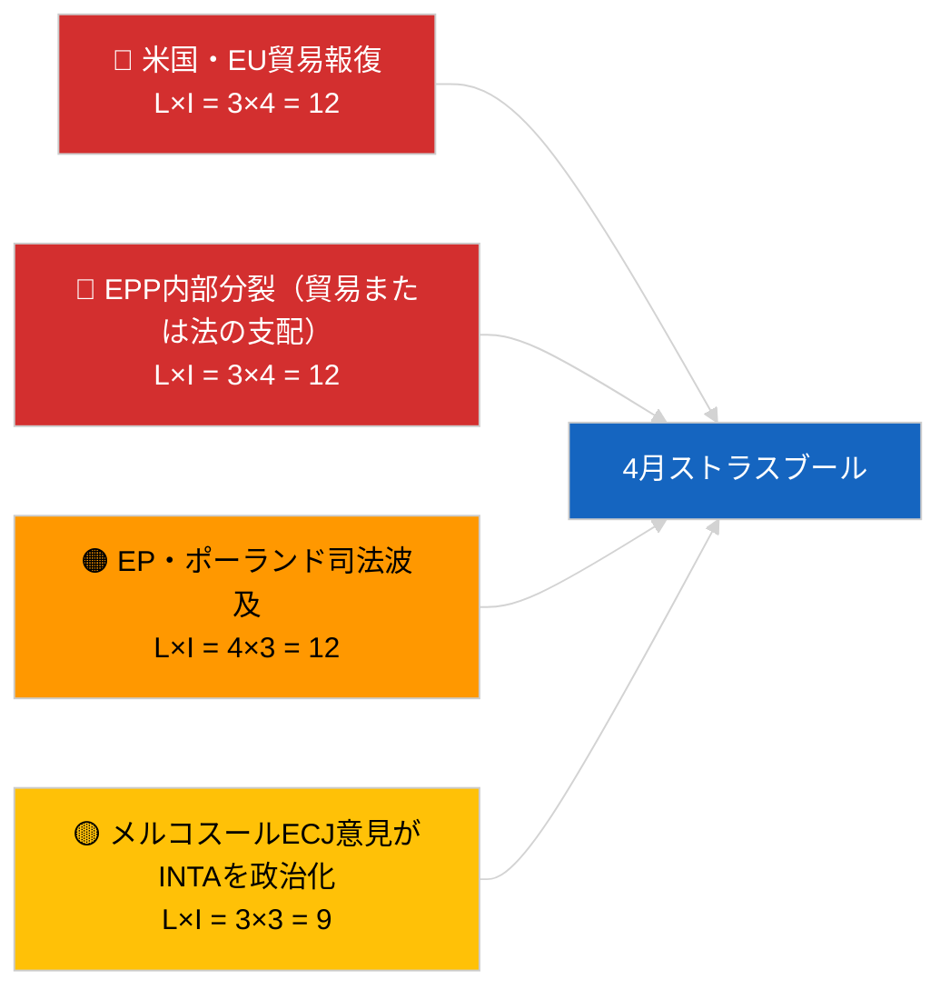
```mermaid
%%{init: {"theme":"dark"}}%%
graph LR
    R1["🔴 米国・EU貿易報復<br/>L×I = 3×4 = 12"] --> CONS["4月ストラスブール"]
    R2["🔴 EPP内部分裂（貿易または法の支配）<br/>L×I = 3×4 = 12"] --> CONS
    R3["🟠 EP・ポーランド司法波及<br/>L×I = 4×3 = 12"] --> CONS
    R4["🟡 メルコスールECJ意見がINTAを政治化<br/>L×I = 3×3 = 9"] --> CONS
    style R1 fill:#D32F2F,color:#FFFFFF
    style R2 fill:#D32F2F,color:#FFFFFF
    style R3 fill:#FF9800,color:#000000
    style R4 fill:#FFC107,color:#000000
    style CONS fill:#1565C0,color:#FFFFFF
```

| リスク | L | I | スコア | トリガー | 出典 | 信憑性評価 |
|--------|:-:|:-:|:------:|---------|------|:----------:|
| 米国・EU貿易報復 | 3 | 4 | 12 | 米国の反対発表 | TA-10-2026-0096 | A1 |
| EPP内部分裂 | 3 | 4 | 12 | 可視化された投票分裂 | 連立算術 | A2 |
| EP・ポーランド司法波及 | 4 | 3 | 12 | 追加免責案件 | TA-10-2026-0088 | A1 |
| メルコスール意見の政治化 | 3 | 3 | 9 | 裁判所が本会議前に公表 | TA-10-2026-0008 | A2 |
| 月間先行分類が空 | 3 | 2 | 6 | 再実行も2026-04-20に空 | この実行 | B3 |

---

### 🔮 最重要先行トリガー

**ストラスブール議題公表〜2026年4月20日（T-7）。** 議題の構成が3シナリオの不確実性を解消する：貿易重視（シナリオA）は支配的な引き継ぎ物語を確認；法の支配重視（シナリオB）はブラウン先例からのLIBEモメンタムを示唆；経済・産業重視（シナリオC）はECONおよびENVIファイルを押し上げる。

---

### 🛡️ 情報源品質評価

- **一次情報源：** 欧州議会オープンデータポータル — 分析実行 `7f928e7c-85fd-4f76-890b-f362622c3f42`；2026年3月採択テキスト台帳（引き継ぎ）。
- **データの制限：** 本日の実行では行為者0名とルーティン重要度が生成された；将来推論は前日の記事とEPカレンダーに基づいており、再生成されたシナリオモデリングではない。
- **シナリオ確率の信頼度：** 🟡 中程度（定性的加重）。
- **引き継ぎ優先リストの信頼度：** 🟢 高。

---

### 📎 リンク

| リンク | パス |
|--------|------|
| 記事 | `./article.md` |
| 分類（空） | `./classification/` |
| 兄弟実行 | `analysis/daily/2026-04-01/breaking/`, `committee-reports/`, `motions/`, `propositions/` |
| 出典 — 3月立法台帳 | `analysis/daily/2026-03-10/` → `2026-03-26/` |
| マニフェスト | `./manifest.json` |

---

### 🔄 相互参照

**過去の実行：** ストラスブール3月9〜12日およびブリュッセルミニ本会議3月25〜26日が、この月間先行展望が使用する実質的な引き継ぎ基盤を提供している。

**事後検証：** 4月本会議後の月次レビュー（2026年5月初旬見込み）と照合してシナリオ予測精度を評価する。

---

**文書管理**
- **テンプレート：** `/analysis/templates/executive-brief.md`
- **成果物パス：** `analysis/daily/2026-04-01/month-ahead/executive-brief.md`
- **分類：** 公開
- **遡及生成：** バックフィルセッション。

### Executive Brief Ko

**분류:** OSINT | 공개 의회 기록
**신뢰 수준:** 🟡 중간 (미래 지향적; 빈 분류 출력이 깊이를 제한함)
**생성일:** 2026-04-01T00:00:00Z (소급 브리프)
**기사 유형:** 다음 달 전망
**실행 ID:** `7f928e7c-85fd-4f76-890b-f362622c3f42`
**출처:** 유럽의회 공개 데이터 포털

---

### 🎯 BLUF

**2026년 4월 전망은 4월 27~30일 스트라스부르 본회의 및 4월 13~17일 준비 위원회 주를 중심으로 한다.** 월간 선행 실행에서 **분류된 행위자 0명**과 **일상적인** 차원 점수가 반환되어, 3월 휴회 이후 유럽의회의 첫날을 반영하며 실질적인 4월 시나리오 예측은 제공되지 않았다. 4월로 이월된 우선순위: 미국 관세 조정(TA-10-2026-0096), EU-메르코수르 ECJ 의견(보류 중), HDV 배출 크레딧 전환(TA-10-2026-0084), 조지아 정치범 이행(TA-10-2026-0083), 브라운 면책 선례(TA-10-2026-0088)에서 비롯된 폴란드 사법 파급 효과. 세 가지 작업 시나리오: **시나리오 A — 무역 중심 의제(55%)**, **시나리오 B — 법치주의 집중(25%)**, **시나리오 C — 경제/산업 집중(20%)**. **🟡 중간 신뢰도** — 4월 의제 미공개.

---

### 🧭 이 브리프가 지원하는 3가지 결정

| # | 결정 | 결정자 | 기한 | 근거 |
|:-:|------|--------|:----:|------|
| 1 | **편집:** '의제 보류' 명시적 주의사항과 함께 시나리오 주도 월간 선행 예측으로 발행 | 편집장 | +24시간 | 이월 목록; 세 가지 시나리오 |
| 2 | **모니터링:** 4월 13~17일(위원회 주) 본회의 전 정보 사이클 | 분석가 | 2026-04-13 | 첫 번째 실질적 4월 신호 |
| 3 | **미래 지향 모니터링:** 공개된 의제로 T-7(~4월 20일)에 월간 선행 재실행 | 분석 책임자 | 2026-04-20 | 시나리오 선택 확인 |

---

### 📰 60초 요약

- 🔴 **오늘 피드에 4월 특정 새 절차나 의제 항목 없음** — 스트라스부르 의제는 일반적으로 T-7일에 공개됨. (🟢 높음)
- 🟠 **세 가지 작업 시나리오** — 4월 본회의는 무역 중심 변형(55%)이 지배: 미국 관세 조정, 메르코수르 의견, 디지털 주권. (🟡 중간)
- 🟢 **이월된 법치주의 트랙:** 브라운 선례의 파급 효과, 조지아 이행, 잠재적 추가 면책 절차(LIBE 주도). (🟡 중간)
- 🟡 **경제/산업 변형:** ECB 연례 보고서 후속 조치(TA-10-2026-0034), HDV 전환에 대한 회원국 저항. (🟡 중간)
- 🔵 **경제 맥락:** IMF 4월 WEO 공개 창이 본회의와 겹침 — 재정 압박 예측이 초기 MFF 논의에 영향을 줄 수 있음. (🟢 높음 — 일정 정렬)
- 🟣 **교차 참조:** 2026-04-01/breaking 형제 실행이 이 월간 선행 실행의 새로운 행위자 분류 생성을 방해한 자문 피드의 6/8 404 패턴을 문서화함. (🟢 높음)
- 🩷 **혼란 벡터:** 지배 그룹의 독주(PPE 38%)가 조기 경고 시스템에 의해 높음으로 표시 — 4월 놀라운 결과의 가장 가능성 있는 벡터는 무역 또는 법치주의에 관한 EPP 내부 분열. (🟡 중간)
- ⚪ **이월:** '더 나은 입법' 보고서 TA-10-2026-0063이 EP10 나머지 기간의 제도 개혁 논의 기준선 설정.

---

### 🗂️ 주요 문서/절차 — 4월 감시 목록

| 순위 | EP 참조 | 제목(약칭) | 중요도 | 신뢰도 | 상태 |
|:----:|---------|-----------|:------:|:------:|------|
| 1 | TA-10-2026-0096 | 미국 관세 조정 | 7.5 | 🟢 높음 | 3월 26일 채택; 4월 후속 조치 예상 |
| 2 | TA-10-2026-0008 | EU-메르코수르 ECJ 부탁(의견 보류 중) | 7.0 | 🟡 중간 | 4월 본회의 전 사법 의견 예상 |
| 3 | TA-10-2026-0083 | 조지아 정치범 | 6.5 | 🟢 높음 | 이행 보고 기한 도래 |
| 4 | TA-10-2026-0088 | 브라운 면책(후속 사례 선례) | 6.5 | 🟢 높음 | LIBE 후속 모니터링 |
| 5 | TA-10-2026-0084 | HDV 배출 크레딧 2025~2029 | 6.0 | 🟢 높음 | 국가별 전환 |

---

### ⚠️ 위험 및 위협 스냅숏 — 4월 전망

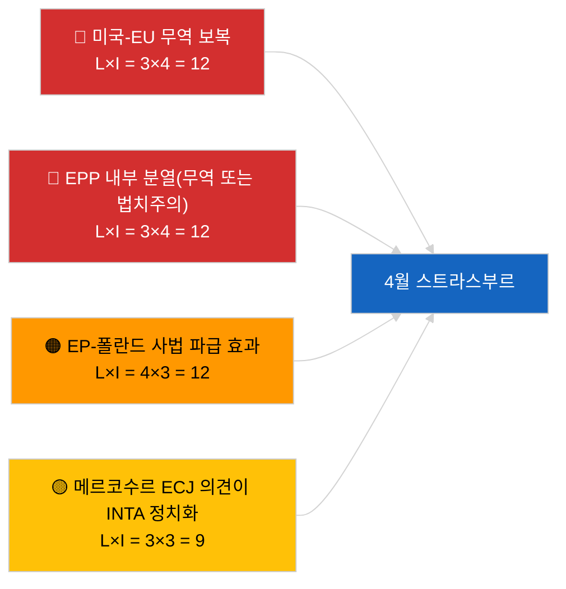
```mermaid
%%{init: {"theme":"dark"}}%%
graph LR
    R1["🔴 미국-EU 무역 보복<br/>L×I = 3×4 = 12"] --> CONS["4월 스트라스부르"]
    R2["🔴 EPP 내부 분열(무역 또는 법치주의)<br/>L×I = 3×4 = 12"] --> CONS
    R3["🟠 EP-폴란드 사법 파급 효과<br/>L×I = 4×3 = 12"] --> CONS
    R4["🟡 메르코수르 ECJ 의견이 INTA 정치화<br/>L×I = 3×3 = 9"] --> CONS
    style R1 fill:#D32F2F,color:#FFFFFF
    style R2 fill:#D32F2F,color:#FFFFFF
    style R3 fill:#FF9800,color:#000000
    style R4 fill:#FFC107,color:#000000
    style CONS fill:#1565C0,color:#FFFFFF
```

| 위험 | L | I | 점수 | 트리거 | 출처 | 신뢰도 |
|------|:-:|:-:|:----:|-------|------|:------:|
| 미국-EU 무역 보복 | 3 | 4 | 12 | 미국의 반대 발표 | TA-10-2026-0096 | A1 |
| EPP 내부 분열 | 3 | 4 | 12 | 가시적 투표 분열 | 연립 산술 | A2 |
| EP-폴란드 사법 파급 효과 | 4 | 3 | 12 | 추가 면책 사례 | TA-10-2026-0088 | A1 |
| 메르코수르 의견 정치화 | 3 | 3 | 9 | 법원이 본회의 전 공개 | TA-10-2026-0008 | A2 |
| 빈 월간 선행 분류 | 3 | 2 | 6 | 재실행도 2026-04-20 비어있음 | 이 실행 | B3 |

---

### 🔮 최우선 선행 트리거

**스트라스부르 의제 공개 ~2026년 4월 20일(T-7).** 의제 구성이 세 가지 시나리오 불확실성을 해소할 것이다: 무역 중심 가중치(시나리오 A)는 지배적인 이월 서사를 확인; 법치주의 가중치(시나리오 B)는 브라운 선례에서 비롯된 LIBE 모멘텀 신호; 경제/산업 가중치(시나리오 C)는 ECON 및 ENVI 파일을 끌어올림.

---

### 🛡️ 출처 품질 평가

- **1차 출처:** 유럽의회 공개 데이터 포털 — 분석 실행 `7f928e7c-85fd-4f76-890b-f362622c3f42`; 2026년 3월 채택 텍스트 목록(이월).
- **데이터 제한:** 오늘 실행에서 행위자 0명과 일상적 중요도가 생성됨; 미래 지향적 추론은 전날 기사 및 EP 일정에 기반하며 재생성된 시나리오 모델링이 아님.
- **시나리오 확률 신뢰도:** 🟡 중간 (정성적 가중치).
- **이월 우선순위 목록 신뢰도:** 🟢 높음.

---

### 📎 링크

| 링크 | 경로 |
|------|------|
| 기사 | `./article.md` |
| 분류(비어 있음) | `./classification/` |
| 형제 실행 | `analysis/daily/2026-04-01/breaking/`, `committee-reports/`, `motions/`, `propositions/` |
| 출처 — 3월 입법 목록 | `analysis/daily/2026-03-10/` → `2026-03-26/` |
| 매니페스트 | `./manifest.json` |

---

### 🔄 교차 참조

**이전 실행:** 3월 9~12일 스트라스부르 및 3월 25~26일 브뤼셀 미니 본회의가 이 월간 선행 전망에서 사용하는 실질적인 이월 기반을 제공한다.

**사후 검증:** 4월 본회의 이후 월간 검토(2026년 5월 초 예상)와 비교하여 시나리오 예측 정확도를 평가한다.

---

**문서 관리**
- **템플릿:** `/analysis/templates/executive-brief.md`
- **결과물 경로:** `analysis/daily/2026-04-01/month-ahead/executive-brief.md`
- **분류:** 공개
- **소급 생성:** 백필 세션.

### Executive Brief Nl

### 🎯 BLUF

**De vooruitzichten voor april 2026 zijn verankerd in de plenaire vergadering van Straatsburg van 27–30 april en de voorbereidende commissieweek van 13–17 april.** De maandelijkse vooruitblik-uitvoering leverde **0 geclassificeerde actoren** en **ROUTINE**-dimensiescores op, wat de eerste dag van het Europees Parlement na het maart-reces weerspiegelt in plaats van een substantiële aprilscenario-prognose. Doorlopende prioriteiten naar april: aanpassing van de Amerikaanse douanetarieven (TA-10-2026-0096), EU-Mercosur HvJ-advies (in afwachting), omzetting van HDV-emissiekrediet (TA-10-2026-0084), implementatie betreffende Georgische politieke gevangenen (TA-10-2026-0083) en voortdurende Pools-juridische nawerkingen van het Braun-immuniteitsprecedent (TA-10-2026-0088). Drie werkscenario's: **Scenario A — handelszwaar programma (55%)**, **Scenario B — focus op rechtsstaat (25%)**, **Scenario C — economische/industriële focus (20%)**. **🟡 GEMIDDELD betrouwbaarheidsniveau** — april-agenda nog niet gepubliceerd.

---

### 🧭 3 Beslissingen die deze nota ondersteunt

| # | Beslissing | Wie beslist | Deadline | Bewijs |
|:-:|-----------|------------|:--------:|--------|
| 1 | **Redactioneel:** publiceer als scenariogestuurde maandelijkse vooruitblik met expliciete 'agenda in afwachting'-kanttekening | Redacteur | +24u | Doorlopende inventarisatie; drie scenario's |
| 2 | **Monitoring:** pre-plenaire inlichtingencyclus 13–17 april (commissieweek) | Analist | 2026-04-13 | Eerste substantiële aprilsignalen |
| 3 | **Vooruitkijkende monitoring:** maandelijkse vooruitblik opnieuw uitvoeren op T-7 voor plenaire vergadering (~20 april) met gepubliceerde agenda | Analysemanager | 2026-04-20 | Scenarioselectie bevestigen |

---

### 📰 60-Seconden Lezing

- 🔴 **Geen nieuwe april-specifieke procedures of agendapunten in de feed van vandaag** — de Straatsburg-agenda wordt doorgaans T-7 dagen gepubliceerd. (🟢 Hoog)
- 🟠 **Drie werkscenario's** voor de aprilplenaire vergadering, gedomineerd door de handelszware variant (55%): aanpassing van de Amerikaanse douanetarieven, Mercosur-advies, digitale soevereiniteit. (🟡 Gemiddeld)
- 🟢 **Doorlopend rechtsstaat-spoor:** nawerkingen van het Braun-precedent, implementatie Georgië, potentiële aanvullende immuniteitsprocedures (LIBE-gedreven). (🟡 Gemiddeld)
- 🟡 **Economische/industriële variant:** opvolging van het jaarverslag van de ECB (TA-10-2026-0034), weerstand van lidstaten bij omzetting HDV. (🟡 Gemiddeld)
- 🔵 **Economische context:** het publicatievenster van IMF april WEO valt samen met de plenaire vergadering — prognoses voor begrotingsstress kunnen het vroege debat over het MFK kleuren. (🟢 Hoog — kalenderafstemming)
- 🟣 **Kruisverwijzing:** de zusteruitvoering 2026-04-01/breaking documenteert het 6/8 404-patroon in de adviserende feed dat verhinderde dat deze maandelijkse vooruitblik-uitvoering een nieuwe actorclassificatie produceerde. (🟢 Hoog)
- 🩷 **Verstoringsvektor:** overheersende-groep-inmenging (PPE 38%) als HOOG gemarkeerd door het vroegwaarschuwingssysteem — de meest waarschijnlijke vector voor een aprilverrassing is een interne EPP-splitsing over handel of rechtsstaat. (🟡 Gemiddeld)
- ⚪ **Doorsturen:** het rapport 'Betere wetgeving' TA-10-2026-0063 stelt de basislijn vast voor het debat over institutionele hervorming voor de rest van EP10.

---

### 🗂️ Topdocumenten / Procedures — April-bewakingslijst

| Rang | EP-referentie | Titel (kort) | Belang | Betrouwbaarheid | Status |
|:----:|---------------|--------------|:------:|:---------------:|--------|
| 1 | TA-10-2026-0096 | Aanpassing van de Amerikaanse douanetarieven | 7,5 | 🟢 HOOG | Aangenomen 26 maart; opvolging in april verwacht |
| 2 | TA-10-2026-0008 | EU-Mercosur HvJ-doorverwijzing (advies in afwachting) | 7,0 | 🟡 GEMIDDELD | Rechterlijk advies verwacht vóór de aprilplenaire vergadering |
| 3 | TA-10-2026-0083 | Georgische politieke gevangenen | 6,5 | 🟢 HOOG | Implementatierapportage vervalt |
| 4 | TA-10-2026-0088 | Braun-immuniteit (precedent voor vervolgzaken) | 6,5 | 🟢 HOOG | LIBE-vervolgmonitoring |
| 5 | TA-10-2026-0084 | HDV-emissiekrediet 2025–2029 | 6,0 | 🟢 HOOG | Nationale omzetting |

---

### ⚠️ Risico- en Dreigingsoverzicht — Aprilvooruitzicht

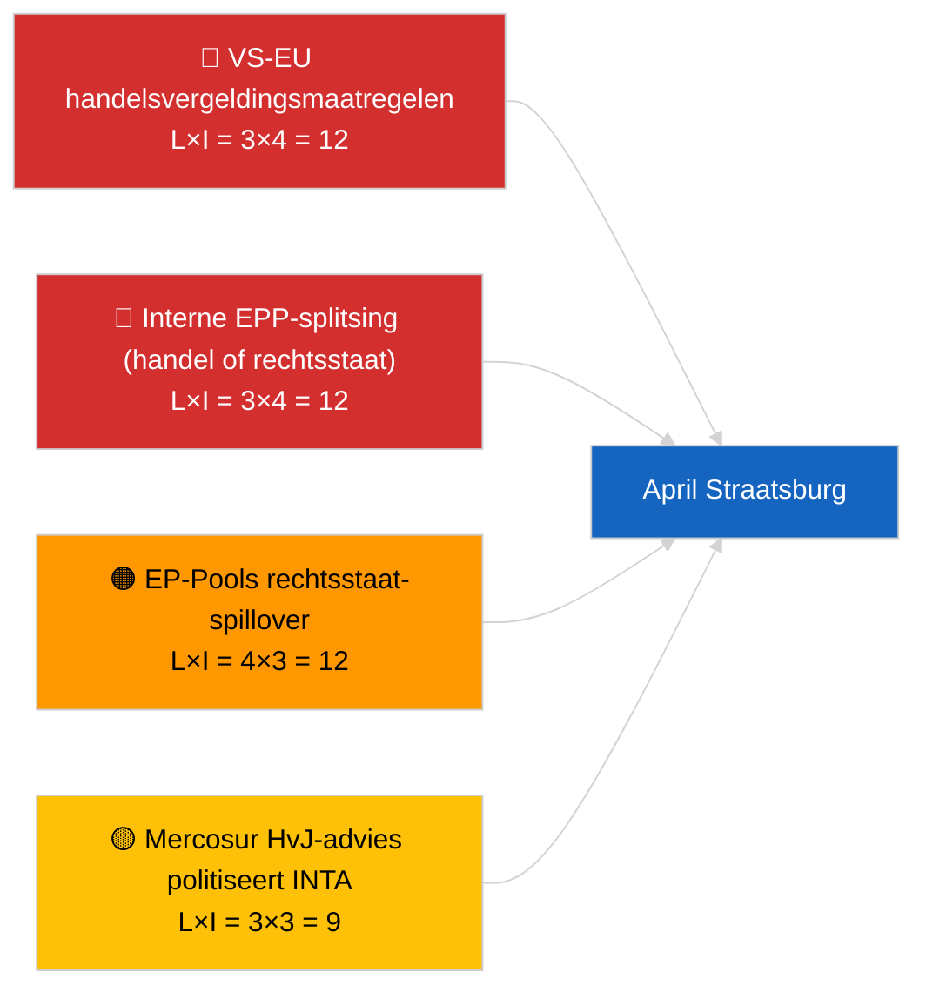
```mermaid
%%{init: {"theme":"dark"}}%%
graph LR
    R1["🔴 VS-EU handelsvergeldingsmaatregelen<br/>L×I = 3×4 = 12"] --> CONS["April Straatsburg"]
    R2["🔴 Interne EPP-splitsing (handel of rechtsstaat)<br/>L×I = 3×4 = 12"] --> CONS
    R3["🟠 EP-Pools rechtsstaat-spillover<br/>L×I = 4×3 = 12"] --> CONS
    R4["🟡 Mercosur HvJ-advies politiseert INTA<br/>L×I = 3×3 = 9"] --> CONS
    style R1 fill:#D32F2F,color:#FFFFFF
    style R2 fill:#D32F2F,color:#FFFFFF
    style R3 fill:#FF9800,color:#000000
    style R4 fill:#FFC107,color:#000000
    style CONS fill:#1565C0,color:#FFFFFF
```

| Risico | L | I | Score | Trigger | Bron | Admiraliteit |
|--------|:-:|:-:|:-----:|---------|------|:------------:|
| VS-EU handelsvergeldingsmaatregelen | 3 | 4 | 12 | Tegenmelding VS | TA-10-2026-0096 | A1 |
| Interne EPP-splitsing | 3 | 4 | 12 | Zichtbare stemverdeling | Coalitie-arithmetiek | A2 |
| EP-Pools rechtsstaat-spillover | 4 | 3 | 12 | Verdere immuniteitszaak | TA-10-2026-0088 | A1 |
| Politisering van Mercosur-advies | 3 | 3 | 9 | Rechtbank publiceert voor plenaire vergadering | TA-10-2026-0008 | A2 |
| Lege maandelijkse vooruitblik-classificatie | 3 | 2 | 6 | Heruitvoering ook leeg 2026-04-20 | Deze uitvoering | B3 |

---

### 🔮 Voornaamste Vooruitblikkende Trigger

**Publicatie van de Straatsburg-agenda ~20 april 2026 (T-7).** De samenstelling van de agenda zal de drie-scenario-onzekerheid oplossen: handelszware weging (Scenario A) bevestigt de dominante doorlopende narratief; rechtsstaatsweging (Scenario B) signaleert LIBE-momentum vanuit het Braun-precedent; economische/industriële weging (Scenario C) verhoogt de ECON- en ENVI-dossiers.

---

### 🛡️ Beoordeling van Bronkwaliteit

- **Primaire bronnen:** Open dataportal van het Europees Parlement — analyse-uitvoering `7f928e7c-85fd-4f76-890b-f362622c3f42`; inventarisatie van aangenomen teksten van maart 2026 (doorlopend).
- **Databeperkingen:** De uitvoering van vandaag produceerde 0 actoren en ROUTINE-significantie; prospectieve inferentie is verankerd aan artikelen van de vorige dag en de EP-kalender, niet aan geregenereerde scenariomodellering.
- **Betrouwbaarheid van scenariokansen:** 🟡 Gemiddeld (kwalitatieve weging).
- **Betrouwbaarheid van doorlopende prioriteitenlijst:** 🟢 Hoog.

---

### 📎 Links

| Link | Pad |
|------|-----|
| Artikel | `./article.md` |
| Classificatie (leeg) | `./classification/` |
| Zusteruitvoeringen | `analysis/daily/2026-04-01/breaking/`, `committee-reports/`, `motions/`, `propositions/` |
| Bron — wetgevingsinventarisatie maart | `analysis/daily/2026-03-10/` → `2026-03-26/` |
| Manifest | `./manifest.json` |

---

### 🔄 Kruisverwijzing

**Eerdere uitvoeringen:** Straatsburg 9–12 maart en de mini-plenaire vergadering in Brussel 25–26 maart leveren de substantiële doorlopende basis die wordt gebruikt door deze maandelijkse vooruitblik.

**Volgende verificatie:** Vergelijk met de maandelijkse overzicht na de aprilplenaire vergadering (verwacht begin mei 2026) om de nauwkeurigheid van de scenariovoorspelling te beoordelen.

---

**Documentcontrole**
- **Sjabloon:** `/analysis/templates/executive-brief.md`
- **Artefactpad:** `analysis/daily/2026-04-01/month-ahead/executive-brief.md`
- **Classificatie:** Openbaar
- **Retrospectieve generering:** Backfill-sessie.

### Executive Brief No

### 🎯 BLUF

**Aprilutsiktene for 2026 er forankret i Strasbourg-plenumssamlingen 27.–30. april og den forberedende utvalgsuka 13.–17. april.** Måneds-fremtids-kjøringen returnerte **0 klassifiserte aktører** og **RUTINEMESSIGE** dimensjonsskårer, noe som gjenspeiler Europaparlamentets første dag etter mars-pausen heller enn en substansiell aprilscenario-prognose. Overførte prioriteringer inn i april: USAs tolltariff-justering (TA-10-2026-0096), EU–Mercosur EF-domstolsuttalelse (avventer), HDV-utslippskreditter transponering (TA-10-2026-0084), implementering av georgiske politiske fanger (TA-10-2026-0083), og pågående polsk-rettslige ettervirkninger fra Braun-immunitets-presedensen (TA-10-2026-0088). Tre arbeidsscenarier: **Scenario A — handelstungt program (55%)**, **Scenario B — rettsstats-fokus (25%)**, **Scenario C — økonomisk/industrielt fokus (20%)**. **🟡 MIDDELS konfidensnivå** — aprilprogrammet er ennå ikke publisert.

---

### 🧭 3 Beslutninger Dette Notatet Støtter

| # | Beslutning | Hvem bestemmer | Frist | Dokumentasjon |
|:-:|-----------|---------------|:-----:|---------------|
| 1 | **Redaksjonell:** publiser som scenariodrevet måneds-fremtid med eksplisitt "program avventes"-forbehold | Redaktør | +24h | Overført inventar; tre scenarier |
| 2 | **Overvåking:** for-plenum etterretningssyklus 13.–17. april (utvalgsuke) | Analytiker | 2026-04-13 | Første substansielle aprilsignaler |
| 3 | **Fremoverrettet overvåking:** kjør måneds-fremtid på nytt T-7 til plenum (~20. april) med publisert program | Analyseansvarlig | 2026-04-20 | Bekreft scenarievalg |

---

### 📰 60-Sekunders Lesning

- 🔴 **Ingen nye aprilspesifikke prosedyrer eller dagsordenspunkter i dagens feed** — Strasbourg-programmet publiseres typisk T-7 dager. (🟢 Høy)
- 🟠 **Tre arbeidsscenarier** for aprilplenumsmøtet, dominert av handelstung variant (55%): USAs tolljustering, Mercosur-uttalelse, digital suverenitet. (🟡 Middels)
- 🟢 **Overført rettsstats-spor:** Braun-presedens ettervirkninger, Georgien-implementering, potensielle ytterligere immunitetsforhandlinger (LIBE-drevet). (🟡 Middels)
- 🟡 **Økonomisk/industriell variant:** ECBs årsrapport-oppfølging (TA-10-2026-0034), HDV-transponeringmotstand fra medlemsstater. (🟡 Middels)
- 🔵 **Økonomisk kontekst:** IMF april WEO-publiseringsvinduet sammenfaller med plenumsmøtet — skattemessige stressutsikter kan farge den tidlige MFF-debatten. (🟢 Høy — kalenderoverlapning)
- 🟣 **Kryssreferanse:** søsken-kjøringen 2026-04-01/breaking dokumenterer 6/8 404-feilmønstret i rådgivningsfeedet som hindret denne måneds-fremtids-kjøringen fra å produsere ny aktørklassifisering. (🟢 Høy)
- 🩷 **Forstyrelsesvektor:** dominerende-gruppe-overgrep (PPE 38%) flagget HØY av det tidlige varslingssystemet — mest sannsynlig vektor for en apriloverraskelse er en EPP-intern splittelse om handel eller rettsstat. (🟡 Middels)
- ⚪ **Fremoverføring:** Bedre lovgivning-rapporten TA-10-2026-0063 fastlegger grunnlinjen for den institusjonelle reformdebatten for resten av EP10.

---

### 🗂️ Topdokumenter / Prosedyrer — Aprilovervåkningsliste

| Rang | EP-referanse | Tittel (kort) | Betydning | Konfidensnivå | Status |
|:----:|--------------|---------------|:---------:|:-------------:|--------|
| 1 | TA-10-2026-0096 | USAs tolltariffjustering | 7,5 | 🟢 HØY | Vedtatt 26. mars; apriloppfølging forventet |
| 2 | TA-10-2026-0008 | EU–Mercosur EF-domstolshenvising (avventer uttalelse) | 7,0 | 🟡 MIDDELS | Domstolsuttalelse forventes innen aprilplenumsmøtet |
| 3 | TA-10-2026-0083 | Georgiske politiske fanger | 6,5 | 🟢 HØY | Implementeringsrapportering forfaller |
| 4 | TA-10-2026-0088 | Braun-immunitet (presedens for etterfølgende saker) | 6,5 | 🟢 HØY | LIBE-oppfølgingsovervåking |
| 5 | TA-10-2026-0084 | HDV-utslippskreditter 2025–2029 | 6,0 | 🟢 HØY | Nasjonal transponering |

---

### ⚠️ Risiko- og Trusselbilde — Aprilutsikt

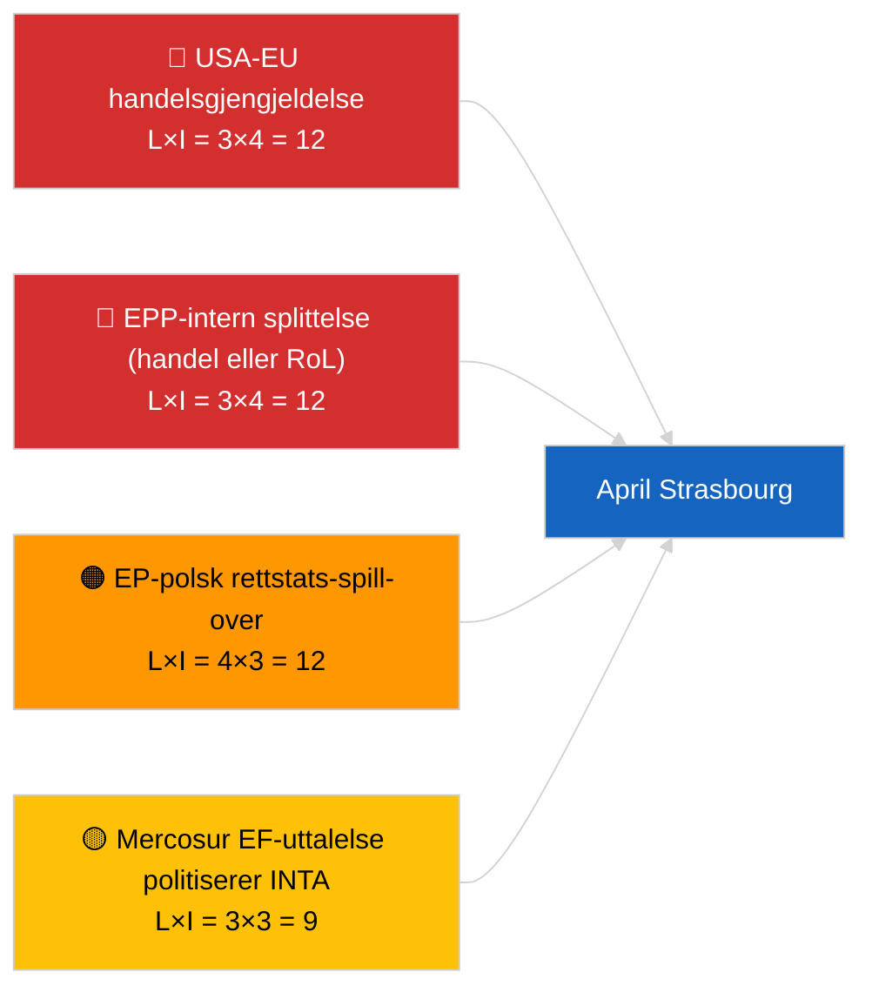
```mermaid
%%{init: {"theme":"dark"}}%%
graph LR
    R1["🔴 USA-EU handelsgjengjeldelse<br/>L×I = 3×4 = 12"] --> CONS["April Strasbourg"]
    R2["🔴 EPP-intern splittelse (handel eller RoL)<br/>L×I = 3×4 = 12"] --> CONS
    R3["🟠 EP-polsk rettstats-spill-over<br/>L×I = 4×3 = 12"] --> CONS
    R4["🟡 Mercosur EF-uttalelse politiserer INTA<br/>L×I = 3×3 = 9"] --> CONS
    style R1 fill:#D32F2F,color:#FFFFFF
    style R2 fill:#D32F2F,color:#FFFFFF
    style R3 fill:#FF9800,color:#000000
    style R4 fill:#FFC107,color:#000000
    style CONS fill:#1565C0,color:#FFFFFF
```

| Risiko | L | I | Skår | Utløser | Kilde | Admiralitet |
|--------|:-:|:-:|:----:|---------|-------|:-----------:|
| USA-EU handelsgjengjeldelse | 3 | 4 | 12 | USAs motmelding | TA-10-2026-0096 | A1 |
| EPP-intern splittelse | 3 | 4 | 12 | Synlig avstemningsdivisjon | Koalisjonsaritmetikk | A2 |
| EP-polsk rettstats-spill-over | 4 | 3 | 12 | Ytterligere immunitetsak | TA-10-2026-0088 | A1 |
| Mercosur-uttalelse politisering | 3 | 3 | 9 | Domstol publiserer før plenum | TA-10-2026-0008 | A2 |
| Tom måneds-fremtids-klassifisering | 3 | 2 | 6 | Gjen-kjøring også tom 2026-04-20 | Denne kjøringen | B3 |

---

### 🔮 Viktigste Fremtidige Utløser

**Strasbourgs programpublisering ~20. april 2026 (T-7).** Programmets sammensetning vil løse den tre-scenarios-usikkerheten: handelstung vekting (Scenario A) bekrefter den dominerende overførte fortellingen; rettsstats-vekting (Scenario B) signaliserer LIBE-momentum fra Braun-presedensen; økonomisk/industriell vekting (Scenario C) løfter ECON- og ENVI-filer.

---

### 🛡️ Vurdering av Kildekvalitet

- **Primærkilder:** Europaparlamentets åpne dataportal — analysekjøring `7f928e7c-85fd-4f76-890b-f362622c3f42`; mars 2026 vedtatte-tekster-inventar (overført).
- **Databegrensninger:** Dagens kjøring produserte 0 aktører og RUTINEMESSIG signifikans; fremoverrettet inferens er forankret til foregående dags artikler og EPs kalender, ikke regenerert scenariomodellering.
- **Konfidensnivå for scenarieprobabiliteter:** 🟡 Middels (kvalitativ vekting).
- **Konfidensnivå for overført prioriteringsliste:** 🟢 Høy.

---

### 📎 Lenker

| Lenke | Sti |
|-------|-----|
| Artikkel | `./article.md` |
| Klassifisering (tom) | `./classification/` |
| Søsken-kjøringer | `analysis/daily/2026-04-01/breaking/`, `committee-reports/`, `motions/`, `propositions/` |
| Kilde — mars lovgivningsinventar | `analysis/daily/2026-03-10/` → `2026-03-26/` |
| Manifest | `./manifest.json` |

---

### 🔄 Kryssreferanse

**Tidligere kjøringer:** Strasbourg 9.–12. mars og Brussel mini-plenumsmøte 25.–26. mars gir den substansielle overførte basen som brukes av dette måneds-fremtidsnotat.

**Etterfølgende verifikasjon:** Sammenlign med post-april-plenum månedsoversikten (forventes tidlig mai 2026) for å vurdere scenariespådommens nøyaktighet.

---

**Dokumentkontroll**
- **Mal:** `/analysis/templates/executive-brief.md`
- **Artefaktsti:** `analysis/daily/2026-04-01/month-ahead/executive-brief.md`
- **Klassifisering:** Offentlig
- **Retrospektiv generering:** Tilbakefyllings-sesjon.

### Executive Brief Sv

### 🎯 BLUF

**Aprilutsikterna 2026 är förankrade i Strasbourgplenarsessionen 27–30 april och den förberedande utskottsveckan 13–17 april.** Månadsöversiktskörningen returnerade **0 klassificerade aktörer** och **RUTINMÄSSIGA** dimensionspoäng, vilket återspeglar Europaparlamentets första dag efter mars-uppehållet snarare än en substantiell aprilscenarioprognos. Prioriteringar som förs vidare in i april: USA:s tullanpassning (TA-10-2026-0096), EU–Mercosur EG-domstolsyttrande (avvaktar), HDV-utsläppskrediter transponering (TA-10-2026-0084), implementering avseende georgiska politiska fångar (TA-10-2026-0083), och pågående polsk-rättsliga efterverkningar från Braun-immunitetsprecedentet (TA-10-2026-0088). Tre arbetsscenarier: **Scenario A — handelstung dagordning (55%)**, **Scenario B — rättsstatsfokus (25%)**, **Scenario C — ekonomiskt/industriellt fokus (20%)**. **🟡 MEDEL konfidensgrad** — aprilagenda ännu ej publicerad.

---

### 🧭 3 Beslut som detta underlag stöder

| # | Beslut | Vem beslutar | Deadline | Evidens |
|:-:|--------|-------------|:--------:|---------|
| 1 | **Redaktionell:** publicera som scenarioledd månadsöversikt med uttrycklig "agenda avvaktas"-varning | Redaktör | +24h | Vidareförd inventering; tre scenarier |
| 2 | **Bevakning:** förplenär underrättelsecykel 13–17 april (utskottsvecka) | Analytiker | 2026-04-13 | Första substantiella aprilsignaler |
| 3 | **Framåtbevakning:** kör om månadsöversikten T-7 till plenarsession (~20 april) med publicerad agenda | Analysansvarig | 2026-04-20 | Bekräfta scenarioval |

---

### 📰 60-Sekunders Läsning

- 🔴 **Inga nya aprilspecifika procedurer eller dagordningspunkter i dagens flöde** — Strasbourgagendan publiceras vanligtvis T-7 dagar. (🟢 Hög)
- 🟠 **Tre arbetsscenarier** för aprilplenarsessionen, dominerat av handelstung variant (55%): USA:s tullanpassning, Mercosur-yttrande, digital suveränitet. (🟡 Medel)
- 🟢 **Vidareförd rättsstatsspår:** Braun-precedentets efterverkningar, Georgienimplementering, potentiella ytterligare immunitetsförfaranden (LIBE-drivet). (🟡 Medel)
- 🟡 **Ekonomisk/industriell variant:** ECB:s årsrapportuppföljning (TA-10-2026-0034), HDV-transponeringsmotstånd från medlemsstater. (🟡 Medel)
- 🔵 **Ekonomisk kontext:** IMF april WEO-publiceringsfönstret sammanfaller med plenarsessionen — skattemässiga stressutsikter kan färga den tidiga MFF-debatten. (🟢 Hög — kalenderjustering)
- 🟣 **Korsreferens:** syskonkörningen 2026-04-01/breaking dokumenterar 6/8-mönstret med 404-fel i rådgivningsflödet som hindrade denna månadsöversiktskörning från att producera ny aktörsklassificering. (🟢 Hög)
- 🩷 **Störningsfaktor:** dominant-gruppövergrepp (PPE 38%) flaggat HÖG av det tidiga varningssystemet — mest sannolika vektorn för en aprilöverraskning är en EPP-intern splittring om handel eller rättsstat. (🟡 Medel)
- ⚪ **Vidareföring:** Bättre lagstiftning-rapporten TA-10-2026-0063 sätter baslinjen för den institutionella reformdebatten för resten av EP10.

---

### 🗂️ Toppidokument / Procedurer — Aprilbevakningslista

| Rang | EP-referens | Titel (kort) | Betydelse | Konfidensgrad | Status |
|:----:|-------------|--------------|:---------:|:-------------:|--------|
| 1 | TA-10-2026-0096 | USA:s tulltariffjustering | 7,5 | 🟢 HÖG | Antagen 26 mars; apriluppföljning förväntas |
| 2 | TA-10-2026-0008 | EU–Mercosur EG-domstolshänvisning (avvaktar yttrande) | 7,0 | 🟡 MEDEL | Domstolsyttrande förväntas före aprilplenarsessionen |
| 3 | TA-10-2026-0083 | Georgiska politiska fångar | 6,5 | 🟢 HÖG | Implementeringsrapportering förfaller |
| 4 | TA-10-2026-0088 | Braun-immunitet (precedent för följdärenden) | 6,5 | 🟢 HÖG | LIBE-uppföljningsbevakning |
| 5 | TA-10-2026-0084 | HDV-utsläppskrediter 2025–2029 | 6,0 | 🟢 HÖG | Nationell transponering |

---

### ⚠️ Risk- och Hotöversikt — Aprilutsikt

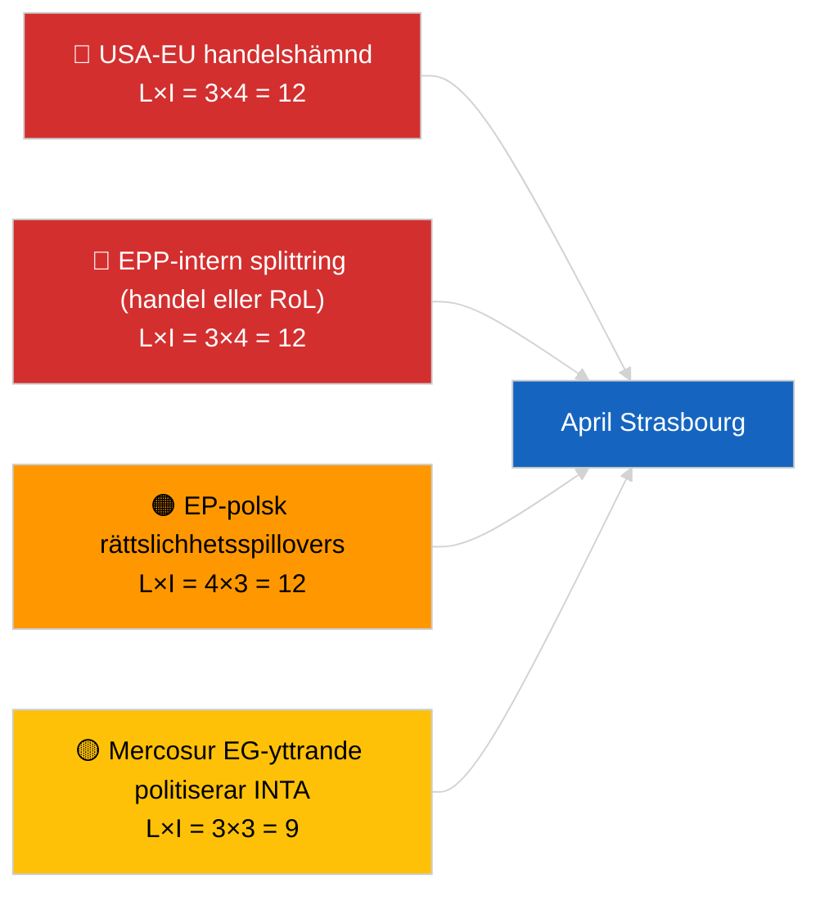
```mermaid
%%{init: {"theme":"dark"}}%%
graph LR
    R1["🔴 USA-EU handelshämnd<br/>L×I = 3×4 = 12"] --> CONS["April Strasbourg"]
    R2["🔴 EPP-intern splittring (handel eller RoL)<br/>L×I = 3×4 = 12"] --> CONS
    R3["🟠 EP-polsk rättslichhetsspillovers<br/>L×I = 4×3 = 12"] --> CONS
    R4["🟡 Mercosur EG-yttrande politiserar INTA<br/>L×I = 3×3 = 9"] --> CONS
    style R1 fill:#D32F2F,color:#FFFFFF
    style R2 fill:#D32F2F,color:#FFFFFF
    style R3 fill:#FF9800,color:#000000
    style R4 fill:#FFC107,color:#000000
    style CONS fill:#1565C0,color:#FFFFFF
```

| Risk | L | I | Poäng | Utlösare | Källa | Admiralitet |
|------|:-:|:-:|:-----:|---------|-------|:-----------:|
| USA-EU handelshämnd | 3 | 4 | 12 | USA:s motmeddelande | TA-10-2026-0096 | A1 |
| EPP-intern splittring | 3 | 4 | 12 | Synlig omröstningsdivision | Koalitionsaritmetik | A2 |
| EP-polsk rättsstatsspillovers | 4 | 3 | 12 | Ytterligare immunitetsärende | TA-10-2026-0088 | A1 |
| Mercosur-yttrande politisering | 3 | 3 | 9 | Domstol publicerar före plenum | TA-10-2026-0008 | A2 |
| Tom månadsöversiktsklassificering | 3 | 2 | 6 | Omsköring också tom 2026-04-20 | Denna körning | B3 |

---

### 🔮 Viktigaste Framtida Utlösare

**Strasbourgs agendapublicering ~20 april 2026 (T-7).** Agendans sammansättning kommer att lösa den trescenariomässiga osäkerheten: handelstung viktning (Scenario A) bekräftar den dominerande vidareförda narrativen; rättsstatsviktning (Scenario B) signalerar LIBE-momentum från Braun-precedentet; ekonomisk/industriell viktning (Scenario C) lyfter ECON- och ENVI-filer.

---

### 🛡️ Källkvalitetsbedömning

- **Primärkällor:** Europaparlamentets öppna dataportal — analyskörning `7f928e7c-85fd-4f76-890b-f362622c3f42`; mars 2026 antagna-texter-inventering (vidareförd).
- **Databegränsningar:** Dagens körning producerade 0 aktörer och RUTINMÄSSIG signifikans; framåtinferens är förankrad till föregående dags artiklar och EP:s kalender, inte regenererad scenariomodellering.
- **Konfidensgrad för scenarieprobabiliteter:** 🟡 Medel (kvalitativ viktning).
- **Konfidensgrad för vidareförd prioriteringslista:** 🟢 Hög.

---

### 📎 Länkar

| Länk | Sökväg |
|------|--------|
| Artikel | `./article.md` |
| Klassificering (tom) | `./classification/` |
| Syskonkörningar | `analysis/daily/2026-04-01/breaking/`, `committee-reports/`, `motions/`, `propositions/` |
| Källa — mars lagstiftningsinventering | `analysis/daily/2026-03-10/` → `2026-03-26/` |
| Manifest | `./manifest.json` |

---

### 🔄 Korsreferens

**Tidigare körningar:** Strasbourg 9–12 mars och Bryssel miniplenarsession 25–26 mars ger den substantiella vidareförda basen som används av denna månadsöversikt.

**Efterföljande verifiering:** Jämför med den efterapril-plenara månadsöversikten (förväntas tidigt maj 2026) för att betygsätta scenarioprognosprecisionen.

---

**Dokumentkontroll**
- **Mall:** `/analysis/templates/executive-brief.md`
- **Artefaktsökväg:** `analysis/daily/2026-04-01/month-ahead/executive-brief.md`
- **Klassificering:** Offentlig
- **Retrospektiv generering:** Återfyllningssession.

### Executive Brief Zh

**分类：** OSINT | 公开议会记录
**置信度：** 🟡 中等（前瞻性；空分类输出限制深度）
**生成时间：** 2026-04-01T00:00:00Z（回溯简报）
**文章类型：** 下月展望
**运行ID：** `7f928e7c-85fd-4f76-890b-f362622c3f42`
**来源：** 欧洲议会开放数据门户

---

### 🎯 BLUF

**2026年4月展望以4月27日至30日斯特拉斯堡全会和4月13日至17日筹备委员会周为核心。** 月度前瞻运行返回**0名分类行为者**和**常规**维度得分，反映了欧洲议会在3月休会后首日状态，而非提供实质性的4月情景预测。延续至4月的优先事项：美国关税调整（TA-10-2026-0096）、欧盟-南方共同市场欧盟法院意见（待定）、HDV排放信用额度移植（TA-10-2026-0084）、格鲁吉亚政治犯实施（TA-10-2026-0083）以及由布劳恩豁免先例（TA-10-2026-0088）引发的波兰司法后续效应。三个工作情景：**情景A — 贸易为重议程（55%）**、**情景B — 法治聚焦（25%）**、**情景C — 经济/工业聚焦（20%）**。**🟡 中等置信度** — 4月议程尚未公布。

---

### 🧭 本简报支持的3项决策

| # | 决策 | 决策者 | 截止日期 | 依据 |
|:-:|------|--------|:--------:|------|
| 1 | **编辑：** 以情景驱动的月度前瞻发布，明确注明"议程待定"说明 | 编辑 | +24小时 | 延续库存；三种情景 |
| 2 | **监测：** 4月13日至17日（委员会周）全会前情报周期 | 分析师 | 2026-04-13 | 首批实质性4月信号 |
| 3 | **前瞻监测：** 在T-7（约4月20日）以已公布议程重新运行月度前瞻 | 分析负责人 | 2026-04-20 | 确认情景选择 |

---

### 📰 60秒阅读

- 🔴 **今日数据流中无新的4月特定程序或议程项目** — 斯特拉斯堡议程通常在T-7天公布。（🟢 高）
- 🟠 **三个工作情景**：4月全会以贸易为重变体（55%）为主导：美国关税调整、南方共同市场意见、数字主权。（🟡 中等）
- 🟢 **延续法治轨道：** 布劳恩先例后续影响、格鲁吉亚实施、LIBE主导的潜在额外豁免程序。（🟡 中等）
- 🟡 **经济/工业变体：** 欧洲央行年度报告跟进（TA-10-2026-0034）、成员国对HDV移植的抵制。（🟡 中等）
- 🔵 **经济背景：** IMF四月 WEO 发布窗口与全会重叠 — 财政压力预测可能渲染MFF早期辩论色彩。（🟢 高 — 日历对齐）
- 🟣 **交叉参考：** 兄弟运行2026-04-01/breaking记录了咨询信息流中6/8件的404模式，导致本月度前瞻运行无法生成新的行为者分类。（🟢 高）
- 🩷 **颠覆向量：** 主导群体独大（PPE 38%）被早期预警系统标记为高风险 — 4月意外事件最可能的向量是EPP在贸易或法治问题上的内部分裂。（🟡 中等）
- ⚪ **延续：** "更好立法"报告 TA-10-2026-0063 为EP10剩余任期的制度改革辩论设定基准。

---

### 🗂️ 重要文件/程序 — 4月监视列表

| 排名 | 欧洲议会参考 | 标题（简称） | 重要性 | 置信度 | 状态 |
|:----:|------------|------------|:------:|:------:|------|
| 1 | TA-10-2026-0096 | 美国关税调整 | 7.5 | 🟢 高 | 3月26日通过；4月跟进预期 |
| 2 | TA-10-2026-0008 | 欧盟-南方共同市场欧盟法院提交（意见待定） | 7.0 | 🟡 中等 | 法院意见预计于4月全会前 |
| 3 | TA-10-2026-0083 | 格鲁吉亚政治犯 | 6.5 | 🟢 高 | 实施报告到期 |
| 4 | TA-10-2026-0088 | 布劳恩豁免（后续案例先例） | 6.5 | 🟢 高 | LIBE后续监测 |
| 5 | TA-10-2026-0084 | HDV排放信用额度2025-2029 | 6.0 | 🟢 高 | 国家移植 |

---

### ⚠️ 风险与威胁快照 — 4月展望

```mermaid
%%{init: {"theme":"dark"}}%%
graph LR
    R1["🔴 美国-EU贸易报复<br/>L×I = 3×4 = 12"] --> CONS["4月斯特拉斯堡"]
    R2["🔴 EPP内部分裂（贸易或法治）<br/>L×I = 3×4 = 12"] --> CONS
    R3["🟠 EP-波兰司法溢出效应<br/>L×I = 4×3 = 12"] --> CONS
    R4["🟡 南方共同市场ECJ意见将INTA政治化<br/>L×I = 3×3 = 9"] --> CONS
    style R1 fill:#D32F2F,color:#FFFFFF
    style R2 fill:#D32F2F,color:#FFFFFF
    style R3 fill:#FF9800,color:#000000
    style R4 fill:#FFC107,color:#000000
    style CONS fill:#1565C0,color:#FFFFFF
```

| 风险 | L | I | 分数 | 触发因素 | 来源 | 信息评级 |
|------|:-:|:-:|:----:|---------|------|:--------:|
| 美国-EU贸易报复 | 3 | 4 | 12 | 美国反向声明 | TA-10-2026-0096 | A1 |
| EPP内部分裂 | 3 | 4 | 12 | 可见投票分歧 | 联盟算术 | A2 |
| EP-波兰司法溢出效应 | 4 | 3 | 12 | 额外豁免案件 | TA-10-2026-0088 | A1 |
| 南方共同市场意见政治化 | 3 | 3 | 9 | 法院在全会前公布 | TA-10-2026-0008 | A2 |
| 空月度前瞻分类 | 3 | 2 | 6 | 重新运行亦为空 2026-04-20 | 本次运行 | B3 |

---

### 🔮 最重要前瞻触发因素

**斯特拉斯堡议程公布 ~2026年4月20日（T-7）。** 议程构成将解决三情景不确定性：贸易为重权重（情景A）确认主导延续叙事；法治权重（情景B）表明LIBE从布劳恩先例获得动力；经济/工业权重（情景C）提升ECON和ENVI文件。

---

### 🛡️ 信息来源质量评估

- **主要来源：** 欧洲议会开放数据门户 — 分析运行 `7f928e7c-85fd-4f76-890b-f362622c3f42`；2026年3月通过文本库存（延续）。
- **数据局限性：** 今日运行产生0名行为者和常规重要性；前瞻性推断基于前一天的文章和欧洲议会日历，非重新生成的情景建模。
- **情景概率置信度：** 🟡 中等（定性加权）。
- **延续优先事项列表置信度：** 🟢 高。

---

### 📎 链接

| 链接 | 路径 |
|------|------|
| 文章 | `./article.md` |
| 分类（空） | `./classification/` |
| 兄弟运行 | `analysis/daily/2026-04-01/breaking/`, `committee-reports/`, `motions/`, `propositions/` |
| 来源 — 3月立法库存 | `analysis/daily/2026-03-10/` → `2026-03-26/` |
| 清单 | `./manifest.json` |

---

### 🔄 交叉参考

**往期运行：** 3月9日至12日斯特拉斯堡和3月25日至26日布鲁塞尔小型全会提供了本月度前瞻所使用的实质性延续基础。

**后续核实：** 与4月全会后月度回顾（预计2026年5月初）进行比较，以评估情景预测准确性。

---

**文件管理**
- **模板：** `/analysis/templates/executive-brief.md`
- **制品路径：** `analysis/daily/2026-04-01/month-ahead/executive-brief.md`
- **分类：** 公开
- **回溯生成：** 补档会话。

### Coalition Analysis

### Overview
Analysis of political group cohesion and coalition dynamics.

### Coalition Metrics
- **Overall Stability**: 0.0%
- **Forecast**: volatile
- **Patterns Analysed**: 0

### Group Analysis
- **Stable Groups**: No stable groups identified
- **Declining Groups**: No declining groups identified

### Coalition Intelligence
- **Patterns Evaluated**: 0

### Date: 2026-04-01

### Stakeholder Analysis

### Data Available for Stakeholder Assessment
| Stakeholder Group | Primary Data Sources | Data Points |
|-------------------|---------------------|-------------|
| Political Groups | Procedures, Adopted Texts, Voting Records, Coalitions | 36 |
| Civil Society | Documents, Questions, Events | 17 |
| Industry | Procedures, Adopted Texts | 36 |
| National Governments | Adopted Texts, Procedures, Coalitions | 36 |
| Citizens | Questions, MEP Updates, Events | 16 |
| EU Institutions | Events, Procedures, Adopted Texts, Voting Records | 46 |

### Data Source Summary
| Source | Count |
|--------|-------|
| patterns | 0 |
| votingRecords | 0 |
| events | 10 |
| documents | 1 |
| adoptedTexts | 16 |
| procedures | 20 |
| mepUpdates | 0 |
| plenaryDocuments | 1 |
| committeeDocuments | 0 |
| plenarySessionDocuments | 1 |
| externalDocuments | 0 |
| questions | 6 |
| declarations | 0 |
| corporateBodies | 0 |

### Date: 2026-04-01

> **Provenance & Audit**
>
> - **Article type:** `month-ahead`
> - **Run date:** 2026-04-01
> - **Run id:** `7f928e7c-85fd-4f76-890b-f362622c3f42`
> - **Gate result:** `PENDING`
> - **Analysis tree:** [analysis/daily/2026-04-01/month-ahead](https://github.com/Hack23/euparliamentmonitor/tree/main/analysis/daily/2026-04-01/month-ahead)
> - **Manifest:** [manifest.json](https://github.com/Hack23/euparliamentmonitor/blob/main/analysis/daily/2026-04-01/month-ahead/manifest.json)

<h2 id="aggregator-tradecraft-references">Tradecraft References</h2>

This article is produced under the [Hack23 AB](https://hack23.com) intelligence tradecraft library. Every methodology and artifact template applied to this run is linked below.

### Artifact templates

- [README](https://github.com/Hack23/euparliamentmonitor/blob/main/analysis/templates/README.md)
- [Actor Mapping](https://github.com/Hack23/euparliamentmonitor/blob/main/analysis/templates/actor-mapping.md)
- [Actor Threat Profiles](https://github.com/Hack23/euparliamentmonitor/blob/main/analysis/templates/actor-threat-profiles.md)
- [Analysis Index](https://github.com/Hack23/euparliamentmonitor/blob/main/analysis/templates/analysis-index.md)
- [Coalition Dynamics](https://github.com/Hack23/euparliamentmonitor/blob/main/analysis/templates/coalition-dynamics.md)
- [Coalition Mathematics](https://github.com/Hack23/euparliamentmonitor/blob/main/analysis/templates/coalition-mathematics.md)
- [Commission Wp Alignment](https://github.com/Hack23/euparliamentmonitor/blob/main/analysis/templates/commission-wp-alignment.md)
- [Comparative International](https://github.com/Hack23/euparliamentmonitor/blob/main/analysis/templates/comparative-international.md)
- [Consequence Trees](https://github.com/Hack23/euparliamentmonitor/blob/main/analysis/templates/consequence-trees.md)
- [Cross Reference Map](https://github.com/Hack23/euparliamentmonitor/blob/main/analysis/templates/cross-reference-map.md)
- [Cross Run Diff](https://github.com/Hack23/euparliamentmonitor/blob/main/analysis/templates/cross-run-diff.md)
- [Cross Session Intelligence](https://github.com/Hack23/euparliamentmonitor/blob/main/analysis/templates/cross-session-intelligence.md)
- [Data Availability Assessment](https://github.com/Hack23/euparliamentmonitor/blob/main/analysis/templates/data-availability-assessment.md)
- [Data Download Manifest](https://github.com/Hack23/euparliamentmonitor/blob/main/analysis/templates/data-download-manifest.md)
- [Deep Analysis](https://github.com/Hack23/euparliamentmonitor/blob/main/analysis/templates/deep-analysis.md)
- [Devils Advocate Analysis](https://github.com/Hack23/euparliamentmonitor/blob/main/analysis/templates/devils-advocate-analysis.md)
- [Economic Context](https://github.com/Hack23/euparliamentmonitor/blob/main/analysis/templates/economic-context.md)
- [Executive Brief](https://github.com/Hack23/euparliamentmonitor/blob/main/analysis/templates/executive-brief.md)
- [Forces Analysis](https://github.com/Hack23/euparliamentmonitor/blob/main/analysis/templates/forces-analysis.md)
- [Forward Indicators](https://github.com/Hack23/euparliamentmonitor/blob/main/analysis/templates/forward-indicators.md)
- [Forward Projection](https://github.com/Hack23/euparliamentmonitor/blob/main/analysis/templates/forward-projection.md)
- [Historical Baseline](https://github.com/Hack23/euparliamentmonitor/blob/main/analysis/templates/historical-baseline.md)
- [Historical Parallels](https://github.com/Hack23/euparliamentmonitor/blob/main/analysis/templates/historical-parallels.md)
- [Imf Vintage Audit](https://github.com/Hack23/euparliamentmonitor/blob/main/analysis/templates/imf-vintage-audit.md)
- [Impact Matrix](https://github.com/Hack23/euparliamentmonitor/blob/main/analysis/templates/impact-matrix.md)
- [Implementation Feasibility](https://github.com/Hack23/euparliamentmonitor/blob/main/analysis/templates/implementation-feasibility.md)
- [Intelligence Assessment](https://github.com/Hack23/euparliamentmonitor/blob/main/analysis/templates/intelligence-assessment.md)
- [Legislative Disruption](https://github.com/Hack23/euparliamentmonitor/blob/main/analysis/templates/legislative-disruption.md)
- [Legislative Pipeline Forecast](https://github.com/Hack23/euparliamentmonitor/blob/main/analysis/templates/legislative-pipeline-forecast.md)
- [Legislative Velocity Risk](https://github.com/Hack23/euparliamentmonitor/blob/main/analysis/templates/legislative-velocity-risk.md)
- [Mandate Fulfilment Scorecard](https://github.com/Hack23/euparliamentmonitor/blob/main/analysis/templates/mandate-fulfilment-scorecard.md)
- [Mcp Reliability Audit](https://github.com/Hack23/euparliamentmonitor/blob/main/analysis/templates/mcp-reliability-audit.md)
- [Media Framing Analysis](https://github.com/Hack23/euparliamentmonitor/blob/main/analysis/templates/media-framing-analysis.md)
- [Methodology Reflection](https://github.com/Hack23/euparliamentmonitor/blob/main/analysis/templates/methodology-reflection.md)
- [Parliamentary Calendar Projection](https://github.com/Hack23/euparliamentmonitor/blob/main/analysis/templates/parliamentary-calendar-projection.md)
- [Per File Political Intelligence](https://github.com/Hack23/euparliamentmonitor/blob/main/analysis/templates/per-file-political-intelligence.md)
- [Pestle Analysis](https://github.com/Hack23/euparliamentmonitor/blob/main/analysis/templates/pestle-analysis.md)
- [Political Capital Risk](https://github.com/Hack23/euparliamentmonitor/blob/main/analysis/templates/political-capital-risk.md)
- [Political Classification](https://github.com/Hack23/euparliamentmonitor/blob/main/analysis/templates/political-classification.md)
- [Political Threat Landscape](https://github.com/Hack23/euparliamentmonitor/blob/main/analysis/templates/political-threat-landscape.md)
- [Presidency Trio Context](https://github.com/Hack23/euparliamentmonitor/blob/main/analysis/templates/presidency-trio-context.md)
- [Quantitative Swot](https://github.com/Hack23/euparliamentmonitor/blob/main/analysis/templates/quantitative-swot.md)
- [Reference Analysis Quality](https://github.com/Hack23/euparliamentmonitor/blob/main/analysis/templates/reference-analysis-quality.md)
- [Risk Assessment](https://github.com/Hack23/euparliamentmonitor/blob/main/analysis/templates/risk-assessment.md)
- [Risk Matrix](https://github.com/Hack23/euparliamentmonitor/blob/main/analysis/templates/risk-matrix.md)
- [Scenario Forecast](https://github.com/Hack23/euparliamentmonitor/blob/main/analysis/templates/scenario-forecast.md)
- [Seat Projection](https://github.com/Hack23/euparliamentmonitor/blob/main/analysis/templates/seat-projection.md)
- [Session Baseline](https://github.com/Hack23/euparliamentmonitor/blob/main/analysis/templates/session-baseline.md)
- [Significance Classification](https://github.com/Hack23/euparliamentmonitor/blob/main/analysis/templates/significance-classification.md)
- [Significance Scoring](https://github.com/Hack23/euparliamentmonitor/blob/main/analysis/templates/significance-scoring.md)
- [Stakeholder Impact](https://github.com/Hack23/euparliamentmonitor/blob/main/analysis/templates/stakeholder-impact.md)
- [Stakeholder Map](https://github.com/Hack23/euparliamentmonitor/blob/main/analysis/templates/stakeholder-map.md)
- [Swot Analysis](https://github.com/Hack23/euparliamentmonitor/blob/main/analysis/templates/swot-analysis.md)
- [Synthesis Summary](https://github.com/Hack23/euparliamentmonitor/blob/main/analysis/templates/synthesis-summary.md)
- [Term Arc](https://github.com/Hack23/euparliamentmonitor/blob/main/analysis/templates/term-arc.md)
- [Threat Analysis](https://github.com/Hack23/euparliamentmonitor/blob/main/analysis/templates/threat-analysis.md)
- [Threat Model](https://github.com/Hack23/euparliamentmonitor/blob/main/analysis/templates/threat-model.md)
- [Voter Segmentation](https://github.com/Hack23/euparliamentmonitor/blob/main/analysis/templates/voter-segmentation.md)
- [Voting Patterns](https://github.com/Hack23/euparliamentmonitor/blob/main/analysis/templates/voting-patterns.md)
- [Wildcards Blackswans](https://github.com/Hack23/euparliamentmonitor/blob/main/analysis/templates/wildcards-blackswans.md)
- [Workflow Audit](https://github.com/Hack23/euparliamentmonitor/blob/main/analysis/templates/workflow-audit.md)

### Methodologies

- [README](https://github.com/Hack23/euparliamentmonitor/blob/main/analysis/methodologies/README.md)
- [Ai Driven Analysis Guide](https://github.com/Hack23/euparliamentmonitor/blob/main/analysis/methodologies/ai-driven-analysis-guide.md)
- [Analytical Supplementary Methodology](https://github.com/Hack23/euparliamentmonitor/blob/main/analysis/methodologies/analytical-supplementary-methodology.md)
- [Artifact Catalog](https://github.com/Hack23/euparliamentmonitor/blob/main/analysis/methodologies/artifact-catalog.md)
- [Confidence Calibration](https://github.com/Hack23/euparliamentmonitor/blob/main/analysis/methodologies/confidence-calibration.md)
- [Electoral Cycle Methodology](https://github.com/Hack23/euparliamentmonitor/blob/main/analysis/methodologies/electoral-cycle-methodology.md)
- [Electoral Domain Methodology](https://github.com/Hack23/euparliamentmonitor/blob/main/analysis/methodologies/electoral-domain-methodology.md)
- [Forward Projection Methodology](https://github.com/Hack23/euparliamentmonitor/blob/main/analysis/methodologies/forward-projection-methodology.md)
- [Imf Indicator Mapping](https://github.com/Hack23/euparliamentmonitor/blob/main/analysis/methodologies/imf-indicator-mapping.md)
- [Osint Tradecraft Standards](https://github.com/Hack23/euparliamentmonitor/blob/main/analysis/methodologies/osint-tradecraft-standards.md)
- [Per Artifact Methodologies](https://github.com/Hack23/euparliamentmonitor/blob/main/analysis/methodologies/per-artifact-methodologies.md)
- [Per Document Methodology](https://github.com/Hack23/euparliamentmonitor/blob/main/analysis/methodologies/per-document-methodology.md)
- [Political Classification Guide](https://github.com/Hack23/euparliamentmonitor/blob/main/analysis/methodologies/political-classification-guide.md)
- [Political Risk Methodology](https://github.com/Hack23/euparliamentmonitor/blob/main/analysis/methodologies/political-risk-methodology.md)
- [Political Style Guide](https://github.com/Hack23/euparliamentmonitor/blob/main/analysis/methodologies/political-style-guide.md)
- [Political Swot Framework](https://github.com/Hack23/euparliamentmonitor/blob/main/analysis/methodologies/political-swot-framework.md)
- [Political Threat Framework](https://github.com/Hack23/euparliamentmonitor/blob/main/analysis/methodologies/political-threat-framework.md)
- [Seo Headers Policy](https://github.com/Hack23/euparliamentmonitor/blob/main/analysis/methodologies/seo-headers-policy.md)
- [Source Triangulation](https://github.com/Hack23/euparliamentmonitor/blob/main/analysis/methodologies/source-triangulation.md)
- [Strategic Extensions Methodology](https://github.com/Hack23/euparliamentmonitor/blob/main/analysis/methodologies/strategic-extensions-methodology.md)
- [Structural Metadata Methodology](https://github.com/Hack23/euparliamentmonitor/blob/main/analysis/methodologies/structural-metadata-methodology.md)
- [Synthesis Methodology](https://github.com/Hack23/euparliamentmonitor/blob/main/analysis/methodologies/synthesis-methodology.md)
- [Voter Segmentation Methodology](https://github.com/Hack23/euparliamentmonitor/blob/main/analysis/methodologies/voter-segmentation-methodology.md)
- [Worldbank Indicator Mapping](https://github.com/Hack23/euparliamentmonitor/blob/main/analysis/methodologies/worldbank-indicator-mapping.md)

<h2 id="aggregator-analysis-index">Analysis Index</h2>

Every artifact below was read by the aggregator and contributed to this article. The raw [manifest.json](https://github.com/Hack23/euparliamentmonitor/blob/main/analysis/daily/2026-04-01/month-ahead/manifest.json) carries the full machine-readable list, including gate-result history.

| Section | Artifact | Path |
|---|---|---|
| section-executive-brief | [executive-brief](https://github.com/Hack23/euparliamentmonitor/blob/main/analysis/daily/2026-04-01/month-ahead/executive-brief.md) | `executive-brief.md` |
| section-actors-forces | [actor-mapping](https://github.com/Hack23/euparliamentmonitor/blob/main/analysis/daily/2026-04-01/month-ahead/classification/actor-mapping.md) | `classification/actor-mapping.md` |
| section-actors-forces | [forces-analysis](https://github.com/Hack23/euparliamentmonitor/blob/main/analysis/daily/2026-04-01/month-ahead/classification/forces-analysis.md) | `classification/forces-analysis.md` |
| section-actors-forces | [impact-matrix](https://github.com/Hack23/euparliamentmonitor/blob/main/analysis/daily/2026-04-01/month-ahead/classification/impact-matrix.md) | `classification/impact-matrix.md` |
| section-actors-forces | [significance-assessment](https://github.com/Hack23/euparliamentmonitor/blob/main/analysis/daily/2026-04-01/month-ahead/classification/significance-assessment.md) | `classification/significance-assessment.md` |
| section-coalitions-voting | [voting-patterns](https://github.com/Hack23/euparliamentmonitor/blob/main/analysis/daily/2026-04-01/month-ahead/existing/voting-patterns.md) | `existing/voting-patterns.md` |
| section-risk | [risk-matrix](https://github.com/Hack23/euparliamentmonitor/blob/main/analysis/daily/2026-04-01/month-ahead/risk-scoring/risk-matrix.md) | `risk-scoring/risk-matrix.md` |
| section-risk | [quantitative-swot](https://github.com/Hack23/euparliamentmonitor/blob/main/analysis/daily/2026-04-01/month-ahead/risk-scoring/quantitative-swot.md) | `risk-scoring/quantitative-swot.md` |
| section-risk | [political-capital-risk](https://github.com/Hack23/euparliamentmonitor/blob/main/analysis/daily/2026-04-01/month-ahead/risk-scoring/political-capital-risk.md) | `risk-scoring/political-capital-risk.md` |
| section-risk | [legislative-velocity-risk](https://github.com/Hack23/euparliamentmonitor/blob/main/analysis/daily/2026-04-01/month-ahead/risk-scoring/legislative-velocity-risk.md) | `risk-scoring/legislative-velocity-risk.md` |
| section-risk | [agent-risk-workflow](https://github.com/Hack23/euparliamentmonitor/blob/main/analysis/daily/2026-04-01/month-ahead/risk-scoring/agent-risk-workflow.md) | `risk-scoring/agent-risk-workflow.md` |
| section-threat | [actor-threat-profiles](https://github.com/Hack23/euparliamentmonitor/blob/main/analysis/daily/2026-04-01/month-ahead/threat-assessment/actor-threat-profiles.md) | `threat-assessment/actor-threat-profiles.md` |
| section-threat | [consequence-trees](https://github.com/Hack23/euparliamentmonitor/blob/main/analysis/daily/2026-04-01/month-ahead/threat-assessment/consequence-trees.md) | `threat-assessment/consequence-trees.md` |
| section-threat | [legislative-disruption](https://github.com/Hack23/euparliamentmonitor/blob/main/analysis/daily/2026-04-01/month-ahead/threat-assessment/legislative-disruption.md) | `threat-assessment/legislative-disruption.md` |
| section-threat | [political-threat-landscape](https://github.com/Hack23/euparliamentmonitor/blob/main/analysis/daily/2026-04-01/month-ahead/threat-assessment/political-threat-landscape.md) | `threat-assessment/political-threat-landscape.md` |
| section-continuity | [cross-session-intelligence](https://github.com/Hack23/euparliamentmonitor/blob/main/analysis/daily/2026-04-01/month-ahead/existing/cross-session-intelligence.md) | `existing/cross-session-intelligence.md` |
| section-deep-analysis | [deep-analysis](https://github.com/Hack23/euparliamentmonitor/blob/main/analysis/daily/2026-04-01/month-ahead/existing/deep-analysis.md) | `existing/deep-analysis.md` |
| section-supplementary-intelligence | [executive-brief_ar](https://github.com/Hack23/euparliamentmonitor/blob/main/analysis/daily/2026-04-01/month-ahead/executive-brief_ar.md) | `executive-brief_ar.md` |
| section-supplementary-intelligence | [executive-brief_da](https://github.com/Hack23/euparliamentmonitor/blob/main/analysis/daily/2026-04-01/month-ahead/executive-brief_da.md) | `executive-brief_da.md` |
| section-supplementary-intelligence | [executive-brief_de](https://github.com/Hack23/euparliamentmonitor/blob/main/analysis/daily/2026-04-01/month-ahead/executive-brief_de.md) | `executive-brief_de.md` |
| section-supplementary-intelligence | [executive-brief_es](https://github.com/Hack23/euparliamentmonitor/blob/main/analysis/daily/2026-04-01/month-ahead/executive-brief_es.md) | `executive-brief_es.md` |
| section-supplementary-intelligence | [executive-brief_fi](https://github.com/Hack23/euparliamentmonitor/blob/main/analysis/daily/2026-04-01/month-ahead/executive-brief_fi.md) | `executive-brief_fi.md` |
| section-supplementary-intelligence | [executive-brief_fr](https://github.com/Hack23/euparliamentmonitor/blob/main/analysis/daily/2026-04-01/month-ahead/executive-brief_fr.md) | `executive-brief_fr.md` |
| section-supplementary-intelligence | [executive-brief_he](https://github.com/Hack23/euparliamentmonitor/blob/main/analysis/daily/2026-04-01/month-ahead/executive-brief_he.md) | `executive-brief_he.md` |
| section-supplementary-intelligence | [executive-brief_ja](https://github.com/Hack23/euparliamentmonitor/blob/main/analysis/daily/2026-04-01/month-ahead/executive-brief_ja.md) | `executive-brief_ja.md` |
| section-supplementary-intelligence | [executive-brief_ko](https://github.com/Hack23/euparliamentmonitor/blob/main/analysis/daily/2026-04-01/month-ahead/executive-brief_ko.md) | `executive-brief_ko.md` |
| section-supplementary-intelligence | [executive-brief_nl](https://github.com/Hack23/euparliamentmonitor/blob/main/analysis/daily/2026-04-01/month-ahead/executive-brief_nl.md) | `executive-brief_nl.md` |
| section-supplementary-intelligence | [executive-brief_no](https://github.com/Hack23/euparliamentmonitor/blob/main/analysis/daily/2026-04-01/month-ahead/executive-brief_no.md) | `executive-brief_no.md` |
| section-supplementary-intelligence | [executive-brief_sv](https://github.com/Hack23/euparliamentmonitor/blob/main/analysis/daily/2026-04-01/month-ahead/executive-brief_sv.md) | `executive-brief_sv.md` |
| section-supplementary-intelligence | [executive-brief_zh](https://github.com/Hack23/euparliamentmonitor/blob/main/analysis/daily/2026-04-01/month-ahead/executive-brief_zh.md) | `executive-brief_zh.md` |
| section-supplementary-intelligence | [coalition-analysis](https://github.com/Hack23/euparliamentmonitor/blob/main/analysis/daily/2026-04-01/month-ahead/existing/coalition-analysis.md) | `existing/coalition-analysis.md` |
| section-supplementary-intelligence | [stakeholder-analysis](https://github.com/Hack23/euparliamentmonitor/blob/main/analysis/daily/2026-04-01/month-ahead/existing/stakeholder-analysis.md) | `existing/stakeholder-analysis.md` |

