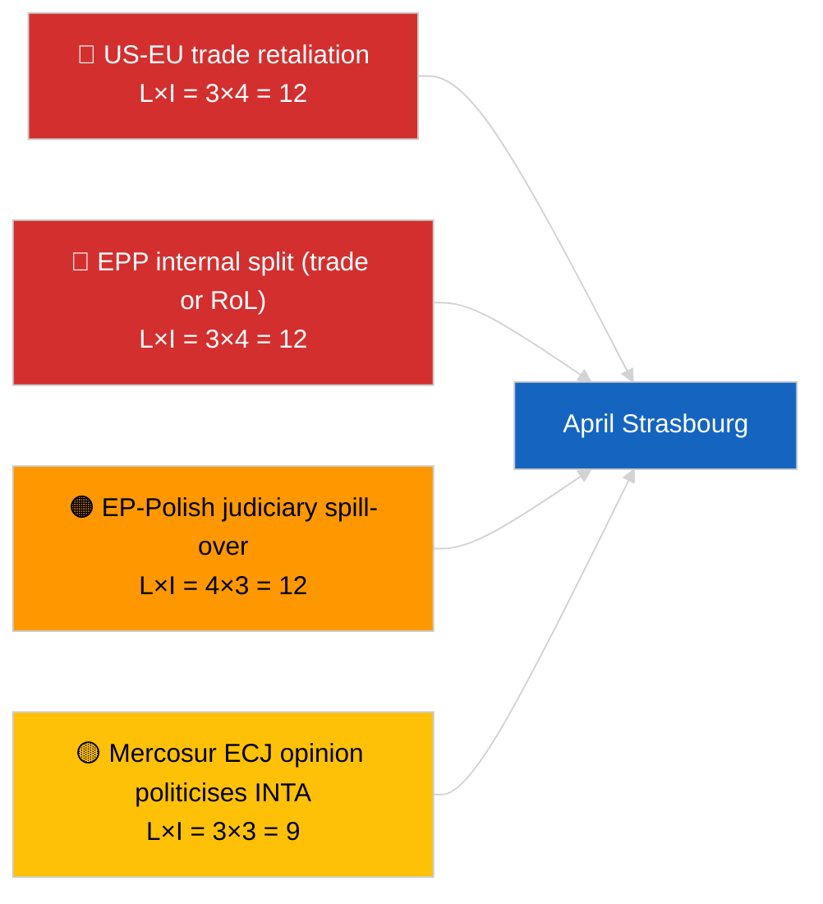

<!-- SPDX-FileCopyrightText: 2026 Hack23 AB -->
<!-- SPDX-License-Identifier: Apache-2.0 -->

# Executive Brief — Month Ahead | 2026-04-01

**Classification:** OSINT | Public Parliamentary Record
**Confidence:** 🟡 Medium (forward-looking; empty classification output limits depth)
**Generated:** 2026-04-01T00:00:00Z (retrospective brief)
**Article Type:** Month Ahead
**Run ID:** `7f928e7c-85fd-4f76-890b-f362622c3f42`
**Source:** European Parliament Open Data Portal

---

## 🎯 BLUF

**April 2026 outlook anchored on the 27-30 April Strasbourg plenary and pre-plenary committee work-week 13-17 April.** The month-ahead run returned **0 classified actors** and **ROUTINE** dimension scores, reflecting the EP's first post-March recess day rather than offering a substantive April scenario forecast. Carry-over priorities entering April: US customs-tariff follow-up (TA-10-2026-0096), EU-Mercosur ECJ opinion (pending), HDV emission-credits transposition (TA-10-2026-0084), Georgia political-prisoners implementation (TA-10-2026-0083), and ongoing Polish-judiciary spill-over from the Braun immunity precedent (TA-10-2026-0088). Three working scenarios: **Scenario A — trade-heavy agenda (55%)**, **Scenario B — rule-of-law focus (25%)**, **Scenario C — economic/industrial focus (20%)**. **🟡 MEDIUM confidence** — April agenda not yet published.

---

## 🧭 3 Decisions This Brief Supports

| # | Decision | Who Decides | Deadline | Evidence |
|:-:|----------|-------------|:--------:|----------|
| 1 | **Editorial:** publish as scenario-led month-ahead with explicit "agenda pending" caveat | Editor | +24h | Carry-over inventory; three scenarios |
| 2 | **Monitoring:** pre-plenary intelligence cycle 13-17 April (committee week) | Analyst | 2026-04-13 | First substantive April signals |
| 3 | **Forward-watch:** rerun month-ahead T-7 to plenary (~20 April) with published agenda | Analysis lead | 2026-04-20 | Confirm scenario selection |

---

## 📰 60-Second Read

- 🔴 **No new April-specific procedures or agenda items in today's feed** — Strasbourg agenda typically released T-7 days. (🟢 High)
- 🟠 **Three working scenarios** for April plenary, dominated by trade-heavy variant (55%): US customs follow-up, Mercosur opinion, digital sovereignty. (🟡 Medium)
- 🟢 **Carry-over rule-of-law track:** Braun-precedent fallout, Georgia implementation, potential additional immunity proceedings (LIBE-driven). (🟡 Medium)
- 🟡 **Economic/industrial variant:** ECB annual-report follow-up (TA-10-2026-0034), HDV transposition pushback from member states. (🟡 Medium)
- 🔵 **Economic context:** IMF April WEO release window aligns with plenary — fiscal-stress forecasts may colour MFF early debate. (🟢 High — calendar alignment)
- 🟣 **Cross-reference:** sibling 2026-04-01/breaking run documents the 6/8 advisory-feed 404 pattern that prevented this month-ahead run from producing fresh actor classification. (🟢 High)
- 🩷 **Disruption vector:** dominant-group overreach (PPE 38%) flagged HIGH by early-warning system — most likely vector for an April surprise is an EPP-internal split on trade or rule-of-law. (🟡 Medium)
- ⚪ **Carry-forward:** Better Law-Making report TA-10-2026-0063 baselines the institutional reform debate for the rest of EP10.

---

## 🗂️ Top Documents / Procedures — April Watch List

| Rank | EP reference | Title (short) | Significance | Confidence | Status |
|:----:|--------------|---------------|:------------:|:----------:|--------|
| 1 | TA-10-2026-0096 | US customs tariff adjustment | 7.5 | 🟢 HIGH | Adopted 26 March; April follow-up expected |
| 2 | TA-10-2026-0008 | EU-Mercosur ECJ referral (pending opinion) | 7.0 | 🟡 MEDIUM | Court opinion expected pre-April plenary |
| 3 | TA-10-2026-0083 | Georgia political prisoners | 6.5 | 🟢 HIGH | Implementation reporting due |
| 4 | TA-10-2026-0088 | Braun immunity (precedent for follow-on cases) | 6.5 | 🟢 HIGH | LIBE follow-up watch |
| 5 | TA-10-2026-0084 | HDV emission credits 2025-2029 | 6.0 | 🟢 HIGH | National transposition |

---

## ⚠️ Risk & Threat Snapshot — April Outlook

| Risk | L | I | Score | Trigger | Source | Admiralty |
|------|:-:|:-:|:-----:|---------|--------|:---------:|
| US-EU trade retaliation | 3 | 4 | 12 | US counter-announcement | TA-10-2026-0096 | A1 |
| EPP internal split | 3 | 4 | 12 | Visible roll-call division | Coalition arithmetic | A2 |
| EP-Polish judiciary spill-over | 4 | 3 | 12 | Further immunity case | TA-10-2026-0088 | A1 |
| Mercosur opinion politicisation | 3 | 3 | 9 | Court releases pre-plenary | TA-10-2026-0008 | A2 |
| Empty month-ahead classification | 3 | 2 | 6 | Re-run also empty 2026-04-20 | This run | B3 |

---

## 🔮 Top Forward Trigger

**Strasbourg agenda publication ~20 April 2026 (T-7).** Agenda composition will resolve the three-scenario uncertainty: trade-heavy weighting (Scenario A) confirms the dominant carry-over narrative; rule-of-law weighting (Scenario B) signals LIBE momentum from the Braun precedent; economic/industrial weighting (Scenario C) elevates ECON and ENVI files.

---

## 🛡️ Source Quality Assessment

- **Primary sources:** EP Open Data Portal — analysis run `7f928e7c-85fd-4f76-890b-f362622c3f42`; March 2026 adopted-texts inventory (carry-over).
- **Data limitations:** Today's run produced 0 actors and ROUTINE significance; forward inference is anchored to prior-day articles and EP calendar, not regenerated scenario modelling.
- **Confidence on scenario probabilities:** 🟡 Medium (qualitative weighting).
- **Confidence on carry-over priority list:** 🟢 High.

---

## 📎 Links

| Link | Path |
|------|------|
| Article | `./article.md` |
| Classification (empty) | `./classification/` |
| Sibling runs | `analysis/daily/2026-04-01/breaking/`, `committee-reports/`, `motions/`, `propositions/` |
| Source — March legislative inventory | `analysis/daily/2026-03-10/` → `2026-03-26/` |
| Manifest | `./manifest.json` |

---

## 🔄 Cross-Reference

**Prior runs:** Strasbourg 9-12 March and Brussels mini-plenary 25-26 March supply the substantive carry-over base used by this month-ahead view.

**Subsequent verification:** Compare to the post-April-plenary month-in-review (expected early May 2026) to grade scenario-call accuracy.

---

**Document Control**
- **Template:** `/analysis/templates/executive-brief.md`
- **Artifact path:** `analysis/daily/2026-04-01/month-ahead/executive-brief.md`
- **Classification:** Public
- **Retrospective generation:** Back-fill session.
