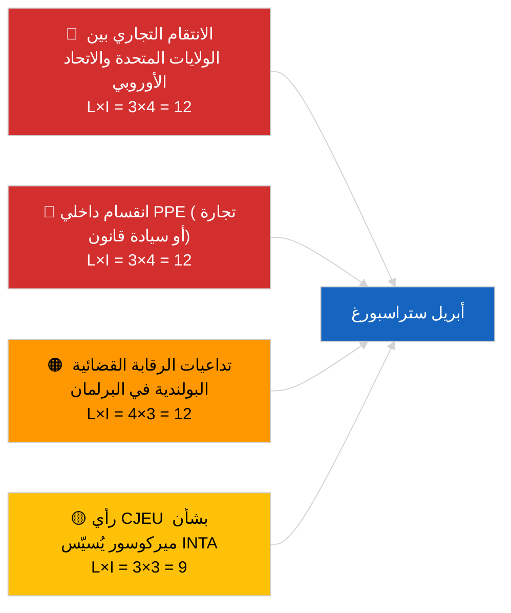

<!-- SPDX-FileCopyrightText: 2026 Hack23 AB -->
<!-- SPDX-License-Identifier: Apache-2.0 -->

# Executive Brief — الشهر القادم | 2026-04-01

**التصنيف:** OSINT | سجل برلماني عام
**مستوى الثقة:** 🟡 متوسط (استشرافي؛ إخراج التصنيف الفارغ يحدّ من العمق)
**تاريخ الإصدار:** 2026-04-01T00:00:00Z (ملخص استعادي)
**نوع المقال:** الشهر القادم
**معرّف التشغيل:** `7f928e7c-85fd-4f76-890b-f362622c3f42`
**المصدر:** بوابة البيانات المفتوحة للبرلمان الأوروبي

---

## 🎯 BLUF

**آفاق أبريل 2026 مرتبطة بجلسة البرلمان الأوروبي العامة في ستراسبورغ من 27 إلى 30 أبريل وأسبوع اللجان التحضيري من 13 إلى 17 أبريل.** أسفر تشغيل التوقعات الشهرية عن **0 جهة فاعلة مصنَّفة** ودرجات أبعاد **اعتيادية**، مما يعكس اليوم الأول للبرلمان الأوروبي بعد استراحة مارس بدلاً من تقديم توقعات سيناريو أبريل الجوهرية. الأولويات المُنقلة إلى أبريل: تعديل التعريفة الجمركية الأمريكية (TA-10-2026-0096)، رأي محكمة العدل الأوروبية بشأن اتفاقية الاتحاد الأوروبي-ميركوسور (معلّق)، نقل أرصدة انبعاثات HDV (TA-10-2026-0084)، تنفيذ قرارات السجناء السياسيين الجورجيين (TA-10-2026-0083)، والتداعيات القانونية البولندية الجارية من سابقة الحصانة لبراون (TA-10-2026-0088). ثلاثة سيناريوهات عمل: **السيناريو أ — جدول أعمال ثقيل تجاريًا (55%)**, **السيناريو ب — تركيز على سيادة القانون (25%)**, **السيناريو ج — تركيز اقتصادي/صناعي (20%)**. **🟡 ثقة متوسطة** — جدول أعمال أبريل لم يُنشر بعد.

---

## 🧭 3 قرارات يدعمها هذا الملخص

| # | القرار | من يقرر | الموعد النهائي | الأدلة |
|:-:|--------|---------|:--------------:|--------|
| 1 | **تحريري:** النشر كتوقعات شهرية قائمة على سيناريوهات مع تحفظ صريح «الجدول الزمني في الانتظار» | المحرر | +24 ساعة | المخزون المُنقل؛ ثلاثة سيناريوهات |
| 2 | **المراقبة:** دورة استخبارات ما قبل الجلسة 13-17 أبريل (أسبوع اللجان) | المحلل | 2026-04-13 | أولى إشارات أبريل الجوهرية |
| 3 | **مراقبة استشرافية:** إعادة تشغيل التوقعات الشهرية T-7 للجلسة (~20 أبريل) مع جدول الأعمال المنشور | رئيس التحليل | 2026-04-20 | تأكيد اختيار السيناريو |

---

## 📰 قراءة 60 ثانية

- 🔴 **لا إجراءات أو نقاط جدول أعمال جديدة خاصة بأبريل في التغذية اليومية** — يُنشر جدول أعمال ستراسبورغ عادةً قبل T-7 أيام. (🟢 مرتفع)
- 🟠 **ثلاثة سيناريوهات عمل** للجلسة العامة في أبريل، يهيمن عليها المتغير التجاري (55%): تعديل رسوم جمركية أمريكية، رأي ميركوسور، السيادة الرقمية. (🟡 متوسط)
- 🟢 **مسار سيادة القانون المُنقل:** تداعيات سابقة براون، تنفيذ قرارات جورجيا، إجراءات حصانة إضافية محتملة (مدفوعة من LIBE). (🟡 متوسط)
- 🟡 **المتغير الاقتصادي/الصناعي:** متابعة التقرير السنوي للبنك المركزي الأوروبي (TA-10-2026-0034)، مقاومة الدول الأعضاء لنقل HDV. (🟡 متوسط)
- 🔵 **السياق الاقتصادي:** نافذة نشر تقرير IMF WEO لأبريل تتزامن مع الجلسة العامة — قد تلوّن توقعات ضغط المالية العامة النقاش المبكر حول الإطار المالي متعدد السنوات. (🟢 مرتفع — توافق التقويم)
- 🟣 **الإسناد المتقاطع:** وثّق تشغيل 2026-04-01/breaking نمط خطأ 404 في 6/8 من تغذيات الاستشارات مما منع هذا التشغيل من إنتاج تصنيفات جهات فاعلة جديدة. (🟢 مرتفع)
- 🩷 **متجه التعطيل:** سُجِّل تغلّب مجموعة PPE المهيمنة (38%) كمخاطر مرتفعة من قِبل نظام الإنذار المبكر — أرجح متجه لمفاجأة أبريل هو انقسام داخلي في EPP حول التجارة أو سيادة القانون. (🟡 متوسط)
- ⚪ **الترحيل:** يرسي تقرير «التشريع الأفضل» TA-10-2026-0063 خط الأساس لنقاش إصلاح المؤسسات لبقية EP10.

---

## 🗂️ أهم الوثائق / الإجراءات — قائمة مراقبة أبريل

| الترتيب | المرجع البرلماني | العنوان (مختصر) | الأهمية | مستوى الثقة | الحالة |
|:-------:|-----------------|-----------------|:-------:|:-----------:|--------|
| 1 | TA-10-2026-0096 | تعديل التعريفة الجمركية الأمريكية | 7.5 | 🟢 مرتفع | تمت الموافقة في 26 مارس؛ المتابعة في أبريل متوقعة |
| 2 | TA-10-2026-0008 | إحالة EU-Mercosur إلى محكمة العدل الأوروبية (الرأي معلّق) | 7.0 | 🟡 متوسط | الرأي القضائي متوقع قبل الجلسة العامة في أبريل |
| 3 | TA-10-2026-0083 | السجناء السياسيون الجورجيون | 6.5 | 🟢 مرتفع | تقارير التنفيذ مستحقة |
| 4 | TA-10-2026-0088 | حصانة براون (سابقة للقضايا اللاحقة) | 6.5 | 🟢 مرتفع | مراقبة متابعة LIBE |
| 5 | TA-10-2026-0084 | أرصدة انبعاثات HDV 2025–2029 | 6.0 | 🟢 مرتفع | النقل الوطني |

---

## ⚠️ لقطة المخاطر والتهديدات — آفاق أبريل

| المخاطرة | L | I | النتيجة | المحفّز | المصدر | الأدميرالية |
|----------|:-:|:-:|:-------:|---------|--------|:-----------:|
| الانتقام التجاري بين الولايات المتحدة والاتحاد الأوروبي | 3 | 4 | 12 | إعلان مضاد أمريكي | TA-10-2026-0096 | A1 |
| الانقسام الداخلي EPP | 3 | 4 | 12 | انقسام تصويت مرئي | حسابات الائتلاف | A2 |
| التداعيات القضائية البولندية في البرلمان | 4 | 3 | 12 | قضية حصانة إضافية | TA-10-2026-0088 | A1 |
| تسييس رأي ميركوسور | 3 | 3 | 9 | المحكمة تنشر قبل الجلسة | TA-10-2026-0008 | A2 |
| تصنيف التوقعات الشهرية الفارغ | 3 | 2 | 6 | إعادة التشغيل فارغة أيضًا 2026-04-20 | هذا التشغيل | B3 |

---

## 🔮 أهم المحفّزات الاستشرافية

**نشر جدول أعمال ستراسبورغ ~20 أبريل 2026 (T-7).** ستُحسم عدم اليقين المتعلقة بالسيناريوهات الثلاثة من خلال تكوين جدول الأعمال: الترجيح التجاري الثقيل (السيناريو أ) يؤكد الرواية المهيمنة المُنقلة؛ ترجيح سيادة القانون (السيناريو ب) يشير إلى زخم LIBE من سابقة براون؛ الترجيح الاقتصادي/الصناعي (السيناريو ج) يرفع ملفات ECON و ENVI.

---

## 🛡️ تقييم جودة المصادر

- **المصادر الأولية:** بوابة البيانات المفتوحة للبرلمان الأوروبي — تشغيل التحليل `7f928e7c-85fd-4f76-890b-f362622c3f42`؛ مخزون نصوص مارس 2026 المعتمدة (مُنقل).
- **قيود البيانات:** أسفر تشغيل اليوم عن 0 جهة فاعلة وأهمية اعتيادية؛ الاستنتاج الاستشرافي مرتكز على مقالات اليوم السابق وتقويم البرلمان الأوروبي، لا على نمذجة سيناريوهات متجددة.
- **الثقة في احتمالات السيناريوهات:** 🟡 متوسط (ترجيح نوعي).
- **الثقة في قائمة الأولويات المُنقلة:** 🟢 مرتفع.

---

## 📎 الروابط

| الرابط | المسار |
|--------|--------|
| المقال | `./article.md` |
| التصنيف (فارغ) | `./classification/` |
| التشغيلات الشقيقة | `analysis/daily/2026-04-01/breaking/`, `committee-reports/`, `motions/`, `propositions/` |
| المصدر — مخزون تشريعات مارس | `analysis/daily/2026-03-10/` → `2026-03-26/` |
| الملف التعريفي | `./manifest.json` |

---

## 🔄 الإسناد المتقاطع

**التشغيلات السابقة:** توفر جلسة ستراسبورغ 9-12 مارس وجلسة بروكسل العامة المصغرة 25-26 مارس القاعدة المُنقلة الجوهرية التي تستخدمها توقعات هذا الشهر.

**التحقق اللاحق:** المقارنة مع مراجعة ما بعد جلسة أبريل العامة الشهرية (متوقعة في مطلع مايو 2026) لتقييم دقة توقعات السيناريو.

---

**التحكم في الوثيقة**
- **القالب:** `/analysis/templates/executive-brief.md`
- **مسار الأداة:** `analysis/daily/2026-04-01/month-ahead/executive-brief.md`
- **التصنيف:** عام
- **الإنتاج الاستعادي:** جلسة الملء السابق للتاريخ.
