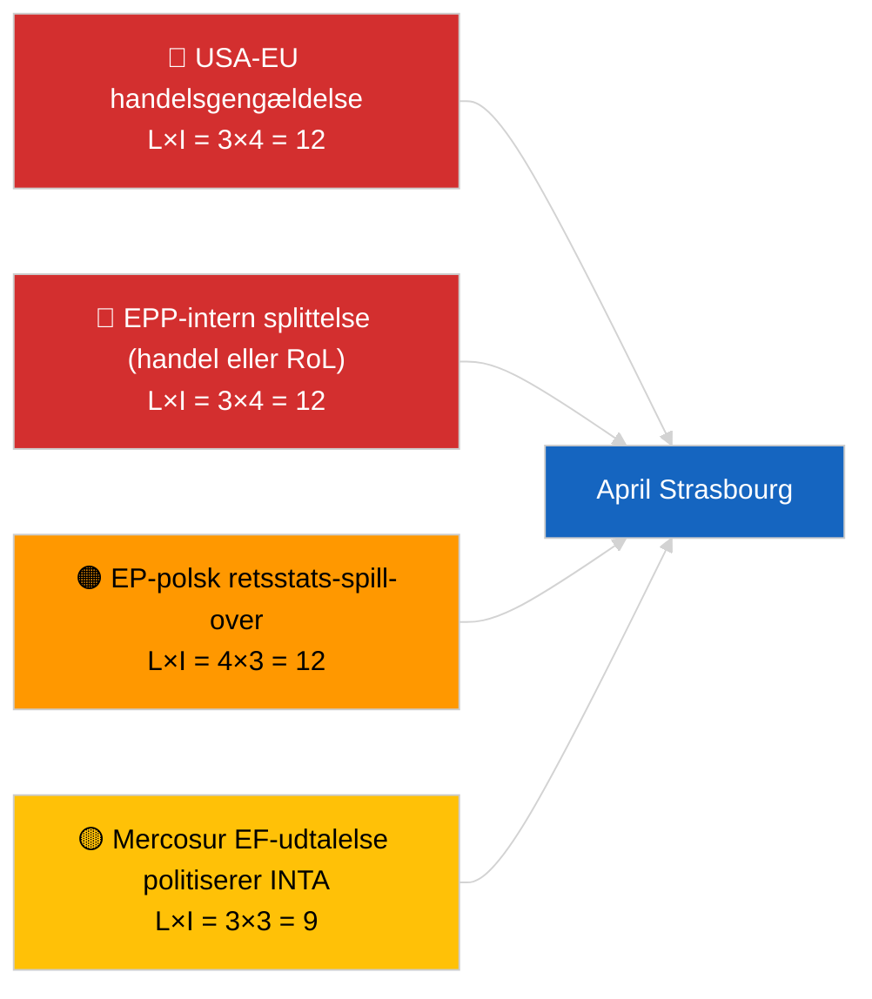

<!-- SPDX-FileCopyrightText: 2026 Hack23 AB -->
<!-- SPDX-License-Identifier: Apache-2.0 -->

# Executive Brief — Kommende Måned | 2026-04-01

**Klassifikation:** OSINT | Offentlig parlamentarisk optegnelse
**Konfidensgrad:** 🟡 Middel (fremadskuende; tom klassificeringsoutput begrænser dybden)
**Genereret:** 2026-04-01T00:00:00Z (retrospektivt notat)
**Artikeltype:** Kommende Måned
**Kørsel-ID:** `7f928e7c-85fd-4f76-890b-f362622c3f42`
**Kilde:** Europa-Parlamentets åbne dataportal

---

## 🎯 BLUF

**Apriludsigterne for 2026 er forankret i Strasbourg-plenarsamlingen 27.–30. april og den forberedende udvalgsvecka 13.–17. april.** Måneds-fremsyn-kørslen returnerede **0 klassificerede aktører** og **RUTINE**-dimensionsscorer, hvilket afspejler Europa-Parlamentets første dag efter marts-pausen frem for en substantiel aprilscenario-prognose. Overførte prioriteter ind i april: USA's toldtarif-tilpasning (TA-10-2026-0096), EU-Mercosur EF-domstolsudtalelse (afventende), HDV-emissionskreditter transponering (TA-10-2026-0084), implementering af georgiske politiske fanger (TA-10-2026-0083), og igangværende polsk-retlige følgevirkninger fra Braun-immunitets-præcedensen (TA-10-2026-0088). Tre arbejdsscenarier: **Scenarie A — handelstungt program (55%)**, **Scenarie B — retsstatsfokus (25%)**, **Scenarie C — økonomisk/industrielt fokus (20%)**. **🟡 MIDDEL konfidensgrad** — aprilprogrammet er endnu ikke offentliggjort.

---

## 🧭 3 Beslutninger Dette Notat Understøtter

| # | Beslutning | Hvem beslutter | Deadline | Dokumentation |
|:-:|-----------|---------------|:--------:|---------------|
| 1 | **Redaktionel:** udgiv som scenariedrevet måneds-fremsyn med eksplicit "program afventes"-forbehold | Redaktør | +24h | Overført inventar; tre scenarier |
| 2 | **Overvågning:** for-plenar efterretningscyklus 13.–17. april (udvalgsuge) | Analytiker | 2026-04-13 | Første substantielle aprilsignaler |
| 3 | **Fremadrettet bevakning:** kør måneds-fremsyn igen T-7 til plenar (~20. april) med offentliggjort program | Analyseansvarlig | 2026-04-20 | Bekræft scenarievalg |

---

## 📰 60-Sekunders Læsning

- 🔴 **Ingen nye aprilspecifikke procedurer eller dagsordenspunkter i dagens feed** — Strasbourg-programmet offentliggøres typisk T-7 dage. (🟢 Høj)
- 🟠 **Tre arbejdsscenarier** for aprilplenarsamlingen, domineret af handelstung variant (55%): USA's toldtilpasning, Mercosur-udtalelse, digital suverænitet. (🟡 Middel)
- 🟢 **Overført retsstatsspor:** Braun-præcedensens eftervirkninger, Georgien-implementering, potentielle yderligere immunitetsforhandlinger (LIBE-drevet). (🟡 Middel)
- 🟡 **Økonomisk/industriel variant:** ECB's årsrapport-opfølgning (TA-10-2026-0034), HDV-transponeringmodstand fra medlemsstater. (🟡 Middel)
- 🔵 **Økonomisk kontekst:** IMF april WEO-offentliggørelsevinduet sammenfalder med plenarsamlingen — skattemæssige stressudsigter kan farve den tidlige MFF-debat. (🟢 Høj — kalenderoverlapning)
- 🟣 **Krydsreference:** søskende-kørslen 2026-04-01/breaking dokumenterer 6/8 404-fejlsmønstret i rådgivningsfeedet, som hindrede denne måneds-fremsyn-kørsel i at producere ny aktørklassificering. (🟢 Høj)
- 🩷 **Forstyrrelsesvektor:** dominerende-gruppe-overgreb (PPE 38%) markeret HØJ af det tidlige varslingssystem — sandsynligste vektor for en apriloverraskelse er en EPP-intern splittelse om handel eller retsstat. (🟡 Middel)
- ⚪ **Fremadrettet overførsel:** Bedre lovgivning-rapporten TA-10-2026-0063 fastlægger baseline for den institutionelle reformdebat for resten af EP10.

---

## 🗂️ Topdokumenter / Procedurer — Aprilovervågningsliste

| Rang | EP-reference | Titel (kort) | Betydning | Konfidensgrad | Status |
|:----:|--------------|--------------|:---------:|:-------------:|--------|
| 1 | TA-10-2026-0096 | USA's toldtarifjustering | 7,5 | 🟢 HØJ | Vedtaget 26. marts; aprilopfølgning forventet |
| 2 | TA-10-2026-0008 | EU-Mercosur EF-domstolshenskydning (afventer udtalelse) | 7,0 | 🟡 MIDDEL | Domstolsudtalelse forventes inden aprilplenarsamlingen |
| 3 | TA-10-2026-0083 | Georgiske politiske fanger | 6,5 | 🟢 HØJ | Implementeringsrapportering forfalder |
| 4 | TA-10-2026-0088 | Braun-immunitet (præcedens for efterfølgende sager) | 6,5 | 🟢 HØJ | LIBE-opfølgningsbevakning |
| 5 | TA-10-2026-0084 | HDV-emissionskreditter 2025–2029 | 6,0 | 🟢 HØJ | National transponering |

---

## ⚠️ Risiko- og Trusselbillede — Apriludsigt

| Risiko | L | I | Score | Udløser | Kilde | Admiralitet |
|--------|:-:|:-:|:-----:|---------|-------|:-----------:|
| USA-EU handelsgengældelse | 3 | 4 | 12 | USA's modmeddelelse | TA-10-2026-0096 | A1 |
| EPP-intern splittelse | 3 | 4 | 12 | Synlig afstemningsdivision | Koalitionsaritmetik | A2 |
| EP-polsk retsstats-spill-over | 4 | 3 | 12 | Yderligere immunitetsssag | TA-10-2026-0088 | A1 |
| Mercosur-udtalelse politisering | 3 | 3 | 9 | Domstol offentliggør forud for plenar | TA-10-2026-0008 | A2 |
| Tom måneds-fremsyn-klassificering | 3 | 2 | 6 | Genkørsel også tom 2026-04-20 | Denne kørsel | B3 |

---

## 🔮 Vigtigste Fremtidige Udløser

**Strasbourgs programoffentliggørelse ~20. april 2026 (T-7).** Programmets sammensætning vil løse den tre-scenarios-usikkerhed: handelstung vægtning (Scenarie A) bekræfter den dominerende overførte narrativ; retsstatsvægtning (Scenarie B) signalerer LIBE-momentum fra Braun-præcedensen; økonomisk/industriel vægtning (Scenarie C) løfter ECON- og ENVI-filer.

---

## 🛡️ Vurdering af Kildekvalitet

- **Primære kilder:** Europa-Parlamentets åbne dataportal — analysekørsel `7f928e7c-85fd-4f76-890b-f362622c3f42`; marts 2026 vedtagne-tekster-inventar (overført).
- **Databegrænsninger:** Dagens kørsel producerede 0 aktører og RUTINE-signifikans; fremadrettet inferens er forankret til foregående dags artikler og EP's kalender, ikke regenereret scenariemodellering.
- **Konfidensgrad for scenarieprobabiliteter:** 🟡 Middel (kvalitativ vægtning).
- **Konfidensgrad for overført prioriteringsliste:** 🟢 Høj.

---

## 📎 Links

| Link | Sti |
|------|-----|
| Artikel | `./article.md` |
| Klassificering (tom) | `./classification/` |
| Søskende-kørsler | `analysis/daily/2026-04-01/breaking/`, `committee-reports/`, `motions/`, `propositions/` |
| Kilde — marts lovgivningsinventar | `analysis/daily/2026-03-10/` → `2026-03-26/` |
| Manifest | `./manifest.json` |

---

## 🔄 Krydsreference

**Tidligere kørsler:** Strasbourg 9.–12. marts og Bruxelles mini-plenarsamling 25.–26. marts leverer den substantielle overførte base, der bruges af dette måneds-fremsyn.

**Efterfølgende verifikation:** Sammenlign med post-april-plenar månedsoversigten (forventes tidligt maj 2026) for at bedømme scenariekald-nøjagtigheden.

---

**Dokumentkontrol**
- **Skabelon:** `/analysis/templates/executive-brief.md`
- **Artefaktsti:** `analysis/daily/2026-04-01/month-ahead/executive-brief.md`
- **Klassifikation:** Offentlig
- **Retrospektiv generering:** Tilbagedateret session.
