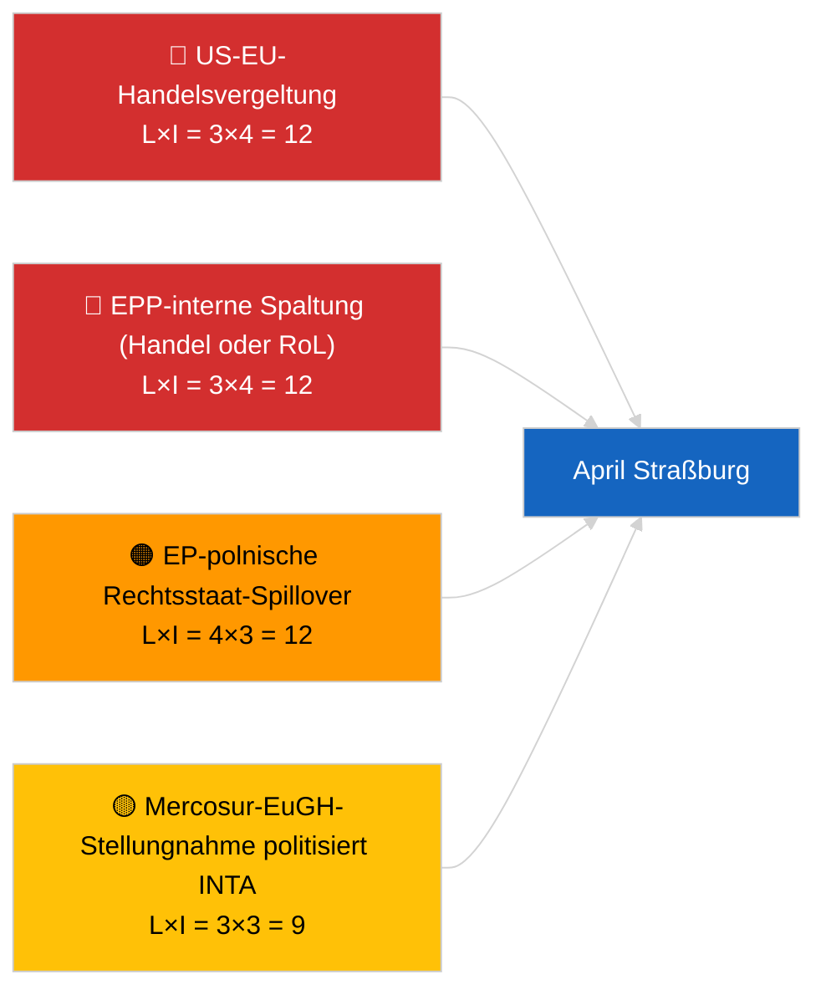

<!-- SPDX-FileCopyrightText: 2026 Hack23 AB -->
<!-- SPDX-License-Identifier: Apache-2.0 -->

# Executive Brief — Ausblick Nächsten Monat | 2026-04-01

**Klassifizierung:** OSINT | Öffentliches Parlamentsprotokoll
**Konfidenzgrad:** 🟡 Mittel (zukunftsorientiert; leere Klassifizierungsausgabe begrenzt die Tiefe)
**Erstellt:** 2026-04-01T00:00:00Z (retrospektiver Brief)
**Artikeltyp:** Ausblick Nächsten Monat
**Ausführungs-ID:** `7f928e7c-85fd-4f76-890b-f362622c3f42`
**Quelle:** Offenes Datenportal des Europäischen Parlaments

---

## 🎯 BLUF

**Die April-2026-Aussichten sind auf die Straßburger Plenarsitzung 27.–30. April und die vorbereitende Ausschusswoche 13.–17. April ausgerichtet.** Der Monatsvorschau-Lauf lieferte **0 klassifizierte Akteure** und **ROUTINE**-Dimensionsbewertungen, was den ersten Tag des Europäischen Parlaments nach der März-Pause widerspiegelt und keine substanzielle April-Szenario-Prognose bietet. Übertragene Prioritäten in den April hinein: US-Zolltarifanpassung (TA-10-2026-0096), EU-Mercosur-EuGH-Stellungnahme (ausstehend), HDV-Emissionsgutschriften-Umsetzung (TA-10-2026-0084), Umsetzung georgischer politischer Gefangener (TA-10-2026-0083) und laufende polnisch-rechtliche Nachwirkungen aus dem Braun-Immunitätspräzedenzfall (TA-10-2026-0088). Drei Arbeitsszenarien: **Szenario A — handelschwere Tagesordnung (55%)**, **Szenario B — Rechtsstaatsfokus (25%)**, **Szenario C — wirtschaftlicher/industrieller Fokus (20%)**. **🟡 MITTLERER Konfidenzgrad** — April-Tagesordnung noch nicht veröffentlicht.

---

## 🧭 3 Entscheidungen, die dieser Brief unterstützt

| # | Entscheidung | Wer entscheidet | Frist | Belege |
|:-:|-------------|----------------|:-----:|--------|
| 1 | **Redaktionell:** als szenariogeleitete Monatsvorschau mit ausdrücklichem „Tagesordnung ausstehend"-Vorbehalt veröffentlichen | Redakteur | +24h | Übertragenes Inventar; drei Szenarien |
| 2 | **Überwachung:** Vor-Plenar-Geheimdienstzyklus 13.–17. April (Ausschusswoche) | Analyst | 2026-04-13 | Erste substanzielle April-Signale |
| 3 | **Vorausschauende Überwachung:** Monatsvorschau T-7 vor Plenar (~20. April) mit veröffentlichter Tagesordnung erneut ausführen | Analyseverantwortlicher | 2026-04-20 | Szenarioauswahl bestätigen |

---

## 📰 60-Sekunden-Lesung

- 🔴 **Keine neuen aprilspezifischen Verfahren oder Tagesordnungspunkte im heutigen Feed** — Straßburger Tagesordnung wird typischerweise T-7 Tage veröffentlicht. (🟢 Hoch)
- 🟠 **Drei Arbeitsszenarien** für die April-Plenarsitzung, dominiert von handelschwerer Variante (55%): US-Zollanpassung, Mercosur-Stellungnahme, digitale Souveränität. (🟡 Mittel)
- 🟢 **Übertragene Rechtsstaatsspur:** Nachwirkungen des Braun-Präzedenzfalls, Georgien-Umsetzung, potenzielle zusätzliche Immunitätsverfahren (LIBE-gesteuert). (🟡 Mittel)
- 🟡 **Wirtschaftliche/industrielle Variante:** EZB-Jahresbericht-Folgeaufgaben (TA-10-2026-0034), HDV-Umsetzungswiderstand von Mitgliedstaaten. (🟡 Mittel)
- 🔵 **Wirtschaftlicher Kontext:** IMF April-WEO-Veröffentlichungsfenster fällt mit der Plenarsitzung zusammen — fiskalische Stressprognosen können die frühe MFR-Debatte prägen. (🟢 Hoch — Kalenderabstimmung)
- 🟣 **Querverweise:** Der Geschwister-Lauf 2026-04-01/breaking dokumentiert das 6/8 Advisory-Feed-404-Muster, das diesen Monatsvorschau-Lauf daran hinderte, eine neue Akteurklassifizierung zu produzieren. (🟢 Hoch)
- 🩷 **Störungsvektor:** Dominante-Gruppe-Übergriff (PPE 38%) wurde vom Frühwarnsystem als HOCH eingestuft — wahrscheinlichster Vektor für eine April-Überraschung ist eine EPP-interne Spaltung bei Handel oder Rechtsstaat. (🟡 Mittel)
- ⚪ **Weitergabe:** Der Bericht „Bessere Rechtsetzung" TA-10-2026-0063 legt die Baseline für die institutionelle Reformdebatte für den Rest von EP10 fest.

---

## 🗂️ Top-Dokumente / Verfahren — April-Überwachungsliste

| Rang | EP-Referenz | Titel (kurz) | Bedeutung | Konfidenzgrad | Status |
|:----:|-------------|--------------|:---------:|:-------------:|--------|
| 1 | TA-10-2026-0096 | US-Zolltarifanpassung | 7,5 | 🟢 HOCH | Angenommen am 26. März; April-Folgeaufgaben erwartet |
| 2 | TA-10-2026-0008 | EU-Mercosur-EuGH-Vorlage (Stellungnahme ausstehend) | 7,0 | 🟡 MITTEL | Gerichtliche Stellungnahme vor April-Plenar erwartet |
| 3 | TA-10-2026-0083 | Georgische politische Gefangene | 6,5 | 🟢 HOCH | Umsetzungsberichterstattung fällig |
| 4 | TA-10-2026-0088 | Braun-Immunität (Präzedenzfall für Folgesachen) | 6,5 | 🟢 HOCH | LIBE-Folgeüberwachung |
| 5 | TA-10-2026-0084 | HDV-Emissionsgutschriften 2025–2029 | 6,0 | 🟢 HOCH | Nationale Umsetzung |

---

## ⚠️ Risiko- und Bedrohungsüberblick — April-Aussicht

| Risiko | L | I | Punkte | Auslöser | Quelle | Admiralität |
|--------|:-:|:-:|:------:|---------|--------|:-----------:|
| US-EU-Handelsvergeltung | 3 | 4 | 12 | US-Gegenmitteilung | TA-10-2026-0096 | A1 |
| EPP-interne Spaltung | 3 | 4 | 12 | Sichtbare Abstimmungsdivision | Koalitionsarithmetik | A2 |
| EP-polnische Rechtsstaat-Spillover | 4 | 3 | 12 | Weiterer Immunitätsfall | TA-10-2026-0088 | A1 |
| Mercosur-Stellungnahme-Politisierung | 3 | 3 | 9 | Gericht veröffentlicht vor Plenar | TA-10-2026-0008 | A2 |
| Leere Monatsvorschau-Klassifizierung | 3 | 2 | 6 | Wiederholung ebenfalls leer 2026-04-20 | Dieser Lauf | B3 |

---

## 🔮 Wichtigster Vorwärts-Auslöser

**Straßburger Tagesordnungsveröffentlichung ~20. April 2026 (T-7).** Die Zusammensetzung der Tagesordnung wird die Drei-Szenario-Unsicherheit auflösen: handelsschwere Gewichtung (Szenario A) bestätigt die dominierende übertragene Erzählung; Rechtsstaat-Gewichtung (Szenario B) signalisiert LIBE-Momentum aus dem Braun-Präzedenzfall; wirtschaftliche/industrielle Gewichtung (Szenario C) hebt ECON- und ENVI-Dateien an.

---

## 🛡️ Quellenqualitätsbewertung

- **Primärquellen:** Offenes Datenportal des Europäischen Parlaments — Analyselauf `7f928e7c-85fd-4f76-890b-f362622c3f42`; März 2026 Inventar angenommener Texte (übertragen).
- **Datenbeschränkungen:** Der heutige Lauf produzierte 0 Akteure und ROUTINE-Signifikanz; vorausschauende Schlussfolgerung basiert auf Artikeln des Vortags und EP-Kalender, nicht auf regenerierter Szenariomodellierung.
- **Konfidenz bei Szenariowahrscheinlichkeiten:** 🟡 Mittel (qualitative Gewichtung).
- **Konfidenz bei der übertragenen Prioritätenliste:** 🟢 Hoch.

---

## 📎 Links

| Link | Pfad |
|------|------|
| Artikel | `./article.md` |
| Klassifizierung (leer) | `./classification/` |
| Geschwister-Läufe | `analysis/daily/2026-04-01/breaking/`, `committee-reports/`, `motions/`, `propositions/` |
| Quelle — März-Gesetzgebungsinventar | `analysis/daily/2026-03-10/` → `2026-03-26/` |
| Manifest | `./manifest.json` |

---

## 🔄 Querverweis

**Frühere Läufe:** Straßburg 9.–12. März und Brüsseler Mini-Plenarsitzung 25.–26. März liefern die substanzielle übertragene Basis, die von dieser Monatsvorschau verwendet wird.

**Nachfolgende Überprüfung:** Mit der Post-April-Plenar-Monatsübersicht (erwartet Anfang Mai 2026) vergleichen, um die Genauigkeit der Szenario-Prognose zu bewerten.

---

**Dokumentenkontrolle**
- **Vorlage:** `/analysis/templates/executive-brief.md`
- **Artefaktpfad:** `analysis/daily/2026-04-01/month-ahead/executive-brief.md`
- **Klassifizierung:** Öffentlich
- **Retrospektive Erstellung:** Nachfüllungssitzung.
